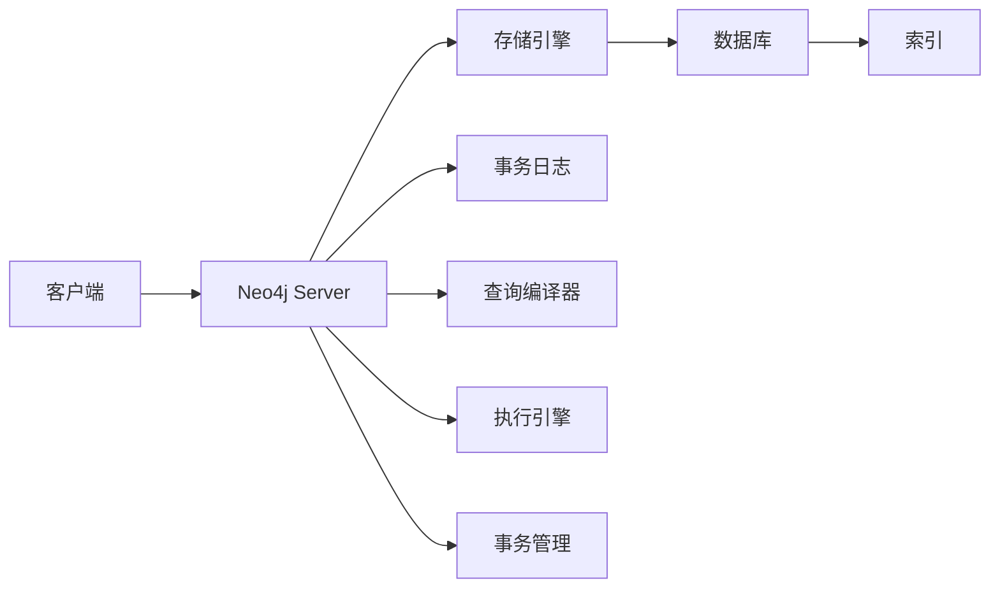

# Neo4j原理与代码实例讲解

> 关键词：Neo4j, 图数据库, 图算法, 图遍历, Cypher查询语言, 顶点，边，图遍历，路径查询

## 1. 背景介绍

随着数据量的爆炸性增长，传统的数据库管理系统（如关系数据库）在处理复杂、关联性强的数据时逐渐显得力不从心。图数据库作为一种新兴的数据库类型，以其强大的图结构数据建模能力和高效的图算法支持，成为了处理复杂关系型数据的新宠。Neo4j作为图数据库的佼佼者，其独特的图存储引擎、Cypher查询语言和丰富的图算法库，使其在社交网络、知识图谱、推荐系统等领域得到了广泛应用。

本文将深入浅出地讲解Neo4j的原理，并辅以代码实例，帮助读者理解其核心概念和用法。

## 2. 核心概念与联系

### 2.1 核心概念

- **图（Graph）**：由顶点（Vertex，也称为节点）和边（Edge，也称为关系）组成的数据结构。顶点代表实体，边代表实体之间的关系。
- **属性（Property）**：附加在顶点和边上的键值对，用于存储实体的额外信息。
- **标签（Label）**：用于对具有相同属性的顶点进行分类的名称。

### 2.2 架构图

Neo4j的架构可以简化为以下流程：



- **客户端**：通过REST API或Bolt协议与Neo4j Server交互。
- **Neo4j Server**：作为中间层，处理客户端请求，并调用存储引擎和事务管理器。
- **存储引擎**：负责图数据的存储和索引。
- **数据库**：存储实际的数据，包括顶点、边和属性。
- **索引**：提高查询效率。
- **事务日志**：确保数据持久化和一致性。
- **查询编译器**：将Cypher查询语句转换为查询计划。
- **执行引擎**：执行查询计划，生成结果。
- **事务管理**：处理事务的创建、提交和回滚。

## 3. 核心算法原理 & 具体操作步骤

### 3.1 算法原理概述

Neo4j的核心算法原理是图遍历，包括：

- **深度优先搜索（DFS）**：从某个顶点出发，沿着一条路径遍历，直到路径的尽头，再回溯到之前的顶点，从下一个路径继续遍历。
- **广度优先搜索（BFS）**：从某个顶点出发，按照遍历顺序访问相邻的顶点，然后再访问下一层级的相邻顶点，直到遍历完所有可达顶点。

### 3.2 算法步骤详解

#### 3.2.1 深度优先搜索（DFS）

假设我们要从顶点 `v` 出发，进行深度优先搜索，以下是Neo4j的Cypher查询语句：

```cypher
MATCH (v)-[:RELATION_TYPE]->(w) 
RETURN w
```

其中，`RELATION_TYPE` 是关系类型，`w` 是遍历到的下一个顶点。

#### 3.2.2 广度优先搜索（BFS）

假设我们要从顶点 `v` 出发，进行广度优先搜索，以下是Neo4j的Cypher查询语句：

```cypher
MATCH p = (v)-[*]->(w)
RETURN w, length(p)
```

其中，`[*]` 表示任意长度的关系路径，`w` 是遍历到的下一个顶点，`length(p)` 表示路径的长度。

### 3.3 算法优缺点

- **DFS**：适用于查找深度较浅的路径，但在处理大数据集时效率较低。
- **BFS**：适用于查找较短的路径，但处理深度较深的路径时可能会花费较长时间。

### 3.4 算法应用领域

- **社交网络**：分析用户之间的社交关系，推荐好友、广告等。
- **推荐系统**：分析用户行为，推荐商品、电影等。
- **知识图谱**：存储和查询实体之间的关系，构建智能问答系统。

## 4. 数学模型和公式 & 详细讲解 & 举例说明

### 4.1 数学模型构建

Neo4j的图数据可以表示为以下数学模型：

$$
G = (V, E, P)
$$

其中：

- $V$：顶点集合，包含所有顶点。
- $E$：边集合，包含所有边。
- $P$：属性集合，包含所有顶点和边的属性。

### 4.2 公式推导过程

Neo4j的Cypher查询语句会根据图模型进行相应的计算和推导。

### 4.3 案例分析与讲解

假设我们要查询所有与顶点 `v` 直接相连的顶点及其关系类型，以下是Neo4j的Cypher查询语句：

```cypher
MATCH (v)-[:FRIEND]->(w)
RETURN w, TYPE(v)
```

其中，`FRIEND` 是关系类型，`w` 是与 `v` 直接相连的顶点，`TYPE(v)` 是 `v` 的标签。

## 5. 项目实践：代码实例和详细解释说明

### 5.1 开发环境搭建

1. 下载并安装Neo4j。
2. 启动Neo4j Server。
3. 使用Cypher Shell或Neo4j Browser连接到Neo4j Server。

### 5.2 源代码详细实现

假设我们要创建一个简单的社交网络图，包含三个用户和两个关系：

```cypher
CREATE (a:USER {name: 'Alice', age: 25})
CREATE (b:USER {name: 'Bob', age: 30})
CREATE (c:USER {name: 'Charlie', age: 35})
CREATE (a)-[:FRIEND]->(b)
CREATE (b)-[:FRIEND]->(c)
```

### 5.3 代码解读与分析

以上代码创建了三个用户节点，并为 `Alice` 和 `Bob`、`Bob` 和 `Charlie` 建立了 `FRIEND` 关系。

### 5.4 运行结果展示

在Neo4j Browser中执行以上代码后，我们可以看到以下结果：

```
Statement
CREATE (a:USER {name: 'Alice', age: 25})
Executed in 0 ms

Statement
CREATE (b:USER {name: 'Bob', age: 30})
Executed in 0 ms

Statement
CREATE (c:USER {name: 'Charlie', age: 35})
Executed in 0 ms

Statement
CREATE (a)-[:FRIEND]->(b)
Executed in 0 ms

Statement
CREATE (b)-[:FRIEND]->(c)
Executed in 0 ms
```

这表示代码执行成功。

## 6. 实际应用场景

### 6.1 社交网络

Neo4j在社交网络领域的应用非常广泛，例如：

- 用户推荐：根据用户之间的关系推荐好友。
- 广告推荐：根据用户的关系和兴趣推荐广告。
- 社交分析：分析用户之间的关系，挖掘潜在的用户群体。

### 6.2 知识图谱

Neo4j在知识图谱领域的应用也非常广泛，例如：

- 智能问答：根据用户的提问，从知识图谱中查询答案。
- 命名实体识别：识别文本中的实体和实体之间的关系。
- 知识关联分析：分析实体之间的关系，挖掘新的知识。

### 6.4 未来应用展望

随着图数据库和图算法技术的不断发展，Neo4j在更多领域将发挥重要作用，例如：

- 金融风控：分析客户之间的交易关系，识别欺诈行为。
- 健康医疗：分析患者之间的疾病关系，进行疾病预测。
- 物联网：分析设备之间的连接关系，优化网络拓扑结构。

## 7. 工具和资源推荐

### 7.1 学习资源推荐

- Neo4j官方文档：https://neo4j.com/docs/
- Neo4j教程：https://wwwneo4j.com/learn/
- Cypher教程：https://neo4j.com/developer/cypher-tutorials/

### 7.2 开发工具推荐

- Neo4j Browser：https://neo4j.com/products/neo4j-browser/
- Neo4j Desktop：https://neo4j.com/products/neo4j-desktop/

### 7.3 相关论文推荐

- Neo4j论文：https://neo4j.com/insights/publications/

## 8. 总结：未来发展趋势与挑战

### 8.1 研究成果总结

本文深入浅出地介绍了Neo4j的原理和用法，并通过代码实例展示了其图遍历和查询功能。同时，还探讨了Neo4j在实际应用场景中的优势和发展前景。

### 8.2 未来发展趋势

- 图数据库技术将继续发展，支持更多类型的图结构和图算法。
- Neo4j将与其他人工智能技术深度融合，如自然语言处理、机器学习等。
- Neo4j将更加注重性能优化，提高查询速度和资源利用率。

### 8.3 面临的挑战

- 图数据库的存储和索引技术需要进一步优化，以支持更大的图数据。
- 图算法的复杂度和效率需要进一步提高，以满足实际应用的需求。
- 图数据库的安全性和隐私保护需要得到加强。

### 8.4 研究展望

Neo4j作为一种优秀的图数据库，将继续在图数据库和图算法领域发挥重要作用。未来，Neo4j将与其他人工智能技术深度融合，为解决复杂关系型数据问题提供更加高效、智能的解决方案。

---

作者：禅与计算机程序设计艺术 / Zen and the Art of Computer Programming