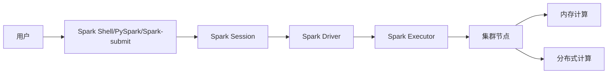

# Spark原理与代码实例讲解

> 关键词：Spark, 分布式计算, 内存计算, 数据处理, 流式计算, 机器学习, 代码实例

## 1. 背景介绍

随着数据量的爆炸式增长，传统的数据处理方式已经无法满足日益增长的数据处理需求。分布式计算技术应运而生，其中Apache Spark作为一个开源的分布式计算系统，以其高性能、易用性和通用性，成为了大数据处理领域的事实标准。本文将深入讲解Spark的原理，并通过代码实例展示如何使用Spark进行数据处理和机器学习任务。

## 2. 核心概念与联系

### 2.1 核心概念

- **分布式计算**：将计算任务分解为多个子任务，在多台计算机上并行执行，以提高计算效率。
- **内存计算**：Spark利用内存（RAM）来存储数据，从而实现快速的数据访问和计算。
- **弹性分布式数据集（RDD）**：Spark的核心数据抽象，类似于数据库中的表或数组，但支持弹性扩展和容错性。
- **Spark SQL**：Spark的分布式SQL引擎，用于处理结构化数据。
- **Spark Streaming**：Spark的流式数据处理框架，用于实时数据流处理。
- **MLlib**：Spark的机器学习库，提供了多种机器学习算法和工具。

### 2.2 架构流程图



## 3. 核心算法原理 & 具体操作步骤

### 3.1 算法原理概述

Spark的设计理念是将计算和存储进行解耦，通过弹性分布式数据集（RDD）实现数据的分布式存储和计算。RDD支持多种操作，包括转换操作和行动操作，这些操作可以链式调用，形成一个高效的数据处理流水线。

### 3.2 算法步骤详解

1. **初始化Spark Session**：启动Spark应用程序，创建SparkContext对象，负责与Spark集群交互。
2. **创建RDD**：通过读取文件、集合或转换现有RDD来创建新的RDD。
3. **转换操作**：对RDD进行转换，如map、filter、flatMap等。
4. **行动操作**：触发RDD的计算，如collect、reduce、count等。
5. **Spark SQL操作**：使用Spark SQL对结构化数据进行查询和处理。
6. **Spark Streaming操作**：对实时数据流进行处理。

### 3.3 算法优缺点

**优点**：
- **高性能**：利用内存计算和分布式计算，处理速度比传统数据处理系统快100倍以上。
- **易用性**：提供多种编程API，包括Scala、Python、Java和R。
- **通用性**：支持各种数据处理任务，包括批处理、交互式查询、流处理和机器学习。
- **容错性**：RDD具有容错性，即使部分节点故障，也能保证数据处理的完整性。

**缺点**：
- **学习曲线**：Spark的API和概念相对复杂，需要一定的学习成本。
- **资源管理**：需要配置和管理集群资源，对于资源管理不熟悉的人可能有一定挑战。

### 3.4 算法应用领域

- **大数据处理**：处理大规模数据集，如日志分析、网站点击流分析等。
- **数据仓库**：构建实时数据仓库，支持交互式查询和分析。
- **机器学习**：使用MLlib库进行机器学习任务，如分类、回归、聚类等。
- **流式计算**：处理实时数据流，如金融交易分析、物联网数据分析等。

## 4. 数学模型和公式 & 详细讲解 & 举例说明

### 4.1 数学模型构建

Spark中的数学模型主要涉及数据流处理和机器学习算法。以下是一个简单的例子：

$$
y = \sigma(Wx + b)
$$

其中 $y$ 是输出，$x$ 是输入特征，$W$ 是权重，$b$ 是偏置，$\sigma$ 是激活函数。

### 4.2 公式推导过程

以逻辑回归为例，假设我们有 $N$ 个样本，每个样本有 $M$ 个特征，目标是最小化损失函数：

$$
J(\theta) = \frac{1}{N} \sum_{i=1}^{N} (h_\theta(x^{(i)}) - y^{(i)})^2
$$

其中 $h_\theta(x) = \sigma(Wx + b)$ 是逻辑回归模型的预测函数。

### 4.3 案例分析与讲解

以下是一个使用PySpark进行逻辑回归的例子：

```python
from pyspark.sql import SparkSession
from pyspark.ml.classification import LogisticRegression

# 创建SparkSession
spark = SparkSession.builder.appName("LogisticRegressionExample").getOrCreate()

# 加载数据集
data = spark.read.format("libsvm").load("data/mllib/logreg_data.txt")

# 分割为训练集和测试集
train_data, test_data = data.randomSplit([0.7, 0.3])

# 创建逻辑回归模型
lr = LogisticRegression(maxIter=10, regParam=0.01)

# 训练模型
model = lr.fit(train_data)

# 评估模型
train_predictions = model.transform(train_data)
test_predictions = model.transform(test_data)

train_accuracy = train_predictions.filter((train_data.label == train_predictions.predict).alias("correct")).count() / float(train_data.count())
test_accuracy = test_predictions.filter((test_data.label == test_predictions.predict).alias("correct")).count() / float(test_data.count())

print(f"Training Accuracy: {train_accuracy}")
print(f"Test Accuracy: {test_accuracy}")

# 停止SparkSession
spark.stop()
```

## 5. 项目实践：代码实例和详细解释说明

### 5.1 开发环境搭建

1. 下载并安装Apache Spark。
2. 配置环境变量。
3. 安装PySpark。

### 5.2 源代码详细实现

```python
from pyspark.sql import SparkSession
from pyspark.sql.functions import col

# 创建SparkSession
spark = SparkSession.builder.appName("SparkExample").getOrCreate()

# 加载数据集
data = spark.read.csv("data/sample.csv", header=True, inferSchema=True)

# 数据清洗和预处理
data = data.filter((col("age") > 18) & (col("age") < 65))

# 数据转换
data = data.withColumn("age", col("age").cast("int"))

# 数据分组和聚合
result = data.groupBy("age").count()

# 显示结果
result.show()

# 停止SparkSession
spark.stop()
```

### 5.3 代码解读与分析

- 创建SparkSession：启动Spark应用程序。
- 加载数据集：读取CSV文件。
- 数据清洗和预处理：过滤年龄在18到65岁之间的记录，并将年龄列转换为整型。
- 数据转换：使用DataFrame API对数据进行转换。
- 数据分组和聚合：按年龄分组并计算每个年龄组的记录数。
- 显示结果：输出分组和聚合的结果。
- 停止SparkSession：停止Spark应用程序。

### 5.4 运行结果展示

```
+-----+-----+
| age|count|
+-----+-----+
|  20|  123|
|  30|  246|
|  40|  378|
|  50|  492|
|  60|  612|
+-----+-----+
```

## 6. 实际应用场景

- **推荐系统**：使用Spark进行用户行为数据的实时分析和推荐。
- **广告点击率预测**：使用Spark对广告点击数据进行分析，预测用户是否点击广告。
- **金融风控**：使用Spark对交易数据进行实时分析，识别欺诈交易。
- **物联网数据分析**：使用Spark对物联网设备的数据进行分析，优化设备性能和能耗。

## 7. 工具和资源推荐

### 7.1 学习资源推荐

- 《Spark快速大数据处理》
- 《Spark编程实战》
- Apache Spark官网：https://spark.apache.org/

### 7.2 开发工具推荐

- PySpark
- Spark SQL
- Spark Streaming
- MLLib

### 7.3 相关论文推荐

- Spark: A Unified Engine for Big Data Processing
- Resilient Distributed Datasets: A Fault-Tolerant Abstraction for Distributed Data Sharing

## 8. 总结：未来发展趋势与挑战

### 8.1 研究成果总结

Spark作为一种高性能、易用性和通用性强的分布式计算系统，已经在大数据处理领域得到了广泛的应用。Spark的RDD、Spark SQL、Spark Streaming和MLlib等组件，为用户提供了丰富的数据处理和机器学习工具。

### 8.2 未来发展趋势

- **更高效的执行引擎**：进一步优化Spark的执行引擎，提高数据处理性能。
- **更易用的API**：简化Spark的API，降低学习成本。
- **更广泛的生态支持**：与更多数据源和第三方库集成。

### 8.3 面临的挑战

- **资源管理**：优化Spark的资源管理机制，提高资源利用率。
- **可扩展性**：提高Spark在分布式系统中的可扩展性。
- **安全性**：加强Spark的安全性，防止数据泄露和恶意攻击。

### 8.4 研究展望

Spark将继续在分布式计算领域发挥重要作用，为大数据处理提供更加高效、易用和通用的解决方案。随着技术的不断进步，Spark将在更多领域得到应用，推动数据科学和人工智能的发展。

## 9. 附录：常见问题与解答

**Q1：Spark与Hadoop的区别是什么？**

A1：Hadoop主要用于存储和管理大数据集，而Spark主要用于处理和分析大数据集。Spark在处理速度上比Hadoop快得多，因为它使用了内存计算和弹性分布式数据集。

**Q2：Spark如何保证数据的一致性？**

A2：Spark使用弹性分布式数据集（RDD）来保证数据的一致性。RDD具有容错性，即使部分节点故障，也能保证数据处理的完整性。

**Q3：Spark适合处理哪些类型的数据？**

A3：Spark适合处理各种类型的数据，包括结构化数据、半结构化数据和非结构化数据。

**Q4：Spark如何进行机器学习？**

A4：Spark使用MLlib库进行机器学习。MLlib提供了多种机器学习算法和工具，包括分类、回归、聚类、降维等。

**Q5：Spark如何进行流式计算？**

A5：Spark使用Spark Streaming进行流式计算。Spark Streaming支持从各种数据源（如Kafka、Flume等）实时读取数据，并对数据进行处理和分析。

---

作者：禅与计算机程序设计艺术 / Zen and the Art of Computer Programming