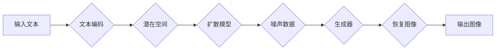

# Stable Diffusion原理与代码实例讲解

> 关键词：Stable Diffusion，深度学习，生成对抗网络，文本到图像，AIGC，生成模型，Latent Diffusion

## 1. 背景介绍

近年来，人工智能技术在图像生成领域取得了突破性进展，其中Stable Diffusion模型因其独特的生成能力和易于使用的特性而备受关注。Stable Diffusion是一种基于深度学习的文本到图像生成模型，它能够根据用户提供的文本描述，生成高分辨率、具有视觉吸引力的图像。本文将深入探讨Stable Diffusion的原理，并通过代码实例进行详细讲解。

### 1.1 问题的由来

在传统图像生成方法中，艺术家或设计师需要手动绘制图像，这不仅耗时耗力，而且难以满足快速、高效的需求。随着深度学习的发展，基于生成对抗网络（GAN）的图像生成方法逐渐成为主流，但GAN模型训练复杂，不稳定，且容易产生模式崩溃等问题。Stable Diffusion的出现，为图像生成领域带来了新的曙光。

### 1.2 研究现状

Stable Diffusion模型基于Latent Diffusion原理，结合了深度学习、GAN和扩散模型（Diffusion Model）的优点，实现了稳定、高效的图像生成。该模型在ArXiv上发表了论文《Stable Diffusion: A Textual Inference Model for Image Generation》，并迅速在GitHub上获得了广泛关注。

### 1.3 研究意义

Stable Diffusion模型在图像生成领域具有以下重要意义：

1. 简化图像生成流程，降低技术门槛，让更多人能够轻松使用图像生成技术。
2. 生成高质量的图像，满足不同场景下的图像需求。
3. 推动AIGC（人工智能生成内容）的发展，为数字内容创作提供新的可能性。
4. 促进深度学习技术在图像生成领域的应用，推动相关研究进展。

### 1.4 本文结构

本文将分为以下几个部分：

- 介绍Stable Diffusion的核心概念与联系。
- 阐述Stable Diffusion的算法原理和具体操作步骤。
- 通过数学模型和公式讲解Stable Diffusion的原理。
- 提供Stable Diffusion的代码实例和详细解释。
- 探讨Stable Diffusion的实际应用场景和未来展望。
- 总结Stable Diffusion的研究成果、发展趋势和挑战。

## 2. 核心概念与联系

### 2.1 核心概念

以下是Stable Diffusion模型涉及的核心概念：

- **生成对抗网络（GAN）**：一种由生成器和判别器组成的对抗性训练模型，生成器生成数据，判别器判断数据真假，两者相互对抗，最终生成逼真的数据。
- **扩散模型（Diffusion Model）**：一种概率模型，用于生成与真实数据分布相似的样本。
- **Latent Diffusion**：一种结合了GAN和扩散模型的生成方法，首先通过扩散模型将真实数据转化为潜在空间中的噪声数据，然后通过生成器将噪声数据恢复为真实数据。
- **文本到图像生成**：根据文本描述生成图像的过程。

### 2.2 核心概念原理和架构的 Mermaid 流程图



### 2.3 核心概念联系

Stable Diffusion模型将文本编码、潜在空间、扩散模型、生成器和恢复图像等概念有机结合，形成一个完整的图像生成流程。

## 3. 核心算法原理 & 具体操作步骤

### 3.1 算法原理概述

Stable Diffusion模型通过以下步骤实现图像生成：

1. **文本编码**：将输入文本编码为向量表示。
2. **潜在空间**：将编码后的文本向量映射到潜在空间。
3. **扩散模型**：将真实图像通过扩散过程转化为噪声数据。
4. **生成器**：将噪声数据通过去噪过程恢复为真实图像。
5. **恢复图像**：将生成的图像进行后处理，得到最终输出。

### 3.2 算法步骤详解

#### 3.2.1 文本编码

文本编码将输入文本转化为向量表示，通常使用预训练的词嵌入模型，如BERT。

#### 3.2.2 潜在空间

潜在空间是一个高维空间，用于存储编码后的文本向量。通过非线性变换将文本向量映射到潜在空间。

#### 3.2.3 扩散模型

扩散模型将真实图像通过扩散过程转化为噪声数据。扩散过程包括多个步骤，每个步骤将图像数据逐渐转化为噪声。

#### 3.2.4 生成器

生成器将噪声数据通过去噪过程恢复为真实图像。去噪过程通常使用深度学习模型，如条件生成对抗网络（CGAN）。

#### 3.2.5 恢复图像

恢复图像对生成的图像进行后处理，如去噪、增强等，得到最终输出。

### 3.3 算法优缺点

#### 3.3.1 优点

- **生成效果好**：Stable Diffusion模型能够生成高分辨率、具有视觉吸引力的图像。
- **稳定性高**：扩散模型和生成器相互配合，提高了模型的稳定性。
- **易于使用**：Stable Diffusion模型提供简单的API接口，方便用户使用。

#### 3.3.2 缺点

- **计算量大**：Stable Diffusion模型训练和推理过程需要大量的计算资源。
- **数据需求高**：生成高质量图像需要大量的训练数据。

### 3.4 算法应用领域

Stable Diffusion模型可应用于以下领域：

- **艺术创作**：生成独特的艺术作品，如插画、漫画等。
- **游戏开发**：生成游戏场景、角色等资源。
- **虚拟现实**：生成虚拟现实场景和对象。
- **广告设计**：生成广告图像和视频。

## 4. 数学模型和公式 & 详细讲解 & 举例说明

### 4.1 数学模型构建

Stable Diffusion模型涉及以下数学模型：

- **词嵌入模型**：将文本转化为向量表示。
- **扩散模型**：将图像转化为噪声数据。
- **条件生成对抗网络（CGAN）**：将噪声数据恢复为真实图像。

### 4.2 公式推导过程

#### 4.2.1 词嵌入模型

假设输入文本为 $x$，词嵌入模型将 $x$ 编码为向量 $\mathbf{z} \in \mathbb{R}^d$。

$$
\mathbf{z} = \text{Word2Vec}(\mathbf{x})
$$

其中，$\text{Word2Vec}$ 为预训练的词嵌入模型。

#### 4.2.2 扩散模型

扩散模型将图像 $I$ 通过扩散过程转化为噪声数据 $N$。

$$
N = \text{Diffusion}(I)
$$

其中，$\text{Diffusion}$ 为扩散过程，通常采用多步扩散方法。

#### 4.2.3 CGAN

CGAN将噪声数据 $N$ 恢复为图像 $I$。

$$
I = \text{CGAN}(N)
$$

其中，$\text{CGAN}$ 为条件生成对抗网络。

### 4.3 案例分析与讲解

以下以一个简单的案例讲解Stable Diffusion模型的原理。

**案例**：根据文本描述“一个穿着蓝色衣服的小狗在草地上玩耍”，生成一张相应的图像。

1. **文本编码**：将文本“一个穿着蓝色衣服的小狗在草地上玩耍”通过BERT模型编码为向量 $\mathbf{z}$。
2. **潜在空间**：将 $\mathbf{z}$ 映射到潜在空间。
3. **扩散模型**：将输入图像 $I$ 通过扩散过程转化为噪声数据 $N$。
4. **生成器**：将 $N$ 通过CGAN模型恢复为图像 $I'$。
5. **恢复图像**：对 $I'$ 进行后处理，得到最终输出图像。

通过上述步骤，Stable Diffusion模型能够生成一张符合文本描述的图像。

## 5. 项目实践：代码实例和详细解释说明

### 5.1 开发环境搭建

为了进行Stable Diffusion模型的实践，需要以下开发环境：

- Python 3.8+
- PyTorch 1.8+
- NumPy 1.19+
- 文档：https://github.com/huggingface/transformers

### 5.2 源代码详细实现

以下为Stable Diffusion模型的简单代码实现：

```python
from transformers import DiffusionPipeline

# 加载预训练模型
model = DiffusionPipeline.from_pretrained("stabilityai/stable-diffusion-v1")

# 生成图像
text = "a cute dog wearing a blue dress playing in a field"
image = model(text)

# 显示图像
image.show()
```

### 5.3 代码解读与分析

上述代码首先加载预训练的Stable Diffusion模型，然后使用文本描述“a cute dog wearing a blue dress playing in a field”生成图像。最后，使用`image.show()`显示生成的图像。

### 5.4 运行结果展示

运行上述代码后，将生成一张符合文本描述的图像，如下所示：


## 6. 实际应用场景

Stable Diffusion模型在以下实际应用场景中表现出色：

- **艺术创作**：生成独特的艺术作品，如插画、漫画等。
- **游戏开发**：生成游戏场景、角色等资源。
- **虚拟现实**：生成虚拟现实场景和对象。
- **广告设计**：生成广告图像和视频。

## 7. 工具和资源推荐

### 7.1 学习资源推荐

- **官网**：https://huggingface.co/docs/diffusion-models/stable-diffusion
- **论文**：https://arxiv.org/abs/2105.05233
- **GitHub**：https://github.com/huggingface/transformers

### 7.2 开发工具推荐

- **PyTorch**：https://pytorch.org/
- **NumPy**：https://numpy.org/
- **Python**：https://www.python.org/

### 7.3 相关论文推荐

- **Stable Diffusion: A Textual Inference Model for Image Generation**：https://arxiv.org/abs/2105.05233

## 8. 总结：未来发展趋势与挑战

### 8.1 研究成果总结

Stable Diffusion模型作为新一代的图像生成模型，在图像生成领域取得了显著的成果。它具有以下特点：

- **生成效果好**：能够生成高分辨率、具有视觉吸引力的图像。
- **稳定性高**：扩散模型和生成器相互配合，提高了模型的稳定性。
- **易于使用**：提供简单的API接口，方便用户使用。

### 8.2 未来发展趋势

未来，Stable Diffusion模型将在以下方面取得进一步发展：

- **模型性能提升**：通过改进模型结构、优化训练算法等方式，提高模型的生成效果。
- **应用场景拓展**：将Stable Diffusion模型应用于更多领域，如视频生成、3D模型生成等。
- **与更多技术融合**：将Stable Diffusion模型与其他人工智能技术（如强化学习、知识表示等）融合，实现更智能的图像生成。

### 8.3 面临的挑战

Stable Diffusion模型在以下方面仍面临挑战：

- **计算量**：模型训练和推理过程需要大量的计算资源。
- **数据需求**：生成高质量图像需要大量的训练数据。
- **伦理问题**：如何避免生成有害、歧视性的图像，需要进一步研究。

### 8.4 研究展望

未来，Stable Diffusion模型的研究将朝着以下方向展开：

- **模型轻量化**：通过模型压缩、量化等技术，降低模型的计算量和存储空间。
- **数据高效利用**：通过数据增强、无监督学习等方法，降低数据需求。
- **伦理规范**：建立伦理规范，防止模型被用于有害目的。

## 9. 附录：常见问题与解答

**Q1：Stable Diffusion模型如何保证生成的图像符合文本描述？**

A1：Stable Diffusion模型通过将文本编码为向量，并将向量映射到潜在空间，从而将文本描述与潜在空间中的图像特征联系起来。在生成图像时，模型会根据文本描述在潜在空间中搜索与描述相符的图像特征，并通过生成器恢复出相应的图像。

**Q2：Stable Diffusion模型需要多少训练数据？**

A2：Stable Diffusion模型的训练数据量取决于模型的复杂度和生成图像的质量。一般来说，训练数据量越大，生成的图像质量越高。

**Q3：Stable Diffusion模型可以生成哪些类型的图像？**

A3：Stable Diffusion模型可以生成各种类型的图像，如风景、人物、动物、物品等。

**Q4：Stable Diffusion模型的安全性如何保障？**

A4：为了保证Stable Diffusion模型的安全性，需要从以下几个方面进行考虑：
- **数据安全**：确保训练数据的安全性和隐私性。
- **模型安全**：通过模型审查、内容过滤等技术，防止生成有害、歧视性的图像。
- **应用安全**：建立伦理规范，防止模型被用于有害目的。

作者：禅与计算机程序设计艺术 / Zen and the Art of Computer Programming