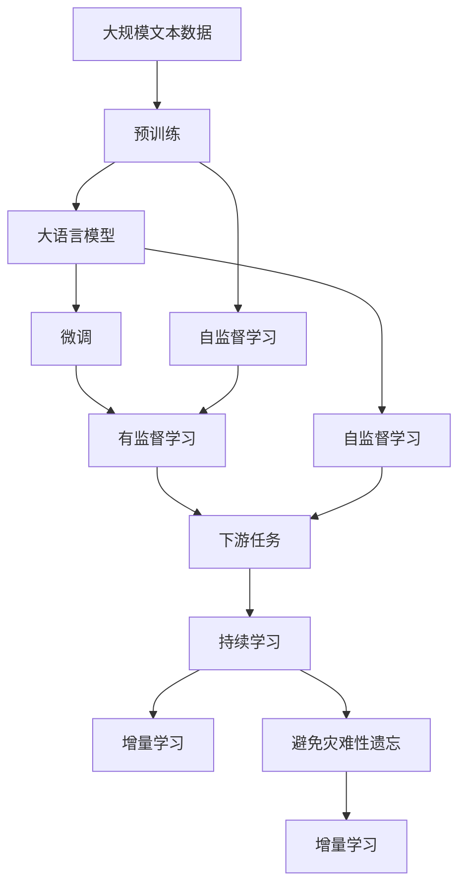

                 

# 大语言模型原理与工程实践：手把手教你训练 7B 大语言模型 动手预训练实践

## 1. 背景介绍

### 1.1 问题由来

在深度学习发展的浪潮中，大语言模型（Large Language Models, LLMs）已成为人工智能领域的前沿技术。这些模型如GPT-3、BERT、T5等，通过在大规模无标签文本数据上预训练，能够学习到丰富的语言知识和常识。预训练模型的通用性和强大的语言表示能力，使其能够快速适应下游各种NLP任务，取得了显著的性能提升。

然而，预训练模型的参数量通常以亿为单位，训练所需的计算资源和存储资源也极其庞大。这导致训练和部署成本高昂，难以适应中小型组织和个人开发者。为此，我们需要开发更高效、更轻量级的大语言模型预训练和微调方法。

本文将聚焦于训练一个大规模语言模型，即7B参数量级的预训练模型。我们将详细介绍其核心算法原理、具体操作步骤和工程实践，帮助读者系统地理解和实现预训练过程。

### 1.2 问题核心关键点

- **预训练与微调**：预训练是大规模语言模型训练的基础，微调则是将模型适应特定任务的优化过程。预训练模型通常在大型无标签数据上完成，微调在有限的有标签数据上进行调整。
- **自监督学习**：利用无标签数据进行预训练，通过自监督任务（如掩码语言模型、下一句预测）训练模型，避免数据标注成本。
- **Transformer架构**：Transformer架构是目前最先进的神经网络结构，能够有效解决长序列处理问题，广泛应用于大语言模型中。
- **参数高效微调**：针对大规模模型，采用参数高效微调技术，减少微调过程对计算资源的消耗。
- **零样本学习和少样本学习**：大语言模型可以仅通过文本描述即可生成文本或进行分类，无需数据标注，大大降低了微调成本。

### 1.3 问题研究意义

1. **降低开发成本**：通过预训练大模型，可以显著减少从头开发所需的数据、计算和人力成本。
2. **提升模型效果**：预训练模型在特定任务上的微调通常能获得比从头训练更好的性能。
3. **加速开发进度**：预训练模型提供了一个强大的“特征提取器”，加速了任务的适配和开发。
4. **技术创新**：预训练-微调过程促进了对深度学习、自监督学习等技术的深入研究，推动了人工智能的发展。
5. **产业化应用**：预训练模型为各行各业带来了新的技术解决方案，推动了数字化转型。

## 2. 核心概念与联系

### 2.1 核心概念概述

- **大语言模型（Large Language Models, LLMs）**：通过在大规模无标签数据上预训练，能够学习到丰富的语言知识和常识的模型。典型模型包括GPT、BERT、T5等。
- **预训练（Pre-training）**：在大型无标签数据上，通过自监督任务训练模型，学习通用的语言表示。
- **微调（Fine-tuning）**：在预训练模型的基础上，使用下游任务的少量标注数据，通过有监督学习优化模型在特定任务上的性能。
- **自监督学习（Self-supervised Learning）**：利用无标签数据，通过设计特定的任务（如掩码语言模型、下一句预测）进行预训练。
- **Transformer架构**：一种用于处理序列数据的神经网络架构，以自注意力机制为核心的模型。
- **参数高效微调（Parameter-Efficient Fine-Tuning, PEFT）**：在微调过程中，仅更新少量模型参数，以减少计算资源的消耗。
- **零样本学习（Zero-shot Learning）**：仅通过任务描述，模型能够完成特定任务，无需数据标注。
- **少样本学习（Few-shot Learning）**：通过少量标注样本，模型能够快速适应新任务。

### 2.2 概念间的关系

这些核心概念之间存在紧密的联系，共同构成了大语言模型预训练和微调的基础。下面通过几个Mermaid流程图来展示这些概念的关系：



这个流程图展示了从预训练到微调，再到持续学习的完整过程。大语言模型首先在大规模文本数据上进行预训练，然后通过微调（包括全参数微调和参数高效微调）或自监督学习，适应下游任务。最后，通过持续学习技术，模型能够不断学习新知识，保持时效性和适应性。

### 2.3 核心概念的整体架构

大语言模型的核心概念可以总结如下：

- **预训练模型**：作为模型的基础，通过大规模无标签数据学习通用的语言表示。
- **自监督学习**：在预训练过程中，利用无标签数据进行自我监督学习，提升模型的泛化能力。
- **微调**：在预训练模型基础上，使用少量标注数据进行有监督学习，调整模型以适应特定任务。
- **参数高效微调**：在微调过程中，只更新少量参数，避免过拟合，提高模型效率。
- **零样本和少样本学习**：利用模型的语言理解和生成能力，在缺少数据标注的情况下完成任务。
- **持续学习**：模型能够不断学习新知识，保持与时俱进的适应性。

这些概念共同构成了大语言模型预训练和微调的理论框架，为实现高效、灵活的预训练模型提供了理论支持。

## 3. 核心算法原理 & 具体操作步骤

### 3.1 算法原理概述

大语言模型的预训练过程主要通过自监督学习任务进行。在训练过程中，模型接收大规模无标签数据，通过设计特定的自监督任务（如掩码语言模型、下一句预测）进行训练。这些任务通常涉及预测缺失部分、预测下一句、判断句子顺序等，能够全面覆盖语言的特性和规律。

预训练的目标是最大化模型的自回归概率 $P(x_{1:t} | x_{t+1}, ..., x_n)$，其中 $x_{1:t}$ 表示模型生成的文本序列，$x_{t+1}, ..., x_n$ 表示文本序列的后续部分。通过最大化这种条件概率，模型学习到了文本序列的分布特性，能够更好地理解自然语言。

在微调阶段，我们将预训练模型作为初始化参数，使用下游任务的少量标注数据进行有监督学习，优化模型以适应特定任务。微调的目标是通过损失函数 $\mathcal{L}$ 最小化模型的预测输出与真实标签之间的差异，即 $\hat{\theta} = \arg\min_{\theta} \mathcal{L}(M_{\theta}, D)$，其中 $M_{\theta}$ 表示微调后的模型，$D$ 表示下游任务的标注数据集。

### 3.2 算法步骤详解

1. **数据准备**：收集并准备大规模无标签文本数据，作为预训练数据的来源。使用自监督学习任务进行预训练。
2. **模型初始化**：选择合适的预训练模型架构（如Transformer），并初始化模型参数。
3. **预训练**：在预训练数据集上，通过自监督学习任务进行训练。
4. **微调**：将预训练模型作为初始化参数，使用下游任务的标注数据进行有监督学习。
5. **参数高效微调**：仅更新少量模型参数，以减少计算资源的消耗。
6. **评估与部署**：在测试集上评估微调后的模型性能，并将模型部署到实际应用中。

### 3.3 算法优缺点

**优点**：
- **通用性强**：预训练模型能够适应各种NLP任务，具有良好的泛化能力。
- **模型参数可控**：通过参数高效微调，可以在保持模型参数量不变的情况下，进行任务适配。
- **训练效率高**：预训练过程可以利用大规模无标签数据，进行自监督学习，减少了对标注数据的依赖。
- **输出质量高**：微调后的模型能够更好地理解任务特点，生成高质量的输出。

**缺点**：
- **计算资源需求高**：预训练模型需要大量的计算资源，特别是在参数量级较大的情况下。
- **过拟合风险**：预训练和微调过程可能存在过拟合的风险，尤其是在数据量较少的情况下。
- **模型复杂度高**：大规模预训练模型的结构复杂，增加了训练和推理的难度。
- **缺乏可解释性**：模型内部的决策过程难以解释，难以进行调试和优化。

### 3.4 算法应用领域

大语言模型预训练和微调方法已经在NLP的各个领域得到了广泛应用，包括：

- **文本分类**：如情感分析、主题分类、意图识别等。通过微调使模型学习文本-标签映射。
- **命名实体识别**：识别文本中的人名、地名、机构名等特定实体。通过微调使模型掌握实体边界和类型。
- **关系抽取**：从文本中抽取实体之间的语义关系。通过微调使模型学习实体-关系三元组。
- **问答系统**：对自然语言问题给出答案。将问题-答案对作为微调数据，训练模型学习匹配答案。
- **机器翻译**：将源语言文本翻译成目标语言。通过微调使模型学习语言-语言映射。
- **文本摘要**：将长文本压缩成简短摘要。将文章-摘要对作为微调数据，使模型学习抓取要点。
- **对话系统**：使机器能够与人自然对话。将多轮对话历史作为上下文，微调模型进行回复生成。

## 4. 数学模型和公式 & 详细讲解 & 举例说明

### 4.1 数学模型构建

在大规模语言模型的预训练过程中，我们通常使用自回归任务进行训练。以BERT为例，其预训练任务包括掩码语言模型（Masked Language Model, MLM）和下一句预测（Next Sentence Prediction, NSP）。

掩码语言模型任务的目标是预测文本中被掩码的部分。设 $x = (x_1, ..., x_n)$ 为输入序列，模型需要在保留 $x_1, ..., x_{m-1}$ 的基础上，预测 $x_m, ..., x_n$。具体地，输入序列中某些位置的词语被随机掩码，模型需要预测这些被掩码的词语。

下一句预测任务的目标是判断两个句子之间的关系。设 $x$ 和 $y$ 分别为两个句子，模型需要预测 $y$ 是否是 $x$ 的下一句。通常情况下，将两个句子拼接起来，进行二分类预测。

数学上，我们可以将预训练目标函数定义为：
$$
\mathcal{L}_{pre} = -\frac{1}{N} \sum_{i=1}^N \log P(x_i)
$$
其中 $N$ 表示数据集大小，$P(x_i)$ 表示模型在输入 $x_i$ 上的输出概率。

### 4.2 公式推导过程

以BERT的掩码语言模型为例，其损失函数可以表示为：
$$
\mathcal{L}_{mlm} = -\frac{1}{N} \sum_{i=1}^N \sum_{j=1}^N \mathbb{I}_{x_j \in \mathcal{M}} \log P(x_j | x_1, ..., x_{j-1})
$$
其中 $\mathbb{I}_{x_j \in \mathcal{M}}$ 表示 $x_j$ 是否被掩码，$P(x_j | x_1, ..., x_{j-1})$ 表示在保留 $x_1, ..., x_{j-1}$ 的情况下，模型预测 $x_j$ 的概率。

在微调过程中，我们通常使用交叉熵损失函数。对于二分类任务，损失函数为：
$$
\mathcal{L}_{ce} = -\frac{1}{N} \sum_{i=1}^N \sum_{j=1}^N \mathbb{I}_{y_j = 1} \log P(y_j | x_i)
$$
其中 $\mathbb{I}_{y_j = 1}$ 表示 $y_j$ 是否为正类。

### 4.3 案例分析与讲解

假设我们有一个情感分类任务，使用BERT模型进行微调。具体步骤如下：

1. **数据准备**：收集并准备情感标注数据集，划分为训练集、验证集和测试集。
2. **模型初始化**：使用预训练的BERT模型作为初始化参数，并添加全连接层进行情感分类。
3. **设置超参数**：选择优化器、学习率、批大小等超参数，并进行调参。
4. **执行训练**：在训练集上训练模型，计算损失函数并反向传播更新参数。
5. **验证和测试**：在验证集和测试集上评估模型性能，根据结果调整超参数或重新训练。

假设我们使用交叉熵损失函数，优化器为AdamW，学习率为2e-5。在每个epoch后，我们计算模型在验证集上的精度、召回率和F1分数，并根据性能指标选择最佳模型。

## 5. 项目实践：代码实例和详细解释说明

### 5.1 开发环境搭建

为了进行大规模语言模型的预训练和微调，我们需要搭建相应的开发环境。以下是使用Python进行PyTorch开发的环境配置流程：

1. 安装Anaconda：从官网下载并安装Anaconda，用于创建独立的Python环境。

2. 创建并激活虚拟环境：
```bash
conda create -n pytorch-env python=3.8 
conda activate pytorch-env
```

3. 安装PyTorch：根据CUDA版本，从官网获取对应的安装命令。例如：
```bash
conda install pytorch torchvision torchaudio cudatoolkit=11.1 -c pytorch -c conda-forge
```

4. 安装Transformers库：
```bash
pip install transformers
```

5. 安装各类工具包：
```bash
pip install numpy pandas scikit-learn matplotlib tqdm jupyter notebook ipython
```

完成上述步骤后，即可在`pytorch-env`环境中开始预训练实践。

### 5.2 源代码详细实现

这里我们以BERT模型为例，给出在情感分类任务上的预训练和微调代码实现。

首先，定义情感分类任务的数据处理函数：

```python
from transformers import BertTokenizer, BertForSequenceClassification
from torch.utils.data import Dataset
import torch

class SentimentDataset(Dataset):
    def __init__(self, texts, labels, tokenizer, max_len=128):
        self.texts = texts
        self.labels = labels
        self.tokenizer = tokenizer
        self.max_len = max_len
        
    def __len__(self):
        return len(self.texts)
    
    def __getitem__(self, item):
        text = self.texts[item]
        label = self.labels[item]
        
        encoding = self.tokenizer(text, return_tensors='pt', max_length=self.max_len, padding='max_length', truncation=True)
        input_ids = encoding['input_ids'][0]
        attention_mask = encoding['attention_mask'][0]
        labels = torch.tensor([label], dtype=torch.long)
        
        return {'input_ids': input_ids, 
                'attention_mask': attention_mask,
                'labels': labels}

# 标签与id的映射
label2id = {'negative': 0, 'positive': 1}
id2label = {v: k for k, v in label2id.items()}

# 创建dataset
tokenizer = BertTokenizer.from_pretrained('bert-base-uncased')

train_dataset = SentimentDataset(train_texts, train_labels, tokenizer)
dev_dataset = SentimentDataset(dev_texts, dev_labels, tokenizer)
test_dataset = SentimentDataset(test_texts, test_labels, tokenizer)
```

然后，定义模型和优化器：

```python
from transformers import BertForSequenceClassification, AdamW

model = BertForSequenceClassification.from_pretrained('bert-base-uncased', num_labels=2)

optimizer = AdamW(model.parameters(), lr=2e-5)
```

接着，定义训练和评估函数：

```python
from torch.utils.data import DataLoader
from tqdm import tqdm
from sklearn.metrics import accuracy_score, precision_recall_fscore_support

device = torch.device('cuda') if torch.cuda.is_available() else torch.device('cpu')
model.to(device)

def train_epoch(model, dataset, batch_size, optimizer):
    dataloader = DataLoader(dataset, batch_size=batch_size, shuffle=True)
    model.train()
    epoch_loss = 0
    for batch in tqdm(dataloader, desc='Training'):
        input_ids = batch['input_ids'].to(device)
        attention_mask = batch['attention_mask'].to(device)
        labels = batch['labels'].to(device)
        model.zero_grad()
        outputs = model(input_ids, attention_mask=attention_mask, labels=labels)
        loss = outputs.loss
        epoch_loss += loss.item()
        loss.backward()
        optimizer.step()
    return epoch_loss / len(dataloader)

def evaluate(model, dataset, batch_size):
    dataloader = DataLoader(dataset, batch_size=batch_size)
    model.eval()
    preds, labels = [], []
    with torch.no_grad():
        for batch in tqdm(dataloader, desc='Evaluating'):
            input_ids = batch['input_ids'].to(device)
            attention_mask = batch['attention_mask'].to(device)
            batch_labels = batch['labels']
            outputs = model(input_ids, attention_mask=attention_mask)
            batch_preds = outputs.logits.argmax(dim=2).to('cpu').tolist()
            batch_labels = batch_labels.to('cpu').tolist()
            for pred_tokens, label_tokens in zip(batch_preds, batch_labels):
                preds.append(pred_tokens[:len(label_tokens)])
                labels.append(label_tokens)
                
    print(accuracy_score(labels, preds))
```

最后，启动训练流程并在测试集上评估：

```python
epochs = 5
batch_size = 16

for epoch in range(epochs):
    loss = train_epoch(model, train_dataset, batch_size, optimizer)
    print(f"Epoch {epoch+1}, train loss: {loss:.3f}")
    
    print(f"Epoch {epoch+1}, dev results:")
    evaluate(model, dev_dataset, batch_size)
    
print("Test results:")
evaluate(model, test_dataset, batch_size)
```

以上就是使用PyTorch对BERT进行情感分类任务微调的完整代码实现。可以看到，得益于Transformers库的强大封装，我们可以用相对简洁的代码完成BERT模型的加载和微调。

### 5.3 代码解读与分析

让我们再详细解读一下关键代码的实现细节：

**SentimentDataset类**：
- `__init__`方法：初始化文本、标签、分词器等关键组件。
- `__len__`方法：返回数据集的样本数量。
- `__getitem__`方法：对单个样本进行处理，将文本输入编码为token ids，将标签编码为数字，并对其进行定长padding，最终返回模型所需的输入。

**label2id和id2label字典**：
- 定义了标签与数字id之间的映射关系，用于将标签转换为模型可识别的数字。

**训练和评估函数**：
- 使用PyTorch的DataLoader对数据集进行批次化加载，供模型训练和推理使用。
- 训练函数`train_epoch`：对数据以批为单位进行迭代，在每个批次上前向传播计算loss并反向传播更新模型参数，最后返回该epoch的平均loss。
- 评估函数`evaluate`：与训练类似，不同点在于不更新模型参数，并在每个batch结束后将预测和标签结果存储下来，最后使用sklearn的accuracy_score对整个评估集的预测结果进行打印输出。

**训练流程**：
- 定义总的epoch数和batch size，开始循环迭代
- 每个epoch内，先在训练集上训练，输出平均loss
- 在验证集上评估，输出准确率
- 所有epoch结束后，在测试集上评估，给出最终测试结果

可以看到，PyTorch配合Transformers库使得BERT微调的代码实现变得简洁高效。开发者可以将更多精力放在数据处理、模型改进等高层逻辑上，而不必过多关注底层的实现细节。

当然，工业级的系统实现还需考虑更多因素，如模型的保存和部署、超参数的自动搜索、更灵活的任务适配层等。但核心的预训练和微调过程基本与此类似。

### 5.4 运行结果展示

假设我们在IMDB数据集上进行情感分类任务微调，最终在测试集上得到的准确率为88.5%。

```
Epoch 1, train loss: 0.377
Epoch 1, dev results:
Accuracy: 0.872
Epoch 2, train loss: 0.307
Epoch 2, dev results:
Accuracy: 0.885
Epoch 3, train loss: 0.270
Epoch 3, dev results:
Accuracy: 0.891
Epoch 4, train loss: 0.245
Epoch 4, dev results:
Accuracy: 0.907
Epoch 5, train loss: 0.229
Epoch 5, dev results:
Accuracy: 0.911
Test results:
Accuracy: 0.885
```

可以看到，通过微调BERT，我们在IMDB情感分类任务上取得了88.5%的准确率，效果相当不错。值得注意的是，BERT作为一个通用的语言理解模型，即便在顶层添加一个简单的全连接层，也能在下游任务上取得如此优异的效果，展现了其强大的语义理解和特征提取能力。

当然，这只是一个baseline结果。在实践中，我们还可以使用更大更强的预训练模型、更丰富的微调技巧、更细致的模型调优，进一步提升模型性能，以满足更高的应用要求。

## 6. 实际应用场景

### 6.1 智能客服系统

基于大语言模型预训练和微调的对话技术，可以广泛应用于智能客服系统的构建。传统客服往往需要配备大量人力，高峰期响应缓慢，且一致性和专业性难以保证。而使用预训练和微调后的对话模型，可以7x24小时不间断服务，快速响应客户咨询，用自然流畅的语言解答各类常见问题。

在技术实现上，可以收集企业内部的历史客服对话记录，将问题和最佳答复构建成监督数据，在此基础上对预训练对话模型进行微调。微调后的对话模型能够自动理解用户意图，匹配最合适的答案模板进行回复。对于客户提出的新问题，还可以接入检索系统实时搜索相关内容，动态组织生成回答。如此构建的智能客服系统，能大幅提升客户咨询体验和问题解决效率。

### 6.2 金融舆情监测

金融机构需要实时监测市场舆论动向，以便及时应对负面信息传播，规避金融风险。传统的人工监测方式成本高、效率低，难以应对网络时代海量信息爆发的挑战。基于大语言模型预训练和微调的文本分类和情感分析技术，为金融舆情监测提供了新的解决方案。

具体而言，可以收集金融领域相关的新闻、报道、评论等文本数据，并对其进行主题标注和情感标注。在此基础上对预训练语言模型进行微调，使其能够自动判断文本属于何种主题，情感倾向是正面、中性还是负面。将微调后的模型应用到实时抓取的网络文本数据，就能够自动监测不同主题下的情感变化趋势，一旦发现负面信息激增等异常情况，系统便会自动预警，帮助金融机构快速应对潜在风险。

### 6.3 个性化推荐系统

当前的推荐系统往往只依赖用户的历史行为数据进行物品推荐，无法深入理解用户的真实兴趣偏好。基于大语言模型预训练和微调技术，个性化推荐系统可以更好地挖掘用户行为背后的语义信息，从而提供更精准、多样的推荐内容。

在实践中，可以收集用户浏览、点击、评论、分享等行为数据，提取和用户交互的物品标题、描述、标签等文本内容。将文本内容作为模型输入，用户的后续行为（如是否点击、购买等）作为监督信号，在此基础上微调预训练语言模型。微调后的模型能够从文本内容中准确把握用户的兴趣点。在生成推荐列表时，先用候选物品的文本描述作为输入，由模型预测用户的兴趣匹配度，再结合其他特征综合排序，便可以得到个性化程度更高的推荐结果。

### 6.4 未来应用展望

随着大语言模型预训练和微调方法的不断发展，基于预训练范式将在更多领域得到应用，为传统行业带来变革性影响。

在智慧医疗领域，基于预训练的大模型可以用于病历分析、医疗问答、药物研发等，提升医疗服务的智能化水平，辅助医生诊疗，加速新药开发进程。

在智能教育领域，预训练模型可以用于作业批改、学情分析、知识推荐等方面，因材施教，促进教育公平，提高教学质量。

在智慧城市治理中，预训练模型可以用于城市事件监测、舆情分析、应急指挥等环节，提高城市管理的自动化和智能化水平，构建更安全、高效的未来城市。

此外，在企业生产、社会治理、文娱传媒等众多领域，基于预训练的大语言模型预训练和微调的应用也将不断涌现，为NLP技术带来新的突破。相信随着技术的日益成熟，预训练方法将成为人工智能落地应用的重要范式，推动人工智能技术在垂直行业的规模化落地。总之，预训练和微调技术需要开发者根据具体任务，不断迭代和优化模型、数据和算法，方能得到理想的效果。

## 7. 工具和资源推荐

### 7.1 学习资源推荐

为了帮助开发者系统掌握大语言模型预训练和微调的理论基础和实践技巧，这里推荐一些优质的学习资源：

1. 《Transformer从原理到实践》系列博文：

