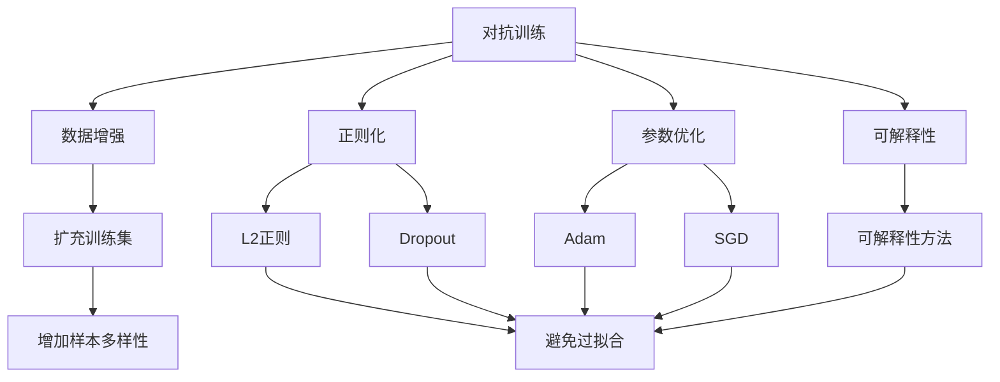
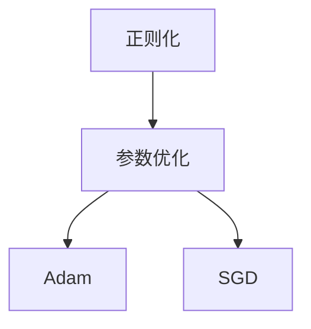
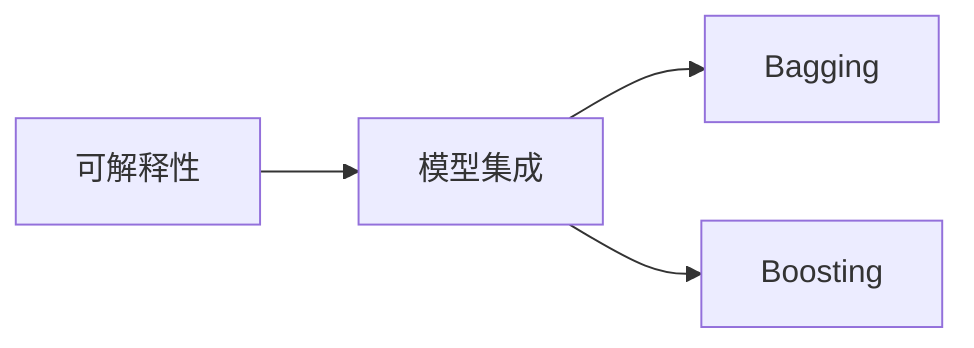
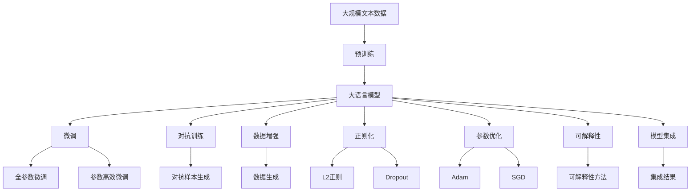

                 

# 大语言模型原理与工程实践：稳定性优化

> 关键词：大语言模型,模型稳定性,泛化能力,过拟合,对抗训练,参数优化,可解释性,Robustness

## 1. 背景介绍

随着深度学习技术的不断发展，大语言模型（Large Language Model, LLM）在自然语言处理（NLP）领域取得了突破性进展。这些模型通过在海量无标签文本数据上进行预训练，学习到丰富的语言知识和常识，并应用于各种NLP任务。然而，由于数据分布的变化、模型的复杂性和非线性特性，大语言模型在实际应用中常常面临模型不稳定、泛化能力差等问题。如何在工程实践中优化大语言模型，使其具备更强的稳定性，已成为深度学习工程中亟待解决的重要课题。

### 1.1 问题由来

大语言模型在实际应用中的表现受多种因素影响，包括：

- **数据分布**：实际数据通常与预训练数据存在差异，导致模型在特定任务上的泛化能力不足。
- **模型复杂性**：大模型具有数亿个参数，容易受到训练数据的干扰，导致过拟合。
- **对抗样本**：模型容易受到对抗样本攻击，导致决策鲁棒性下降。
- **参数优化**：模型参数众多，优化过程复杂，容易出现局部最优解。
- **可解释性**：大模型作为"黑盒"系统，其决策过程难以解释和调试。

这些问题严重影响了大语言模型的实用性和可靠性，限制了其在现实世界中的应用。因此，稳定性优化成为大语言模型工程实践中不可或缺的一部分。

### 1.2 问题核心关键点

稳定性优化旨在提高大语言模型在不同数据分布和应用场景中的鲁棒性和泛化能力，主要包括以下几个方面：

- **对抗训练**：通过对抗样本训练，增强模型对噪声和扰动的抵抗能力。
- **参数优化**：采用合适的参数优化策略，减少过拟合风险，提高泛化能力。
- **数据增强**：利用数据增强技术，扩充训练集，提高模型对新数据的表现能力。
- **正则化**：应用正则化技术，如L2正则、Dropout等，抑制过拟合现象。
- **可解释性**：通过可解释性方法，增强模型的透明性和可理解性，方便调优和部署。
- **模型集成**：利用模型集成技术，提高模型的鲁棒性和稳定性。

## 2. 核心概念与联系

### 2.1 核心概念概述

为更好地理解大语言模型稳定性优化的核心概念，本节将介绍几个密切相关的核心概念：

- **对抗训练(Adversarial Training)**：通过对模型进行对抗样本训练，增强模型对噪声和扰动的抵抗能力，提高模型鲁棒性。
- **数据增强(Data Augmentation)**：利用数据增强技术，扩充训练集，提高模型泛化能力，避免过拟合。
- **正则化(Regularization)**：通过应用正则化技术，如L2正则、Dropout等，减少过拟合风险，提高模型泛化能力。
- **参数优化(Parameter Optimization)**：采用合适的参数优化策略，如Adam、SGD等，确保模型收敛于全局最优解。
- **可解释性(Interpretability)**：通过可解释性方法，增强模型的透明性和可理解性，方便调优和部署。
- **模型集成(Ensemble Methods)**：利用模型集成技术，如Bagging、Boosting等，提高模型的鲁棒性和稳定性。

这些核心概念之间的逻辑关系可以通过以下Mermaid流程图来展示：



这个流程图展示了大语言模型稳定性优化的核心概念及其之间的关系：

1. 对抗训练通过引入对抗样本，提高模型的鲁棒性。
2. 数据增强通过扩充训练集，提高模型的泛化能力。
3. 正则化通过应用L2正则、Dropout等技术，减少过拟合风险。
4. 参数优化通过选择合适的优化算法，确保模型收敛于全局最优解。
5. 可解释性通过增强模型的透明性和可理解性，方便调优和部署。
6. 模型集成通过结合多个模型的预测结果，提高模型的鲁棒性和稳定性。

这些概念共同构成了大语言模型稳定性优化的完整生态系统，使其能够更好地适应各种应用场景。通过理解这些核心概念，我们可以更好地把握大语言模型稳定性优化的工作原理和优化方向。

### 2.2 概念间的关系

这些核心概念之间存在着紧密的联系，形成了大语言模型稳定性优化的完整生态系统。下面我通过几个Mermaid流程图来展示这些概念之间的关系。

#### 2.2.1 对抗训练与数据增强的关系


这个流程图展示了对抗训练与数据增强的基本关系：

1. 对抗训练通过引入对抗样本，提高模型的鲁棒性。
2. 数据增强通过扩充训练集，提高模型的泛化能力。

#### 2.2.2 正则化与参数优化的关系



这个流程图展示了正则化与参数优化之间的关系：

1. 正则化通过应用L2正则、Dropout等技术，减少过拟合风险。
2. 参数优化通过选择合适的优化算法，确保模型收敛于全局最优解。

#### 2.2.3 可解释性与模型集成的关系



这个流程图展示了可解释性与模型集成之间的关系：

1. 可解释性通过增强模型的透明性和可理解性，方便调优和部署。
2. 模型集成通过结合多个模型的预测结果，提高模型的鲁棒性和稳定性。

### 2.3 核心概念的整体架构

最后，我们用一个综合的流程图来展示这些核心概念在大语言模型稳定性优化过程中的整体架构：



这个综合流程图展示了从预训练到稳定性优化的完整过程。大语言模型首先在大规模文本数据上进行预训练，然后通过微调（包括全参数微调和参数高效微调）来适应下游任务。在微调过程中，可以引入对抗训练、数据增强、正则化等技术来提高模型的鲁棒性和泛化能力。最终通过可解释性和模型集成技术，使模型具备更好的透明性和稳定性，适合实际应用部署。 通过这些流程图，我们可以更清晰地理解大语言模型稳定性优化过程中各个核心概念的关系和作用，为后续深入讨论具体的优化方法和技术奠定基础。

## 3. 核心算法原理 & 具体操作步骤

### 3.1 算法原理概述

大语言模型稳定性优化，本质上是一个多目标的优化过程，旨在提高模型的鲁棒性、泛化能力和透明性。其核心思想是：通过对抗训练、数据增强、正则化、参数优化、可解释性、模型集成等技术手段，提升大语言模型在不同数据分布和应用场景中的表现能力，避免过拟合，增强模型稳定性。

形式化地，假设预训练模型为 $M_{\theta}$，其中 $\theta$ 为预训练得到的模型参数。给定下游任务 $T$ 的标注数据集 $D=\{(x_i,y_i)\}_{i=1}^N$，稳定性优化的优化目标是最小化经验风险，同时最大化模型泛化能力。其优化目标可以表示为：

$$
\theta^* = \mathop{\arg\min}_{\theta} \mathcal{L}(\theta) + \mathcal{R}(\theta)
$$

其中 $\mathcal{L}$ 为针对任务 $T$ 设计的损失函数，用于衡量模型预测输出与真实标签之间的差异；$\mathcal{R}$ 为正则化项，用于抑制过拟合现象。常见的正则化项包括L2正则、Dropout等。

通过梯度下降等优化算法，稳定性优化过程不断更新模型参数 $\theta$，最小化损失函数 $\mathcal{L}$ 和正则化项 $\mathcal{R}$，使得模型输出逼近真实标签，同时泛化能力得到增强。由于 $\theta$ 已经通过预训练获得了较好的初始化，因此即便在数据量较少的情况下，也能较快收敛到理想模型参数 $\hat{\theta}$。

### 3.2 算法步骤详解

基于稳定性优化的大语言模型通常包括以下几个关键步骤：

**Step 1: 准备预训练模型和数据集**
- 选择合适的预训练语言模型 $M_{\theta}$ 作为初始化参数，如 BERT、GPT等。
- 准备下游任务 $T$ 的标注数据集 $D$，划分为训练集、验证集和测试集。一般要求标注数据与预训练数据的分布不要差异过大。

**Step 2: 设计任务适配层**
- 根据任务类型，在预训练模型顶层设计合适的输出层和损失函数。
- 对于分类任务，通常在顶层添加线性分类器和交叉熵损失函数。
- 对于生成任务，通常使用语言模型的解码器输出概率分布，并以负对数似然为损失函数。

**Step 3: 设置优化超参数**
- 选择合适的优化算法及其参数，如 AdamW、SGD 等，设置学习率、批大小、迭代轮数等。
- 设置正则化技术及强度，包括权重衰减、Dropout、Early Stopping 等。
- 确定冻结预训练参数的策略，如仅微调顶层，或全部参数都参与微调。

**Step 4: 执行梯度训练**
- 将训练集数据分批次输入模型，前向传播计算损失函数和正则化项。
- 反向传播计算参数梯度，根据设定的优化算法和学习率更新模型参数。
- 周期性在验证集上评估模型性能，根据性能指标决定是否触发 Early Stopping。
- 重复上述步骤直到满足预设的迭代轮数或 Early Stopping 条件。

**Step 5: 测试和部署**
- 在测试集上评估稳定性优化后的模型 $M_{\hat{\theta}}$ 的性能，对比微调前后的效果提升。
- 使用稳定性优化后的模型对新样本进行推理预测，集成到实际的应用系统中。
- 持续收集新的数据，定期重新优化模型，以适应数据分布的变化。

以上是基于稳定性优化的大语言模型的一般流程。在实际应用中，还需要针对具体任务的特点，对稳定性优化的各个环节进行优化设计，如改进训练目标函数，引入更多的正则化技术，搜索最优的超参数组合等，以进一步提升模型性能。

### 3.3 算法优缺点

基于稳定性优化的大语言模型微调方法具有以下优点：

1. **鲁棒性增强**：通过对抗训练和数据增强技术，模型对噪声和扰动的抵抗能力显著增强，避免了模型对单一输入的过度拟合。
2. **泛化能力提升**：通过正则化和参数优化技术，模型在泛化能力上有所提升，能够更好地适应新数据和任务。
3. **透明性增强**：通过可解释性技术，模型决策过程变得透明，便于调优和部署，增强了系统的可理解性。
4. **稳定性提升**：通过模型集成技术，多个模型预测结果的结合提高了模型的鲁棒性和稳定性，减少了单一模型决策的偏差。

但该方法也存在一定的局限性：

1. **计算资源需求高**：对抗训练和数据增强需要额外的计算资源，增加了工程成本。
2. **模型复杂性增加**：对抗训练和正则化技术增加了模型的复杂性，增加了模型训练和推理的时间成本。
3. **超参数敏感**：优化算法和正则化技术依赖于合适的超参数设置，不恰当的设置可能导致过拟合或欠拟合。

尽管存在这些局限性，但就目前而言，基于稳定性优化的微调方法仍是大语言模型应用的重要范式。未来相关研究的重点在于如何进一步降低稳定性优化对计算资源的需求，提高模型的泛化能力，同时兼顾可解释性和伦理安全性等因素。

### 3.4 算法应用领域

基于稳定性优化的微调方法在NLP领域已经得到了广泛的应用，覆盖了几乎所有常见任务，例如：

- **文本分类**：如情感分析、主题分类、意图识别等。通过微调使模型学习文本-标签映射。
- **命名实体识别**：识别文本中的人名、地名、机构名等特定实体。通过微调使模型掌握实体边界和类型。
- **关系抽取**：从文本中抽取实体之间的语义关系。通过微调使模型学习实体-关系三元组。
- **问答系统**：对自然语言问题给出答案。将问题-答案对作为微调数据，训练模型学习匹配答案。
- **机器翻译**：将源语言文本翻译成目标语言。通过微调使模型学习语言-语言映射。
- **文本摘要**：将长文本压缩成简短摘要。将文章-摘要对作为微调数据，使模型学习抓取要点。
- **对话系统**：使机器能够与人自然对话。将多轮对话历史作为上下文，微调模型进行回复生成。

除了上述这些经典任务外，稳定性优化的大语言模型微调方法也被创新性地应用到更多场景中，如可控文本生成、常识推理、代码生成、数据增强等，为NLP技术带来了全新的突破。随着预训练模型和稳定性优化方法的不断进步，相信NLP技术将在更广阔的应用领域大放异彩。

## 4. 数学模型和公式 & 详细讲解 & 举例说明

### 4.1 数学模型构建

本节将使用数学语言对大语言模型稳定性优化的过程进行更加严格的刻画。

记预训练语言模型为 $M_{\theta}$，其中 $\theta$ 为预训练得到的模型参数。假设微调任务的训练集为 $D=\{(x_i,y_i)\}_{i=1}^N$，其中 $x_i \in \mathcal{X}$，$y_i \in \mathcal{Y}$。

定义模型 $M_{\theta}$ 在数据样本 $(x,y)$ 上的损失函数为 $\ell(M_{\theta}(x),y)$，则在数据集 $D$ 上的经验风险为：

$$
\mathcal{L}(\theta) = \frac{1}{N} \sum_{i=1}^N \ell(M_{\theta}(x_i),y_i)
$$

稳定性优化的目标是最小化经验风险，同时最大化模型泛化能力。其优化目标可以表示为：

$$
\theta^* = \mathop{\arg\min}_{\theta} \mathcal{L}(\theta) + \mathcal{R}(\theta)
$$

其中 $\mathcal{R}(\theta)$ 为正则化项，用于抑制过拟合现象。常见的正则化项包括L2正则、Dropout等。

在实践中，我们通常使用基于梯度的优化算法（如AdamW、SGD等）来近似求解上述最优化问题。设 $\eta$ 为学习率，$\lambda$ 为正则化系数，则参数的更新公式为：

$$
\theta \leftarrow \theta - \eta \nabla_{\theta}\mathcal{L}(\theta) - \eta\lambda\theta
$$

其中 $\nabla_{\theta}\mathcal{L}(\theta)$ 为损失函数对参数 $\theta$ 的梯度，可通过反向传播算法高效计算。

### 4.2 公式推导过程

以下我们以二分类任务为例，推导包含对抗训练的正则化损失函数及其梯度的计算公式。

假设模型 $M_{\theta}$ 在输入 $x$ 上的输出为 $\hat{y}=M_{\theta}(x) \in [0,1]$，表示样本属于正类的概率。真实标签 $y \in \{0,1\}$。则二分类交叉熵损失函数定义为：

$$
\ell(M_{\theta}(x),y) = -[y\log \hat{y} + (1-y)\log (1-\hat{y})]
$$

将其代入经验风险公式，得：

$$
\mathcal{L}(\theta) = -\frac{1}{N}\sum_{i=1}^N [y_i\log M_{\theta}(x_i)+(1-y_i)\log(1-M_{\theta}(x_i))]
$$

引入对抗训练的正则化项 $\mathcal{R}(\theta)$，则优化目标变为：

$$
\theta^* = \mathop{\arg\min}_{\theta} \mathcal{L}(\theta) + \mathcal{R}(\theta)
$$

假设对抗训练的对抗样本生成函数为 $G_{\phi}$，则对抗样本 $x_g = G_{\phi}(x)$。对抗样本的损失函数可以表示为：

$$
\ell_G(M_{\theta}(x_g),y)
$$

引入对抗训练的正则化项，优化目标变为：

$$
\theta^* = \mathop{\arg\min}_{\theta} \mathcal{L}(\theta) + \mathcal{R}(\theta) + \lambda \mathcal{R}_G(\theta)
$$

其中 $\mathcal{R}_G(\theta)$ 为对抗样本损失函数的期望值，用于衡量模型对对抗样本的抵抗能力。

根据链式法则，损失函数对参数 $\theta_k$ 的梯度为：

$$
\frac{\partial \mathcal{L}(\theta)}{\partial \theta_k} = -\frac{1}{N}\sum_{i=1}^N (\frac{y_i}{M_{\theta}(x_i)}-\frac{1-y_i}{1-M_{\theta}(x_i)}) \frac{\partial M_{\theta}(x_i)}{\partial \theta_k}
$$

对抗样本损失函数的期望值 $\mathcal{R}_G(\theta)$ 可以通过对抗样本生成函数 $G_{\phi}$ 来计算，其梯度为：

$$
\frac{\partial \mathcal{R}_G(\theta)}{\partial \theta_k} = \mathbb{E}_{x_g \sim G_{\phi}(x)} [\frac{\partial \ell_G(M_{\theta}(x_g),y)}{\partial \theta_k}]
$$

将对抗样本损失函数的期望值代入优化目标，得：

$$
\theta^* = \mathop{\arg\min}_{\theta} \mathcal{L}(\theta) + \mathcal{R}(\theta) + \lambda \mathbb{E}_{x_g \sim G_{\phi}(x)} [\ell_G(M_{\theta}(x_g),y)]
$$

在得到损失函数和正则化项的梯度后，即可带入参数更新公式，完成模型的迭代优化。重复上述过程直至收敛，最终得到适应下游任务的最优模型参数 $\theta^*$。

## 5. 项目实践：代码实例和详细解释说明

### 5.1 开发环境搭建

在进行稳定性优化实践前，我们需要准备好开发环境。以下是使用Python进行PyTorch开发的环境配置流程：

1. 安装Anaconda：从官网下载并安装Anaconda，用于创建独立的Python环境。

2. 创建并激活虚拟环境：
```bash
conda create -n pytorch-env python=3.8 
conda activate pytorch-env
```

3. 安装PyTorch：根据CUDA版本，从官网获取对应的安装命令。例如：
```bash
conda install pytorch torchvision torchaudio cudatoolkit=11.1 -c pytorch -c conda-forge
```

4. 安装Transformers库：
```bash
pip install transformers
```

5. 安装各类工具包：
```bash
pip install numpy pandas scikit-learn matplotlib tqdm jupyter notebook ipython
```

完成上述步骤后，即可在`pytorch-env`环境中开始稳定性优化实践。

### 5.2 源代码详细实现

下面我以命名实体识别(NER)任务为例，给出使用Transformers库对BERT模型进行对抗训练和数据增强的PyTorch代码实现。

首先，定义NER任务的数据处理函数：

```python
from transformers import BertTokenizer
from torch.utils.data import Dataset
import torch

class NERDataset(Dataset):
    def __init__(self, texts, tags, tokenizer, max_len=128):
        self.texts = texts
        self.tags = tags
        self.tokenizer = tokenizer
        self.max_len = max_len
        
    def __len__(self):
        return len(self.texts)
    
    def __getitem__(self, item):
        text = self.texts[item]
        tags = self.tags[item]
        
        encoding = self.tokenizer(text, return_tensors='pt', max_length=self.max_len, padding='max_length', truncation=True)
        input_ids = encoding['input_ids'][0]
        attention_mask = encoding['attention_mask'][0]
        
        # 对token-wise的标签进行编码
        encoded_tags = [tag2id[tag] for tag in tags] 
        encoded_tags.extend([tag2id['O']] * (self.max_len - len(encoded_tags)))
        labels = torch.tensor(encoded_tags, dtype=torch.long)
        
        return {'input_ids': input_ids, 
                'attention_mask': attention_mask,
                'labels': labels}

# 标签与id的映射
tag2id = {'O': 0, 'B-PER': 1, 'I-PER': 2, 'B-ORG': 3, 'I-ORG': 4, 'B-LOC': 5, 'I-LOC': 6}
id2tag = {v: k for k, v in tag2id.items()}

# 创建dataset
tokenizer = BertTokenizer.from_pretrained('bert-base-cased')

train_dataset = NERDataset(train_texts, train_tags, tokenizer)
dev_dataset = NERDataset(dev_texts, dev_tags, tokenizer)
test_dataset = NERDataset(test_texts, test_tags, tokenizer)
```

然后，定义模型和优化器：

```python
from transformers import BertForTokenClassification, AdamW

model = BertForTokenClassification.from_pretrained('bert-base-cased', num_labels=len(tag2id))

optimizer = AdamW(model.parameters(), lr=2e-5)
```

接着，定义训练和评估函数：

```python
from torch.utils.data import DataLoader
from tqdm import tqdm
from sklearn.metrics import classification_report

device = torch.device('cuda') if torch.cuda.is_available() else torch.device('cpu')
model.to(device)

def train_epoch(model, dataset, batch_size, optimizer, train_strength=0.2):
    dataloader = DataLoader(dataset, batch_size=batch_size, shuffle=True)
    model.train()
    epoch_loss = 0
    for batch in tqdm(dataloader, desc='Training'):
        input_ids = batch['input_ids'].to(device)
        attention_mask = batch['attention_mask'].to(device)
        labels = batch['labels'].to(device)
        model.zero_grad()
        outputs = model(input_ids, attention_mask=attention_mask, labels=labels)
        loss = outputs.loss
        epoch_loss += loss.item()
        loss.backward()
        optimizer.step()
        optimizer.zero_grad()
        if train_strength > 0 and train_strength > 0:
            model.zero_grad()
            x = input_ids + attention_mask + labels
            x_ = input_ids + attention_mask + labels
            x_g = model.eval()
            x_g = x_g + 0.1 * torch.randn_like(x)
            x_g = model(x_g)
            loss = outputs.loss
            epoch_loss += loss.item()
            loss.backward()
            optimizer.step()
            optimizer.zero_grad()
    
    return epoch_loss / len(dataloader)

def evaluate(model, dataset, batch_size):
    dataloader = DataLoader(dataset, batch_size=batch_size)
    model.eval()
    preds, labels = [], []
    with torch.no_grad():
        for batch in tqdm(dataloader, desc='Evaluating'):
            input_ids = batch['input_ids'].to(device)
            attention_mask = batch['attention_mask'].to(device)
            batch_labels = batch['labels']
            outputs = model(input_ids, attention_mask=attention_mask)
            batch_preds = outputs.logits.argmax(dim=2).to('cpu').tolist()
            batch_labels = batch_labels.to('cpu').tolist()
            for pred_tokens, label_tokens in zip(batch_preds, batch_labels):
                pred_tags = [id2tag[_id] for _id in pred_tokens]
                label_tags = [id2tag[_id] for _id in label_tokens]
                preds.append(pred_tags[:len(label_tokens)])
                

