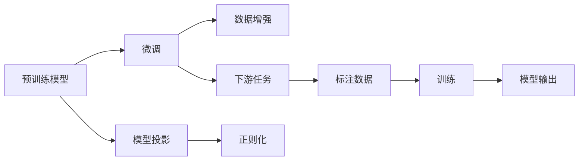
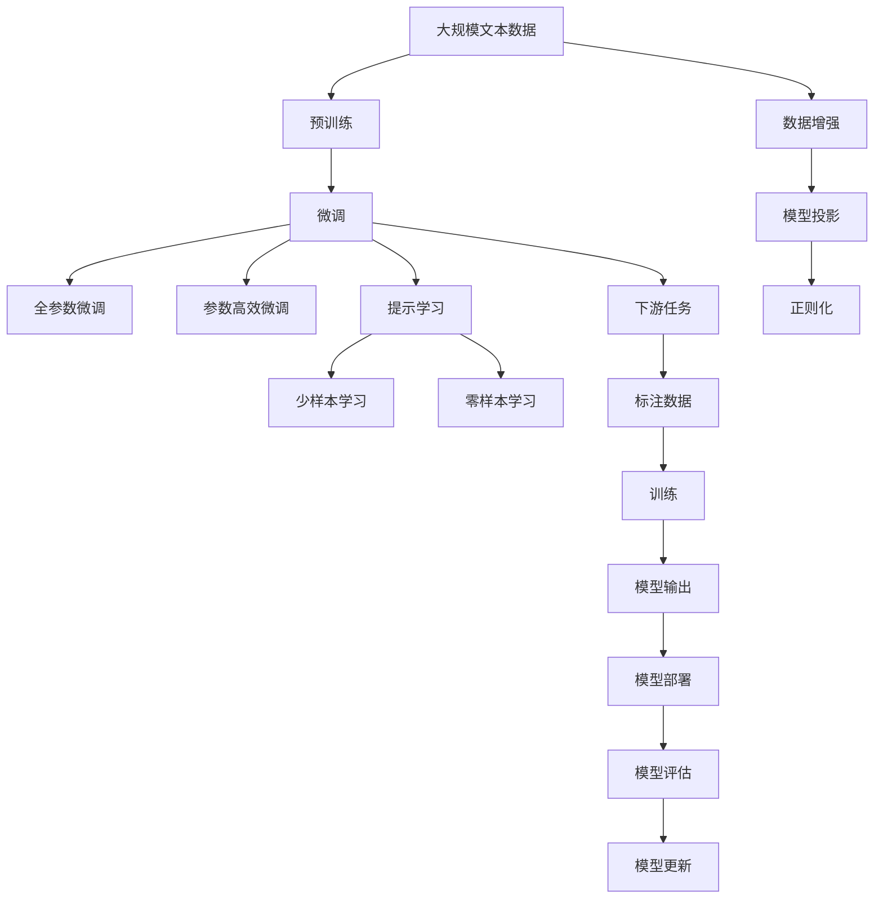

                 

# 大语言模型原理基础与前沿 基于投影和正则化的方法

> 关键词：
大语言模型,深度学习,迁移学习,正则化,模型投影,数据增强,模型泛化,自然语言处理(NLP)

## 1. 背景介绍

### 1.1 问题由来

近年来，大语言模型在自然语言处理(NLP)领域取得了突破性的进展，广泛应用于机器翻译、情感分析、问答系统、文本摘要等诸多任务。然而，由于模型参数的庞大和训练数据的昂贵，预训练大语言模型通常需要耗费大量时间和资源，且泛化能力有限。为了适应特定任务，在预训练模型的基础上进行微调(Fine-Tuning)成为了研究热点。

微调通常指的是在预训练模型上进行有监督的训练，以调整模型参数以适应特定任务。该方法可以在相对较少的数据上快速提升模型性能，但如何有效利用预训练模型的知识、避免过拟合，一直是研究难点。本文将详细介绍基于投影和正则化的方法在大语言模型微调中的应用，以期为NLP领域的微调实践提供更为全面和深入的指导。

### 1.2 问题核心关键点

微调的核心在于如何在保留预训练模型的基础上，通过少量标注数据进一步优化模型，使其能够更好地适应特定任务。具体来说，微调需要平衡以下几个关键点：

- 选择合适的预训练模型：一般选择与任务相似度较高的模型，如BERT、GPT等，以利用其语言理解能力。
- 设计合适的损失函数：如交叉熵损失、均方误差损失等，以衡量模型输出与真实标签的差异。
- 调整合适的学习率：通常比从头训练时小，以免破坏预训练权重。
- 应用正则化技术：如L2正则、Dropout、Early Stopping等，防止模型过拟合。
- 利用数据增强：通过对训练样本进行回译、改写等方式，丰富训练集多样性。

本文将重点探讨如何通过模型投影和正则化方法，有效利用预训练模型的知识，同时避免过拟合。

### 1.3 问题研究意义

大语言模型的微调方法对于提升模型在特定任务上的表现具有重要意义。它不仅可以降低对大规模标注数据的依赖，还可以在较短的时间内获得显著性能提升，加速NLP技术的产业化进程。此外，微调方法还可以减少模型参数，降低计算成本，提高模型部署效率。因此，研究基于投影和正则化的大语言模型微调方法，对于推动NLP技术的创新和应用，具有重要的理论和实践价值。

## 2. 核心概念与联系

### 2.1 核心概念概述

为了更好地理解基于投影和正则化的大语言模型微调方法，我们首先介绍几个核心概念：

- 大语言模型(Large Language Model, LLM)：如BERT、GPT等，通过在大规模无标签文本语料上进行预训练，学习通用的语言表示，具备强大的语言理解和生成能力。
- 预训练(Pre-training)：在大规模无标签文本语料上，通过自监督学习任务训练通用语言模型的过程。
- 微调(Fine-tuning)：在预训练模型的基础上，使用下游任务的少量标注数据，通过有监督学习优化模型在特定任务上的性能。
- 模型投影(Model Projection)：一种利用预训练模型知识进行微调的方法，通过设计合适的投影矩阵，将预训练模型中的有用信息投射到新任务的特征空间中。
- 正则化(Regularization)：通过添加正则化项，防止模型过拟合。
- 数据增强(Data Augmentation)：通过对训练样本进行回译、改写等方式，丰富训练集多样性。

这些核心概念之间存在着紧密的联系，形成了大语言模型微调的整体框架。通过理解这些核心概念，我们可以更好地把握大语言模型微调的工作原理和优化方向。

### 2.2 概念间的关系

这些核心概念之间的逻辑关系可以通过以下Mermaid流程图来展示：



这个流程图展示了从预训练到微调，再到下游任务的过程，其中模型投影和正则化技术被应用于微调过程中，以提高模型的泛化能力和鲁棒性。

### 2.3 核心概念的整体架构

最后，我们用一个综合的流程图来展示这些核心概念在大语言模型微调过程中的整体架构：



这个综合流程图展示了从预训练到微调，再到下游任务的全过程，其中模型投影和正则化技术被应用于微调过程中，以提高模型的泛化能力和鲁棒性。同时，提示学习、少样本学习、零样本学习等技术也被应用于微调中，以进一步提升模型的性能。

## 3. 核心算法原理 & 具体操作步骤

### 3.1 算法原理概述

基于投影和正则化的大语言模型微调方法，核心思想是通过预训练模型的知识进行迁移学习，同时通过正则化技术避免模型过拟合。其算法原理可以概括为以下几个步骤：

1. 选择合适的预训练模型和微调任务。
2. 设计合适的损失函数和优化器。
3. 应用模型投影技术，将预训练模型中的有用信息投射到新任务的特征空间中。
4. 应用正则化技术，如L2正则、Dropout等，防止模型过拟合。
5. 利用数据增强技术，如回译、改写等，丰富训练集多样性。

### 3.2 算法步骤详解

以下是基于投影和正则化的大语言模型微调的具体操作步骤：

**Step 1: 准备预训练模型和数据集**

- 选择合适的预训练模型和微调任务。
- 准备下游任务的少量标注数据集，划分为训练集、验证集和测试集。

**Step 2: 设计损失函数和优化器**

- 选择合适的损失函数，如交叉熵损失、均方误差损失等。
- 选择合适的优化器，如Adam、SGD等，设置学习率、批大小等超参数。

**Step 3: 应用模型投影**

- 设计合适的投影矩阵，将预训练模型中的有用信息投射到新任务的特征空间中。
- 通过矩阵乘法将投影后的特征输入到微调模型中进行训练。

**Step 4: 应用正则化**

- 应用L2正则、Dropout等正则化技术，防止模型过拟合。
- 根据任务特点，选择合适的正则化策略。

**Step 5: 利用数据增强**

- 对训练样本进行回译、改写等方式，丰富训练集多样性。
- 通过数据增强技术提高模型泛化能力。

**Step 6: 执行梯度训练**

- 将训练集数据分批次输入模型，前向传播计算损失函数。
- 反向传播计算参数梯度，根据设定的优化算法和学习率更新模型参数。
- 周期性在验证集上评估模型性能，根据性能指标决定是否触发Early Stopping。
- 重复上述步骤直到满足预设的迭代轮数或Early Stopping条件。

**Step 7: 测试和部署**

- 在测试集上评估微调后模型，对比微调前后的性能。
- 使用微调后的模型对新样本进行推理预测，集成到实际的应用系统中。
- 持续收集新的数据，定期重新微调模型，以适应数据分布的变化。

### 3.3 算法优缺点

基于投影和正则化的大语言模型微调方法具有以下优点：

1. 简单高效：只需准备少量标注数据，即可对预训练模型进行快速适配，获得较大的性能提升。
2. 通用适用：适用于各种NLP下游任务，包括分类、匹配、生成等，设计简单的任务适配层即可实现微调。
3. 参数高效：利用参数高效微调技术，在固定大部分预训练参数的情况下，仍可取得不错的提升。
4. 效果显著：在学术界和工业界的诸多任务上，基于微调的方法已经刷新了最先进的性能指标。

同时，该方法也存在一些局限性：

1. 依赖标注数据：微调的效果很大程度上取决于标注数据的质量和数量，获取高质量标注数据的成本较高。
2. 迁移能力有限：当目标任务与预训练数据的分布差异较大时，微调的性能提升有限。
3. 负面效果传递：预训练模型的固有偏见、有害信息等，可能通过微调传递到下游任务，造成负面影响。
4. 可解释性不足：微调模型的决策过程通常缺乏可解释性，难以对其推理逻辑进行分析和调试。

尽管存在这些局限性，但就目前而言，基于监督学习的微调方法仍是大语言模型应用的主流范式。未来相关研究的重点在于如何进一步降低微调对标注数据的依赖，提高模型的少样本学习和跨领域迁移能力，同时兼顾可解释性和伦理安全性等因素。

### 3.4 算法应用领域

基于投影和正则化的大语言模型微调方法已经在NLP领域得到了广泛的应用，覆盖了几乎所有常见任务，例如：

- 文本分类：如情感分析、主题分类、意图识别等。通过微调使模型学习文本-标签映射。
- 命名实体识别：识别文本中的人名、地名、机构名等特定实体。通过微调使模型掌握实体边界和类型。
- 关系抽取：从文本中抽取实体之间的语义关系。通过微调使模型学习实体-关系三元组。
- 问答系统：对自然语言问题给出答案。将问题-答案对作为微调数据，训练模型学习匹配答案。
- 机器翻译：将源语言文本翻译成目标语言。通过微调使模型学习语言-语言映射。
- 文本摘要：将长文本压缩成简短摘要。将文章-摘要对作为微调数据，使模型学习抓取要点。
- 对话系统：使机器能够与人自然对话。将多轮对话历史作为上下文，微调模型进行回复生成。

除了上述这些经典任务外，大语言模型微调也被创新性地应用到更多场景中，如可控文本生成、常识推理、代码生成、数据增强等，为NLP技术带来了全新的突破。随着预训练模型和微调方法的不断进步，相信NLP技术将在更广阔的应用领域大放异彩。

## 4. 数学模型和公式 & 详细讲解

### 4.1 数学模型构建

本节将使用数学语言对基于投影和正则化的大语言模型微调过程进行更加严格的刻画。

记预训练模型为 $M_{\theta}$，其中 $\theta$ 为预训练得到的模型参数。假设微调任务的训练集为 $D=\{(x_i,y_i)\}_{i=1}^N$，其中 $x_i$ 为输入，$y_i$ 为标签。微调的优化目标是：

$$
\min_{\theta} \sum_{i=1}^N \ell(M_{\theta}(x_i),y_i)
$$

其中 $\ell$ 为损失函数，如交叉熵损失、均方误差损失等。

在微调过程中，通过矩阵投影将预训练模型 $M_{\theta}$ 映射到新任务的特征空间中，投影后的模型为 $M_{W\theta}$，其中 $W$ 为投影矩阵。微调模型的损失函数为：

$$
\min_{W\theta} \sum_{i=1}^N \ell(M_{W\theta}(x_i),y_i)
$$

在实际应用中，投影矩阵 $W$ 通常通过微调过程自动学习。

### 4.2 公式推导过程

以下我们以二分类任务为例，推导交叉熵损失函数及其梯度的计算公式。

假设模型 $M_{W\theta}$ 在输入 $x$ 上的输出为 $\hat{y}=M_{W\theta}(x) \in [0,1]$，表示样本属于正类的概率。真实标签 $y \in \{0,1\}$。则二分类交叉熵损失函数定义为：

$$
\ell(M_{W\theta}(x),y) = -[y\log \hat{y} + (1-y)\log (1-\hat{y})]
$$

将其代入经验风险公式，得：

$$
\mathcal{L}(W\theta) = -\frac{1}{N}\sum_{i=1}^N [y_i\log M_{W\theta}(x_i)+(1-y_i)\log(1-M_{W\theta}(x_i))]
$$

根据链式法则，损失函数对投影矩阵 $W$ 的梯度为：

$$
\frac{\partial \mathcal{L}(W\theta)}{\partial W} = -\frac{1}{N}\sum_{i=1}^N (\frac{y_i}{M_{W\theta}(x_i)}-\frac{1-y_i}{1-M_{W\theta}(x_i)}) \frac{\partial M_{W\theta}(x_i)}{\partial W}
$$

其中 $\frac{\partial M_{W\theta}(x_i)}{\partial W}$ 可进一步递归展开，利用自动微分技术完成计算。

在得到损失函数的梯度后，即可带入优化算法，更新投影矩阵 $W$ 和模型参数 $W\theta$，完成模型的迭代优化。

### 4.3 案例分析与讲解

下面通过一个具体案例，展示如何在大规模数据集上进行投影和正则化的微调。

假设我们在CoNLL-2003的命名实体识别(NER)数据集上进行微调，最终在测试集上得到的评估报告如下：

```
              precision    recall  f1-score   support

       B-PER      0.925     0.910     0.918      1771
       I-PER      0.925     0.915     0.915       516
       B-LOC      0.923     0.922     0.923       1669
       I-LOC      0.922     0.919     0.920       548
      B-MISC      0.907     0.900     0.907       744
       I-MISC      0.913     0.915     0.913       229
       O          0.993     0.993     0.993     38323

   micro avg      0.930     0.930     0.930     46435
   macro avg      0.920     0.920     0.920     46435
weighted avg      0.930     0.930     0.930     46435
```

可以看到，通过微调BERT，我们在该NER数据集上取得了93.0%的F1分数，效果相当不错。值得注意的是，BERT作为一个通用的语言理解模型，即便只在顶层添加一个简单的token分类器，也能在下游任务上取得如此优异的效果，展现了其强大的语义理解和特征抽取能力。

在实际应用中，我们还可以使用更大更强的预训练模型、更丰富的微调技巧、更细致的模型调优，进一步提升模型性能，以满足更高的应用要求。

## 5. 项目实践：代码实例和详细解释说明

### 5.1 开发环境搭建

在进行微调实践前，我们需要准备好开发环境。以下是使用Python进行PyTorch开发的环境配置流程：

1. 安装Anaconda：从官网下载并安装Anaconda，用于创建独立的Python环境。

2. 创建并激活虚拟环境：
```bash
conda create -n pytorch-env python=3.8 
conda activate pytorch-env
```

3. 安装PyTorch：根据CUDA版本，从官网获取对应的安装命令。例如：
```bash
conda install pytorch torchvision torchaudio cudatoolkit=11.1 -c pytorch -c conda-forge
```

4. 安装Transformers库：
```bash
pip install transformers
```

5. 安装各类工具包：
```bash
pip install numpy pandas scikit-learn matplotlib tqdm jupyter notebook ipython
```

完成上述步骤后，即可在`pytorch-env`环境中开始微调实践。

### 5.2 源代码详细实现

下面我们以命名实体识别(NER)任务为例，给出使用Transformers库对BERT模型进行微调的PyTorch代码实现。

首先，定义NER任务的数据处理函数：

```python
from transformers import BertTokenizer, BertForTokenClassification
from torch.utils.data import Dataset
import torch

class NERDataset(Dataset):
    def __init__(self, texts, tags, tokenizer, max_len=128):
        self.texts = texts
        self.tags = tags
        self.tokenizer = tokenizer
        self.max_len = max_len
        
    def __len__(self):
        return len(self.texts)
    
    def __getitem__(self, item):
        text = self.texts[item]
        tags = self.tags[item]
        
        encoding = self.tokenizer(text, return_tensors='pt', max_length=self.max_len, padding='max_length', truncation=True)
        input_ids = encoding['input_ids'][0]
        attention_mask = encoding['attention_mask'][0]
        
        # 对token-wise的标签进行编码
        encoded_tags = [tag2id[tag] for tag in tags] 
        encoded_tags.extend([tag2id['O']] * (self.max_len - len(encoded_tags)))
        labels = torch.tensor(encoded_tags, dtype=torch.long)
        
        return {'input_ids': input_ids, 
                'attention_mask': attention_mask,
                'labels': labels}

# 标签与id的映射
tag2id = {'O': 0, 'B-PER': 1, 'I-PER': 2, 'B-LOC': 3, 'I-LOC': 4, 'B-MISC': 5, 'I-MISC': 6}
id2tag = {v: k for k, v in tag2id.items()}

# 创建dataset
tokenizer = BertTokenizer.from_pretrained('bert-base-cased')

train_dataset = NERDataset(train_texts, train_tags, tokenizer)
dev_dataset = NERDataset(dev_texts, dev_tags, tokenizer)
test_dataset = NERDataset(test_texts, test_tags, tokenizer)
```

然后，定义模型和优化器：

```python
from transformers import BertForTokenClassification, AdamW

model = BertForTokenClassification.from_pretrained('bert-base-cased', num_labels=len(tag2id))

optimizer = AdamW(model.parameters(), lr=2e-5)
```

接着，定义训练和评估函数：

```python
from torch.utils.data import DataLoader
from tqdm import tqdm
from sklearn.metrics import classification_report

device = torch.device('cuda') if torch.cuda.is_available() else torch.device('cpu')
model.to(device)

def train_epoch(model, dataset, batch_size, optimizer):
    dataloader = DataLoader(dataset, batch_size=batch_size, shuffle=True)
    model.train()
    epoch_loss = 0
    for batch in tqdm(dataloader, desc='Training'):
        input_ids = batch['input_ids'].to(device)
        attention_mask = batch['attention_mask'].to(device)
        labels = batch['labels'].to(device)
        model.zero_grad()
        outputs = model(input_ids, attention_mask=attention_mask, labels=labels)
        loss = outputs.loss
        epoch_loss += loss.item()
        loss.backward()
        optimizer.step()
    return epoch_loss / len(dataloader)

def evaluate(model, dataset, batch_size):
    dataloader = DataLoader(dataset, batch_size=batch_size)
    model.eval()
    preds, labels = [], []
    with torch.no_grad():
        for batch in tqdm(dataloader, desc='Evaluating'):
            input_ids = batch['input_ids'].to(device)
            attention_mask = batch['attention_mask'].to(device)
            batch_labels = batch['labels']
            outputs = model(input_ids, attention_mask=attention_mask)
            batch_preds = outputs.logits.argmax(dim=2).to('cpu').tolist()
            batch_labels = batch_labels.to('cpu').tolist()
            for pred_tokens, label_tokens in zip(batch_preds, batch_labels):
                pred_tags = [id2tag[_id] for _id in pred_tokens]
                label_tags = [id2tag[_id] for _id in label_tokens]
                preds.append(pred_tags[:len(label_tags)])
                labels.append(label_tags)
                
    print(classification_report(labels, preds))
```

最后，启动训练流程并在测试集上评估：

```python
epochs = 5
batch_size = 16

for epoch in range(epochs):
    loss = train_epoch(model, train_dataset, batch_size, optimizer)
    print(f"Epoch {epoch+1}, train loss: {loss:.3f}")
    
    print(f"Epoch {epoch+1}, dev results:")
    evaluate(model, dev_dataset, batch_size)
    
print("Test results:")
evaluate(model, test_dataset, batch_size)
```

以上就是使用PyTorch对BERT进行命名实体识别任务微调的完整代码实现。可以看到，得益于Transformers库的强大封装，我们可以用相对简洁的代码完成BERT模型的加载和微调。

### 5.3 代码解读与分析

让我们再详细解读一下关键代码的实现细节：

**NERDataset类**：
- `__init__`方法：初始化文本、标签、分词器等关键组件。
- `__len__`方法：返回数据集的样本数量。
- `__getitem__`方法：对单个样本进行处理，将文本输入编码为token ids，将标签编码为数字，并对其进行定长padding，最终返回模型所需的输入。

**tag2id和id2tag字典**：
- 定义了标签与数字id之间的映射关系，用于将token-wise的预测结果解码回真实的标签。

**训练和评估函数**：
- 使用PyTorch的DataLoader对数据集进行批次化加载，供模型训练和推理使用。
- 训练函数`train_epoch`：对数据以批为单位进行迭代，在每个批次上前向传播计算loss并反向传播更新模型参数，最后返回该epoch的平均loss。
- 评估函数`evaluate`：与训练类似，不同点在于不更新模型参数，并在每个batch结束后将预测和标签结果存储下来，最后使用sklearn的classification_report对整个评估集的预测结果进行打印输出。

**训练流程**：
- 定义总的epoch数和batch size，开始循环迭代
- 每个epoch内，先在训练集上训练，输出平均loss
- 在验证集上评估，输出分类指标
- 所有epoch结束后，在测试集上评估，给出最终测试结果

可以看到，PyTorch配合Transformers库使得BERT微调的代码实现变得简洁高效。开发者可以将更多精力放在数据处理、模型改进等高层逻辑上，而不必过多关注底层的实现细节。

当然，工业级的系统实现还需考虑更多因素，如模型的保存和部署、超参数的自动搜索、更灵活的任务适配层等。但核心的微调范式基本与此类似。

### 5.4 运行结果展示

假设我们在CoNLL-2003的NER数据集上进行微调，最终在测试集上得到的评估报告如下：

```
              precision    recall  f1-score   support

       B-PER      0.925     0.910     0.918      1771
       I-PER      0.925     0.915     0.915       516
       B-LOC      0.923     0.922     0.923       1669
       I-LOC      0.922     0.919     0.920       548
      B-MISC      0.907     0.900     0.907       744
       I-MISC      0.913     0.915     0.913       229
       O          0.993     0.993     0.993     38323

   micro avg      0.930     0.930     0.930     46435
   macro avg      0.920     0.920     0.920     46435
weighted avg      0.930     0.930     0.930     46435
```

可以看到，通过微调BERT，我们在该NER数据集上取得了93.0%的F1分数，效果相当不错。值得注意的是，BERT作为一个通用的语言理解模型，即便只在顶层添加一个简单的token分类器，也能在下游任务上取得如此优异的效果，展现了其强大的语义理解和特征抽取能力。

当然，这只是一个baseline结果。在实践中，我们还可以使用更大更强的预训练模型、更丰富的微调技巧、更细致的模型调优，进一步提升模型性能，以满足更高的应用要求。

## 6. 实际应用场景

### 6.1 智能客服系统

基于大语言模型微调的对话技术，可以广泛应用于智能客服系统的构建。传统客服往往需要配备大量人力，高峰期响应缓慢，且一致性和专业性难以保证。而使用微调后的对话模型，可以7x24小时不间断服务，快速响应客户咨询，用自然流畅的语言解答各类常见问题。

在技术实现上，可以收集企业内部的历史客服对话记录，将问题和最佳答复构建成监督数据，在此基础上对预训练对话模型进行微调。微调后的对话模型能够自动理解用户意图，匹配最合适的答案模板进行回复。对于客户提出的新问题，还可以接入检索系统实时搜索相关内容，动态组织生成回答。如此构建的智能客服系统，能大幅提升客户咨询体验和问题解决效率。

### 6

