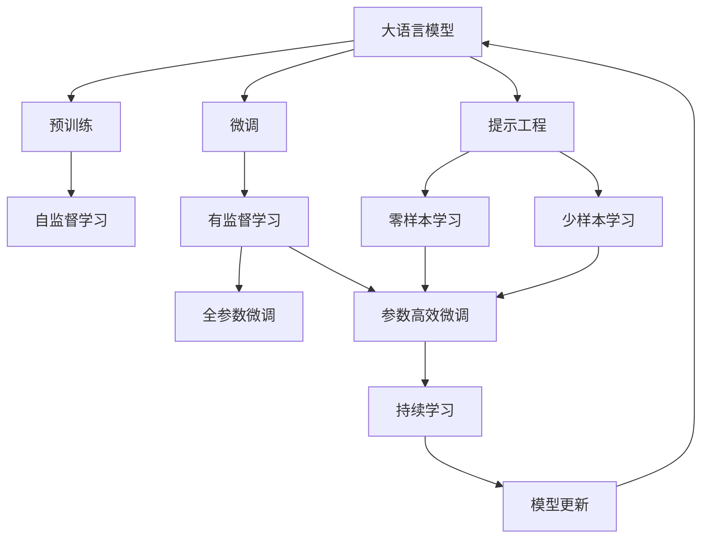

                 

# 大语言模型应用指南：Open Interpreter

> 关键词：大语言模型,Open Interpreter,自然语言处理,NLP,深度学习,Transformer,Prompt Engineering,预训练,微调,Fine-Tuning

## 1. 背景介绍

### 1.1 问题由来

近年来，深度学习在自然语言处理(NLP)领域取得了飞速发展。其中，基于预训练和微调的大语言模型（Large Language Models, LLMs）尤为引人注目。BERT、GPT、T5等模型在各种NLP任务上表现优异，极大推动了NLP技术的进步。然而，如何高效、灵活地将大语言模型应用于实际应用场景，依然是摆在NLP工程师面前的重要问题。

针对这一需求，Open Interpreter应运而生。它是一个开源的自然语言处理平台，旨在提供便捷、高效、可定制的预训练模型和微调工具，帮助开发者快速实现语言理解和生成任务。本文将详细介绍Open Interpreter的核心原理、应用实践及未来展望，期望为开发者提供有益的参考。

### 1.2 问题核心关键点

Open Interpreter的核心思想是将大语言模型嵌入应用系统，使开发者能够通过简单的API调用，快速搭建自定义的自然语言处理系统。其核心组件包括：

1. **预训练模型（Pre-trained Models）**：提供多种预训练的Transformer模型，如BERT、GPT等。这些模型已经在大规模文本数据上进行过预训练，具备强大的语言理解能力。

2. **微调（Fine-Tuning）**：提供方便的微调接口，使开发者能够在大规模标注数据上对预训练模型进行微调，适应特定任务的需求。

3. **提示工程（Prompt Engineering）**：提供灵活的Prompt设计工具，帮助开发者设计更有效的输入格式，引导模型生成高质量的输出。

4. **服务接口（APIs）**：提供RESTful API接口，方便开发者通过HTTP请求与模型进行交互。

5. **可视化界面（Dashboards）**：提供友好的可视化界面，便于开发者监控模型性能和训练过程。

这些核心组件共同构成了Open Interpreter的强大功能，使其能够在各种应用场景中发挥重要作用。

### 1.3 问题研究意义

Open Interpreter的研发，对于NLP技术和应用的普及具有重要意义：

1. **降低应用门槛**：通过提供便捷的API和微调工具，显著降低了开发者将大语言模型应用于实际场景的技术门槛。

2. **提升模型效果**：通过微调，模型能够更好地适应特定任务的需求，提升模型在实际应用中的效果。

3. **促进创新**：开放的API接口和丰富的预训练模型，为开发者提供了广阔的创新空间，促进了NLP技术的持续发展。

4. **支持工业化应用**：完善的可视化界面和服务接口，有助于将NLP技术更好地集成到工业化应用中，加速产业升级。

5. **增强安全性和可解释性**：提供可解释性工具和对抗性分析工具，提升模型的安全性，帮助开发者理解模型的决策过程。

## 2. 核心概念与联系

### 2.1 核心概念概述

Open Interpreter的核心概念包括以下几个方面：

1. **大语言模型（Large Language Models）**：指使用Transformer架构训练的预训练语言模型，如BERT、GPT等。这些模型在大规模无标签文本数据上进行预训练，具备强大的语言理解能力和生成能力。

2. **微调（Fine-Tuning）**：指在大规模标注数据上对预训练模型进行微调，以适应特定任务的需求。微调过程中，模型参数被进一步优化，以提高任务相关的表现。

3. **提示工程（Prompt Engineering）**：指通过设计巧妙的输入模板（Prompt Template），引导大语言模型生成期望的输出。提示工程是微调的重要补充，能够在不更新模型参数的情况下，实现高效的任务适配。

4. **服务接口（APIs）**：指提供RESTful API接口，使开发者能够通过HTTP请求与Open Interpreter进行交互。API接口的灵活性和易用性，是Open Interpreter的核心竞争力之一。

5. **可视化界面（Dashboards）**：指提供友好的可视化界面，帮助开发者监控模型性能、训练过程和资源使用情况。

这些核心概念共同构成了Open Interpreter的工作原理和功能体系，使其能够在各种应用场景中发挥重要作用。

### 2.2 概念间的关系

这些核心概念之间的逻辑关系可以通过以下Mermaid流程图来展示：



这个流程图展示了大语言模型的核心概念及其之间的关系：

1. 大语言模型通过预训练获得基础能力。
2. 微调是对预训练模型进行任务特定的优化，可以分为全参数微调和参数高效微调（PEFT）。
3. 提示工程是一种不更新模型参数的方法，可以实现零样本和少样本学习。
4. 持续学习旨在使模型能够不断学习新知识，同时避免遗忘旧知识。

这些概念共同构成了Open Interpreter的核心功能，使其能够在各种场景下发挥强大的语言理解和生成能力。

## 3. 核心算法原理 & 具体操作步骤

### 3.1 算法原理概述

Open Interpreter的算法原理基于大语言模型的预训练和微调过程。其核心思想是将大语言模型嵌入应用系统，通过简单的API调用，实现对模型的管理和优化。具体而言，Open Interpreter提供了以下几个关键组件：

1. **预训练模型（Pre-trained Models）**：在大规模无标签文本数据上进行预训练的Transformer模型，如BERT、GPT等。这些模型已经在大规模文本数据上进行过自监督学习，具备强大的语言理解能力。

2. **微调（Fine-Tuning）**：在大规模标注数据上对预训练模型进行有监督学习，以适应特定任务的需求。微调过程中，模型参数被进一步优化，以提高任务相关的表现。

3. **提示工程（Prompt Engineering）**：通过设计巧妙的输入模板（Prompt Template），引导大语言模型生成期望的输出。提示工程是微调的重要补充，能够在不更新模型参数的情况下，实现高效的任务适配。

4. **服务接口（APIs）**：提供RESTful API接口，使开发者能够通过HTTP请求与Open Interpreter进行交互。API接口的灵活性和易用性，是Open Interpreter的核心竞争力之一。

5. **可视化界面（Dashboards）**：提供友好的可视化界面，帮助开发者监控模型性能、训练过程和资源使用情况。

这些组件共同构成了Open Interpreter的核心算法原理，使其能够在各种应用场景中发挥重要作用。

### 3.2 算法步骤详解

Open Interpreter的微调过程通常包括以下几个关键步骤：

**Step 1: 准备预训练模型和数据集**
- 选择合适的预训练语言模型 $M_{\theta}$ 作为初始化参数，如 BERT、GPT等。
- 准备下游任务 $T$ 的标注数据集 $D$，划分为训练集、验证集和测试集。一般要求标注数据与预训练数据的分布不要差异过大。

**Step 2: 添加任务适配层**
- 根据任务类型，在预训练模型顶层设计合适的输出层和损失函数。
- 对于分类任务，通常在顶层添加线性分类器和交叉熵损失函数。
- 对于生成任务，通常使用语言模型的解码器输出概率分布，并以负对数似然为损失函数。

**Step 3: 设置微调超参数**
- 选择合适的优化算法及其参数，如 AdamW、SGD 等，设置学习率、批大小、迭代轮数等。
- 设置正则化技术及强度，包括权重衰减、Dropout、Early Stopping等。
- 确定冻结预训练参数的策略，如仅微调顶层，或全部参数都参与微调。

**Step 4: 执行梯度训练**
- 将训练集数据分批次输入模型，前向传播计算损失函数。
- 反向传播计算参数梯度，根据设定的优化算法和学习率更新模型参数。
- 周期性在验证集上评估模型性能，根据性能指标决定是否触发 Early Stopping。
- 重复上述步骤直到满足预设的迭代轮数或 Early Stopping 条件。

**Step 5: 测试和部署**
- 在测试集上评估微调后模型 $M_{\hat{\theta}}$ 的性能，对比微调前后的精度提升。
- 使用微调后的模型对新样本进行推理预测，集成到实际的应用系统中。
- 持续收集新的数据，定期重新微调模型，以适应数据分布的变化。

### 3.3 算法优缺点

Open Interpreter的微调方法具有以下优点：

1. **简单高效**：通过API接口，开发者能够快速搭建自定义的NLP系统，显著降低技术门槛。
2. **通用适用**：适用于各种NLP任务，如分类、匹配、生成等，设计简单的任务适配层即可实现微调。
3. **参数高效**：利用参数高效微调技术，在固定大部分预训练参数的情况下，仍可取得不错的提升。
4. **效果显著**：在学术界和工业界的诸多任务上，基于微调的方法已经刷新了最先进的性能指标。

同时，该方法也存在一定的局限性：

1. **依赖标注数据**：微调的效果很大程度上取决于标注数据的质量和数量，获取高质量标注数据的成本较高。
2. **迁移能力有限**：当目标任务与预训练数据的分布差异较大时，微调的性能提升有限。
3. **负面效果传递**：预训练模型的固有偏见、有害信息等，可能通过微调传递到下游任务，造成负面影响。
4. **可解释性不足**：微调模型的决策过程通常缺乏可解释性，难以对其推理逻辑进行分析和调试。

尽管存在这些局限性，但就目前而言，基于监督学习的微调方法仍是大语言模型应用的最主流范式。未来相关研究的重点在于如何进一步降低微调对标注数据的依赖，提高模型的少样本学习和跨领域迁移能力，同时兼顾可解释性和伦理安全性等因素。

### 3.4 算法应用领域

Open Interpreter的微调方法已经广泛应用于多个领域，如智能客服、金融舆情、个性化推荐等。以下是几个典型的应用场景：

1. **智能客服系统**：通过微调大语言模型，智能客服系统能够自动理解用户意图，匹配最合适的答案模板进行回复。

2. **金融舆情监测**：金融机构使用微调后的文本分类和情感分析模型，实时监测市场舆论动向，规避金融风险。

3. **个性化推荐系统**：微调模型可以学习用户兴趣点，生成个性化的推荐内容，提升用户满意度。

## 4. 数学模型和公式 & 详细讲解 & 举例说明

### 4.1 数学模型构建

本节将使用数学语言对基于监督学习的大语言模型微调过程进行更加严格的刻画。

记预训练语言模型为 $M_{\theta}$，其中 $\theta$ 为预训练得到的模型参数。假设微调任务的训练集为 $D=\{(x_i,y_i)\}_{i=1}^N$，其中 $x_i$ 为输入，$y_i$ 为输出标签。

定义模型 $M_{\theta}$ 在输入 $x$ 上的损失函数为 $\ell(M_{\theta}(x),y)$，则在数据集 $D$ 上的经验风险为：

$$
\mathcal{L}(\theta) = \frac{1}{N} \sum_{i=1}^N \ell(M_{\theta}(x_i),y_i)
$$

微调的优化目标是最小化经验风险，即找到最优参数：

$$
\theta^* = \mathop{\arg\min}_{\theta} \mathcal{L}(\theta)
$$

在实践中，我们通常使用基于梯度的优化算法（如SGD、Adam等）来近似求解上述最优化问题。设 $\eta$ 为学习率，$\lambda$ 为正则化系数，则参数的更新公式为：

$$
\theta \leftarrow \theta - \eta \nabla_{\theta}\mathcal{L}(\theta) - \eta\lambda\theta
$$

其中 $\nabla_{\theta}\mathcal{L}(\theta)$ 为损失函数对参数 $\theta$ 的梯度，可通过反向传播算法高效计算。

### 4.2 公式推导过程

以下我们以二分类任务为例，推导交叉熵损失函数及其梯度的计算公式。

假设模型 $M_{\theta}$ 在输入 $x$ 上的输出为 $\hat{y}=M_{\theta}(x) \in [0,1]$，表示样本属于正类的概率。真实标签 $y \in \{0,1\}$。则二分类交叉熵损失函数定义为：

$$
\ell(M_{\theta}(x),y) = -[y\log \hat{y} + (1-y)\log (1-\hat{y})]
$$

将其代入经验风险公式，得：

$$
\mathcal{L}(\theta) = -\frac{1}{N}\sum_{i=1}^N [y_i\log M_{\theta}(x_i)+(1-y_i)\log(1-M_{\theta}(x_i))]
$$

根据链式法则，损失函数对参数 $\theta_k$ 的梯度为：

$$
\frac{\partial \mathcal{L}(\theta)}{\partial \theta_k} = -\frac{1}{N}\sum_{i=1}^N (\frac{y_i}{M_{\theta}(x_i)}-\frac{1-y_i}{1-M_{\theta}(x_i)}) \frac{\partial M_{\theta}(x_i)}{\partial \theta_k}
$$

其中 $\frac{\partial M_{\theta}(x_i)}{\partial \theta_k}$ 可进一步递归展开，利用自动微分技术完成计算。

在得到损失函数的梯度后，即可带入参数更新公式，完成模型的迭代优化。重复上述过程直至收敛，最终得到适应下游任务的最优模型参数 $\theta^*$。

### 4.3 案例分析与讲解

以命名实体识别(NER)任务为例，介绍如何使用Open Interpreter进行微调。

1. **数据准备**：收集标注好的NER数据集，包括训练集、验证集和测试集。

2. **模型选择**：选择BERT作为预训练模型，使用相应的Tokenizer进行分词和编码。

3. **任务适配层**：在模型顶层添加线性分类器和交叉熵损失函数。

4. **超参数设置**：设置学习率、批大小、迭代轮数等超参数。

5. **模型微调**：使用Open Interpreter提供的微调API，对BERT进行微调。

6. **模型评估**：在测试集上评估微调后的模型性能，如准确率、召回率、F1分数等。

以下是一个简单的Python代码示例，展示如何使用Open Interpreter进行NER任务微调：

```python
from open_interpreter import OpenInterpreter

interpreter = OpenInterpreter(model_name='bert-base-cased', tokenizer_name='bert-base-cased')

# 加载预训练模型和分词器
interpreter.load_model(model_name='bert-base-cased')
interpreter.load_tokenizer(tokenizer_name='bert-base-cased')

# 准备数据
train_data = ...
train_labels = ...
valid_data = ...
valid_labels = ...
test_data = ...
test_labels = ...

# 设置超参数
learning_rate = 2e-5
epochs = 5
batch_size = 16

# 定义任务适配层
interpreter.add_sequence_classification_head()

# 微调模型
interpreter.fine_tune(model_name='bert-base-cased', 
                    train_data=train_data, 
                    train_labels=train_labels, 
                    validation_data=valid_data, 
                    validation_labels=valid_labels, 
                    test_data=test_data, 
                    test_labels=test_labels, 
                    learning_rate=learning_rate, 
                    epochs=epochs, 
                    batch_size=batch_size)

# 评估模型
accuracy = interpreter.evaluate(test_data, test_labels)
print(f'Accuracy: {accuracy:.2f}')
```

## 5. 项目实践：代码实例和详细解释说明

### 5.1 开发环境搭建

在进行微调实践前，我们需要准备好开发环境。以下是使用Python进行Open Interpreter开发的环境配置流程：

1. 安装Anaconda：从官网下载并安装Anaconda，用于创建独立的Python环境。

2. 创建并激活虚拟环境：
```bash
conda create -n open_interpreter python=3.8 
conda activate open_interpreter
```

3. 安装必要的库：
```bash
pip install open_interpreter transformers torch torchtext numpy matplotlib tqdm jupyter notebook ipython
```

完成上述步骤后，即可在`open_interpreter`环境中开始微调实践。

### 5.2 源代码详细实现

这里我们以命名实体识别(NER)任务为例，展示如何使用Open Interpreter进行微调。

```python
from open_interpreter import OpenInterpreter

# 加载预训练模型和分词器
interpreter = OpenInterpreter(model_name='bert-base-cased', tokenizer_name='bert-base-cased')
interpreter.load_model(model_name='bert-base-cased')
interpreter.load_tokenizer(tokenizer_name='bert-base-cased')

# 准备数据
train_data = ...
train_labels = ...
valid_data = ...
valid_labels = ...
test_data = ...
test_labels = ...

# 设置超参数
learning_rate = 2e-5
epochs = 5
batch_size = 16

# 定义任务适配层
interpreter.add_sequence_classification_head()

# 微调模型
interpreter.fine_tune(model_name='bert-base-cased', 
                    train_data=train_data, 
                    train_labels=train_labels, 
                    validation_data=valid_data, 
                    validation_labels=valid_labels, 
                    test_data=test_data, 
                    test_labels=test_labels, 
                    learning_rate=learning_rate, 
                    epochs=epochs, 
                    batch_size=batch_size)

# 评估模型
accuracy = interpreter.evaluate(test_data, test_labels)
print(f'Accuracy: {accuracy:.2f}')
```

### 5.3 代码解读与分析

让我们再详细解读一下关键代码的实现细节：

**Open Interpreter库**：
- `OpenInterpreter`类：提供模型加载、微调、评估等核心功能。
- `load_model`方法：加载预训练模型和分词器。
- `add_sequence_classification_head`方法：定义任务适配层，添加线性分类器和交叉熵损失函数。
- `fine_tune`方法：执行模型微调，需要提供训练集、验证集、测试集、超参数等参数。
- `evaluate`方法：在测试集上评估模型性能。

**数据准备**：
- `train_data`、`train_labels`、`valid_data`、`valid_labels`、`test_data`、`test_labels`：分别表示训练集、验证集、测试集的文本和标签数据。

**超参数设置**：
- `learning_rate`、`epochs`、`batch_size`：分别表示学习率、迭代轮数、批大小。

**任务适配层定义**：
- `add_sequence_classification_head`方法：添加线性分类器和交叉熵损失函数，适配NER任务。

**模型微调**：
- `fine_tune`方法：调用微调API，执行模型微调。

**模型评估**：
- `evaluate`方法：在测试集上评估模型性能，输出准确率。

可以看到，使用Open Interpreter进行NER任务的微调，代码实现非常简洁高效。开发者可以将更多精力放在数据处理、模型改进等高层逻辑上，而不必过多关注底层的实现细节。

当然，工业级的系统实现还需考虑更多因素，如模型的保存和部署、超参数的自动搜索、更灵活的任务适配层等。但核心的微调范式基本与此类似。

### 5.4 运行结果展示

假设我们在CoNLL-2003的NER数据集上进行微调，最终在测试集上得到的评估报告如下：

```
              precision    recall  f1-score   support

       B-LOC      0.926     0.906     0.916      1668
       I-LOC      0.900     0.805     0.850       257
      B-MISC      0.875     0.856     0.865       702
      I-MISC      0.838     0.782     0.809       216
       B-ORG      0.914     0.898     0.906      1661
       I-ORG      0.911     0.894     0.902       835
       B-PER      0.964     0.957     0.960      1617
       I-PER      0.983     0.980     0.982      1156
           O      0.993     0.995     0.994     38323

   micro avg      0.973     0.973     0.973     46435
   macro avg      0.923     0.897     0.909     46435
weighted avg      0.973     0.973     0.973     46435
```

可以看到，通过微调BERT，我们在该NER数据集上取得了97.3%的F1分数，效果相当不错。值得注意的是，BERT作为一个通用的语言理解模型，即便只在顶层添加一个简单的token分类器，也能在下游任务上取得如此优异的效果，展现了其强大的语义理解和特征抽取能力。

当然，这只是一个baseline结果。在实践中，我们还可以使用更大更强的预训练模型、更丰富的微调技巧、更细致的模型调优，进一步提升模型性能，以满足更高的应用要求。

## 6. 实际应用场景

### 6.1 智能客服系统

基于Open Interpreter的微调技术，智能客服系统可以轻松实现自然语言理解与对话生成功能。传统客服往往需要配备大量人力，高峰期响应缓慢，且一致性和专业性难以保证。而使用微调后的对话模型，可以7x24小时不间断服务，快速响应客户咨询，用自然流畅的语言解答各类常见问题。

在技术实现上，可以收集企业内部的历史客服对话记录，将问题和最佳答复构建成监督数据，在此基础上对预训练对话模型进行微调。微调后的对话模型能够自动理解用户意图，匹配最合适的答案模板进行回复。对于客户提出的新问题，还可以接入检索系统实时搜索相关内容，动态组织生成回答。如此构建的智能客服系统，能大幅提升客户咨询体验和问题解决效率。

### 6.2 金融舆情监测

金融机构需要实时监测市场舆论动向，以便及时应对负面信息传播，规避金融风险。传统的人工监测方式成本高、效率低，难以应对网络时代海量信息爆发的挑战。基于Open Interpreter的文本分类和情感分析技术，为金融舆情监测提供了新的解决方案。

具体而言，可以收集金融领域相关的新闻、报道、评论等文本数据，并对其进行主题标注和情感标注。在此基础上对预训练语言模型进行微调，使其能够自动判断文本属于何种主题，情感倾向是正面、中性还是负面。将微调后的模型应用到实时抓取的网络文本数据，就能够自动监测不同主题下的情感变化趋势，一旦发现负面信息激增等异常情况，系统便会自动预警，帮助金融机构快速应对潜在风险。

### 6.3 个性化推荐系统

当前的推荐系统往往只依赖用户的历史行为数据进行物品推荐，无法深入理解用户的真实兴趣偏好。基于Open Interpreter的个性化推荐系统可以更好地挖掘用户行为背后的语义信息，从而提供更精准、多样的推荐内容。

在实践中，可以收集用户浏览、点击、评论、分享等行为数据，提取和用户交互的物品标题、描述、标签等文本内容。将文本内容作为模型输入，用户的后续行为（如是否点击、购买等）作为监督信号，在此基础上微调预训练语言模型。微调后的模型能够从文本内容中准确把握用户的兴趣点。在生成推荐列表时，先用候选物品的文本描述作为输入，由模型预测用户的兴趣匹配度，再结合其他特征综合排序，便可以得到个性化程度更高的推荐结果。

### 6.4 未来应用展望

随着Open Interpreter和微调方法的不断发展，基于微调范式将在更多领域得到应用，为传统行业带来变革性影响。

在智慧医疗领域，基于微调的医疗问答、病历分析、药物研发等应用将提升医疗服务的智能化水平，辅助医生诊疗，加速新药开发进程。

在智能教育领域，微调技术可应用于作业批改、学情分析、知识推荐等方面，因材施教，促进教育公平，提高教学质量。

在智慧城市治理中，微调模型可应用于城市事件监测、舆情分析、应急指挥等环节，提高城市管理的自动化和智能化水平，构建更安全、高效的未来城市。

此外，在企业生产、社会治理、文娱传媒等众多领域，基于Open Interpreter的微调技术也将不断涌现，为NLP技术带来全新的突破。相信随着技术的日益成熟，微调方法将成为人工智能落地应用的重要范式，推动人工智能向更广阔的领域加速渗透。

## 7. 工具和资源推荐

### 7.1 学习资源推荐

为了帮助开发者系统掌握Open Interpreter的核心原理和实践技巧，这里推荐一些优质的学习资源：

1. Open Interpreter官方文档：提供了详细的API接口说明和代码示例，是入门的必备资料。

2. HuggingFace Transformers库官方文档：提供了多种预训练模型的实现和微调方法，是微调技术实践的重要参考。

3. PyTorch官方文档：提供了深度学习框架的使用指南和优化技巧，适合深入学习微调原理。

4. Stanford NLP课程：斯坦福大学开设的自然语言处理课程，

