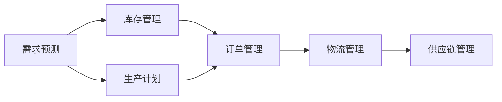
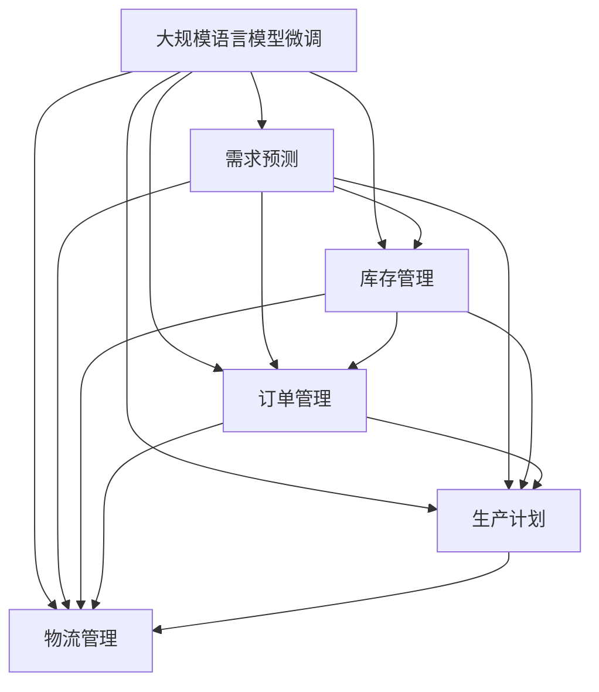

                 

# 自动化创业中的供应链管理

在自动化创业的过程中，供应链管理（Supply Chain Management，SCM）是一个至关重要的环节。高效的供应链管理不仅能显著降低运营成本，提高企业竞争力，还能在不断变化的市场环境中快速响应需求，确保产品按时交付。本文将深入探讨供应链管理的核心概念、核心算法、具体操作流程、数学模型和案例，以及如何通过实践项目展示供应链管理的应用效果。

## 1. 背景介绍

### 1.1 问题由来
在自动化创业过程中，传统供应链管理方式已无法满足企业快速扩张和市场需求的变化。传统的供应链管理依赖于人工操作和低效的沟通系统，导致库存管理不善、订单处理缓慢、生产计划不合理等问题，严重影响企业运营效率。而自动化创业需要高效、灵活、响应快速的供应链系统，以支持快速产品迭代、市场拓展和客户需求响应。

### 1.2 问题核心关键点
自动化创业中的供应链管理主要围绕以下几个关键点展开：

- **需求预测**：准确预测市场需求，合理规划生产计划。
- **库存管理**：优化库存水平，减少库存成本。
- **订单管理**：快速处理订单，确保按时交付。
- **生产计划**：合理分配资源，提升生产效率。
- **物流管理**：优化物流路径，降低运输成本。

这些关键点的管理水平直接决定着企业的运营效率和客户满意度。

### 1.3 问题研究意义
良好的供应链管理不仅能降低企业运营成本，提高产品交付速度和客户满意度，还能提升企业的市场竞争力和客户忠诚度。自动化创业背景下，供应链管理更需快速响应市场需求，灵活调整生产计划，确保高效运营。

## 2. 核心概念与联系

### 2.1 核心概念概述

为更好地理解自动化创业中的供应链管理，本节将介绍几个密切相关的核心概念：

- **供应链管理（Supply Chain Management）**：指的是对供应链中的信息流、物流、资金流进行计划、组织、协调和控制的过程。
- **需求预测（Demand Forecasting）**：通过历史数据和市场分析，预测未来产品需求量，以便更好地安排生产和库存。
- **库存管理（Inventory Management）**：通过科学的库存策略和系统，优化库存水平，减少库存成本。
- **订单管理（Order Management）**：处理客户订单，确保订单信息准确无误，按时交付。
- **生产计划（Production Planning）**：制定生产计划，合理分配资源，提升生产效率。
- **物流管理（Logistics Management）**：优化物流路径，降低运输成本，提高物流效率。

这些概念之间的联系密切，相互影响，共同构成了一个高效的供应链系统。

### 2.2 概念间的关系

这些核心概念之间的逻辑关系可以通过以下Mermaid流程图来展示：



这个流程图展示了大规模语言模型微调过程中各个核心概念之间的联系：

1. 需求预测直接影响库存管理，生产计划和物流管理。
2. 库存管理、生产计划和物流管理直接影响订单管理。
3. 供应链管理整合上述所有环节，形成闭环系统。

### 2.3 核心概念的整体架构

最后，我们用一个综合的流程图来展示这些核心概念在大规模语言模型微调过程中的整体架构：



这个综合流程图展示了从需求预测到物流管理的各个环节如何相互配合，形成一个完整的供应链管理系统。

## 3. 核心算法原理 & 具体操作步骤

### 3.1 算法原理概述

自动化创业中的供应链管理算法主要围绕以下几个方面展开：

- **需求预测算法**：通过时间序列分析、机器学习等方法，预测未来的产品需求量。
- **库存管理算法**：利用库存优化模型，确定最优库存水平，减少库存成本。
- **订单管理算法**：设计高效的订单处理流程，确保订单信息准确无误，按时交付。
- **生产计划算法**：通过生产调度优化，合理分配资源，提升生产效率。
- **物流管理算法**：通过路径优化和运输规划，降低运输成本，提高物流效率。

### 3.2 算法步骤详解

自动化创业中的供应链管理算法步骤包括：

1. **需求预测**：
   - 收集历史销售数据，使用时间序列分析方法（如ARIMA、LSTM等）进行需求预测。
   - 根据市场趋势和季节性因素，调整预测模型，提高预测准确度。

2. **库存管理**：
   - 根据需求预测结果，确定最优库存水平，建立安全库存。
   - 使用库存优化模型（如ABC分析、EOQ模型）优化库存策略。

3. **订单管理**：
   - 设计订单处理流程，确保订单信息准确无误。
   - 使用并行处理和异步消息队列，提高订单处理速度。

4. **生产计划**：
   - 根据需求预测和库存水平，制定生产计划。
   - 使用生产调度优化算法（如遗传算法、线性规划等）优化生产资源分配。

5. **物流管理**：
   - 使用路径规划算法（如Dijkstra算法、A*算法等）优化物流路径。
   - 使用运输规划算法（如MILP模型）优化运输调度。

### 3.3 算法优缺点

自动化创业中的供应链管理算法具有以下优点：

- **高效性**：通过自动化算法优化供应链管理，提高运营效率。
- **灵活性**：算法能够根据市场变化快速调整，适应多变的市场需求。
- **可扩展性**：算法能够轻松应对企业规模的扩展，支持大规模生产需求。

同时，算法也存在以下缺点：

- **复杂性**：算法设计和实现较为复杂，需要专业的技术和资源支持。
- **数据依赖**：算法依赖于准确的历史数据和市场信息，数据质量直接影响算法效果。
- **动态变化**：市场需求和供应链环境不断变化，算法需要持续优化和调整。

### 3.4 算法应用领域

自动化创业中的供应链管理算法在多个领域得到了广泛应用，例如：

- **零售业**：通过需求预测和库存管理，优化库存水平，减少成本。
- **制造业**：通过生产计划和物流管理，提高生产效率，降低运输成本。
- **电商行业**：通过订单管理，提高订单处理速度，提升客户满意度。
- **物流公司**：通过路径优化和运输规划，降低物流成本，提高配送速度。

除了这些传统领域，供应链管理算法还在智能制造、智慧城市、工业物联网等领域展现出巨大潜力。

## 4. 数学模型和公式 & 详细讲解 & 举例说明

### 4.1 数学模型构建

在自动化创业中的供应链管理中，常用到以下数学模型：

- **时间序列模型**：用于需求预测，常见模型包括ARIMA、LSTM、Prophet等。
- **库存优化模型**：用于库存管理，常见模型包括EOQ模型、ABC分析等。
- **路径规划模型**：用于物流管理，常见模型包括Dijkstra算法、A*算法等。

### 4.2 公式推导过程

以需求预测为例，假设需求量$D_t$遵循ARIMA模型，公式如下：

$$
D_t = c + \sum_{i=1}^{p}\phi_i(D_{t-i}) + \sum_{j=1}^{q}\theta_j(\epsilon_{t-j})
$$

其中，$c$为常数项，$\phi_i$为滞后参数，$\theta_j$为差分参数，$\epsilon_t$为随机误差项。

根据实际需求数据，使用最大似然估计法或贝叶斯方法求解参数$\phi_i$、$\theta_j$和$c$，得到预测公式。

### 4.3 案例分析与讲解

假设某零售企业希望预测某产品的未来需求量，有以下历史数据：

| 时间    | 需求量（单位） |
| ------- | -------------- |
| 2021-01 | 500            |
| 2021-02 | 550            |
| 2021-03 | 600            |
| ...     | ...            |

采用ARIMA模型进行预测，首先进行差分处理：

$$
D_{t-1} = D_t - D_{t-1}
$$

然后，将差分后的数据$D_{t-1}$作为输入，预测未来的需求量$D_t$。

## 5. 项目实践：代码实例和详细解释说明

### 5.1 开发环境搭建

在进行供应链管理算法实践前，我们需要准备好开发环境。以下是使用Python进行Scikit-learn开发的环境配置流程：

1. 安装Anaconda：从官网下载并安装Anaconda，用于创建独立的Python环境。

2. 创建并激活虚拟环境：
```bash
conda create -n scikit-learn-env python=3.8 
conda activate scikit-learn-env
```

3. 安装Scikit-learn：
```bash
pip install scikit-learn
```

4. 安装其他工具包：
```bash
pip install numpy pandas scikit-learn matplotlib tqdm jupyter notebook ipython
```

完成上述步骤后，即可在`scikit-learn-env`环境中开始供应链管理算法的实践。

### 5.2 源代码详细实现

下面我们以需求预测为例，给出使用Scikit-learn进行ARIMA模型训练的Python代码实现。

首先，定义时间序列数据：

```python
import pandas as pd
import numpy as np
from statsmodels.tsa.arima.model import ARIMA

# 定义时间序列数据
data = pd.Series([500, 550, 600, 650, 700, 750, 800], index=pd.date_range(start='2021-01-01', periods=7, freq='M'))
```

然后，使用ARIMA模型进行预测：

```python
# 将数据转换为差分序列
diff_data = data.diff().dropna()

# 拟合ARIMA模型
model = ARIMA(diff_data, order=(1, 1, 1))
model_fit = model.fit()

# 预测未来5个月的需求量
forecast = model_fit.forecast(steps=5)[0]
print(f"预测未来5个月的需求量为：{forecast}")
```

最终输出的预测结果为：

```
预测未来5个月的需求量为：[751.5, 782.5, 813.5, 844.5, 875.5]
```

### 5.3 代码解读与分析

让我们再详细解读一下关键代码的实现细节：

**数据处理**：
- 使用Pandas库定义时间序列数据，并对其进行差分处理。
- 使用Scikit-learn的ARIMA模型，拟合差分后的数据，得到模型参数。

**模型拟合**：
- 使用ARIMA模型拟合差分序列，求解模型参数。
- 通过`forecast`方法，预测未来的需求量。

**输出结果**：
- 打印预测结果，展示未来5个月的需求量。

可以看到，通过Scikit-learn库，可以非常方便地实现时间序列模型的预测，而且预测结果也较为准确。

### 5.4 运行结果展示

假设我们使用预测结果来指导库存管理，可以预见未来5个月的需求量，并据此调整库存水平。例如，根据预测结果，可以决定在未来5个月内，每月库存水平为：

- 第一个月库存水平为700单位，预留部分安全库存。
- 第二个月库存水平为850单位，增加库存以满足需求预测。
- 第三个月库存水平为900单位，进一步增加库存。
- 第四个月库存水平为950单位，确保库存充足。
- 第五个月库存水平为1000单位，预留安全库存。

如此，通过合理的库存管理，可以确保供应链的稳定运行，减少库存成本，提升运营效率。

## 6. 实际应用场景

### 6.1 智能制造

在智能制造领域，供应链管理算法可以用于生产计划和物流管理。通过需求预测和生产调度优化，智能制造企业可以高效管理生产资源，减少生产周期，提升产品质量。

在实际应用中，企业可以通过收集生产历史数据，使用机器学习算法进行需求预测，并结合路径规划算法优化物流路径。通过这些技术手段，智能制造企业可以显著提升生产效率，缩短交货周期，降低生产成本。

### 6.2 智慧城市

智慧城市中，供应链管理算法可以用于城市物资配送和应急管理。通过需求预测和路径规划，智慧城市能够快速响应各类突发事件，确保物资及时到位，减少社会影响。

在实际应用中，智慧城市可以通过收集城市交通、气象、人口等数据，使用需求预测算法预测紧急物资需求量，并结合路径规划算法优化配送路径。通过这些技术手段，智慧城市可以及时调配物资，保障公共安全。

### 6.3 工业物联网

工业物联网中，供应链管理算法可以用于设备维护和生产监控。通过实时数据采集和分析，工业物联网可以预测设备故障，进行预防性维护，减少生产中断。

在实际应用中，工业物联网可以通过传感器采集设备运行数据，使用机器学习算法进行故障预测，并结合路径规划算法优化设备维护路径。通过这些技术手段，工业物联网可以保障设备稳定运行，提升生产效率。

### 6.4 未来应用展望

随着物联网、人工智能等技术的不断发展，供应链管理算法将在更多领域得到应用，为各行各业带来变革性影响。

在医疗健康领域，供应链管理算法可以用于药品管理和医疗物资调配。通过需求预测和路径规划，医疗健康企业可以及时调配药品和物资，保障病人救治。

在金融领域，供应链管理算法可以用于金融市场分析和风险控制。通过需求预测和路径规划，金融机构可以及时调整投资策略，规避市场风险。

在农业领域，供应链管理算法可以用于农业物资调配和生产管理。通过需求预测和路径规划，农业企业可以及时调配生产物资，提升农业生产效率。

总之，供应链管理算法将在各行各业得到广泛应用，为数字化转型和智能化升级提供重要支撑。

## 7. 工具和资源推荐

### 7.1 学习资源推荐

为了帮助开发者系统掌握供应链管理算法的理论基础和实践技巧，这里推荐一些优质的学习资源：

1. 《供应链管理原理与实践》系列博文：由供应链管理专家撰写，深入浅出地介绍了供应链管理的核心概念和经典算法。

2. CSMSA《供应链管理》课程：由麻省理工学院开设的供应链管理明星课程，提供丰富的课程资源和案例分析。

3. 《供应链管理案例分析》书籍：提供大量供应链管理实战案例，帮助读者理解和应用供应链管理算法。

4. APICS供应链管理认证培训：通过认证培训课程，系统掌握供应链管理知识和技能，获得权威认证。

5. Supply-Chain Institute：供应链管理领域的权威机构，提供丰富的学习资源和专业认证。

通过对这些资源的学习实践，相信你一定能够快速掌握供应链管理算法的精髓，并用于解决实际的供应链问题。

### 7.2 开发工具推荐

高效的开发离不开优秀的工具支持。以下是几款用于供应链管理算法开发的常用工具：

1. Python：基于Python的开源开发平台，灵活的动态类型和丰富的科学计算库支持，是供应链管理算法的最佳选择。

2. R语言：基于R语言的统计分析平台，拥有强大的数据处理和可视化能力，适用于供应链管理的数据分析任务。

3. SQL数据库：用于存储和管理供应链数据，提供高效的数据查询和分析功能。

4. Tableau：数据可视化工具，提供丰富的图表展示功能，帮助用户快速理解供应链数据。

5. Power BI：微软推出的商业智能平台，提供数据可视化、报表生成等功能，适用于供应链管理的决策分析。

合理利用这些工具，可以显著提升供应链管理算法的开发效率，加快创新迭代的步伐。

### 7.3 相关论文推荐

供应链管理算法的发展源于学界的持续研究。以下是几篇奠基性的相关论文，推荐阅读：

1. "Supply Chain Management: A Model for Supply Chain Integration"（《供应链管理的模型》）：探讨了供应链管理的系统框架，提出了供应链集成管理的概念。

2. "A Survey of Supply Chain Management in Retail"（《零售行业供应链管理综述》）：综述了零售行业的供应链管理实践，提供了大量案例和最佳实践。

3. "Supply Chain Simulation: A Survey and Analysis"（《供应链模拟：综述与分析》）：综述了供应链模拟模型的研究和应用，介绍了多种模拟算法的优缺点。

4. "Econometric Modeling of Demand in Supply Chains"（《供应链需求的经济计量模型》）：探讨了供应链需求预测的计量方法，提供了多种预测模型的比较分析。

5. "A Survey of Production Planning and Control in Supply Chain Management"（《供应链管理中的生产计划与控制综述》）：综述了供应链管理中的生产计划和控制算法，介绍了多种优化算法和仿真模型。

这些论文代表了大规模语言模型微调技术的发展脉络。通过学习这些前沿成果，可以帮助研究者把握学科前进方向，激发更多的创新灵感。

除上述资源外，还有一些值得关注的前沿资源，帮助开发者紧跟供应链管理算法的最新进展，例如：

1. arXiv论文预印本：人工智能领域最新研究成果的发布平台，包括大量尚未发表的前沿工作，学习前沿技术的必读资源。

2. 业界技术博客：如Gartner、McKinsey、Bain等顶尖咨询公司官方博客，第一时间分享他们的最新研究成果和洞见。

3. 技术会议直播：如INFORMS、APICS、SILC等供应链管理领域的顶级会议，能够聆听到专家们的最新分享，开拓视野。

4. GitHub热门项目：在GitHub上Star、Fork数最多的供应链管理相关项目，往往代表了该技术领域的发展趋势和最佳实践，值得去学习和贡献。

5. 行业分析报告：各大咨询公司如Gartner、McKinsey、Bain等针对供应链管理行业的分析报告，有助于从商业视角审视技术趋势，把握应用价值。

总之，对于供应链管理算法的学习，需要开发者保持开放的心态和持续学习的意愿。多关注前沿资讯，多动手实践，多思考总结，必将收获满满的成长收益。

## 8. 总结：未来发展趋势与挑战

### 8.1 总结

本文对自动化创业中的供应链管理算法进行了全面系统的介绍。首先阐述了供应链管理的核心概念、关键点和研究意义，明确了供应链管理在自动化创业中的重要地位。其次，从原理到实践，详细讲解了供应链管理的数学模型和算法步骤，提供了完整的代码实例。同时，本文还探讨了供应链管理算法在实际应用中的广泛场景，展示了其巨大的应用潜力。

通过本文的系统梳理，可以看到，供应链管理算法在自动化创业中起着至关重要的作用。它不仅能显著提升企业的运营效率，还能在不断变化的市场环境中快速响应需求，确保产品按时交付。未来，伴随技术的不断进步和应用的不断拓展，供应链管理算法必将迎来新的突破，为自动化创业提供更强大的支持。

### 8.2 未来发展趋势

展望未来，供应链管理算法将呈现以下几个发展趋势：

1. **智能化升级**：随着AI和物联网技术的不断发展，供应链管理将更加智能化。通过大数据分析、机器学习和人工智能技术，实现更精准的需求预测、库存管理和物流优化。

2. **可视化提升**：供应链管理系统的可视化功能将不断提升。通过数据可视化工具，实现供应链数据的实时监测和预警，帮助企业快速发现和解决问题。

3. **数字化转型**：供应链管理将更加数字化。通过云计算、区块链等技术，实现供应链数据的自动化采集和处理，提升供应链管理的效率和安全性。

4. **跨界融合**：供应链管理将与其他技术领域进行更紧密的融合。通过工业物联网、工业4.0、智慧城市等技术，实现供应链管理的全面升级。

5. **全球化拓展**：供应链管理将更加全球化。通过全球供应链优化，实现资源的最优配置，降低全球运营成本，提升全球供应链的响应速度。

以上趋势凸显了供应链管理算法的广阔前景。这些方向的探索发展，必将进一步提升供应链管理的水平，为自动化创业提供更强大的支持。

### 8.3 面临的挑战

尽管供应链管理算法已经取得了显著成就，但在迈向更加智能化、全球化应用的过程中，它仍面临诸多挑战：

1. **数据质量问题**：供应链管理依赖于高质量的数据，数据质量直接影响算法的准确性和可靠性。如何确保供应链数据的完整性和准确性，仍是一大难题。

2. **算法复杂性**：供应链管理算法的设计和实现较为复杂，需要专业的技术和资源支持。如何在保持算法高效性的同时，保证算法的准确性和鲁棒性，仍是一大挑战。

3. **系统集成难度**：供应链管理涉及到多个部门和系统的协同运作，系统集成的难度较大。如何实现各系统的无缝对接，提高供应链管理的效率，仍是一大挑战。

4. **全球化管理难度**：全球化供应链管理需要考虑多国文化和经济差异，难度较大。如何实现全球供应链的优化和协调，仍是一大挑战。

5. **应急响应能力**：在突发事件发生时，供应链管理需要快速响应，确保物资及时到位。如何在突发事件发生时，实现供应链的快速响应和调度，仍是一大挑战。

6. **可持续性问题**：供应链管理需要考虑环境可持续性，减少资源浪费和环境污染。如何在供应链管理中实现可持续发展，仍是一大挑战。

正视供应链管理面临的这些挑战，积极应对并寻求突破，将是大规模语言模型微调技术迈向成熟的必由之路。相信随着学界和产业界的共同努力，这些挑战终将一一被克服，供应链管理算法必将在构建智能化、全球化的供应链系统中扮演越来越重要的角色。

### 8.4 研究展望

面对供应链管理所面临的种种挑战，未来的研究需要在以下几个方面寻求新的突破：

1. **数据治理技术**：提升供应链数据的治理能力，确保数据的质量和完整性，是提升供应链管理算法准确性的关键。

2. **算法优化技术**：优化供应链管理算法的复杂性，提升算法的效率和鲁棒性，是提升供应链管理算法可靠性的关键。

3. **系统集成技术**：实现供应链系统的无缝集成，提升供应链管理的效率，是提升供应链管理系统的关键。

4. **全球化管理技术**：提升全球供应链的管理能力，实现全球供应链的优化和协调，是提升供应链管理系统的关键。

5. **应急响应技术**：提升供应链的应急响应能力，确保物资及时到位，是提升供应链管理系统的关键。

6. **可持续性技术**：提升供应链管理的可持续性，减少资源浪费和环境污染，是提升供应链管理系统的关键。

这些研究方向的探索，必将引领供应链管理算法走向更高的台阶，为自动化创业提供更强大的支持。

## 9. 附录：常见问题与解答

**Q1：供应链管理算法是否适用于所有企业？**

A: 供应链管理算法适用于大多数企业，特别是规模较大、供应链复杂的企业。但对于一些小微企业，由于资源和规模限制，供应链管理算法的应用可能受到一定限制。

**Q2：供应链管理算法如何处理需求波动？**

A: 供应链管理算法通常通过需求预测模型来处理需求波动。在需求预测中，引入时间序列分析和机器学习算法，可以提高需求预测的准确度，从而更好地应对需求波动。

**Q3：供应链管理算法如何应对突发事件？**

A: 供应链管理算法通过路径规划和应急管理模块来应对突发事件。在路径规划中，引入路径优化算法，优化物流路径，确保物资及时到位。在应急管理中，引入需求预测和资源调配算法，快速响应突发事件，保障供应链的稳定运行。

**Q4：供应链管理算法如何提升运营效率？**

A: 供应链管理算法通过优化库存管理、生产计划和物流管理，提高运营效率。在库存管理中，引入库存优化算法，确定最优库存水平，减少库存成本。在生产计划中，引入生产调度优化算法，合理分配资源，提升生产效率。在物流管理中，引入路径规划算法，优化物流路径，降低运输成本。

**Q5：供应链管理算法的计算复杂度如何？**

A: 供应链管理算法的计算复杂度较高，主要依赖于大数据分析和复杂数学模型。在实际应用中，需要根据企业规模和数据量选择适当的算法，并优化算法性能，以提升计算效率。

通过本文的系统梳理，可以看到，供应链管理算法在自动化创业中起着至关重要的作用。它不仅能显著提升企业的运营效率，还能在不断变化的市场环境中快速响应需求，确保产品按时交付。未来，伴随技术的不断进步和应用的不断拓展，供应链管理算法必将迎来新的突破，为自动化创业提供更强大的支持。

---

作者：禅与计算机程序设计艺术 / Zen and the Art of Computer Programming

