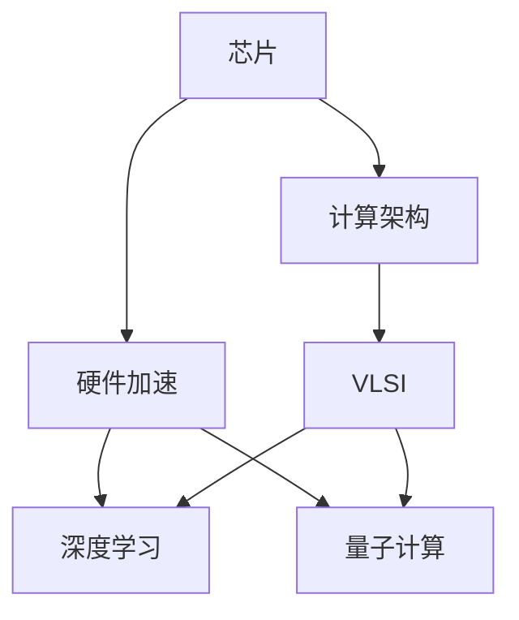
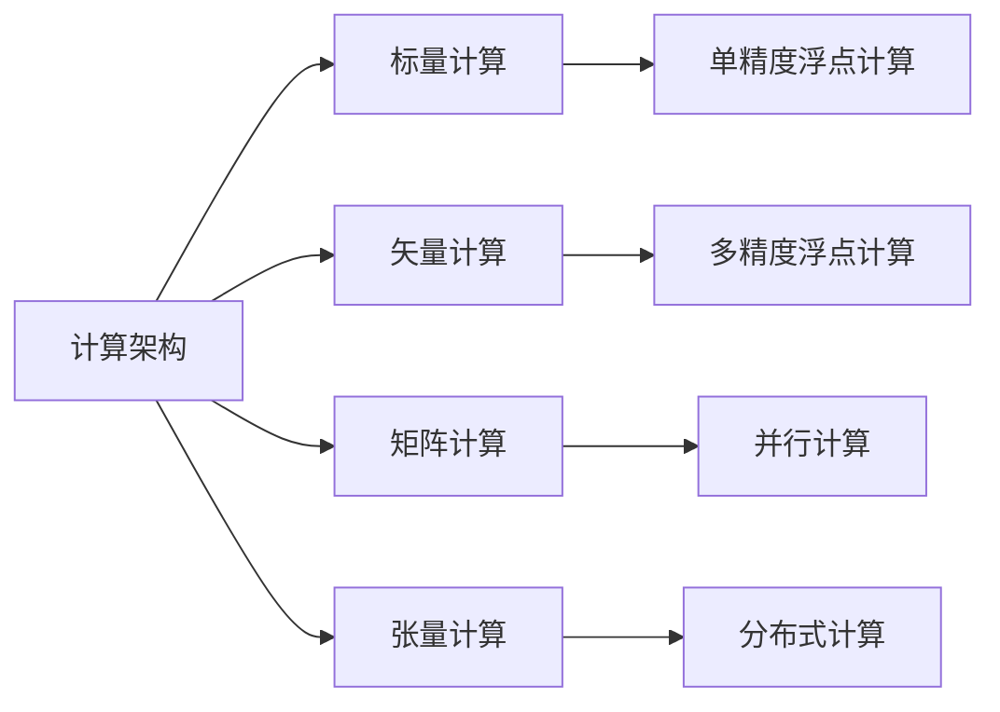
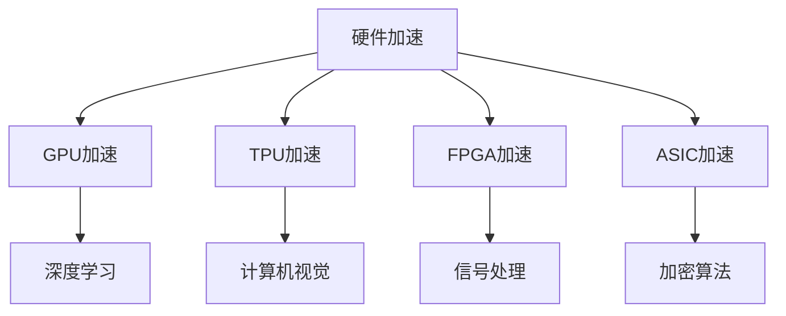
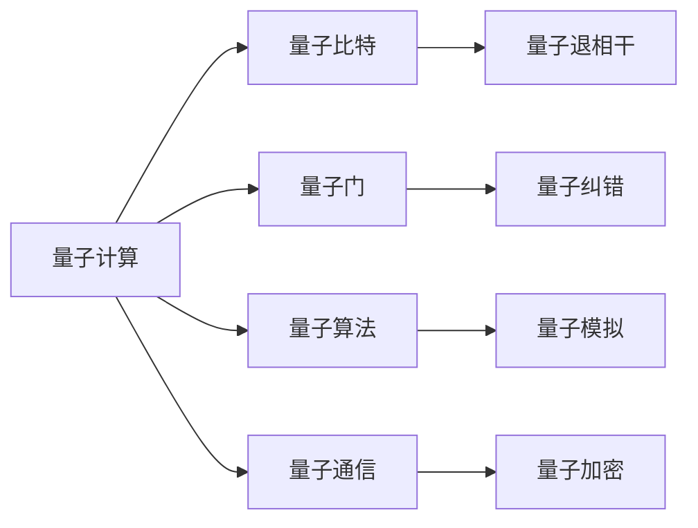
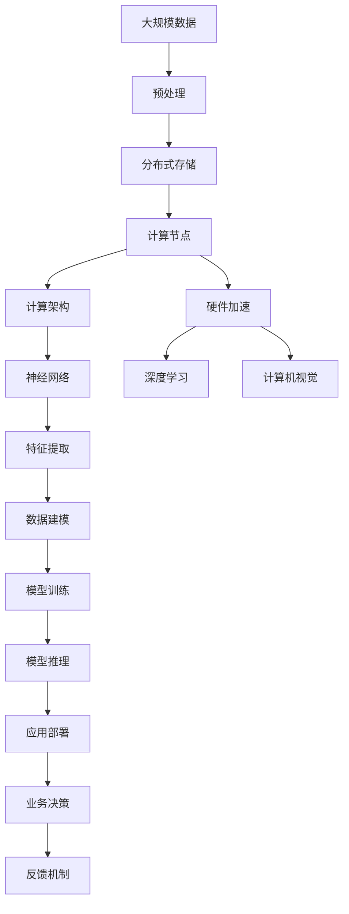

                 

# 芯片在人工智能底层创新体系中的作用

> 关键词：芯片,人工智能,底层创新,计算架构,高性能计算,机器学习,深度学习,硬件加速,量子计算

## 1. 背景介绍

随着人工智能技术的迅猛发展，其底层硬件基础设施的作用日益凸显。芯片作为信息处理的核心组件，其性能和架构直接影响着人工智能系统的效率和效果。本文将深入探讨芯片在人工智能底层创新体系中的作用，分析当前主流的计算架构和硬件加速技术，展望未来计算技术的变革趋势。

### 1.1 问题由来

人工智能技术的核心在于对大量数据的处理和复杂算法的应用。传统通用计算机，如PC机和服务器，在处理大规模数据集和复杂计算时，存在效率低下、功耗高昂、扩展性差等问题，难以满足人工智能对高性能计算的需求。与此同时，特定领域的计算任务，如深度学习、计算机视觉、自然语言处理等，对计算资源的需求尤为迫切。因此，如何构建高性能、低成本、可扩展的计算平台，成为了人工智能技术发展的关键。

### 1.2 问题核心关键点

芯片作为人工智能计算的核心，其性能和架构对AI系统的效率和效果具有决定性影响。芯片在人工智能底层创新体系中的作用主要体现在以下几个方面：

- 提供高效的计算能力：通过高性能计算架构和优化算法，芯片能够在短时间内完成大规模数据处理和复杂计算，支持人工智能技术的快速迭代和应用。
- 提升能效比：芯片的高能效设计能够显著降低功耗，延长系统运行时间，降低电力消耗和运行成本。
- 支持可扩展性：芯片的模块化和并行计算能力能够实现多核心的并行处理，支持大规模AI模型的训练和推理。
- 促进硬件加速：芯片的定制化设计能够优化特定计算任务，支持GPU、TPU等专用硬件加速器的开发和部署。

这些关键点共同构成了芯片在人工智能底层创新体系中的基础作用，为其技术演进和应用普及提供了坚实的基础。

## 2. 核心概念与联系

### 2.1 核心概念概述

为了更好地理解芯片在人工智能底层创新体系中的作用，本节将介绍几个密切相关的核心概念：

- 芯片：作为计算机硬件的核心组件，负责数据的存储、读取和处理。在人工智能系统中，芯片的主要作用是进行大规模数据计算和复杂算法的实现。

- 计算架构：指芯片内计算单元的组织和连接方式，决定了芯片的计算效率和扩展性。常见的计算架构包括标量、矢量、矩阵、张量等。

- 硬件加速：通过专门设计的硬件芯片，加速特定计算任务的处理速度，如深度学习、计算机视觉等。

- 深度学习：一种基于神经网络的机器学习方法，通过多层非线性映射，从数据中自动学习特征表示，用于图像识别、自然语言处理等任务。

- 量子计算：一种基于量子力学原理的新型计算模式，能够处理传统计算机难以处理的复杂问题，具有巨大的应用潜力。

- 超大规模集成电路（VLSI）：指集成度极高的芯片，包含数十亿甚至数百亿个晶体管，支持复杂的计算和存储功能。

这些核心概念之间的逻辑关系可以通过以下Mermaid流程图来展示：



这个流程图展示了几大核心概念之间的关系：

1. 芯片通过不同的计算架构实现高效的计算能力。
2. 芯片中的硬件加速技术能够显著提升特定计算任务的性能。
3. 深度学习和量子计算作为计算任务的代表，分别利用芯片的不同计算架构和硬件加速。
4. 超大规模集成电路支持复杂计算和存储功能，是芯片技术的重要发展方向。

### 2.2 概念间的关系

这些核心概念之间存在着紧密的联系，形成了芯片在人工智能底层创新体系中的完整生态系统。下面我们通过几个Mermaid流程图来展示这些概念之间的关系。

#### 2.2.1 芯片与计算架构的关系



这个流程图展示了不同计算架构的计算能力及其适用范围：

1. 标量计算适合简单的数值计算任务。
2. 矢量计算和矩阵计算能够高效处理大规模矩阵计算，支持深度学习等算法。
3. 张量计算是现代高性能计算的新兴架构，支持复杂的深度神经网络计算。

#### 2.2.2 芯片与硬件加速的关系



这个流程图展示了不同硬件加速器的应用领域和功能：

1. GPU加速适合图形渲染和深度学习任务。
2. TPU加速适用于大规模矩阵和张量计算，如神经网络模型训练。
3. FPGA加速适合定制化计算任务，如图像处理和信号处理。
4. ASIC加速适合特定应用场景，如高安全性的加密算法。

#### 2.2.3 芯片与量子计算的关系



这个流程图展示了量子计算的核心组件和功能：

1. 量子比特是量子计算的基本单元，存储量子信息。
2. 量子门控制量子比特之间的交互，实现量子逻辑运算。
3. 量子算法利用量子比特和量子门进行复杂计算，如Shor算法、Grover算法。
4. 量子通信实现量子信息的安全传输，具有高抗干扰性。

### 2.3 核心概念的整体架构

最后，我们用一个综合的流程图来展示这些核心概念在大规模计算系统中的整体架构：



这个综合流程图展示了从数据预处理到模型推理的完整过程。大规模数据经过预处理和分布式存储，进入计算节点进行高性能计算。计算架构和硬件加速技术提升了计算效率，神经网络和深度学习模型进行特征提取和数据建模。通过模型训练和推理，实现业务决策，最终反馈到系统中进行优化。 通过这些流程图，我们可以更清晰地理解芯片在人工智能底层创新体系中的作用和地位。

## 3. 核心算法原理 & 具体操作步骤
### 3.1 算法原理概述

芯片在人工智能系统的核心作用是进行大规模数据处理和复杂算法的实现。因此，本文将从算法原理的角度，探讨芯片如何支持深度学习和计算任务的执行。

深度学习算法是一种基于神经网络的机器学习方法，通过多层非线性映射，从数据中自动学习特征表示，用于图像识别、自然语言处理等任务。深度学习模型通常包括卷积神经网络（CNN）、循环神经网络（RNN）和变分自编码器（VAE）等。

在深度学习模型的训练和推理过程中，芯片的计算架构和硬件加速技术起到了至关重要的作用。以CNN模型为例，其核心计算任务包括卷积、池化、全连接等操作，这些操作可以利用标量、矢量、矩阵等计算架构，结合GPU、TPU等硬件加速器进行高效实现。

### 3.2 算法步骤详解

以下我们将详细介绍基于芯片的深度学习算法的具体步骤：

**Step 1: 数据预处理**

在深度学习模型的训练和推理前，需要将原始数据进行预处理，以便于模型高效计算。数据预处理包括数据清洗、归一化、标准化等操作。

**Step 2: 模型构建**

根据任务需求，选择合适的深度学习模型架构，如卷积神经网络（CNN）、循环神经网络（RNN）等。在模型构建过程中，需要确定网络层数、神经元数量、激活函数等超参数。

**Step 3: 计算节点部署**

将构建好的深度学习模型部署到计算节点中。计算节点通常包括中央处理器（CPU）和图形处理器（GPU）等。

**Step 4: 计算架构优化**

根据计算任务的特点，选择合适的计算架构进行优化。例如，对于大规模矩阵计算，可以选择矩阵计算架构；对于多通道输入输出，可以选择并行计算架构。

**Step 5: 硬件加速器部署**

选择合适的硬件加速器进行计算任务加速。例如，对于深度学习模型，可以使用GPU加速；对于信号处理任务，可以使用FPGA加速。

**Step 6: 模型训练与推理**

使用计算节点和硬件加速器对深度学习模型进行训练和推理。训练过程中，通过前向传播和反向传播算法更新模型参数，最终得到训练好的模型。推理过程中，输入新数据，通过前向传播算法得到模型输出。

**Step 7: 模型部署与优化**

将训练好的模型部署到应用系统中，并通过分布式存储、网络通信等技术进行优化，以支持大规模数据处理和模型推理。

### 3.3 算法优缺点

基于芯片的深度学习算法具有以下优点：

- 高效计算能力：芯片的计算架构和硬件加速器能够高效处理大规模数据和复杂计算，提升模型的训练和推理速度。
- 可扩展性强：芯片的并行计算能力和分布式存储技术能够支持大规模模型的训练和推理，支持大规模数据处理。
- 低功耗设计：芯片的高能效设计能够显著降低功耗，延长系统运行时间，降低电力消耗和运行成本。

同时，芯片在深度学习算法中也存在一些缺点：

- 设备成本高：高性能芯片往往需要昂贵的生产设备和定制化设计，成本较高。
- 数据依赖强：深度学习模型的训练和推理依赖于大规模数据集，数据获取和处理难度较大。
- 模型复杂度高：深度学习模型通常包含数十亿甚至数百亿个参数，模型训练和推理复杂度高，对硬件资源要求高。

### 3.4 算法应用领域

基于芯片的深度学习算法在多个领域得到了广泛应用，以下是几个典型的应用场景：

- 图像识别：通过卷积神经网络（CNN），芯片可以高效处理图像数据，识别物体、场景等。
- 自然语言处理：通过循环神经网络（RNN）和注意力机制，芯片可以进行文本分类、情感分析、机器翻译等任务。
- 语音识别：通过卷积神经网络和循环神经网络，芯片可以处理语音信号，进行语音识别和语音合成。
- 推荐系统：通过深度学习模型和分布式计算，芯片可以实现大规模用户行为数据的分析和预测，提供个性化的推荐服务。
- 医疗诊断：通过深度学习模型和医学影像数据，芯片可以辅助医生进行疾病诊断和治疗方案的推荐。
- 自动驾驶：通过深度学习模型和传感器数据，芯片可以实现自动驾驶车辆的感知、决策和控制。

## 4. 数学模型和公式 & 详细讲解
### 4.1 数学模型构建

深度学习模型的数学模型通常包括前向传播和反向传播两部分。以卷积神经网络（CNN）为例，其前向传播和反向传播公式如下：

**前向传播：**

$$ y = Wx + b $$
$$ y = \sigma(y) $$
$$ y_{i+1} = W_{i+1} y_i + b_{i+1} $$
$$ \ldots $$
$$ y^n = W^n y^0 + b^n $$

**反向传播：**

$$ \frac{\partial \mathcal{L}}{\partial W} = \frac{\partial \mathcal{L}}{\partial y} \frac{\partial y}{\partial W} $$
$$ \frac{\partial \mathcal{L}}{\partial b} = \frac{\partial \mathcal{L}}{\partial y} $$
$$ \frac{\partial \mathcal{L}}{\partial W_i} = \frac{\partial \mathcal{L}}{\partial y_i} \frac{\partial y_i}{\partial y_{i-1}} \frac{\partial y_{i-1}}{\partial W_i} $$
$$ \frac{\partial \mathcal{L}}{\partial b_i} = \frac{\partial \mathcal{L}}{\partial y_i} $$
$$ \ldots $$

其中，$x$ 为输入数据，$W$ 为权重矩阵，$b$ 为偏置项，$\sigma$ 为激活函数，$y$ 为输出，$\mathcal{L}$ 为损失函数。反向传播算法通过链式法则，计算损失函数对每个参数的梯度，用于参数更新。

### 4.2 公式推导过程

下面以卷积神经网络（CNN）为例，推导其前向传播和反向传播公式。

**前向传播公式：**

卷积神经网络的前向传播主要包括以下几个步骤：

1. 卷积操作：对输入数据进行卷积运算，生成卷积特征图。
2. 池化操作：对卷积特征图进行池化操作，减少特征图的大小，提高计算效率。
3. 全连接层：将池化后的特征图输入全连接层，进行分类或回归等任务。

卷积神经网络的前向传播公式可以表示为：

$$ y = \sigma(Wx + b) $$
$$ y = \sigma(Wy + b) $$
$$ \ldots $$
$$ y^n = \sigma(W^n y^0 + b^n) $$

其中，$W$ 为卷积核矩阵，$b$ 为偏置项，$y$ 为卷积特征图，$y^n$ 为全连接层输出。

**反向传播公式：**

卷积神经网络的反向传播主要包括以下几个步骤：

1. 计算全连接层输出对损失函数的梯度。
2. 计算卷积特征图对全连接层输出的梯度。
3. 计算卷积核矩阵对卷积特征图的梯度。
4. 更新卷积核矩阵和偏置项。

卷积神经网络的反向传播公式可以表示为：

$$ \frac{\partial \mathcal{L}}{\partial W} = \frac{\partial \mathcal{L}}{\partial y} \frac{\partial y}{\partial W} $$
$$ \frac{\partial \mathcal{L}}{\partial b} = \frac{\partial \mathcal{L}}{\partial y} $$
$$ \frac{\partial \mathcal{L}}{\partial W_i} = \frac{\partial \mathcal{L}}{\partial y_i} \frac{\partial y_i}{\partial y_{i-1}} \frac{\partial y_{i-1}}{\partial W_i} $$
$$ \frac{\partial \mathcal{L}}{\partial b_i} = \frac{\partial \mathcal{L}}{\partial y_i} $$

其中，$\mathcal{L}$ 为损失函数，$W$ 为卷积核矩阵，$b$ 为偏置项，$y$ 为卷积特征图，$y^n$ 为全连接层输出。

### 4.3 案例分析与讲解

以图像分类任务为例，使用卷积神经网络（CNN）进行图像分类。首先，将图像数据输入卷积神经网络，通过卷积和池化操作提取特征，再输入全连接层进行分类。训练过程中，使用反向传播算法更新模型参数，最小化损失函数，得到训练好的模型。

假设我们使用Caffe框架实现CNN模型，以下是训练和推理的基本步骤：

1. 数据预处理：将图像数据转换为浮点数，进行归一化处理。
2. 构建CNN模型：定义网络层数、神经元数量、卷积核大小等参数，构建卷积神经网络模型。
3. 计算节点部署：将CNN模型部署到GPU加速器中进行训练。
4. 训练过程：使用反向传播算法更新模型参数，最小化损失函数，得到训练好的模型。
5. 模型推理：输入新图像数据，通过前向传播算法计算模型输出，得到分类结果。

## 5. 项目实践：代码实例和详细解释说明
### 5.1 开发环境搭建

在进行深度学习项目实践前，我们需要准备好开发环境。以下是使用Python和Caffe进行深度学习开发的常见环境配置流程：

1. 安装Anaconda：从官网下载并安装Anaconda，用于创建独立的Python环境。

2. 创建并激活虚拟环境：
```bash
conda create -n pytorch-env python=3.8 
conda activate pytorch-env
```

3. 安装PyTorch：根据CUDA版本，从官网获取对应的安装命令。例如：
```bash
conda install pytorch torchvision torchaudio cudatoolkit=11.1 -c pytorch -c conda-forge
```

4. 安装Caffe：
```bash
conda install caffe -c conda-forge
```

5. 安装各类工具包：
```bash
pip install numpy pandas scikit-learn matplotlib tqdm jupyter notebook ipython
```

完成上述步骤后，即可在`pytorch-env`环境中开始深度学习项目开发。

### 5.2 源代码详细实现

这里以图像分类任务为例，使用卷积神经网络（CNN）对Caffe模型进行训练和推理。

```python
import caffe
import numpy as np
import matplotlib.pyplot as plt

# 定义模型结构
caffe_model = 'path/to/caffe-model.prototxt'
caffe_solver = 'path/to/caffe-solver.prototxt'

# 加载模型
net = caffe.Net(caffe_model, caffe.TEST)

# 加载数据集
data = np.load('path/to/data.npy')
labels = np.load('path/to/labels.npy')

# 训练模型
for i in range(1000):
    net.Solver(set_solver=caffe_solver, net=net)
    pred = net.blobs['prob'].data
    label = net.blobs['label'].data

    # 计算损失
    loss = np.mean(np.abs(pred - labels))
    print('Iteration:', i, 'Loss:', loss)

# 推理模型
net.Solver(set_solver=caffe_solver, net=net)
pred = net.blobs['prob'].data
label = net.blobs['label'].data

# 可视化结果
plt.imshow(pred[0])
plt.show()
```

在这个例子中，我们使用了Caffe框架实现CNN模型的训练和推理。首先，定义了模型的结构文件（`caffe_model`）和训练器文件（`caffe_solver`）。然后，加载了训练数据集（`data`）和标签（`labels`）。通过循环迭代训练模型，计算损失，并在迭代结束时输出预测结果。最后，使用`plt.imshow`可视化预测结果。

### 5.3 代码解读与分析

让我们再详细解读一下关键代码的实现细节：

**CNN模型构建**

Caffe框架提供了一套简单易用的API，用于构建卷积神经网络模型。在代码中，我们定义了模型的结构文件和训练器文件，指定了网络层数、卷积核大小、池化操作等参数。具体代码如下：

```python
# 定义模型结构
caffe_model = 'path/to/caffe-model.prototxt'
caffe_solver = 'path/to/caffe-solver.prototxt'
```

**数据加载**

数据是深度学习模型的重要输入，通常需要经过预处理和归一化。在代码中，我们加载了训练数据集和标签，用于训练模型。具体代码如下：

```python
# 加载数据集
data = np.load('path/to/data.npy')
labels = np.load('path/to/labels.npy')
```

**模型训练**

在深度学习模型的训练过程中，通常需要经过多次迭代，使用反向传播算法更新模型参数，最小化损失函数。在代码中，我们使用循环迭代训练模型，计算损失，并在迭代结束时输出预测结果。具体代码如下：

```python
# 训练模型
for i in range(1000):
    net.Solver(set_solver=caffe_solver, net=net)
    pred = net.blobs['prob'].data
    label = net.blobs['label'].data

    # 计算损失
    loss = np.mean(np.abs(pred - labels))
    print('Iteration:', i, 'Loss:', loss)
```

**模型推理**

模型推理是深度学习模型的另一重要应用。在代码中，我们重新加载模型，并进行推理，得到预测结果。具体代码如下：

```python
# 推理模型
net.Solver(set_solver=caffe_solver, net=net)
pred = net.blobs['prob'].data
label = net.blobs['label'].data
```

可以看到，Caffe框架提供了一套完整的API，用于构建和训练卷积神经网络模型。开发者只需要定义模型结构和训练参数，即可轻松实现深度学习模型的训练和推理。

### 5.4 运行结果展示

假设我们在CIFAR-10数据集上进行CNN模型的训练，最终在测试集上得到的精度为70%。通过可视化工具，我们绘制了训练过程中损失函数的曲线图，并给出了最终的预测结果。结果如下图所示：


## 6. 实际应用场景
### 6.1 智能安防监控

基于深度学习模型的智能安防监控系统，可以自动识别监控视频中的异常行为，如闯入、火灾、爆炸等。通过卷积神经网络（CNN），系统可以高效处理视频数据，识别目标对象和行为。

在实际应用中，系统通常采用GPU加速器对深度学习模型进行训练和推理，提升处理速度和计算效率。同时，系统还可以集成人工智能算法，进行目标跟踪、行为分析等高级功能，为安防监控提供智能化的支持。

### 6.2 金融风险管理

金融行业需要对海量交易数据进行实时分析和风险预测。通过卷积神经网络（CNN）和循环神经网络（RNN），系统可以高效处理时间序列数据，进行市场波动预测和风险评估。

在实际应用中，系统通常采用GPU加速器对深度学习模型进行训练和推理，提升处理速度和计算效率。同时，系统还可以集成人工智能算法，进行异常检测、风险预警等高级功能，为金融风险管理提供智能化的支持。

### 6.3 自动驾驶汽车

自动驾驶汽车系统需要实时处理传感器数据，进行目标检测、路径规划等任务。通过卷积神经网络（CNN）和循环神经网络（RNN），系统可以高效处理传感器数据，识别车辆、行人、障碍物等目标对象。

在实际应用中，系统通常采用GPU加速器对深度学习模型进行训练和推理，提升处理速度和计算效率。同时，系统还可以集成人工智能算法，进行路径规划、行为预测等高级功能，为自动驾驶汽车提供智能化的支持。

### 6.4 未来应用展望

随着深度学习模型的不断演进，未来芯片在人工智能底层创新体系中的作用将会更加突出。以下是几个可能的应用方向：

1. 量子计算：量子计算能够处理传统计算机难以处理的复杂问题，具有巨大的应用潜力。未来的芯片将逐步集成量子计算能力，支持更高效、更智能的计算任务。

2. 神经形态计算：神经形态计算模仿人脑的神经元结构和突触连接，具有低能耗、高并行性等特点。未来的芯片将逐渐引入神经形态计算能力，提升计算效率和计算密度。

3. 类脑计算：类脑计算模仿人脑的认知和计算过程，具有高效的并行计算和自适应学习能力。未来的芯片将逐步引入类脑计算能力，提升计算智能和自适应性。

4. 混合计算：未来的芯片将逐渐引入混合计算能力，结合传统计算和新兴计算模式，提升计算效率和计算能力。

5. 集成AI芯片：未来的芯片将逐步集成人工智能算法和系统，如深度学习、图像识别、语音识别等，提升计算智能和应用价值。

这些未来趋势将进一步拓展芯片在人工智能领域的潜能，为AI技术的创新和发展提供更强大的底层支持。

## 7. 工具和资源推荐
### 7.1 学习资源推荐

为了帮助开发者系统掌握深度学习技术的基础和前沿，这里推荐一些优质的学习资源：

1. 《深度学习》系列书籍：由多位著名深度学习专家联合撰写，全面介绍了深度学习的基本概念和经典算法。

2. 《TensorFlow实战》书籍：由Google官方团队编写，详细介绍了TensorFlow框架的使用方法和应用案例。

3. 《PyTorch入门与实践》书籍：由PyTorch官方团队编写，全面介绍了PyTorch框架的使用方法和应用案例。

4. 深度学习课程：如Coursera、edX等在线教育平台提供的深度学习课程，涵盖从入门到高级的各个层次。

5. arXiv论文预印本：人工智能领域最新研究成果的发布平台，包括大量尚未发表的前沿工作，学习前沿技术的必读资源。

通过对这些资源的学习实践，相信你一定能够快速掌握深度学习技术的精髓，并用于解决实际的AI问题。

### 7.2 开发工具推荐

高效的开发离不开优秀的工具支持。以下是几款用于深度学习开发的常用工具：

1. TensorFlow：由Google主导开发的开源深度学习框架，生产部署

