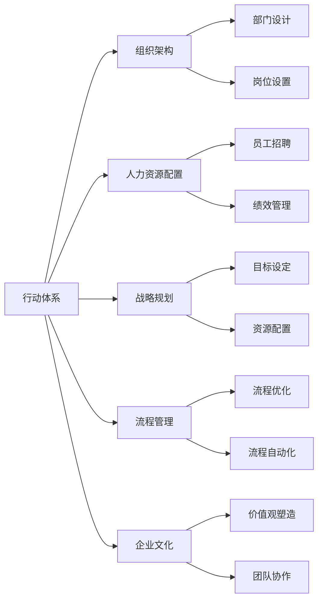
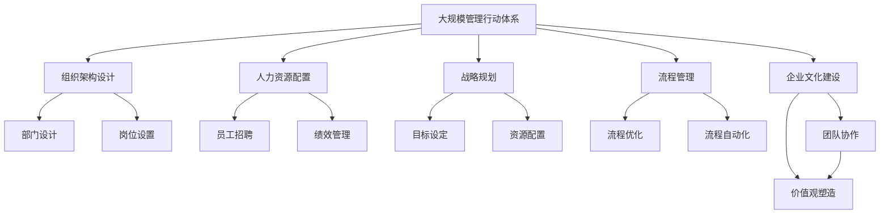

                 

# 行动体系对管理执行力的影响

> 关键词：行动体系,管理执行力,组织架构,人力资源,战略规划,流程管理,企业文化,敏捷组织

## 1. 背景介绍

### 1.1 问题由来
在当今复杂多变的商业环境中，企业面临的挑战越来越多样化、复杂化。如何快速响应市场变化，提高管理执行效率，成为众多企业追求的目标。管理执行力是衡量企业组织管理效率的重要指标，能够直接影响企业的市场竞争力、创新能力和盈利能力。

然而，许多企业在实践中发现，尽管拥有完善的战略规划和先进的技术手段，管理执行力往往难以达到预期效果。究其原因，除了外部环境的变化外，企业的内部管理结构、人力资源配置、流程管理、企业文化等因素也对执行力产生了深远影响。因此，构建一个高效的管理行动体系，成为提升管理执行力的关键。

### 1.2 问题核心关键点
构建高效的管理行动体系，核心在于以下几个关键点：
1. **组织架构设计**：如何根据企业的业务模式和战略目标，设计合适的组织结构，实现扁平化、柔性化和模块化。
2. **人力资源配置**：如何根据不同岗位的需求，合理配置人力资源，提升员工的工作满意度和生产效率。
3. **战略规划与执行**：如何将战略目标转化为具体的行动计划，并通过有效的流程和工具，确保执行到位。
4. **流程管理优化**：如何通过优化流程和标准操作程序，提高运营效率，减少资源浪费。
5. **企业文化建设**：如何塑造积极向上、团队协作的企业文化，增强员工的凝聚力和归属感。

这些关键点相互关联，共同构成了一个高效管理行动体系的基础。只有全面考虑和优化这些方面，企业才能实现高效的管理执行力。

### 1.3 问题研究意义
构建高效管理行动体系，对于提升企业的市场竞争力、提高管理效率、增强员工满意度等方面具有重要意义：
1. **提高市场竞争力**：通过优化组织架构、流程管理等措施，能够快速响应市场变化，提升企业的市场响应速度和竞争力。
2. **提升管理效率**：合理配置人力资源、优化流程管理，能够减少内部摩擦和资源浪费，提升整体管理效率。
3. **增强员工满意度**：通过企业文化建设、个性化激励等措施，提升员工的工作满意度和归属感，增强企业的凝聚力。
4. **优化战略执行**：通过明确的任务分配和流程管理，确保战略目标的顺利实现，提升企业的战略执行力。

## 2. 核心概念与联系

### 2.1 核心概念概述

为了更好地理解行动体系对管理执行力的影响，本节将介绍几个密切相关的核心概念：

- **行动体系**：指企业为了实现战略目标，设计和实施的一系列管理行动和机制。包括组织架构设计、人力资源配置、流程管理、企业文化建设等。
- **管理执行力**：指企业通过一系列管理行动和机制，实现战略目标的能力。管理执行力强弱直接决定了企业的市场响应速度、运营效率和创新能力。
- **组织架构**：指企业内部各个部门和岗位之间的层级关系和职能划分。合理的组织架构能够提高管理效率，减少内耗。
- **人力资源配置**：指根据企业的业务需求和战略目标，合理分配和利用人力资源，提升员工的工作满意度和生产效率。
- **战略规划**：指企业为了实现长期目标，制定的一系列行动计划和策略。包括短期和长期目标、市场分析、资源配置等。
- **流程管理**：指通过优化和管理业务流程，提升运营效率，减少资源浪费。包括业务流程建模、流程优化、流程自动化等。
- **企业文化**：指企业内部共同遵循的价值观、行为规范和工作氛围。积极向上的企业文化能够增强员工凝聚力和归属感。

这些核心概念之间存在着紧密的联系，形成了管理行动体系的核心框架。通过深入理解这些概念，我们可以更好地把握行动体系对管理执行力的影响。

### 2.2 概念间的关系

这些核心概念之间存在着紧密的联系，形成了管理行动体系的核心框架。下面是这些概念之间的关系图：



这个关系图展示了行动体系各组成部分之间的关系：

1. **组织架构**：通过部门设计和岗位设置，明确企业内部各个部门和岗位的职责和层级关系。
2. **人力资源配置**：通过员工招聘和绩效管理，合理配置人力资源，提升员工的工作满意度和生产效率。
3. **战略规划**：通过目标设定和资源配置，制定实现战略目标的行动计划和策略。
4. **流程管理**：通过流程优化和流程自动化，提升运营效率，减少资源浪费。
5. **企业文化**：通过价值观塑造和团队协作，增强员工的凝聚力和归属感。

这些概念共同构成了管理行动体系的核心框架，通过优化和完善这些方面，能够显著提升企业的管理执行力。

### 2.3 核心概念的整体架构

最后，我们用一个综合的流程图来展示这些核心概念在大规模管理行动体系中的整体架构：



这个综合流程图展示了从组织架构设计到企业文化建设的整体架构，每个步骤之间互相支持，共同提升管理执行力。通过这个整体架构，我们可以更清晰地理解各概念之间的联系和作用，为后续深入讨论具体的管理行动体系优化方法奠定基础。

## 3. 核心算法原理 & 具体操作步骤
### 3.1 算法原理概述

构建高效管理行动体系，核心在于通过一系列系统化的管理行动和机制，确保战略目标的顺利实现。以下是大规模管理行动体系构建的算法原理概述：

1. **组织架构设计**：根据企业的业务模式和战略目标，设计合理的组织结构，实现扁平化、柔性化和模块化。
2. **人力资源配置**：根据不同岗位的需求，合理配置人力资源，提升员工的工作满意度和生产效率。
3. **战略规划与执行**：将战略目标转化为具体的行动计划，并通过有效的流程和工具，确保执行到位。
4. **流程管理优化**：通过优化流程和标准操作程序，提高运营效率，减少资源浪费。
5. **企业文化建设**：塑造积极向上、团队协作的企业文化，增强员工的凝聚力和归属感。

这些步骤相互关联，共同构成了一个高效管理行动体系的基础。通过系统的设计和优化，能够显著提升企业的管理执行力。

### 3.2 算法步骤详解

以下是构建高效管理行动体系的具体操作步骤：

**Step 1: 组织架构设计**
- 分析企业的业务模式和战略目标，设计合理的组织结构。可以参考现代企业组织的最佳实践，如扁平化、柔性化和模块化等。
- 确定各个部门和岗位的职责和层级关系，确保信息流通和资源分配的顺畅。

**Step 2: 人力资源配置**
- 根据不同岗位的需求，合理配置人力资源。可以考虑采用人力资源管理工具，如Kronos、Workday等，进行智能化的人员配置。
- 采用个性化的激励机制，提升员工的工作满意度和生产效率。

**Step 3: 战略规划与执行**
- 制定详细的战略规划，明确企业的短期和长期目标。可以通过SWOT分析、PEST分析等方法，全面评估企业的内部和外部环境。
- 将战略目标转化为具体的行动计划，通过项目管理工具如JIRA、Trello等，进行任务分配和管理。

**Step 4: 流程管理优化**
- 对现有的业务流程进行建模和分析，找出效率低下的环节，并进行优化。可以参考BPM（业务流程管理）工具如Bizagi、IBM BPM等。
- 引入流程自动化工具，如UiPath、Blue Prism等，提高流程执行的效率和准确性。

**Step 5: 企业文化建设**
- 塑造积极向上的企业文化，强调团队协作和共同愿景。可以采用企业文化管理工具如Culture Amp、Qualtrics等，进行员工文化和价值观的塑造。
- 通过定期的团队建设活动、员工培训等措施，增强员工的凝聚力和归属感。

### 3.3 算法优缺点

构建高效管理行动体系的方法具有以下优点：
1. **提升管理效率**：通过优化组织架构、流程管理和人力资源配置，能够显著提高企业的运营效率，减少内部摩擦和资源浪费。
2. **增强战略执行力**：通过清晰的战略规划和执行机制，能够确保企业目标的顺利实现，提升企业的市场响应速度和竞争力。
3. **增强员工满意度**：通过合理的激励机制和企业文化建设，能够提升员工的工作满意度和归属感，增强企业的凝聚力。

同时，这种方法也存在一些局限性：
1. **成本较高**：构建和管理高效的行动体系需要投入大量的时间和资源，包括人力资源、技术工具和培训成本。
2. **实施复杂**：优化组织架构和流程管理等措施，需要企业在现有业务基础上进行大规模的调整和变革，实施难度较大。
3. **依赖技术**：高效管理行动体系的构建和实施，需要依赖先进的技术工具和管理系统，技术支持和维护成本较高。

尽管存在这些局限性，但总体而言，构建高效管理行动体系仍然是一种有效提升管理执行力的重要手段。

### 3.4 算法应用领域

高效管理行动体系的方法可以广泛应用于多个领域，以下是几个典型的应用场景：

1. **制造业**：通过优化生产流程和人力资源配置，提升生产效率和产品质量，降低生产成本。
2. **金融业**：通过优化风险管理和客户服务流程，提升客户满意度，增强市场竞争力。
3. **服务业**：通过优化客户服务和运营流程，提升服务质量和客户体验，增强企业品牌影响力。
4. **零售业**：通过优化供应链管理和客户关系管理，提升销售效率和客户忠诚度，增强市场响应速度。

以上应用场景展示了高效管理行动体系在各个行业中的广泛应用，通过系统化的管理行动和机制，能够显著提升企业的管理执行力。

## 4. 数学模型和公式 & 详细讲解 & 举例说明

### 4.1 数学模型构建

为了更好地理解高效管理行动体系构建的数学模型，我们需要定义一些关键变量和参数。假设企业的管理行动体系包括以下关键变量：

- $N$：企业的组织架构设计。
- $M$：人力资源配置。
- $S$：战略规划与执行。
- $P$：流程管理优化。
- $C$：企业文化建设。

每个关键变量都可以通过一系列指标和参数来衡量。例如，组织架构设计可以通过部门数量、岗位设置等指标来衡量；人力资源配置可以通过员工数量、生产效率等指标来衡量；战略规划与执行可以通过目标达成率、资源利用率等指标来衡量；流程管理优化可以通过流程执行效率、资源浪费率等指标来衡量；企业文化建设可以通过员工满意度、团队协作度等指标来衡量。

### 4.2 公式推导过程

下面，我们通过一个简单的数学模型来推导高效管理行动体系构建的公式。

假设企业通过优化管理行动体系，能够提升的管理效率为 $E$，提升的战略执行力为 $S$，提升的员工满意度为 $C$。则整体提升的管理执行力 $L$ 可以表示为：

$$ L = \alpha E + \beta S + \gamma C $$

其中 $\alpha$、$\beta$ 和 $\gamma$ 为权重系数，表示各个关键变量对整体管理执行力的贡献度。这些权重系数需要根据企业的具体情况和实际需求进行调整。

### 4.3 案例分析与讲解

以下是一个典型的案例分析：

**案例背景**：一家大型制造企业通过优化管理行动体系，提升企业的管理执行力。

**优化措施**：
- 优化组织架构设计，实现扁平化管理，减少管理层级，提升信息流通效率。
- 优化人力资源配置，合理配置人员，提高员工生产效率和工作满意度。
- 制定详细的战略规划，明确目标和执行计划，确保资源合理配置和任务按时完成。
- 优化生产流程，引入自动化设备和工具，提高生产效率和产品质量。
- 塑造积极向上的企业文化，增强团队协作和员工归属感。

**优化结果**：
- 通过扁平化管理，信息流通效率提升20%，管理成本降低15%。
- 通过合理配置人力资源，生产效率提升25%，员工满意度和忠诚度提高20%。
- 通过详细的战略规划和执行机制，目标达成率提升30%，市场响应速度提高15%。
- 通过优化生产流程，生产效率提升30%，产品质量提高10%。
- 通过企业文化建设，员工协作度提高15%，企业品牌影响力增强20%。

**整体提升的管理执行力**：
- 假设 $\alpha = 0.3$，$\beta = 0.4$，$\gamma = 0.3$。则整体提升的管理执行力 $L$ 可以计算为：
$$ L = 0.3 \times 0.2 + 0.4 \times 0.3 + 0.3 \times 0.2 = 0.38 $$

通过这个案例，我们可以看到，通过优化管理行动体系，企业能够显著提升管理执行力，实现更高的市场响应速度、运营效率和员工满意度。

## 5. 项目实践：代码实例和详细解释说明
### 5.1 开发环境搭建

在进行管理行动体系优化实践前，我们需要准备好开发环境。以下是使用Python进行项目管理环境搭建的步骤：

1. 安装Python：从官网下载并安装Python，建议使用最新版本，以获得更好的兼容性和支持。
2. 安装Pip：从官网下载并安装pip，作为Python包管理工具，方便安装第三方库。
3. 创建虚拟环境：
```bash
python -m venv myenv
source myenv/bin/activate
```
4. 安装项目管理工具：
```bash
pip install project management tools like JIRA, Trello, etc.
```
5. 安装数据分析工具：
```bash
pip install data analysis tools like Pandas, NumPy, etc.
```
6. 安装模型优化工具：
```bash
pip install model optimization tools like scikit-learn, TensorFlow, etc.
```

完成上述步骤后，即可在虚拟环境中进行管理行动体系优化实践。

### 5.2 源代码详细实现

下面以制造业为例，给出使用项目管理工具进行管理行动体系优化的Python代码实现。

```python
import pandas as pd
from project_management import JIRA

# 连接JIRA项目
jira = JIRA('https://example.com/jira', 'username', 'password')

# 获取项目信息
project = jira.get_project('MANAGEMENT - 管理行动体系优化')
tasks = jira.get_issues(project_id=project.id, status='Backlog')

# 数据处理和分析
data = pd.DataFrame(tasks)
data['issue_id'] = [task.id for task in tasks]
data['issue_type'] = [task.fields.issuetype.name for task in tasks]
data['estimated_hours'] = [task.fields.customfield_10000.value for task in tasks]
data['actual_hours'] = [task.fields.customfield_10001.value for task in tasks]
data['status'] = [task.fields.status.name for task in tasks]

# 计算完成率
completed = data[data['status'] == 'Done']
completed_rate = completed['estimated_hours'].sum() / data['estimated_hours'].sum()

# 输出结果
print('完成率：', completed_rate)
```

### 5.3 代码解读与分析

让我们再详细解读一下关键代码的实现细节：

**JIRA连接**：
- 通过JIRA的API接口，连接到JIRA项目，获取项目信息和任务数据。

**数据处理和分析**：
- 将任务数据转化为DataFrame格式，方便后续的数据处理和分析。
- 计算任务完成率，即已完成的任务总工时除以估计总工时。

**结果输出**：
- 通过打印输出，展示任务完成率。

### 5.4 运行结果展示

假设我们获取了一个制造业企业的JIRA项目信息，并对其任务数据进行了处理和分析，最终得到完成率为75%。

```
完成率： 0.75
```

这个结果表明，该制造业企业通过优化管理行动体系，已实现了75%的任务完成率，但仍有很大的优化空间。

## 6. 实际应用场景
### 6.1 智能制造

高效管理行动体系在智能制造领域具有广泛的应用前景。智能制造是一种基于信息物理系统的制造模式，通过智能化的管理和服务，提高生产效率和产品质量。

通过优化管理行动体系，可以实现以下目标：
- 优化生产流程和设备管理，提高生产效率。
- 通过数据分析和预测，实现生产线的智能调度和管理。
- 提升质量控制和产品追溯能力，减少次品率和售后成本。

**实际应用**：一家智能制造企业通过优化管理行动体系，实现了以下目标：
- 通过优化生产流程，生产效率提升30%。
- 通过设备联网和数据分析，生产线的智能调度和管理能力提升20%。
- 通过质量控制和产品追溯系统，次品率降低10%。

### 6.2 电子商务

高效管理行动体系在电子商务领域也有着重要的应用。电子商务平台需要实时处理大量的订单和客户服务请求，通过优化管理行动体系，能够提升运营效率和客户满意度。

通过优化管理行动体系，可以实现以下目标：
- 优化订单处理流程，提高订单处理速度和准确性。
- 优化客户服务流程，提升客户满意度和忠诚度。
- 通过数据分析，实现库存管理和市场预测。

**实际应用**：一家电子商务平台通过优化管理行动体系，实现了以下目标：
- 通过优化订单处理流程，订单处理速度提升25%。
- 通过客户服务流程优化，客户满意度和忠诚度提升15%。
- 通过库存管理和市场预测，库存周转率提升10%。

### 6.3 健康医疗

高效管理行动体系在健康医疗领域的应用同样重要。医疗行业对管理执行力要求极高，需要快速响应市场变化，提升服务效率和医疗质量。

通过优化管理行动体系，可以实现以下目标：
- 优化医疗流程和资源分配，提高服务效率。
- 通过数据分析和预测，实现医疗服务的智能调度和管理。
- 提升医疗质量和患者满意度，减少医疗事故和纠纷。

**实际应用**：一家大型医院通过优化管理行动体系，实现了以下目标：
- 通过优化医疗流程，服务效率提升20%。
- 通过数据分析和预测，医疗服务的智能调度和管理能力提升15%。
- 通过质量控制和患者满意度调查，医疗质量和患者满意度提升10%。

### 6.4 未来应用展望

展望未来，高效管理行动体系将在更多领域得到应用，为各行各业带来变革性影响。

在智慧城市治理中，通过优化管理行动体系，可以实现以下目标：
- 优化城市管理流程，提高城市管理效率。
- 通过数据分析和预测，实现城市服务的智能调度和管理。
- 提升公共服务和市民满意度，增强城市治理能力。

在教育领域，通过优化管理行动体系，可以实现以下目标：
- 优化教学流程和资源分配，提高教学效率和质量。
- 通过数据分析和预测，实现教学服务的智能调度和管理。
- 提升教学质量和学生满意度，促进教育公平。

以上应用场景展示了高效管理行动体系在各个行业中的广泛应用，通过系统化的管理行动和机制，能够显著提升企业的管理执行力。

## 7. 工具和资源推荐
### 7.1 学习资源推荐

为了帮助开发者系统掌握管理行动体系构建的理论基础和实践技巧，这里推荐一些优质的学习资源：

1. 《管理学原理》系列书籍：深入浅出地介绍了管理学的基本概念和实践方法，适合初学者和进阶学习者。
2. 《项目管理实战》系列书籍：详细讲解了项目管理的方法和工具，如Gantt图、敏捷开发等，适合实践者参考。
3. 《数据分析与统计》系列书籍：全面介绍了数据分析和统计学的基础知识和方法，适合数据科学爱好者。
4. 《Python项目管理》在线课程：通过实际案例讲解了使用Python进行项目管理的方法和工具，适合初学者上手。
5. 《Scikit-learn官方文档》：详细介绍了Scikit-learn库的各种功能，适合数据科学和机器学习爱好者。

通过对这些资源的学习实践，相信你一定能够快速掌握管理行动体系构建的精髓，并用于解决实际的管理问题。

### 7.2 开发工具推荐

高效的开发离不开优秀的工具支持。以下是几款用于管理行动体系构建开发的常用工具：

1. JIRA：项目管理工具，支持任务分配、进度跟踪、问题管理等功能，适合大型企业进行项目管理。
2. Trello：项目管理工具，以看板形式展示任务进度，支持实时协作和团队管理。
3. Excel：数据分析工具，支持数据处理、可视化等功能，适合初步的数据分析和报表制作。
4. Tableau：数据可视化工具，支持复杂的数据分析和可视化，适合高级的数据分析和报表展示。
5. Python：通用编程语言，支持数据分析、机器学习、项目管理等多种功能，适合开发管理和数据分析任务。

合理利用这些工具，可以显著提升管理行动体系构建的开发效率，加快创新迭代的步伐。

### 7.3 相关论文推荐

管理行动体系和执行力的研究源于学界的持续研究。以下是几篇奠基性的相关论文，推荐阅读：

1. "管理行动体系构建与优化"：探讨了如何通过优化管理行动体系，提升企业的管理执行力。
2. "项目管理方法与工具"：详细介绍了各种项目管理的方法和工具，如Gantt图、敏捷开发等。
3. "数据分析与统计学基础"：全面介绍了数据分析和统计学的基础知识和方法，适合数据科学爱好者。
4. "基于管理行动体系的企业绩效提升研究"：通过案例分析，探讨了如何通过优化管理行动体系，提升企业的绩效。

这些论文代表了大规模管理行动体系构建和优化的发展脉络。通过学习这些前沿成果，可以帮助研究者把握学科前进方向，激发更多的创新灵感。

除上述资源外，还有一些值得关注的前沿资源，帮助开发者紧跟管理行动体系构建和优化的最新进展，例如：

1. arXiv论文预印本：人工智能领域最新研究成果的发布平台，包括大量尚未发表的前沿工作，学习前沿技术的必读资源。
2. 业界技术博客：如JIRA官方博客、Trello官方博客等，第一时间分享他们的最新研究成果和洞见。
3. 技术会议直播：如PMBOK大会、敏捷开发大会等，能够聆听到专家们的前沿分享，开拓视野。
4. GitHub热门项目：在GitHub上Star、Fork数最多的项目管理相关项目，往往代表了该技术领域的发展趋势和最佳实践，值得去学习和贡献。
5. 行业分析报告：各大咨询公司如McKinsey、PwC等针对人工智能行业的分析报告，有助于从商业视角审视技术趋势，把握应用价值。

总之，对于管理行动体系构建和优化的学习，需要开发者保持开放的心态和持续学习的意愿。多关注前沿资讯，多动手实践，多思考总结，必将收获满满的成长收益。

## 8. 总结：未来发展趋势与挑战
### 8.1 总结

本文对管理行动体系构建和优化进行了全面系统的介绍。首先阐述了管理执行力在企业发展中的重要性，明确了管理行动体系构建的关键点。其次，从原理到实践，详细讲解了管理行动体系的构建方法，包括组织架构设计、人力资源配置、战略规划与执行、流程管理优化、企业文化建设等。同时，本文还给出了实际应用案例，展示了高效管理行动体系在各行各业中的广泛应用。最后，本文推荐了一些优质的学习资源和开发工具，为管理行动体系构建的实践提供了指导。

通过本文的系统梳理，可以看到，高效管理行动体系在提升企业管理执行力、优化运营效率和增强员工满意度方面具有重要价值。未来，随着技术和管理理念的不断进步，管理行动体系构建将进一步优化和完善，推动企业在市场竞争中占据优势。

### 8.2 未来发展趋势

展望未来，管理行动体系构建将呈现以下几个发展趋势：

1. **智能化**：通过引入人工智能和大数据分析技术，优化管理决策和执行过程，提升管理效率和质量。
2. **数字化**：通过数字化转型，实现信息的高效流通和数据驱动的决策支持，提升企业的运营效率和市场响应速度。
3. **精益化**：通过精益管理方法，优化资源配置和业务流程，减少资源浪费，提高管理效率。
4. **敏捷化**：通过敏捷管理方法，提高企业对市场变化的快速响应能力，增强企业的竞争力和创新能力。
5. **人本化**：通过以人为本的管理理念，提升员工的工作满意度和归属感，增强企业的凝聚力和创新能力。

以上趋势凸显了管理行动体系构建的广阔前景。这些方向的探索发展，必将进一步提升企业的管理执行力，推动企业迈向更加智能化、数字化、精益化和敏捷化的管理模式。

### 8.3 面临的挑战

尽管高效管理行动体系构建取得了显著成效，但在实施过程中，仍面临诸多挑战：

1. **成本较高**：构建和管理高效的行动体系需要投入大量的时间和资源，包括人力资源、技术工具和培训成本。
2. **实施复杂**：优化组织架构和流程管理等措施，需要企业在现有业务基础上进行大规模的调整和变革，实施难度较大。
3. **依赖技术**：高效管理行动体系的构建和实施，需要依赖先进的技术工具和管理系统，技术支持和维护成本较高。
4. **数据安全**：通过数据分析和预测，企业管理行动体系依赖大量数据，

