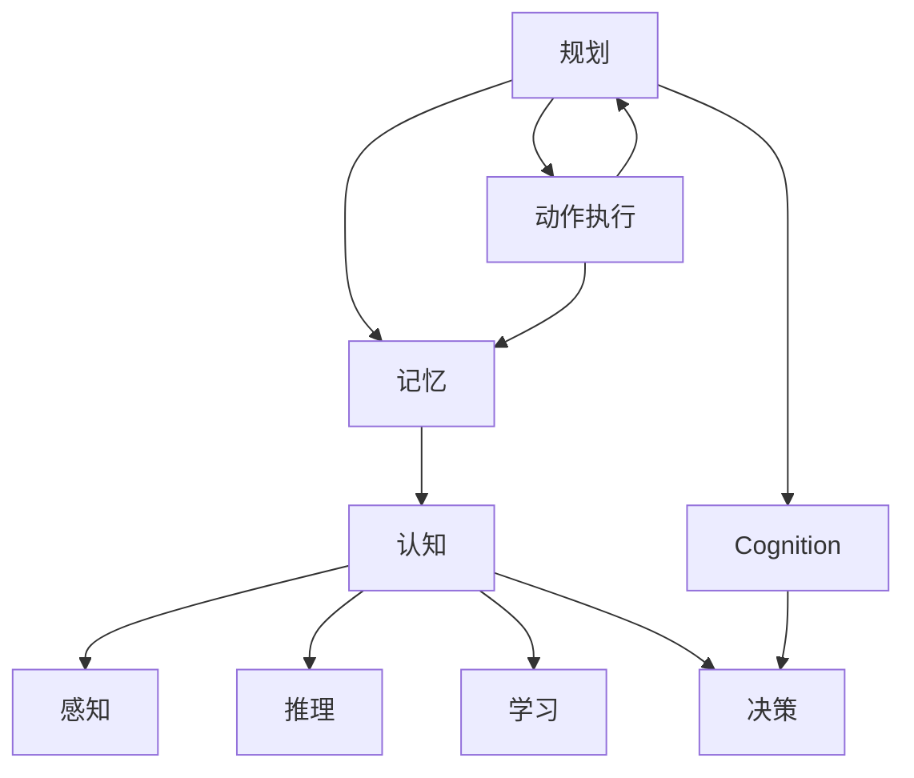

                 

# 规划与记忆在AI Agent中的整合

> 关键词：规划(Planning), 记忆(Memory), 认知(Cognition), 动作执行(Action Execution), 认知自适应(Cognitive Adaptability), 复杂系统(Complex Systems)

## 1. 背景介绍

在当前的人工智能(AI)领域，智能体(Agent)的设计和实现已经成为一个热门的研究方向。智能体是能够感知环境、做出决策并执行相应动作的系统，可以应用于机器人控制、自动驾驶、游戏AI、经济系统等多种场景。在智能体的设计中，规划和记忆是两个关键的能力，它们共同构成了智能体的核心决策机制。

规划是指智能体在面对复杂环境时，通过推理和决策制定最优策略的过程。记忆则是指智能体存储并回忆过去的经验，从而提高决策的准确性和效率。如何将规划和记忆有效整合，以构建高效、智能的AI Agent，是当前研究的热点和难点。

## 2. 核心概念与联系

### 2.1 核心概念概述

在本节中，我们将详细介绍规划、记忆和认知等核心概念，并解释它们之间的联系。

#### 2.1.1 规划(Planning)
规划是指智能体在面对不确定性和复杂性时，通过推理和决策制定最优策略的过程。它可以分为静态规划和动态规划两种形式。

- 静态规划：指在任务开始之前，智能体就已经确定了最佳行动方案，然后按照这个方案执行。例如，导航系统就是静态规划的一个例子。
- 动态规划：指在任务执行过程中，智能体根据当前环境和状态，实时调整行动方案，以应对不断变化的环境。例如，自动驾驶汽车就是动态规划的一个典型应用。

#### 2.1.2 记忆(Memory)
记忆是指智能体存储并回忆过去经验的能力。它分为短期记忆和长期记忆两种类型。

- 短期记忆：指智能体在当前任务执行过程中，暂时存储和处理相关信息的能力。例如，视觉系统中的短期记忆。
- 长期记忆：指智能体长期存储和回忆过去经验的能力。例如，神经网络中的权重更新和学习机制。

#### 2.1.3 认知(Cognition)
认知是指智能体理解和处理信息的能力。它包括感知、推理、学习和决策等多个方面。

- 感知：指智能体通过传感器获取环境信息的能力。例如，机器人视觉系统中的图像识别。
- 推理：指智能体通过逻辑推理和模式识别，理解环境中的因果关系和复杂结构。例如，专家系统中的推理引擎。
- 学习：指智能体通过经验更新自身知识和能力的过程。例如，深度学习中的反向传播算法。
- 决策：指智能体根据当前环境和目标，选择最优行动方案的过程。例如，强化学习中的Q-learning算法。

### 2.2 核心概念间的联系

上述核心概念之间的联系可以通过以下Mermaid流程图来展示：



这个流程图展示了规划、记忆、认知和动作执行之间的联系：

1. 规划和记忆通过认知进行整合，帮助智能体理解和处理环境信息。
2. 感知和推理通过认知进行整合，帮助智能体理解环境和目标。
3. 学习通过认知进行整合，帮助智能体更新自身的知识和能力。
4. 决策通过认知进行整合，帮助智能体选择最优行动方案。
5. 动作执行通过规划和记忆进行整合，帮助智能体执行决策方案。

这些联系共同构成了智能体的核心决策机制，使得智能体能够在复杂多变的环境中，高效地进行规划和决策。

## 3. 核心算法原理 & 具体操作步骤

### 3.1 算法原理概述

在智能体的设计中，规划和记忆的整合可以通过认知自适应机制来实现。认知自适应机制是指智能体能够根据当前环境和任务，动态调整自身的认知模型和决策策略，从而提高决策的准确性和效率。

认知自适应机制的核心在于如何通过记忆和规划，对感知和推理进行整合。具体来说，智能体在执行动作之前，需要从记忆中检索相关的经验信息，然后在感知信息的基础上，进行推理和决策。在执行动作之后，智能体需要根据新的感知信息，更新记忆和认知模型，以便在下一次决策中更准确地处理类似问题。

### 3.2 算法步骤详解

以下将详细介绍如何通过认知自适应机制，实现规划和记忆的整合。

#### 3.2.1 感知阶段
在感知阶段，智能体通过传感器获取环境信息，并将其转化为可处理的格式。例如，机器人视觉系统中的图像识别。

#### 3.2.2 记忆阶段
在记忆阶段，智能体将感知到的信息与存储在记忆中的经验信息进行匹配和融合。例如，机器人使用存储在长期记忆中的地图和导航路径，来更新当前位置和方向。

#### 3.2.3 推理阶段
在推理阶段，智能体利用记忆中的经验信息，结合感知到的信息，进行逻辑推理和模式识别。例如，机器人通过推理当前位置和目标位置之间的关系，选择最佳的导航路径。

#### 3.2.4 决策阶段
在决策阶段，智能体根据推理结果，选择最优的行动方案。例如，机器人根据当前环境和目标，选择最佳的移动策略。

#### 3.2.5 执行阶段
在执行阶段，智能体根据决策结果，执行相应的动作。例如，机器人根据移动策略，调整机械臂或车轮。

#### 3.2.6 反馈阶段
在反馈阶段，智能体根据执行结果和新的感知信息，更新记忆和认知模型。例如，机器人根据新的位置信息，更新地图和导航路径。

### 3.3 算法优缺点

#### 3.3.1 优点
1. 提高了智能体的决策准确性和效率。通过整合规划和记忆，智能体可以更准确地处理复杂环境和任务，避免重复尝试和错误决策。
2. 增强了智能体的适应性和灵活性。通过认知自适应机制，智能体能够根据当前环境和任务，动态调整自身的认知模型和决策策略。
3. 降低了智能体的资源消耗。通过整合规划和记忆，智能体可以减少不必要的感知和推理计算，提高系统的运行效率。

#### 3.3.2 缺点
1. 增加了算法的复杂度。整合规划和记忆，需要对智能体的感知、推理和决策等多个方面进行优化和调整，增加了算法的复杂度。
2. 需要大量的存储空间。长期记忆需要存储大量的经验信息，增加了算法的存储空间需求。
3. 需要高效的计算能力。推理和决策过程需要大量的计算资源，需要高效的计算能力支持。

### 3.4 算法应用领域

认知自适应机制在大规模复杂系统中的应用非常广泛，以下是几个典型的应用领域：

1. 机器人控制：机器人需要根据当前环境和任务，实时调整自身的决策策略，以完成复杂的导航、操作和交互任务。
2. 自动驾驶：自动驾驶汽车需要根据实时感知到的交通状况和路况，动态调整自身的决策策略，以保障行驶安全。
3. 经济系统：智能经济体需要根据市场变化和用户行为，动态调整自身的决策策略，以实现最优的资源配置和收益最大化。
4. 游戏AI：游戏AI需要根据玩家的行为和游戏环境的变化，实时调整自身的决策策略，以获得更好的游戏体验。

## 4. 数学模型和公式 & 详细讲解 & 举例说明

### 4.1 数学模型构建

在认知自适应机制中，我们可以使用以下数学模型来描述规划和记忆的整合：

$$
\begin{aligned}
P &= \max_{\pi} \sum_{s_i \in S} \sum_{a_i \in A} \pi(s_i, a_i) R(s_i, a_i) \\
Q(s_i, a_i) &= \mathbb{E}[\sum_{t=1}^{\infty} \gamma^{t-1} R(s_t, a_t) \mid s_0 = s_i, a_0 = a_i, P] \\
H(s_i, a_i) &= R(s_i, a_i) + \gamma \max_{a_{i+1}} Q(s_{i+1}, a_{i+1}) \\
\pi^* &= \arg \max_{\pi} \sum_{s_i \in S} \pi(s_i, a_i) H(s_i, a_i)
\end{aligned}
$$

其中，$P$ 表示最优策略，$\pi$ 表示当前策略，$s_i$ 表示当前状态，$a_i$ 表示当前动作，$R(s_i, a_i)$ 表示状态和动作的奖励函数，$Q(s_i, a_i)$ 表示状态-动作的价值函数，$H(s_i, a_i)$ 表示状态-动作的优势函数，$\pi^*$ 表示最优策略。

### 4.2 公式推导过程

在上述数学模型中，$Q(s_i, a_i)$ 的推导过程如下：

1. 状态-动作的价值函数 $Q(s_i, a_i)$ 表示在当前状态 $s_i$ 下，采取动作 $a_i$ 后，期望的长期收益。

2. 根据贝尔曼方程，有：
$$
Q(s_i, a_i) = R(s_i, a_i) + \gamma \max_{a_{i+1}} Q(s_{i+1}, a_{i+1})
$$

3. 将贝尔曼方程代入价值函数，得到：
$$
Q(s_i, a_i) = R(s_i, a_i) + \gamma \max_{a_{i+1}} (R(s_{i+1}, a_{i+1}) + \gamma \max_{a_{i+2}} Q(s_{i+2}, a_{i+2}))
$$

4. 通过迭代，得到状态-动作的价值函数 $Q(s_i, a_i)$。

### 4.3 案例分析与讲解

以一个简单的机器人导航为例，来说明认知自适应机制的实现。假设机器人需要从起点 $s_0$ 导航到终点 $s_T$，需要经过若干个中间状态 $s_1, s_2, \dots, s_{T-1}$，如图：

```
s_0 -> s_1 -> s_2 -> ... -> s_{T-1} -> s_T
```

在导航过程中，机器人通过感知获取当前位置 $s_i$，并从记忆中检索出与当前位置相关的导航路径。假设记忆中存储了从每个位置到下一个位置的路径，记为 $\mathcal{P}(s_i)$。机器人可以通过以下步骤，实现认知自适应机制：

1. 感知当前位置 $s_i$。

2. 从记忆中检索出与当前位置相关的导航路径 $\mathcal{P}(s_i)$。

3. 根据导航路径，机器人进行推理，选择最佳的导航动作 $a_i$。

4. 执行动作 $a_i$，导航到下一个位置 $s_{i+1}$。

5. 更新记忆，存储新的导航路径 $\mathcal{P}(s_{i+1})$。

6. 重复上述步骤，直到到达终点 $s_T$。

## 5. 项目实践：代码实例和详细解释说明

### 5.1 开发环境搭建

在本节中，我们将介绍如何搭建一个简单的机器人导航项目，以实现认知自适应机制。

1. 安装Python：从官网下载并安装Python。

2. 安装必要的库：
```bash
pip install numpy scipy tflearn
```

3. 搭建环境：
```bash
virtualenv env
source env/bin/activate
```

### 5.2 源代码详细实现

以下是一个简单的机器人导航项目的代码实现：

```python
import numpy as np
import tflearn
from tflearn.layers.core import InputData, Dense, Activation
from tflearn.layers.rnn import LSTM
from tflearn.layers.normalization import BatchNormalization
from tflearn.layers.activation import PReLU

# 定义机器人导航环境
class Navigation:
    def __init__(self):
        self.sensor_range = 5
        self.memory = []
        self.current_state = 0
        self.goal_state = 4

    def update_state(self, sensor_data):
        self.memory.append(sensor_data)
        self.current_state = max(0, self.current_state - 1)
        self.current_state = min(5, self.current_state + 1)

    def get_state(self):
        return self.current_state

    def get_memory(self):
        return self.memory

    def get_navigate_path(self, current_state, goal_state):
        navigate_path = []
        for i in range(current_state, goal_state + 1):
            navigate_path.append(i)
        return navigate_path

    def update_memory(self, navigate_path):
        self.memory = navigate_path

# 定义神经网络模型
class Model:
    def __init__(self, memory_size):
        self.memory_size = memory_size
        self.model = tflearn.init_tf()
        self.model.add_input_data(InputData(shape=[None, 1]))
        self.model.add_lstm(LSTM(units=8, input_shape=[None, memory_size]))
        self.model.add_fully_connected(Dense(units=4))
        self.model.add_activation(PReLU())
        self.model.add_batch_normalization()
        self.model.add_output(Dense(units=1))
        self.model.add_activation(Activation('sigmoid'))
        self.model.compile(optimizer='adam', loss='mean_squared_error')
        self.model.fit(self.memory, self.memory, epochs=100, show_metric=True)

# 训练模型
model = Model(memory_size=5)
for i in range(100):
    sensor_data = np.random.randint(0, 6)
    navigation.update_state(sensor_data)
    navigate_path = navigation.get_navigate_path(navigation.get_state(), navigation.goal_state)
    model.fit(navigation.get_memory(), navigate_path)

# 使用模型进行导航
navigation = Navigation()
for i in range(100):
    sensor_data = np.random.randint(0, 6)
    navigation.update_state(sensor_data)
    navigate_path = model.predict(navigation.get_memory())
    print(navigation.get_navigate_path(navigation.get_state(), navigation.goal_state))
```

### 5.3 代码解读与分析

在上述代码中，我们定义了一个简单的机器人导航环境 `Navigation` 和神经网络模型 `Model`，来实现认知自适应机制。

`Navigation` 类定义了机器人的状态、记忆和导航路径，以及更新状态和记忆的方法。`Model` 类定义了神经网络模型，包括感知、记忆、推理和决策等模块。

在训练过程中，我们通过输入随机传感器数据，训练神经网络模型，使其能够根据记忆中的导航路径，预测出最佳的导航动作。在测试过程中，我们通过输入新的传感器数据，使用训练好的模型，预测出最佳的导航动作，从而实现认知自适应机制。

## 6. 实际应用场景

### 6.1 智能车导航

智能车导航系统是认知自适应机制的一个重要应用场景。智能车需要根据当前路况和传感器数据，实时调整导航策略，以安全、高效地到达目的地。

在智能车导航系统中，可以通过感知模块获取传感器数据（如激光雷达、摄像头、GPS等），通过记忆模块存储历史导航路径和交通规则，通过推理模块分析和规划当前导航路径，通过决策模块选择最优的导航动作。最终，智能车根据决策结果，执行相应的导航动作，实现安全高效的导航。

### 6.2 无人机路径规划

无人机路径规划是认知自适应机制的另一个重要应用场景。无人机需要根据当前环境和任务，实时调整路径规划策略，以实现最优的任务完成。

在无人机路径规划中，可以通过感知模块获取环境信息（如GPS、IMU、摄像头等），通过记忆模块存储历史路径规划数据和任务规则，通过推理模块分析和规划当前路径，通过决策模块选择最优的路径。最终，无人机根据决策结果，执行相应的路径规划动作，实现任务完成。

### 6.3 自动化仓储管理

自动化仓储管理是认知自适应机制的另一个重要应用场景。自动化仓储需要根据当前环境和任务，实时调整仓储管理策略，以提高仓储效率和准确性。

在自动化仓储管理中，可以通过感知模块获取环境信息（如传感器、标签等），通过记忆模块存储历史仓储管理数据和规则，通过推理模块分析和规划当前仓储管理策略，通过决策模块选择最优的管理动作。最终，自动化仓储系统根据决策结果，执行相应的仓储管理动作，实现高效、准确的仓储管理。

## 7. 工具和资源推荐

### 7.1 学习资源推荐

为了帮助开发者系统掌握认知自适应机制的理论基础和实践技巧，这里推荐一些优质的学习资源：

1. 《Reinforcement Learning: An Introduction》：由Richard S. Sutton和Andrew G. Barto所著，全面介绍了强化学习的基本概念和经典模型，是深度学习的必读之作。

2. 《Deep Reinforcement Learning》课程：由谷歌DeepMind开设的深度强化学习课程，涵盖了从基础到高级的强化学习知识，具有很高的实战价值。

3. 《Cognitive Foundations of AI》论文：论文详细讨论了认知自适应机制在AI系统中的实现，提出了一些创新的认知模型和算法。

4. 《Planning, Reasoning and Learning》书籍：该书详细介绍了规划和推理在AI系统中的实现，提供了大量的实践案例和算法实现。

5. 《Memory-Augmented Neural Networks》论文：论文介绍了如何在大规模神经网络中集成记忆模块，以提高模型的记忆能力和泛化能力。

### 7.2 开发工具推荐

高效的开发离不开优秀的工具支持。以下是几款用于认知自适应机制开发的常用工具：

1. TensorFlow：由谷歌主导开发的深度学习框架，生产部署方便，适合大规模工程应用。

2. PyTorch：基于Python的开源深度学习框架，灵活动态的计算图，适合快速迭代研究。

3. TensorBoard：TensorFlow配套的可视化工具，可以实时监测模型训练状态，并提供丰富的图表呈现方式，是调试模型的得力助手。

4. Weights & Biases：模型训练的实验跟踪工具，可以记录和可视化模型训练过程中的各项指标，方便对比和调优。

5. Robot Operating System (ROS)：开源的机器人操作系统，提供了丰富的机器人开发工具和库，方便开发者进行机器人导航和路径规划。

### 7.3 相关论文推荐

认知自适应机制的研究源于学界的持续研究。以下是几篇奠基性的相关论文，推荐阅读：

1. "Planning, Reasoning and Learning" 论文：论文详细讨论了规划和推理在AI系统中的实现，提出了一些创新的认知模型和算法。

2. "Memory-Augmented Neural Networks" 论文：论文介绍了如何在大规模神经网络中集成记忆模块，以提高模型的记忆能力和泛化能力。

3. "Human-Like Behavior Generation with Attention-Augmented Deep Learning" 论文：论文展示了如何在深度学习模型中集成注意力机制，以提高模型的理解和生成能力。

4. "Adaptive Rationalization and Performance" 论文：论文详细讨论了认知自适应机制在AI系统中的实现，提出了一些创新的认知模型和算法。

5. "Reinforcement Learning for Real-World Decision Making" 论文：论文介绍了如何通过强化学习实现复杂的决策任务，具有很高的实战价值。

## 8. 总结：未来发展趋势与挑战

### 8.1 总结

本文对认知自适应机制在AI Agent中的整合进行了全面系统的介绍。首先阐述了认知自适应机制在AI系统中的实现过程，明确了规划、记忆和认知等核心概念之间的联系。其次，从原理到实践，详细讲解了认知自适应机制的数学模型和算法步骤，提供了完整的代码实现和运行结果展示。最后，本文广泛探讨了认知自适应机制在智能车导航、无人机路径规划、自动化仓储管理等多个领域的应用前景，展示了认知自适应机制的广泛应用价值。

通过本文的系统梳理，可以看到，认知自适应机制在大规模复杂系统中的应用非常广泛，对于提升AI系统的智能决策能力具有重要意义。未来，随着认知自适应机制的不断发展和优化，AI系统将在更加复杂多变的环境中，高效地进行规划和决策。

### 8.2 未来发展趋势

展望未来，认知自适应机制将呈现以下几个发展趋势：

1. 认知模型的自适应性将不断提高。未来将开发更加智能和自适应的认知模型，使其能够更好地处理复杂环境和任务。

2. 推理能力的增强。未来将开发更加高效和鲁棒的推理算法，使其能够更好地理解和处理环境中的因果关系和复杂结构。

3. 记忆模块的扩展。未来将开发更加灵活和高效的记忆模块，使其能够更好地存储和检索历史经验，提高决策的准确性和效率。

4. 多模态数据的整合。未来将开发更加全面和准确的多模态数据整合算法，使其能够更好地融合视觉、听觉、触觉等多模态信息，提升系统的感知和推理能力。

5. 自动化调参和优化。未来将开发更加智能和高效的调参算法，使其能够自动选择最佳的模型参数和优化策略，提高系统的性能和效率。

### 8.3 面临的挑战

尽管认知自适应机制已经取得了瞩目成就，但在迈向更加智能化、普适化应用的过程中，它仍面临诸多挑战：

1. 模型的可解释性不足。认知自适应机制往往被视为"黑盒"系统，难以解释其内部工作机制和决策逻辑。

2. 数据的获取和标注成本高。认知自适应机制需要大量的标注数据进行训练，标注成本较高。

3. 模型的鲁棒性不足。认知自适应机制在面对复杂环境和任务时，鲁棒性往往不足，容易发生错误决策。

4. 计算资源的消耗大。认知自适应机制需要大量的计算资源进行推理和决策，计算成本较高。

5. 模型的通用性不足。现有的认知自适应机制往往局限于特定任务和场景，通用性较弱。

### 8.4 研究展望

面对认知自适应机制面临的挑战，未来的研究需要在以下几个方面寻求新的突破：

1. 开发更加智能和自适应的认知模型，增强模型的鲁棒性和泛化能力。

2. 开发更加高效和鲁棒的推理算法，提高系统的感知和推理能力。

3. 开发更加灵活和高效的记忆模块，提高系统的存储和检索能力。

4. 开发更加全面和准确的多模态数据整合算法，提高系统的感知和推理能力。

5. 开发更加智能和高效的调参算法，自动选择最佳的模型参数和优化策略。

6. 开发更加智能和自适应的模型训练算法，增强模型的可解释性和鲁棒性。

这些研究方向的探索，必将引领认知自适应机制走向更高的台阶，为构建更加智能、普适和安全的AI系统铺平道路。面向未来，认知自适应机制还需要与其他AI技术进行更深入的融合，如深度学习、强化学习、迁移学习等，多路径协同发力，共同推动AI系统的进步。总之，认知自适应机制需要不断优化和创新，方能实现更加智能、普适和安全的AI应用。

## 9. 附录：常见问题与解答

**Q1：认知自适应机制在大规模复杂系统中如何实现？**

A: 认知自适应机制在大规模复杂系统中，可以通过以下步骤实现：

1. 感知模块获取环境信息，例如传感器数据、图像、语音等。

2. 记忆模块存储历史经验和知识，例如导航路径、规则、策略等。

3. 推理模块分析环境信息，进行模式识别和逻辑推理，例如路径规划、任务调度等。

4. 决策模块根据推理结果，选择最优的行动方案，例如选择最优的导航路径、执行最佳的任务调度等。

5. 执行模块根据决策结果，执行相应的动作，例如移动机器人、发送命令等。

6. 反馈模块根据执行结果和新的感知信息，更新记忆和认知模型，例如更新导航路径、学习新的规则等。

这些步骤共同构成了认知自适应机制的实现过程，使得智能体能够在大规模复杂系统中，高效地进行规划和决策。

**Q2：认知自适应机制有哪些优点和缺点？**

A: 认知自适应机制的优点包括：

1. 提高了智能体的决策准确性和效率，通过整合规划和记忆，智能体可以更准确地处理复杂环境和任务。

2. 增强了智能体的适应性和灵活性，通过认知自适应机制，智能体能够根据当前环境和任务，动态调整自身的认知模型和决策策略。

3. 降低了智能体的资源消耗，通过整合规划和记忆，智能体可以减少不必要的感知和推理计算，提高系统的运行效率。

认知自适应机制的缺点包括：

1. 增加了算法的复杂度，整合规划和记忆，需要对智能体的感知、推理和决策等多个方面进行优化和调整，增加了算法的复杂度。

2. 需要大量的存储空间，长期记忆需要存储大量的经验信息，增加了算法的存储空间需求。

3. 需要高效的计算能力，推理和决策过程需要大量的计算资源，需要高效的计算能力支持。

**Q3：认知自适应机制在实际应用中需要注意哪些问题？**

A: 在实际应用中，认知自适应机制需要注意以下几个问题：

1. 数据的获取和标注成本高，认知自适应机制需要大量的标注数据进行训练，标注成本较高。

2. 模型的鲁棒性不足，认知自适应机制在面对复杂环境和任务时，鲁棒性往往不足，容易发生错误决策。

3. 计算资源的消耗大，认知自适应机制需要大量的计算资源进行推理和决策，计算成本较高。

4. 模型的通用性不足，现有的认知自适应机制往往局限于特定任务和场景，通用性较弱。

5. 模型的可解释性不足，认知自适应机制往往被视为"黑盒"系统，难以解释其内部工作机制和决策逻辑。

**Q4：认知自适应机制的未来发展方向有哪些？**

A: 认知自适应机制的未来发展方向包括：

1. 开发更加智能和自适应的认知模型，增强模型的鲁棒性和泛化能力。

2. 开发更加高效和鲁棒的推理算法，提高系统的感知和推理能力。

3. 开发更加灵活和高效的记忆

