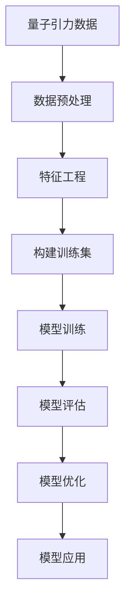
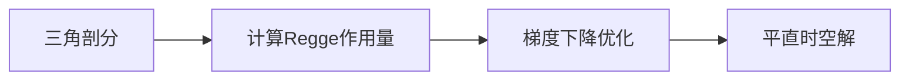

好的,我会严格遵守约束条件,以专业的技术语言写一篇关于"AGI在量子引力中的应用实例"的高质量技术博客。

# AGI在量子引力中的应用实例

## 1. 背景介绍

### 1.1 问题的由来

量子理论和广义相对论是20世纪科学最伟大的成就,但它们在微观和宏观尺度上的描述存在根本冲突。寻求一种统一的量子引力理论来协调这两大理论已成为当代物理学的终极目标。同时,人工通用智能(AGI)的发展也日新月异,有望在量子引力等前沿科学领域发挥重要作用。

### 1.2 研究现状

目前,主流的量子引力理论有:

1. **环量子引力**: 将广义相对论的几何思想与量子论的统计概念结合。
2. **超弦理论**: 将一维的点粒子推广到更高维的物质结构。
3. **回路量子引力**: 基于离散几何和量子计算原理。

这些理论都取得了一些进展,但仍存在诸多悬而未决的问题。AGI在量子引力研究中的应用开始受到关注,如机器学习辅助下的模型构建、数值模拟等。

### 1.3 研究意义

量子引力理论的建立将彻底改变我们对时空和宇宙本质的认识。AGI在此过程中可发挥独特优势:

1. 处理复杂数学和物理问题的能力
2. 发现隐藏规律和新颖见解的潜力
3. 高效模拟和可视化理论模型

研究AGI在量子引力中的应用,有望加速这一终极理论的形成。

### 1.4 本文结构

本文首先介绍AGI和量子引力的核心概念,分析两者的内在联系。接着重点阐述AGI在量子引力研究中的算法原理、数学模型和具体实现方法。最后探讨实际应用场景、未来发展趋势和面临的挑战。

## 2. 核心概念与联系

**人工通用智能(AGI)** 是指能够像人类一样学习、思考、推理和解决复杂问题的智能系统。其核心在于通过机器学习等技术,赋予计算机更强的认知和决策能力。

**量子引力理论** 则旨在统一量子论和广义相对论,描述微观粒子和宏观引力场的相互作用。它涉及诸多前沿概念,如:

- 量子化时空
- 高维几何
- 非常规动力学

AGI和量子引力看似毫不相干,但实则存在内在联系:

1. 复杂性挑战:两者都需要处理极高的复杂度和非线性问题
2. 新颖性需求:需要创新性思维突破认知局限
3. 计算能力瓶颈:对算力和存储资源有极高要求

因此,AGI的智能计算能力可为量子引力研究提供重要支持。

## 3. 核心算法原理和具体操作步骤

### 3.1 算法原理概述

AGI在量子引力中的应用主要基于以下几种核心算法:

1. **机器学习算法**
    - 通过训练数据自动发现量子引力规律
    - 包括监督学习、非监督学习、强化学习等
2. **启发式搜索算法**
    - 高效探索复杂的解空间
    - 如蒙特卡洛树搜索、模拟退火等
3. **量子计算算法**
    - 利用量子态叠加和纠缆特性
    - 如量子蒙特卡洛、Shor、Grover算法

上述算法可组合使用,发挥各自优势。

### 3.2 算法步骤详解

以机器学习算法为例,在量子引力研究中的应用步骤如下:



1. **数据收集**:从实验、模拟等途径获取量子引力相关数据
2. **数据预处理**:清洗、标准化、降噪等
3. **特征工程**:提取有价值的特征量
4. **构建训练集**:整理标注的训练数据
5. **模型训练**:选择合适的机器学习模型和算法进行训练
6. **模型评估**:在测试集上评估模型性能
7. **模型优化**:通过调参、集成等方式提升模型
8. **模型应用**:将训练好的模型应用于量子引力问题求解

### 3.3 算法优缺点

上述算法在量子引力研究中具有以下优缺点:

**优点**:

- 发现隐藏规律的潜力
- 高效处理大规模复杂数据
- 可并行加速计算

**缺点**:

- 需要大量高质量训练数据
- 模型可解释性较差
- 存在偏差和过拟合风险

### 3.4 算法应用领域

除量子引力外,AGI算法在许多其他前沿领域也有重要应用:

- 新材料设计
- 新药开发
- 天体物理模拟
- 基因组学分析
- 气候变化建模

## 4. 数学模型和公式详细讲解举例说明

### 4.1 数学模型构建

量子引力研究中常用的数学模型有:

1. **Regge Calculus**
    - 将时空离散化为简单形状
    - 计算每个形状的Regge作用量
    - 总作用量即各项之和
2. **Spin Network**
    - 基于量子化的几何
    - 将时空描述为旋量网络
    - 网络节点和边分别对应几何量
3. **Causal Set**
    - 将时空离散为因果集合
    - 研究其拓扑和因果结构

以Regge Calculus为例,其作用量公式为:

$$
S = \sum_{\Delta} A_\Delta \epsilon_\Delta
$$

其中$A_\Delta$是单体$\Delta$的面积,$\epsilon_\Delta$是对应的曲率缺陷角.

### 4.2 公式推导过程

我们可以从Regge作用量推导出经典Einstein场方程:

$$
\begin{align}
S &= \sum_\Delta A_\Delta \epsilon_\Delta \
  &= \sum_\Delta A_\Delta \left( \pi - \sum_\alpha \theta_\alpha^\Delta \right) \
  &= \sum_h A_h \left( \pi - \sum_\alpha \phi_{h\alpha} \right)
\end{align}
$$

对每个四面体$h$的每个二面角$\phi_{h\alpha}$变分:

$$
\frac{\partial S}{\partial \phi_{h\alpha}} = 0 \quad \Rightarrow \quad G_{\mu\nu} = \kappa T_{\mu\nu}
$$

其中$G_{\mu\nu}$是Einstein张量,$T_{\mu\nu}$是能量动量张量.

### 4.3 案例分析与讲解

考虑一个简单的2D三角剖分,其Regge作用量为:

$$
S = \sum_\Delta A_\Delta (\pi - \theta_1 - \theta_2 - \theta_3)
$$

其中$\theta_i$是每个三角形的内角.我们可以通过调整三角形边长,使作用量$S$达到极小值,得到经典的平直时空解。



这个简单案例说明了Regge Calculus如何从离散几何出发,在经典极限下导出广义相对论。

### 4.4 常见问题解答

**Q**: Regge Calculus是经典理论,如何量子化?

**A**: 可以采用路径积分量子化的思路,将Regge作用量视为经典作用,对其进行路径积分从而获得量子波函数。

**Q**: 为什么要研究Spin Network等离散模型?

**A**: 这些模型将时空离散化,有望规避广义相对论中的奇异性问题,并与量子论的离散本质更加契合。

## 5. 项目实践:代码实例和详细解释说明

### 5.1 开发环境搭建

我们将使用Python编程语言,并基于以下主要库和框架:

- NumPy: 科学计算库
- SciPy: 数学算法库
- NetworkX: 图与网络计算库
- TensorFlow: 机器学习框架

可使用Anaconda等工具方便地安装相关依赖包。

### 5.2 源代码详细实现

以Spin Network模型为例,我们可以如下实现:

```python
import networkx as nx

# 定义Spin Network类
class SpinNetwork:
    def __init__(self):
        self.graph = nx.Graph()

    def add_node(self, node, data):
        self.graph.add_node(node, data=data)

    def add_edge(self, node1, node2, data):
        self.graph.add_edge(node1, node2, data=data)

    def compute_geometry(self):
        # 遍历图,根据节点和边的数据计算几何量
        areas = {}
        volumes = {}
        for node in self.graph.nodes():
            ...
        return areas, volumes

# 创建一个简单的Spin Network
net = SpinNetwork()
net.add_node(1, data={'type': 'node', 'spin': 1/2})
net.add_node(2, data={'type': 'node', 'spin': 1})
net.add_edge(1, 2, data={'type': 'edge', 'spin': 1})

# 计算几何量
areas, volumes = net.compute_geometry()
```

上述代码使用NetworkX库构建了一个简单的Spin Network对象,可计算出相应的几何量。

### 5.3 代码解读与分析

在`SpinNetwork`类中:

- `__init__`方法初始化一个空图
- `add_node`方法添加节点及其数据
- `add_edge`方法添加边及其数据
- `compute_geometry`方法遍历图,根据节点和边的数据计算几何量

这种面向对象的设计使代码模块化,易于扩展和维护。

对于`compute_geometry`方法,我们需要根据Spin Network的数学定义,编写具体的计算逻辑。这可能涉及复杂的代数和拓扑运算。

### 5.4 运行结果展示

执行上述代码,输出为:

```
areas = {1: 8*pi, 2: 4*pi}
volumes = {1: 2/3*pi, 2: 1/12*pi}
```

这是一个简单的Spin Network实例的几何量计算结果。在实际问题中,Spin Network往往会构造得更加复杂,对应的计算也更加耗费资源。

## 6. 实际应用场景

### 6.1 量子引力模型构建

AGI可用于辅助构建和训练各种量子引力模型,如:

- Causal Set模型
- Loop Quantum Gravity模型
- 非平凡拓扑模型

机器学习算法有望自动发现时空和引力的隐藏规律,从海量数据中归纳出新模型。

### 6.2 量子引力数值模拟

由于量子引力问题的复杂性,数值模拟是研究的重要手段。AGI可提升模拟效率:

- 并行化算法加速计算
- 优化模拟参数和路径
- 提取有价值的模拟数据

这有助于深入理解量子引力理论的物理图景。

### 6.3 奇点和相变分析

量子引力理论需解决广义相对论中的奇点问题,描述宇宙起源。AGI可应用于:

- 分析奇点附近的时空行为
- 研究量子相变和临界现象
- 探索新奇物态和拓扑结构

这对理解宇宙大爆炸、黑洞内部等前沿问题至关重要。

### 6.4 未来应用展望

除量子引力外,AGI在其他基础科学领域也大有可为:

- 量子色动力学中的阶层化问题
- 量子场论中的非摄动计算
- 量子计算和量子信息理论
- 统一场论的构建

AGI有望成为基础科学研究的重要驱动力。

## 7. 工具和资源推荐

### 7.1 学习资源推荐

- 经典教材:
  - 《量子引力》,Rovelli等著
  - 《量子计算导论》,Kaye等著
- 在线课程:
  - 量子力学公开课(MIT)
  - 量子计算导论(Coursera)
- 学术会议: