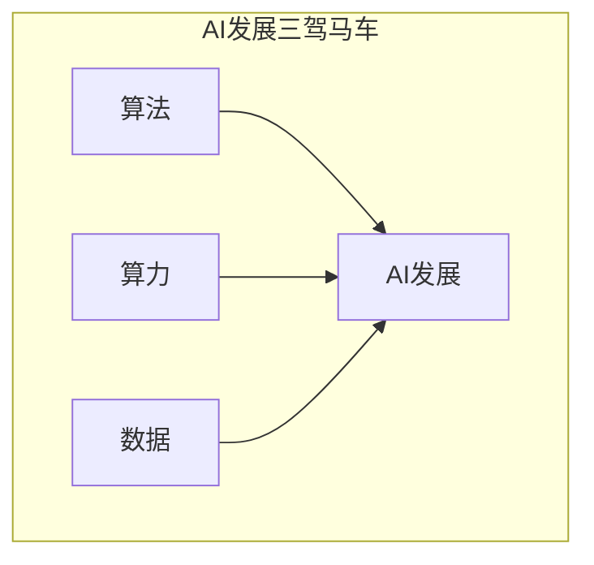

# AI发展的三匹马：算法、算力与数据

## 1. 背景介绍

### 1.1 问题的由来

人工智能(AI)的发展已经成为当代科技领域最受关注的热点话题之一。从深度学习算法的突破性进展,到算力硬件的飞速提升,再到大数据时代的到来,这三个关键因素共同推动了AI技术的腾飞。然而,要真正实现人工智能的长足发展和广泛应用,还需要对这三匹马进行深入探讨和持续优化。

### 1.2 研究现状

#### 算法

在算法层面,深度学习算法取得了令人瞩目的成就,但仍存在一些局限性和挑战。例如,大多数深度学习模型缺乏解释性和可解释性,难以理解其内在决策机理。此外,现有算法对大规模数据和复杂任务的处理能力仍有待提高。

#### 算力

算力硬件的发展一直是推动AI进步的重要动力。近年来,GPU、TPU等专用硬件的出现极大地提升了深度学习模型的训练和推理效率。然而,目前的算力仍难以满足日益复杂的AI任务需求,能效比也有待进一步优化。

#### 数据

大数据时代为AI提供了丰富的训练资源,但同时也带来了数据质量、隐私保护等新的挑战。如何高效地处理海量数据,并从中提取有价值的信息,是AI发展过程中亟待解决的问题。

### 1.3 研究意义

算法、算力和数据是推动AI发展的三驾马车,相互依赖、相辅相成。只有全面把握这三个关键因素,并在各个层面持续创新,才能真正释放人工智能的无限潜能,推动智能时代的到来。本文将深入探讨这三匹马的本质、现状和未来发展趋势,为读者提供全面的理解和洞见。

### 1.4 本文结构

本文将分为以下几个部分进行阐述:

1. 背景介绍
2. 核心概念与联系
3. 核心算法原理与具体操作步骤
4. 数学模型和公式详细讲解与举例说明
5. 项目实践:代码实例和详细解释说明
6. 实际应用场景
7. 工具和资源推荐
8. 总结:未来发展趋势与挑战
9. 附录:常见问题与解答

## 2. 核心概念与联系

算法、算力和数据是推动人工智能发展的三驾马车,它们相互依赖、相辅相成。

- **算法**是AI的大脑和核心,决定了智能系统的能力和性能表现。优秀的算法能够从有限的数据中提取有价值的信息,并作出精准的预测和决策。
- **算力**是AI的肌肉,为算法提供了强大的计算能力支持。高性能的算力硬件能够加速深度学习模型的训练和推理过程,提高系统的实时响应能力。
- **数据**是AI的养分,为算法提供了丰富的学习资源。高质量、多样化的数据集是训练出优秀AI模型的关键前提。

三者相互影响、相互促进,缺一不可。优秀的算法需要强大的算力作为支撑,同时也需要高质量的数据作为训练资源;算力的发展为算法的创新和数据的处理提供了硬件基础;而数据的积累又为算法的优化和算力的扩展提供了动力。只有三驾马车齐头并进,AI技术才能持续突破,实现长足发展。

## 3. 核心算法原理与具体操作步骤

### 3.1 算法原理概述

在当前的人工智能领域,深度学习算法无疑是最为关键和核心的技术。深度学习是一种基于人工神经网络的机器学习算法,它通过对大量数据的学习,自动获取特征表示,并用于解决复杂的预测和决策问题。

深度学习算法的核心思想是通过构建深层次的神经网络模型,对输入数据进行多层次的特征转换和表示,并在该特征基础上完成最终的任务。这种端到端的学习方式,使得深度学习模型能够自主发现数据中的内在规律和表示,而无需人工设计特征。

深度学习算法主要包括以下几个核心组成部分:

1. **网络结构**: 如卷积神经网络(CNN)、递归神经网络(RNN)、长短期记忆网络(LSTM)等,用于构建不同类型的神经网络模型。
2. **损失函数**: 用于衡量模型预测与真实值之间的差异,如均方误差、交叉熵等。
3. **优化算法**: 如随机梯度下降(SGD)、Adam等,用于根据损失函数调整模型参数,使模型不断优化。
4. **正则化技术**: 如dropout、批量归一化等,用于防止过拟合,提高模型的泛化能力。

通过上述组成部分的精心设计和优化,深度学习算法能够在计算机视觉、自然语言处理、语音识别等多个领域取得卓越的性能表现。

### 3.2 算法步骤详解

深度学习算法的训练过程通常包括以下几个关键步骤:

1. **数据准备**
    - 收集和清洗待处理的原始数据
    - 对数据进行必要的预处理,如归一化、标注等
    - 将数据划分为训练集、验证集和测试集

2. **模型构建**
    - 根据任务需求,选择合适的网络结构,如CNN、RNN等
    - 初始化网络权重参数
    - 定义损失函数和优化算法

3. **模型训练**
    - 对训练数据进行小批量划分
    - 使用优化算法(如SGD)迭代更新网络参数
    - 在验证集上评估模型性能,防止过拟合
    - 根据需要调整超参数和正则化策略

4. **模型评估**
    - 在测试集上评估模型的泛化性能
    - 使用合适的评估指标,如准确率、F1分数等
    - 与其他基线模型进行性能对比

5. **模型部署**
    - 将训练好的模型序列化为可部署的格式
    - 在目标硬件或云平台上部署模型服务
    - 持续监控模型性能,根据需要进行模型更新

通过上述步骤的循环迭代,深度学习算法可以不断优化和提升,为各种智能应用提供强大的支持。

### 3.3 算法优缺点

深度学习算法在取得了卓越成就的同时,也存在一些不足之处:

**优点**:

- 强大的表示能力,能够自主学习数据的内在特征
- 端到端的学习方式,无需人工设计特征
- 在计算机视觉、自然语言处理等领域表现出色
- 具有一定的迁移学习能力,可以借助预训练模型加速训练

**缺点**:

- 需要大量的标注数据和计算资源进行训练
- 缺乏可解释性,难以理解模型内部的决策过程
- 存在对抗样本的脆弱性,容易受到对抗性攻击
- 在小数据场景下的表现往往不尽人意
- 训练过程复杂,需要大量的调参经验

总的来说,深度学习算法展现出了强大的数据驱动能力,但也存在一些固有的局限性。如何在保持算法性能的同时,提高其可解释性、鲁棒性和数据效率,是当前研究的重点方向。

### 3.4 算法应用领域

深度学习算法已经在多个领域取得了广泛的应用,主要包括:

1. **计算机视觉**
    - 图像分类、目标检测、语义分割
    - 人脸识别、行为分析、自动驾驶
    - 医学图像分析、遥感图像处理

2. **自然语言处理**
    - 机器翻译、文本生成、文本摘要
    - 情感分析、问答系统、对话系统
    - 信息检索、知识图谱构建

3. **语音识别**
    - 自动语音识别、语音合成
    - 语音信号处理、说话人识别
    - 语音情感分析、语音对话系统

4. **推荐系统**
    - 个性化推荐、内容推荐
    - 协同过滤、上下文感知推荐
    - 广告投放、用户行为分析

5. **金融科技**
    - 金融风险管理、欺诈检测
    - 智能投资顾问、量化交易
    - 信贷评分、客户营销

6. **其他领域**
    - 生物信息学、化学分析
    - 天文学、气象预报
    - 游戏AI、机器人控制

深度学习算法的应用领域正在不断扩展,展现出了强大的通用性和适应性。未来,更多的行业和领域将受益于人工智能技术的创新,推动社会的智能化转型。

## 4. 数学模型和公式详细讲解与举例说明

### 4.1 数学模型构建

深度学习算法的核心是构建一个端到端的数学模型,将输入数据映射到期望的输出。这个模型通常由多层神经网络组成,每一层都对输入数据进行特征转换和表示,最终得到高层次的特征表示,用于完成预测或决策任务。

我们以一个简单的全连接神经网络为例,阐述其数学模型的构建过程。

假设输入数据为 $\boldsymbol{x} = (x_1, x_2, \ldots, x_n)^T$,输出为 $\boldsymbol{y} = (y_1, y_2, \ldots, y_m)^T$,神经网络包含一个隐藏层,隐藏层的神经元数量为 $h$。

1. **输入层到隐藏层**

   输入层到隐藏层的映射可以表示为:

   $$\boldsymbol{h} = \sigma(\boldsymbol{W}^{(1)}\boldsymbol{x} + \boldsymbol{b}^{(1)})$$

   其中 $\boldsymbol{W}^{(1)} \in \mathbb{R}^{h \times n}$ 是权重矩阵, $\boldsymbol{b}^{(1)} \in \mathbb{R}^h$ 是偏置向量, $\sigma$ 是非线性激活函数(如 ReLU、Sigmoid 等)。

2. **隐藏层到输出层**

   隐藏层到输出层的映射可以表示为:

   $$\boldsymbol{y} = \boldsymbol{W}^{(2)}\boldsymbol{h} + \boldsymbol{b}^{(2)}$$

   其中 $\boldsymbol{W}^{(2)} \in \mathbb{R}^{m \times h}$ 是权重矩阵, $\boldsymbol{b}^{(2)} \in \mathbb{R}^m$ 是偏置向量。

3. **损失函数**

   为了训练神经网络,我们需要定义一个损失函数 $\mathcal{L}$,用于衡量模型预测值与真实值之间的差异。常用的损失函数包括均方误差(MSE)、交叉熵(Cross Entropy)等。

   对于回归任务,可以使用 MSE 损失函数:

   $$\mathcal{L}(\boldsymbol{y}, \hat{\boldsymbol{y}}) = \frac{1}{2}\|\boldsymbol{y} - \hat{\boldsymbol{y}}\|_2^2$$

   其中 $\hat{\boldsymbol{y}}$ 是模型的预测输出。

4. **优化算法**

   使用优化算法(如随机梯度下降 SGD)根据损失函数的梯度,迭代更新网络的权重和偏置参数,使得损失函数值不断减小,模型性能不断提高。

   $$\boldsymbol{W}^{(l)} \leftarrow \boldsymbol{W}^{(l)} - \eta \frac{\partial \mathcal{L}}{\partial \boldsymbol{W}^{(l)}}$$
   $$\boldsymbol{b}^{(