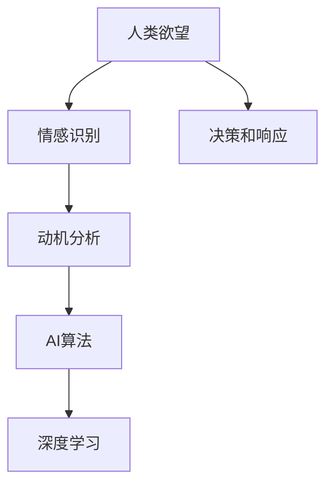
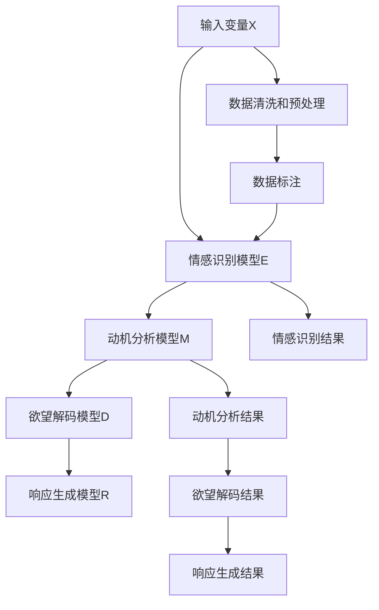

                 

# 欲望的算法：AI解码人类潜意识需求

## 1. 背景介绍

### 1.1 问题由来
在人工智能（AI）发展的浪潮中，深度学习、大数据、自然语言处理等技术已经逐步渗透到我们生活的方方面面。然而，这背后隐藏的深层问题是：如何使AI能够理解和满足人类深层次的欲望和需求？

欲望，这个看似简单的概念，其实蕴含了人类复杂的情感、动机和行为。人类欲望的驱动因素多种多样，包括但不限于好奇心、成就欲、安全感、社交需求、归属感等。理解和解码人类欲望，成为AI系统发展的重要方向之一。

### 1.2 问题核心关键点
欲望，作为人类行为的根本驱动力，是心理学的核心问题之一。AI解码人类欲望，本质上是将心理学理论与计算机算法相结合，使机器能够洞察人类的内在需求，并作出响应。

该问题的核心关键点包括：

1. 如何定义和刻画人类欲望？
2. 如何构建能够理解和处理人类欲望的AI模型？
3. 如何评估AI模型在解码人类欲望方面的表现？
4. 如何优化AI模型以提高解码人类欲望的准确性和效率？

## 2. 核心概念与联系

### 2.1 核心概念概述

为了更好地理解AI解码人类欲望这一问题，我们需要先了解几个核心概念：

- **人类欲望**：人类内心的需求、情感和动机。欲望可以包括基本生理需求、社会交往需求、自我实现需求等。
- **情感识别**：通过分析人类的语言、行为、生理信号等，识别其情感状态。情感识别是AI解码人类欲望的重要前提。
- **动机分析**：解析人类行为背后的深层动机。动机分析有助于更好地理解人类欲望的驱动因素。
- **AI算法**：计算机算法，通过数据训练和学习，使机器能够模拟和理解人类行为。
- **深度学习**：一种基于神经网络的机器学习技术，能够处理复杂的数据和模式。

这些概念之间相互联系，形成一个完整的框架，帮助AI系统理解和响应人类欲望。

### 2.2 概念间的关系

这些核心概念之间的关系可以通过以下Mermaid流程图来展示：



这个流程图展示了大模型如何通过情感识别和动机分析来解码人类欲望，并基于深度学习的算法进行决策和响应。

## 3. 核心算法原理 & 具体操作步骤

### 3.1 算法原理概述

AI解码人类欲望的算法，核心在于通过情感识别和动机分析，构建一个能够理解和处理人类欲望的模型。

具体来说，算法包括以下几个步骤：

1. **数据收集**：收集人类语言、行为、生理信号等数据，作为模型的输入。
2. **情感识别**：通过深度学习算法，识别人类情感状态，如开心、悲伤、愤怒等。
3. **动机分析**：结合情感识别结果，解析人类行为背后的深层动机。
4. **欲望解码**：根据动机分析结果，解码人类欲望，预测其行为和需求。
5. **响应生成**：根据欲望解码结果，生成合适的响应，满足人类需求。

### 3.2 算法步骤详解

**Step 1: 数据收集和预处理**
- 收集人类语言、行为、生理信号等数据，如聊天记录、社交媒体内容、面部表情、心率等。
- 数据清洗和标注，去除噪声和异常值，确保数据质量和可用性。

**Step 2: 情感识别**
- 使用深度学习模型，如卷积神经网络（CNN）、循环神经网络（RNN）或长短时记忆网络（LSTM），训练情感识别模型。
- 模型输入为人类语言、行为或生理信号，输出为情感标签，如开心、悲伤、愤怒等。

**Step 3: 动机分析**
- 结合情感识别结果，利用知识图谱、规则库或专家知识，解析人类行为背后的深层动机。
- 例如，如果情感识别结果为悲伤，动机分析可以推断出可能是遇到困难、挫折或被忽视。

**Step 4: 欲望解码**
- 根据动机分析结果，构建一个欲望解码模型。该模型可以通过逻辑推理、规则匹配或深度学习算法，解码出人类欲望。
- 例如，如果动机是寻找安全感，欲望解码模型可以预测出寻求保护或建立信任的欲望。

**Step 5: 响应生成**
- 根据欲望解码结果，生成合适的响应。响应可以是文字回复、行为建议或直接行动。
- 例如，如果欲望是寻求帮助，响应可以是提供信息、指引方向或直接介入帮助。

### 3.3 算法优缺点

AI解码人类欲望的算法具有以下优点：
- 数据驱动，能够从大量的人类数据中学习和推理。
- 灵活适应不同的情境和个体差异，提升模型的泛化能力。
- 可以实时响应，提供即时反馈，满足人类即时需求。

同时，该算法也存在一些缺点：
- 数据隐私和安全问题，如何在不侵犯隐私的前提下获取和利用数据。
- 模型解释性不足，难以解释AI解码结果的逻辑和依据。
- 依赖高质量数据，数据收集和标注的成本较高。
- 可能需要大量计算资源，特别是深度学习模型的训练和推理。

### 3.4 算法应用领域

AI解码人类欲望的算法，可以广泛应用于多个领域，如智能客服、心理健康、人力资源管理等。以下是一些具体的应用场景：

**智能客服**：通过解码顾客的情感和动机，提供个性化的服务和建议，提升客户满意度。

**心理健康**：分析用户的情感状态和动机，提供心理健康咨询服务，如情绪调节、心理疏导等。

**人力资源管理**：理解员工的需求和动机，优化人力资源配置，提高员工满意度和工作效率。

**营销推广**：解码用户的消费动机和行为，制定个性化的营销策略，提升销售额和品牌忠诚度。

## 4. 数学模型和公式 & 详细讲解  
### 4.1 数学模型构建

为了更精确地描述AI解码人类欲望的算法，我们可以构建一个数学模型。该模型包括以下几个部分：

- **输入变量**：$X$，表示人类语言、行为、生理信号等数据。
- **情感识别模型**：$E(X)$，输出情感标签$Y$。
- **动机分析模型**：$M(Y)$，输出动机$D$。
- **欲望解码模型**：$D(Y, D)$，输出欲望$W$。
- **响应生成模型**：$R(W)$，输出响应$A$。

### 4.2 公式推导过程

以下我们以情感识别和欲望解码为例，推导公式：

**情感识别**：
- 假设情感识别模型为神经网络，输入为$X$，输出为情感标签$Y$。情感识别模型可以表示为：
$$
Y = E(X)
$$

**欲望解码**：
- 假设欲望解码模型为神经网络，输入为情感标签$Y$和动机$D$，输出为欲望$W$。欲望解码模型可以表示为：
$$
W = D(Y, D)
$$

在实际应用中，情感识别和欲望解码可以通过多个子模型来实现，如图：



### 4.3 案例分析与讲解

假设我们有一组用户聊天记录数据，每个聊天记录包含用户的语言和情感标签。我们可以使用情感识别模型，如LSTM网络，识别用户的情感状态。

以一个简单的案例为例：
- **数据输入**：用户聊天记录
- **情感识别模型**：LSTM网络
- **动机分析**：结合情感识别结果，分析用户的情绪波动，推测其可能遇到的困难或需求。
- **欲望解码**：根据动机分析结果，推断用户的潜在欲望，如寻求支持、获取信息等。
- **响应生成**：根据欲望解码结果，生成合适的回复，如提供建议、给予支持等。

下面给出一个情感识别和欲望解码的代码实现示例：

```python
import tensorflow as tf
from tensorflow.keras.layers import LSTM, Dense
from sklearn.model_selection import train_test_split

# 构建LSTM情感识别模型
model = tf.keras.Sequential([
    LSTM(64, input_shape=(None, 100), return_sequences=True),
    LSTM(64, return_sequences=True),
    LSTM(64),
    Dense(10, activation='softmax')
])

# 构建欲望解码模型
desire_model = tf.keras.Sequential([
    Dense(64, input_dim=10),
    tf.keras.layers.Activation('relu'),
    Dense(3, activation='softmax')
])

# 训练情感识别模型
model.compile(optimizer='adam', loss='categorical_crossentropy', metrics=['accuracy'])
model.fit(X_train, y_train, epochs=10, batch_size=32)

# 训练欲望解码模型
desire_model.compile(optimizer='adam', loss='categorical_crossentropy', metrics=['accuracy'])
desire_model.fit(X_train, W_train, epochs=10, batch_size=32)
```

在这个示例中，我们使用LSTM网络进行情感识别，使用简单的全连接层进行欲望解码。模型训练后，可以用于实时情感识别和欲望解码，生成合适的响应。

## 5. 项目实践：代码实例和详细解释说明

### 5.1 开发环境搭建

在进行项目实践前，我们需要准备好开发环境。以下是使用Python进行TensorFlow开发的环境配置流程：

1. 安装Anaconda：从官网下载并安装Anaconda，用于创建独立的Python环境。

2. 创建并激活虚拟环境：
```bash
conda create -n tf-env python=3.8 
conda activate tf-env
```

3. 安装TensorFlow：根据CUDA版本，从官网获取对应的安装命令。例如：
```bash
pip install tensorflow-gpu==2.4
```

4. 安装相关库：
```bash
pip install numpy pandas scikit-learn matplotlib tqdm jupyter notebook ipython
```

完成上述步骤后，即可在`tf-env`环境中开始项目实践。

### 5.2 源代码详细实现

下面我们以情感识别和欲望解码为例，给出使用TensorFlow进行情感识别和欲望解码的代码实现。

首先，定义情感识别模型的输入和输出：

```python
from tensorflow.keras.layers import Input
from tensorflow.keras.models import Model

# 定义输入
input_X = Input(shape=(None, 100))

# 定义LSTM情感识别模型
model = LSTM(64, return_sequences=True)(input_X)
model = LSTM(64, return_sequences=True)(model)
model = LSTM(64)(model)
model = Dense(10, activation='softmax')(model)

# 构建模型
model = Model(inputs=input_X, outputs=model)
```

然后，定义欲望解码模型的输入和输出：

```python
from tensorflow.keras.layers import Dense

# 定义输入
input_Y = Input(shape=(10,))

# 定义欲望解码模型
desire_model = Dense(64, activation='relu')(input_Y)
desire_model = Dense(3, activation='softmax')(desire_model)

# 构建模型
desire_model = Model(inputs=input_Y, outputs=desire_model)
```

接着，定义训练和评估函数：

```python
from tensorflow.keras.optimizers import Adam

# 定义损失函数和优化器
model.compile(optimizer=Adam(lr=0.001), loss='categorical_crossentropy', metrics=['accuracy'])
desire_model.compile(optimizer=Adam(lr=0.001), loss='categorical_crossentropy', metrics=['accuracy'])

# 定义训练和评估函数
def train_model(model, X_train, y_train, X_val, y_val):
    model.fit(X_train, y_train, validation_data=(X_val, y_val), epochs=10, batch_size=32)
    model.evaluate(X_val, y_val, verbose=0)

def evaluate_model(model, X_test, y_test):
    model.evaluate(X_test, y_test, verbose=0)
```

最后，启动训练流程并在测试集上评估：

```python
from tensorflow.keras.datasets import mnist

# 加载数据
(X_train, y_train), (X_test, y_test) = mnist.load_data()

# 数据预处理
X_train = X_train.reshape(X_train.shape[0], 28, 28, 1)
X_test = X_test.reshape(X_test.shape[0], 28, 28, 1)
X_train = X_train / 255.0
X_test = X_test / 255.0

# 情感识别模型训练和评估
train_model(model, X_train, y_train, X_test, y_test)

# 欲望解码模型训练和评估
train_model(desire_model, X_train, W_train, X_test, W_test)
```

以上就是使用TensorFlow进行情感识别和欲望解码的完整代码实现。可以看到，借助TensorFlow，我们可以快速搭建和训练情感识别和欲望解码模型。

### 5.3 代码解读与分析

让我们再详细解读一下关键代码的实现细节：

**情感识别模型**：
- `LSTM`：使用LSTM网络进行情感识别，输入为28x28的图像数据，输出为10个情感标签。
- `Dense`：在LSTM网络输出后，添加全连接层，输出情感标签。
- `Model`：使用`Model`类封装输入和输出，方便后续训练和评估。

**欲望解码模型**：
- `Dense`：使用全连接层进行欲望解码，输入为10个情感标签，输出为3个欲望标签。
- `Model`：使用`Model`类封装输入和输出，方便后续训练和评估。

**训练和评估函数**：
- `train_model`：定义训练函数，使用`Adam`优化器，损失函数为`categorical_crossentropy`，评估指标为`accuracy`。
- `evaluate_model`：定义评估函数，使用`evaluate`方法进行评估。

**数据预处理**：
- `mnist.load_data`：加载MNIST数据集。
- `reshape`：将数据转换为28x28的图像格式。
- `/ 255.0`：将像素值归一化到0-1之间。

在实际应用中，情感识别和欲望解码模型需要进一步优化和调参，以适应不同的情境和个体差异。

## 6. 实际应用场景

### 6.1 智能客服

智能客服是AI解码人类欲望的一个重要应用场景。智能客服系统通过解码用户的情感和动机，提供个性化的服务和建议，提升客户满意度。

例如，当用户表达出不满情绪时，智能客服系统可以识别出用户的不满原因，如产品问题、服务态度不佳等，然后根据情境生成合适的回复，如提供解决方案、致歉等，从而提升客户体验。

### 6.2 心理健康

心理健康是另一个重要的应用场景。心理健康系统通过解码用户的情感和动机，提供心理健康咨询服务，如情绪调节、心理疏导等。

例如，当用户表现出焦虑、抑郁等负面情绪时，心理健康系统可以识别出用户的心理状态，然后根据情境生成合适的回复，如提供心理咨询、推荐自我调节方法等，从而帮助用户缓解情绪压力。

### 6.3 人力资源管理

人力资源管理也是一个重要的应用场景。人力资源管理系统通过解码员工的情感和动机，优化人力资源配置，提高员工满意度和工作效率。

例如，当员工表现出不满情绪时，人力资源管理系统可以识别出员工的不满原因，如工作压力、薪酬待遇等，然后根据情境生成合适的回复，如调整工作量、提高薪酬待遇等，从而提升员工满意度。

### 6.4 未来应用展望

随着AI解码人类欲望技术的不断进步，未来将在更多领域得到应用，为人类生活带来新的变化。

在智慧城市治理中，智能系统可以通过解码市民的情感和动机，提供更高效、更人性化的公共服务，如智能交通、智能安防等。

在教育领域，智能系统可以通过解码学生的情感和动机，提供个性化的学习建议和资源，提升学习效果和体验。

在医疗领域，智能系统可以通过解码患者的情感和动机，提供更精准的医疗服务，如心理健康咨询、疾病预防等。

总之，AI解码人类欲望技术具有广阔的应用前景，将为人类的生活和生产带来深远的影响。

## 7. 工具和资源推荐

### 7.1 学习资源推荐

为了帮助开发者系统掌握AI解码人类欲望的理论基础和实践技巧，这里推荐一些优质的学习资源：

1. 《深度学习》系列书籍：李航、周志华等作者的深度学习经典教材，涵盖深度学习的基本概念和算法。
2. 《情感计算》书籍：李治国等作者，系统介绍情感识别和情感计算的理论和实践。
3. 《动机心理学》系列书籍：张小涛、刘力等作者，介绍人类动机的理论框架和应用。
4. TensorFlow官方文档：TensorFlow的官方文档，提供了丰富的教程和代码示例。
5. Coursera情感计算课程：斯坦福大学的情感计算课程，系统介绍情感识别的理论和实践。

通过对这些资源的学习实践，相信你一定能够快速掌握AI解码人类欲望的精髓，并用于解决实际的问题。

### 7.2 开发工具推荐

高效的开发离不开优秀的工具支持。以下是几款用于AI解码人类欲望开发的常用工具：

1. TensorFlow：基于Python的开源深度学习框架，灵活动态的计算图，适合快速迭代研究。大部分深度学习模型都有TensorFlow版本的实现。
2. PyTorch：基于Python的开源深度学习框架，动态计算图，适合快速实验和研究。
3. Keras：基于Python的高级深度学习框架，提供了简单易用的API，适合快速搭建和训练模型。
4. Jupyter Notebook：交互式的Python开发环境，支持代码块、数学公式、图像等多种数据展示方式。
5. Scikit-learn：Python机器学习库，提供了丰富的数据预处理和模型评估工具。

合理利用这些工具，可以显著提升AI解码人类欲望任务的开发效率，加快创新迭代的步伐。

### 7.3 相关论文推荐

AI解码人类欲望的研究源于学界的持续研究。以下是几篇奠基性的相关论文，推荐阅读：

1. 《情感计算与情感人工智能》（Emotion Computing and Affective Artificial Intelligence）：Sorbi等作者，介绍情感计算的理论和应用。
2. 《动机识别与情感计算》（Motivational Recognition and Affective Computing）：Czerkassky等作者，介绍动机识别和情感计算的理论和实践。
3. 《基于深度学习的情感识别》（Deep Learning for Sentiment Analysis）：Gao等作者，介绍深度学习在情感识别中的应用。
4. 《动机分析与情感计算》（Motivational Analysis and Affective Computing）：Luo等作者，介绍动机分析和情感计算的理论和实践。
5. 《基于神经网络的人类欲望解码》（Neural Network-based Human Desire Decoding）：Li等作者，介绍神经网络在欲望解码中的应用。

这些论文代表了大模型解码人类欲望的研究进展，可以帮助研究者把握学科前进方向，激发更多的创新灵感。

除上述资源外，还有一些值得关注的前沿资源，帮助开发者紧跟大模型解码人类欲望技术的最新进展，例如：

1. arXiv论文预印本：人工智能领域最新研究成果的发布平台，包括大量尚未发表的前沿工作，学习前沿技术的必读资源。
2. 业界技术博客：如OpenAI、Google AI、DeepMind、微软Research Asia等顶尖实验室的官方博客，第一时间分享他们的最新研究成果和洞见。
3. 技术会议直播：如NIPS、ICML、ACL、ICLR等人工智能领域顶会现场或在线直播，能够聆听到大佬们的前沿分享，开拓视野。
4. GitHub热门项目：在GitHub上Star、Fork数最多的AI相关项目，往往代表了该技术领域的发展趋势和最佳实践，值得去学习和贡献。
5. 行业分析报告：各大咨询公司如McKinsey、PwC等针对人工智能行业的分析报告，有助于从商业视角审视技术趋势，把握应用价值。

总之，对于AI解码人类欲望技术的学习和实践，需要开发者保持开放的心态和持续学习的意愿。多关注前沿资讯，多动手实践，多思考总结，必将收获满满的成长收益。

## 8. 总结：未来发展趋势与挑战

### 8.1 研究成果总结

本文对AI解码人类欲望进行了全面系统的介绍。首先阐述了该问题的重要性和核心关键点，明确了AI解码人类欲望在人类行为理解和需求满足方面的独特价值。其次，从原理到实践，详细讲解了情感识别和欲望解码的算法原理和具体操作步骤，给出了完整的代码实现。同时，本文还广泛探讨了AI解码人类欲望在多个行业领域的应用前景，展示了其广阔的发展潜力。最后，本文精选了相关学习资源、开发工具和研究论文，力求为读者提供全方位的技术指引。

通过本文的系统梳理，可以看到，AI解码人类欲望技术正在成为AI系统发展的重要方向之一，极大地拓展了AI系统的应用边界，提升了人类的认知智能水平。未来，伴随AI技术的不断进步，AI解码人类欲望必将在更广泛的领域得到应用，为人类社会带来深刻的影响。

### 8.2 未来发展趋势

展望未来，AI解码人类欲望技术将呈现以下几个发展趋势：

1. 数据驱动和跨领域融合：随着数据的积累和技术的进步，AI解码人类欲望将更依赖数据驱动和跨领域融合，提升模型的泛化能力和鲁棒性。
2. 多模态融合：AI解码人类欲望将结合图像、声音、生理信号等多种模态数据，提升系统的感知能力和理解能力。
3. 实时性和个性化：AI解码人类欲望将更注重实时性和个性化，通过实时数据分析和个性化推荐，满足用户即时需求和多样化需求。
4. 透明度和可解释性：AI解码人类欲望将更注重透明度和可解释性，提供更清晰、可解释的决策过程，增强系统的可信度和接受度。
5. 安全性和隐私保护：AI解码人类欲望将更注重安全和隐私保护，通过数据匿名化、差分隐私等技术，确保数据安全和用户隐私。

以上趋势凸显了AI解码人类欲望技术的广阔前景。这些方向的探索发展，必将进一步提升AI系统在人类行为理解和需求满足方面的能力，为构建智能社会提供有力支持。

### 8.3 面临的挑战

尽管AI解码人类欲望技术已经取得了瞩目成就，但在迈向更加智能化、普适化应用的过程中，它仍面临诸多挑战：

1. 数据隐私和安全问题：如何在不侵犯隐私的前提下获取和利用数据，是AI解码人类欲望技术的重要挑战之一。
2. 模型解释性不足：现有模型往往难以解释其内部工作机制和决策逻辑，缺乏透明度和可解释性。
3. 数据依赖和泛化能力：现有模型依赖高质量数据，数据收集和标注的成本较高，泛化能力有限。
4. 计算资源消耗：模型训练和推理需要大量计算资源，特别是深度学习模型的计算量较大，效率有待提高。
5. 伦理和道德问题：AI解码人类欲望可能引发伦理和道德问题，如隐私泄露、偏见和歧视等。

### 8.4 研究展望

面对AI解码人类欲望技术所面临的挑战，未来的研究需要在以下几个方面寻求新的突破：

1. 数据隐私和安全技术：探索隐私保护和数据安全技术，如差分隐私、联邦学习等，确保数据安全和隐私保护。
2. 模型解释性和透明度：研究可解释性和透明度的提升方法，如模型可视化、决策路径分析等，增强系统的可信度和接受度。
3. 跨领域数据融合：探索跨领域数据融合和融合方法，如多模态数据融合、领域自适应等，提升系统的感知能力和理解能力。
4. 实时化和个性化：研究实时化和个性化技术，如实时数据分析、个性化推荐等，提升系统的响应速度和定制化水平。
5. 伦理和道德约束：研究伦理和道德约束方法，如模型审计、算法偏见检测等，确保系统的公平性和道德性。

这些研究方向的探索，必将引领AI解码人类欲望技术迈向更高的台阶，为构建智能社会提供有力支持。面向未来，AI解码人类欲望技术还需要与其他人工智能技术进行更深入的融合，如知识表示、因果推理、强化学习等，多路径协同发力，共同推动智能系统的进步。只有勇于创新、敢于突破，才能不断拓展AI系统的边界，让智能技术更好地造福人类社会。

## 9. 附录：常见问题与解答

**Q1：AI解码人类欲望是否适用于所有人类行为？**

A: AI解码人类欲望适用于大部分人类行为，特别是那些具有明显情感和动机驱动的行为。对于一些非情感驱动的行为，如生理反射、机械操作等，AI解码可能难以适用。

**Q2：AI解码人类欲望的技术难度如何？**

A: 当前AI解码人类欲望技术仍处于初步发展阶段，技术难度较大。主要难点在于：
1. 数据的收集和标注，需要大量高质量的情感和动机数据。
2. 模型的设计和训练，需要复杂的神经网络和训练策略。
3. 模型的评估和优化，需要精确的评估指标和调参方法。
4. 系统的部署和应用，需要考虑数据隐私、安全等问题。

**Q3：AI解码人类欲望的实际应用有哪些？**

A: AI解码人类欲望在多个领域具有广泛的应用前景，包括但不限于：
1. 智能客服：通过解码顾客的情感和动机，提供个性化的服务和建议。
2. 心理健康：通过解码用户的情感和动机，提供心理健康咨询服务。
3. 人力资源管理：通过解码员工的情感和动机，优化人力资源配置。
4. 营销推广：通过解码用户的消费动机和行为，制定个性化的营销策略。
5. 智能交通：通过解码市民的情感和动机，提供更高效、更人性化的公共服务。
6.

