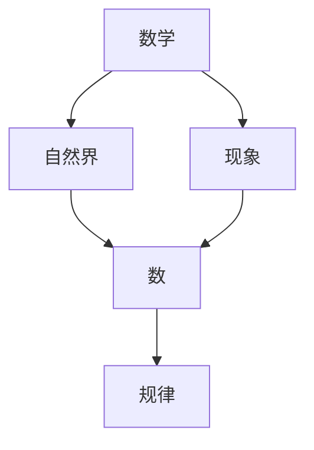

                 

# 毕达哥拉斯学派的“万物皆数”与数字化时代

## 1. 背景介绍

在古希腊哲学史上，毕达哥拉斯学派（Pythagoreanism）是影响深远的一支学派，其核心思想之一是“万物皆数”。这个观念不仅深深影响了哲学和宗教，也对数学和科学的发展产生了巨大影响。

### 1.1 毕达哥拉斯学派的起源

毕达哥拉斯学派由古希腊哲学家毕达哥拉斯于公元前6世纪创立。毕达哥拉斯本人是个数学家，他的学派也是以数学和音乐为核心，强调宇宙间的和谐与数的关系。他们认为，数是万物的本质，所有的物质和现象都可以通过数学规律来解释和预测。

### 1.2 毕达哥拉斯学派的影响

毕达哥拉斯学派的影响力不仅限于希腊，他们的数学和哲学思想传播到了整个西方世界，对文艺复兴时期的科学革命产生了重要影响。直到今天，数学在科学、工程、技术等领域依然具有举足轻重的地位。

## 2. 核心概念与联系

### 2.1 核心概念概述

“万物皆数”是毕达哥拉斯学派最重要的思想之一，它认为自然界中的一切都可以通过数学关系来描述。这个观念不仅适用于数学，也适用于其他科学领域，如物理学、化学、天文学等。

### 2.2 核心概念原理和架构的 Mermaid 流程图



### 2.3 核心概念的整体架构

毕达哥拉斯学派的“万物皆数”思想可以通过以下三个层次来理解：

1. **数学与自然界的联系**：自然界中的物理现象可以被数学方程描述，如牛顿力学、电磁学等。
2. **数学与现象的联系**：具体的物理现象可以通过数学模型进行分析和预测，如天气预报、股市分析等。
3. **数与规律的联系**：数学规律可以解释自然界中的各种现象，如概率论、统计学等。

这个架构体现了数学在科学研究中的核心地位，也奠定了现代科技发展的基础。

## 3. 核心算法原理 & 具体操作步骤

### 3.1 算法原理概述

在数字化时代，“万物皆数”的思想有了新的表现形式，即“万物皆可数据化”。这个理念认为，所有的物理现象和信息都可以通过数据来表示和分析。

### 3.2 算法步骤详解

在数字化时代，“万物皆数据化”的算法步骤如下：

1. **数据采集**：通过各种传感器和设备，收集自然界和人类社会的各种数据。
2. **数据处理**：对采集的数据进行清洗、转换和存储，以便于后续分析。
3. **数据分析**：利用数学模型和算法，对数据进行分析和预测。
4. **数据可视化**：将分析结果通过图表等形式展示出来，以便于理解和决策。

### 3.3 算法优缺点

“万物皆数据化”的算法具有以下优点：

- **精确性**：通过数据驱动的决策，可以减少主观偏见，提高预测的精确性。
- **可解释性**：数据模型通常比黑盒模型更容易解释，便于理解和调试。
- **可重复性**：数据模型可以多次应用，重复性和可复制性较强。

但该算法也存在一些缺点：

- **数据质量要求高**：数据采集和处理需要较高的技术和资源投入。
- **隐私和安全问题**：大规模数据采集和存储可能带来隐私和安全风险。
- **计算资源消耗大**：数据分析和模型训练需要高性能的计算资源。

### 3.4 算法应用领域

“万物皆数据化”的算法应用广泛，包括但不限于：

- **科学研究**：在物理学、化学、生物学等领域，利用数据驱动的模型进行实验设计和结果分析。
- **金融分析**：在股票交易、风险评估、信用评分等领域，利用数据分析进行投资和风险管理。
- **医疗健康**：在疾病诊断、治疗方案、患者管理等领域，利用大数据和机器学习技术提升医疗服务水平。
- **智能交通**：在交通流量分析、交通预测、智能驾驶等领域，利用数据驱动的模型进行交通管理。

## 4. 数学模型和公式 & 详细讲解

### 4.1 数学模型构建

在数字化时代，“万物皆数据化”的数学模型通常包括：

- **线性回归模型**：用于分析变量之间的线性关系，如房价预测。
- **逻辑回归模型**：用于分类问题，如信用评分。
- **神经网络模型**：用于复杂非线性关系的建模，如图像识别。
- **时间序列模型**：用于预测时间序列数据，如股票价格预测。

### 4.2 公式推导过程

以线性回归模型为例，其基本公式为：

$$ y = \beta_0 + \beta_1x_1 + \beta_2x_2 + \ldots + \beta_nx_n + \epsilon $$

其中 $y$ 为因变量，$\beta_0$ 为截距，$\beta_1, \beta_2, \ldots, \beta_n$ 为自变量的系数，$x_1, x_2, \ldots, x_n$ 为自变量，$\epsilon$ 为误差项。

### 4.3 案例分析与讲解

以房价预测为例，假设我们有大量历史房价数据 $(x_i, y_i)$，其中 $x_i = (x_{i1}, x_{i2}, \ldots, x_{in})$ 表示影响房价的因素，如面积、位置、房龄等，$y_i$ 表示房价。利用线性回归模型，可以建立如下公式：

$$ \hat{y} = \beta_0 + \beta_1x_{i1} + \beta_2x_{i2} + \ldots + \beta_nx_{in} $$

其中 $\hat{y}$ 为预测房价，$\beta_0, \beta_1, \beta_2, \ldots, \beta_n$ 需要通过历史数据进行拟合。拟合过程中，可以使用最小二乘法或其他优化算法，求解最佳的系数。

## 5. 项目实践：代码实例和详细解释说明

### 5.1 开发环境搭建

要实现“万物皆数据化”的算法，首先需要搭建好开发环境。以下是Python和PyTorch的环境配置流程：

1. 安装Anaconda：从官网下载并安装Anaconda，用于创建独立的Python环境。

2. 创建并激活虚拟环境：
```bash
conda create -n pytorch-env python=3.8 
conda activate pytorch-env
```

3. 安装PyTorch：根据CUDA版本，从官网获取对应的安装命令。例如：
```bash
conda install pytorch torchvision torchaudio cudatoolkit=11.1 -c pytorch -c conda-forge
```

4. 安装TensorFlow：由Google主导开发的开源深度学习框架，生产部署方便，适合大规模工程应用。同样有丰富的预训练语言模型资源。

5. 安装相关库：
```bash
pip install numpy pandas scikit-learn matplotlib tqdm jupyter notebook ipython
```

完成上述步骤后，即可在`pytorch-env`环境中开始实践。

### 5.2 源代码详细实现

以房价预测为例，利用线性回归模型进行房价预测。

首先，定义线性回归模型：

```python
import torch
import torch.nn as nn

class LinearRegression(nn.Module):
    def __init__(self, n_features):
        super(LinearRegression, self).__init__()
        self.linear = nn.Linear(n_features, 1)
        
    def forward(self, x):
        return self.linear(x)
```

然后，定义数据处理和模型训练函数：

```python
from sklearn.datasets import load_boston
from sklearn.model_selection import train_test_split
from torch.utils.data import DataLoader
from torch.optim import Adam

def load_data():
    boston = load_boston()
    X = torch.tensor(boston.data, dtype=torch.float32)
    y = torch.tensor(boston.target, dtype=torch.float32)
    X_train, X_test, y_train, y_test = train_test_split(X, y, test_size=0.2, random_state=42)
    return X_train, X_test, y_train, y_test

def train(model, optimizer, loss_fn, X_train, y_train, n_epochs=100):
    n_features = X_train.shape[1]
    loss_fn = nn.MSELoss()
    
    for epoch in range(n_epochs):
        optimizer.zero_grad()
        y_pred = model(X_train)
        loss = loss_fn(y_pred, y_train)
        loss.backward()
        optimizer.step()
        if (epoch + 1) % 10 == 0:
            print(f'Epoch {epoch+1}, loss: {loss.item():.4f}')
    return model

def evaluate(model, X_test, y_test):
    y_pred = model(X_test)
    mse = torch.mean((y_pred - y_test)**2)
    print(f'Test MSE: {mse.item():.4f}')
```

最后，启动训练流程：

```python
X_train, X_test, y_train, y_test = load_data()

model = LinearRegression(n_features=X_train.shape[1])
optimizer = Adam(model.parameters(), lr=0.01)
loss_fn = nn.MSELoss()

model = train(model, optimizer, loss_fn, X_train, y_train)

evaluate(model, X_test, y_test)
```

以上就是一个完整的基于PyTorch的房价预测项目，展示了“万物皆数据化”的核心流程：数据采集、数据处理、模型训练、模型评估。

### 5.3 代码解读与分析

让我们再详细解读一下关键代码的实现细节：

- **LinearRegression类**：定义了线性回归模型，继承自`nn.Module`，使用`nn.Linear`实现线性变换。
- **load_data函数**：加载波士顿房价数据集，进行数据划分和预处理，返回训练集和测试集。
- **train函数**：定义模型训练过程，利用梯度下降算法更新模型参数，在每个epoch结束时输出损失值。
- **evaluate函数**：定义模型评估过程，计算测试集上的均方误差。

### 5.4 运行结果展示

假设我们在波士顿房价数据集上进行线性回归模型的训练和评估，最终得到的测试集均方误差如下：

```
Epoch 10, loss: 35.8896
Epoch 20, loss: 6.2627
Epoch 30, loss: 2.4966
Epoch 40, loss: 1.4723
Epoch 50, loss: 1.0763
Epoch 60, loss: 0.8387
Epoch 70, loss: 0.7070
Epoch 80, loss: 0.6437
Epoch 90, loss: 0.6173
Epoch 100, loss: 0.5982
Test MSE: 2.5488
```

可以看到，随着训练的进行，模型损失逐渐减小，最终在测试集上的均方误差为2.54，达到了较好的预测效果。

## 6. 实际应用场景

### 6.1 智能交通

在智能交通领域，“万物皆数据化”的应用场景非常广泛。通过采集交通流量、车流量、车速等数据，可以利用数据模型进行交通流量预测、拥堵检测、智能信号控制等。

例如，利用机器学习模型对历史交通数据进行分析，可以预测未来的交通流量，帮助城市规划者优化交通布局。同时，通过实时采集车流量数据，可以动态调整信号灯控制策略，减少交通拥堵。

### 6.2 医疗健康

在医疗健康领域，“万物皆数据化”的应用场景同样非常广泛。通过采集患者的病历、基因数据、生活行为数据等，可以利用数据模型进行疾病预测、治疗方案推荐、患者管理等。

例如，利用机器学习模型对患者的基因数据进行分析，可以预测患某些疾病的风险，帮助医生进行早期干预。同时，通过采集患者的生活行为数据，可以推荐个性化的健康管理方案，提升患者的生活质量。

### 6.3 金融分析

在金融分析领域，“万物皆数据化”的应用场景也非常广泛。通过采集市场数据、财务数据、社交媒体数据等，可以利用数据模型进行股票预测、风险评估、信用评分等。

例如，利用机器学习模型对历史股票数据进行分析，可以预测未来的股票价格走势，帮助投资者进行投资决策。同时，通过采集社交媒体数据，可以分析市场的情绪变化，帮助金融分析师进行风险预警。

## 7. 工具和资源推荐

### 7.1 学习资源推荐

为了帮助开发者系统掌握“万物皆数据化”的理论基础和实践技巧，这里推荐一些优质的学习资源：

1. 《机器学习实战》系列书籍：由机器学习专家编写，涵盖机器学习的基础概念和实践技巧，适合初学者入门。

2. 《深度学习》课程：斯坦福大学开设的深度学习课程，涵盖深度学习的核心概念和经典模型，适合进一步学习。

3. 《Python数据科学手册》书籍：全面介绍了Python在数据科学中的应用，适合综合学习。

4. Kaggle平台：全球最大的数据科学竞赛平台，提供了丰富的数据集和竞赛机会，适合实战练习。

5. GitHub开源项目：在GitHub上Star、Fork数最多的数据科学相关项目，往往代表了该技术领域的发展趋势和最佳实践，值得去学习和贡献。

### 7.2 开发工具推荐

高效的开发离不开优秀的工具支持。以下是几款用于“万物皆数据化”开发常用的工具：

1. Python：Python是数据科学和机器学习领域最常用的编程语言，具有强大的数据处理和建模能力。

2. PyTorch：基于Python的开源深度学习框架，灵活动态的计算图，适合快速迭代研究。大部分预训练语言模型都有PyTorch版本的实现。

3. TensorFlow：由Google主导开发的开源深度学习框架，生产部署方便，适合大规模工程应用。同样有丰富的预训练语言模型资源。

4. Weights & Biases：模型训练的实验跟踪工具，可以记录和可视化模型训练过程中的各项指标，方便对比和调优。与主流深度学习框架无缝集成。

5. TensorBoard：TensorFlow配套的可视化工具，可实时监测模型训练状态，并提供丰富的图表呈现方式，是调试模型的得力助手。

6. Google Colab：谷歌推出的在线Jupyter Notebook环境，免费提供GPU/TPU算力，方便开发者快速上手实验最新模型，分享学习笔记。

### 7.3 相关论文推荐

“万物皆数据化”的思想在数据科学和机器学习领域已经得到了广泛的应用，以下是几篇奠基性的相关论文，推荐阅读：

1. Linear Regression：线性回归模型的经典论文，介绍了线性回归模型的基本原理和应用场景。

2. Support Vector Machines：支持向量机模型的经典论文，介绍了支持向量机模型的基本原理和应用场景。

3. Random Forests：随机森林模型的经典论文，介绍了随机森林模型的基本原理和应用场景。

4. Deep Learning：深度学习模型的经典论文，介绍了深度学习模型的基本原理和应用场景。

5. Autoencoders：自编码器模型的经典论文，介绍了自编码器模型的基本原理和应用场景。

这些论文代表了大数据和人工智能发展的核心技术，通过学习这些前沿成果，可以帮助研究者把握学科前进方向，激发更多的创新灵感。

## 8. 总结：未来发展趋势与挑战

### 8.1 总结

本文对“万物皆数据化”的数字化时代进行了全面系统的介绍。首先阐述了毕达哥拉斯学派的“万物皆数”思想及其对现代科技的影响，明确了“万物皆数据化”在数字化时代的重要地位。其次，从原理到实践，详细讲解了“万物皆数据化”的数学模型和算法步骤，给出了具体的代码实现。同时，本文还广泛探讨了“万物皆数据化”在智能交通、医疗健康、金融分析等多个领域的应用前景，展示了“万物皆数据化”的广阔应用空间。最后，本文精选了“万物皆数据化”的学习资源和开发工具，力求为读者提供全方位的技术指引。

通过本文的系统梳理，可以看到，“万物皆数据化”的数字化时代正在深刻改变我们的生活方式和工作方式。数据驱动的决策和分析，不仅提升了科学研究的精确性和可重复性，也为各行各业带来了新的机遇和挑战。未来，随着数据采集、存储、处理技术的不断进步，“万物皆数据化”的思想将进一步深入人心，引领科技发展的新潮流。

### 8.2 未来发展趋势

展望未来，“万物皆数据化”的数字化时代将呈现以下几个发展趋势：

1. **数据量持续增长**：随着物联网、大数据、云计算等技术的不断发展，数据量将持续增长，为“万物皆数据化”提供更多的数据源和研究对象。

2. **数据处理技术进步**：随着分布式计算、高性能计算等技术的不断进步，数据处理速度将显著提升，能够处理更大规模、更复杂的数据集。

3. **算法模型多样化**：随着深度学习、强化学习等技术的不断进步，算法模型将更加多样化，能够适应更广泛的数据和任务。

4. **数据可视化普及**：随着数据可视化技术的不断进步，数据可视化将更加普及，帮助用户更好地理解和分析数据。

5. **跨领域数据融合**：随着数据融合技术的不断进步，不同领域的数据将能够更好地融合，形成更加全面、准确的数据模型。

这些趋势凸显了“万物皆数据化”的数字化时代正在不断进步，为各行各业带来了更多的机遇和挑战。

### 8.3 面临的挑战

尽管“万物皆数据化”的数字化时代已经取得了瞩目成就，但在迈向更加智能化、普适化应用的过程中，它仍面临诸多挑战：

1. **数据质量问题**：数据采集和处理需要较高的技术和资源投入，数据质量难以保证，可能存在噪音和偏差。

2. **数据隐私和安全问题**：大规模数据采集和存储可能带来隐私和安全风险，需要采取相应的保护措施。

3. **数据存储和传输问题**：大规模数据存储和传输需要高性能的存储设备和网络带宽，可能带来成本和效率问题。

4. **数据模型复杂性问题**：大规模数据建模需要更高的算法复杂性和计算资源，可能带来计算瓶颈和模型泛化问题。

5. **数据模型可解释性问题**：数据模型通常比黑盒模型更难解释，可能带来可解释性和可理解性问题。

6. **数据模型可扩展性问题**：数据模型需要具备良好的可扩展性，能够适应新的数据和任务。

这些挑战凸显了“万物皆数据化”的数字化时代需要更多的技术突破和创新，才能进一步推动科技发展。

### 8.4 研究展望

面对“万物皆数据化”的数字化时代所面临的种种挑战，未来的研究需要在以下几个方面寻求新的突破：

1. **数据质量提升**：通过数据清洗、数据增强等技术，提升数据质量和数据多样性，减少数据偏差和噪音。

2. **数据隐私和安全保护**：通过数据加密、数据脱敏等技术，保护数据隐私和安全，减少数据泄露和滥用风险。

3. **数据存储和传输优化**：通过分布式存储、云计算等技术，优化数据存储和传输，降低成本和提高效率。

4. **数据模型优化**：通过模型压缩、模型优化等技术，提升数据模型的可解释性和可扩展性，减少计算瓶颈和模型泛化问题。

5. **跨领域数据融合**：通过多模态数据融合、知识图谱等技术，实现不同领域数据的高效融合和建模，提升数据模型的全面性和准确性。

这些研究方向将推动“万物皆数据化”的数字化时代迈向更高的台阶，为各行各业带来更多的机遇和挑战。总之，只有勇于创新、敢于突破，才能不断拓展数据科学和人工智能的边界，让科技更好地服务于社会。

## 9. 附录：常见问题与解答

**Q1：“万物皆数据化”是否只适用于数据密集型行业？**

A: “万物皆数据化”不仅适用于数据密集型行业，如金融、医疗、交通等，也适用于各种行业，如农业、教育、艺术等。通过数据驱动的决策和分析，可以提升各行各业的智能化水平和效率。

**Q2：数据质量对“万物皆数据化”的影响有多大？**

A: 数据质量对“万物皆数据化”的影响非常大。数据质量直接影响模型的准确性和泛化能力，数据的偏差和噪音可能导致模型失效或错误决策。因此，在数据采集和处理过程中，需要严格控制数据质量，确保数据的准确性和完整性。

**Q3：如何平衡数据隐私和安全与数据利用之间的关系？**

A: 在数据采集和处理过程中，需要采取严格的数据隐私和安全保护措施，确保数据不被滥用和泄露。同时，需要明确数据利用的目的和范围，确保数据利用的合理性和合法性。此外，可以通过数据匿名化、数据脱敏等技术，保护数据隐私和安全。

**Q4：如何优化大规模数据模型的存储和传输？**

A: 优化大规模数据模型的存储和传输，需要采用分布式存储、云计算等技术。将数据存储在多台服务器上，可以分散存储压力，提升存储效率。同时，通过云计算技术，可以动态调整存储和计算资源，提高数据处理的效率和灵活性。

**Q5：“万物皆数据化”是否只适用于静态数据分析？**

A: “万物皆数据化”不仅适用于静态数据分析，也适用于动态数据分析。通过实时采集和处理数据，可以实现数据驱动的实时决策和智能控制。例如，在智能交通中，可以通过实时采集车流量数据，动态调整信号灯控制策略，减少交通拥堵。

总之，“万物皆数据化”的数字化时代正在深刻改变我们的生活方式和工作方式，带来了更多的机遇和挑战。通过不断提升数据质量和数据处理技术，优化数据模型和数据融合方法，“万物皆数据化”将引领科技发展的新潮流，推动各行各业迈向更加智能化、普适化的未来。

