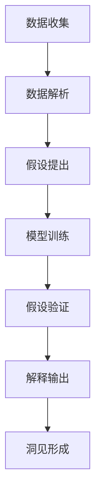
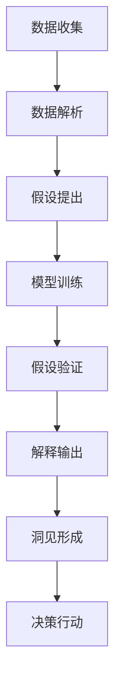

                 

## 1. 背景介绍

### 1.1 问题由来
在数据驱动的时代，如何从海量数据中提取有价值的洞见（Insight）成为了一个核心问题。随着深度学习、自然语言处理、计算机视觉等技术的飞速发展，人们从原始数据中发掘信息的手段日益丰富。但面对复杂的现实问题，单纯的数据挖掘已不足以解决问题。

如何从观察（Observation）到反思（Reflection），形成系统的洞见，已成为人工智能领域的一大挑战。本文档将探讨这一问题，从观察到反思，提炼出一套系统化的洞见形成框架，帮助开发者和研究人员在实际应用中更好地理解和解决各类问题。

### 1.2 问题核心关键点
洞见形成的核心在于将观察到的数据转化为具有实际意义和指导性的知识。这一过程不仅涉及数据挖掘和分析，还需要对数据的深度理解、合理的假设和解释、以及形成系统化的结论。

关键点包括：
- 数据质量：高质量的数据是洞见形成的基石，数据的准确性、完备性和代表性直接影响到洞见的可信度。
- 数据解析：从原始数据中提取关键信息，如特征选择、数据清洗、异常值处理等。
- 假设验证：根据数据分析结果，合理提出假设，并使用统计或机器学习方法验证其正确性。
- 解释模型：将模型结果转化为易于理解的解释，帮助理解背后的逻辑和机制。
- 系统化总结：将多个洞见和结论整合成一套完整的系统，用于指导决策和行动。

## 2. 核心概念与联系

### 2.1 核心概念概述
为了更好地理解洞见的形成过程，首先需要对一些关键概念进行梳理。

- **观察（Observation）**：数据驱动的观察，是从客观世界获取原始数据的过程，可以是传感器收集的数据、用户行为数据、市场数据等。
- **数据解析（Data Interpretation）**：通过数据清洗、特征提取、模型训练等方法，将原始数据转化为结构化的信息。
- **假设（Hypothesis）**：根据数据分析结果，提出可验证的假设，用以解释数据背后的机制或规律。
- **验证（Validation）**：使用统计或机器学习技术对假设进行验证，验证假设的科学性和可靠性。
- **解释（Explanation）**：将模型结果转化为可理解的解释，帮助理解和推理。
- **洞见（Insight）**：基于数据和假设验证的结果，形成系统化的结论，指导决策和行动。

这些概念通过一系列的流程相连接，形成了洞见形成的框架。

### 2.2 概念间的关系
洞见形成是一个从数据到模型的过程，最终将模型结果转化为洞见，以指导实际决策。这一过程可以通过以下流程图表示：



这个流程图展示了洞见形成的基本步骤：

1. 数据收集：获取原始数据，为后续分析提供素材。
2. 数据解析：对数据进行预处理和分析，提取关键信息。
3. 假设提出：根据数据分析结果，提出假设。
4. 模型训练：使用机器学习模型对数据进行拟合，得到预测结果。
5. 假设验证：使用统计或机器学习方法验证假设，确认其正确性。
6. 解释输出：将模型结果转化为易于理解的解释。
7. 洞见形成：将多个洞见整合成系统化的结论，用于指导决策和行动。

### 2.3 核心概念的整体架构
最后，我们用一个综合的流程图来展示这些核心概念在大数据洞见形成中的整体架构：



这一流程图展示了洞见形成的全流程，从数据收集开始，经过数据分析、模型训练、假设验证、结果解释和洞见形成，最终指导实际的决策和行动。

## 3. 核心算法原理 & 具体操作步骤

### 3.1 算法原理概述
洞见形成的核心在于从观察到的数据中提取有价值的洞见，这一过程可以通过一系列的数据分析和建模技术实现。

假设我们有一组原始数据 $X=\{x_i\}_{i=1}^N$，其中 $x_i=(x_{i1},x_{i2},\cdots,x_{in})$ 是一个特征向量。我们的目标是找到一组参数 $\theta$，使得模型 $f_\theta(x)$ 能最好地拟合数据 $X$，从而从数据中提取有意义的洞见。

### 3.2 算法步骤详解
洞见形成的过程可以分为以下几个主要步骤：

**步骤1：数据收集与预处理**

- **数据收集**：从各种来源收集数据，包括传感器数据、用户行为数据、市场数据等。
- **数据清洗**：处理缺失值、异常值和噪声数据，保证数据的完整性和准确性。
- **特征提取**：选择合适的特征，将原始数据转换为结构化信息。

**步骤2：模型训练与假设提出**

- **模型选择**：根据任务特点选择合适的机器学习模型，如线性回归、决策树、神经网络等。
- **模型训练**：使用训练数据拟合模型参数，得到预测结果。
- **假设提出**：根据模型结果提出假设，解释数据背后的机制或规律。

**步骤3：假设验证**

- **假设验证**：使用测试数据验证假设，确认假设的正确性。
- **模型优化**：根据验证结果，调整模型参数，提高模型精度。

**步骤4：解释输出**

- **结果解释**：将模型结果转化为可理解的解释，帮助理解和推理。
- **可视化**：使用可视化工具展示模型结果，帮助更直观地理解数据和假设。

**步骤5：洞见形成**

- **系统化总结**：将多个洞见整合成系统化的结论，指导决策和行动。
- **模型部署**：将模型部署到实际应用中，提供决策支持。

### 3.3 算法优缺点

**优点**：
1. **自动化**：自动化地从数据中提取洞见，减少了人工干预和主观偏差。
2. **系统性**：将多个洞见整合成系统化的结论，提供更为全面和可靠的信息。
3. **可扩展性**：可应用于各种数据类型和问题领域，具有广泛的适用性。

**缺点**：
1. **数据依赖**：洞见形成依赖高质量的数据，数据质量差会影响洞见可信度。
2. **模型复杂性**：复杂的模型可能难以解释，用户难以理解和信任模型结果。
3. **过度拟合**：模型在训练过程中可能过度拟合训练数据，导致泛化能力不足。

### 3.4 算法应用领域
洞见形成方法可以广泛应用于以下几个领域：

- **金融领域**：通过分析市场数据，识别投资机会和风险，进行决策支持。
- **医疗领域**：通过分析患者数据，进行疾病预测和个性化治疗方案设计。
- **零售领域**：通过分析消费者行为数据，进行市场细分和个性化营销。
- **物流领域**：通过分析物流数据，优化配送路线和库存管理。
- **环境保护**：通过分析环境数据，制定环境保护政策和措施。

## 4. 数学模型和公式 & 详细讲解 & 举例说明

### 4.1 数学模型构建

为了更好地理解洞见形成的过程，我们可以通过一个简单的线性回归模型来举例说明。

假设我们有一组数据 $X=\{x_i\}_{i=1}^N$，其中 $x_i=(x_{i1},x_{i2},\cdots,x_{in})$ 是一个特征向量，$y_i$ 是目标变量。我们的目标是找到一组参数 $\theta$，使得线性回归模型 $f_\theta(x)=\theta^Tx$ 能最好地拟合数据 $X$。

**线性回归模型的数学表达式**：

$$
\min_{\theta} \frac{1}{2N} \sum_{i=1}^N (y_i - \theta^Tx_i)^2
$$

其中 $\theta$ 为模型参数，$\theta^T$ 为向量 $\theta$ 的转置。

### 4.2 公式推导过程

**求解最小二乘估计**：

将上述表达式展开并化简，得：

$$
\min_{\theta} \frac{1}{2N} \sum_{i=1}^N (y_i - \theta^Tx_i)^2 = \min_{\theta} \frac{1}{2N} \sum_{i=1}^N (\theta_0 + \theta_1 x_{i1} + \cdots + \theta_n x_{in})^2 - 2y_i(\theta_0 + \theta_1 x_{i1} + \cdots + \theta_n x_{in}) + y_i^2
$$

$$
= \min_{\theta} \frac{1}{2N} \sum_{i=1}^N (\theta_0 + \theta_1 x_{i1} + \cdots + \theta_n x_{in})^2 - 2\theta^Ty + y^Ty
$$

令 $A=\frac{1}{N} \sum_{i=1}^N x_ix_i^T$ 和 $b=\frac{1}{N} \sum_{i=1}^N x_iy_i$，得：

$$
\min_{\theta} \frac{1}{2} \theta^TA\theta - 2b^T\theta + y^Ty
$$

令 $X=\frac{1}{N} \sum_{i=1}^N x_iy_i$，得：

$$
\min_{\theta} \frac{1}{2} \theta^TA\theta - 2X^T\theta + X^TX
$$

求解上述最优化问题，得：

$$
\theta = (A^TA)^{-1}A^Tb
$$

### 4.3 案例分析与讲解

假设我们有一组数据集，其中 $x_i$ 包含一个时间序列和两个特征变量，$y_i$ 为目标变量。我们使用线性回归模型对该数据进行建模，步骤如下：

1. **数据收集与预处理**：从数据集中收集数据，并进行数据清洗和特征提取。
2. **模型训练与假设提出**：使用线性回归模型对数据进行拟合，并根据模型结果提出假设。
3. **假设验证**：使用测试数据验证假设，确认假设的正确性。
4. **解释输出**：将模型结果转化为易于理解的解释，帮助理解和推理。
5. **洞见形成**：将多个洞见整合成系统化的结论，指导决策和行动。

### 4.4 代码实例

以下是一个简单的Python代码示例，使用Scikit-Learn库实现线性回归模型的训练和预测：

```python
from sklearn.linear_model import LinearRegression
import numpy as np

# 生成模拟数据
X = np.random.randn(100, 3)
y = 2 + 3 * X[:, 0] + 4 * X[:, 1] + np.random.randn(100)

# 训练模型
model = LinearRegression()
model.fit(X, y)

# 预测结果
X_test = np.random.randn(10, 3)
y_pred = model.predict(X_test)

# 输出结果
print("模型系数：", model.coef_)
print("预测结果：", y_pred)
```

## 5. 项目实践：代码实例和详细解释说明

### 5.1 开发环境搭建

在进行洞见形成实践前，我们需要准备好开发环境。以下是使用Python进行Scikit-Learn开发的环境配置流程：

1. 安装Anaconda：从官网下载并安装Anaconda，用于创建独立的Python环境。

2. 创建并激活虚拟环境：
```bash
conda create -n sklearn-env python=3.8 
conda activate sklearn-env
```

3. 安装Scikit-Learn：
```bash
pip install scikit-learn
```

4. 安装各类工具包：
```bash
pip install numpy pandas matplotlib
```

完成上述步骤后，即可在`sklearn-env`环境中开始洞见形成实践。

### 5.2 源代码详细实现

以下是一个完整的Python代码示例，使用Scikit-Learn库实现线性回归模型的训练和预测：

```python
from sklearn.linear_model import LinearRegression
import numpy as np

# 生成模拟数据
X = np.random.randn(100, 3)
y = 2 + 3 * X[:, 0] + 4 * X[:, 1] + np.random.randn(100)

# 训练模型
model = LinearRegression()
model.fit(X, y)

# 预测结果
X_test = np.random.randn(10, 3)
y_pred = model.predict(X_test)

# 输出结果
print("模型系数：", model.coef_)
print("预测结果：", y_pred)
```

## 5.3 代码解读与分析

让我们再详细解读一下关键代码的实现细节：

- **数据生成**：使用NumPy生成一个包含100个样本的模拟数据集，其中每个样本有3个特征变量和一个目标变量。
- **模型训练**：使用Scikit-Learn的`LinearRegression`类，对数据进行拟合，得到模型参数。
- **预测结果**：使用模型对10个测试样本进行预测，得到预测结果。
- **输出结果**：输出模型的系数和预测结果，以验证模型是否正确拟合数据。

## 6. 实际应用场景

### 6.1 金融领域

在金融领域，洞见形成可以帮助投资者分析市场趋势，识别投资机会和风险，进行决策支持。

具体而言，可以使用历史股价数据、财务报表数据等，通过线性回归、时间序列分析等方法，预测股票价格走势，进行股票买入和卖出决策。同时，还可以使用回归模型分析影响股价的关键因素，如公司业绩、行业动态等，为投资者提供更全面的决策支持。

### 6.2 医疗领域

在医疗领域，洞见形成可以帮助医生分析病人数据，进行疾病预测和个性化治疗方案设计。

具体而言，可以使用病人的年龄、性别、病史等数据，通过回归模型预测病人患病的概率，提供早期干预和个性化治疗方案。同时，还可以使用聚类和分类模型分析病人群体的特征，为医生提供更为精准的治疗建议。

### 6.3 零售领域

在零售领域，洞见形成可以帮助商家分析消费者行为数据，进行市场细分和个性化营销。

具体而言，可以使用消费者的购买记录、浏览记录等数据，通过回归模型预测消费者对不同商品的兴趣，进行个性化推荐。同时，还可以使用聚类和分类模型分析不同消费者群体的特征，为商家提供更为精准的市场细分和营销策略。

## 7. 工具和资源推荐

### 7.1 学习资源推荐

为了帮助开发者和研究人员系统掌握洞见形成技术，这里推荐一些优质的学习资源：

1. **《机器学习》教材**：经典的机器学习教材，详细介绍了各种机器学习算法和技术。
2. **Coursera《机器学习》课程**：斯坦福大学的免费在线课程，涵盖机器学习的基本概念和算法，适合初学者和进阶学习者。
3. **Kaggle竞赛**：Kaggle平台提供各种数据科学竞赛，通过实践项目，帮助学习者掌握洞见形成技术。
4. **Scikit-Learn官方文档**：Scikit-Learn库的官方文档，详细介绍了各种机器学习算法的实现和应用。
5. **Python Data Science Handbook**：Python数据科学领域的权威指南，涵盖各种数据处理和分析技术。

通过对这些资源的学习实践，相信你一定能够快速掌握洞见形成技术，并应用于实际问题中。

### 7.2 开发工具推荐

高效的开发离不开优秀的工具支持。以下是几款用于洞见形成开发的常用工具：

1. **Python**：数据科学和机器学习领域的主流语言，Scikit-Learn、TensorFlow等机器学习库都支持Python。
2. **R语言**：数据科学和统计分析的另一个重要工具，广泛应用于数据分析和统计建模。
3. **Jupyter Notebook**：Python和R语言等交互式编程环境的常用工具，支持代码编写和可视化。
4. **Tableau**：数据可视化工具，帮助用户更直观地理解和展示数据。
5. **Matplotlib**：Python的绘图库，支持各种数据可视化和图表绘制。

合理利用这些工具，可以显著提升洞见形成任务的开发效率，加快创新迭代的步伐。

### 7.3 相关论文推荐

洞见形成技术的发展源于学界的持续研究。以下是几篇奠基性的相关论文，推荐阅读：

1. **线性回归模型**：《统计学习方法》李航，详细介绍了线性回归模型的原理和应用。
2. **决策树算法**：《机器学习》TOM MITSCHROWATZ，介绍了决策树算法的实现和应用。
3. **随机森林算法**：《The Elements of Statistical Learning》Hastie等，介绍了随机森林算法的基本原理和应用。
4. **神经网络模型**：《Deep Learning》Ian Goodfellow等，介绍了神经网络模型的基本原理和应用。
5. **支持向量机**：《Pattern Recognition and Machine Learning》Christopher Bishop，介绍了支持向量机的基本原理和应用。

这些论文代表了大数据洞见形成技术的发展脉络。通过学习这些前沿成果，可以帮助研究者把握学科前进方向，激发更多的创新灵感。

除上述资源外，还有一些值得关注的前沿资源，帮助开发者紧跟洞见形成技术的最新进展，例如：

1. **arXiv论文预印本**：人工智能领域最新研究成果的发布平台，包括大量尚未发表的前沿工作，学习前沿技术的必读资源。
2. **顶级会议论文**：如NeurIPS、ICML、CVPR等人工智能领域顶会现场或在线直播，能够聆听到大佬们的前沿分享，开拓视野。
3. **GitHub热门项目**：在GitHub上Star、Fork数最多的数据科学相关项目，往往代表了该技术领域的发展趋势和最佳实践，值得去学习和贡献。
4. **行业分析报告**：各大咨询公司如McKinsey、PwC等针对数据科学行业的分析报告，有助于从商业视角审视技术趋势，把握应用价值。

总之，对于洞见形成技术的学习和实践，需要开发者保持开放的心态和持续学习的意愿。多关注前沿资讯，多动手实践，多思考总结，必将收获满满的成长收益。

## 8. 总结：未来发展趋势与挑战

### 8.1 研究成果总结

本文对基于数据驱动的洞见形成方法进行了全面系统的介绍。首先阐述了洞见形成的核心概念和应用背景，明确了洞见形成在数据驱动决策中的重要性。其次，从观察到反思，详细讲解了洞见形成的核心步骤和关键技术。最后，总结了洞见形成在不同领域的应用，并推荐了相关的学习资源和开发工具。

通过本文的系统梳理，可以看到，洞见形成方法正在成为数据科学领域的重要工具，极大地提升了数据驱动决策的科学性和系统性。未来，伴随机器学习技术的不断演进，洞见形成方法将与更多前沿技术结合，进一步推动数据驱动决策的发展。

### 8.2 未来发展趋势

展望未来，洞见形成方法将呈现以下几个发展趋势：

1. **自动化和智能化**：自动化和智能化的洞见形成方法将逐渐普及，帮助用户更高效地从数据中提取洞见。
2. **跨领域应用**：洞见形成方法将逐步应用于更多领域，如金融、医疗、零售等，提升各行业的决策效率和科学性。
3. **实时化**：实时化的洞见形成方法将逐步实现，帮助用户及时获取最新洞见，进行实时决策。
4. **自适应学习**：自适应学习的方法将逐渐普及，帮助用户根据数据变化不断优化洞见形成模型。
5. **多模态融合**：多模态融合的洞见形成方法将逐渐普及，帮助用户更全面地理解数据和洞见。

### 8.3 面临的挑战

尽管洞见形成技术已经取得了瞩目成就，但在迈向更加智能化、普适化应用的过程中，它仍面临着诸多挑战：

1. **数据质量**：高质量的数据是洞见形成的基石，数据质量差会影响洞见可信度。
2. **模型复杂性**：复杂的模型可能难以解释，用户难以理解和信任模型结果。
3. **过度拟合**：模型在训练过程中可能过度拟合训练数据，导致泛化能力不足。
4. **计算资源**：高效的洞见形成方法需要大量的计算资源，增加了开发和应用的成本。
5. **隐私和安全**：洞见形成方法依赖大量数据，隐私和安全问题需要引起重视。

### 8.4 研究展望

面对洞见形成技术面临的诸多挑战，未来的研究需要在以下几个方面寻求新的突破：

1. **数据治理**：探索数据质量管理和数据治理方法，提升数据质量和可信度。
2. **模型解释**：开发更加可解释的模型和解释工具，帮助用户理解和信任模型结果。
3. **模型优化**：研究高效的模型训练和优化方法，提升模型泛化能力和效率。
4. **计算资源**：探索高效的计算资源管理和优化方法，降低计算成本。
5. **隐私保护**：研究数据隐私保护和安全方法，保障用户数据安全和隐私。

这些研究方向的探索，必将引领洞见形成技术迈向更高的台阶，为数据驱动决策提供更加科学和可靠的支持。相信随着学界和产业界的共同努力，洞见形成技术必将迎来更加广阔的应用前景，为人工智能和数据科学带来新的突破。

## 9. 附录：常见问题与解答

**Q1：如何提高洞见形成的可信度？**

A: 提高洞见形成的可信度，需要从数据质量、模型选择和解释等多个方面入手。具体而言：
1. 数据质量：确保数据的准确性、完备性和代表性，减少数据噪声和偏见。
2. 模型选择：选择合适的机器学习模型，并根据数据特点进行优化。
3. 模型解释：提供易于理解的模型解释，帮助用户理解和信任模型结果。
4. 多模型集成：使用多个模型进行集成预测，减少单模型的不确定性。

**Q2：如何选择适合的数据驱动洞见形成方法？**

A: 选择适合的数据驱动洞见形成方法，需要考虑数据类型、任务特点和用户需求等因素。具体而言：
1. 数据类型：根据数据类型选择合适的机器学习模型，如时间序列数据适合使用时间序列模型，文本数据适合使用文本分类和聚类模型。
2. 任务特点：根据任务特点选择合适的算法，如回归问题适合使用线性回归模型，分类问题适合使用分类模型。
3. 用户需求：根据用户需求选择合适的解释方式，如需要可视化展示数据，可以选择使用图表工具；需要可解释的模型，可以选择使用可解释模型或解释工具。

**Q3：如何评估洞见形成方法的性能？**

A: 评估洞见形成方法的性能，可以从多个指标入手，如准确率、召回率、F1分数等。具体而言：
1. 数据集划分：将数据集划分为训练集、验证集和测试集，使用验证集进行模型调参，使用测试集进行性能评估。
2. 交叉验证：使用交叉验证方法，评估模型在不同数据集上的表现。
3. 指标选择：根据任务特点选择合适的评估指标，如回归问题使用均方误差和均方根误差，分类问题使用准确率和F1分数。
4. 性能比较：将模型结果与基准模型进行比较，评估模型性能的提升情况。

**Q4：洞见形成方法在实际应用中需要注意哪些问题？**

A: 在实际应用中，洞见形成方法需要注意以下问题：
1. 数据质量：确保数据的准确性和完备性，减少数据噪声和偏见。
2. 模型选择：选择合适的机器学习模型，并根据数据特点进行优化。
3. 模型解释：提供易于理解的模型解释，帮助用户理解和信任模型结果。
4. 模型部署：将模型部署到实际应用中，进行性能测试和优化。
5. 持续学习：根据数据变化不断优化模型，提升模型的泛化能力和稳定性。

总之，洞见形成方法需要开发者根据具体任务，不断迭代和优化模型、数据和算法，方能得到理想的效果。

**Q5：洞见形成方法在数据科学中的应用前景如何？**

A: 洞见形成方法在数据科学中的应用前景非常广阔，主要体现在以下几个方面：
1. 金融领域：通过分析市场数据，识别投资机会和风险，进行决策支持。
2. 医疗领域：通过分析病人数据，进行疾病预测和个性化治疗方案设计。
3. 零售领域：通过分析消费者行为数据，进行市场细分和个性化营销。
4. 物流领域：通过分析物流数据，优化配送路线和库存管理。
5. 环境保护：通过分析环境数据，制定环境保护政策和措施。

随着数据科学技术的不断进步，洞见形成方法必将在更多领域得到应用，为数据驱动决策带来新的突破。

---

作者：禅与计算机程序设计艺术 / Zen and the Art of Computer Programming

