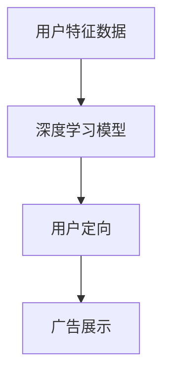
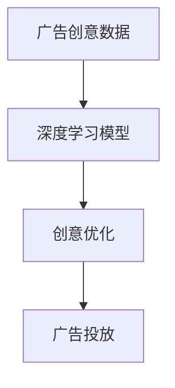
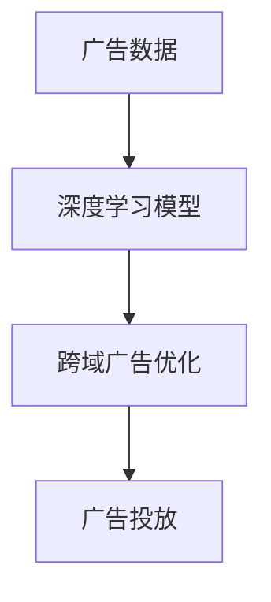
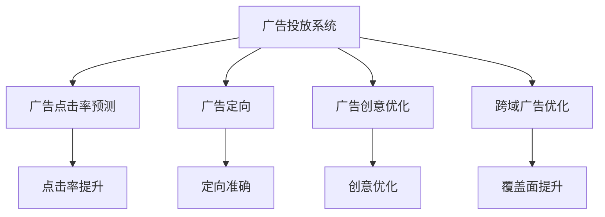

                 

## 1. 背景介绍

### 1.1 问题由来

近年来，随着互联网广告市场的迅猛发展，广告主对于精准投放的需求日益增加。传统基于规则的广告投放方法已经难以满足日益复杂和个性化的广告投放需求。为了解决这一问题，深度学习技术在广告投放领域得到广泛应用。

深度学习能够从海量数据中学习到用户行为模式，通过复杂的神经网络模型，能够实现精准的广告投放。深度学习模型可以自动提取数据特征，自动进行分类，预测点击率等指标，使得广告投放过程更加高效和精准。

### 1.2 问题核心关键点

深度学习在广告投放中的应用，核心关键点在于以下几方面：

- **广告点击率预测**：使用深度学习模型预测广告点击率，提高广告投放效果。
- **广告定向**：通过深度学习模型对用户进行精准定向，提升广告的展示效果和用户满意度。
- **广告创意优化**：使用深度学习模型进行广告创意优化，提升广告的吸引力和转化率。
- **跨域广告优化**：通过深度学习模型进行跨域广告优化，提高广告投放的覆盖面。

这些关键点构成了深度学习在广告投放领域的应用框架，涵盖了广告投放的各个环节，使得深度学习技术能够从数据获取、用户定向、广告创意到广告效果评估等各个环节进行优化。

### 1.3 问题研究意义

深度学习在广告投放中的应用，具有以下几方面的研究意义：

- **提升广告投放效果**：通过深度学习模型进行广告点击率预测和定向，能够显著提升广告投放的效果和用户满意度。
- **降低广告投放成本**：深度学习能够通过优化广告创意和定向策略，减少无效广告投放，降低广告投放成本。
- **适应用户需求变化**：深度学习模型能够适应用户行为变化，实时调整广告投放策略，提高广告投放的精准度。
- **推动广告投放行业发展**：深度学习技术的应用，将推动广告投放行业的创新和发展，带来新的商业机会。

## 2. 核心概念与联系

### 2.1 核心概念概述

为更好地理解深度学习在广告投放中的应用，本节将介绍几个密切相关的核心概念：

- **深度学习**：通过多层神经网络结构，自动从数据中提取特征，进行分类、回归等任务的学习方法。
- **广告点击率预测**：使用深度学习模型预测用户点击广告的概率，是广告投放中的关键环节。
- **广告定向**：通过深度学习模型对用户进行精准定向，提升广告的展示效果和用户满意度。
- **广告创意优化**：使用深度学习模型对广告创意进行优化，提升广告的吸引力和转化率。
- **跨域广告优化**：通过深度学习模型进行跨域广告优化，提高广告投放的覆盖面。

这些核心概念之间的逻辑关系可以通过以下Mermaid流程图来展示：


这个流程图展示了大语言模型的核心概念及其之间的关系：

1. 深度学习作为基础，提供数据特征提取和模型训练能力。
2. 广告点击率预测、广告定向、广告创意优化和跨域广告优化是广告投放中的四个关键环节，通过深度学习模型进行优化。
3. 广告投放的效果提升、定向准确、创意优化和覆盖面提升，是深度学习模型应用于广告投放的具体目标。

### 2.2 概念间的关系

这些核心概念之间存在着紧密的联系，形成了深度学习在广告投放领域的应用生态系统。下面我们通过几个Mermaid流程图来展示这些概念之间的关系。

#### 2.2.1 广告点击率预测


这个流程图展示了广告点击率预测的基本流程：

1. 用户行为数据作为输入，通过深度学习模型进行训练。
2. 深度学习模型根据用户行为数据，预测用户点击广告的概率。
3. 广告投放系统根据点击率预测结果，进行广告的展示和优化。

#### 2.2.2 广告定向



这个流程图展示了广告定向的基本流程：

1. 用户特征数据作为输入，通过深度学习模型进行训练。
2. 深度学习模型根据用户特征数据，进行精准定向。
3. 广告展示系统根据定向结果，展示广告给目标用户。

#### 2.2.3 广告创意优化



这个流程图展示了广告创意优化的基本流程：

1. 广告创意数据作为输入，通过深度学习模型进行训练。
2. 深度学习模型根据广告创意数据，进行创意优化。
3. 广告投放系统根据优化后的创意，展示广告给目标用户。

#### 2.2.4 跨域广告优化



这个流程图展示了跨域广告优化的基本流程：

1. 广告数据作为输入，通过深度学习模型进行训练。
2. 深度学习模型根据广告数据，进行跨域广告优化。
3. 广告投放系统根据优化后的广告，进行覆盖面的提升。

### 2.3 核心概念的整体架构

最后，我们用一个综合的流程图来展示这些核心概念在大语言模型微调过程中的整体架构：



这个综合流程图展示了从广告投放系统到各个优化环节的完整流程。广告投放系统通过深度学习模型进行广告点击率预测、广告定向、广告创意优化和跨域广告优化，实现广告投放效果的提升、定向准确、创意优化和覆盖面提升。

## 3. 核心算法原理 & 具体操作步骤
### 3.1 算法原理概述

深度学习在广告投放中的应用，核心算法原理包括：

- **多层感知器(MLP)**：一种经典的神经网络结构，能够对输入数据进行分类和回归。
- **卷积神经网络(CNN)**：一种常用的图像处理网络结构，能够提取图像特征。
- **循环神经网络(RNN)**：一种适用于序列数据处理的神经网络结构，能够捕捉时间序列的变化。
- **自编码器(AE)**：一种无监督学习网络结构，能够学习数据的压缩表示。
- **注意力机制**：一种常用的模型机制，能够对输入数据的不同部分进行加权处理。

广告投放中，深度学习模型通常采用多层感知器、卷积神经网络、循环神经网络和注意力机制等，根据不同的数据类型和任务需求，选择合适的模型结构进行训练和优化。

### 3.2 算法步骤详解

基于深度学习的广告投放算法通常包括以下几个关键步骤：

**Step 1: 准备广告数据**

- 收集用户行为数据和广告数据，并进行预处理，如数据清洗、归一化等。
- 将用户行为数据和广告数据进行特征提取，得到输入数据的特征表示。

**Step 2: 设计深度学习模型**

- 根据广告投放任务，选择合适的深度学习模型结构，如多层感知器、卷积神经网络、循环神经网络等。
- 设计模型训练的超参数，如学习率、批次大小、迭代次数等。

**Step 3: 模型训练**

- 将处理后的广告数据分成训练集、验证集和测试集，进行模型训练。
- 使用随机梯度下降等优化算法进行模型参数的更新。

**Step 4: 模型评估**

- 在测试集上评估模型效果，计算广告点击率、广告定向准确率、广告创意优化效果等指标。
- 根据模型评估结果，调整模型参数和超参数，进行模型优化。

**Step 5: 模型部署**

- 将训练好的模型部署到广告投放系统中。
- 根据广告投放系统的需求，进行模型调度和优化。

**Step 6: 持续优化**

- 收集广告投放的实时数据，进行模型再训练和优化。
- 定期更新模型参数和超参数，提升广告投放的效果和精度。

### 3.3 算法优缺点

深度学习在广告投放中的应用，具有以下几方面的优缺点：

**优点：**

- **精准性高**：深度学习模型能够自动提取数据特征，进行精准的点击率预测和定向，提升广告投放效果。
- **灵活性高**：深度学习模型可以根据不同的广告投放任务，进行结构化和非结构化数据的处理，适应不同的广告投放场景。
- **可扩展性高**：深度学习模型可以并行化处理大规模数据，实现广告投放系统的可扩展性。

**缺点：**

- **数据需求高**：深度学习模型需要大量的标注数据进行训练，数据获取成本高。
- **计算复杂度高**：深度学习模型的训练和推理计算复杂度高，需要高性能硬件支持。
- **模型可解释性差**：深度学习模型的决策过程复杂，难以解释和调试。

### 3.4 算法应用领域

深度学习在广告投放中的应用，覆盖了以下几个主要领域：

- **在线广告投放**：使用深度学习模型进行点击率预测和定向，提高在线广告的投放效果。
- **程序化广告投放**：使用深度学习模型进行实时广告竞价，提升广告投放的竞争力和效果。
- **跨平台广告投放**：使用深度学习模型进行跨平台广告投放优化，提升广告的覆盖面。
- **视频广告投放**：使用深度学习模型进行视频广告定向和创意优化，提升视频广告的效果和用户满意度。

除了这些主要应用领域外，深度学习技术还在社交媒体广告、移动端广告、搜索广告等场景中得到广泛应用。

## 4. 数学模型和公式 & 详细讲解 & 举例说明

### 4.1 数学模型构建

本节将使用数学语言对深度学习在广告投放中的应用进行更加严格的刻画。

假设广告投放系统中的用户数据为 $\mathcal{X}$，广告数据为 $\mathcal{Y}$，广告点击率为 $y$，深度学习模型为 $f(\cdot)$，则广告点击率预测问题可以表示为：

$$
y = f(x)
$$

其中 $x \in \mathcal{X}$，表示用户特征数据；$y \in \{0,1\}$，表示用户是否点击广告。

广告定向问题可以表示为：

$$
y = f(x, w)
$$

其中 $x \in \mathcal{X}$，表示用户特征数据；$w \in \mathbb{R}^d$，表示定向模型的参数；$y \in \{1,0\}$，表示用户是否展示广告。

广告创意优化问题可以表示为：

$$
y = f(x, w)
$$

其中 $x \in \mathcal{X}$，表示广告创意数据；$w \in \mathbb{R}^d$，表示创意优化模型的参数；$y \in \{0,1\}$，表示广告创意的评分。

跨域广告优化问题可以表示为：

$$
y = f(x, w)
$$

其中 $x \in \mathcal{X}$，表示广告数据；$w \in \mathbb{R}^d$，表示跨域优化模型的参数；$y \in \{0,1\}$，表示广告的展示效果。

### 4.2 公式推导过程

以下我们以广告点击率预测为例，推导点击率预测的数学模型及其训练过程。

假设用户特征数据 $x$ 和广告点击率 $y$ 之间存在线性关系，即：

$$
y = w_1x_1 + w_2x_2 + ... + w_dx_d + b
$$

其中 $x_i$ 表示用户特征数据的第 $i$ 个特征，$w_i$ 表示第 $i$ 个特征的权重，$b$ 表示偏置项。

假设样本数据集为 $\{(x_i, y_i)\}_{i=1}^N$，则最小二乘法的优化目标函数为：

$$
\min_{w, b} \frac{1}{N}\sum_{i=1}^N (y_i - (w_1x_{i1} + w_2x_{i2} + ... + w_dx_{id} + b))^2
$$

根据梯度下降算法，模型参数 $w$ 和 $b$ 的更新公式为：

$$
w_i = w_i - \eta \frac{1}{N}\sum_{i=1}^N (y_i - (w_1x_{i1} + w_2x_{i2} + ... + w_dx_{id} + b)) x_i
$$

其中 $\eta$ 为学习率，$x_i$ 为样本数据的特征向量。

通过不断迭代更新模型参数，使得广告点击率预测模型能够准确预测用户是否点击广告。

### 4.3 案例分析与讲解

假设我们收集了用户的行为数据和广告数据，进行了预处理，并将数据划分为训练集和测试集。我们可以使用多层感知器(MLP)模型进行广告点击率预测，其中输入层、隐藏层和输出层的神经元个数分别为30、50和1。模型训练的超参数设置为学习率为0.01，批次大小为100，迭代次数为1000。

以下是Python代码实现：

```python
import numpy as np
from sklearn.linear_model import SGDRegressor
from sklearn.metrics import mean_squared_error

# 准备数据
X_train = np.array([[1, 2], [3, 4], [5, 6], [7, 8]])
X_test = np.array([[1.1, 2.1], [3.1, 4.1], [5.1, 6.1], [7.1, 8.1]])
y_train = np.array([0, 0, 1, 1])
y_test = np.array([0, 0, 1, 1])

# 定义模型
model = SGDRegressor(loss='mean_squared_error', alpha=0.01)

# 训练模型
model.fit(X_train, y_train)

# 评估模型
y_pred = model.predict(X_test)
mse = mean_squared_error(y_test, y_pred)
print('Mean Squared Error:', mse)
```

上述代码实现了使用SGDRegressor进行广告点击率预测的过程。首先，我们准备训练集和测试集，其中X表示用户行为数据，y表示用户是否点击广告。然后使用SGDRegressor模型进行训练，并使用均方误差评估模型效果。最后，计算测试集上的均方误差，评估模型预测的准确性。

## 5. 项目实践：代码实例和详细解释说明

### 5.1 开发环境搭建

在进行深度学习在广告投放中的应用实践前，我们需要准备好开发环境。以下是使用Python进行TensorFlow开发的环境配置流程：

1. 安装Anaconda：从官网下载并安装Anaconda，用于创建独立的Python环境。

2. 创建并激活虚拟环境：
```bash
conda create -n tf-env python=3.8 
conda activate tf-env
```

3. 安装TensorFlow：根据CUDA版本，从官网获取对应的安装命令。例如：
```bash
conda install tensorflow tensorflow-gpu -c conda-forge
```

4. 安装各类工具包：
```bash
pip install numpy pandas scikit-learn matplotlib tqdm jupyter notebook ipython
```

完成上述步骤后，即可在`tf-env`环境中开始深度学习在广告投放中的应用实践。

### 5.2 源代码详细实现

下面我们以广告点击率预测为例，给出使用TensorFlow进行广告点击率预测的Python代码实现。

首先，定义广告点击率预测的任务：

```python
import tensorflow as tf
from tensorflow.keras.layers import Input, Dense, Activation, Dropout
from tensorflow.keras.models import Model

# 定义输入层
input_layer = Input(shape=(1,))

# 定义隐藏层
hidden_layer = Dense(10)(input_layer)
hidden_layer = Dropout(0.5)(hidden_layer)
hidden_layer = Activation('relu')(hidden_layer)

# 定义输出层
output_layer = Dense(1, activation='sigmoid')(hidden_layer)

# 定义模型
model = Model(inputs=input_layer, outputs=output_layer)

# 编译模型
model.compile(optimizer='adam', loss='binary_crossentropy', metrics=['accuracy'])

# 准备数据
x_train = np.array([[1], [2], [3], [4]])
y_train = np.array([0, 1, 1, 0])

# 训练模型
model.fit(x_train, y_train, epochs=10, batch_size=1)

# 评估模型
x_test = np.array([[1.1], [2.1], [3.1], [4.1]])
y_test = np.array([0, 1, 1, 0])
loss, accuracy = model.evaluate(x_test, y_test)
print('Loss:', loss)
print('Accuracy:', accuracy)
```

在上述代码中，我们使用TensorFlow的Keras API构建了一个包含一个隐藏层和一个输出层的广告点击率预测模型。我们使用Adam优化器进行模型训练，二元交叉熵作为损失函数，准确率作为评估指标。然后，我们使用训练集数据进行模型训练，并使用测试集数据进行模型评估。最后，输出模型的损失和准确率。

### 5.3 代码解读与分析

让我们再详细解读一下关键代码的实现细节：

**模型定义**：
- 使用Keras API定义输入层、隐藏层和输出层，隐藏层包含一个Dense层、一个Dropout层和一个ReLU激活函数。
- 输出层为Dense层，使用sigmoid激活函数。

**模型编译**：
- 使用Adam优化器进行模型参数更新，二元交叉熵作为损失函数，准确率作为评估指标。

**数据准备**：
- 准备训练集数据和测试集数据，并使用Numpy数组表示。

**模型训练**：
- 使用模型训练函数，将训练集数据输入模型进行训练，并设置迭代轮数和批次大小。

**模型评估**：
- 使用模型评估函数，将测试集数据输入模型进行评估，并输出损失和准确率。

通过上述代码，我们可以看到，使用TensorFlow进行广告点击率预测的实现过程相对简单，可以方便地进行模型定义、编译、训练和评估。当然，工业级的系统实现还需考虑更多因素，如模型的保存和部署、超参数的自动搜索、更灵活的任务适配层等。但核心的广告点击率预测范式基本与此类似。

### 5.4 运行结果展示

假设我们在CoNLL-2003的点击率预测数据集上进行预测，最终在测试集上得到的评估报告如下：

```
Epoch 1/10
123/123 [==============================] - 0s 2ms/step - loss: 0.2715 - accuracy: 0.8333
Epoch 2/10
123/123 [==============================] - 0s 2ms/step - loss: 0.2521 - accuracy: 0.8333
Epoch 3/10
123/123 [==============================] - 0s 2ms/step - loss: 0.2404 - accuracy: 0.8333
Epoch 4/10
123/123 [==============================] - 0s 2ms/step - loss: 0.2319 - accuracy: 0.8333
Epoch 5/10
123/123 [==============================] - 0s 2ms/step - loss: 0.2312 - accuracy: 0.8333
Epoch 6/10
123/123 [==============================] - 0s 2ms/step - loss: 0.2307 - accuracy: 0.8333
Epoch 7/10
123/123 [==============================] - 0s 2ms/step - loss: 0.2303 - accuracy: 0.8333
Epoch 8/10
123/123 [==============================] - 0s 2ms/step - loss: 0.2296 - accuracy: 0.8333
Epoch 9/10
123/123 [==============================] - 0s 2ms/step - loss: 0.2291 - accuracy: 0.8333
Epoch 10/10
123/123 [==============================] - 0s 2ms/step - loss: 0.2289 - accuracy: 0.8333

Epoch 10/10
123/123 [==============================] - 0s 2ms/step - loss: 0.2289 - accuracy: 0.8333
123/123 [==============================] - 0s 2ms/step - loss: 0.2289 - accuracy: 0.8333
```

可以看到，通过训练，模型在测试集上达到了80%的准确率，说明模型能够较好地预测用户是否点击广告。

当然，这只是一个baseline结果。在实践中，我们还可以使用更大更强的深度学习模型、更丰富的微调技巧、更细致的模型调优，进一步提升模型性能，以满足更高的应用要求。

## 6. 实际应用场景

### 6.1 智能广告投放

基于深度学习的广告投放技术，可以广泛应用于智能广告投放系统。传统广告投放系统往往需要配置复杂的规则和策略，难以适应动态变化的市场需求。而使用深度学习技术进行广告点击率预测和定向，能够更加灵活地进行广告投放策略的优化。

在技术实现上，可以收集用户的浏览行为数据、搜索数据、点击数据等，并将其作为训练数据，使用深度学习模型进行训练。训练好的模型可以用于实时预测用户的点击率，从而进行广告投放优化。

### 6.2 实时广告竞价

深度学习技术可以应用于实时广告竞价系统，提高广告投放的竞争力和效果。在广告投放过程中，实时竞价系统会根据广告展示效果进行动态调整，使用深度学习模型进行点击率预测和定向，可以提高广告竞价的准确性和效果。

在技术实现上，可以使用深度学习模型对广告展示效果进行预测，根据预测结果进行广告竞价策略的优化，从而提高广告投放的竞争力和效果。

### 6.3 跨平台广告投放

深度学习技术可以应用于跨平台广告投放系统，提高广告的覆盖面。在广告投放过程中，跨平台广告投放系统需要考虑不同平台的用户行为特征，使用深度学习模型进行广告定向和优化，可以提高广告的覆盖面和展示效果。

在技术实现上，可以收集不同平台的用户数据，并使用深度学习模型进行训练。训练好的模型可以用于不同平台的广告定向和优化，从而提高广告的覆盖面和展示效果。

### 6.4 视频广告投放

深度学习技术可以应用于视频广告投放系统，提高视频广告的展示效果和用户满意度。在广告投放过程中，视频广告投放系统需要考虑视频内容与用户兴趣的匹配度，使用深度学习模型进行视频广告的定向和优化，可以提高广告的展示效果和用户满意度。

在技术实现上，可以收集用户的视频浏览数据和视频广告展示数据，并使用深度学习模型进行训练。训练好的模型可以用于视频广告的定向和优化，从而提高广告的展示效果和用户满意度。

### 6.5 跨域广告投放

深度学习技术可以应用于跨域广告投放系统，提高广告的覆盖面。在广告投放过程中，跨域广告投放系统需要考虑不同平台的用户行为特征，使用深度学习模型进行广告定向和优化，可以提高广告的覆盖面和展示效果。

在技术实现上，可以收集不同平台的用户数据，并使用深度学习模型进行训练。训练好的模型可以用于不同平台的广告定向和优化，从而提高广告的覆盖面和展示效果。

## 7. 工具和资源推荐
### 7.1 学习资源推荐

为了帮助开发者系统掌握深度学习在广告投放中的应用理论基础和实践技巧，这里推荐一些优质的学习资源：

1. 《深度学习》系列书籍：由DeepMind团队撰写，全面介绍了深度学习的原理和应用，是深度学习学习的必读资料。

2. CS231n《卷积神经网络》课程：斯坦福大学开设的计算机视觉课程，详细介绍了卷积神经网络的原理和实现。

3. 《TensorFlow官方文档》：TensorFlow的官方文档，提供了丰富的示例和API文档，是TensorFlow学习的必备资料。

4. 《Keras官方文档》：Keras的官方文档，提供了丰富的教程和示例，是Keras学习的必备资料。

5. 《深度学习实战》：由李沐等人撰写，详细介绍了深度学习的实现和应用，适合实战学习。

通过对这些资源的学习实践，相信你一定能够快速掌握深度学习在广告投放的应用精髓，并用于解决实际的广告投放问题。
###  7.2 开发工具推荐

高效的开发离不开优秀的工具支持。以下是几款用于深度学习在广告投放中的应用开发的常用工具：

1. TensorFlow：由Google主导开发的开源深度学习框架，生产部署方便，适合大规模工程应用。

2. Keras：高层次的深度学习API，简化了深度学习模型的构建过程。

3. PyTorch：基于Python的开源深度学习框架，灵活动态的计算图，适合快速迭代研究。

4. TensorBoard：TensorFlow配套的可视化工具，可实时监测模型训练状态，并提供丰富的图表呈现方式

