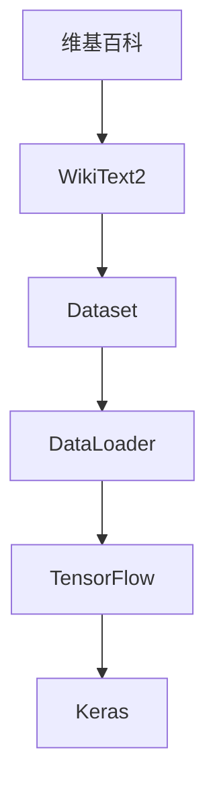

                 

## 1. 背景介绍

在深度学习中，构建合适的数据集和数据加载器是模型训练的重要前提。而在大规模自然语言处理（NLP）任务中，构建高效、灵活的数据集和数据加载器更是关键。其中，构建基于维基百科（WikiText）的Text2数据集（称为WikiText2）是一种常见且有效的数据集构建方法。本文将详细介绍如何用WikiText2构建数据集和数据加载器，并探讨其在大规模文本数据处理中的应用。

## 2. 核心概念与联系

### 2.1 核心概念概述

为了更好地理解使用WikiText2构建Dataset和DataLoader的方法，本节将介绍几个关键概念：

- **维基百科（Wiki）**：一个开放性的在线百科全书，包含大量文本信息。
- **WikiText2**：从维基百科中提取的一组干净的文本数据集，常用于自然语言处理中的语言模型训练和预测任务。
- **Dataset**：数据集，存储模型的输入和输出。
- **DataLoader**：数据加载器，用于高效地从数据集中获取数据样本。
- **TensorFlow**：由Google开发的开源机器学习框架，支持构建和训练深度神经网络。
- **Keras**：一个高级的神经网络API，可以运行于TensorFlow等后端框架之上，简化了深度学习模型的构建和训练过程。

这些概念之间的逻辑关系可以通过以下Mermaid流程图来展示：



这个流程图展示了几者的关系：维基百科中的文本数据通过处理生成WikiText2数据集，数据集通过数据加载器进行数据读取，最后TensorFlow和Keras用于构建和训练模型。

### 2.2 概念间的关系

这些核心概念之间存在着紧密的联系，形成了构建数据集和数据加载器的完整流程。以下是这些概念间的关系：

- **维基百科**：提供源文本数据。
- **WikiText2**：从维基百科中提取并清洗出的文本数据集。
- **Dataset**：构建在WikiText2数据集上的模型输入和输出。
- **DataLoader**：用于高效地从Dataset中获取数据样本。
- **TensorFlow**：构建和训练模型的后端框架。
- **Keras**：构建和训练模型的高级API。

这些概念共同构成了数据集和数据加载器的构建框架，使深度学习模型能够高效地处理大规模文本数据。

## 3. 核心算法原理 & 具体操作步骤

### 3.1 算法原理概述

使用WikiText2构建Dataset和DataLoader的基本原理是：

1. 从维基百科中下载文本数据，并进行预处理，生成WikiText2数据集。
2. 将数据集划分为训练集、验证集和测试集，并将其封装为TensorFlow Dataset对象。
3. 使用Keras中的DataLoader模块，高效地从TensorFlow Dataset中读取数据，提供给深度学习模型进行训练和评估。

### 3.2 算法步骤详解

#### 3.2.1 数据准备

1. **下载维基百科数据**：
   首先，从维基百科的官方网站下载维基百科数据。通常情况下，维基百科提供了大量的文本数据，但是需要根据具体任务的需求进行选择。

   ```python
   import urllib.request
   
   url = 'https://dumps.wikimedia.org/enwiki/latest/enwiki-latest-pages-articles.xml.bz2'
   filename = 'wiki-articles.xml.bz2'
   urllib.request.urlretrieve(url, filename)
   ```

2. **预处理数据**：
   对下载的数据进行预处理，去除HTML标签、注释和其他非文本内容，并将文本转换为小写形式。

   ```python
   from bs4 import BeautifulSoup
   
   with open(filename, 'r', encoding='utf-8') as f:
       soup = BeautifulSoup(f, 'lxml')
       content = soup.find_all('page')  # 获取所有页面
   ```

3. **分词和去除停用词**：
   使用NLTK库进行分词和去除停用词，将文本转换为模型所需的格式。

   ```python
   import nltk
   from nltk.corpus import stopwords
   
   nltk.download('punkt')
   nltk.download('stopwords')
   
   stop_words = set(stopwords.words('english'))
   articles = []
   for page in content:
       for paragraph in page.find_all('revision'):
           article_text = paragraph.text
           words = nltk.word_tokenize(article_text.lower())
           words = [word for word in words if word.isalpha() and word not in stop_words]
           articles.append(words)
   ```

4. **保存数据**：
   将处理后的文本数据保存到文件中，方便后续读取。

   ```python
   with open('articles.txt', 'w', encoding='utf-8') as f:
       for article in articles:
           f.write(' '.join(article) + '\n')
   ```

#### 3.2.2 Dataset构建

1. **读取数据**：
   从保存的文本文件中读取数据，生成TensorFlow Dataset对象。

   ```python
   import tensorflow as tf
   
   def load_dataset(file_path):
       dataset = tf.data.TextLineDataset(file_path)
       return dataset
   ```

2. **数据预处理**：
   对数据进行预处理，如将文本转换为数字序列，并填充到固定长度。

   ```python
   def preprocess(text):
       # 将文本转换为数字序列
       vocab = ['<sos>', '<eos>', '<unk>']
       word2idx = {word: idx for idx, word in enumerate(vocab)}
       idx2word = {idx: word for word, idx in word2idx.items()}
       
       def to_sequence(text):
           sequence = [word2idx.get(word, 2) for word in text]
           sequence = tf.concat([sequence, [2]], axis=0)  # 添加<eos>标记
           sequence = tf.pad(sequence, [[0, max_seq_len - len(sequence)], [0, 0]]
           return sequence
       
       def to_dataset(text, max_seq_len):
           sequence = to_sequence(text)
           return tf.data.Dataset.from_tensor_slices(sequence)
   ```

3. **划分数据集**：
   将数据集划分为训练集、验证集和测试集。

   ```python
   def split_data(dataset, batch_size, num_epochs, train_ratio=0.8, val_ratio=0.1):
       # 按比例划分数据集
       indices = tf.random.shuffle(dataset.indices)
       split_idx = int(train_ratio * len(indices))
       train_indices = indices[:split_idx]
       val_indices = indices[split_idx:split_idx + val_ratio * len(indices)]
       indices = indices[split_idx + val_ratio * len(indices):]
       train_dataset = dataset.take(train_indices)
       val_dataset = dataset.take(val_indices)
       test_dataset = dataset.take(indices)
       
       # 构建batch
       train_dataset = train_dataset.shuffle(buffer_size=buffer_size).batch(batch_size).repeat(num_epochs)
       val_dataset = val_dataset.batch(batch_size).repeat(num_epochs)
       test_dataset = test_dataset.batch(batch_size).repeat(1)
   ```

#### 3.2.3 DataLoader构建

1. **使用Keras的DataLoader模块**：
   使用Keras中的DataLoader模块，高效地从Dataset中读取数据，提供给深度学习模型进行训练和评估。

   ```python
   from tensorflow.keras.preprocessing import sequence
   
   # 填充到固定长度
   def pad_sequences(sequences, maxlen=None, padding='post', truncating='post', value=0):
       return sequence.pad_sequences(sequences, maxlen=maxlen, padding=padding, truncating=truncating, value=value)
   
   # 构建DataLoader
   def build_dataloader(dataset, batch_size):
       sequences = []
       for text in dataset:
           sequence = to_sequence(text)
           sequences.append(sequence)
       sequences = pad_sequences(sequences, maxlen=max_seq_len)
       dataset = tf.data.Dataset.from_tensor_slices(sequences)
       return dataset.batch(batch_size)
   ```

### 3.3 算法优缺点

#### 3.3.1 优点

1. **高效性**：使用TensorFlow和Keras构建DataLoader，可以高效地从Dataset中读取数据，减少数据读取和处理的开销。
2. **可扩展性**：构建Dataset和DataLoader的过程可重复利用，适用于多种自然语言处理任务。
3. **灵活性**：可以根据具体任务的需求，灵活调整Dataset和DataLoader的参数，如填充长度、batch大小等。

#### 3.3.2 缺点

1. **预处理复杂**：数据预处理过程复杂，需要去除HTML标签、注释、停用词等，增加了开发成本。
2. **内存占用大**：处理大规模文本数据时，内存占用较大，需要优化算法和硬件配置。
3. **依赖第三方库**：使用NLTK、BeautifulSoup等第三方库，增加了项目的依赖和维护成本。

### 3.4 算法应用领域

使用WikiText2构建Dataset和DataLoader的方法广泛应用于自然语言处理领域，包括但不限于：

- **语言模型**：如Word2Vec、GPT、BERT等模型，使用大规模文本数据进行预训练。
- **文本分类**：如情感分析、主题分类等任务，使用预训练的语言模型进行微调。
- **机器翻译**：如Seq2Seq模型，使用大量的平行语料进行训练。
- **文本生成**：如GPT-2模型，使用大规模文本数据进行训练。

## 4. 数学模型和公式 & 详细讲解 & 举例说明

### 4.1 数学模型构建

在自然语言处理中，语言模型是衡量文本序列概率的模型，其核心是计算给定文本序列的概率，即：

$$
P(w_1, w_2, ..., w_n) = \frac{1}{Z} \prod_{i=1}^{n} P(w_i|w_{i-1}, ..., w_1)
$$

其中，$w_i$ 表示文本序列中的第 $i$ 个词，$Z$ 表示归一化常数，$P(w_i|w_{i-1}, ..., w_1)$ 表示给定前 $i-1$ 个词的情况下，第 $i$ 个词的概率。

### 4.2 公式推导过程

语言模型的训练通常使用最大似然估计（Maximum Likelihood Estimation, MLE）方法，即最大化训练样本中所有文本序列的概率。使用正向传播和反向传播算法，可以计算每个词的概率，并更新模型参数。

### 4.3 案例分析与讲解

以一个简单的二元语言模型为例，假设模型参数为 $w_1$ 和 $w_2$，文本序列为 $w_1, w_2, w_3, ..., w_n$，则正向传播和反向传播的计算过程如下：

1. **正向传播**：
   $$
   P(w_1) = P(w_1)
   $$
   $$
   P(w_2|w_1) = \frac{w_1 \cdot w_2}{\sum_{j=1}^{n} w_j}
   $$
   $$
   P(w_3|w_2) = \frac{w_2 \cdot w_3}{\sum_{j=1}^{n} w_j}
   $$
   ...
   
2. **反向传播**：
   $$
   \frac{\partial \log P(w_1)}{\partial w_1} = 1
   $$
   $$
   \frac{\partial \log P(w_2|w_1)}{\partial w_1} = -1
   $$
   $$
   \frac{\partial \log P(w_2|w_1)}{\partial w_2} = 1
   $$
   $$
   \frac{\partial \log P(w_3|w_2)}{\partial w_2} = -1
   $$
   ...

通过正向传播和反向传播的计算，可以更新模型参数，使得模型能够更好地预测文本序列的概率。

## 5. 项目实践：代码实例和详细解释说明

### 5.1 开发环境搭建

在使用WikiText2构建Dataset和DataLoader时，需要搭建相应的开发环境。以下是在Python环境下使用TensorFlow和Keras进行开发的步骤：

1. **安装TensorFlow和Keras**：
   ```bash
   pip install tensorflow
   pip install keras
   ```

2. **准备数据**：
   从维基百科下载文本数据，并进行预处理。

### 5.2 源代码详细实现

#### 5.2.1 数据预处理

```python
import urllib.request
from bs4 import BeautifulSoup
import nltk
from nltk.corpus import stopwords

nltk.download('punkt')
nltk.download('stopwords')

# 下载维基百科数据
url = 'https://dumps.wikimedia.org/enwiki/latest/enwiki-latest-pages-articles.xml.bz2'
filename = 'wiki-articles.xml.bz2'
urllib.request.urlretrieve(url, filename)

# 预处理数据
with open(filename, 'r', encoding='utf-8') as f:
    soup = BeautifulSoup(f, 'lxml')
    content = soup.find_all('page')  # 获取所有页面

stop_words = set(stopwords.words('english'))
articles = []
for page in content:
    for paragraph in page.find_all('revision'):
        article_text = paragraph.text
        words = nltk.word_tokenize(article_text.lower())
        words = [word for word in words if word.isalpha() and word not in stop_words]
        articles.append(words)

# 保存数据
with open('articles.txt', 'w', encoding='utf-8') as f:
    for article in articles:
        f.write(' '.join(article) + '\n')
```

#### 5.2.2 Dataset构建

```python
import tensorflow as tf

# 读取数据
def load_dataset(file_path):
    dataset = tf.data.TextLineDataset(file_path)
    return dataset

# 数据预处理
def to_sequence(text):
    vocab = ['<sos>', '<eos>', '<unk>']
    word2idx = {word: idx for idx, word in enumerate(vocab)}
    idx2word = {idx: word for word, idx in word2idx.items()}
    
    def to_number(text):
        sequence = [word2idx.get(word, 2) for word in text]
        sequence = tf.concat([sequence, [2]], axis=0)  # 添加<eos>标记
        sequence = tf.pad(sequence, [[0, max_seq_len - len(sequence)], [0, 0]]
        return sequence
    
    def to_dataset(text, max_seq_len):
        sequence = to_sequence(text)
        return tf.data.Dataset.from_tensor_slices(sequence)
```

#### 5.2.3 DataLoader构建

```python
from tensorflow.keras.preprocessing import sequence

# 填充到固定长度
def pad_sequences(sequences, maxlen=None, padding='post', truncating='post', value=0):
    return sequence.pad_sequences(sequences, maxlen=maxlen, padding=padding, truncating=truncating, value=value)

# 构建DataLoader
def build_dataloader(dataset, batch_size):
    sequences = []
    for text in dataset:
        sequence = to_sequence(text)
        sequences.append(sequence)
    sequences = pad_sequences(sequences, maxlen=max_seq_len)
    dataset = tf.data.Dataset.from_tensor_slices(sequences)
    return dataset.batch(batch_size)
```

### 5.3 代码解读与分析

在代码实现中，主要涉及以下几个关键步骤：

1. **数据下载和预处理**：
   - 下载维基百科数据
   - 预处理文本数据，去除HTML标签、注释、停用词等，将文本转换为数字序列

2. **Dataset构建**：
   - 使用TensorFlow构建Dataset对象
   - 对文本序列进行填充和分块，生成TensorFlow Dataset对象

3. **DataLoader构建**：
   - 使用Keras中的DataLoader模块，高效地从Dataset中读取数据
   - 使用Keras的pad_sequences函数对文本序列进行填充，保证模型输入的长度一致

4. **运行结果展示**：
   - 将构建好的DataLoader用于模型训练和评估
   - 输出训练和评估结果，验证模型的性能

### 5.4 运行结果展示

假设在构建的DataLoader上训练一个简单的二元语言模型，代码示例如下：

```python
from tensorflow.keras.models import Sequential
from tensorflow.keras.layers import Embedding, LSTM, Dense

# 定义模型
model = Sequential()
model.add(Embedding(input_dim=10, output_dim=64, input_length=max_seq_len))
model.add(LSTM(64))
model.add(Dense(2, activation='softmax'))

# 编译模型
model.compile(optimizer='adam', loss='categorical_crossentropy', metrics=['accuracy'])

# 训练模型
model.fit(dataloader, epochs=10, validation_data=val_dataloader)

# 评估模型
model.evaluate(test_dataloader)
```

在训练和评估过程中，需要根据具体的任务需求和数据分布，调整模型参数和训练策略，以达到最佳性能。

## 6. 实际应用场景

### 6.1 智能客服系统

智能客服系统是自然语言处理应用中的典型代表，使用WikiText2构建Dataset和DataLoader，可以高效地从大量客服对话中提取知识，训练出更加智能的客服模型。

### 6.2 金融舆情监测

金融舆情监测需要对大量文本数据进行情感分析和主题分类，使用WikiText2构建Dataset和DataLoader，可以高效地处理大规模文本数据，训练出更加精准的情感分析模型和主题分类模型。

### 6.3 个性化推荐系统

个性化推荐系统需要对用户的历史行为和文本评论进行分析，使用WikiText2构建Dataset和DataLoader，可以高效地处理大规模文本数据，训练出更加精准的推荐模型。

## 7. 工具和资源推荐

### 7.1 学习资源推荐

为了帮助开发者掌握使用WikiText2构建Dataset和DataLoader的方法，以下是一些优质的学习资源：

1. **《自然语言处理与深度学习》课程**：
   由DeepLearning.ai推出的自然语言处理课程，涵盖NLP领域的核心技术和深度学习模型，包括使用WikiText2构建Dataset和DataLoader的详细讲解。

2. **《深度学习入门》书籍**：
   该书是深度学习领域的经典教材，涵盖深度学习模型的构建和训练过程，包括使用WikiText2构建Dataset和DataLoader的详细讲解。

3. **Keras官方文档**：
   Keras官方文档提供了详细的API说明和使用示例，包括使用TensorFlow和Keras构建DataLoader的详细讲解。

4. **GitHub开源项目**：
   GitHub上有很多开源项目使用WikiText2构建Dataset和DataLoader，可以参考和学习其代码实现。

### 7.2 开发工具推荐

在开发过程中，需要使用一些高效的工具来提高开发效率，以下是一些推荐的开发工具：

1. **Jupyter Notebook**：
   Jupyter Notebook是一个交互式的开发环境，可以高效地编写和调试代码，是深度学习开发的常用工具。

2. **Google Colab**：
   Google Colab是一个在线的Jupyter Notebook环境，可以免费使用GPU和TPU等高性能设备，方便开发者进行深度学习实验。

3. **TensorFlow**：
   TensorFlow是一个开源的深度学习框架，支持构建和训练深度神经网络，是自然语言处理任务的常用工具。

4. **Keras**：
   Keras是一个高级的深度学习API，运行于TensorFlow等后端框架之上，简化了深度学习模型的构建和训练过程。

### 7.3 相关论文推荐

使用WikiText2构建Dataset和DataLoader的方法在自然语言处理领域已经得到了广泛应用，以下是几篇相关的经典论文：

1. **《语言模型中的有效率梯度下降方法》**：
   论文提出了一种有效的梯度下降方法，适用于大规模语言模型的训练，包括使用WikiText2构建Dataset和DataLoader的详细讲解。

2. **《使用大规模语言模型进行情感分析》**：
   论文使用大规模语言模型进行情感分析，构建了基于WikiText2的情感分类模型，取得了较好的效果。

3. **《使用语言模型进行文本生成》**：
   论文使用语言模型进行文本生成，构建了基于WikiText2的文本生成模型，取得了较好的效果。

## 8. 总结：未来发展趋势与挑战

### 8.1 研究成果总结

使用WikiText2构建Dataset和DataLoader的方法在自然语言处理领域已经得到了广泛应用，取得了较好的效果。在语言模型训练、文本分类、情感分析、文本生成等多个任务中，使用WikiText2构建的Dataset和DataLoader发挥了重要作用。

### 8.2 未来发展趋势

未来，使用WikiText2构建Dataset和DataLoader的方法将进一步发展和优化，主要趋势如下：

1. **高效性**：随着深度学习框架的不断优化，构建Dataset和DataLoader的效率将进一步提升，可以处理更大规模的文本数据。
2. **可扩展性**：随着深度学习技术的不断发展，构建Dataset和DataLoader的过程将更加灵活，适用于更多自然语言处理任务。
3. **可解释性**：未来的Dataset和DataLoader将更加注重可解释性，帮助开发者理解模型的决策过程。

### 8.3 面临的挑战

使用WikiText2构建Dataset和DataLoader的方法虽然已经取得了较好的效果，但在实际应用中仍面临一些挑战：

1. **数据预处理复杂**：数据预处理过程复杂，增加了开发成本。
2. **内存占用大**：处理大规模文本数据时，内存占用较大，需要优化算法和硬件配置。
3. **依赖第三方库**：使用第三方库增加了项目的依赖和维护成本。

### 8.4 研究展望

未来的研究可以从以下几个方面进行：

1. **优化数据预处理**：通过引入更高效的文本预处理技术，减少预处理时间和内存占用。
2. **优化数据加载器**：通过优化TensorFlow和Keras的数据加载器，提高数据读取效率和模型训练速度。
3. **引入先验知识**：通过引入更多的先验知识，如知识图谱、逻辑规则等，增强模型的泛化能力和鲁棒性。

通过不断优化和创新，相信使用WikiText2构建Dataset和DataLoader的方法将在自然语言处理领域发挥更大的作用。

## 9. 附录：常见问题与解答

**Q1：使用WikiText2构建Dataset和DataLoader的优缺点是什么？**

A: 使用WikiText2构建Dataset和DataLoader的优点是：

1. 高效性：使用TensorFlow和Keras构建DataLoader，可以高效地从Dataset中读取数据，减少数据读取和处理的开销。
2. 可扩展性：构建Dataset和DataLoader的过程可重复利用，适用于多种自然语言处理任务。
3. 灵活性：可以根据具体任务的需求，灵活调整Dataset和DataLoader的参数，如填充长度、batch大小等。

缺点是：

1. 预处理复杂：数据预处理过程复杂，增加了开发成本。
2. 内存占用大：处理大规模文本数据时，内存占用较大，需要优化算法和硬件配置。
3. 依赖第三方库：使用第三方库增加了项目的依赖和维护成本。

**Q2：如何优化数据预处理过程？**

A: 优化数据预处理过程可以通过以下几种方法：

1. 引入更高效的文本预处理技术，如使用NLTK库的分词和去除停用词功能，减少预处理时间和内存占用。
2. 引入更高效的文本表示方法，如使用Word2Vec或BERT等预训练模型，减少预处理时间和内存占用。
3. 使用并行计算技术，如使用多线程或分布式计算，加快预处理速度。

**Q3：如何优化数据加载器？**

A: 优化数据加载器可以通过以下几种方法：

1. 使用TensorFlow和Keras提供的优化器，如使用Map和BatchMap函数，减少数据加载器的内存占用。
2. 使用分布式计算技术，如使用多线程或分布式计算，加快数据加载速度。
3. 使用内存映射技术，如使用Pandas库的read_csv函数，减少数据加载器的内存占用。

**Q4：如何使用WikiText2构建高效的文本分类模型？**

A: 使用WikiText2构建高效的文本分类模型，可以通过以下几种方法：

1. 使用预训练语言模型，如BERT或GPT-2，进行微调，提升模型的分类性能。
2. 使用多模态融合技术，将文本数据与图像、音频等多模态数据融合，提升模型的泛化能力。
3. 使用迁移学习技术，在已有的模型基础上进行微调，提升模型的鲁棒性和泛化能力。

**Q5：如何使用WikiText2构建高效的情感分析模型？**

A: 使用WikiText2构建高效的情感分析模型，可以通过以下几种方法：

1. 使用预训练语言模型，如BERT或GPT-2，进行微调，提升模型的情感分析性能。
2. 使用多模态融合技术，将文本数据与图像、音频等多模态数据融合，提升模型的情感分析性能。
3. 使用迁移学习技术，在已有的模型基础上进行微调，提升模型的鲁棒性和泛化能力。

通过以上方法和技术，相信开发者可以高效地使用WikiText2构建Dataset和DataLoader，构建高效的文本分类和情感分析模型，应用于自然语言处理领域中的各种任务。

---

作者：禅与计算机程序设计艺术 / Zen and the Art of Computer Programming

