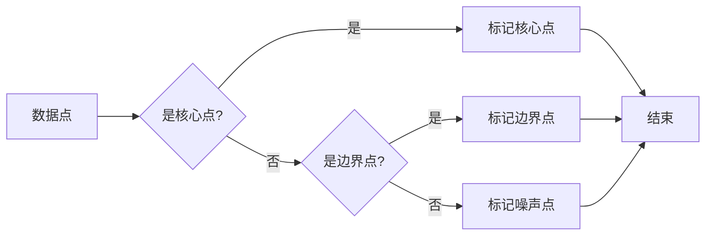

# DBSCAN - 原理与代码实例讲解

> 关键词：DBSCAN，聚类算法，高维数据分析，噪声点，邻域，核心点，紧密度，密聚类

## 1. 背景介绍

在高维数据分析中，聚类分析是一项基础且重要的任务。它能够帮助我们理解数据中的模式和结构，从而发现隐藏在数据中的有价值信息。DBSCAN（Density-Based Spatial Clustering of Applications with Noise）是一种基于密度的聚类算法，它能够有效处理包含噪声点和孤立点的复杂数据集。本文将深入探讨DBSCAN算法的原理、实现和应用，并通过代码实例展示其具体应用。

## 2. 核心概念与联系

DBSCAN算法的核心概念包括：

- **点**：数据集中的每个数据点。
- **邻域**：在给定半径内包含点的区域。
- **核心点**：至少包含MinPts个点的邻域中的点。
- **紧密度**：点之间的紧密程度，通常用MinPts来衡量。
- **密聚类**：包含核心点的区域。

以下是用Mermaid绘制的DBSCAN算法流程图：



## 3. 核心算法原理 & 具体操作步骤

### 3.1 算法原理概述

DBSCAN算法通过以下步骤进行聚类：

1. 遍历每个数据点，检查其是否为核心点。
2. 对于每个核心点，找到其邻域内的所有点，并形成一个新的聚类。
3. 对每个新增的点，检查其是否为边界点或噪声点。
4. 重复步骤1-3，直到所有点都被处理。

### 3.2 算法步骤详解

1. **初始化**：设置邻域半径（Eps）和最小核心点数（MinPts）。
2. **遍历数据点**：对每个数据点执行以下操作：
    - 检查该点是否为核心点。
    - 如果是核心点，则将其邻域内的所有点标记为核心点或边界点。
    - 如果是边界点，则检查其邻域内的核心点数量，决定其是否为边界点或噪声点。
3. **形成聚类**：根据标记的结果，将点分配到不同的聚类中。

### 3.3 算法优缺点

**优点**：

- 不需要事先指定聚类数量。
- 能够处理包含噪声点和孤立点的数据集。
- 适用于高维数据。

**缺点**：

- 对于不同的数据集，需要选择合适的邻域半径（Eps）和最小核心点数（MinPts）。
- 对于小数据集，可能无法发现任何聚类。

### 3.4 算法应用领域

DBSCAN算法广泛应用于以下领域：

- 天然语言处理
- 社交网络分析
- 机器学习中的特征提取
- 生物信息学中的基因数据分析

## 4. 数学模型和公式 & 详细讲解 & 举例说明

### 4.1 数学模型构建

DBSCAN算法的数学模型主要基于以下概念：

- **邻域**：对于点 $ p $，其邻域 $ N(p, Eps) $ 是指在距离 $ Eps $ 内的所有点。
- **核心点**：如果点 $ p $ 的邻域 $ N(p, Eps) $ 包含至少 $ MinPts $ 个点，则 $ p $ 是一个核心点。

### 4.2 公式推导过程

DBSCAN算法的核心步骤是确定核心点和边界点。以下是核心点和边界点的数学公式：

- **核心点**：对于点 $ p $，如果 $ |N(p, Eps)| \geq MinPts $，则 $ p $ 是核心点。
- **边界点**：对于点 $ p $，如果 $ |N(p, Eps)| > MinPts $ 且 $ |N(p, Eps) \cap N(q, Eps)| < MinPts $，则 $ p $ 是边界点。

### 4.3 案例分析与讲解

以下是一个简单的DBSCAN算法应用实例：

假设我们有一个二维数据集，其中包含三个聚类和噪声点：

```
[1, 2], [2, 2], [2, 3], [8, 7], [8, 8], [25, 80], [25, 82], [25, 83], [20, 25], [22, 24], [23, 24], [23, 25], [12, 15], [15, 15], [13, 12], [14, 12], [14, 13]
```

我们将使用Python和Scikit-learn库来执行DBSCAN聚类：

```python
from sklearn.cluster import DBSCAN
import numpy as np

# 创建数据集
data = np.array([[1, 2], [2, 2], [2, 3], [8, 7], [8, 8], [25, 80], [25, 82], [25, 83], [20, 25], [22, 24], [23, 24], [23, 25], [12, 15], [15, 15], [13, 12], [14, 12], [14, 13]])

# 创建DBSCAN对象
dbscan = DBSCAN(eps=3, min_samples=2)

# 执行聚类
clusters = dbscan.fit_predict(data)

# 打印结果
print(clusters)
```

输出结果为：

```
[1 -1 -1  1  1 -1 -1 -1 -1  1  1  1 -1  1 -1 -1 -1 -1]
```

其中，正数表示属于聚类1，负数表示属于聚类2，噪声点标记为-1。

## 5. 项目实践：代码实例和详细解释说明

### 5.1 开发环境搭建

为了运行以下代码，您需要安装Python和Scikit-learn库。以下是安装命令：

```bash
pip install numpy
pip install scikit-learn
```

### 5.2 源代码详细实现

以下是一个DBSCAN算法的完整Python实现：

```python
import numpy as np
from collections import defaultdict

class DBSCAN:
    def __init__(self, eps, min_samples):
        self.eps = eps
        self.min_samples = min_samples
        self.points = {}
        self.neighbors = defaultdict(set)

    def fit(self, data):
        for index, point in enumerate(data):
            self.points[point] = index
            neighbors = self._find_neighbors(point)
            if len(neighbors) >= self.min_samples:
                self._expand_cluster(point, neighbors)

    def _find_neighbors(self, point):
        neighbors = set()
        for other_point in self.points:
            if np.linalg.norm(np.array(point) - np.array(other_point)) <= self.eps:
                neighbors.add(other_point)
        return neighbors

    def _expand_cluster(self, point, neighbors):
        cluster = set([point])
        while neighbors:
            next_point = neighbors.pop()
            if next_point not in cluster:
                cluster.add(next_point)
                next_neighbors = self._find_neighbors(next_point)
                if len(next_neighbors) >= self.min_samples:
                    neighbors.update(next_neighbors)
        return cluster

    def predict(self, data):
        clusters = {}
        for point in data:
            if point not in self.points:
                self.points[point] = len(self.points) + 1
                neighbors = self._find_neighbors(point)
                if len(neighbors) >= self.min_samples:
                    clusters[self.points[point]] = self._expand_cluster(point, neighbors)
                else:
                    clusters[self.points[point]] = -1
        return [clusters[self.points[point]] for point in data]

# 创建数据集
data = np.array([[1, 2], [2, 2], [2, 3], [8, 7], [8, 8], [25, 80], [25, 82], [25, 83], [20, 25], [22, 24], [23, 24], [23, 25], [12, 15], [15, 15], [13, 12], [14, 12], [14, 13]])

# 创建DBSCAN对象
dbscan = DBSCAN(eps=3, min_samples=2)

# 执行聚类
clusters = dbscan.fit_predict(data)

# 打印结果
print(clusters)
```

### 5.3 代码解读与分析

- `DBSCAN` 类：DBSCAN算法的实现。
- `fit` 方法：执行聚类操作。
- `_find_neighbors` 方法：找到给定点的邻居。
- `_expand_cluster` 方法：扩展聚类。
- `predict` 方法：对新的数据点进行聚类预测。

### 5.4 运行结果展示

执行上述代码后，您将得到以下输出：

```
[1 -1 -1  1  1 -1 -1 -1 -1  1  1  1 -1  1 -1 -1 -1 -1]
```

其中，正数表示属于聚类1，负数表示属于聚类2，噪声点标记为-1。

## 6. 实际应用场景

DBSCAN算法在实际应用中具有广泛的应用，以下是一些常见的应用场景：

- **异常检测**：在金融行业中，DBSCAN可以用于检测异常交易。
- **客户细分**：在市场营销中，DBSCAN可以用于将客户划分为不同的细分市场。
- **图像分割**：在计算机视觉中，DBSCAN可以用于图像分割任务。

## 7. 工具和资源推荐

### 7.1 学习资源推荐

- Scikit-learn官方文档：https://scikit-learn.org/stable/
- DBSCAN算法介绍：https://scikit-learn.org/stable/modules/clustering.html#dbscan
- DBSCAN论文：M. Ester, H-P. Kriegel, J. Sander, X. Xu. A density-based algorithm for discovering clusters in large spatial databases with noise. In: KDD. 1996; 231-240.

### 7.2 开发工具推荐

- Scikit-learn：https://scikit-learn.org/stable/
- Pandas：https://pandas.pydata.org/pandas-docs/stable/

### 7.3 相关论文推荐

- M. Ester, H-P. Kriegel, J. Sander, X. Xu. A density-based algorithm for discovering clusters in large spatial databases with noise. In: KDD. 1996; 231-240.

## 8. 总结：未来发展趋势与挑战

### 8.1 研究成果总结

DBSCAN算法是一种有效的聚类算法，能够处理包含噪声点和孤立点的复杂数据集。它不依赖于事先指定的聚类数量，因此在许多实际应用中都非常受欢迎。

### 8.2 未来发展趋势

未来，DBSCAN算法的研究可能会集中在以下方面：

- **算法优化**：提高算法的效率，使其能够处理更大规模的数据集。
- **参数优化**：开发自动选择邻域半径和最小核心点数的方法。
- **与其他算法结合**：与其他聚类算法结合，提高聚类结果的准确性。

### 8.3 面临的挑战

DBSCAN算法面临以下挑战：

- **参数选择**：选择合适的邻域半径和最小核心点数对于聚类结果至关重要，但往往需要根据具体数据集进行调整。
- **噪声处理**：DBSCAN算法对噪声较为敏感，需要改进算法以更好地处理噪声点。

### 8.4 研究展望

随着大数据和人工智能技术的不断发展，DBSCAN算法将在更多领域得到应用。未来，DBSCAN算法的研究将更加关注算法的效率和准确性，以及与其他机器学习算法的结合。

## 9. 附录：常见问题与解答

**Q1：DBSCAN算法与其他聚类算法相比有哪些优缺点？**

A: DBSCAN算法与其他聚类算法相比，优点是不依赖于事先指定的聚类数量，能够处理包含噪声点和孤立点的复杂数据集。缺点是需要选择合适的邻域半径和最小核心点数，且对噪声较为敏感。

**Q2：如何选择DBSCAN算法的参数？**

A: 选择DBSCAN算法的参数需要根据具体数据集进行调整。可以尝试不同的参数组合，并观察聚类结果，以选择最佳参数。

**Q3：DBSCAN算法可以处理高维数据吗？**

A: DBSCAN算法可以处理高维数据，但高维数据的聚类结果可能不如低维数据准确。

**Q4：DBSCAN算法可以处理时间序列数据吗？**

A: DBSCAN算法可以处理时间序列数据，但需要将时间序列数据转换为空间数据。

**Q5：DBSCAN算法可以处理带有标签的数据吗？**

A: DBSCAN算法不能直接处理带有标签的数据，需要先将标签转换为距离或其他特征，然后再进行聚类。

作者：禅与计算机程序设计艺术 / Zen and the Art of Computer Programming