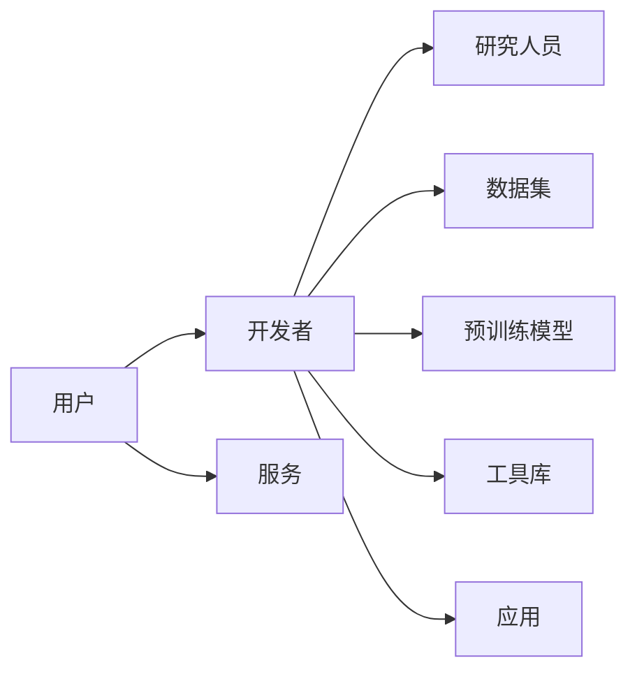

# Hugging Face 是什么?

> 关键词：Hugging Face, 自然语言处理, 机器学习, 开源库, 生态系统, 人工智能, 代码复用, 社区

## 1. 背景介绍

在人工智能领域，尤其是自然语言处理（NLP）和机器学习（ML）领域，Hugging Face 已经成为了不可或缺的一部分。它不仅仅是一个开源库，更是一个庞大的社区和生态系统，为研究人员和开发者提供了丰富的资源和工具，帮助他们更高效地构建和部署AI模型。

### 1.1 问题的由来

随着深度学习在NLP领域的兴起，研究人员和开发者面临着诸多挑战。首先，他们需要处理大量的数据，这些数据往往需要清洗、标注和预处理。其次，他们需要选择合适的模型架构和训练方法，这需要对深度学习有深入的了解。最后，他们需要将模型部署到实际的应用中，这通常需要复杂的后端支持和基础设施。

Hugging Face 的出现，正是为了解决这些挑战。

### 1.2 研究现状

Hugging Face 提供了一系列的开源库和工具，旨在简化NLP和ML的开发流程。它的核心库是 `transformers`，这是一个包含大量预训练模型和实用工具的库，可以帮助用户轻松地使用和扩展这些模型。

### 1.3 研究意义

Hugging Face 的意义在于：

- **降低门槛**：让那些没有深度学习背景的开发者也能轻松地使用NLP和ML技术。
- **提高效率**：通过提供预训练模型和工具，减少从零开始的时间，提高开发效率。
- **促进创新**：通过构建一个开放的生态系统，鼓励更多创新和合作。

### 1.4 本文结构

本文将分为以下几个部分：

- 核心概念与联系
- 核心算法原理 & 具体操作步骤
- 数学模型和公式 & 详细讲解 & 举例说明
- 项目实践：代码实例和详细解释说明
- 实际应用场景
- 工具和资源推荐
- 总结：未来发展趋势与挑战
- 附录：常见问题与解答

## 2. 核心概念与联系

### 2.1 核心概念

- **自然语言处理（NLP）**：研究计算机如何理解、解释和生成人类语言的技术。
- **机器学习（ML）**：让计算机通过数据学习并做出决策或预测的技术。
- **预训练模型**：在大规模数据集上预先训练好的模型，可以用于下游任务。
- **生态系统**：由多个相互关联的组件组成的系统，共同实现一个目标。

### 2.2 架构的 Mermaid 流程图



在这个流程图中，用户通过开发者或研究人员使用数据集、预训练模型、工具库来创建应用，最终提供服务给用户。

## 3. 核心算法原理 & 具体操作步骤

### 3.1 算法原理概述

Hugging Face 的核心是 `transformers` 库，它提供了一系列的预训练模型和实用工具。这些模型基于Transformer架构，这是一种自注意力机制，可以有效地处理序列数据。

### 3.2 算法步骤详解

1. **选择预训练模型**：从Hugging Face的模型库中选择合适的预训练模型。
2. **加载模型**：使用`transformers`库加载选定的模型。
3. **预处理数据**：对输入数据进行必要的预处理，例如分词、编码等。
4. **训练模型**：如果有必要，可以在自定义数据集上进一步训练模型。
5. **评估模型**：使用验证集评估模型的性能。
6. **部署模型**：将模型部署到服务或应用中。

### 3.3 算法优缺点

#### 优点：

- **易用性**：简单易用的API，降低了使用深度学习的门槛。
- **性能**：基于Transformer的模型通常在NLP任务上表现优异。
- **社区支持**：拥有庞大的社区，提供丰富的文档和示例。

#### 缺点：

- **依赖性**：需要安装`transformers`库和其他依赖。
- **资源消耗**：预训练模型通常需要大量的计算资源。
- **模型选择**：在众多模型中选择合适的模型可能比较困难。

### 3.4 算法应用领域

Hugging Face 的模型和工具可以应用于各种NLP任务，包括：

- 文本分类
- 情感分析
- 命名实体识别
- 机器翻译
- 问答系统
- 文本摘要

## 4. 数学模型和公式 & 详细讲解 & 举例说明

### 4.1 数学模型构建

Hugging Face 中的模型通常基于Transformer架构，这是一种基于自注意力机制的深度神经网络。以下是一个简化的Transformer模型的数学公式：

$$
\text{Attention}(Q, K, V) = \frac{softmax(\frac{QK^T}{\sqrt{d_k}})V}
$$

其中，$Q$、$K$ 和 $V$ 分别是查询、键和值向量，$d_k$ 是键向量的维度，$softmax$ 是Softmax函数。

### 4.2 公式推导过程

Transformer模型的推导过程较为复杂，涉及矩阵运算、注意力机制、位置编码等多个方面。这里不再详细展开。

### 4.3 案例分析与讲解

以BERT模型为例，它是一种基于Transformer的预训练模型，主要用于NLP任务。BERT通过两个预训练任务——Masked Language Model (MLM) 和 Next Sentence Prediction (NSP)——来学习语言知识。

- **MLM**：随机掩盖输入文本中的部分单词，模型需要预测这些单词的正确形式。
- **NSP**：给定两个句子，模型需要预测它们是否是连续的。

通过这两个任务，BERT学习到了丰富的语言表示，可以用于各种NLP任务。

## 5. 项目实践：代码实例和详细解释说明

### 5.1 开发环境搭建

要使用Hugging Face，你需要安装以下依赖：

- Python 3.6+
- PyTorch 1.7+
- Transformers库

### 5.2 源代码详细实现

以下是一个使用Hugging Face的`transformers`库进行文本分类的简单示例：

```python
from transformers import BertTokenizer, BertForSequenceClassification, Trainer, TrainingArguments

# 加载预训练模型和分词器
tokenizer = BertTokenizer.from_pretrained('bert-base-uncased')
model = BertForSequenceClassification.from_pretrained('bert-base-uncased')

# 预处理数据
inputs = tokenizer("Hello, my dog is cute", return_tensors="pt")

# 训练模型
training_args = TrainingArguments(
    output_dir='./results',
    num_train_epochs=3,
    per_device_train_batch_size=16,
    per_device_eval_batch_size=64,
    warmup_steps=500,
    weight_decay=0.01,
    logging_dir='./logs',
)

trainer = Trainer(
    model=model,
    args=training_args,
    train_dataset=train_dataset,
    eval_dataset=val_dataset
)

trainer.train()
```

### 5.3 代码解读与分析

这段代码首先加载了BERT模型和分词器，然后对输入文本进行预处理，最后使用Trainer类进行模型的训练。

### 5.4 运行结果展示

运行上述代码后，模型将在训练集上进行训练，并在验证集上进行评估。训练结束后，你可以在`./results`目录中找到模型的权重和日志文件。

## 6. 实际应用场景

Hugging Face 的模型和工具可以应用于各种实际场景，例如：

- **智能客服**：使用NLP技术处理客户查询，提供自动化的客户服务。
- **舆情分析**：分析社交媒体上的用户评论，了解公众对特定事件的看法。
- **机器翻译**：将文本从一种语言翻译成另一种语言。
- **内容审核**：自动识别和过滤不适宜的内容。

## 7. 工具和资源推荐

### 7.1 学习资源推荐

- Hugging Face官网：https://huggingface.co/
- Transformers库文档：https://huggingface.co/transformers/
- 自然语言处理教程：https://nlp.stanford.edu/pipe/tutorials/dependencies/
- 机器学习教程：https://www.coursera.org/learn/machine-learning

### 7.2 开发工具推荐

- PyTorch：https://pytorch.org/
- TensorFlow：https://www.tensorflow.org/
- Jupyter Notebook：https://jupyter.org/

### 7.3 相关论文推荐

- "Attention is All You Need"：https://arxiv.org/abs/1706.03762
- "BERT: Pre-training of Deep Bidirectional Transformers for Language Understanding"：https://arxiv.org/abs/1810.04805
- "Generative Language Models"：https://arxiv.org/abs/1901.02793

## 8. 总结：未来发展趋势与挑战

### 8.1 研究成果总结

Hugging Face 为NLP和ML领域提供了一个强大的生态系统，帮助研究人员和开发者更高效地构建和部署AI模型。

### 8.2 未来发展趋势

- 更多的预训练模型和工具
- 更好的模型可解释性
- 更强的模型泛化能力
- 更广泛的领域应用

### 8.3 面临的挑战

- 模型可解释性问题
- 模型鲁棒性问题
- 数据标注成本问题
- 模型安全性和隐私问题

### 8.4 研究展望

Hugging Face 将继续推动NLP和ML领域的发展，为构建更加智能和高效的人工智能系统做出贡献。

## 9. 附录：常见问题与解答

**Q1：Hugging Face 是什么？**

A1：Hugging Face 是一个开源库和社区，提供了丰富的NLP和ML资源。

**Q2：我需要安装哪些依赖才能使用Hugging Face？**

A2：你需要安装Python 3.6+、PyTorch 1.7+ 和 Transformers库。

**Q3：Hugging Face 中的模型有哪些？**

A3：Hugging Face 提供了大量的预训练模型，包括BERT、GPT、RoBERTa等。

**Q4：如何使用Hugging Face 进行文本分类？**

A4：你可以使用Hugging Face 的 `transformers` 库中的 `BertForSequenceClassification` 模型进行文本分类。

**Q5：Hugging Face 的模型是否开源？**

A5：是的，Hugging Face 的模型和代码都是开源的。

---

作者：禅与计算机程序设计艺术 / Zen and the Art of Computer Programming