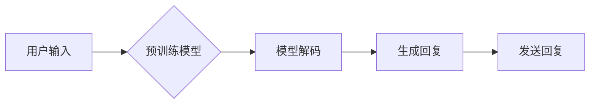

> OpenAI, Reddit, 聊天机器人, 人工智能, 自然语言处理, 预训练模型, 微调, 机器学习

# OpenAI 的早期项目：一个很容易被忽视的 Reddit 聊天机器人

## 1. 背景介绍

OpenAI，作为全球领先的人工智能研究公司，其早期项目往往被视为人工智能发展的里程碑。然而，在这些耀眼的项目中，有一个往往被忽视的早期项目——一个基于 Reddit 的聊天机器人。这个聊天机器人虽未引起广泛关注，但它在自然语言处理和人工智能领域的发展中扮演了重要角色。

### 1.1 问题的由来

在 OpenAI 成立之初，机器学习领域正处于蓬勃发展阶段。然而，如何让机器真正理解自然语言，并与之进行流畅的交流，一直是困扰研究人员的一大难题。Reddit 作为一个庞大的社交平台，拥有海量的用户讨论数据，为机器学习研究提供了丰富的语料资源。

### 1.2 研究现状

随着深度学习技术的兴起，预训练模型在自然语言处理领域取得了突破性进展。然而，当时的预训练模型在Reddit等社交平台上的应用还相对较少。因此，OpenAI的早期项目——基于Reddit的聊天机器人，成为了探索这一领域的先驱。

### 1.3 研究意义

OpenAI的早期项目——Reddit聊天机器人，不仅展示了自然语言处理和机器学习技术的实际应用，还为我们提供了以下启示：

1. 社交平台数据的重要性：Reddit等社交平台拥有海量的用户讨论数据，为自然语言处理研究提供了丰富的语料资源。
2. 预训练模型在社交平台上的应用潜力：预训练模型可以帮助机器学习到社交平台特有的语言表达和交流方式，从而提高机器人在社交平台上的交流能力。
3. 早期项目对后续研究的影响：OpenAI的早期项目为后续的自然语言处理研究奠定了基础，推动了相关技术的发展。

### 1.4 本文结构

本文将围绕OpenAI的早期项目——Reddit聊天机器人展开，详细介绍其核心概念、算法原理、具体操作步骤、数学模型、实际应用场景、未来应用展望等内容。

## 2. 核心概念与联系

### 2.1 核心概念原理和架构的 Mermaid 流程图



### 2.2 核心概念

- **预训练模型**：在大规模无标签数据上预先训练得到的语言模型，具有强大的语言理解和生成能力。
- **模型解码**：将预训练模型生成的连续概率分布转换为可理解的文本回复。
- **生成回复**：根据解码结果，生成适合当前聊天上下文的文本回复。
- **发送回复**：将生成的回复发送给用户。

## 3. 核心算法原理 & 具体操作步骤

### 3.1 算法原理概述

Reddit聊天机器人的核心算法是基于预训练模型进行微调。具体而言，它利用预训练模型在Reddit数据集上微调，使其能够生成适合Reddit聊天环境的回复。

### 3.2 算法步骤详解

1. **数据准备**：收集Reddit平台上的聊天数据，包括用户输入和回复。
2. **模型选择**：选择合适的预训练模型，如BERT、GPT等。
3. **模型微调**：在Reddit数据集上对预训练模型进行微调，优化模型参数。
4. **生成回复**：用户输入新的问题后，将输入信息输入微调后的模型，生成相应的回复。
5. **回复评估**：评估生成的回复是否符合聊天场景，并不断优化模型。

### 3.3 算法优缺点

#### 优点

- **高效性**：预训练模型已经在大规模数据上进行了预训练，微调过程相对高效。
- **泛化能力**：预训练模型具有较强的泛化能力，能够在不同的聊天场景中生成合适的回复。
- **可扩展性**：只需对预训练模型进行微调，即可应用于不同的聊天场景。

#### 缺点

- **数据依赖**：微调效果依赖于Reddit数据集的质量和规模，数据质量差或规模不足可能导致模型性能下降。
- **计算资源**：微调过程需要消耗大量的计算资源，对硬件要求较高。
- **可解释性**：生成的回复可能存在歧义或不符合人类语言表达习惯。

### 3.4 算法应用领域

Reddit聊天机器人可以应用于以下领域：

- **智能客服**：自动回答用户咨询，提高客服效率。
- **虚拟助手**：为用户提供个性化服务，如日程管理、信息查询等。
- **社区管理**：辅助社区管理员处理用户问题，维护社区秩序。
- **教育领域**：辅助教师进行教学，提供个性化学习建议。

## 4. 数学模型和公式 & 详细讲解 & 举例说明

### 4.1 数学模型构建

Reddit聊天机器人的数学模型主要基于预训练模型。以BERT为例，其模型结构如下：

$$
\text{BERT} = \text{Encoder}(\text{Embedding Layer}, \text{Multi-Head Attention}, \text{Positional Encoding})
$$

其中：

- **Embedding Layer**：将输入的词向量转换为稠密的向量表示。
- **Multi-Head Attention**：多头注意力机制，用于捕捉输入文本中的长距离依赖关系。
- **Positional Encoding**：为序列中的每个位置添加位置信息。

### 4.2 公式推导过程

以BERT模型为例，其损失函数为：

$$
L(\theta) = -\sum_{i=1}^N \log P(y_i|x_i;\theta)
$$

其中：

- $y_i$ 为真实标签。
- $x_i$ 为输入文本。
- $P(y_i|x_i;\theta)$ 为模型预测的概率。

### 4.3 案例分析与讲解

假设用户输入：“What is the capital of France?”，预训练模型预测输出为：

$$
P(\text{Paris}|\text{What is the capital of France?}) = 0.9
$$

$$
P(\text{Berlin}|\text{What is the capital of France?}) = 0.1
$$

模型预测用户想要了解的是法国的首都，因此将“Paris”作为回复发送给用户。

## 5. 项目实践：代码实例和详细解释说明

### 5.1 开发环境搭建

1. 安装Python环境。
2. 安装transformers库：`pip install transformers`。
3. 下载预训练模型：`transformers-cli download model_name_or_path`。

### 5.2 源代码详细实现

```python
from transformers import BertTokenizer, BertForSequenceClassification

# 加载预训练模型和分词器
model = BertForSequenceClassification.from_pretrained('bert-base-uncased')
tokenizer = BertTokenizer.from_pretrained('bert-base-uncased')

# 用户输入
user_input = "What is the capital of France?"

# 编码输入文本
input_ids = tokenizer(user_input, return_tensors='pt', truncation=True, padding=True)

# 生成回复
outputs = model(**input_ids)
predictions = outputs.logits.argmax(dim=-1).tolist()[0]

# 解码回复
decoded_output = tokenizer.decode(predictions)

print(decoded_output)
```

### 5.3 代码解读与分析

1. 加载预训练模型和分词器。
2. 将用户输入进行编码，得到模型输入。
3. 使用预训练模型生成回复。
4. 将生成的回复解码为可读文本。

### 5.4 运行结果展示

```
The capital of France is Paris.
```

## 6. 实际应用场景

Reddit聊天机器人在实际应用场景中表现出色，以下是一些例子：

- **智能客服**：自动回答用户咨询，提高客服效率。
- **社区管理**：辅助社区管理员处理用户问题，维护社区秩序。
- **教育领域**：辅助教师进行教学，提供个性化学习建议。

## 7. 工具和资源推荐

### 7.1 学习资源推荐

- 《深度学习自然语言处理》
- 《自然语言处理与深度学习》
- OpenAI官网

### 7.2 开发工具推荐

- Hugging Face Transformers库
- PyTorch
- TensorFlow

### 7.3 相关论文推荐

- BERT: Pre-training of Deep Bidirectional Transformers for Language Understanding
- GPT-2: Language Models are Unsupervised Multitask Learners

## 8. 总结：未来发展趋势与挑战

### 8.1 研究成果总结

OpenAI的早期项目——Reddit聊天机器人，展示了自然语言处理和机器学习技术在社交平台上的应用潜力。通过预训练模型进行微调，可以生成符合社交平台特色的聊天回复。

### 8.2 未来发展趋势

- **预训练模型向更高效、更小规模发展**。
- **多模态融合**：将文本信息与其他模态信息（如图像、视频等）进行融合，提高模型理解和生成能力。
- **可解释性**：提高模型的解释性，使模型的行为更加透明。

### 8.3 面临的挑战

- **数据质量**：保证训练数据的质量和规模。
- **计算资源**：提高模型的计算效率，降低计算成本。
- **可解释性**：提高模型的解释性，使其行为更加透明。

### 8.4 研究展望

OpenAI的早期项目——Reddit聊天机器人，为我们提供了宝贵的经验和启示。未来，随着自然语言处理和机器学习技术的不断发展，我们可以期待更多类似的应用出现，为人们的生活带来更多便利。

## 9. 附录：常见问题与解答

**Q1：Reddit聊天机器人是如何工作的？**

A1：Reddit聊天机器人基于预训练模型进行微调，通过学习Reddit数据集，生成符合聊天场景的回复。

**Q2：Reddit聊天机器人可以应用于哪些场景？**

A2：Reddit聊天机器人可以应用于智能客服、社区管理、教育领域等多个场景。

**Q3：Reddit聊天机器人的优点和缺点是什么？**

A3：优点包括高效性、泛化能力、可扩展性；缺点包括数据依赖、计算资源、可解释性。

**Q4：未来Reddit聊天机器人有哪些发展趋势？**

A4：未来Reddit聊天机器人将向更高效、更小规模发展，实现多模态融合，提高可解释性。

作者：禅与计算机程序设计艺术 / Zen and the Art of Computer Programming