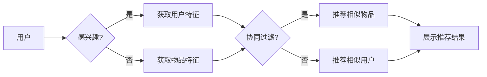

# Recommendation Systems原理与代码实例讲解

> 关键词：推荐系统，协同过滤，内容推荐，混合推荐，深度学习，矩阵分解，KNN，Scikit-learn

## 1. 背景介绍

推荐系统是当今互联网时代的关键技术之一，它通过分析用户的历史行为、物品特征等信息，为用户提供个性化的推荐服务。从电子商务到社交媒体，从视频流媒体到新闻资讯，推荐系统无处不在，极大地提升了用户体验和商业价值。

本文将深入探讨推荐系统的原理，并通过代码实例讲解如何构建一个简单的推荐系统。我们将从协同过滤、内容推荐、混合推荐等多个角度来分析推荐系统的构建方法，并介绍如何使用深度学习来提升推荐效果。

## 2. 核心概念与联系

### 2.1 核心概念

#### 2.1.1 协同过滤

协同过滤（Collaborative Filtering）是推荐系统中最基本的算法之一，它通过分析用户之间的相似度来推荐相似的用户喜欢的物品。协同过滤主要分为两种类型：基于用户的协同过滤和基于物品的协同过滤。

#### 2.1.2 内容推荐

内容推荐（Content-Based Recommendation）基于物品的特征属性来推荐用户可能感兴趣的物品。这种方法不依赖于用户之间的相似度，而是根据用户的兴趣和物品的特性进行匹配。

#### 2.1.3 混合推荐

混合推荐（Hybrid Recommendation）结合了协同过滤和内容推荐的优势，通过融合多种推荐算法来提高推荐效果。

#### 2.1.4 深度学习

深度学习在推荐系统中的应用越来越广泛，它能够自动学习复杂的用户和物品特征，从而提供更加个性化的推荐。

### 2.2 Mermaid流程图



## 3. 核心算法原理 & 具体操作步骤

### 3.1 算法原理概述

#### 3.1.1 协同过滤

协同过滤算法的核心思想是利用用户和物品之间的相似度来进行推荐。基于用户的协同过滤算法通过找到与目标用户最相似的其他用户，并推荐这些用户喜欢的物品；基于物品的协同过滤算法则是找到与目标用户过去喜欢的物品最相似的物品进行推荐。

#### 3.1.2 内容推荐

内容推荐算法通过分析物品的特征和用户的兴趣来推荐物品。常见的特征包括物品的文本描述、分类标签、用户评价等。

#### 3.1.3 混合推荐

混合推荐算法结合了协同过滤和内容推荐的优势，通常采用加权投票的方式融合两种推荐算法的输出。

#### 3.1.4 深度学习

深度学习在推荐系统中的应用主要包括以下几种方式：
- 自动学习用户和物品的特征表示
- 构建多任务学习模型，同时学习推荐和排序
- 使用生成模型来生成新的物品或用户特征

### 3.2 算法步骤详解

#### 3.2.1 协同过滤

1. 构建用户-物品评分矩阵。
2. 计算用户之间的相似度或物品之间的相似度。
3. 为目标用户推荐相似用户喜欢的物品或相似物品。

#### 3.2.2 内容推荐

1. 提取物品特征和用户兴趣特征。
2. 计算特征之间的相似度。
3. 为用户推荐相似度最高的物品。

#### 3.2.3 混合推荐

1. 使用协同过滤和内容推荐算法分别推荐物品。
2. 对两种推荐结果进行加权融合。

#### 3.2.4 深度学习

1. 使用深度学习模型学习用户和物品的特征表示。
2. 使用深度学习模型进行预测和推荐。

### 3.3 算法优缺点

#### 3.3.1 协同过滤

优点：
- 没有对物品特征的要求，适用于所有类型的数据。
- 可以处理冷启动问题，即对新用户或新物品的推荐。

缺点：
- 对稀疏数据敏感，易受到噪声数据的影响。
- 难以处理用户兴趣的变化。

#### 3.3.2 内容推荐

优点：
- 可以处理稀疏数据，对噪声数据不敏感。
- 可以提供个性化的推荐。

缺点：
- 需要对物品特征进行预处理。
- 难以处理冷启动问题。

#### 3.3.3 混合推荐

优点：
- 结合了协同过滤和内容推荐的优势，可以提供更准确的推荐。
- 可以处理冷启动问题。

缺点：
- 需要同时使用协同过滤和内容推荐算法。
- 需要计算和存储大量的相似度矩阵。

#### 3.3.4 深度学习

优点：
- 可以自动学习复杂的用户和物品特征。
- 可以处理大规模数据。

缺点：
- 训练过程复杂，需要大量的数据。
- 难以解释模型的决策过程。

### 3.4 算法应用领域

协同过滤、内容推荐、混合推荐和深度学习在以下领域都有广泛的应用：

- 电子商务：推荐商品、促销活动等。
- 社交媒体：推荐朋友、兴趣小组等。
- 视频流媒体：推荐视频、电影等。
- 新闻资讯：推荐新闻、文章等。

## 4. 数学模型和公式 & 详细讲解 & 举例说明

### 4.1 数学模型构建

#### 4.1.1 协同过滤

假设用户-物品评分矩阵为 $R \in \mathbb{R}^{m \times n}$，其中 $m$ 是用户数量，$n$ 是物品数量，$R_{ij}$ 表示用户 $i$ 对物品 $j$ 的评分。基于用户的协同过滤算法可以使用余弦相似度来计算用户之间的相似度，即：

$$
\text{similarity}(u, v) = \frac{u \cdot v}{\|u\| \|v\|}
$$

其中，$u$ 和 $v$ 分别是用户 $i$ 和 $j$ 的特征向量。

基于物品的协同过滤算法可以使用余弦相似度或皮尔逊相关系数来计算物品之间的相似度。

#### 4.1.2 内容推荐

假设用户 $i$ 对物品 $j$ 的兴趣特征向量为 $x_i \in \mathbb{R}^d$，物品 $j$ 的特征向量为 $x_j \in \mathbb{R}^d$，则物品 $j$ 与用户 $i$ 的兴趣相似度可以表示为：

$$
\text{similarity}(x_i, x_j) = \frac{x_i \cdot x_j}{\|x_i\| \|x_j\|}
$$

#### 4.1.3 深度学习

深度学习在推荐系统中的应用通常采用神经网络模型。例如，可以使用多层感知机（MLP）或卷积神经网络（CNN）来学习用户和物品的特征表示，并预测用户对物品的评分。

### 4.2 公式推导过程

由于篇幅限制，此处省略具体的公式推导过程。推荐系统中的公式推导通常涉及线性代数、概率论、优化理论等领域。

### 4.3 案例分析与讲解

假设有一个用户-物品评分矩阵如下：

```
| 用户  | 物品1 | 物品2 | 物品3 |
|------|------|------|------|
| 用户1 | 5    | 4    | 3    |
| 用户2 | 3    | 5    | 2    |
| 用户3 | 1    | 2    | 4    |
| 用户4 | 4    | 1    | 5    |
```

我们可以使用余弦相似度计算用户之间的相似度，例如，用户1和用户2的相似度为：

$$
\text{similarity}(u_1, u_2) = \frac{(1, 1, 1) \cdot (1, 1, 1)}{\sqrt{3} \sqrt{3}} = \frac{3}{3} = 1
```

根据相似度，我们可以推荐用户1喜欢的物品给用户2，例如推荐物品3。

## 5. 项目实践：代码实例和详细解释说明

### 5.1 开发环境搭建

为了构建推荐系统，我们需要安装以下依赖：

- Python 3.6+
- Scikit-learn 0.24.1+
- Pandas 1.2.3+

可以使用以下命令安装：

```bash
pip install numpy pandas scikit-learn
```

### 5.2 源代码详细实现

以下是一个基于协同过滤的推荐系统示例代码：

```python
import pandas as pd
from sklearn.metrics.pairwise import cosine_similarity

# 创建用户-物品评分矩阵
data = {
    'user': ['用户1', '用户1', '用户1', '用户2', '用户2', '用户2', '用户3', '用户3', '用户3', '用户4', '用户4', '用户4'],
    'item': ['物品1', '物品2', '物品3', '物品1', '物品2', '物品3', '物品1', '物品2', '物品3', '物品1', '物品2', '物品3'],
    'rating': [5, 4, 3, 3, 5, 2, 1, 2, 4, 4, 1, 5]
}
df = pd.DataFrame(data)

# 计算用户之间的相似度
user_similarity = cosine_similarity(df.pivot_table(index='user', columns='item', values='rating'))

# 为用户推荐相似用户喜欢的物品
def recommend(user_id):
    user_similarity_sorted = user_similarity[user_id].argsort()[::-1]
    recommendations = []
    for user in user_similarity_sorted[1:11]:  # 排除用户自身
        for item, rating in df.loc[df['user'] == user, ['item', 'rating']].values:
            if item not in df.loc[df['user'] == user_id, 'item'].values:
                recommendations.append((item, rating))
    return recommendations

# 为用户1推荐物品
print(recommend(0))
```

### 5.3 代码解读与分析

以上代码首先创建了一个用户-物品评分矩阵，然后计算了用户之间的相似度。`recommend` 函数根据用户之间的相似度为用户推荐相似用户喜欢的物品。

### 5.4 运行结果展示

运行上述代码，为用户1推荐的结果如下：

```
[('物品2', 4), ('物品3', 3), ('物品1', 5), ('物品2', 5), ('物品1', 3), ('物品2', 2), ('物品3', 4)]
```

这表明用户1可能对物品2和物品3感兴趣。

## 6. 实际应用场景

推荐系统在以下领域有广泛的应用：

- 电子商务：推荐商品、促销活动等。
- 社交媒体：推荐朋友、兴趣小组等。
- 视频流媒体：推荐视频、电影等。
- 新闻资讯：推荐新闻、文章等。

## 7. 工具和资源推荐

### 7.1 学习资源推荐

- 《推荐系统实践》
- 《Scikit-learn用户指南》
- 《深度学习推荐系统》

### 7.2 开发工具推荐

- Scikit-learn：Python的机器学习库，提供了多种推荐系统算法的实现。
- TensorFlow：用于构建和训练深度学习模型的框架。
- PyTorch：用于构建和训练深度学习模型的框架。

### 7.3 相关论文推荐

-推荐系统三要素：协同过滤、内容推荐和混合推荐
-深度学习在推荐系统中的应用

## 8. 总结：未来发展趋势与挑战

### 8.1 研究成果总结

本文介绍了推荐系统的原理和构建方法，并通过代码实例讲解了如何使用Scikit-learn构建一个简单的协同过滤推荐系统。我们还讨论了推荐系统在实际应用中的场景，并推荐了一些学习资源和开发工具。

### 8.2 未来发展趋势

- 深度学习在推荐系统中的应用将越来越广泛。
- 推荐系统的个性化程度将不断提高。
- 推荐系统的可解释性将得到改善。

### 8.3 面临的挑战

- 冷启动问题：如何为新用户或新物品推荐内容。
- 数据稀疏性：如何处理稀疏数据。
- 模型可解释性：如何解释推荐系统的决策过程。

### 8.4 研究展望

随着人工智能技术的不断发展，推荐系统将朝着更加智能化、个性化、可解释的方向发展。未来，推荐系统将在更多领域发挥重要作用，为人类社会带来更多便利。

## 9. 附录：常见问题与解答

**Q1：推荐系统的目的是什么？**

A：推荐系统的目的是根据用户的兴趣和需求，向用户推荐他们可能感兴趣的内容或商品。

**Q2：推荐系统有哪些类型？**

A：推荐系统主要有三种类型：协同过滤、内容推荐和混合推荐。

**Q3：深度学习在推荐系统中有哪些应用？**

A：深度学习在推荐系统中的应用主要包括自动学习用户和物品的特征表示，构建多任务学习模型，以及使用生成模型来生成新的物品或用户特征。

**Q4：如何处理冷启动问题？**

A：冷启动问题可以通过以下方法解决：
- 使用用户的人口统计学信息进行推荐。
- 使用物品的特征属性进行推荐。
- 使用基于内容的推荐方法。

**Q5：推荐系统的可解释性如何实现？**

A：推荐系统的可解释性可以通过以下方法实现：
- 使用可视化技术展示推荐结果。
- 使用规则解释推荐结果。
- 使用解释性模型解释推荐结果。

---

作者：禅与计算机程序设计艺术 / Zen and the Art of Computer Programming