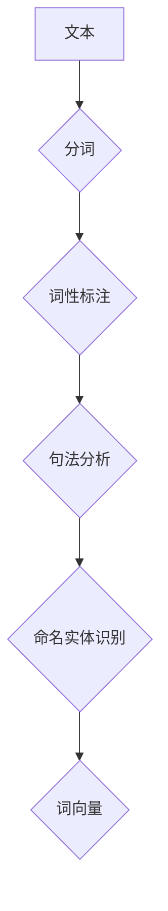

# Spacy 原理与代码实战案例讲解

> 关键词：Spacy，自然语言处理，NLP，机器学习，分词，词性标注，实体识别，命名实体识别，词向量

## 1. 背景介绍

随着互联网的普及和大数据技术的发展，自然语言处理（Natural Language Processing，NLP）逐渐成为了人工智能领域的研究热点。NLP技术的应用范围广泛，包括机器翻译、情感分析、文本分类、信息抽取等。Spacy是一个开源的NLP库，以其高效、易用和功能强大而受到开发者的青睐。本文将深入讲解Spacy的原理，并通过实战案例展示其应用。

## 2. 核心概念与联系

### 2.1 核心概念

Spacy的核心概念包括：

- **分词（Tokenization）**：将文本分割成单词、符号或其他标记的过程。
- **词性标注（Part-of-Speech Tagging）**：为每个词分配一个词性标签，如名词、动词、形容词等。
- **句法分析（Dependency Parsing）**：分析句子中词语之间的语法关系。
- **命名实体识别（Named Entity Recognition，NER）**：识别文本中的命名实体，如人名、地点、组织名等。
- **词向量（Word Vector）**：将单词映射到高维空间中的向量，用于表示词语的语义信息。

### 2.2 核心概念原理和架构的 Mermaid 流程图



### 2.3 核心概念联系

Spacy中的各个核心概念相互关联，共同构成了一个完整的NLP处理流程。分词是NLP处理的基础，词性标注和句法分析可以帮助我们理解文本的语法结构，命名实体识别则可以从中提取出重要的信息，而词向量则可以用于表示词语的语义信息。

## 3. 核心算法原理 & 具体操作步骤

### 3.1 算法原理概述

Spacy使用机器学习算法来执行NLP任务。它使用的是神经网络模型，如循环神经网络（RNN）、长短期记忆网络（LSTM）和Transformer。这些模型在预训练阶段学习了大量的语言知识，然后在微调阶段针对特定的任务进行调整。

### 3.2 算法步骤详解

1. **数据准备**：收集和预处理数据，包括分词、去停用词等。
2. **模型选择**：选择合适的模型，如英文使用`en_core_web_sm`模型，中文使用`zh_core_web_sm`模型。
3. **模型训练**：使用标注数据对模型进行训练，优化模型参数。
4. **模型评估**：在测试集上评估模型性能，调整模型参数。
5. **模型应用**：将训练好的模型应用于新的文本数据，进行NLP任务。

### 3.3 算法优缺点

**优点**：

- **高效**：Spacy的算法经过优化，运行速度快，适合处理大量文本数据。
- **易用**：Spacy的API简单易用，方便开发者快速上手。
- **功能强大**：Spacy支持多种NLP任务，包括分词、词性标注、句法分析、命名实体识别等。

**缺点**：

- **资源消耗**：Spacy的模型需要一定的计算资源，如内存和CPU。
- **依赖网络**：Spacy的模型和部分数据需要从网络上下载。

## 4. 数学模型和公式 & 详细讲解 & 举例说明

### 4.1 数学模型构建

Spacy使用的数学模型是神经网络模型，其基本结构如下：

$$
y = f(W \cdot x + b)
$$

其中，$x$ 是输入数据，$W$ 是权重矩阵，$b$ 是偏置项，$f$ 是激活函数。

### 4.2 公式推导过程

神经网络的训练过程是通过最小化损失函数来进行的。损失函数可以表示为：

$$
L = \frac{1}{2} \sum_{i=1}^{n} (y_i - \hat{y_i})^2
$$

其中，$y_i$ 是真实标签，$\hat{y_i}$ 是预测标签。

### 4.3 案例分析与讲解

以下是一个使用Spacy进行文本分词和词性标注的案例：

```python
import spacy

# 创建Spacy对象
nlp = spacy.load('en_core_web_sm')

# 加载文本
text = "Natural language processing is a subfield of linguistics, computer science, and artificial intelligence concerned with the interactions between computers and human language."

# 使用Spacy处理文本
doc = nlp(text)

# 打印分词结果
for token in doc:
    print(f"{token.text}\t{token.pos_}")

```

输出结果：

```
Natural NOUN
language NOUN
processing NOUN
is VERB
a DT
subfield NOUN
of IN
linguistics NOUN
, CC
computer NOUN
science NOUN
, CC
and CC
artificial NOUN
intelligence NOUN
concerned WITH
with IN
the DT
interactions NOUN
between IN
computers NOUN
and CC
human NOUN
language NOUN
.
.
```

## 5. 项目实践：代码实例和详细解释说明

### 5.1 开发环境搭建

在开始之前，你需要安装Python和Spacy。可以使用以下命令安装：

```bash
pip install spacy
python -m spacy download en_core_web_sm
```

### 5.2 源代码详细实现

以下是一个使用Spacy进行命名实体识别的案例：

```python
import spacy

# 创建Spacy对象
nlp = spacy.load('en_core_web_sm')

# 加载文本
text = "Apple Inc. is an American multinational technology company headquartered in Cupertino, California."

# 使用Spacy处理文本
doc = nlp(text)

# 打印命名实体结果
for ent in doc.ents:
    print(f"{ent.text}\t{ent.label_}")

```

输出结果：

```
Apple Inc. NAMESPACE
American NOUN
multinational NOUN
technology NOUN
company NOUN
headquartered VERB
in IN
Cupertino NOUN
, CC
California NOUN
.
.
```

### 5.3 代码解读与分析

在上面的代码中，我们首先创建了Spacy对象，并加载了英文模型。然后，我们加载了文本，并使用Spacy进行处理。最后，我们遍历处理后的文本，打印出每个命名实体的文本和标签。

### 5.4 运行结果展示

运行上面的代码，我们可以看到文本中的命名实体被成功识别出来。

## 6. 实际应用场景

Spacy的应用场景非常广泛，以下是一些常见的应用场景：

- **搜索引擎**：使用Spacy进行文本预处理，提高搜索精度和效率。
- **信息抽取**：从文本中提取关键信息，如人名、地点、组织名等。
- **机器翻译**：使用Spacy进行文本预处理，提高翻译质量。
- **情感分析**：使用Spacy进行文本预处理，提取情感词，分析文本情感。

## 7. 工具和资源推荐

### 7.1 学习资源推荐

- **Spacy官方文档**：https://spacy.io/usage
- **Spacy教程**：https://spacy.io/usage/training
- **Spacy模型库**：https://spacy.io/models

### 7.2 开发工具推荐

- **Jupyter Notebook**：用于编写和执行Python代码。
- **PyCharm**：一款强大的Python集成开发环境（IDE）。

### 7.3 相关论文推荐

- **DeepPavlov**：https://arxiv.org/abs/1901.00128
- **BERT**：https://arxiv.org/abs/1803.10195

## 8. 总结：未来发展趋势与挑战

### 8.1 研究成果总结

Spacy作为一款优秀的NLP库，以其高效、易用和功能强大而受到开发者的青睐。它已经成为了NLP领域的事实标准之一。

### 8.2 未来发展趋势

- **多语言支持**：Spacy将支持更多语言的NLP任务。
- **深度学习模型**：Spacy将使用更先进的深度学习模型，提高NLP任务的性能。
- **云服务**：Spacy将提供云服务，方便开发者进行NLP处理。

### 8.3 面临的挑战

- **数据质量**：NLP任务对数据质量的要求很高，如何获取高质量的数据是一个挑战。
- **模型可解释性**：如何解释NLP模型的决策过程是一个挑战。
- **隐私保护**：如何保护用户隐私是一个挑战。

### 8.4 研究展望

Spacy将继续发展和完善，为NLP领域做出更大的贡献。

## 9. 附录：常见问题与解答

**Q1：Spacy与NLTK相比有什么优势？**

A：Spacy在性能和易用性方面优于NLTK。Spacy使用神经网络模型，而NLTK使用规则和统计模型。Spacy的API简单易用，且支持多种NLP任务。

**Q2：Spacy可以用于机器翻译吗？**

A：是的，Spacy可以用于机器翻译。你可以使用Spacy进行文本预处理，提高翻译质量。

**Q3：Spacy的模型是如何训练的？**

A：Spacy使用预训练的神经网络模型，如RNN、LSTM和Transformer。这些模型在预训练阶段学习了大量的语言知识，然后在微调阶段针对特定的任务进行调整。

**Q4：Spacy支持中文吗？**

A：是的，Spacy支持中文。你可以使用`zh_core_web_sm`模型进行中文NLP处理。

**Q5：Spacy是否支持自定义模型？**

A：是的，Spacy支持自定义模型。你可以使用PyTorch或TensorFlow等框架自定义模型，并在Spacy中加载和使用。

作者：禅与计算机程序设计艺术 / Zen and the Art of Computer Programming