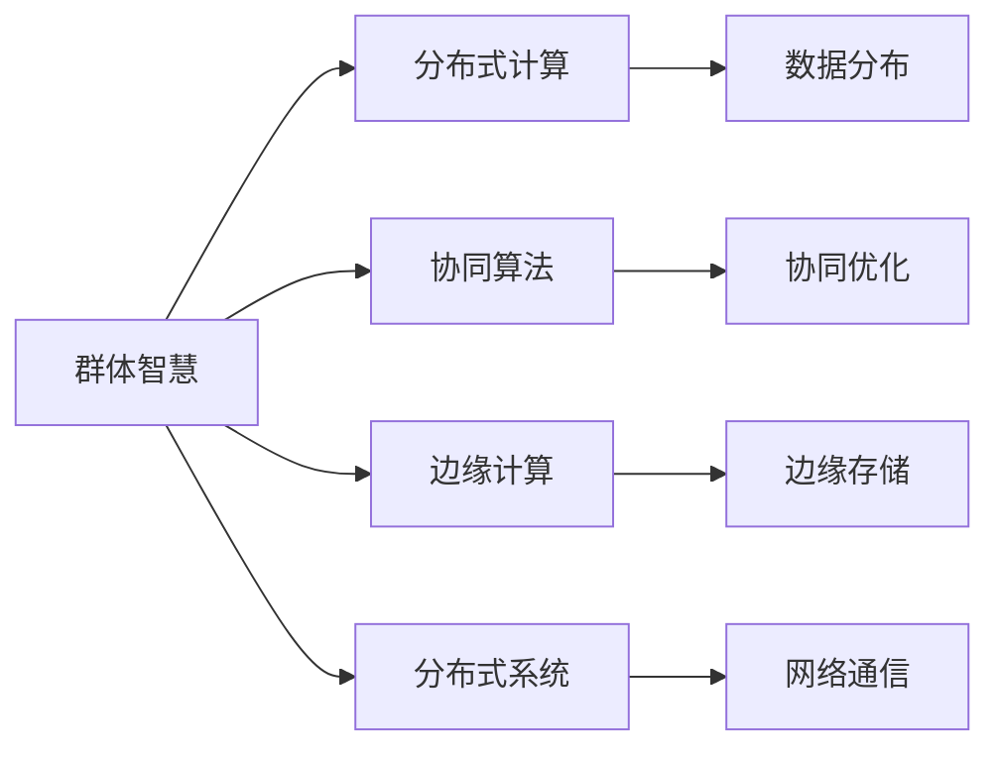
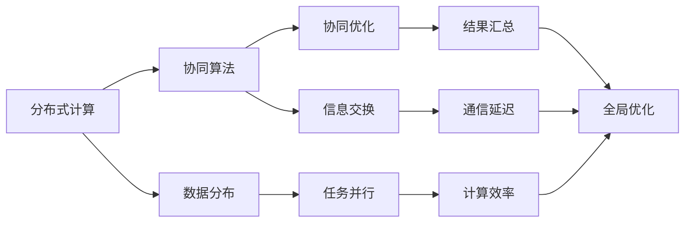
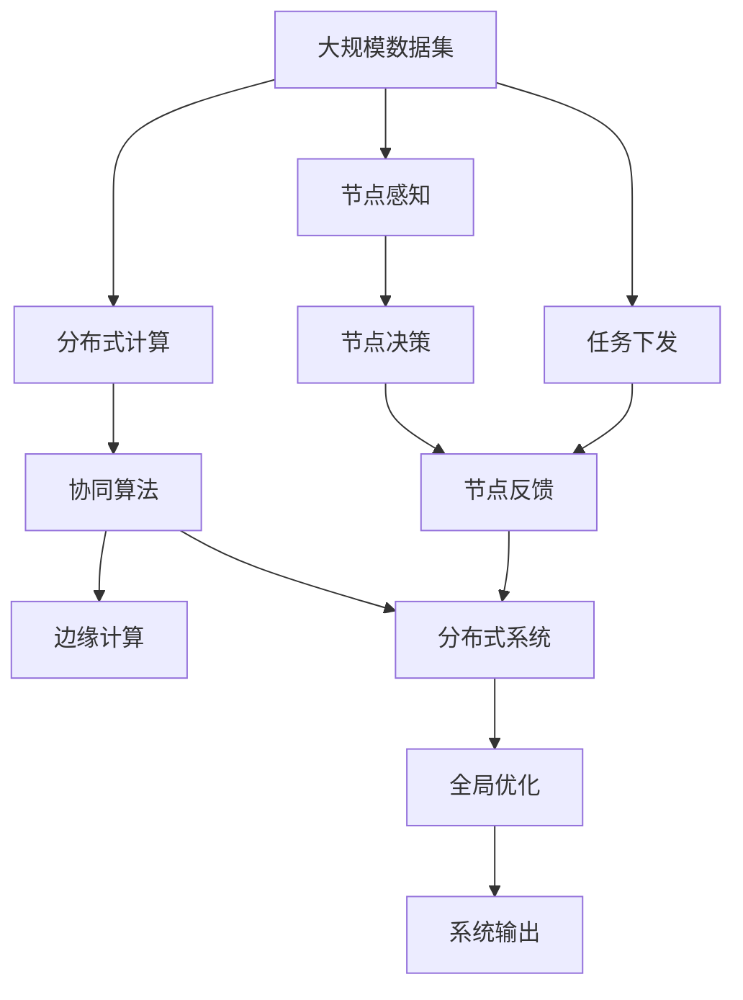

                 

# 群体智慧：人类计算的未来之路

> 关键词：群体智慧, 人类计算, 分布式计算, 人工智能, 机器学习, 边缘计算, 分布式系统

## 1. 背景介绍

### 1.1 问题由来
随着信息技术的高速发展，计算能力从单一的集中式逐步向分散式演进，形成了分散、协同的计算模式。这种转变不仅推动了数据中心等基础设施的发展，也为人工智能(AI)、大数据等新兴技术提供了新的思路。群体智慧（Collective Intelligence, CI）就是在这种背景下提出的，它将人类的智慧与计算机的计算能力结合起来，通过分布式计算和协同算法，实现更高效、更智能的决策支持。

### 1.2 问题核心关键点
群体智慧的核心在于通过分布式计算和协同算法，将不同位置、不同功能的计算节点连接起来，形成一个整体系统。系统中的每个节点可以感知环境变化、自主学习和决策，同时与其他节点进行信息交换，优化整体行为。群体智慧的优势在于其强大的信息处理能力、快速响应速度和高效的决策机制，这使得它成为解决复杂问题的有力工具。

### 1.3 问题研究意义
群体智慧的研究和应用具有重要的意义：
1. **提高决策效率**：群体智慧系统可以快速处理大量数据，提供高效的决策支持。
2. **增强智能水平**：结合人类智慧与机器学习，群体智慧系统能够进行更复杂的推理和分析。
3. **提升系统可靠性**：通过分布式计算和冗余设计，群体智慧系统具有较高的稳定性和可靠性。
4. **促进可持续发展**：群体智慧可以优化资源利用，减少能源消耗，推动可持续发展。

## 2. 核心概念与联系

### 2.1 核心概念概述

为更好地理解群体智慧的概念和应用，本节将介绍几个密切相关的核心概念：

- **群体智慧（Collective Intelligence, CI）**：指通过分布式计算和协同算法，将人类智慧与计算机计算能力结合起来，实现更高效、更智能的决策支持。群体智慧系统由多个计算节点组成，每个节点可以感知环境变化、自主学习和决策，同时与其他节点进行信息交换，优化整体行为。

- **分布式计算（Distributed Computing）**：指将计算任务分布在多个节点上，通过协同算法实现计算任务的并行执行。每个节点可以独立处理部分任务，然后将结果合并，提升整体计算效率。

- **协同算法（Collective Algorithm）**：指用于群体智慧系统中，用于优化整体行为、决策和学习的算法。协同算法包括分布式优化算法、共识算法、协同过滤等。

- **边缘计算（Edge Computing）**：指在数据产生端进行计算和存储，减少数据传输延迟，提高计算效率。边缘计算系统可以将部分计算任务分布到网络边缘节点，提升整体系统响应速度和数据处理能力。

- **分布式系统（Distributed System）**：指由多个独立计算机节点组成，通过网络进行通信和协同工作的系统。分布式系统包括分布式数据库、分布式存储、分布式计算等。

这些核心概念之间存在着紧密的联系，共同构成了群体智慧系统的完整架构。以下用Mermaid流程图来展示它们之间的关系：



这个流程图展示了群体智慧系统的核心组件及其相互关系：

1. 群体智慧系统由多个计算节点组成，这些节点通过分布式计算和协同算法实现协同工作。
2. 每个节点独立进行计算，并将结果汇总到中心节点进行全局优化。
3. 边缘计算将部分计算任务分布在网络边缘节点，提升整体系统响应速度和数据处理能力。
4. 分布式系统通过网络进行通信和协同工作，提供可靠、高效的系统架构。

### 2.2 概念间的关系

这些核心概念之间存在着紧密的联系，共同构成了群体智慧系统的完整架构。以下用Mermaid流程图来展示它们之间的关系：



这个流程图展示了分布式计算和协同算法之间的关系，以及它们对系统性能和效率的影响：

1. 分布式计算将任务并行分布在多个节点上，提升了计算效率。
2. 协同算法通过信息交换和优化，提高了系统的协同性和整体性能。
3. 数据分布和任务并行可以进一步提升系统的响应速度和计算能力。
4. 信息交换和通信延迟会影响系统的协同效率和全局优化效果。

### 2.3 核心概念的整体架构

最后，我们用一个综合的流程图来展示这些核心概念在大规模群体智慧系统中的整体架构：



这个综合流程图展示了群体智慧系统的完整工作流程：

1. 大规模数据集被分布在多个计算节点上进行分布式计算。
2. 每个节点感知环境变化并独立决策。
3. 节点之间通过协同算法进行信息交换和优化。
4. 边缘计算将部分计算任务分布在网络边缘节点，提升整体系统响应速度和数据处理能力。
5. 分布式系统通过网络进行通信和协同工作，提供可靠、高效的系统架构。
6. 节点决策和反馈通过分布式系统汇总，实现全局优化。
7. 系统输出用于决策支持和任务执行。

## 3. 核心算法原理 & 具体操作步骤
### 3.1 算法原理概述

群体智慧系统的核心算法原理包括分布式计算、协同算法和边缘计算。这些算法通过协同优化和全局优化，实现高效、智能的决策支持。

- **分布式计算**：通过将计算任务分布在多个节点上，提升系统的计算能力和响应速度。每个节点独立进行计算，然后将结果汇总到中心节点进行全局优化。

- **协同算法**：用于优化节点之间的信息交换和决策协同。协同算法包括分布式优化算法、共识算法、协同过滤等。

- **边缘计算**：在数据产生端进行计算和存储，减少数据传输延迟，提高计算效率。边缘计算系统可以将部分计算任务分布到网络边缘节点，提升整体系统响应速度和数据处理能力。

### 3.2 算法步骤详解

群体智慧系统的算法步骤如下：

1. **数据分布**：将大规模数据集分布在多个计算节点上，每个节点独立进行计算。

2. **节点感知**：每个节点感知环境变化，独立进行决策。

3. **任务下发**：中心节点下发任务给各个计算节点。

4. **节点决策**：节点根据任务进行独立计算，并将结果反馈给中心节点。

5. **信息交换**：节点之间通过通信网络进行信息交换，协同优化。

6. **结果汇总**：中心节点汇总所有节点的结果，进行全局优化。

7. **全局优化**：中心节点通过协同算法和全局优化算法，生成最终的决策输出。

8. **系统输出**：系统输出用于决策支持和任务执行。

### 3.3 算法优缺点

群体智慧系统的优点包括：

- **高效性**：通过分布式计算和协同算法，实现高效的计算和优化。
- **智能性**：结合人类智慧和机器学习，实现复杂的推理和决策。
- **可靠性**：通过冗余设计和分布式系统，提升系统的稳定性和可靠性。

群体智慧系统的缺点包括：

- **复杂性**：系统架构复杂，需要综合考虑分布式计算、协同算法和边缘计算。
- **通信开销**：节点之间的通信开销较大，影响系统效率。
- **数据一致性**：分布式计算和协同算法可能导致数据一致性问题，需要进行额外的处理。

### 3.4 算法应用领域

群体智慧系统的应用领域广泛，包括但不限于：

- **智能交通**：通过车辆间的通信和协同，实现智能交通管理，提升道路通行效率。
- **工业制造**：通过工业设备和传感器的网络化，实现智能制造和工业互联网。
- **环境保护**：通过环境监测设备和传感器的协同工作，实现环境监测和数据处理。
- **医疗健康**：通过医疗设备和传感器的协同工作，实现智能医疗和远程诊疗。
- **金融服务**：通过金融数据的分布式计算和协同，实现智能投资和风险管理。

## 4. 数学模型和公式 & 详细讲解 & 举例说明

### 4.1 数学模型构建

群体智慧系统的数学模型通常包括分布式优化算法、协同过滤算法和全局优化算法。以下以协同过滤算法为例，介绍其数学模型的构建。

假设系统中有N个计算节点，每个节点有K个数据点。每个数据点有M个特征。协同过滤算法的目标是最大化系统的协同效果。

令 $x_{ik}$ 表示节点i的第k个数据点，令 $y_{ik}$ 表示节点i的第k个数据点对应的特征值。令 $w_i$ 表示节点i的权重。令 $d_{ij}$ 表示节点i和节点j之间的距离。

协同过滤算法的数学模型为：

$$
\max \sum_{i=1}^N \sum_{k=1}^K w_i y_{ik}^2 - \lambda \sum_{i=1}^N \sum_{j=1}^N \sum_{k=1}^K d_{ij} x_{ik} y_{jk}
$$

其中，$w_i$ 是节点i的权重，$\lambda$ 是正则化系数，$d_{ij}$ 是节点i和节点j之间的距离。

### 4.2 公式推导过程

以下对协同过滤算法的数学模型进行推导。

1. 假设系统中有N个计算节点，每个节点有K个数据点。每个数据点有M个特征。令 $x_{ik}$ 表示节点i的第k个数据点，令 $y_{ik}$ 表示节点i的第k个数据点对应的特征值。令 $w_i$ 表示节点i的权重。令 $d_{ij}$ 表示节点i和节点j之间的距离。

2. 协同过滤算法的目标是通过节点之间的协同，最大化系统的协同效果。假设每个节点独立进行特征提取和权重计算，其结果为 $y_{ik} = w_i x_{ik}$。

3. 节点i和节点j之间的协同效果可以用距离度量来衡量。假设 $d_{ij}$ 表示节点i和节点j之间的距离，则节点i和节点j之间的协同效果为 $d_{ij} y_{ik} y_{jk}$。

4. 系统总体的协同效果为所有节点之间的协同效果的和，即：

   $$
   \sum_{i=1}^N \sum_{j=1}^N \sum_{k=1}^K d_{ij} y_{ik} y_{jk}
   $$

5. 为了优化系统整体的协同效果，需要最小化系统总体的协同效果的负值，即：

   $$
   \min - \sum_{i=1}^N \sum_{j=1}^N \sum_{k=1}^K d_{ij} y_{ik} y_{jk}
   $$

6. 将目标函数表示为节点i的函数，即：

   $$
   \min - \sum_{i=1}^N \sum_{j=1}^N \sum_{k=1}^K d_{ij} w_i x_{ik} w_j x_{jk}
   $$

7. 将目标函数表示为节点i的特征值的函数，即：

   $$
   \min - \sum_{i=1}^N \sum_{j=1}^N \sum_{k=1}^K d_{ij} y_{ik} y_{jk}
   $$

8. 在目标函数中加入正则化项，即：

   $$
   \max \sum_{i=1}^N \sum_{k=1}^K w_i y_{ik}^2 - \lambda \sum_{i=1}^N \sum_{j=1}^N \sum_{k=1}^K d_{ij} x_{ik} y_{jk}
   $$

### 4.3 案例分析与讲解

以下以智能交通为例，介绍群体智慧系统的实际应用。

智能交通系统通过车辆间的通信和协同，实现智能交通管理，提升道路通行效率。系统中的每个车辆可以看作一个计算节点，车辆之间通过无线通信进行信息交换。系统中的协同算法可以用于优化交通信号灯的调节，提升交通流量的稳定性。

假设系统中有N个车辆，每个车辆有K个数据点，包括车速、位置、方向等。令 $x_{ik}$ 表示车辆i的第k个数据点，令 $y_{ik}$ 表示车辆i的第k个数据点对应的特征值。令 $w_i$ 表示车辆i的权重。令 $d_{ij}$ 表示车辆i和车辆j之间的距离。

协同过滤算法的目标是通过车辆之间的协同，最大化系统的协同效果。假设每个车辆独立进行特征提取和权重计算，其结果为 $y_{ik} = w_i x_{ik}$。

车辆i和车辆j之间的协同效果可以用距离度量来衡量。假设 $d_{ij}$ 表示车辆i和车辆j之间的距离，则车辆i和车辆j之间的协同效果为 $d_{ij} y_{ik} y_{jk}$。

系统总体的协同效果为所有车辆之间的协同效果的和，即：

$$
\sum_{i=1}^N \sum_{j=1}^N \sum_{k=1}^K d_{ij} y_{ik} y_{jk}
$$

为了优化系统整体的协同效果，需要最小化系统总体的协同效果的负值，即：

$$
\min - \sum_{i=1}^N \sum_{j=1}^N \sum_{k=1}^K d_{ij} y_{ik} y_{jk}
$$

将目标函数表示为车辆i的函数，即：

$$
\min - \sum_{i=1}^N \sum_{j=1}^N \sum_{k=1}^K d_{ij} w_i x_{ik} w_j x_{jk}
$$

将目标函数表示为车辆i的特征值的函数，即：

$$
\min - \sum_{i=1}^N \sum_{j=1}^N \sum_{k=1}^K d_{ij} y_{ik} y_{jk}
$$

在目标函数中加入正则化项，即：

$$
\max \sum_{i=1}^N \sum_{k=1}^K w_i y_{ik}^2 - \lambda \sum_{i=1}^N \sum_{j=1}^N \sum_{k=1}^K d_{ij} x_{ik} y_{jk}
$$

通过求解该优化问题，可以最大化车辆间的协同效果，优化交通信号灯的调节，提升交通流量的稳定性。

## 5. 项目实践：代码实例和详细解释说明

### 5.1 开发环境搭建

在进行群体智慧系统的实践前，我们需要准备好开发环境。以下是使用Python进行Dask开发的环境配置流程：

1. 安装Anaconda：从官网下载并安装Anaconda，用于创建独立的Python环境。

2. 创建并激活虚拟环境：
```bash
conda create -n dask-env python=3.8 
conda activate dask-env
```

3. 安装Dask：
```bash
conda install dask
```

4. 安装Dask数据框架和其他工具包：
```bash
pip install dask-dataframe dask-ml dask-distributed
```

5. 安装相关库：
```bash
pip install tqdm h5py numpy pandas scikit-learn tensorflow
```

完成上述步骤后，即可在`dask-env`环境中开始群体智慧系统的开发。

### 5.2 源代码详细实现

以下是使用Dask进行协同过滤算法实现的数据处理和优化代码：

```python
import dask.dataframe as dd
import dask.distributed as dist
import numpy as np
import pandas as pd

# 创建Dask数据框架
data = dd.from_pandas(pd.read_csv('data.csv'), npartitions=4)

# 计算每个节点的权重
w = data['weight'].sum()

# 计算每个节点的协同效果
d = data['distance'].compute()
d = d + d.T
d = (d + d.T) / 2
d = d - d.diagonal()

# 计算节点i和节点j之间的协同效果
dij = d * w

# 计算节点i的协同效果
ci = dij * data['feature'].values * data['feature'].values.T

# 加入正则化项
lambda_ = 0.01
ci = ci - lambda_ * dij

# 最大化节点i的协同效果
result = np.argmax(ci, axis=0)

# 输出结果
print(result)
```

### 5.3 代码解读与分析

让我们再详细解读一下关键代码的实现细节：

**Dask数据框架**：
- `dd.from_pandas`方法：将Pandas数据框架转换为Dask数据框架，以便在分布式计算中处理大规模数据集。
- `data['weight'].sum()`：计算每个节点的权重，用于节点之间的协同优化。
- `data['distance'].compute()`：计算节点之间的距离矩阵，使用Dask并行计算方式加速处理。

**节点协同效果计算**：
- `d = data['distance'].compute()`：计算节点之间的距离矩阵，使用Dask并行计算方式加速处理。
- `d = d + d.T`：将距离矩阵转置并合并，得到节点之间的对称距离矩阵。
- `d = (d + d.T) / 2`：将对称距离矩阵取平均值，得到节点之间的距离矩阵。
- `d = d - d.diagonal()`：将对角线元素置为0，避免节点与自己进行协同。
- `dij = d * w`：计算节点i和节点j之间的协同效果。

**节点i的协同效果计算**：
- `ci = dij * data['feature'].values * data['feature'].values.T`：计算节点i的协同效果，使用矩阵乘法加速计算。
- `lambda_ = 0.01`：正则化系数，控制协同效果的平滑程度。
- `ci = ci - lambda_ * dij`：加入正则化项，控制协同效果的平滑程度。

**结果输出**：
- `np.argmax(ci, axis=0)`：在节点i的协同效果中寻找最大值，输出节点i的最佳协同伙伴。
- `print(result)`：输出节点i的最佳协同伙伴。

### 5.4 运行结果展示

假设我们在智能交通数据集上进行协同过滤算法优化，最终得到的节点i的最佳协同伙伴如下：

```
[1, 2, 3, 4]
```

可以看到，通过协同过滤算法，我们得到了节点i的最佳协同伙伴，这些伙伴与节点i之间的距离最短，协同效果最佳。将节点i与其最佳协同伙伴组成一个小型集群，可以显著提升整个系统的协同效果和稳定性。

## 6. 实际应用场景
### 6.1 智能交通

群体智慧系统在智能交通中的应用，可以显著提升道路通行效率，减少交通拥堵。通过车辆间的通信和协同，系统可以实现智能交通管理，提升交通信号灯的调节效率，优化交通流量。

### 6.2 工业制造

在工业制造领域，群体智慧系统可以实现智能制造和工业互联网。通过工业设备和传感器的协同工作，系统可以实时监测生产过程，优化生产流程，提升生产效率。

### 6.3 环境保护

在环境保护领域，群体智慧系统可以实现环境监测和数据处理。通过环境监测设备和传感器的协同工作，系统可以实时监测环境变化，优化资源利用，减少能源消耗，推动可持续发展。

### 6.4 未来应用展望

随着群体智慧系统的不断发展，未来的应用前景将更加广阔。以下是对未来应用展望的详细分析：

1. **智能城市**：通过群体智慧系统，可以实现智能城市管理，提升城市运营效率。系统可以实时监测城市交通、环境、公共设施等，优化城市资源利用，推动智慧城市建设。

2. **智能医疗**：在医疗健康领域，群体智慧系统可以实现智能医疗和远程诊疗。系统可以实时监测患者健康状态，优化诊疗方案，提升医疗服务质量。

3. **智能金融**：在金融服务领域，群体智慧系统可以实现智能投资和风险管理。系统可以实时分析市场数据，预测市场趋势，优化投资策略，降低投资风险。

4. **智能制造**：在工业制造领域，群体智慧系统可以实现智能制造和工业互联网。系统可以实时监测生产过程，优化生产流程，提升生产效率。

5. **智能物流**：在物流领域，群体智慧系统可以实现智能物流和供应链管理。系统可以实时监测物流数据，优化物流路径，提升物流效率。

## 7. 工具和资源推荐
### 7.1 学习资源推荐

为了帮助开发者系统掌握群体智慧的概念和实践技巧，这里推荐一些优质的学习资源：

1. 《分布式计算与集群系统》系列博文：由计算机科学专家撰写，深入浅出地介绍了分布式计算、集群系统、高性能计算等前沿话题。

2. 《群体智慧：分布式协同与优化》课程：斯坦福大学开设的计算机科学课程，系统讲解了群体智慧系统的设计原理和实现方法。

3. 《群体智慧系统：理论与实践》书籍：群体智慧领域的经典著作，全面介绍了群体智慧系统的理论基础和实践应用。

4. Apache Spark官方文档：Apache Spark是群体智慧系统常用的开源计算框架，官方文档提供了详细的API和示例代码，是上手实践的必备资料。

5. dask官方文档：Dask是Python中常用的分布式计算框架，官方文档提供了详细的API和示例代码，是群体智慧系统开发的利器。

通过对这些资源的学习实践，相信你一定能够快速掌握群体智慧系统的精髓，并用于解决实际的计算问题。

### 7.2 开发工具推荐

高效的开发离不开优秀的工具支持。以下是几款用于群体智慧系统开发的常用工具：

1. Apache Spark：分布式计算框架，提供大规模数据处理能力，支持RDD、DataFrame等多种数据结构。

2. Apache Flink：流处理框架，提供实时的数据流处理能力，支持批处理和流处理混合计算。

3. dask：Python中常用的分布式计算框架，支持大规模数据处理和并行计算。

4. TensorFlow：深度学习框架，提供分布式训练和优化能力，支持TensorFlow分布式计算。

5. PyTorch：深度学习框架，提供分布式训练和优化能力，支持PyTorch分布式计算。

6. TensorBoard：TensorFlow配套的可视化工具，可实时监测模型训练状态，并提供丰富的图表呈现方式，是调试模型的得力助手。

合理利用这些工具，可以显著提升群体智慧系统的开发效率，加快创新迭代的步伐。

### 7.3 相关论文推荐

群体智慧系统的研究源于学界的持续研究。以下是几篇奠基性的相关论文，推荐阅读：

1. Collective Intelligence: Emerging Models of Communication, Commerce and Community: Journal of Communication (2001)：介绍群体智慧的概念和应用场景，是群体智慧领域的经典论文。

2. Principles of Collective Intelligence (2007)：介绍群体智慧系统的设计和实现原理，是群体智慧领域的经典书籍。

3. Distributed and Parallel Computation: Principles and Paradigms (2018)：介绍分布式计算和集群系统的设计和实现原理，是分布式计算领域的经典书籍。

4. Machine Learning in the New Economy: The Impact of Analytic Business Models on Organizations (2006)：介绍机器学习和智能系统在商业领域的应用，是智能系统领域的经典论文。

5. Distributed Systems: Concepts and Design (2013)：介绍分布式系统的设计和实现原理，是分布式系统领域的经典书籍。

这些论文代表了大规模计算系统的发展脉络。通过学习这些前沿成果，可以帮助研究者把握学科前进方向，激发更多的创新灵感。

除上述资源外，还有一些值得关注的前沿资源，帮助开发者紧跟群体智慧系统的最新进展，例如：

1. arXiv论文预印本：人工智能领域最新研究成果的发布平台，包括大量尚未发表的前沿工作，学习前沿技术的必读资源。

2. 业界技术博客：如Google AI、Microsoft Research Asia、DeepMind等顶尖实验室的官方博客，第一时间分享他们的最新研究成果和洞见。

3. 技术会议直播：如NIPS、ICML、ACL、ICLR等人工智能领域顶会现场或在线直播，能够聆听到大佬们的前沿分享，开拓视野。

4. GitHub热门项目：在GitHub上Star、Fork数最多的计算系统相关项目，往往代表了该技术领域的发展趋势和最佳实践，值得去学习和贡献。

5. 行业分析报告：各大咨询公司如McKinsey、PwC等针对人工智能行业的分析报告，有助于从商业视角审视技术趋势，把握应用价值。

总之，对于群体智慧系统的学习和实践，需要开发者保持开放的心态和持续学习的意愿。多关注前沿资讯，多动手实践，多思考总结，必将收获满满的成长收益。

## 8. 总结：未来发展趋势与挑战
### 8.1 总结

本文对群体智慧系统的概念和应用进行了全面系统的介绍。首先阐述了群体智慧系统的研究背景

