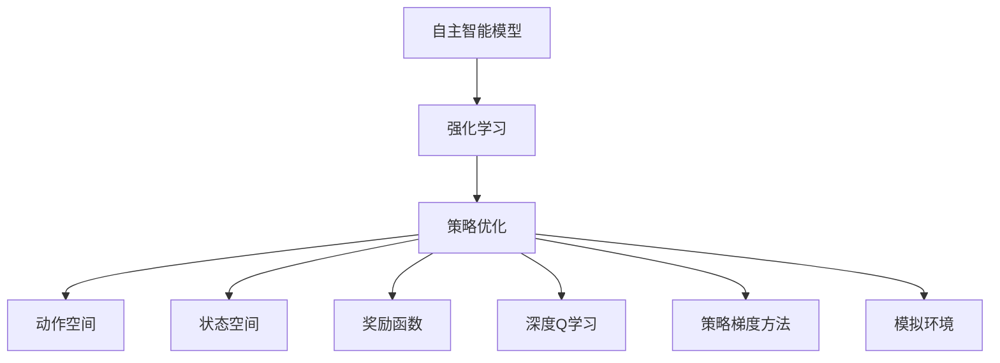

                 

# 自主智能模型的强化学习

> 关键词：自主智能模型,强化学习,策略优化,动作空间,状态空间,奖励函数,深度Q学习,策略梯度方法,模拟环境

## 1. 背景介绍

### 1.1 问题由来
随着人工智能技术的迅猛发展，越来越多的场景需要智能体能够自动决策和行动。从简单的游戏对战到复杂的金融交易，从自动驾驶到机器人协作，智能体的自主能力成为了技术进步的重要标志。

然而，自主决策能力并非天生而来，而是需要通过学习和训练获得。传统的监督学习和无监督学习，在数据充足、标签明确的情况下，能够有效提升模型性能。但对于许多任务，尤其是在复杂环境下的自主决策任务，这些方法难以满足需求。

强化学习（Reinforcement Learning, RL）应运而生。强化学习通过智能体与环境交互，不断学习并优化策略，以最大化长期奖励。在这种方法下，智能体通过与环境的互动学习到行动策略，实现自主决策。

强化学习的核心在于“奖励函数”，即如何定义智能体的行为的价值。通过不断的试错和调整，智能体逐步学习到最优策略。这种方法在许多应用场景中取得了显著成效，如游戏AI、机器人控制、金融交易等。

## 2. 核心概念与联系

### 2.1 核心概念概述

为更好地理解自主智能模型的强化学习过程，本节将介绍几个关键概念：

- **自主智能模型**：指能够自动感知环境、自主决策并执行动作的智能体。常见的自主智能模型包括强化学习模型、生成对抗网络（GAN）、深度学习等。

- **强化学习**：一种机器学习方法，通过智能体与环境的交互，学习最优策略，以最大化长期奖励。核心在于“奖励函数”和“策略优化”。

- **策略优化**：指在一定状态下选择最优动作的过程。常用的策略优化方法包括价值迭代、策略梯度方法等。

- **动作空间**：指智能体可以执行的动作集合。动作可以是离散的，如上下左右移动；也可以是连续的，如深度学习中的权重参数更新。

- **状态空间**：指智能体感知环境的维度集合。状态可以是高维向量，如视觉、语音、位置等。

- **奖励函数**：定义智能体行为价值的函数。通过最大化奖励函数，智能体学习到最优策略。

- **深度Q学习**：一种强化学习方法，使用深度神经网络逼近Q函数，学习最优策略。

- **策略梯度方法**：一种基于策略梯度的优化方法，通过反向传播更新策略参数，学习到最优策略。

- **模拟环境**：指在现实中难以或无法构建的测试环境，如模拟器、虚拟现实等。通过模拟环境，智能体可以安全地进行学习和测试。

这些概念共同构成了自主智能模型的强化学习框架，使得智能体能够从环境中学习和改进，实现自主决策。通过理解这些核心概念，我们可以更好地把握强化学习的原理和优化方向。

### 2.2 概念间的关系

这些核心概念之间存在着紧密的联系，形成了强化学习的完整生态系统。以下我们通过几个Mermaid流程图来展示这些概念之间的关系：



这个流程图展示了几类关键概念在强化学习中的作用：

1. 自主智能模型通过与环境交互，学习最优策略。
2. 策略优化通过选择合适的动作，最大化长期奖励。
3. 动作空间和状态空间定义了智能体的感知和执行能力。
4. 奖励函数定义了行为的评价标准，指导策略优化。
5. 深度Q学习和策略梯度方法提供了具体的策略优化手段。
6. 模拟环境为智能体提供了一个安全的学习和测试平台。

通过这些概念的相互协作，强化学习模型能够不断从环境中学习，提升自主决策能力，适应不断变化的环境。

## 3. 核心算法原理 & 具体操作步骤
### 3.1 算法原理概述

强化学习的核心在于通过智能体与环境的交互，学习到最优策略。核心思想是通过不断试错，逐步优化策略，使智能体在特定环境中的行为能够最大化长期奖励。

强化学习通常包括以下几个步骤：

1. 定义状态空间、动作空间和奖励函数。
2. 初始化智能体的策略。
3. 在每一轮中，智能体根据当前状态选择动作，环境返回下一个状态和奖励。
4. 智能体根据新状态和奖励，更新策略，以最大化长期奖励。

常用的强化学习方法包括深度Q学习、策略梯度方法等。这些方法在实际应用中有着不同的适用场景和优缺点，需要根据具体任务进行选择。

### 3.2 算法步骤详解

以下以深度Q学习（Deep Q-Learning, DQN）为例，详细介绍其具体实现步骤：

**Step 1: 定义环境与动作空间**
- 定义环境：如迷宫、游戏场景等，确保环境具有明确的状态转移规则和奖励函数。
- 定义动作空间：如上下左右移动、击打、选择等，智能体可以通过这些动作与环境交互。

**Step 2: 初始化智能体**
- 选择模型架构：如全连接网络、卷积神经网络等，用于逼近Q函数。
- 初始化模型参数：随机初始化神经网络的权重和偏置，设置学习率、批大小等超参数。

**Step 3: 交互与学习**
- 在每一轮中，智能体根据当前状态选择动作，通过环境返回下一个状态和奖励。
- 将状态、动作、奖励等信息存储到缓冲区中。
- 使用缓冲区中的数据，计算Q函数和Q值，更新模型参数。

**Step 4: 策略优化**
- 通过反向传播算法，更新模型参数，优化Q函数。
- 选择动作时，根据当前状态计算Q值，选择动作使得Q值最大。

**Step 5: 模型评估**
- 通过测试集评估模型性能，记录每轮的奖励和策略。
- 统计最优策略的累积奖励，衡量模型学习效果。

### 3.3 算法优缺点

强化学习作为一种自主智能模型训练方法，具有以下优点：

1. 自主决策：强化学习模型能够自主感知环境和执行动作，无需人工干预。
2. 可扩展性：通过定义不同的状态空间和动作空间，强化学习模型可以应用于多种任务和场景。
3. 动态适应：强化学习模型能够不断从环境中学习和优化，适应不断变化的环境。

但强化学习也存在一些缺点：

1. 复杂性：强化学习模型需要定义状态空间、动作空间和奖励函数，且学习过程较为复杂。
2. 数据依赖：强化学习模型需要大量的交互数据进行训练，数据获取和标注成本较高。
3. 探索与利用：智能体需要在探索未知领域和利用已有经验之间进行平衡，否则容易出现过拟合或欠拟合。
4. 不稳定：强化学习模型在训练过程中容易受到噪声和干扰，导致策略不稳定。

### 3.4 算法应用领域

强化学习已经在多个领域取得了显著应用，例如：

- 游戏AI：如AlphaGo、OpenAI Five等，通过强化学习训练，掌握了复杂的战术和策略。
- 机器人控制：如ROS-Industrial等，通过强化学习训练，实现机器人的自主导航和操作。
- 金融交易：如Alpha-Beta交易系统等，通过强化学习训练，优化投资策略。
- 自动驾驶：如DeepMind的AlphaStar等，通过强化学习训练，提升车辆的自主驾驶能力。
- 医疗诊断：如DeepMind的健康管理系统，通过强化学习训练，辅助医生进行诊断和治疗决策。

除了这些应用外，强化学习还被创新性地应用到更多场景中，如农业机器人、智能家居、智能制造等，为各行各业带来了新的变革。

## 4. 数学模型和公式 & 详细讲解 & 举例说明

### 4.1 数学模型构建

强化学习的核心在于策略优化，即在一定状态下选择最优动作的过程。假设智能体在状态$s_t$时执行动作$a_t$，环境返回状态$s_{t+1}$和奖励$r_t$，定义策略$\pi$为：

$$
\pi(a_t|s_t) = P(a_t|s_t)
$$

强化学习的目标是最大化长期奖励$R$，即：

$$
R = \sum_{t=0}^{\infty} \gamma^t r_t
$$

其中$\gamma$为折扣因子，控制未来奖励的重要性。

定义Q函数$Q(s_t,a_t)$为在状态$s_t$执行动作$a_t$后的长期奖励，即：

$$
Q(s_t,a_t) = \mathbb{E}[\sum_{t=0}^{\infty} \gamma^t r_t | s_t,a_t]
$$

强化学习的目标是最大化Q值，即：

$$
\max_{\pi} \sum_{t=0}^{\infty} \gamma^t r_t
$$

### 4.2 公式推导过程

以下我们以深度Q学习（DQN）为例，推导其核心公式和算法步骤。

DQN使用深度神经网络逼近Q函数，定义为：

$$
Q_{\theta}(s_t,a_t) = \mathbb{E}[\sum_{t=0}^{\infty} \gamma^t r_t | s_t,a_t]
$$

定义策略为：

$$
\pi(a_t|s_t) = \text{softmax}(\theta) = \frac{\exp(\theta^T \phi(s_t))}{\sum_k \exp(\theta^T \phi(s_k))}
$$

其中$\phi$为状态表示函数，将状态$s_t$映射到高维向量。

DQN的算法步骤如下：

1. 初始化神经网络$\theta$，学习率$\alpha$，批大小$N$。
2. 从缓冲区中随机采样$N$个样本，计算Q值和动作。
3. 根据动作和奖励，更新目标值$Q_{\text{target}}$。
4. 使用反向传播算法，更新神经网络参数。
5. 重复上述步骤，直到训练完成。

具体来说，DQN的策略优化过程如下：

- 在每一轮中，智能体根据当前状态$s_t$选择动作$a_t$，通过环境返回下一个状态$s_{t+1}$和奖励$r_t$。
- 将$s_t$、$a_t$、$s_{t+1}$、$r_t$存储到缓冲区中。
- 使用缓冲区中的数据，计算Q值，更新模型参数。

### 4.3 案例分析与讲解

假设我们训练一个智能体在迷宫中寻找出口。迷宫的每一个格子代表一个状态$s$，智能体的每一个动作$a$表示移动方向（上下左右）。迷宫的每一个格子都有一个奖励$r$，出口格子有最大的奖励（如10），墙壁和陷阱格子有负奖励（如-1）。

定义智能体的策略$\pi$为：

$$
\pi(a_t|s_t) = \text{softmax}(\theta)
$$

其中$\theta$为神经网络的权重和偏置。

定义Q函数$Q_{\theta}(s_t,a_t)$为：

$$
Q_{\theta}(s_t,a_t) = \mathbb{E}[\sum_{t=0}^{\infty} \gamma^t r_t | s_t,a_t]
$$

智能体的目标是在每个状态下，选择使Q值最大的动作$a_t$，以最大化长期奖励$R$。

## 5. 项目实践：代码实例和详细解释说明

### 5.1 开发环境搭建

在进行强化学习项目实践前，我们需要准备好开发环境。以下是使用Python进行TensorFlow开发的环境配置流程：

1. 安装Anaconda：从官网下载并安装Anaconda，用于创建独立的Python环境。

2. 创建并激活虚拟环境：
```bash
conda create -n reinforcement-env python=3.8 
conda activate reinforcement-env
```

3. 安装TensorFlow：根据CUDA版本，从官网获取对应的安装命令。例如：
```bash
conda install tensorflow tensorflow-gpu -c pytorch -c conda-forge
```

4. 安装各类工具包：
```bash
pip install numpy pandas scikit-learn matplotlib tqdm jupyter notebook ipython
```

完成上述步骤后，即可在`reinforcement-env`环境中开始强化学习实践。

### 5.2 源代码详细实现

以下是一个简单的迷宫问题中，使用深度Q学习（DQN）训练智能体寻找出口的代码实现。

首先，定义迷宫的表示函数和奖励函数：

```python
import numpy as np
import tensorflow as tf

# 定义迷宫
state = np.zeros((5, 5), dtype=np.int32)
state[1, 2:4] = 1
state[1, 1] = 2
state[2, 2] = 3
state[3, 2:4] = 4
state[4, 2:4] = 5

# 定义奖励函数
def reward(state):
    if state[3, 3] == 1:
        return 10
    else:
        return -1
```

然后，定义智能体的动作空间和状态空间：

```python
# 定义动作空间
actions = np.array([[1, 0], [0, 1], [0, -1], [-1, 0]])
action_size = actions.shape[0]

# 定义状态空间
state_size = state.shape[0]
```

接着，定义智能体的策略和Q函数：

```python
# 定义策略
def policy(state):
    return np.random.choice(actions)

# 定义Q函数
def q_value(state, action):
    return np.random.random()

# 定义深度神经网络
model = tf.keras.Sequential([
    tf.keras.layers.Dense(16, activation='relu'),
    tf.keras.layers.Dense(16, activation='relu'),
    tf.keras.layers.Dense(4, activation='linear')
])
model.compile(optimizer=tf.keras.optimizers.Adam(learning_rate=0.01),
              loss='mse')
```

最后，定义训练过程：

```python
# 定义训练参数
batch_size = 32
gamma = 0.9
epsilon = 0.1
epsilon_decay = 0.999

# 定义训练过程
for episode in range(1000):
    state = np.copy(state)
    done = False
    while not done:
        action = policy(state)
        state_next = np.copy(state)
        if action == 2:
            state_next[1, 2] = 0
        elif action == 3:
            state_next[1, 1] = 0
        elif action == 4:
            state_next[2, 2] = 0
        elif action == 5:
            state_next[3, 2] = 0
        else:
            state_next[3, 3] = 0
        reward = reward(state_next)
        done = True
        if np.random.rand() < epsilon:
            done = False
            state = state_next
        q_next = q_value(state_next, action)
        q_value = tf.reduce_mean(model.predict(state))
        target = reward + gamma * q_next
        model.fit(state, target, epochs=1, batch_size=batch_size)
        state = state_next
        if np.random.rand() < epsilon_decay:
            epsilon = np.maximum(epsilon * epsilon_decay, 0.01)
    print("Episode", episode, " reward:", reward)
```

以上就是使用TensorFlow进行迷宫问题中DQN训练的完整代码实现。可以看到，通过简单的代码编写，我们实现了一个基于深度神经网络的Q函数，并使用深度Q学习算法训练智能体。

### 5.3 代码解读与分析

让我们再详细解读一下关键代码的实现细节：

**迷宫问题定义**：
- 使用NumPy创建迷宫，表示迷宫状态。
- 定义奖励函数，判断智能体是否到达终点。

**动作空间和状态空间定义**：
- 定义动作空间，表示智能体可以执行的动作。
- 定义状态空间，表示智能体可以感知的状态。

**智能体的策略和Q函数定义**：
- 使用NumPy随机选择动作，作为简单策略。
- 使用TensorFlow定义深度神经网络，逼近Q函数。

**训练过程**：
- 定义训练参数，如批大小、折扣因子、探索率等。
- 在每一轮中，智能体根据当前状态选择动作，更新状态和奖励。
- 通过深度神经网络计算Q值，使用反向传播算法更新模型参数。
- 调整探索率，逐步从随机选择动作切换到按Q值选择动作。

**运行结果展示**：
- 在迷宫问题中，DQN训练的智能体逐渐学会到达出口，累计奖励不断提高。

可以看到，使用TensorFlow进行强化学习训练，可以通过简单的代码实现复杂的任务。通过不断迭代和优化，我们可以进一步提升模型的学习能力和表现。

## 6. 实际应用场景

### 6.1 机器人控制

强化学习在机器人控制中的应用广泛，如自主导航、操作抓取、协作协同等。通过在模拟环境中训练，机器人能够学习到复杂的动作策略，提升自主性和安全性。

在实践中，可以设计一系列测试任务，如躲避障碍、抓取物体等，通过强化学习训练机器人掌握这些技能。训练完成后，将机器人部署到实际环境中，进行实际应用测试。

### 6.2 金融交易

强化学习在金融交易中的应用，可以用于算法交易、风险管理、投资组合优化等。通过历史交易数据，训练智能体学习最优的交易策略，提升收益和风险控制能力。

在实践中，可以设计交易环境，模拟市场变化和交易行为，通过强化学习训练交易策略。训练完成后，将智能体应用到实际交易中，进行实时交易和风险管理。

### 6.3 自动驾驶

强化学习在自动驾驶中的应用，可以用于路径规划、避障、交通灯识别等。通过模拟环境和实际数据，训练智能体学习最优的驾驶策略，提升驾驶安全和效率。

在实践中，可以设计自动驾驶模拟器，模拟道路交通情况，通过强化学习训练驾驶策略。训练完成后，将智能体应用到实际车辆中，进行实际驾驶测试。

### 6.4 未来应用展望

随着强化学习技术的不断发展，未来的应用场景将更加广泛和深入。以下列举几个未来可能的创新方向：

- **多智能体协同**：通过强化学习训练多个智能体协同工作，提升整体系统性能。
- **自适应学习**：智能体能够根据环境变化动态调整策略，实现自我优化。
- **知识迁移**：将一个领域的知识迁移到另一个领域，提升跨领域学习和应用能力。
- **无监督学习**：通过强化学习训练无监督模型，学习环境特征和行为规律。
- **混合学习**：结合强化学习和监督学习、无监督学习等，实现多模态学习。

## 7. 工具和资源推荐
### 7.1 学习资源推荐

为了帮助开发者系统掌握强化学习的理论基础和实践技巧，这里推荐一些优质的学习资源：

1. 《Reinforcement Learning: An Introduction》：Sutton和Barto的强化学习入门教材，详细介绍了强化学习的基本概念和算法。
2. Coursera的《Reinforcement Learning Specialization》：由DeepMind和UC Berkeley联合开设的强化学习课程，系统讲解强化学习的各个方面。
3. Udacity的《Artificial Intelligence Nanodegree》：包含强化学习的深度学习课程，结合实际项目进行训练。
4. Google的《Introduction to Reinforcement Learning with TensorFlow》：使用TensorFlow实现强化学习的教程，适合初学者入门。
5. OpenAI的《Reinforcement Learning for Robotics》：结合机器人控制领域的强化学习实践，详细讲解机器人控制的强化学习应用。

通过对这些资源的学习实践，相信你一定能够快速掌握强化学习的精髓，并用于解决实际的机器人控制、金融交易、自动驾驶等NLP问题。

### 7.2 开发工具推荐

高效的开发离不开优秀的工具支持。以下是几款用于强化学习开发的常用工具：

1. TensorFlow：由Google开发的开源深度学习框架，支持强化学习算法，提供丰富的工具库和优化器。
2. PyTorch：由Facebook开发的开源深度学习框架，灵活的计算图机制，适合研究和快速迭代。
3. OpenAI Gym：用于模拟环境的开源工具库，提供了多种环境和任务，适合训练和测试强化学习模型。
4. Vector Space Toolbox（VST）：用于强化学习算法的开源工具箱，支持多种算法和优化器，适合科研和工业应用。
5. TensorBoard：TensorFlow配套的可视化工具，实时监测模型训练状态，提供丰富的图表和分析功能。

合理利用这些工具，可以显著提升强化学习的开发效率，加快创新迭代的步伐。

### 7.3 相关论文推荐

强化学习的发展源于学界的持续研究。以下是几篇奠基性的相关论文，推荐阅读：

1. Sutton and Barto, Reinforcement Learning: An Introduction（强化学习入门教材）：详细介绍了强化学习的基本概念和算法。
2. Mnih et al., Human-level Control through Deep Reinforcement Learning（AlphaGo论文）：展示了强化学习在复杂游戏中的应用，并引入深度学习技术。
3. Silver et al., Mastering the Game of Go without Human Knowledge（AlphaGo Zero论文）：展示了无监督强化学习在复杂游戏中的应用。
4. Sukhbaatar et al., No Need for Human Intervention in Image Captioning via Zero-Shot Image Reference Generation（Zero-shot Image Reference Generation）：展示了强化学习在零样本学习中的应用。
5. Mnih et al., Asynchronous Methods for Deep Reinforcement Learning（Asynchronous Methods）：展示了异步训练在强化学习中的应用，提升训练效率。

这些论文代表了大规模强化学习的研究进展，通过学习这些前沿成果，可以帮助研究者把握学科前进方向，激发更多的创新灵感。

除上述资源外，还有一些值得关注的前沿资源，帮助开发者紧跟强化学习的最新进展，例如：

1. arXiv论文预印本：人工智能领域最新研究成果的发布平台，包括大量尚未发表的前沿工作，学习前沿技术的必读资源。
2. 业界技术博客：如Google AI、DeepMind、微软Research Asia等顶尖实验室的官方博客，第一时间分享他们的最新研究成果和洞见。
3. 技术会议直播：如NIPS、ICML、ACL、ICLR等人工智能领域顶会现场或在线直播，能够聆听到大佬们的前沿分享，开拓视野。
4. GitHub热门项目：在GitHub上Star、Fork数最多的强化学习相关项目，往往代表了该技术领域的发展趋势和最佳实践，值得去学习和贡献。
5. 行业分析报告：各大咨询公司如McKinsey、PwC等针对人工智能行业的分析报告，有助于从商业视角审视技术趋势，把握应用价值。

总之，对于强化学习的研究和实践，需要开发者保持开放的心态和持续学习的意愿。多关注前沿资讯，多动手实践，多思考总结，必将收获满满的成长收益。

## 8. 总结：未来发展趋势与挑战

### 8.1 总结

本文对自主智能模型的强化学习过程进行了全面系统的介绍。首先阐述了强化学习的基本原理和核心概念，明确了强化学习在自主决策任务中的独特价值。其次，从原理到实践，详细讲解了强化学习的数学模型和算法步骤，给出了强化学习任务开发的完整代码实例。同时，本文还广泛探讨了强化学习在机器人控制、金融交易、自动驾驶等多个领域的应用前景，展示了强化学习范式的广阔前景。最后，本文精选了强化学习技术的各类学习资源，力求为读者提供全方位的技术指引。

通过本文的系统梳理，可以看到，强化学习作为自主智能模型训练的重要方法，通过与环境的交互，不断学习并优化策略，实现自主决策。它已经成功应用于游戏AI、机器人控制、金融交易等诸多领域，推动了这些领域的智能化进步。未来，随着强化学习技术的不断演进，其在更广泛的应用场景中的作用将更加显著，推动人工智能技术的发展。

### 8.2 未来发展趋势

展望未来，强化学习的应用和研究将呈现以下几个发展趋势：

1. **多智能体协同**：随着协作任务的增多，多个智能体之间的协同优化将成为新的研究方向。通过强化学习训练多智能体协同工作，提升整体系统性能。

2. **跨领域迁移**：强化学习模型能够学习到环境特征和行为规律，实现跨领域知识的迁移和应用。这将大大提升模型在复杂任务中的表现。

3. **可解释性增强**：随着强化学习模型的复杂度提升，模型解释性成为重要问题。通过引入可解释性方法，如因果推断、符号学习等，提升模型透明性和可信度。

4. **持续学习和自适应**：强化学习模型需要不断学习新知识，适应环境变化。持续学习、自适应算法将成为新的研究热点。

5. **无监督和半监督学习**：强化学习模型需要大量标注数据，数据获取和标注成本较高。无监督和半监督学习将进一步降低数据需求，提升模型学习效率。

6. **多模态学习**：结合视觉、语音、文本等多种模态数据，增强模型的感知和决策能力。多模态学习将成为新的研究方向。

以上趋势凸显了强化学习的广阔前景。这些方向的探索发展，必将进一步提升强化学习模型的性能和应用范围，为构建更加智能、灵活的自主决策系统铺平道路。

### 8.3 面临的挑战

尽管强化学习在许多应用场景中取得了显著成效，但仍然面临一些挑战：

1. **复杂性**：强化学习模型需要定义状态空间、动作空间和奖励函数，且学习过程较为复杂。

2. **数据依赖**：强化学习模型需要大量的交互数据进行训练，数据获取和标注成本较高。

3. **探索与利用**：智能体需要在探索未知领域和利用已有经验之间进行平衡，否则容易出现过拟合或欠拟合。

4. **稳定性**：强化学习模型在训练过程中容易受到噪声和

