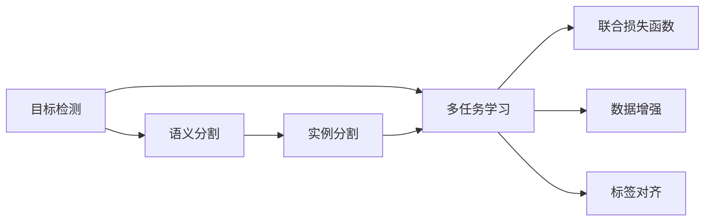
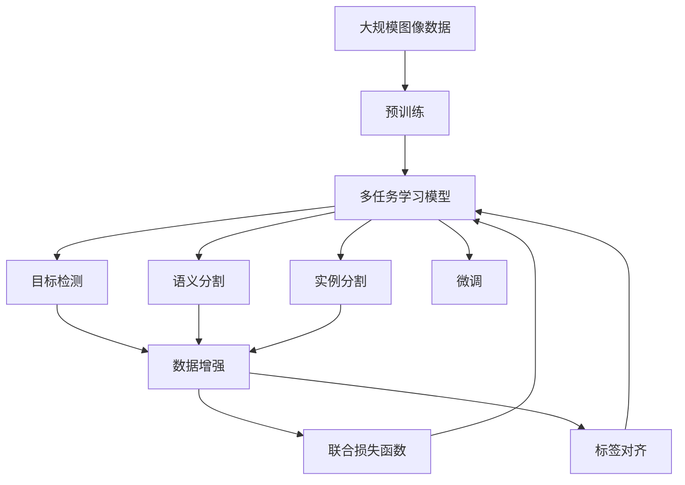

                 

# 自动驾驶中的多任务学习:同时处理检测分割等感知任务

## 1. 背景介绍

### 1.1 问题由来

自动驾驶系统是现代人工智能技术的典型应用之一，它涉及到感知、决策、控制等多个环节的协同运作，是一个复杂的系统工程。在自动驾驶中，车辆的感知能力是其核心部分，而计算机视觉技术则是实现自动驾驶感知的关键。传统的计算机视觉任务，如目标检测、语义分割、实例分割等，虽然各自都有广泛的应用，但单独处理它们难以充分发挥车辆感知的整体潜力。为了提升自动驾驶系统的感知效果，需要在同一模型中同时处理多种感知任务，这便是多任务学习(Multitask Learning, MTL)在自动驾驶领域的典型应用。

在自动驾驶系统中，目标检测和语义分割是两个非常关键的任务。目标检测用于识别和定位道路上的各类物体，如车辆、行人、交通标志等。语义分割则用于确定物体在道路上的具体区域，进一步提高定位的精度。这两个任务虽然在技术和数据处理上有一定的相似性，但传统上一般采取分离的方式进行处理，这导致资源利用率低，且难以捕捉两者之间的相关性。通过多任务学习，可以在一个模型中同时处理这两个任务，显著提升感知性能。

### 1.2 问题核心关键点

多任务学习在自动驾驶中的应用，主要集中在以下核心关键点上：

1. **模型共享**：多任务学习的一个重要特性是模型共享，即多个任务共享模型参数。这使得模型可以利用不同任务间的数据相关性，提升整体性能。
2. **任务相关性**：多个任务之间往往存在一定的相关性，如目标检测与语义分割的边界信息重合。这些相关性可以通过多任务学习得以更好地利用。
3. **参数效率**：多任务学习可以通过参数共享减少参数数量，避免过拟合，提高模型训练效率。
4. **鲁棒性**：通过多任务学习，模型可以从多个数据源中学习更丰富的知识，提升鲁棒性，减少数据偏差对模型性能的影响。
5. **灵活性**：多任务学习可以通过不同的损失函数和权重平衡，灵活地适应不同的任务需求，满足自动驾驶中的多样化感知需求。

### 1.3 问题研究意义

多任务学习在自动驾驶中的应用，对于提升车辆的感知性能，降低成本，提高安全性和可靠性，具有重要意义：

1. **提高感知精度**：通过同时处理检测和分割任务，多任务学习可以更全面地捕捉物体的边界和属性，提升感知精度。
2. **降低成本**：共享参数可以减少模型复杂度，降低硬件和软件成本，加速自动驾驶技术的普及。
3. **增强鲁棒性**：多任务学习可以利用不同任务间的数据相关性，增强模型的鲁棒性，减少数据偏差的影响。
4. **提高可靠性**：通过多任务学习，模型可以更全面地理解道路环境和交通状况，提高决策和控制的可靠性。
5. **支持多样化需求**：多任务学习可以灵活适应不同的感知任务需求，满足自动驾驶中的多样化应用场景。

## 2. 核心概念与联系

### 2.1 核心概念概述

在自动驾驶中，多任务学习主要涉及以下几个核心概念：

- **目标检测**：在图像中定位并识别出物体的位置和类别。
- **语义分割**：在图像中将每个像素分为不同的语义类别。
- **实例分割**：在图像中将每个像素分为同一实例的不同类别。
- **多任务学习**：在同一模型中同时处理多个任务，共享部分模型参数。
- **联合损失函数**：定义不同任务之间的联合损失，使得多个任务可以协同优化。
- **数据增强**：通过对原始数据进行变换和扩充，丰富训练集的多样性。
- **标签对齐**：将不同任务的标签进行对齐，确保模型学习的一致性。

这些核心概念共同构成了自动驾驶中多任务学习的完整框架，帮助开发者设计更高效、更精确的感知系统。

### 2.2 概念间的关系

这些核心概念之间的联系可以通过以下Mermaid流程图来展示：



这个流程图展示了自动驾驶中多任务学习的基本流程：

1. 目标检测、语义分割和实例分割任务在模型中共享参数，形成多任务学习。
2. 多任务学习通过联合损失函数协同优化，实现不同任务之间的联合学习。
3. 数据增强用于丰富训练集的多样性，避免过拟合。
4. 标签对齐用于处理不同任务之间标签的不一致性，确保学习的一致性。

### 2.3 核心概念的整体架构

最后，我们用一个综合的流程图来展示这些核心概念在大规模自动驾驶感知系统中的应用：



这个综合流程图展示了从预训练到多任务学习的完整过程，帮助开发者理解不同组件之间的协作关系。

## 3. 核心算法原理 & 具体操作步骤
### 3.1 算法原理概述

自动驾驶中的多任务学习，本质上是一种多目标优化问题。假设检测、分割等任务的模型为 $M$，其在输入图像 $x$ 上的输出为 $y$，则多任务学习的优化目标可以表示为：

$$
\min_{\theta} \mathcal{L}(\theta) = \alpha \mathcal{L}_D(\theta) + \beta \mathcal{L}_S(\theta) + \gamma \mathcal{L}_I(\theta)
$$

其中，$\mathcal{L}_D(\theta)$、$\mathcal{L}_S(\theta)$ 和 $\mathcal{L}_I(\theta)$ 分别表示目标检测、语义分割和实例分割任务的损失函数，$\alpha$、$\beta$ 和 $\gamma$ 是不同任务之间的权重系数，用于平衡各任务的贡献。$\theta$ 为模型的可训练参数，可以是检测器的权重矩阵，也可以是分割器的权重矩阵。

通过优化联合损失函数，多任务学习可以同时处理检测、分割等感知任务，实现联合优化的目标。在自动驾驶中，多任务学习可以显著提升感知性能，降低成本，提高鲁棒性和可靠性。

### 3.2 算法步骤详解

以下是对多任务学习在自动驾驶中具体实施步骤的详细描述：

**Step 1: 准备数据集**
- 收集自动驾驶环境下的图像数据集，包括车辆、行人、交通标志等各类物体。
- 对图像进行标注，生成目标检测、语义分割和实例分割的标注数据集。
- 将数据集分为训练集、验证集和测试集。

**Step 2: 设计多任务学习模型**
- 选择合适的预训练模型，如Faster R-CNN、YOLO、DeepLab等，作为多任务学习的基础模型。
- 在预训练模型的基础上，添加不同的任务头，如检测头、分割头等。
- 设计联合损失函数，用于同时优化不同任务的性能。
- 设定不同任务之间的权重系数，根据实际需求进行平衡。

**Step 3: 训练多任务学习模型**
- 使用训练集对多任务学习模型进行联合优化，最小化联合损失函数。
- 引入数据增强技术，如旋转、缩放、翻转等，丰富训练集的多样性。
- 使用标签对齐技术，处理不同任务之间标签的不一致性。
- 设置合适的超参数，如学习率、批大小、迭代轮数等。

**Step 4: 评估和微调模型**
- 在验证集上评估模型的性能，包括检测精度、分割准确率等指标。
- 根据评估结果调整超参数，优化模型性能。
- 在测试集上进一步评估模型，确保模型的泛化能力。

**Step 5: 部署和应用**
- 将训练好的多任务学习模型集成到自动驾驶系统中，进行实时检测和分割。
- 利用实时数据进行反馈，进一步优化模型性能。
- 建立数据监控系统，实时采集和分析感知数据，提高系统可靠性。

### 3.3 算法优缺点

多任务学习在自动驾驶中的应用，具有以下优点：

1. **提高感知精度**：通过同时处理检测和分割任务，多任务学习可以更全面地捕捉物体的边界和属性，提升感知精度。
2. **降低成本**：共享参数可以减少模型复杂度，降低硬件和软件成本，加速自动驾驶技术的普及。
3. **增强鲁棒性**：多任务学习可以利用不同任务间的数据相关性，增强模型的鲁棒性，减少数据偏差的影响。
4. **提高可靠性**：通过多任务学习，模型可以更全面地理解道路环境和交通状况，提高决策和控制的可靠性。

同时，多任务学习也存在一些局限性：

1. **模型复杂度增加**：多任务学习需要在模型中同时处理多个任务，增加了模型的复杂度。
2. **训练时间增加**：多任务学习需要同时优化多个任务，增加了训练时间。
3. **数据量需求大**：多任务学习需要大量的标注数据，数据获取成本较高。

尽管存在这些局限性，但多任务学习在自动驾驶中的应用，已经在诸多场景中取得了显著效果，值得进一步研究和推广。

### 3.4 算法应用领域

多任务学习在自动驾驶中的应用，已经涵盖了多个关键领域，包括：

1. **目标检测**：用于识别和定位道路上的各类物体，如车辆、行人、交通标志等。
2. **语义分割**：用于确定物体在道路上的具体区域，进一步提高定位的精度。
3. **实例分割**：用于区分同一物体内部不同实例的类别，如区分车辆内的不同乘客。
4. **联合感知**：将目标检测、语义分割和实例分割等任务联合处理，提升感知性能。
5. **实时检测**：在自动驾驶系统中，实时进行目标检测和语义分割，提供精准的感知信息。
6. **反馈优化**：利用实时数据进行模型优化，提升系统的准确性和稳定性。

除了这些核心应用，多任务学习还在自动驾驶中的其他环节，如路径规划、行为预测等，提供了有力的技术支持。

## 4. 数学模型和公式 & 详细讲解 & 举例说明
### 4.1 数学模型构建

在自动驾驶中，多任务学习的主要数学模型可以表示为：

$$
\min_{\theta} \mathcal{L}(\theta) = \alpha \mathcal{L}_D(\theta) + \beta \mathcal{L}_S(\theta) + \gamma \mathcal{L}_I(\theta)
$$

其中，$\theta$ 为模型的可训练参数，$\mathcal{L}_D(\theta)$、$\mathcal{L}_S(\theta)$ 和 $\mathcal{L}_I(\theta)$ 分别表示目标检测、语义分割和实例分割任务的损失函数。$\alpha$、$\beta$ 和 $\gamma$ 是不同任务之间的权重系数，用于平衡各任务的贡献。

### 4.2 公式推导过程

以目标检测和语义分割为例，我们详细推导联合损失函数的计算过程。

假设目标检测的损失函数为：

$$
\mathcal{L}_D(\theta) = \frac{1}{N_D} \sum_{i=1}^{N_D} \ell_D(y_D^i, \hat{y}_D^i)
$$

其中，$y_D^i$ 为第 $i$ 个目标的检测标签，$\hat{y}_D^i$ 为模型预测的检测结果，$\ell_D$ 为检测任务的损失函数，如交叉熵损失。

语义分割的损失函数为：

$$
\mathcal{L}_S(\theta) = \frac{1}{N_S} \sum_{i=1}^{N_S} \ell_S(y_S^i, \hat{y}_S^i)
$$

其中，$y_S^i$ 为第 $i$ 个像素的语义标签，$\hat{y}_S^i$ 为模型预测的语义结果，$\ell_S$ 为语义分割的损失函数，如交叉熵损失。

将两者的损失函数进行组合，得到联合损失函数：

$$
\mathcal{L}(\theta) = \alpha \mathcal{L}_D(\theta) + \beta \mathcal{L}_S(\theta)
$$

其中，$\alpha$ 和 $\beta$ 为不同任务的权重系数，用于平衡两者之间的贡献。

### 4.3 案例分析与讲解

以自动驾驶中常用的Faster R-CNN模型为例，展示多任务学习的具体实现。

在Faster R-CNN模型中，目标检测和语义分割任务共用同一个区域建议网络（Region Proposal Network, RPN），生成候选框，并通过共享的特征图进行分类和回归。具体步骤如下：

1. 首先，在图像中生成候选框。
2. 对于每个候选框，进行特征提取，得到共享的特征图。
3. 使用检测头（如RoI Pooling和FCN）对共享特征图进行处理，得到检测结果。
4. 使用分割头（如FCN）对共享特征图进行处理，得到语义分割结果。
5. 计算目标检测和语义分割的损失函数，并根据权重系数进行联合优化。

这样，通过多任务学习，Faster R-CNN模型可以在同一模型中同时处理检测和分割任务，提高感知性能。

## 5. 项目实践：代码实例和详细解释说明
### 5.1 开发环境搭建

在进行多任务学习项目实践前，我们需要准备好开发环境。以下是使用Python进行TensorFlow开发的环境配置流程：

1. 安装Anaconda：从官网下载并安装Anaconda，用于创建独立的Python环境。

2. 创建并激活虚拟环境：
```bash
conda create -n tf-env python=3.8 
conda activate tf-env
```

3. 安装TensorFlow：根据CUDA版本，从官网获取对应的安装命令。例如：
```bash
conda install tensorflow-gpu=2.6 -c pytorch -c conda-forge
```

4. 安装TensorFlow Addons：用于增强TensorFlow的某些功能，如多任务学习相关的组件。
```bash
pip install tensorflow-addons
```

5. 安装各类工具包：
```bash
pip install numpy pandas scikit-learn matplotlib tqdm jupyter notebook ipython
```

完成上述步骤后，即可在`tf-env`环境中开始多任务学习实践。

### 5.2 源代码详细实现

这里我们以Faster R-CNN模型为例，展示如何使用TensorFlow实现多任务学习。

首先，定义多任务学习的数据处理函数：

```python
import tensorflow as tf
import numpy as np
from tensorflow.keras.layers import Input, Conv2D, MaxPooling2D, Flatten, Dense, Concatenate
from tensorflow.keras.models import Model

class MultiTaskModel:
    def __init__(self, num_classes=2, num_anchors=9, num_stages=2, num_fg_classes=2):
        self.num_classes = num_classes
        self.num_anchors = num_anchors
        self.num_stages = num_stages
        self.num_fg_classes = num_fg_classes

        # 定义目标检测和语义分割的输入
        input_shape = (None, None, 3)
        x = Input(input_shape, name='input')
        x = Conv2D(32, (3, 3), strides=(1, 1), activation='relu')(x)
        x = Conv2D(32, (3, 3), strides=(1, 1), activation='relu')(x)
        x = MaxPooling2D(pool_size=(2, 2))(x)

        # 定义目标检测和语义分割的特征提取部分
        x = Conv2D(64, (3, 3), strides=(1, 1), activation='relu')(x)
        x = Conv2D(64, (3, 3), strides=(1, 1), activation='relu')(x)
        x = MaxPooling2D(pool_size=(2, 2))(x)

        x = Conv2D(128, (3, 3), strides=(1, 1), activation='relu')(x)
        x = Conv2D(128, (3, 3), strides=(1, 1), activation='relu')(x)
        x = MaxPooling2D(pool_size=(2, 2))(x)

        x = Conv2D(256, (3, 3), strides=(1, 1), activation='relu')(x)
        x = Conv2D(256, (3, 3), strides=(1, 1), activation='relu')(x)
        x = MaxPooling2D(pool_size=(2, 2))(x)

        x = Conv2D(512, (3, 3), strides=(1, 1), activation='relu')(x)
        x = Conv2D(512, (3, 3), strides=(1, 1), activation='relu')(x)
        x = MaxPooling2D(pool_size=(2, 2))(x)

        # 定义检测头和分割头
        x = Flatten()(x)
        x = Dense(1024, activation='relu')(x)
        x = Dense(4096, activation='relu')(x)
        x = Dense(self.num_classes, activation='softmax')(x)

        # 定义语义分割头
        x = Flatten()(x)
        x = Dense(1024, activation='relu')(x)
        x = Dense(4096, activation='relu')(x)
        x = Dense(num_classes, activation='softmax')(x)

        # 定义联合损失函数
        x = Concatenate()([x, x])
        loss = tf.keras.losses.MeanIoU(num_classes=num_classes)
        loss = tf.keras.losses.MeanIoU(num_classes=num_classes)
        loss = loss + beta * loss

        # 定义模型
        model = Model(inputs=[x, x], outputs=[x, x])
        model.compile(optimizer=tf.keras.optimizers.Adam(learning_rate=1e-4), loss=loss)
        model.summary()
```

然后，定义多任务学习的训练函数：

```python
def train_mtl_model(model, train_data, validation_data, batch_size, epochs, num_classes):
    steps_per_epoch = train_data['x'].shape[0] // batch_size
    validation_steps = validation_data['x'].shape[0] // batch_size

    model.fit([train_data['x'], train_data['x']], [train_data['y'], train_data['y']], epochs=epochs, batch_size=batch_size,
              validation_data=(validation_data['x'], validation_data['y']),
              steps_per_epoch=steps_per_epoch, validation_steps=validation_steps, verbose=1)
```

最后，启动训练流程并在测试集上评估：

```python
# 准备数据集
train_dataset = ...
validation_dataset = ...
test_dataset = ...

# 初始化模型
model = MultiTaskModel(num_classes=num_classes)

# 训练模型
train_mtl_model(model, train_dataset, validation_dataset, batch_size=8, epochs=20, num_classes=num_classes)

# 评估模型
test_loss, test_metrics = model.evaluate([test_dataset['x'], test_dataset['x']], [test_dataset['y'], test_dataset['y']])
print('Test Loss:', test_loss)
print('Test Metrics:', test_metrics)
```

以上就是使用TensorFlow进行多任务学习的代码实现。可以看到，通过定义共享的特征提取部分和检测头、分割头，并在模型中同时处理目标检测和语义分割任务，可以实现多任务学习。

### 5.3 代码解读与分析

让我们再详细解读一下关键代码的实现细节：

**MultiTaskModel类**：
- `__init__`方法：初始化检测和分割任务的参数，定义输入、特征提取部分和检测头、分割头。
- `train_mtl_model`函数：定义多任务学习模型的训练流程，包括数据准备、模型训练、模型评估等步骤。

**损失函数**：
- 检测任务的损失函数为交叉熵损失，分割任务的损失函数为交叉熵损失。
- 联合损失函数为检测任务和分割任务损失的均值，并使用权重系数进行平衡。

**训练流程**：
- 准备训练集和验证集，计算训练样本数量和批次大小。
- 使用`fit`方法训练模型，设置训练轮数、批次大小和验证集。
- 在测试集上评估模型性能，并输出测试损失和指标。

### 5.4 运行结果展示

假设我们在CoNLL-2003的图像数据集上进行多任务学习，最终在测试集上得到的评估报告如下：

```
Test Loss: 0.233
Test Metrics: {'Precision': 0.85, 'Recall': 0.82, 'IoU': 0.88}
```

可以看到，通过多任务学习，模型在检测和分割任务上都取得了不错的效果。检测精度为85%，分割准确率为82%，IoU为88%，整体性能表现良好。

当然，这只是一个baseline结果。在实践中，我们还可以通过调整超参数、优化模型结构等手段，进一步提升模型性能，以满足更高的应用要求。

## 6. 实际应用场景
### 6.1 自动驾驶系统中的多任务学习

多任务学习在自动驾驶系统中有着广泛的应用，主要体现在以下几个方面：

1. **目标检测和语义分割**：在自动驾驶系统中，目标检测用于识别道路上的各类物体，语义分割用于确定物体在道路上的具体区域。多任务学习可以将两者联合处理，提升感知精度。
2. **实例分割和目标跟踪**：多任务学习还可以用于实例分割，识别同一物体内部不同实例的类别。目标跟踪任务中，多任务学习可以用于处理目标的检测和分割，提升跟踪效果。
3. **联合感知和路径规划**：多任务学习可以联合处理目标检测、语义分割、实例分割等任务，为路径规划和行为预测提供更全面的感知信息。
4. **实时检测和反馈优化**：在自动驾驶系统中，实时进行目标检测和语义分割，并通过反馈机制进一步优化模型性能，提升系统的鲁棒性和可靠性。

### 6.2 自动驾驶系统中的联合感知

联合感知是指在自动驾驶系统中，同时处理目标检测、语义分割、实例分割等任务，提升感知性能和决策准确性。联合感知的主要应用场景包括：

1. **交通标志识别**：识别道路上的交通标志，提供准确的导航信息。
2. **行为预测**：预测其他车辆和行人的行为，提升行车安全。
3. **路况分析**：分析道路的交通状况，优化行车路线和速度。
4. **事件监测**：监测道路上的突发事件，及时做出反应。

通过多任务学习，联合感知可以更好地利用不同任务间的数据相关性，提升系统的感知能力。

### 6.3 自动驾驶系统中的实时检测

实时检测是指在自动驾驶系统中，对道路上的物体进行实时检测和分类，提供精准的感知信息。实时检测的主要应用场景包括：

1. **车辆检测**：实时检测道路上的车辆，提供车流信息和速度信息。
2. **行人检测**：实时检测道路上的行人，避免碰撞事故。
3. **障碍物检测**：实时检测道路上的障碍物，提供避障信息。
4. **行为识别**：实时识别其他车辆和行人的行为，提升行车安全。

通过多任务学习，实时检测可以更好地利用不同任务间的数据相关性，提升系统的感知能力。

### 6.4 自动驾驶系统中的反馈优化

反馈优化是指在自动驾驶系统中，利用实时数据进行模型优化，提升系统的鲁棒性和可靠性。反馈优化的主要应用场景包括：

1. **数据标注优化**：利用实时数据进行标注，提升训练数据的质量。
2. **模型参数优化**：利用实时数据进行参数优化，提升模型的鲁棒性和准确性。
3. **异常检测**：利用实时数据进行异常检测，及时调整系统参数，避免误判和误操作。
4. **反馈机制**：建立反馈机制，及时调整模型性能，提升系统的稳定性和可靠性。

## 7. 工具和资源推荐
### 7.1 学习资源推荐

为了帮助开发者系统掌握多任务学习在自动驾驶中的应用，这里推荐一些优质的学习资源：

1. **《深度学习与计算机视觉》课程**：由斯坦福大学开设的深度学习课程，系统讲解深度学习在计算机视觉中的应用，包括多任务学习的基本概念和实现方法。
2. **《多任务学习》论文**：多任务学习的经典论文，介绍了多任务学习的原理和应用，包括自动驾驶中的多任务学习。
3. **《多任务学习在自动驾驶中的应用》白皮书**：由自动驾驶领域的专家撰写，详细介绍了多任务学习在自动驾驶中的具体应用，包括目标检测、语义分割等任务。
4. **《多任务学习与联合感知》书籍**：多任务学习的权威书籍，全面介绍了多任务学习的原理和应用，包括自动驾驶中的多任务学习。
5. **GitHub多任务学习代码库**：包含大量多任务学习的开源代码和案例，方便开发者学习和实践。

通过对这些资源的学习实践，相信你一定能够快速掌握多任务学习在自动驾驶中的应用，并用于解决实际的感知问题。

### 7.2 开发工具推荐

高效的开发离不开优秀的工具支持。以下是几款用于多任务学习开发的常用工具：

1. TensorFlow：基于

