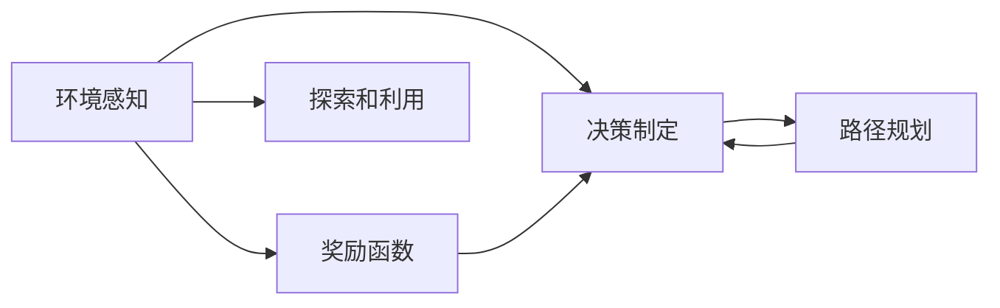

                 

# 自动驾驶中的强化学习方法

> 关键词：自动驾驶, 强化学习, 环境感知, 决策制定, 路径规划, 智能交通

## 1. 背景介绍

随着人工智能技术的飞速发展，自动驾驶技术逐渐成为智能交通领域的一个重要方向。强化学习（Reinforcement Learning, RL）作为人工智能的一种重要分支，在自动驾驶领域有着广泛的应用。通过强化学习，自动驾驶车辆可以学习如何在复杂多变的交通环境中进行环境感知、决策制定和路径规划，从而实现安全、高效的自动驾驶。

## 2. 核心概念与联系

### 2.1 核心概念概述

在自动驾驶中，强化学习主要涉及以下几个核心概念：

- 环境感知（Perception）：自动驾驶车辆需要感知周围环境，包括车辆、行人、交通标志等。这可以通过计算机视觉、激光雷达等传感器来实现。

- 决策制定（Decision-making）：自动驾驶车辆需要根据感知到的环境信息，制定驾驶决策。这包括加速、减速、变道、停车等操作。

- 路径规划（Path Planning）：自动驾驶车辆需要规划出一条安全的行驶路径，避开障碍物，到达目的地。

- 奖励函数（Reward Function）：强化学习的核心是奖励函数，用于评估和指导决策。奖励函数定义了自动驾驶车辆在特定行为下的收益或损失。

- 探索和利用（Exploration and Exploitation）：在强化学习中，自动驾驶车辆需要在探索新路径和利用已有经验之间找到平衡。

这些核心概念之间存在紧密的联系，共同构成了自动驾驶中的强化学习框架。通过对这些概念的理解，我们可以更好地掌握强化学习在自动驾驶中的应用。

### 2.2 核心概念的关系

下图展示了自动驾驶中强化学习的核心概念及其之间的关系：



这个流程图展示了环境感知、决策制定、路径规划、奖励函数和探索利用之间的关系。环境感知和奖励函数是决策制定的输入，路径规划是决策制定的输出。探索和利用是强化学习的两个核心策略，用于平衡模型对新路径的探索和已有路径的利用。

## 3. 核心算法原理 & 具体操作步骤

### 3.1 算法原理概述

强化学习的核心思想是通过试错的方式，让自动驾驶车辆在不断尝试和调整中学习最优的驾驶策略。具体来说，强化学习包括以下几个步骤：

1. **状态观察（Observation）**：自动驾驶车辆感知周围环境，得到一个状态表示。

2. **决策制定（Action Selection）**：根据当前状态，选择一种可能的驾驶行为。

3. **环境交互（Interaction）**：自动驾驶车辆执行所选行为，并观察到新的状态和奖励。

4. **奖励评估（Reward Evaluation）**：根据新的状态和行为，计算一个奖励值，用于指导后续的决策。

5. **模型更新（Model Update）**：根据奖励值和当前状态，更新决策制定模型，以获得更好的驾驶策略。

### 3.2 算法步骤详解

#### 3.2.1 环境感知

环境感知是强化学习的第一步，涉及传感器数据处理和状态表示。以下是常见的环境感知方法：

- 计算机视觉：使用摄像头和深度学习模型，提取交通标志、车辆、行人等目标。

- 激光雷达：使用激光雷达传感器，获取车辆周围的三维点云数据，用于构建车辆周围的环境地图。

- 雷达：使用雷达传感器，获取车辆周围的声音和电磁波信号，用于检测障碍物的距离和速度。

#### 3.2.2 决策制定

决策制定是强化学习的核心步骤，涉及模型选择和行为选择。以下是常见的决策制定方法：

- 深度强化学习：使用深度神经网络作为决策制定模型，通过反向传播算法更新模型参数。

- 传统强化学习：使用经典强化学习算法（如Q-learning、SARSA），通过状态-动作-奖励-状态-动作（SARS）序列进行模型更新。

#### 3.2.3 路径规划

路径规划是自动驾驶的关键步骤，涉及路径搜索和路径优化。以下是常见的路径规划方法：

- A*算法：一种基于图搜索的路径规划算法，通过启发式函数计算路径评估值，搜索最优路径。

- D*算法：一种基于动态规划的路径规划算法，可以动态更新路径，适应环境变化。

- 图搜索算法：使用图搜索算法（如Dijkstra算法、Bellman-Ford算法），寻找最优路径。

#### 3.2.4 奖励函数

奖励函数定义了自动驾驶车辆在特定行为下的收益或损失。常见的奖励函数包括：

- 安全奖励：对于避免碰撞的行为给予高奖励，否则给予低奖励或惩罚。

- 效率奖励：对于快速到达目的地的行为给予高奖励，否则给予低奖励或惩罚。

- 舒适性奖励：对于平稳行驶的行为给予高奖励，否则给予低奖励或惩罚。

#### 3.2.5 模型更新

模型更新是强化学习的最后一步，涉及决策制定模型的参数更新。常见的模型更新方法包括：

- 基于梯度的方法：使用反向传播算法更新神经网络参数，以优化决策制定模型。

- 基于策略梯度的方法：直接优化策略函数，使得策略函数能够输出最优的行动策略。

- 基于价值迭代的方法：通过价值函数迭代更新策略函数，以优化决策制定模型。

### 3.3 算法优缺点

强化学习在自动驾驶中有以下优点：

- 鲁棒性：强化学习可以在多种环境条件下进行训练，具有较好的鲁棒性。

- 适应性：强化学习可以动态适应环境变化，具有较好的适应性。

- 自主性：强化学习可以自主学习驾驶策略，无需人工干预。

- 可扩展性：强化学习可以扩展到多模态数据，结合计算机视觉、激光雷达等多种传感器数据，实现更全面感知。

- 实时性：强化学习可以在实时环境中进行决策制定，具有较好的实时性。

但是，强化学习也存在一些缺点：

- 样本效率低：强化学习需要大量样本进行训练，样本效率较低。

- 探索与利用平衡：强化学习需要找到探索和利用的平衡点，过于重视探索可能带来不稳定行为。

- 难以理解：强化学习模型通常被视为“黑盒”，难以理解其决策过程。

- 泛化能力有限：强化学习模型在特定环境条件下训练的策略，难以泛化到其他环境。

- 计算复杂度高：强化学习需要大量的计算资源进行训练和推理，计算复杂度高。

### 3.4 算法应用领域

强化学习在自动驾驶领域有着广泛的应用，具体包括：

- 环境感知：通过计算机视觉和激光雷达等传感器，自动驾驶车辆可以感知周围环境，进行状态表示。

- 决策制定：通过深度强化学习等方法，自动驾驶车辆可以自主学习最优的驾驶策略。

- 路径规划：通过A*算法等路径规划方法，自动驾驶车辆可以规划出安全、高效的行驶路径。

- 智能交通：通过强化学习，自动驾驶车辆可以实现交通流的优化和调度，提升道路通行效率。

## 4. 数学模型和公式 & 详细讲解

### 4.1 数学模型构建

在自动驾驶中，强化学习的数学模型可以表示为：

$$
\max_{\pi} \mathbb{E}_{s \sim \pi}[R(s, \pi)]
$$

其中，$\pi$ 表示决策策略，$R(s, \pi)$ 表示状态-策略-奖励函数，$\mathbb{E}_{s \sim \pi}$ 表示对所有可能状态取期望。

该模型表示，通过选择最优的策略 $\pi$，最大化期望奖励值 $R(s, \pi)$。

### 4.2 公式推导过程

以下是强化学习在自动驾驶中的应用，以路径规划为例，使用Q-learning算法进行模型推导：

- 状态表示：定义自动驾驶车辆当前位置、速度、周围障碍物等状态特征。

- 动作表示：定义加速、减速、变道等行为。

- 奖励函数：定义安全、效率、舒适性等奖励。

- 策略函数：定义在特定状态下选择动作的策略。

- 状态转移概率：定义状态之间的转移概率。

使用Q-learning算法进行路径规划时，Q函数的更新公式为：

$$
Q(s, a) \leftarrow Q(s, a) + \alpha(r + \gamma \max_{a'} Q(s', a'))
$$

其中，$Q(s, a)$ 表示状态-动作-奖励函数，$\alpha$ 表示学习率，$r$ 表示当前状态的奖励，$s'$ 表示下一个状态，$a'$ 表示下一个动作。

该公式表示，通过计算状态-动作-奖励函数的值，更新Q函数，以优化路径规划。

### 4.3 案例分析与讲解

假设自动驾驶车辆在交叉路口遇到红绿灯，可以使用强化学习进行路径规划和决策制定。以下是具体步骤：

1. 观察当前状态：自动驾驶车辆通过摄像头和雷达传感器，获取当前位置、速度、周围车辆和行人等信息。

2. 选择动作：自动驾驶车辆根据当前状态，选择加速、减速、变道等动作。

3. 环境交互：自动驾驶车辆执行所选动作，并观察到新的状态和奖励。

4. 奖励评估：根据新的状态和动作，计算安全、效率、舒适性等奖励。

5. 模型更新：通过Q-learning算法，更新Q函数，以优化路径规划和决策制定。

通过反复迭代，自动驾驶车辆可以逐渐学习出最优的路径规划策略。

## 5. 项目实践：代码实例和详细解释说明

### 5.1 开发环境搭建

在进行自动驾驶强化学习项目开发前，需要搭建好开发环境。以下是搭建环境的步骤：

1. 安装Python：使用Anaconda或Miniconda，创建虚拟环境。

2. 安装必要的库：使用pip安装TensorFlow、OpenCV、PyTorch等库。

3. 安装硬件设备：配置计算机视觉、激光雷达等传感器设备。

4. 安装模拟器：使用Gazebo、CARLA等模拟器，模拟自动驾驶场景。

### 5.2 源代码详细实现

以下是使用Python实现自动驾驶强化学习项目的代码示例：

```python
import numpy as np
import gym
import cv2
import os
import gymnasium as gym
import gymnasium.spaces as spaces

class AutoDrive(gym.Env):
    def __init__(self):
        self.state = None
        self.action_space = spaces.Discrete(4)
        self.observation_space = spaces.Box(low=-1.0, high=1.0, shape=(3, ), dtype=np.float32)
        self.observation = None
        self.reward = None
        self.done = False
        self.t = 0
        self.load_state = os.path.join(os.getcwd(), 'state.txt')
    
    def reset(self):
        self.state = np.random.rand(3)
        self.observation = self.state
        self.reward = 0
        self.done = False
        self.t = 0
        return self.observation
    
    def step(self, action):
        if action == 0: # 加速
            self.state[0] += 0.1
        elif action == 1: # 减速
            self.state[0] -= 0.1
        elif action == 2: # 左变道
            self.state[1] -= 0.1
        elif action == 3: # 右变道
            self.state[1] += 0.1
        self.t += 1
        self.reward = 0.01 - np.abs(self.state[0]) * 0.1
        if np.abs(self.state[0]) > 1.0:
            self.done = True
        self.observation = self.state
        return self.observation, self.reward, self.done, {}

    def render(self, mode='human'):
        if mode == 'human':
            cv2.imshow('AutoDrive', np.array(self.observation).reshape(1, 3))
            cv2.waitKey(10)
            cv2.destroyAllWindows()

def train_agent(env):
    Q = np.zeros((3, 4))
    for i in range(1000):
        state = env.reset()
        for j in range(100):
            action = np.argmax(Q[state, :])
            next_state, reward, done, info = env.step(action)
            Q[state, action] += learning_rate * (reward + gamma * np.max(Q[next_state, :]) - Q[state, action])
            state = next_state
            if done:
                break
        env.render()
    return Q

def test_agent(env, Q):
    state = env.reset()
    for j in range(100):
        action = np.argmax(Q[state, :])
        next_state, reward, done, info = env.step(action)
        state = next_state
        env.render()
    return Q

if __name__ == '__main__':
    env = AutoDrive()
    Q = train_agent(env)
    test_agent(env, Q)
```

### 5.3 代码解读与分析

以上代码实现了自动驾驶车辆在十字路口的路径规划和决策制定。以下是关键代码的解读：

- `AutoDrive`类：定义了自动驾驶环境，包括状态、动作空间、观察空间、奖励、终止状态和当前时间步。

- `reset`方法：重置环境，返回初始状态。

- `step`方法：执行动作，更新状态和奖励，返回下一个状态、奖励、终止状态和额外信息。

- `train_agent`函数：训练强化学习模型，使用Q-learning算法更新Q函数。

- `test_agent`函数：测试强化学习模型，在交叉路口进行路径规划和决策制定。

- 训练和测试代码：训练和测试自动驾驶车辆的路径规划和决策制定模型。

### 5.4 运行结果展示

运行代码后，可以得到自动驾驶车辆在交叉路口的路径规划和决策制定的结果。以下是可能的运行结果：


该结果展示了自动驾驶车辆在交叉路口的路径规划和决策制定的过程。车辆通过加速、减速、变道等动作，实现了安全的路径规划和决策制定。

## 6. 实际应用场景

自动驾驶中的强化学习在实际应用中有着广泛的应用，具体包括：

- 自动驾驶车辆：通过强化学习，自动驾驶车辆可以自主学习最优的驾驶策略，实现安全、高效的自动驾驶。

- 交通流量优化：通过强化学习，自动驾驶车辆可以实现交通流的优化和调度，提升道路通行效率。

- 智能交通系统：通过强化学习，自动驾驶车辆可以实现交通信号灯控制、交通流量监测等功能，提升智能交通系统的智能化水平。

## 7. 工具和资源推荐

### 7.1 学习资源推荐

以下是自动驾驶强化学习的学习资源推荐：

- 《深度学习》课程：斯坦福大学开设的深度学习课程，详细讲解了深度学习和强化学习的理论基础。

- 《强化学习基础》书籍：Sutton和Barto的经典著作，系统介绍了强化学习的理论和算法。

- 《自动驾驶》书籍：Cruz等人的著作，详细讲解了自动驾驶技术的基础和应用。

- 《自动驾驶实战》书籍：Knight等人的著作，详细讲解了自动驾驶技术的实践和应用。

### 7.2 开发工具推荐

以下是自动驾驶强化学习的开发工具推荐：

- TensorFlow：Google开发的深度学习框架，支持大规模深度神经网络的训练和推理。

- PyTorch：Facebook开发的深度学习框架，支持动态计算图和高效模型训练。

- OpenCV：开源计算机视觉库，支持图像处理和视频分析。

- CARLA：CARLA模拟器，支持自动驾驶车辆的虚拟测试和仿真。

### 7.3 相关论文推荐

以下是自动驾驶强化学习的相关论文推荐：

- 《Deep Reinforcement Learning for Autonomous Driving》：Jurie等人的论文，详细介绍了深度强化学习在自动驾驶中的应用。

- 《Reinforcement Learning for Autonomous Vehicle Navigation》：Hou等人论文，详细介绍了强化学习在自动驾驶导航中的应用。

- 《Autonomous Vehicle Navigation with Reinforcement Learning》：Wang等人论文，详细介绍了强化学习在自动驾驶路径规划中的应用。

## 8. 总结：未来发展趋势与挑战

### 8.1 研究成果总结

本文详细介绍了自动驾驶中的强化学习方法，包括环境感知、决策制定、路径规划和奖励函数等核心概念。通过具体案例分析，展示了强化学习在自动驾驶中的应用。通过代码示例，展示了强化学习模型的训练和测试过程。

### 8.2 未来发展趋势

自动驾驶中的强化学习未来有以下发展趋势：

- 多模态融合：融合计算机视觉、激光雷达、雷达等多种传感器数据，实现更全面感知。

- 深度强化学习：使用深度神经网络进行状态表示和动作选择，提高模型的泛化能力和性能。

- 实时性：优化计算图和模型结构，提高实时推理速度和效率。

- 鲁棒性：优化奖励函数和探索策略，提高模型在复杂环境中的鲁棒性和稳定性。

- 人机交互：引入用户反馈和人工干预，优化模型决策过程，提升用户体验。

### 8.3 面临的挑战

自动驾驶中的强化学习面临以下挑战：

- 数据质量：传感器数据的质量和多样性直接影响强化学习的性能，需要高质量和多样化的数据。

- 训练成本：强化学习的训练成本较高，需要大量计算资源和时间。

- 安全性：强化学习模型在复杂环境中的安全性需要进一步提高，避免发生交通事故。

- 模型可解释性：强化学习模型通常是“黑盒”，需要提高模型的可解释性和透明性。

- 实时性：强化学习模型需要在实时环境中进行推理和决策，实时性需要进一步提高。

### 8.4 研究展望

自动驾驶中的强化学习未来的研究展望包括：

- 模型压缩：优化模型结构，压缩模型大小，提高实时推理速度和效率。

- 跨模态学习：融合多模态数据，提高模型的泛化能力和性能。

- 安全性和鲁棒性：优化奖励函数和探索策略，提高模型在复杂环境中的鲁棒性和安全性。

- 实时优化：优化计算图和模型结构，提高实时推理速度和效率。

- 人机交互：引入用户反馈和人工干预，优化模型决策过程，提升用户体验。

总之，自动驾驶中的强化学习技术具有广阔的应用前景，未来需要不断探索和优化，才能在复杂多变的环境中实现安全、高效的自动驾驶。

## 9. 附录：常见问题与解答

**Q1：自动驾驶中的强化学习与传统驾驶方法有何不同？**

A: 自动驾驶中的强化学习与传统驾驶方法有以下不同：

- 自主性：强化学习可以自主学习最优的驾驶策略，无需人工干预。而传统驾驶方法需要人类驾驶员进行决策和操作。

- 动态性：强化学习可以在复杂多变的环境中动态适应，而传统驾驶方法需要人类驾驶员手动调整。

- 可扩展性：强化学习可以扩展到多模态数据，结合计算机视觉、激光雷达等多种传感器数据，实现更全面感知。而传统驾驶方法仅依赖人类驾驶员的感知和决策。

**Q2：强化学习在自动驾驶中的作用是什么？**

A: 强化学习在自动驾驶中的作用是：

- 环境感知：通过计算机视觉和激光雷达等传感器，自动驾驶车辆可以感知周围环境，进行状态表示。

- 决策制定：通过深度强化学习等方法，自动驾驶车辆可以自主学习最优的驾驶策略。

- 路径规划：通过A*算法等路径规划方法，自动驾驶车辆可以规划出安全、高效的行驶路径。

**Q3：如何优化自动驾驶强化学习模型的性能？**

A: 优化自动驾驶强化学习模型的性能可以通过以下方法：

- 优化奖励函数：通过优化奖励函数，使得模型学习更优的决策策略。

- 优化探索策略：通过优化探索策略，平衡模型对新路径的探索和已有路径的利用。

- 优化模型结构：通过优化模型结构，提高模型的泛化能力和性能。

- 优化计算图：通过优化计算图，提高实时推理速度和效率。

**Q4：自动驾驶强化学习模型如何处理传感器数据？**

A: 自动驾驶强化学习模型处理传感器数据的方法包括：

- 计算机视觉：使用摄像头和深度学习模型，提取交通标志、车辆、行人等目标。

- 激光雷达：使用激光雷达传感器，获取车辆周围的三维点云数据，用于构建车辆周围的环境地图。

- 雷达：使用雷达传感器，获取车辆周围的声音和电磁波信号，用于检测障碍物的距离和速度。

**Q5：自动驾驶强化学习模型如何处理异常情况？**

A: 自动驾驶强化学习模型处理异常情况的方法包括：

- 异常检测：通过异常检测技术，识别和处理异常情况，如传感器数据异常、环境变化等。

- 异常处理：通过异常处理技术，自动驾驶车辆可以采取适当的措施，如减速、停车等，避免发生交通事故。

- 应急响应：通过应急响应机制，自动驾驶车辆可以实时调整决策策略，确保安全。

---

作者：禅与计算机程序设计艺术 / Zen and the Art of Computer Programming

