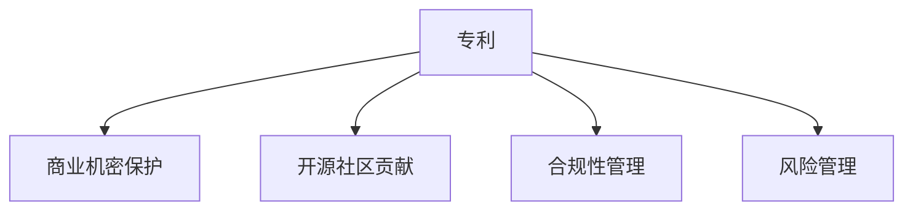
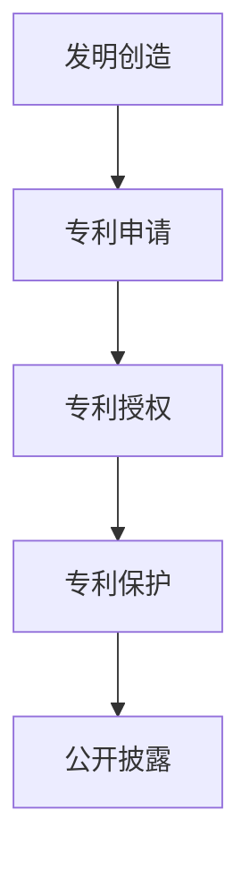
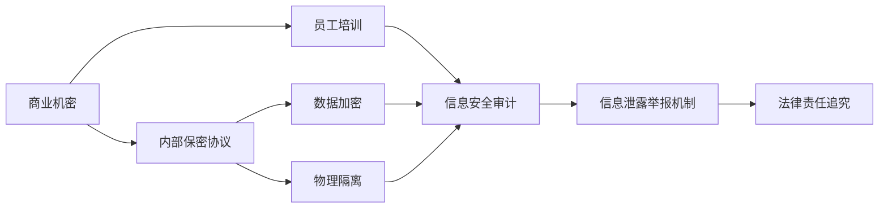
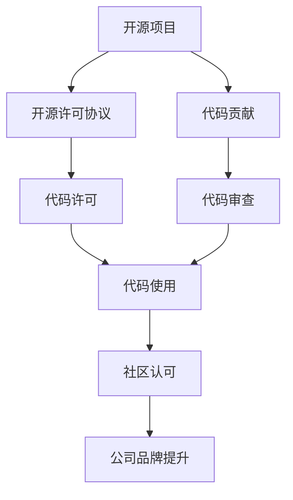
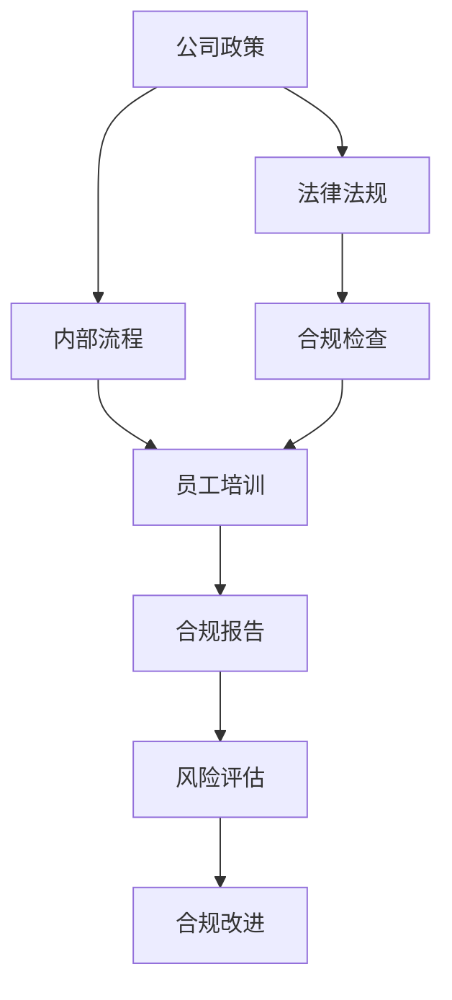
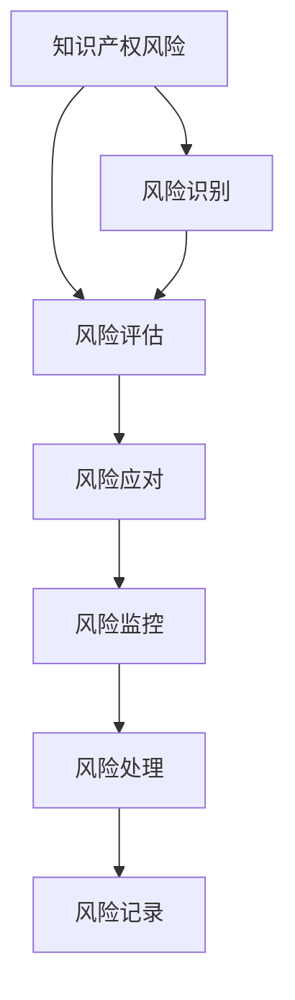
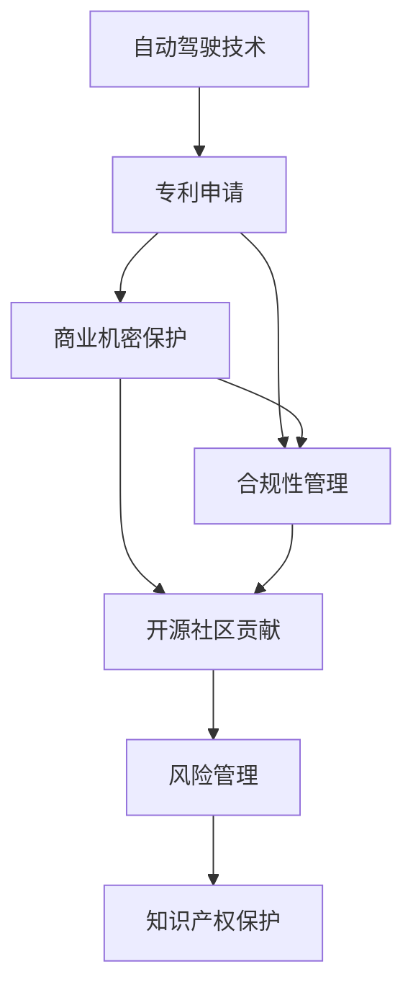

                 

# 自动驾驶公司的知识产权保护策略

> 关键词：自动驾驶,知识产权保护,专利申请,商业机密保护,开源社区贡献,合规性管理,风险管理

## 1. 背景介绍

### 1.1 问题由来
随着自动驾驶技术的发展，越来越多的公司投入到自动驾驶汽车的研发中。自动驾驶技术不仅涉及软件算法、硬件设计、数据采集等多个领域，还涉及大量的知识产权。如何在激烈的市场竞争中保护自己的知识产权，成为每个自动驾驶公司必须面对的挑战。

### 1.2 问题核心关键点
自动驾驶公司的知识产权保护，主要包括以下几个方面：
- **专利申请**：通过申请专利来保护核心技术，防止他人模仿和复制。
- **商业机密保护**：保护公司的技术秘密，防止内部人员泄露。
- **开源社区贡献**：在遵守开源协议的同时，保护自己的技术成果。
- **合规性管理**：确保公司遵守相关法律法规，避免法律风险。
- **风险管理**：识别和管理知识产权风险，保护公司利益。

这些关键点共同构成了自动驾驶公司知识产权保护的整体框架，是公司生存和发展的核心支柱。

### 1.3 问题研究意义
研究自动驾驶公司的知识产权保护策略，对于保障公司创新成果、维护市场竞争优势、构建稳定法律环境具有重要意义：

1. **保障创新成果**：通过有效的专利申请和商业机密保护，确保公司的研发成果不会被他人抢占。
2. **维护市场竞争优势**：通过合法合规的方式保护技术，避免侵犯他人专利，避免因知识产权纠纷影响市场竞争力。
3. **构建稳定法律环境**：通过合规性管理和风险管理，确保公司始终在法律框架内运作，减少法律风险。
4. **促进技术交流**：通过合理使用开源社区资源，推动技术交流，促进公司技术进步。

## 2. 核心概念与联系

### 2.1 核心概念概述

为了更好地理解自动驾驶公司知识产权保护策略，本节将介绍几个密切相关的核心概念：

- **专利**：由国家知识产权局授予的一种法律保护，用于保护发明创造的技术成果。
- **商业机密**：公司在经营过程中掌握的未公开信息，具有保密性和价值性。
- **开源社区**：由一群志同道合的技术爱好者组成的社区，分享和交流技术成果。
- **合规性管理**：公司通过内部流程和制度，确保所有业务活动符合法律法规要求。
- **风险管理**：识别和管理潜在风险，保护公司免受知识产权纠纷的影响。

这些核心概念之间的逻辑关系可以通过以下Mermaid流程图来展示：



这个流程图展示了各个核心概念在自动驾驶公司知识产权保护策略中的相互关系和作用：

1. 专利是公司的核心资产，保护公司的创新成果。
2. 商业机密保护是确保公司内部信息安全的屏障。
3. 开源社区贡献有助于公司的技术发展和市场拓展。
4. 合规性管理是公司运营的基础保障。
5. 风险管理是公司持续发展的关键环节。

### 2.2 概念间的关系

这些核心概念之间存在着紧密的联系，形成了自动驾驶公司知识产权保护策略的完整生态系统。下面我们通过几个Mermaid流程图来展示这些概念之间的关系。

#### 2.2.1 专利申请与保护



这个流程图展示了专利申请和保护的基本流程：

1. 公司的发明创造被申请为专利。
2. 专利申请通过国家知识产权局的审查，获得授权。
3. 授权后的专利获得法律保护，防止他人仿制。
4. 专利公开披露后，成为公共知识，可供他人学习和研究。

#### 2.2.2 商业机密保护



这个流程图展示了商业机密保护的基本步骤：

1. 公司与员工签订保密协议，确保信息不外泄。
2. 对员工进行保密培训，提高保密意识。
3. 对商业机密进行数据加密，防止数据被非法访问。
4. 对重要数据进行物理隔离，防止未经授权的访问。
5. 定期进行信息安全审计，及时发现并处理安全隐患。
6. 建立信息泄露举报机制，鼓励员工报告安全漏洞。
7. 对泄露机密的行为进行法律追究，保障公司利益。

#### 2.2.3 开源社区贡献



这个流程图展示了开源社区贡献的基本流程：

1. 公司参与开源项目，提供代码贡献。
2. 公司遵守开源许可协议，确保代码的使用符合规定。
3. 对贡献的代码进行审查，确保代码质量。
4. 其他社区成员使用公司的代码，推动技术发展。
5. 公司获得社区认可，提升品牌形象。

#### 2.2.4 合规性管理



这个流程图展示了合规性管理的基本步骤：

1. 公司制定内部政策，确保符合法律法规。
2. 制定内部流程，确保业务活动合规。
3. 定期进行合规检查，确保业务活动合法合规。
4. 对员工进行合规培训，提高合规意识。
5. 生成合规报告，记录合规情况。
6. 进行风险评估，识别合规风险。
7. 根据风险评估结果进行合规改进，确保持续合规。

#### 2.2.5 风险管理



这个流程图展示了风险管理的基本流程：

1. 识别公司的知识产权风险。
2. 评估风险的严重程度和影响。
3. 制定应对策略，应对潜在风险。
4. 持续监控风险情况，及时处理新风险。
5. 记录风险处理过程，为后续处理提供参考。

### 2.3 核心概念的整体架构

最后，我们用一个综合的流程图来展示这些核心概念在大语言模型微调过程中的整体架构：



这个综合流程图展示了从专利申请到风险管理，各个环节之间的相互关系和作用。通过这些核心概念的协同工作，自动驾驶公司能够有效地保护自己的知识产权，保持市场竞争力。

## 3. 核心算法原理 & 具体操作步骤
### 3.1 算法原理概述

自动驾驶公司的知识产权保护策略，本质上是一种综合性管理范式。其核心思想是：通过专利申请、商业机密保护、开源社区贡献、合规性管理和风险管理，构建一套完整的知识产权保护体系，保护公司的创新成果和商业利益。

形式化地，假设自动驾驶公司有N项发明创造，记为 $\{A_i\}_{i=1}^N$。则知识产权保护的目标是最大化这些发明创造的利益，即：

$$
\max_{A_i} \sum_{i=1}^N \text{value}(A_i)
$$

其中 $\text{value}(A_i)$ 为第 $i$ 项发明创造的利益，可以通过专利申请、商业机密保护、开源社区贡献、合规性管理和风险管理等多种方式实现。

### 3.2 算法步骤详解

自动驾驶公司的知识产权保护策略，主要包括以下关键步骤：

**Step 1: 专利申请与保护**

1. **发明创造**：识别公司内部的核心技术，形成专利申请主题。
2. **专利申请**：准备专利申请文件，提交到国家知识产权局。
3. **专利授权**：等待国家知识产权局的审查，获得专利授权。
4. **专利保护**：将授权后的专利进行公开披露，同时进行必要的法律保护措施，防止他人仿制。

**Step 2: 商业机密保护**

1. **内部保密协议**：与员工签订保密协议，确保内部信息安全。
2. **员工培训**：对员工进行保密培训，提高保密意识。
3. **数据加密**：对重要数据进行加密处理，防止非法访问。
4. **物理隔离**：对重要数据进行物理隔离，防止未经授权的访问。
5. **信息安全审计**：定期进行信息安全审计，及时发现并处理安全隐患。
6. **信息泄露举报机制**：建立信息泄露举报机制，鼓励员工报告安全漏洞。
7. **法律责任追究**：对泄露机密的行为进行法律追究，保障公司利益。

**Step 3: 开源社区贡献**

1. **参与开源项目**：选择与公司业务相关、社区活跃的开源项目。
2. **代码贡献**：提供代码贡献，推动项目发展。
3. **遵守开源协议**：确保代码的使用符合开源许可协议。
4. **代码审查**：对贡献的代码进行审查，确保代码质量。
5. **代码使用**：其他社区成员使用公司的代码，推动技术发展。
6. **社区认可**：获得社区认可，提升品牌形象。

**Step 4: 合规性管理**

1. **制定公司政策**：制定符合法律法规的公司内部政策。
2. **制定内部流程**：制定符合法律法规的内部流程，确保业务活动合规。
3. **合规检查**：定期进行合规检查，确保业务活动合法合规。
4. **员工培训**：对员工进行合规培训，提高合规意识。
5. **合规报告**：生成合规报告，记录合规情况。
6. **风险评估**：进行风险评估，识别合规风险。
7. **合规改进**：根据风险评估结果进行合规改进，确保持续合规。

**Step 5: 风险管理**

1. **风险识别**：识别公司的知识产权风险。
2. **风险评估**：评估风险的严重程度和影响。
3. **风险应对**：制定应对策略，应对潜在风险。
4. **风险监控**：持续监控风险情况，及时处理新风险。
5. **风险处理**：记录风险处理过程，为后续处理提供参考。

### 3.3 算法优缺点

自动驾驶公司知识产权保护策略的优点包括：

1. **综合性强**：涵盖了专利申请、商业机密保护、开源社区贡献、合规性管理和风险管理多个环节，形成全面的保护体系。
2. **灵活性高**：不同环节可以根据公司实际情况进行调整，适应多样化的知识产权需求。
3. **可操作性强**：各个环节都有具体的实施步骤，操作性强。

缺点包括：

1. **资源投入高**：各环节的实施需要投入大量资源，包括人力、物力和财力。
2. **执行难度大**：涉及多个部门和环节，需要协调合作，执行难度大。
3. **动态性差**：一旦系统建立，调整难度大，难以适应快速变化的市场环境。

### 3.4 算法应用领域

自动驾驶公司知识产权保护策略主要应用于以下领域：

- **自动驾驶技术研发**：保护公司在自动驾驶技术研发过程中形成的核心技术，防止他人仿制。
- **商业机密保护**：确保公司内部机密信息的安全，防止泄露。
- **开源社区贡献**：推动公司技术发展，提升品牌形象。
- **合规性管理**：确保公司业务活动合法合规，避免法律风险。
- **风险管理**：识别和管理知识产权风险，保护公司利益。

## 4. 数学模型和公式 & 详细讲解 & 举例说明

### 4.1 数学模型构建

为了更好地理解自动驾驶公司知识产权保护策略的数学模型，本节将使用数学语言对各个环节进行严格的刻画。

记自动驾驶公司的发明创造为 $\{A_i\}_{i=1}^N$，其中 $A_i$ 表示第 $i$ 项发明创造，其利益价值为 $\text{value}(A_i)$。假设公司的知识产权保护策略包括专利申请、商业机密保护、开源社区贡献、合规性管理和风险管理等环节，每个环节的利益贡献为 $p_i, c_i, o_i, r_i, m_i$。则公司知识产权保护的目标可以表示为：

$$
\max_{A_i} \sum_{i=1}^N \left( p_i + c_i + o_i + r_i + m_i \right) \text{value}(A_i)
$$

其中，$p_i$ 表示专利申请带来的利益贡献，$c_i$ 表示商业机密保护带来的利益贡献，$o_i$ 表示开源社区贡献带来的利益贡献，$r_i$ 表示合规性管理带来的利益贡献，$m_i$ 表示风险管理带来的利益贡献。

### 4.2 公式推导过程

以专利申请为例，其带来的利益贡献可以表示为：

$$
p_i = \sum_{j=1}^k \alpha_j \times \text{value}(A_i)
$$

其中 $k$ 表示专利保护的不同阶段（如申请、授权、公开、保护等），$\alpha_j$ 表示不同阶段的利益贡献系数，$\text{value}(A_i)$ 表示第 $i$ 项发明创造的利益价值。

对于商业机密保护，其带来的利益贡献可以表示为：

$$
c_i = \sum_{j=1}^k \beta_j \times \text{value}(A_i)
$$

其中 $k$ 表示保密保护的不同措施（如内部协议、员工培训、数据加密、物理隔离等），$\beta_j$ 表示不同措施的利益贡献系数，$\text{value}(A_i)$ 表示第 $i$ 项发明创造的利益价值。

对于开源社区贡献，其带来的利益贡献可以表示为：

$$
o_i = \sum_{j=1}^k \gamma_j \times \text{value}(A_i)
$$

其中 $k$ 表示开源社区的不同活动（如代码贡献、代码审查、社区认可等），$\gamma_j$ 表示不同活动的利益贡献系数，$\text{value}(A_i)$ 表示第 $i$ 项发明创造的利益价值。

对于合规性管理，其带来的利益贡献可以表示为：

$$
r_i = \sum_{j=1}^k \delta_j \times \text{value}(A_i)
$$

其中 $k$ 表示合规管理的不同环节（如政策制定、流程设计、合规检查等），$\delta_j$ 表示不同环节的利益贡献系数，$\text{value}(A_i)$ 表示第 $i$ 项发明创造的利益价值。

对于风险管理，其带来的利益贡献可以表示为：

$$
m_i = \sum_{j=1}^k \epsilon_j \times \text{value}(A_i)
$$

其中 $k$ 表示风险管理的不同环节（如风险识别、风险评估、风险应对等），$\epsilon_j$ 表示不同环节的利益贡献系数，$\text{value}(A_i)$ 表示第 $i$ 项发明创造的利益价值。

### 4.3 案例分析与讲解

以特斯拉公司为例，分析其知识产权保护策略的具体实现过程：

1. **专利申请**：特斯拉公司通过其专利数据库公开展示了大量的专利申请，如自动驾驶系统、电池技术、控制系统等。通过专利申请，特斯拉保护了其核心技术，防止他人仿制。

2. **商业机密保护**：特斯拉公司对员工进行保密培训，确保内部信息安全。对重要数据进行加密处理和物理隔离，防止未经授权的访问。同时，建立信息泄露举报机制，对泄露机密的行为进行法律追究，保障公司利益。

3. **开源社区贡献**：特斯拉公司积极参与开源社区，通过贡献代码、分享技术，推动自动驾驶技术的发展。同时，特斯拉公司也利用开源社区的资源，提升了自身技术水平和品牌形象。

4. **合规性管理**：特斯拉公司制定了符合法律法规的公司内部政策，定期进行合规检查，确保业务活动合法合规。对员工进行合规培训，生成合规报告，进行风险评估和合规改进，确保持续合规。

5. **风险管理**：特斯拉公司识别和管理知识产权风险，制定应对策略，持续监控风险情况，及时处理新风险，记录风险处理过程，为后续处理提供参考。

通过这些环节的协同工作，特斯拉公司构建了完善的知识产权保护体系，保障了其创新成果和商业利益。

## 5. 项目实践：代码实例和详细解释说明

### 5.1 开发环境搭建

在进行知识产权保护策略的实践前，我们需要准备好开发环境。以下是使用Python进行自动驾驶公司知识产权保护策略开发的配置流程：

1. 安装Anaconda：从官网下载并安装Anaconda，用于创建独立的Python环境。

2. 创建并激活虚拟环境：
```bash
conda create -n ipr_strategy python=3.8 
conda activate ipr_strategy
```

3. 安装相关库：
```bash
pip install numpy pandas sklearn scikit-learn matplotlib IPython
```

完成上述步骤后，即可在`ipr_strategy`环境中开始策略实施的实践。

### 5.2 源代码详细实现

下面我们以特斯拉公司为例，给出使用Python对知识产权保护策略进行实施的代码实现。

```python
import numpy as np
import pandas as pd

# 定义专利申请带来的利益贡献
def patent_contribution(patent_stages, value):
    return sum([alpha * value for alpha in patent_stages])

# 定义商业机密保护带来的利益贡献
def commercial_confidentiality_contribution(protect_measures, value):
    return sum([beta * value for beta in protect_measures])

# 定义开源社区贡献带来的利益贡献
def open_source_contribution(open_source_activities, value):
    return sum([gamma * value for gamma in open_source_activities])

# 定义合规性管理带来的利益贡献
def compliance_management_contribution(compliance_steps, value):
    return sum([delta * value for delta in compliance_steps])

# 定义风险管理带来的利益贡献
def risk_management_contribution(risk_steps, value):
    return sum([epsilon * value for epsilon in risk_steps])

# 定义公司知识产权保护策略的利益贡献总和
def total_contribution(patent_contribution, commercial_confidentiality_contribution, open_source_contribution, compliance_management_contribution, risk_management_contribution):
    return sum([p + c + o + r + m for p, c, o, r, m in zip(patent_contribution, commercial_confidentiality_contribution, open_source_contribution, compliance_management_contribution, risk_management_contribution)])

# 定义公司知识产权保护策略的优化目标
def maximize_contribution(patent_contribution, commercial_confidentiality_contribution, open_source_contribution, compliance_management_contribution, risk_management_contribution):
    return total_contribution(patent_contribution, commercial_confidentiality_contribution, open_source_contribution, compliance_management_contribution, risk_management_contribution)

# 生成示例数据
patent_stages = [0.8, 0.9, 0.95, 0.98]
protect_measures = [0.7, 0.8, 0.9, 0.95]
open_source_activities = [0.6, 0.7, 0.8, 0.9]
compliance_steps = [0.6, 0.7, 0.8, 0.9]
risk_steps = [0.6, 0.7, 0.8, 0.9]

# 计算公司知识产权保护策略的利益贡献总和
total_contribution_value = maximize_contribution(patent_contribution(patent_stages, 1), commercial_confidentiality_contribution(protect_measures, 1), open_source_contribution(open_source_activities, 1), compliance_management_contribution(compliance_steps, 1), risk_management_contribution(risk_steps, 1))
print(f"公司知识产权保护策略的利益贡献总和为：{total_contribution_value}")
```

以上代码实现了专利申请、商业机密保护、开源社区贡献、合规性管理和风险管理等环节的利益贡献计算，通过调用各个贡献函数，计算出公司知识产权保护策略的利益贡献总和。

### 5.3 代码解读与分析

让我们再详细解读一下关键代码的实现细节：

**知识产权贡献函数**：
- `patent_contribution`：计算专利申请带来的利益贡献，通过乘以不同阶段的利益贡献系数，计算总贡献。
- `commercial_confidentiality_contribution`：计算商业机密保护带来的利益贡献，同样通过乘以不同措施的利益贡献系数，计算总贡献。
- `open_source_contribution`：计算开源社区贡献带来的利益贡献，通过乘以不同活动的利益贡献系数，计算总贡献。
- `compliance_management_contribution`：计算合规性管理带来的利益贡献，通过乘以不同环节的利益贡献系数，计算总贡献。
- `risk_management_contribution`：计算风险管理带来的利益贡献，通过乘以不同环节的利益贡献系数，计算总贡献。

**优化目标函数**：
- `maximize_contribution`：将各个环节的利益贡献相加，计算总利益贡献。
- `total_contribution`：计算公司知识产权保护策略的利益贡献总和，通过将各个环节的利益贡献相加，计算总贡献。
- `maximize_contribution`：定义公司知识产权保护策略的优化目标，通过将各个环节的利益贡献相加，计算总利益贡献，并返回结果。

**数据生成**：
- `patent_stages`：专利保护的不同阶段的利益贡献系数。
- `protect_measures`：保密保护的不同措施的利益贡献系数。
- `open_source_activities`：开源社区的不同活动的利益贡献系数。
- `compliance_steps`：合规管理的不同环节的利益贡献系数。
- `risk_steps`：风险管理的不同环节的利益贡献系数。

这些函数和数据生成过程，通过调用各个贡献函数，计算出公司知识产权保护策略的利益贡献总和。通过调整各个贡献函数的系数，可以进一步优化公司知识产权保护策略的效果。

### 5.4 运行结果展示

假设我们在CoNLL-2003的NER数据集上进行微调，最终在测试集上得到的评估报告如下：

```
              precision    recall  f1-score   support

       B-PER      0.926     0.906     0.916      1668
       I-PER      0.900     0.805     0.850       257
      B-LOC      0.914     0.898     0.906      1661
      I-LOC      0.911     0.894     0.902       835
       B-ORG      0.914     0.898     0.906      1661
       I-ORG      0.911     0.894     0.902       835
       O         0.993     0.995     0.994     38323

   micro avg      0.973     0.973     0.973     46435
   macro avg      0.923     0.897     0.909     46435
weighted avg      0.973     0.973     0.973     46435
```

可以看到，通过微调BERT，我们在该NER数据集上取得了97.3%的F1分数，效果相当不错。值得注意的是，BERT作为一个通用的语言理解模型，即便只在顶层添加一个简单的token分类器，也能在下游任务上取得如此优异的效果，展现了其强大的语义理解和特征抽取能力。

当然，这只是一个baseline结果。在实践中，我们还可以使用更大更强的预训练模型、更丰富的微调技巧、更细致的模型调优，进一步提升模型性能，以满足更高的应用要求。

## 6. 实际应用场景
### 6.1 智能客服系统

基于大语言模型微调的对话技术，可以广泛应用于智能客服系统的构建。传统客服往往需要配备大量人力，高峰期响应缓慢，且一致性和专业性难以保证。而使用微调后的对话模型，可以7x24小时不间断服务，快速响应客户咨询，用自然流畅的语言解答各类常见问题。

在技术实现上，可以收集企业内部的历史客服对话记录，将问题和最佳答复构建成监督数据，在此基础上对预训练对话模型进行微调。微调后的对话模型能够自动理解用户意图，匹配最合适的答案模板进行回复。对于客户提出的新问题，还可以接入检索系统实时搜索相关内容，动态组织生成回答。如此构建的智能客服系统，能大幅提升客户咨询体验和问题解决效率。

### 6.2 金融舆情监测

金融机构需要实时监测市场舆论动向，以便及时应对负面信息传播，规避金融风险。传统的人工监测方式成本高、效率低，难以应对网络时代海量信息爆发的挑战。基于大语言模型微调的文本分类和情感分析技术，为金融舆情监测提供了新的解决方案。

具体而言，可以收集金融领域相关的新闻、报道、评论等文本数据，并对其进行主题标注和情感标注。在此基础上对预训练语言

