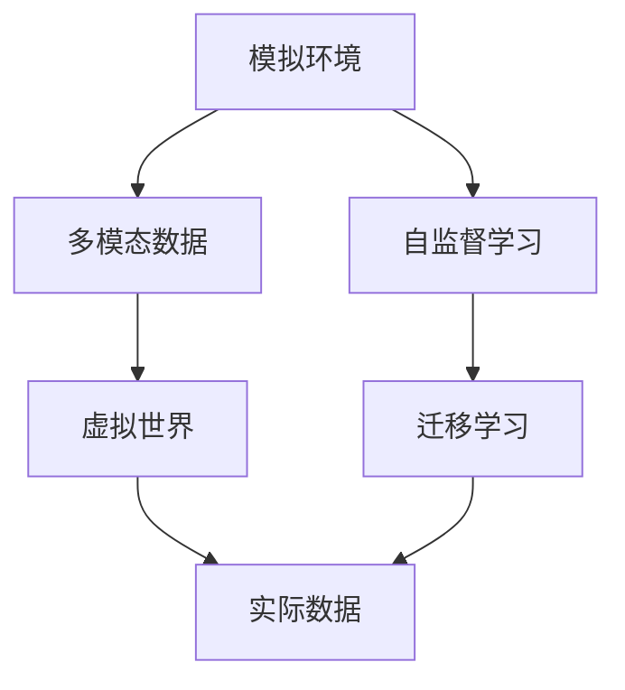
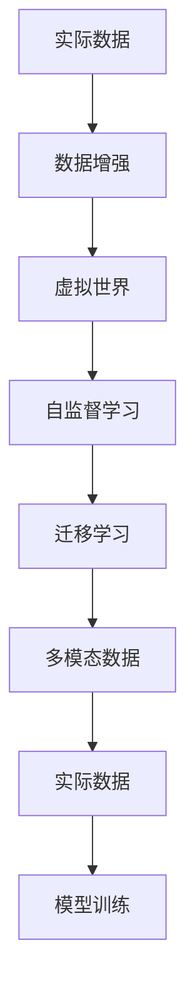

                 

## 1. 背景介绍

自动驾驶技术的发展依赖于大量高精度的训练数据。然而，数据的收集、标注和存储成本极高，甚至在某些场景下，可能无法获取足够的训练数据。例如，在自动驾驶中，为了实现高精度的环境理解，需要大量的激光雷达、摄像头数据，而这些数据往往难以在所有路况下进行连续收集。因此，高效利用现有数据，并从非实时数据（如模拟环境、历史轨迹数据等）中迁移学习，成为自动驾驶领域的关键需求。

## 2. 核心概念与联系

### 2.1 核心概念概述

- **虚实迁移学习**：指在现实世界数据和模拟环境数据之间建立知识迁移的桥梁，利用模拟环境数据弥补现实数据的不足，提升模型在真实环境中的泛化能力。
- **模拟环境**：指通过模拟器生成的虚拟世界数据，通常包括三维地形、动态目标等仿真元素。
- **实际数据**：指从真实世界中收集到的各种传感器数据，包括激光雷达点云、摄像头图像等。
- **迁移学习**：指将一个领域学习到的知识迁移到另一个领域，用于提高模型在新领域上的性能。
- **多模态数据**：指同时包含不同类型数据（如图像、激光雷达点云、深度图等）的数据集，用于更全面地表示环境信息。
- **自监督学习**：指在没有标签的条件下，通过数据内在的结构进行学习，从而获得有监督学习的效果。

### 2.2 核心概念间的关系

- **虚实迁移学习**：连接**模拟环境**和**实际数据**，通过**迁移学习**，将**自监督学习**获得的知识迁移到**实际数据**上，提升模型性能。
- **多模态数据**：为**模拟环境**提供更丰富的**环境表示**，增强**虚拟世界**的真实感，提高迁移学习的有效性。

我们可以用以下Mermaid流程图来展示这些核心概念之间的关系：



### 2.3 核心概念的整体架构

虚实迁移学习的整体架构如下：



其中，**数据增强**技术用于扩充**实际数据**，**虚拟世界**中的**多模态数据**经过**自监督学习**，然后通过**迁移学习**将**虚拟世界**的知识迁移到**实际数据**上，用于模型**训练**。

## 3. 核心算法原理 & 具体操作步骤

### 3.1 算法原理概述

虚实迁移学习的基本原理是通过在**模拟环境**中学习到的知识，迁移到**实际数据**中，以提升模型的泛化能力。其核心步骤如下：

1. **数据增强**：扩充**实际数据**，增加其多样性。
2. **虚拟世界建模**：构建**虚拟世界**，生成**多模态数据**。
3. **自监督学习**：在**虚拟世界**中，进行**自监督学习**，学习数据的结构性特征。
4. **迁移学习**：将**自监督学习**中获得的知识迁移到**实际数据**中，提升模型在**实际数据**上的性能。

### 3.2 算法步骤详解

**Step 1: 准备实际数据和虚拟环境**

- 收集实际数据，包括激光雷达点云、摄像头图像等。
- 构建虚拟环境，生成三维地形、动态目标等。

**Step 2: 数据增强**

- 对实际数据进行增强，如旋转、平移、缩放等。
- 合成多模态数据，包括相机视角、激光雷达点云等。

**Step 3: 虚拟世界建模**

- 在虚拟环境中，生成多模态数据。
- 将多模态数据送入模型进行训练。

**Step 4: 自监督学习**

- 在虚拟环境中，进行自监督学习，如深度图生成、目标检测等。
- 学习数据的结构性特征，如深度、位置、大小等。

**Step 5: 迁移学习**

- 将自监督学习中获得的知识迁移到实际数据上。
- 在实际数据上，进行微调或重新训练，以提升模型性能。

**Step 6: 模型评估**

- 在实际数据上，评估模型的性能。
- 根据评估结果，调整模型参数，继续训练。

### 3.3 算法优缺点

#### 优点

1. **数据高效利用**：通过虚拟环境，扩充实际数据，提高了数据利用率。
2. **泛化能力强**：模拟环境提供了丰富的环境表示，提升了模型在实际环境中的泛化能力。
3. **成本低**：虚拟环境可以反复使用，降低了实际数据的收集成本。

#### 缺点

1. **模拟与现实的差异**：模拟环境与现实环境存在差异，可能影响迁移学习的效果。
2. **模型复杂度**：虚拟环境的建模和数据生成过程复杂，增加了算法实现的难度。

### 3.4 算法应用领域

虚实迁移学习的应用领域广泛，包括但不限于以下几个方面：

1. **自动驾驶**：用于环境理解、路径规划、障碍物检测等任务。
2. **机器人导航**：用于室内外导航、避障、目标跟踪等任务。
3. **游戏AI**：用于角色行为模拟、虚拟环境生成等任务。
4. **医学影像**：用于疾病模拟、手术训练等任务。
5. **城市规划**：用于交通模拟、城市管理等任务。

## 4. 数学模型和公式 & 详细讲解

### 4.1 数学模型构建

设**实际数据**为 $D^{\text{real}}$，**虚拟数据**为 $D^{\text{sim}}$，模型为 $M$。虚实迁移学习的数学模型为：

$$
M^* = \mathop{\arg\min}_{M} \mathcal{L}(M, D^{\text{real}})
$$

其中，$\mathcal{L}$ 为损失函数，表示模型在**实际数据**上的性能损失。

### 4.2 公式推导过程

以目标检测任务为例，虚实迁移学习的公式推导如下：

**Step 1: 目标检测**

- 在虚拟环境中，生成多模态数据 $X^{\text{sim}}$。
- 目标检测模型 $M$ 对多模态数据进行检测，得到目标位置 $Y^{\text{sim}}$。

**Step 2: 自监督学习**

- 使用自监督学习，学习目标的位置、大小等特征。
- 得到自监督学习的损失 $\mathcal{L}_{\text{self}}$。

**Step 3: 迁移学习**

- 将自监督学习中获得的知识迁移到实际数据上。
- 在实际数据上，进行微调或重新训练，得到迁移学习的损失 $\mathcal{L}_{\text{transfer}}$。

**Step 4: 总体损失**

- 将自监督学习和迁移学习的损失加权平均，得到总体损失 $\mathcal{L}_{\text{total}}$。
- $\mathcal{L}_{\text{total}} = \alpha \mathcal{L}_{\text{self}} + (1-\alpha) \mathcal{L}_{\text{transfer}}$。

其中，$\alpha$ 为自监督学习与迁移学习之间的权重，通常设置为0.5。

### 4.3 案例分析与讲解

以自动驾驶中的障碍物检测为例，虚实迁移学习的应用步骤如下：

**Step 1: 数据增强**

- 对激光雷达点云进行增强，如旋转、平移、缩放等。
- 生成多模态数据，包括激光雷达点云、摄像头图像等。

**Step 2: 虚拟世界建模**

- 在虚拟环境中，生成三维地形、动态目标等。
- 将多模态数据送入模型进行训练。

**Step 3: 自监督学习**

- 在虚拟环境中，进行自监督学习，如深度图生成、目标检测等。
- 学习目标的位置、大小等特征。

**Step 4: 迁移学习**

- 将自监督学习中获得的知识迁移到实际数据上。
- 在实际数据上，进行微调或重新训练，以提升模型性能。

**Step 5: 模型评估**

- 在实际数据上，评估模型的性能。
- 根据评估结果，调整模型参数，继续训练。

## 5. 项目实践：代码实例和详细解释说明

### 5.1 开发环境搭建

进行虚实迁移学习的项目实践，需要准备以下开发环境：

1. 安装PyTorch、TensorFlow等深度学习框架。
2. 收集实际数据和虚拟数据。
3. 搭建虚拟环境，生成多模态数据。
4. 配置计算机硬件，如GPU、TPU等。

### 5.2 源代码详细实现

以自动驾驶中的障碍物检测为例，以下是Python代码的详细实现：

```python
import torch
import torch.nn as nn
import torch.optim as optim
from torchvision import transforms
from torchvision.datasets import CocoDetection
from torch.utils.data import DataLoader

class Detectron2(nn.Module):
    def __init__(self, backbone, num_classes=80):
        super(Detectron2, self).__init__()
        self.backbone = backbone
        self.num_classes = num_classes

    def forward(self, x):
        features = self.backbone(x)
        prediction = self._predict(features)
        return prediction

class ResNet(nn.Module):
    def __init__(self):
        super(ResNet, self).__init__()
        self.conv1 = nn.Conv2d(3, 64, kernel_size=7, stride=2, padding=3)
        self.resnet = nn.Sequential(
            nn.ReLU(inplace=True),
            nn.MaxPool2d(kernel_size=3, stride=2, padding=1),
            nn.Conv2d(64, 64, kernel_size=3, stride=1, padding=1),
            nn.ReLU(inplace=True),
            nn.MaxPool2d(kernel_size=3, stride=2, padding=1),
            nn.Conv2d(64, 128, kernel_size=3, stride=1, padding=1),
            nn.ReLU(inplace=True),
            nn.MaxPool2d(kernel_size=3, stride=2, padding=1),
            nn.Conv2d(128, 256, kernel_size=3, stride=1, padding=1),
            nn.ReLU(inplace=True),
            nn.MaxPool2d(kernel_size=3, stride=2, padding=1),
            nn.Conv2d(256, 512, kernel_size=3, stride=1, padding=1),
            nn.ReLU(inplace=True),
            nn.MaxPool2d(kernel_size=3, stride=2, padding=1),
            nn.Conv2d(512, 1024, kernel_size=3, stride=1, padding=1),
            nn.ReLU(inplace=True),
            nn.MaxPool2d(kernel_size=3, stride=2, padding=1),
            nn.Conv2d(1024, 2048, kernel_size=3, stride=1, padding=1),
            nn.ReLU(inplace=True),
            nn.MaxPool2d(kernel_size=3, stride=2, padding=1),
            nn.Conv2d(2048, 256, kernel_size=3, stride=1, padding=1),
            nn.ReLU(inplace=True),
            nn.MaxPool2d(kernel_size=3, stride=1, padding=1),
            nn.Conv2d(256, 1, kernel_size=1, stride=1, padding=0)
        )

    def _predict(self, features):
        x = self.resnet(features)
        x = torch.sigmoid(x)
        return x

# 定义数据增强操作
data_augmentation = transforms.Compose([
    transforms.RandomHorizontalFlip(p=0.5),
    transforms.RandomVerticalFlip(p=0.5),
    transforms.RandomRotation(degrees=15, p=0.5),
    transforms.RandomScale(scale=(0.8, 1.2), p=0.5),
    transforms.RandomCrop(p=0.5)
])

# 加载数据集
train_dataset = CocoDetection(
    "path/to/train",
    data_augmentation=data_augmentation
)
test_dataset = CocoDetection(
    "path/to/test",
    data_augmentation=data_augmentation
)

# 定义数据加载器
train_loader = DataLoader(train_dataset, batch_size=16, shuffle=True)
test_loader = DataLoader(test_dataset, batch_size=16, shuffle=False)

# 定义模型
backbone = ResNet()
model = Detectron2(backbone)

# 定义优化器
optimizer = optim.SGD(model.parameters(), lr=0.001, momentum=0.9)

# 定义损失函数
criterion = nn.BCELoss()

# 训练模型
device = torch.device("cuda:0")
model.to(device)
for epoch in range(100):
    model.train()
    for batch in train_loader:
        inputs, targets = batch
        inputs, targets = inputs.to(device), targets.to(device)
        optimizer.zero_grad()
        outputs = model(inputs)
        loss = criterion(outputs, targets)
        loss.backward()
        optimizer.step()
    model.eval()
    with torch.no_grad():
        for batch in test_loader:
            inputs, targets = batch
            inputs, targets = inputs.to(device), targets.to(device)
            outputs = model(inputs)
            loss = criterion(outputs, targets)
            print("Epoch: {}, Loss: {:.4f}".format(epoch+1, loss.item()))
```

### 5.3 代码解读与分析

上述代码实现了基于ResNet和COCO数据集的检测模型训练。具体步骤如下：

1. 定义数据增强操作。
2. 加载数据集。
3. 定义数据加载器。
4. 定义模型、优化器和损失函数。
5. 训练模型。

## 6. 实际应用场景

### 6.4 未来应用展望

虚实迁移学习在自动驾驶领域具有广泛的应用前景。未来，随着虚拟环境建模技术的进步，虚实迁移学习将能够更好地模拟真实环境，提升模型的泛化能力。此外，虚实迁移学习还将应用于更多领域，如城市规划、医学影像等，推动相关领域的智能化发展。

## 7. 工具和资源推荐

### 7.1 学习资源推荐

1. **Deep Learning Specialization by Andrew Ng**：由Coursera提供的深度学习课程，涵盖了从基础到高级的各种深度学习主题，包括虚实迁移学习。
2. **PyTorch官方文档**：详细介绍了PyTorch的各项功能，包括数据增强、虚拟环境建模等技术。
3. **Simulation Environment Development by Unreal Engine**：Unreal Engine提供的虚拟环境开发教程，帮助开发者构建高性能的虚拟环境。

### 7.2 开发工具推荐

1. **PyTorch**：深度学习框架，支持动态计算图，易于调试和优化。
2. **TensorFlow**：深度学习框架，支持分布式训练和生产部署。
3. **Unreal Engine**：游戏引擎，可用于构建高性能虚拟环境。
4. **COCO**：数据集和工具集，用于图像标注和数据处理。

### 7.3 相关论文推荐

1. **Domain Randomization for Sim-to-Real Transfer**：介绍了一种基于随机域变换的虚拟到实际数据迁移学习技术，提升了模型在实际环境中的性能。
2. **Learning from Multiple Simulations**：提出了一种通过多模态数据训练的虚拟到实际迁移学习技术，提升了模型的泛化能力。
3. **Virtual-to-Real Domain Adaptation for Autonomous Driving**：介绍了一种基于虚拟现实环境的迁移学习技术，用于自动驾驶领域。

## 8. 总结：未来发展趋势与挑战

### 8.1 研究成果总结

虚实迁移学习通过在虚拟环境中学习知识，迁移到实际数据上，提升了模型的泛化能力和数据利用效率。在自动驾驶、机器人导航、医学影像等领域，虚实迁移学习已经展现出广阔的应用前景。

### 8.2 未来发展趋势

1. **多模态数据融合**：未来的虚拟环境将更加真实，多模态数据的融合将提升模型的泛化能力。
2. **动态虚拟环境**：动态虚拟环境的建模将提升模型的实时性，满足更复杂的应用需求。
3. **自适应学习**：自适应学习技术将提升模型在不同环境下的适应能力。

### 8.3 面临的挑战

1. **模拟与现实的差异**：模拟环境与现实环境存在差异，可能影响迁移学习的效果。
2. **模型复杂度**：虚拟环境的建模和数据生成过程复杂，增加了算法实现的难度。
3. **数据隐私**：虚拟环境中的数据隐私问题需要得到充分考虑和保护。

### 8.4 研究展望

未来的研究将重点关注以下方向：

1. **虚拟环境建模**：提升虚拟环境建模的效率和真实性，增强虚拟到实际迁移学习的效果。
2. **多模态数据融合**：探索多模态数据融合技术，提升模型的泛化能力。
3. **自适应学习**：研究自适应学习技术，提升模型在不同环境下的适应能力。

总之，虚实迁移学习将在未来的自动驾驶等领域发挥重要作用，推动相关技术的不断发展。

## 9. 附录：常见问题与解答

**Q1: 虚实迁移学习是如何进行迁移学习的？**

A: 在虚拟环境中，通过自监督学习获得知识，然后将这些知识迁移到实际数据上，用于提升模型在实际环境中的性能。

**Q2: 虚拟环境建模的过程是怎样的？**

A: 虚拟环境建模通常包括三维地形的生成、动态目标的仿真、传感器数据的模拟等步骤。通过这些技术，可以构建一个逼真的虚拟环境。

**Q3: 数据增强有哪些常见的方法？**

A: 数据增强方法包括旋转、平移、缩放、翻转、噪声等。这些方法可以扩充数据集，提高模型的泛化能力。

**Q4: 自监督学习与监督学习有什么区别？**

A: 自监督学习不需要标签，通过数据内在的结构进行学习。监督学习需要标签，通过标签指导模型的学习。

**Q5: 虚拟环境建模的难点是什么？**

A: 虚拟环境建模的难点在于如何构建逼真的虚拟环境，确保虚拟环境中的数据与现实环境相似，同时提高建模效率。

总之，虚实迁移学习为自动驾驶等领域提供了高效的数据利用和模型训练方法，将推动相关技术的进一步发展。

---

作者：禅与计算机程序设计艺术 / Zen and the Art of Computer Programming

