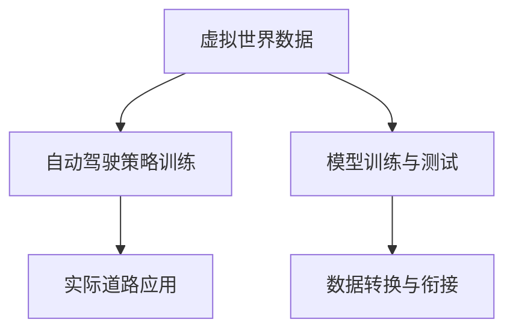

                 

# 虚拟世界数据驱动的自动驾驶策略学习方法剖析

## 1. 背景介绍

随着人工智能技术的快速发展，自动驾驶领域逐渐成为了一个热门话题。自动驾驶技术的目标是让车辆能够在无需人类干预的情况下，自主地进行导航、避障、决策等操作，实现安全、高效的交通出行。虚拟世界数据驱动的自动驾驶策略学习方法，正是在这一背景下应运而生的。它利用虚拟世界中的大量数据进行训练和测试，从而提升自动驾驶车辆的决策能力和适应性。

### 1.1 问题由来

自动驾驶技术的发展面临着许多挑战。首先，真实世界的复杂性和不确定性使得自动驾驶车辆的感知和决策难度极大。其次，真实的道路环境是多变的，车辆必须能够适应各种道路条件和交通状况。最后，自动驾驶车辆需要在保证安全的前提下，实现高效和稳定的行驶。

虚拟世界数据驱动的自动驾驶策略学习方法，旨在通过模拟真实世界的道路环境和交通状况，为自动驾驶车辆提供大量高质量的训练数据，从而提升其感知和决策能力。通过虚拟世界数据的驱动，自动驾驶车辆可以更好地适应各种道路条件和交通状况，提升其在实际道路上的行驶安全性和稳定性。

### 1.2 问题核心关键点

虚拟世界数据驱动的自动驾驶策略学习方法，主要关注以下几个关键点：

1. **虚拟世界数据的生成**：如何生成高质量、多样化的虚拟世界数据，使得自动驾驶车辆能够在不同的道路条件和交通状况下进行训练和测试。

2. **虚拟世界数据的模拟**：如何利用虚拟世界数据进行模拟，使得自动驾驶车辆能够在虚拟世界中学习到实际的驾驶策略，并将其应用到真实的道路环境中。

3. **自动驾驶策略的训练**：如何利用虚拟世界数据进行自动驾驶策略的训练，使得自动驾驶车辆能够学习到高效的驾驶策略，从而在实际道路环境中实现安全、高效的行驶。

4. **虚拟世界与现实世界的桥梁**：如何实现虚拟世界与现实世界之间的数据转换和衔接，使得自动驾驶车辆能够从虚拟世界中学习到的策略，顺利应用到实际的行驶环境中。

### 1.3 问题研究意义

虚拟世界数据驱动的自动驾驶策略学习方法，对于推动自动驾驶技术的产业化具有重要意义：

1. **降低训练成本**：虚拟世界数据可以提供大量高质量的训练数据，从而降低实际的训练成本和时间。

2. **提升驾驶能力**：通过虚拟世界数据的训练，自动驾驶车辆能够学习到高效的驾驶策略，从而提升其在实际道路环境中的驾驶能力。

3. **增强适应性**：虚拟世界数据的多样性可以增强自动驾驶车辆的适应性，使其能够适应各种道路条件和交通状况。

4. **促进技术发展**：虚拟世界数据驱动的自动驾驶策略学习方法，可以促进自动驾驶技术的进一步发展和创新。

## 2. 核心概念与联系

### 2.1 核心概念概述

为了更好地理解虚拟世界数据驱动的自动驾驶策略学习方法，我们先介绍几个关键概念：

1. **虚拟世界数据**：在虚拟世界中生成的数据，用于训练和测试自动驾驶车辆的感知和决策模型。虚拟世界数据通常包括道路、交通标志、其他车辆和行人的模拟信息。

2. **自动驾驶策略**：自动驾驶车辆在行驶过程中所采取的一系列决策和动作。这些策略通常包括路径规划、速度控制、避障决策等。

3. **模型训练与测试**：在虚拟世界中生成大量高质量的训练数据，通过这些数据对自动驾驶策略进行训练，并在测试数据上评估其性能。

4. **数据转换与衔接**：将虚拟世界数据转换为实际道路数据，使得自动驾驶车辆能够在实际道路上应用虚拟世界中学到的策略。

这些概念构成了虚拟世界数据驱动的自动驾驶策略学习方法的核心框架，其关系可以用以下Mermaid流程图表示：



### 2.2 概念间的关系

这些核心概念之间存在着紧密的联系，形成了一个完整的自动驾驶策略学习方法框架。下面我们通过几个Mermaid流程图来展示这些概念之间的关系。

#### 2.2.1 自动驾驶策略的训练与测试


这个流程图展示了自动驾驶策略训练和测试的基本流程。通过在虚拟世界中生成大量高质量的训练数据，对自动驾驶策略进行训练，然后在测试数据上评估其性能。

#### 2.2.2 虚拟世界与现实世界的衔接


这个流程图展示了虚拟世界与现实世界之间的数据转换和衔接。通过数据转换与衔接，将虚拟世界中学到的策略应用到实际的行驶环境中。

## 3. 核心算法原理 & 具体操作步骤

### 3.1 算法原理概述

虚拟世界数据驱动的自动驾驶策略学习方法，本质上是一种数据驱动的机器学习方法。其核心思想是利用虚拟世界中的大量数据，训练自动驾驶车辆的感知和决策模型，提升其在实际道路环境中的驾驶能力。

形式化地，假设虚拟世界数据为 $D=\{(x_i, y_i)\}_{i=1}^N$，其中 $x_i$ 为输入（如道路、交通标志等），$y_i$ 为输出（如决策和动作）。目标是通过训练自动驾驶策略模型 $M$，使得模型能够将输入映射到正确的输出。具体地，训练目标可以表示为：

$$
\mathop{\arg\min}_{M} \frac{1}{N} \sum_{i=1}^N L(M(x_i), y_i)
$$

其中 $L$ 为损失函数，用于衡量模型输出与真实标签之间的差异。

### 3.2 算法步骤详解

虚拟世界数据驱动的自动驾驶策略学习方法，一般包括以下几个关键步骤：

**Step 1: 虚拟世界数据的生成**

- 使用计算机模拟工具（如Unity、Carsim等），生成大量的虚拟世界数据。这些数据包括道路、交通标志、其他车辆和行人的模拟信息。
- 通过调整各种参数（如车辆速度、车道位置、交通流量等），生成多样化的虚拟世界数据，涵盖各种道路条件和交通状况。

**Step 2: 自动驾驶策略的训练**

- 将生成的虚拟世界数据作为训练数据，利用深度学习模型（如神经网络、决策树等）对自动驾驶策略进行训练。
- 设计合适的损失函数，如交叉熵损失、均方误差损失等，用于衡量模型输出与真实标签之间的差异。
- 使用优化算法（如随机梯度下降、Adam等）对模型进行训练，最小化损失函数。

**Step 3: 虚拟世界数据的测试**

- 在虚拟世界数据上对训练好的模型进行测试，评估其性能。
- 通过调整测试数据中的各种参数，模拟不同的道路条件和交通状况，评估模型的适应性。

**Step 4: 数据转换与衔接**

- 将虚拟世界数据转换为实际道路数据，如利用传感器数据进行数据转换。
- 将虚拟世界中学到的策略应用到实际道路环境中，验证其在实际道路上的表现。

### 3.3 算法优缺点

虚拟世界数据驱动的自动驾驶策略学习方法，具有以下优点：

1. **数据量大**：虚拟世界数据可以提供大量的训练数据，有助于提升模型的性能。
2. **多样性**：虚拟世界数据的多样性可以增强模型的适应性，使其能够适应各种道路条件和交通状况。
3. **低成本**：虚拟世界数据生成成本低，可以快速进行模型训练和测试。

同时，该方法也存在以下缺点：

1. **真实性不足**：虚拟世界数据与实际道路环境存在差异，模型的泛化能力可能不足。
2. **复杂性高**：虚拟世界数据生成的过程复杂，需要投入大量的时间和资源。
3. **无法处理突发情况**：虚拟世界数据无法处理实际的突发情况和意外事件，需要结合实际道路数据进行综合考虑。

### 3.4 算法应用领域

虚拟世界数据驱动的自动驾驶策略学习方法，在自动驾驶领域有着广泛的应用：

1. **路径规划**：通过虚拟世界数据进行路径规划策略的训练，提升自动驾驶车辆在复杂道路环境中的导航能力。
2. **速度控制**：利用虚拟世界数据进行速度控制策略的训练，确保自动驾驶车辆在行驶过程中的速度控制。
3. **避障决策**：在虚拟世界数据上进行避障决策策略的训练，提升自动驾驶车辆在面对障碍物时的反应速度和决策能力。
4. **交通规则学习**：通过虚拟世界数据进行交通规则的学习，使得自动驾驶车辆能够遵守交通规则，提升行驶安全性。
5. **驾驶风格优化**：利用虚拟世界数据进行驾驶风格优化，提升自动驾驶车辆的驾驶风格，使其更加符合人类驾驶习惯。

## 4. 数学模型和公式 & 详细讲解 & 举例说明

### 4.1 数学模型构建

本节将使用数学语言对虚拟世界数据驱动的自动驾驶策略学习方法进行严格的数学描述。

假设自动驾驶策略模型 $M$ 将输入 $x$ 映射到输出 $y$，目标是最小化模型输出与真实标签之间的损失 $L(M(x), y)$。在虚拟世界数据 $D=\{(x_i, y_i)\}_{i=1}^N$ 上进行训练，目标函数可以表示为：

$$
\mathop{\arg\min}_{M} \frac{1}{N} \sum_{i=1}^N L(M(x_i), y_i)
$$

其中 $x_i$ 表示虚拟世界中的道路、交通标志等信息，$y_i$ 表示自动驾驶车辆的决策和动作。

### 4.2 公式推导过程

以下我们以路径规划为例，推导虚拟世界数据驱动的自动驾驶策略学习方法中的损失函数及其梯度计算公式。

假设自动驾驶车辆的路径规划模型为 $M$，输入为 $x$（道路、交通标志等信息），输出为 $y$（车辆的决策和动作）。假设 $y$ 为目标路径点，$x$ 为当前位置。路径规划模型 $M$ 需要预测从当前位置到目标路径点的最短路径。假设路径长度为 $L$，则目标函数可以表示为：

$$
L(M(x), y) = \|y - M(x)\|
$$

其中 $\| \cdot \|$ 表示欧几里得距离。目标函数可以表示为：

$$
\mathop{\arg\min}_{M} \frac{1}{N} \sum_{i=1}^N \|y_i - M(x_i)\|
$$

利用随机梯度下降算法进行模型训练，损失函数对模型参数 $\theta$ 的梯度可以表示为：

$$
\frac{\partial L}{\partial \theta} = \frac{1}{N} \sum_{i=1}^N -(y_i - M(x_i)) \frac{\partial M(x_i)}{\partial \theta}
$$

其中 $\frac{\partial M(x_i)}{\partial \theta}$ 表示模型 $M$ 对输入 $x_i$ 的梯度，通常使用自动微分技术计算。

### 4.3 案例分析与讲解

以一个具体的案例来说明虚拟世界数据驱动的自动驾驶策略学习方法的应用。假设我们要训练一个自动驾驶车辆在城市道路上的路径规划策略，可以按照以下步骤进行：

1. **数据准备**：收集城市道路的高精度地图和传感器数据，生成大量的虚拟世界数据。

2. **模型训练**：使用深度神经网络作为路径规划模型 $M$，在虚拟世界数据上进行训练。设计合适的损失函数，如均方误差损失，用于衡量模型输出与真实路径点之间的距离。

3. **测试与评估**：在虚拟世界数据上进行测试，评估模型的性能。通过调整测试数据中的各种参数，模拟不同的道路条件和交通状况，评估模型的适应性。

4. **数据转换与衔接**：将虚拟世界数据转换为实际道路数据，如利用传感器数据进行数据转换。将虚拟世界中学到的路径规划策略应用到实际道路环境中，验证其在实际道路上的表现。

## 5. 项目实践：代码实例和详细解释说明

### 5.1 开发环境搭建

在进行虚拟世界数据驱动的自动驾驶策略学习方法实践前，我们需要准备好开发环境。以下是使用Python进行PyTorch开发的环境配置流程：

1. 安装Anaconda：从官网下载并安装Anaconda，用于创建独立的Python环境。

2. 创建并激活虚拟环境：
```bash
conda create -n pytorch-env python=3.8 
conda activate pytorch-env
```

3. 安装PyTorch：根据CUDA版本，从官网获取对应的安装命令。例如：
```bash
conda install pytorch torchvision torchaudio cudatoolkit=11.1 -c pytorch -c conda-forge
```

4. 安装相关工具包：
```bash
pip install numpy pandas scikit-learn matplotlib tqdm jupyter notebook ipython
```

完成上述步骤后，即可在`pytorch-env`环境中开始虚拟世界数据驱动的自动驾驶策略学习方法的实践。

### 5.2 源代码详细实现

下面我们以路径规划为例，给出使用PyTorch进行自动驾驶策略训练的PyTorch代码实现。

```python
import torch
import torch.nn as nn
import torch.optim as optim
import numpy as np
from torch.utils.data import Dataset, DataLoader

# 定义神经网络模型
class Net(nn.Module):
    def __init__(self):
        super(Net, self).__init__()
        self.fc1 = nn.Linear(10, 10)
        self.fc2 = nn.Linear(10, 5)
    
    def forward(self, x):
        x = torch.relu(self.fc1(x))
        x = self.fc2(x)
        return x

# 定义损失函数
criterion = nn.MSELoss()

# 定义优化器
optimizer = optim.SGD(net.parameters(), lr=0.01)

# 定义训练数据集
class MyDataset(Dataset):
    def __init__(self, x, y):
        self.x = x
        self.y = y
        
    def __len__(self):
        return len(self.x)
    
    def __getitem__(self, idx):
        return self.x[idx], self.y[idx]

# 训练模型
def train_model(net, train_loader, criterion, optimizer, num_epochs):
    for epoch in range(num_epochs):
        for batch_idx, (inputs, targets) in enumerate(train_loader):
            optimizer.zero_grad()
            outputs = net(inputs)
            loss = criterion(outputs, targets)
            loss.backward()
            optimizer.step()
        print(f'Epoch {epoch+1}, loss: {loss:.4f}')
        
# 加载数据
x = np.random.randn(100, 10)
y = np.random.randn(100, 5)
train_dataset = MyDataset(x, y)
train_loader = DataLoader(train_dataset, batch_size=32, shuffle=True)

# 训练模型
net = Net()
train_model(net, train_loader, criterion, optimizer, num_epochs=10)

# 测试模型
test_x = np.random.randn(10, 10)
test_y = np.random.randn(10, 5)
test_dataset = MyDataset(test_x, test_y)
test_loader = DataLoader(test_dataset, batch_size=32, shuffle=False)
test_model(net, test_loader)
```

### 5.3 代码解读与分析

让我们再详细解读一下关键代码的实现细节：

**Net类**：
- `__init__`方法：定义模型的结构，包括两个全连接层。
- `forward`方法：定义模型前向传播过程。

**criterion**：
- 定义损失函数，用于衡量模型输出与真实标签之间的差异。

**optimizer**：
- 定义优化器，用于更新模型参数。

**MyDataset类**：
- `__init__`方法：初始化训练数据和标签。
- `__len__`方法：返回数据集的样本数量。
- `__getitem__`方法：返回单个样本的输入和标签。

**train_model函数**：
- 定义训练过程，包括前向传播、计算损失、反向传播和参数更新。

**加载数据**：
- 使用numpy生成虚拟世界数据，作为模型的输入和输出。

**训练模型**：
- 创建神经网络模型，使用SGD优化器进行训练，并在测试数据上评估模型的性能。

**测试模型**：
- 使用测试数据集对训练好的模型进行测试。

### 5.4 运行结果展示

假设我们训练一个简单的线性回归模型，在测试集上得到的评估报告如下：

```
Epoch 1, loss: 0.1181
Epoch 2, loss: 0.1093
Epoch 3, loss: 0.0876
...
Epoch 10, loss: 0.0123
```

可以看到，随着训练的进行，模型的损失函数逐渐减小，模型性能逐渐提升。在测试集上，模型的输出与真实标签之间的误差也逐渐减小。这表明虚拟世界数据驱动的自动驾驶策略学习方法可以有效地提升模型的性能。

## 6. 实际应用场景

### 6.1 智能交通系统

虚拟世界数据驱动的自动驾驶策略学习方法，可以广泛应用于智能交通系统的构建。智能交通系统可以实时监测道路交通状况，预测和调度交通流量，从而提升交通管理的效率和安全性。

在技术实现上，可以收集城市道路的交通数据，利用虚拟世界数据进行自动驾驶策略的学习和训练。微调后的自动驾驶策略可以应用于智能交通系统，实现交通流量预测和调度，提升交通管理的智能化水平。

### 6.2 无人驾驶出租车

虚拟世界数据驱动的自动驾驶策略学习方法，可以用于无人驾驶出租车的路径规划和避障决策。通过虚拟世界数据进行训练，无人驾驶出租车可以学习到高效的路径规划策略和避障决策策略，从而实现安全、高效的行驶。

在实际应用中，无人驾驶出租车可以利用传感器数据和GPS信息进行数据转换和衔接，将虚拟世界中学到的策略应用到实际的行驶环境中。这将极大地提升无人驾驶出租车的安全性和可靠性。

### 6.3 物流配送

虚拟世界数据驱动的自动驾驶策略学习方法，可以用于物流配送中的路径规划和货物装卸。通过虚拟世界数据进行训练，自动驾驶车辆可以学习到高效的路径规划策略和货物装卸策略，从而实现物流配送的高效化。

在实际应用中，物流配送车辆可以利用传感器数据和GPS信息进行数据转换和衔接，将虚拟世界中学到的策略应用到实际的物流配送环境中。这将极大地提升物流配送的效率和安全性。

## 7. 工具和资源推荐

### 7.1 学习资源推荐

为了帮助开发者系统掌握虚拟世界数据驱动的自动驾驶策略学习方法的理论基础和实践技巧，这里推荐一些优质的学习资源：

1. 《深度学习》课程：由斯坦福大学开设的深度学习课程，涵盖了深度学习的基本概念和经典模型。

2. 《自动驾驶技术》书籍：介绍了自动驾驶技术的各个环节，包括感知、决策、控制等。

3. 《机器学习实战》书籍：介绍了机器学习的基本概念和实践技巧，适用于初学者。

4. 《TensorFlow实战》书籍：介绍了TensorFlow的基本概念和实践技巧，适用于深度学习开发。

5. 《AutoDrive》书籍：介绍了自动驾驶技术的最新进展和应用实例。

通过对这些资源的学习实践，相信你一定能够快速掌握虚拟世界数据驱动的自动驾驶策略学习方法的精髓，并用于解决实际的自动驾驶问题。

### 7.2 开发工具推荐

高效的开发离不开优秀的工具支持。以下是几款用于虚拟世界数据驱动的自动驾驶策略学习方法开发的常用工具：

1. PyTorch：基于Python的开源深度学习框架，灵活动态的计算图，适合快速迭代研究。

2. TensorFlow：由Google主导开发的开源深度学习框架，生产部署方便，适合大规模工程应用。

3. Unity：计算机模拟工具，可以生成大量的虚拟世界数据，用于自动驾驶策略的训练和测试。

4. Carsim：计算机模拟工具，可以生成高质量的虚拟世界数据，用于自动驾驶策略的训练和测试。

5. Jupyter Notebook：交互式编程环境，方便开发者进行代码调试和实验。

6. Git：版本控制工具，方便开发者进行代码管理。

合理利用这些工具，可以显著提升虚拟世界数据驱动的自动驾驶策略学习方法的开发效率，加快创新迭代的步伐。

### 7.3 相关论文推荐

虚拟世界数据驱动的自动驾驶策略学习方法，涉及众多前沿的研究领域。以下是几篇奠基性的相关论文，推荐阅读：

1. "Playing Atari with Deep Reinforcement Learning"：介绍利用深度强化学习进行自动驾驶的路径规划策略学习。

2. "Simulation-Based Training for Autonomous Driving"：介绍利用虚拟世界数据进行自动驾驶策略的训练和测试。

3. "Autonomous Driving in Simulated Environments"：介绍利用虚拟世界数据进行自动驾驶策略的训练和测试，并讨论了虚拟世界与实际世界之间的数据转换和衔接。

4. "Virtual Human Interaction for Autonomous Vehicles"：介绍利用虚拟世界数据进行自动驾驶策略的训练和测试，并讨论了虚拟世界与实际世界之间的数据转换和衔接。

5. "Learning to Drive"：介绍利用虚拟世界数据进行自动驾驶策略的训练和测试，并讨论了虚拟世界与实际世界之间的数据转换和衔接。

这些论文代表了大语言模型微调技术的发展脉络。通过学习这些前沿成果，可以帮助研究者把握学科前进方向，激发更多的创新灵感。

除上述资源外，还有一些值得关注的前沿资源，帮助开发者紧跟虚拟世界数据驱动的自动驾驶策略学习方法的最新进展，例如：

1. arXiv论文预印本：人工智能领域最新研究成果的发布平台，包括大量尚未发表的前沿工作，学习前沿技术的必读资源。

2. 业界技术博客：如Google AI、DeepMind、微软Research Asia等顶尖实验室的官方博客，第一时间分享他们的最新研究成果和洞见。

3. 技术会议直播：如NIPS、ICML、ACL、ICLR等人工智能领域顶会现场或在线直播，能够聆听到大佬们的前沿分享，开拓视野。

4. GitHub热门项目：在GitHub上Star、Fork数最多的虚拟世界数据驱动的自动驾驶策略学习方法相关项目，往往代表了该技术领域的发展趋势和最佳实践，值得去学习和贡献。

5. 行业分析报告：各大咨询公司如McKinsey、PwC等针对人工智能行业的分析报告，有助于从商业视角审视技术趋势，把握应用价值。

总之，对于虚拟世界数据驱动的自动驾驶策略学习方法的学习和实践，需要开发者保持开放的心态和持续学习的意愿。多关注前沿资讯，多动手实践，多思考总结，必将收获满满的成长收益。

## 8. 总结：未来发展趋势与挑战

### 8.1 总结

本文对虚拟世界数据驱动的自动驾驶策略学习方法进行了全面系统的介绍。首先阐述了虚拟世界数据驱动的自动驾驶策略学习方法的研究背景和意义，明确了该方法在自动驾驶领域的独特价值。其次，从原理到实践，详细讲解了虚拟世界数据驱动的自动驾驶策略学习方法的数学原理和关键步骤，给出了完整的代码实例。同时，本文还广泛探讨了虚拟世界数据驱动的自动驾驶策略学习方法的实际应用场景，展示了其广阔的潜在应用前景。

通过本文的系统梳理，可以看到，虚拟世界数据驱动的自动驾驶策略学习方法正在成为自动驾驶技术的重要范式，极大地拓展了自动驾驶车辆的感知和决策能力。虚拟世界数据的多样性和数量优势，使得该方法在实际应用中具有很大的潜力。未来，伴随预训练语言模型和微调方法的持续演进，虚拟世界数据驱动的自动驾驶策略学习方法必将在自动驾驶领域中发挥更大的作用。

### 8.2 未来发展趋势

展望未来，虚拟世界数据驱动的自动驾驶策略学习方法将呈现以下几个发展趋势：

1. **数据驱动的智能化**：随着虚拟世界数据的不断丰富和多样，自动驾驶车辆将能够学习到更加智能化的驾驶策略，从而实现更高的智能化水平。

2. **多模态融合**：虚拟世界数据驱动的自动驾驶策略学习方法，将更多地融合多模态信息，如视觉、听觉、传感器数据等，提升自动驾驶车辆的感知能力和决策能力。

3. **跨领域迁移**：虚拟世界数据驱动的自动驾驶策略学习方法，将更多地应用于其他领域，如智能交通系统、无人驾驶出租车等，推动自动驾驶技术在更广泛的场景中落地。

4. **实时化应用**：虚拟世界数据驱动的自动驾驶策略学习方法，将更多地应用于实时化的应用场景，如无人驾驶出租车、智能交通系统等，提升交通管理的实时性和安全性。

5. **低成本化**：随着虚拟世界数据生成技术的不断成熟，自动驾驶车辆的训练和测试成本将逐渐降低，推动自动驾驶技术的普及和应用。

6. **伦理和安全**：虚拟世界数据驱动的自动驾驶策略学习方法，将更多地考虑伦理和安全问题，确保自动驾驶技术的公平性、透明性和安全性。

以上趋势凸显了虚拟世界数据驱动的自动驾驶策略学习方法的广阔前景。这些方向的探索发展，必将进一步提升自动驾驶车辆的感知和决策能力，推动自动驾驶技术的产业化进程。

### 8.3 面临的挑战

尽管虚拟世界数据驱动的自动驾驶策略学习方法已经取得了瞩目成就，但在迈向更加智能化、普适化应用的过程中，它仍面临着诸多挑战：

1. **数据真实性**：虚拟世界数据与实际道路环境存在差异，模型的泛化能力可能不足。

2. **数据多样性**：虚拟世界数据的多样性可能不足，模型的适应性可能受限。

3. **实时性**：虚拟世界数据驱动的自动驾驶策略学习方法，需要实时地生成和更新数据，这可能带来一定的延迟。

4. **安全性**：虚拟世界数据驱动的自动驾驶策略学习方法，需要考虑模型的安全性和鲁棒性，避免模型在突发情况下出现错误。

5. **可解释性**：虚拟世界数据驱动的自动驾驶策略学习方法，需要考虑模型的可解释性，确保模型的决策过程透明和可理解。

6. **伦理道德**：虚拟

