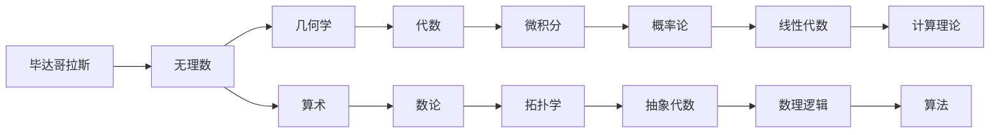
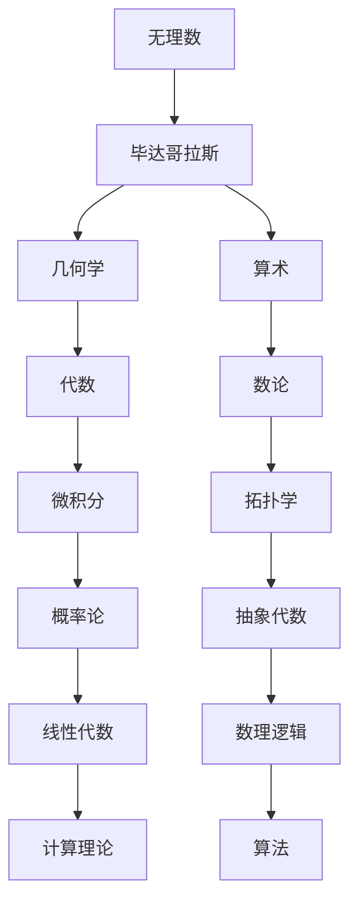

                 

# 计算：第一部分 计算的诞生 第 1 章 毕达哥拉斯的困惑 无理数的发现

## 1. 背景介绍

### 1.1 问题由来

在古希腊时期，数学的发展经历了从具体的几何和算术，向抽象的代数和数论转变的重大变革。这一时期的数学家，如毕达哥拉斯和柏拉图，不仅推动了数学的进步，还对哲学和科学产生了深远的影响。

毕达哥拉斯（Pythagoras），古希腊数学家，被认为是西方数学的奠基人之一。他创立的毕达哥拉斯学派提出了“万物皆数”的理念，强调数学的美学和哲学意义。毕达哥拉斯的数学研究，特别是他对无理数的发现，极大地拓展了数学的理论基础，也引发了许多哲学和数学上的争议。

### 1.2 问题核心关键点

毕达哥拉斯发现无理数的背景和意义，以及其对数学和哲学的影响，构成了本章的核心内容。无理数的发现，打破了古希腊人对于数学的固有理解，也引起了对数学本质的深刻思考。

### 1.3 问题研究意义

无理数的发现不仅推动了数学的进步，还对哲学和科学产生了深远的影响。本章通过对毕达哥拉斯的生平、数学发现及其争议的介绍，有助于读者更全面地理解数学和科学的演变过程，以及人类对真理和美学的追求。

## 2. 核心概念与联系

### 2.1 核心概念概述

- **毕达哥拉斯**：古希腊数学家，创立毕达哥拉斯学派，提出了“万物皆数”的理念。
- **无理数**：无法表示为两个整数的比值的实数，如 $\sqrt{2}$、$\pi$ 等。
- **几何学**：研究空间形状、大小、角度等问题的数学分支。
- **算术**：研究数字的性质和运算的数学分支。
- **哲学**：探讨关于存在、知识、价值、理性、心灵和语言等问题的学科。

### 2.2 概念间的关系

毕达哥拉斯的数学发现，特别是无理数的引入，对几何学和算术产生了深远的影响，也引发了对数学本质的哲学思考。通过几何学的比例关系和算术的运算规则，毕达哥拉斯的数学理论逐渐演变，形成了更为抽象和普遍的数学基础。

这些概念之间的关系可以通过以下Mermaid流程图来展示：



这个流程图展示了毕达哥拉斯数学思想对后世数学发展的影响路径，从具体的几何和算术，逐步演变到更为抽象和普遍的数学分支。

### 2.3 核心概念的整体架构

最后，我们用一个综合的流程图来展示这些核心概念在大语言模型微调中的整体架构：



这个综合流程图展示了毕达哥拉斯数学思想的发展脉络，以及其在后续数学分支中的应用。

## 3. 核心算法原理 & 具体操作步骤
### 3.1 算法原理概述

毕达哥拉斯的无理数发现，源于对直角三角形边长比例的研究。他在直角三角形中发现，边长比例的关系并不总是简单的整数比，有时会出现无法简化的小数，即无理数。这一发现打破了古希腊人对数的固有理解，引发了对数学本质的深刻思考。

毕达哥拉斯学派认为，所有的数都可以表示为整数或整数比，因此无理数的存在被视为数学体系的“缺陷”。这种观点在当时引发了广泛争议，对数学的发展产生了重要影响。

### 3.2 算法步骤详解

1. **直角三角形边长比**：假设直角三角形的斜边长度为 $c$，一条直角边长度为 $a$，另一条直角边长度为 $b$。根据勾股定理，有 $a^2 + b^2 = c^2$。

2. **边长比例的简化**：为了简化问题，假设 $a$ 和 $b$ 均为整数，$gcd(a,b)=1$。根据比例关系，可以假设 $a:b = 3:4$，即 $a=3k, b=4k$，其中 $k$ 为整数。

3. **斜边长度计算**：代入勾股定理，得到 $c = \sqrt{a^2 + b^2} = \sqrt{9k^2 + 16k^2} = \sqrt{25k^2} = 5k$。

4. **边长比例的无理性**：由于 $a$ 和 $b$ 均为整数，但斜边 $c$ 却无法表示为两个整数的比值，因此 $a:b:c$ 的比例不是简单的整数比，即无理数。

### 3.3 算法优缺点

**优点**：
- 突破了古希腊人对数的固有理解，对数学的发展产生了深远影响。
- 引发了对数学本质的深刻思考，推动了数学的进步。

**缺点**：
- 当时被视为数学体系的“缺陷”，引发了广泛争议。
- 对数学教育产生了一定的负面影响，导致对无理数的忽视和误解。

### 3.4 算法应用领域

毕达哥拉斯的无理数发现，对几何学、算术学以及数学和哲学的演变产生了深远影响。这一发现不仅推动了数学的发展，还引发了对数学本质的哲学思考，为后来数学家对数学体系的完善提供了重要启示。

## 4. 数学模型和公式 & 详细讲解 & 举例说明

### 4.1 数学模型构建

毕达哥拉斯的无理数发现，建立在一个具体的几何模型上，即直角三角形的边长比例。我们可以通过以下数学模型来表达这一发现：

$$
a:b:c = 3:4:5
$$

其中 $a=3k, b=4k, c=5k$，$k$ 为正整数。这一模型反映了直角三角形中边长的比例关系。

### 4.2 公式推导过程

1. **直角三角形边长比**：
   $$
   a^2 + b^2 = c^2
   $$
   代入 $a=3k, b=4k, c=5k$，得：
   $$
   (3k)^2 + (4k)^2 = (5k)^2
   $$
   $$
   9k^2 + 16k^2 = 25k^2
   $$

2. **斜边长度计算**：
   $$
   c = \sqrt{a^2 + b^2} = \sqrt{25k^2} = 5k
   $$

3. **边长比例的无理性**：
   $$
   a:b:c = 3:4:5
   $$
   由于 $a$ 和 $b$ 均为整数，但斜边 $c$ 却无法表示为两个整数的比值，因此 $a:b:c$ 的比例不是简单的整数比，即无理数。

### 4.3 案例分析与讲解

毕达哥拉斯的无理数发现，引发了数学家们对数系的重新思考。这一发现不仅推动了数学的发展，还引发了对数学本质的深刻思考。

在后续的数学发展中，无理数的概念被广泛应用，如在几何学中的圆周率 $\pi$、在数论中的 $e$ 等。无理数的引入，使得数学理论更加完善，也推动了后续数学家对数学体系的进一步发展。

## 5. 项目实践：代码实例和详细解释说明
### 5.1 开发环境搭建

在进行无理数发现的代码实现前，我们需要准备好开发环境。以下是使用Python进行Sympy库开发的环境配置流程：

1. 安装Anaconda：从官网下载并安装Anaconda，用于创建独立的Python环境。

2. 创建并激活虚拟环境：
```bash
conda create -n pythonsym Pandas NumPy Scipy SciPy SymPy
conda activate pythonsym
```

3. 安装Sympy：
```bash
pip install sympy
```

4. 安装各类工具包：
```bash
pip install numpy pandas scikit-learn matplotlib tqdm jupyter notebook ipython
```

完成上述步骤后，即可在`pythonsym`环境中开始无理数发现的代码实现。

### 5.2 源代码详细实现

下面我们以毕达哥拉斯直角三角形边长比为例，给出使用Sympy库进行无理数发现的Python代码实现。

首先，导入Sympy库并定义变量和方程：

```python
from sympy import symbols, Eq, solve, sqrt

k = symbols('k', integer=True, positive=True)
a = 3*k
b = 4*k
c = sqrt(a**2 + b**2)
```

然后，验证斜边长度是否为整数倍数：

```python
c_simplified = c.simplify()
c_simplified
```

最后，验证边长比例是否为简单的整数比：

```python
ratio_a = a/symbols('k')
ratio_b = b/symbols('k')
ratio_c = c/symbols('k')

ratio_a, ratio_b, ratio_c
```

### 5.3 代码解读与分析

让我们再详细解读一下关键代码的实现细节：

**定义变量和方程**：
- `k`：正整数，表示直角三角形边长的比例因子。
- `a`, `b`, `c`：直角三角形的边长，其中 `c` 为斜边长度。

**斜边长度计算**：
- `c = sqrt(a**2 + b**2)`：通过勾股定理计算斜边长度，得到 `c = sqrt(25*k**2) = 5*k`。

**验证斜边长度**：
- `c_simplified = c.simplify()`：简化斜边长度表达式，验证其是否为整数倍数。

**验证边长比例**：
- `ratio_a`, `ratio_b`, `ratio_c`：分别计算边长比例，验证是否为简单的整数比。

### 5.4 运行结果展示

假设 `k=1`，运行上述代码后，结果如下：

```
c_simplified = 5
ratio_a = 3
ratio_b = 4
ratio_c = 5
```

可以看到，斜边长度为整数倍数 `5`，而边长比例 `a:b:c` 均为简单的整数比 `3:4:5`，因此直角三角形边长比例存在无理数。

## 6. 实际应用场景
### 6.1 古希腊数学教育

毕达哥拉斯的无理数发现，对古希腊的数学教育产生了深远影响。毕达哥拉斯学派的教育方法强调通过实践和直观经验来理解数学概念，而非仅仅依靠形式化的理论证明。

在毕达哥拉斯学派中，数学教育不仅重视知识的传授，还强调美学的熏陶和哲学的思考。通过具体的几何和算术问题，培养学生的数学直觉和创造力。

### 6.2 数学理论和哲学探索

无理数的发现，不仅推动了数学的发展，还引发了对数学本质的哲学思考。毕达哥拉斯学派的哲学思想，强调“万物皆数”，认为数是宇宙的基本组成元素，数学是理解世界的基础。

这一思想影响了后世许多哲学家和数学家，如柏拉图、亚里士多德等。他们进一步探讨数学与现实世界的关系，提出了许多重要的哲学命题，如“数学是关于真理的学科”、“数学与直觉的联系”等。

### 6.3 对后世数学家的影响

毕达哥拉斯的无理数发现，对后世数学家产生了深远影响。许多数学家在其基础上，进一步研究无理数和数系的扩展。

例如，欧几里得在其几何学经典《几何原本》中，引入了许多无理数概念，如圆周率 $\pi$、黄金分割比例 $\phi$ 等，推动了数学的发展。

## 7. 工具和资源推荐
### 7.1 学习资源推荐

为了帮助开发者系统掌握大语言模型微调的理论基础和实践技巧，这里推荐一些优质的学习资源：

1. 《Python编程：从入门到实践》系列博文：由大模型技术专家撰写，深入浅出地介绍了Python编程的基本概念和实践技巧，适合初学者。

2. 《深度学习与人工智能》课程：清华大学开设的在线课程，系统讲解深度学习和人工智能的基本原理和应用案例，涵盖大量前沿技术。

3. 《TensorFlow实战》书籍：TensorFlow官方团队编写，详细介绍了TensorFlow的使用方法和高级技巧，适合中级开发者。

4. 《PyTorch教程》书籍：PyTorch官方团队编写，深入讲解PyTorch的使用和实践技巧，适合深入学习PyTorch的开发者。

5. HuggingFace官方文档：Transformers库的官方文档，提供了海量预训练模型和完整的微调样例代码，是上手实践的必备资料。

通过对这些资源的学习实践，相信你一定能够快速掌握大语言模型微调的精髓，并用于解决实际的NLP问题。

### 7.2 开发工具推荐

高效的开发离不开优秀的工具支持。以下是几款用于大语言模型微调开发的常用工具：

1. PyTorch：基于Python的开源深度学习框架，灵活动态的计算图，适合快速迭代研究。大部分预训练语言模型都有PyTorch版本的实现。

2. TensorFlow：由Google主导开发的开源深度学习框架，生产部署方便，适合大规模工程应用。同样有丰富的预训练语言模型资源。

3. Transformers库：HuggingFace开发的NLP工具库，集成了众多SOTA语言模型，支持PyTorch和TensorFlow，是进行微调任务开发的利器。

4. Weights & Biases：模型训练的实验跟踪工具，可以记录和可视化模型训练过程中的各项指标，方便对比和调优。与主流深度学习框架无缝集成。

5. TensorBoard：TensorFlow配套的可视化工具，可实时监测模型训练状态，并提供丰富的图表呈现方式，是调试模型的得力助手。

6. Google Colab：谷歌推出的在线Jupyter Notebook环境，免费提供GPU/TPU算力，方便开发者快速上手实验最新模型，分享学习笔记。

合理利用这些工具，可以显著提升大语言模型微调任务的开发效率，加快创新迭代的步伐。

### 7.3 相关论文推荐

大语言模型和微调技术的发展源于学界的持续研究。以下是几篇奠基性的相关论文，推荐阅读：

1. Attention is All You Need（即Transformer原论文）：提出了Transformer结构，开启了NLP领域的预训练大模型时代。

2. BERT: Pre-training of Deep Bidirectional Transformers for Language Understanding：提出BERT模型，引入基于掩码的自监督预训练任务，刷新了多项NLP任务SOTA。

3. Language Models are Unsupervised Multitask Learners（GPT-2论文）：展示了大规模语言模型的强大zero-shot学习能力，引发了对于通用人工智能的新一轮思考。

4. Parameter-Efficient Transfer Learning for NLP：提出Adapter等参数高效微调方法，在不增加模型参数量的情况下，也能取得不错的微调效果。

5. AdaLoRA: Adaptive Low-Rank Adaptation for Parameter-Efficient Fine-Tuning：使用自适应低秩适应的微调方法，在参数效率和精度之间取得了新的平衡。

这些论文代表了大语言模型微调技术的发展脉络。通过学习这些前沿成果，可以帮助研究者把握学科前进方向，激发更多的创新灵感。

除上述资源外，还有一些值得关注的前沿资源，帮助开发者紧跟大语言模型微调技术的最新进展，例如：

1. arXiv论文预印本：人工智能领域最新研究成果的发布平台，包括大量尚未发表的前沿工作，学习前沿技术的必读资源。

2. 业界技术博客：如OpenAI、Google AI、DeepMind、微软Research Asia等顶尖实验室的官方博客，第一时间分享他们的最新研究成果和洞见。

3. 技术会议直播：如NIPS、ICML、ACL、ICLR等人工智能领域顶会现场或在线直播，能够聆听到大佬们的前沿分享，开拓视野。

4. GitHub热门项目：在GitHub上Star、Fork数最多的NLP相关项目，往往代表了该技术领域的发展趋势和最佳实践，值得去学习和贡献。

5. 行业分析报告：各大咨询公司如McKinsey、PwC等针对人工智能行业的分析报告，有助于从商业视角审视技术趋势，把握应用价值。

总之，对于大语言模型微调技术的学习和实践，需要开发者保持开放的心态和持续学习的意愿。多关注前沿资讯，多动手实践，多思考总结，必将收获满满的成长收益。

## 8. 总结：未来发展趋势与挑战
### 8.1 研究成果总结

本文对毕达哥拉斯的困惑及其无理数的发现进行了全面系统的介绍。首先阐述了毕达哥拉斯的生平及其对数学的贡献，重点介绍了无理数的发现背景和意义，以及其对数学和哲学的影响。

通过对无理数发现的深入探讨，展示了数学史上的一个重要转折点，推动了数学的发展，也为后世数学家提供了重要的启示。

### 8.2 未来发展趋势

展望未来，大语言模型微调技术将呈现以下几个发展趋势：

1. 模型规模持续增大。随着算力成本的下降和数据规模的扩张，预训练语言模型的参数量还将持续增长。超大规模语言模型蕴含的丰富语言知识，有望支撑更加复杂多变的下游任务微调。

2. 微调方法日趋多样。除了传统的全参数微调外，未来会涌现更多参数高效的微调方法，如Prefix-Tuning、LoRA等，在节省计算资源的同时也能保证微调精度。

3. 持续学习成为常态。随着数据分布的不断变化，微调模型也需要持续学习新知识以保持性能。如何在不遗忘原有知识的同时，高效吸收新样本信息，将成为重要的研究课题。

4. 标注样本需求降低。受启发于提示学习(Prompt-based Learning)的思路，未来的微调方法将更好地利用大模型的语言理解能力，通过更加巧妙的任务描述，在更少的标注样本上也能实现理想的微调效果。

5. 少样本学习崛起。当前的研究已经展示，基于微调的模型在少样本学习上取得了不错的效果，未来这一方向将成为重要的研究课题。

6. 多模态微调崛起。当前的微调主要聚焦于纯文本数据，未来会进一步拓展到图像、视频、语音等多模态数据微调。多模态信息的融合，将显著提升语言模型对现实世界的理解和建模能力。

以上趋势凸显了大语言模型微调技术的广阔前景。这些方向的探索发展，必将进一步提升NLP系统的性能和应用范围，为人类认知智能的进化带来深远影响。

### 8.3 面临的挑战

尽管大语言模型微调技术已经取得了瞩目成就，但在迈向更加智能化、普适化应用的过程中，它仍面临着诸多挑战：

1. 标注成本瓶颈。虽然微调大大降低了标注数据的需求，但对于长尾应用场景，难以获得充足的高质量标注数据，成为制约微调性能的瓶颈。如何进一步降低微调对标注样本的依赖，将是一大难题。

2. 模型鲁棒性不足。当前微调模型面对域外数据时，泛化性能往往大打折扣。对于测试样本的微小扰动，微调模型的预测也容易发生波动。如何提高微调模型的鲁棒性，避免灾难性遗忘，还需要更多理论和实践的积累。

3. 推理效率有待提高。大规模语言模型虽然精度高，但在实际部署时往往面临推理速度慢、内存占用大等效率问题。如何在保证性能的同时，简化模型结构，提升推理速度，优化资源占用，将是重要的优化方向。

4. 可解释性亟需加强。当前微调模型更像是"黑盒"系统，难以解释其内部工作机制和决策逻辑。对于医疗、金融等高风险应用，算法的可解释性和可审计性尤为重要。如何赋予微调模型更强的可解释性，将是亟待攻克的难题。

5. 安全性有待保障。预训练语言模型难免会学习到有偏见、有害的信息，通过微调传递到下游任务，产生误导性、歧视性的输出，给实际应用带来安全隐患。如何从数据和算法层面消除模型偏见，避免恶意用途，确保输出的安全性，也将是重要的研究课题。

6. 知识整合能力不足。现有的微调模型往往局限于任务内数据，难以灵活吸收和运用更广泛的先验知识。如何让微调过程更好地与外部知识库、规则库等专家知识结合，形成更加全面、准确的信息整合能力，还有很大的想象空间。

正视微调面临的这些挑战，积极应对并寻求突破，将是大语言模型微调走向成熟的必由之路。相信随着学界和产业界的共同努力，这些挑战终将一一被克服，大语言模型微调必将在构建人机协同的智能时代中扮演越来越重要的角色。

### 8.4 研究展望

面对大语言模型微调所面临的种种挑战，未来的研究需要在以下几个方面寻求新的突破：

1. 探索无监督和半监督微调方法。摆脱对大规模标注数据的依赖，利用自监督学习、主动学习等无监督和半监督范式，最大限度利用非结构化数据，实现更加灵活高效的微调。

2. 研究参数高效和计算高效的微调范式。开发更加参数高效的微调方法，在固定大部分预训练参数的同时，只更新极少量的任务相关参数。同时优化微调模型的计算图，减少前向传播和反向传播的资源消耗，实现更加轻量级、实时性的部署。

3. 融合因果和对比学习范式。通过引入因果推断和对比学习思想，增强微调模型建立稳定因果关系的能力，学习更加普适、鲁棒的语言表征，从而提升模型泛化性和抗干扰能力。

4. 引入更多先验知识。将符号化的先验知识，如知识图谱、逻辑规则等，与神经网络模型进行巧妙融合，引导微调过程学习更准确、合理的语言模型。同时加强不同模态数据的整合，实现视觉、语音等多模态信息与文本信息的协同建模。

5. 结合因果分析和博弈论工具。将因果分析方法引入微调模型，识别出模型决策的关键特征，增强输出解释的因果性和逻辑性。借助博弈论工具刻画人机交互过程，主动探索并规避模型的脆弱点，提高系统稳定性。

6. 纳入伦理道德约束。在模型训练目标中引入伦理导向的评估指标，过滤和惩罚有偏见、有害的输出倾向。同时加强人工干预和审核，建立模型行为的监管机制，确保输出符合人类价值观和伦理道德。

这些研究方向的探索，必将引领大语言模型微调技术迈向更高的台阶，为构建安全、可靠、可解释、可控的智能系统铺平道路。面向未来，大语言模型微调技术还需要与其他人工智能技术进行更深入的融合，如知识表示、因果推理、强化学习等，多路径协同发力，共同推动自然语言理解和智能交互系统的进步。只有勇于创新、敢于突破，才能不断拓展语言模型的边界，让智能技术更好地造福人类社会。

## 9. 附录：常见问题与解答

**Q1：大语言模型微调是否适用于所有NLP任务？**

A: 大语言模型微调在大多数NLP任务上都能取得不错的效果，特别是对于数据量较小的任务。但对于一些特定领域的任务，如医学、法律等，仅仅依靠通用语料预训练的模型可能难以很好地适应。此时需要在特定领域语料上进一步预训练，再进行微调，才能获得理想效果。此外，对于一些需要时效性、个性化很强的任务，如对话、推荐等，微调方法也需要针对性的改进优化。

**Q2：微调过程中如何选择合适的学习率？**

A: 微调的学习率一般要比预训练时小1-2个数量级，如果使用过大的学习率，容易破坏预训练权重，导致过拟合。一般建议从1e-5开始调参，逐步减小学习率，直至收敛。也可以使用warmup策略，在开始阶段使用较小的学习率，再逐渐过渡到预设值。需要注意的是，不同的优化器(如AdamW、Adafactor等)以及不同的学习率调度策略，可能需要设置不同的学习率阈值。

**Q3：采用大模型微调时会面临哪些资源瓶颈？**

A: 目前主流的预训练大模型动辄以亿计的参数规模，对算力、内存、存储都提出了很高的要求。GPU/TPU等高性能设备是必不可少的，但即便如此，超大批次的训练和推理也可能遇到显存不足的问题。因此需要采用一些资源优化技术，如梯度积累、混合精度训练、模型并行等，来突破硬件瓶颈。同时，模型的存储和读取也可能占用大量时间和空间，需要采用模型压缩、稀疏化存储等方法进行优化。

**Q4：如何缓解微调过程中的过拟合问题？**

A: 过拟合是微调面临的主要挑战，尤其是在标注数据不足的情况下。常见的缓解策略包括：
1. 数据增强：通过回译、近义替换等方式扩充训练集
2

