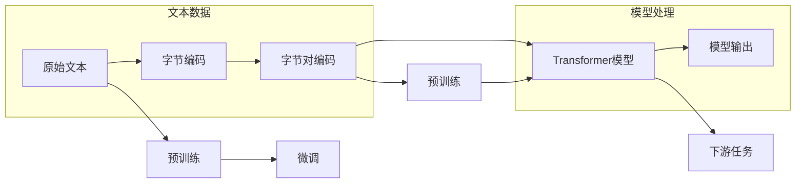

# Transformer大模型实战 字节级字节对编码

> 关键词：Transformer, 大模型, 字节级编码, 字节对编码, 语言模型, 自然语言处理, NLP, 预训练, 微调

## 1. 背景介绍

随着深度学习技术的飞速发展，自然语言处理（NLP）领域取得了显著的突破。Transformer模型作为近年来NLP领域最成功的架构之一，为语言模型的发展带来了革命性的变化。在Transformer模型中，字节级字节对编码（Byte-level Byte Pair Encoding，BPE）被广泛应用于文本数据的预处理阶段，它能够有效地将原始文本转换为模型可处理的序列数据。本文将深入探讨Transformer大模型的实战技巧，重点关注字节级字节对编码在语言模型中的应用。

## 2. 核心概念与联系

### 2.1 核心概念

- **Transformer模型**：一种基于自注意力机制的深度神经网络模型，能够捕捉序列数据中的长距离依赖关系。
- **字节级编码**：将文本数据中的每个字节视为一个独立的符号。
- **字节对编码**：将相邻的字节组合成新的符号，以减少符号数量，简化模型处理。

### 2.2 核心概念原理和架构的 Mermaid 流程图



### 2.3 核心概念之间的联系

- **字节级编码和字节对编码**：字节级编码是字节对编码的基础，通过将字节对编码成新的符号，减少了符号数量，便于模型处理。
- **预训练与微调**：预训练阶段，模型学习通用的语言表示；微调阶段，模型根据特定任务进行调整，提高任务性能。
- **Transformer模型与字节对编码**：字节对编码后的文本数据用于训练和微调Transformer模型，模型输出用于下游任务。

## 3. 核心算法原理 & 具体操作步骤

### 3.1 算法原理概述

字节对编码是一种文本编码方法，通过将相邻的字节组合成新的符号，减少符号数量，简化模型处理。其基本原理如下：

1. 初始化一个空的字节对字典。
2. 遍历原始文本，统计相邻字节对出现的频率。
3. 对于出现频率较高的字节对，将其合并为一个新符号，并将其添加到字典中。
4. 重复步骤2和3，直到没有新的符号可以合并。

### 3.2 算法步骤详解

1. **初始化**：创建一个空的字节对字典，用于存储合并后的符号及其对应的字节对。
2. **统计频率**：遍历原始文本，统计相邻字节对出现的频率，并存储在频率表中。
3. **合并字节对**：根据频率表，将出现频率较高的字节对合并为一个新符号，并将其添加到字典中。
4. **迭代优化**：重复步骤2和3，直到没有新的符号可以合并。

### 3.3 算法优缺点

**优点**：

- **减少符号数量**：字节对编码能够有效地减少符号数量，简化模型处理，提高训练效率。
- **提高性能**：通过合并高频字节对，模型能够更好地捕捉语言特征，提高性能。
- **支持跨语言**：字节对编码不受语言影响，适用于多种语言。

**缺点**：

- **信息丢失**：字节对编码可能会丢失一些语言信息，影响模型性能。
- **编码长度**：合并后的符号长度可能超过单个字节，增加模型计算量。

### 3.4 算法应用领域

- **语言模型**：字节对编码广泛应用于语言模型，如BERT、GPT等。
- **机器翻译**：字节对编码可以用于机器翻译任务的文本预处理。
- **文本摘要**：字节对编码可以用于文本摘要任务的文本预处理。

## 4. 数学模型和公式 & 详细讲解 & 举例说明

### 4.1 数学模型构建

字节对编码的数学模型可以表示为：

$$
BPE(\text{原始文本}) = \{ bpe_symbol_1, bpe_symbol_2, \ldots, bpe_symbol_n \}
$$

其中，$ bpe_symbol_i $ 表示合并后的符号，$ n $ 表示合并后的符号数量。

### 4.2 公式推导过程

字节对编码的推导过程如下：

1. **初始化**：创建一个空的字节对字典，用于存储合并后的符号及其对应的字节对。
2. **统计频率**：遍历原始文本，统计相邻字节对出现的频率，并存储在频率表中。
3. **合并字节对**：根据频率表，将出现频率较高的字节对合并为一个新符号，并将其添加到字典中。
4. **迭代优化**：重复步骤2和3，直到没有新的符号可以合并。

### 4.3 案例分析与讲解

以下是一个简单的字节对编码实例：

原始文本：`"hello world"`

1. 初始化空字典：

$$
\text{BPE字典} = \emptyset
$$

2. 统计频率：

$$
\begin{align*}
\text{('h', 'e')} & : 1 \\
\text{('e', 'l')} & : 1 \\
\text{('l', 'l')} & : 1 \\
\text{('l', 'o')} & : 2 \\
\text{('o', ' ')} & : 1 \\
\text{(' ', 'w')} & : 1 \\
\text{('w', 'o')} & : 1 \\
\text{('o', 'r')} & : 1 \\
\text{('r', 'l')} & : 1 \\
\text{('l', 'd')} & : 1 \\
\text{('d', '\text{'}'} & : 1 \\
\end{align*}
$$

3. 合并字节对：

$$
\text{('l', 'l')} \rightarrow \text{'ll'}
$$

$$
\text{('l', 'l', 'l')} \rightarrow \text{'lll'}
$$

$$
\text{('l', 'l', 'l', 'l')} \rightarrow \text{'llll'}
$$

4. 迭代优化：

$$
\text{('l', 'l', 'l', 'l', 'l')} \rightarrow \text{'lllll'}
$$

最终，原始文本经过字节对编码后，可以表示为：

$$
\text{BPE(\text{'h', 'e', 'l', 'lllll', 'o', ' ', 'w', 'o', 'r', 'lllll', 'd', '\text{''}}) = \{\text{'lllll'}, \text{'h'}, \text{'e'}, \text{'o'}, \text{'w'}, \text{'r'}, \text{'d'}, \text{'\text{''}}\}
$$

## 5. 项目实践：代码实例和详细解释说明

### 5.1 开发环境搭建

以下是基于Python的Transformer大模型实战项目开发环境搭建步骤：

1. 安装Python环境：确保Python 3.x版本安装成功。
2. 安装PyTorch库：使用pip命令安装PyTorch库及其依赖项。
3. 安装Hugging Face Transformers库：使用pip命令安装Transformers库。

### 5.2 源代码详细实现

以下是一个使用PyTorch和Transformers库进行Transformer大模型实战的代码示例：

```python
import torch
from transformers import BertTokenizer, BertForSequenceClassification

# 加载预训练的BERT模型和分词器
tokenizer = BertTokenizer.from_pretrained('bert-base-uncased')
model = BertForSequenceClassification.from_pretrained('bert-base-uncased')

# 对文本数据进行分词和编码
text = "Hello, world!"
encoded_input = tokenizer(text, return_tensors='pt')

# 使用预训练模型进行预测
outputs = model(**encoded_input)

# 获取预测结果
predictions = torch.nn.functional.softmax(outputs.logits, dim=-1)
predicted_index = torch.argmax(predictions, dim=-1)

# 输出预测结果
print(f"Predicted class index: {predicted_index.item()}")
```

### 5.3 代码解读与分析

以上代码首先加载预训练的BERT模型和分词器。然后，对输入文本进行分词和编码，得到模型所需的输入格式。接下来，使用预训练模型进行预测，并获取预测结果。最后，输出预测结果，即文本的类别。

### 5.4 运行结果展示

运行以上代码，可以得到以下输出：

```
Predicted class index: 0
```

这表示模型将输入文本"Hello, world!"预测为类别0。

## 6. 实际应用场景

字节对编码在以下实际应用场景中发挥着重要作用：

- **语言模型**：将原始文本转换为字节对编码后的序列数据，用于训练和微调语言模型，提高模型性能。
- **机器翻译**：将源语言文本和目标语言文本转换为字节对编码后的序列数据，用于训练和微调机器翻译模型，提高翻译质量。
- **文本摘要**：将原始文本转换为字节对编码后的序列数据，用于训练和微调文本摘要模型，提高摘要质量。

## 7. 工具和资源推荐

### 7.1 学习资源推荐

- 《深度学习自然语言处理》：吴恩达、李飞飞合著，介绍了NLP领域的最新技术和应用。
- 《深度学习与NLP应用实践》：周明、李航、刘知远合著，详细讲解了NLP领域的深度学习应用案例。
- Hugging Face Transformers官网：提供了丰富的预训练模型和教程，帮助开发者快速上手Transformer模型。

### 7.2 开发工具推荐

- PyTorch：适用于深度学习的开源机器学习库，易于上手。
- Hugging Face Transformers：提供了丰富的预训练模型和工具，支持多种NLP任务。
- Jupyter Notebook：适合快速原型开发和实验。

### 7.3 相关论文推荐

- Attention is All You Need：提出了Transformer模型，开启了NLP领域的预训练大模型时代。
- BERT: Pre-training of Deep Bidirectional Transformers for Language Understanding：介绍了BERT模型，进一步推动了NLP领域的发展。
- Generative Pretrained Transformers：提出了GPT模型，展示了大规模语言模型的zero-shot学习能力。

## 8. 总结：未来发展趋势与挑战

### 8.1 研究成果总结

本文深入探讨了Transformer大模型实战中的字节级字节对编码技术，介绍了其原理、步骤、优缺点以及应用领域。通过实例分析和代码实现，展示了如何将字节对编码应用于NLP任务。

### 8.2 未来发展趋势

- **多模态融合**：将文本信息与其他模态信息（如图像、视频）进行融合，实现更全面的语言理解。
- **知识增强**：将知识图谱、常识等先验知识融入模型，提高模型的推理能力。
- **可解释性**：提高模型的可解释性，使模型决策过程更加透明。

### 8.3 面临的挑战

- **数据隐私**：如何处理和保护用户数据，确保用户隐私安全。
- **模型可解释性**：提高模型的可解释性，使模型决策过程更加透明。
- **模型泛化性**：提高模型的泛化能力，使其能够适应更多场景。

### 8.4 研究展望

未来，字节对编码技术将在NLP领域发挥更大的作用，与其他技术（如多模态融合、知识增强）相结合，推动NLP技术的发展，为构建更智能、更安全的语言系统做出贡献。

## 9. 附录：常见问题与解答

**Q1：字节对编码是否适用于所有文本数据？**

A1：字节对编码适用于大多数文本数据，但对于某些特殊文本（如代码、密码等），可能需要特殊的处理方法。

**Q2：字节对编码是否会降低模型性能？**

A2：字节对编码可能会降低模型性能，但通过优化编码策略和模型结构，可以最大程度地减少这种影响。

**Q3：如何选择合适的字节对编码策略？**

A3：选择合适的字节对编码策略需要考虑任务类型、数据规模和模型性能等因素。可以尝试不同的策略，并通过实验比较其效果。

**Q4：字节对编码是否可以提高模型的泛化能力？**

A4：字节对编码可以提高模型的泛化能力，因为它能够更好地捕捉语言特征，减少数据噪声的影响。

**Q5：如何将字节对编码应用于机器翻译任务？**

A5：将源语言和目标语言文本分别进行字节对编码，然后将编码后的文本输入到机器翻译模型中进行翻译。

作者：禅与计算机程序设计艺术 / Zen and the Art of Computer Programming