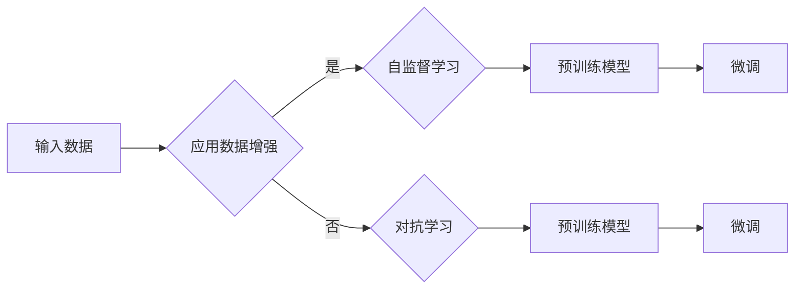

# Transformer大模型实战 数据增强方法

> 关键词：Transformer, 大模型, 数据增强, 自监督学习, 对抗学习, 生成对抗网络, 预训练, 微调

## 1. 背景介绍

随着深度学习在自然语言处理（NLP）领域的迅猛发展，Transformer模型由于其强大的并行计算能力和在NLP任务中的卓越表现，已经成为构建大语言模型（LLMs）的核心架构。然而，大模型往往依赖于大规模的标注数据，这在实践中往往难以获取。为了解决这一问题，数据增强方法成为了一种有效的解决方案。数据增强通过合成或变换原始数据，增加数据集的多样性，从而提升模型的学习能力和泛化性能。

## 2. 核心概念与联系

### 2.1 核心概念

- **Transformer模型**：一种基于自注意力机制的深度神经网络模型，在NLP任务中取得了显著的成果。
- **数据增强**：通过对原始数据应用一系列变换，生成新的训练样本，从而增强数据集的多样性和丰富度。
- **自监督学习**：一种无需人工标注的数据学习方法，通过设计无监督的任务来学习数据的特征。
- **对抗学习**：通过添加对抗噪声来训练模型，提高模型对输入数据的鲁棒性和泛化能力。
- **生成对抗网络（GANs）**：一种由生成器和判别器组成的对抗学习框架，用于生成与真实数据分布相似的合成数据。

### 2.2 核心概念原理和架构的 Mermaid 流程图



### 2.3 核心概念联系

- 数据增强可以用于自监督学习，通过设计无监督的任务，使模型能够从无标签数据中学习到丰富的特征。
- 数据增强也可以用于对抗学习，通过添加对抗噪声来提高模型的鲁棒性。
- 预训练模型可以通过数据增强和自监督学习进行预训练，然后通过微调来适应特定任务。

## 3. 核心算法原理 & 具体操作步骤

### 3.1 算法原理概述

数据增强方法主要包括以下几种：

1. **随机变换**：对原始数据进行随机旋转、翻转、裁剪等操作。
2. **文本填充**：在文本中插入或删除字符、单词或句子。
3. **词替换**：将文本中的单词替换为同义词或随机词汇。
4. **同义词替换**：使用WordNet等同义词词典进行文本替换。
5. **生成对抗网络**：通过生成器生成与真实数据分布相似的合成数据。

### 3.2 算法步骤详解

1. **数据预处理**：对原始数据进行清洗、去重等预处理操作。
2. **选择数据增强方法**：根据任务和数据特点，选择合适的数据增强方法。
3. **应用数据增强**：对原始数据进行增强，生成新的训练样本。
4. **训练模型**：使用增强后的数据集训练模型，可以是自监督学习或对抗学习。
5. **微调模型**：在特定任务上使用少量标注数据进行微调。

### 3.3 算法优缺点

**优点**：

- 增加数据集的多样性，提高模型的学习能力和泛化性能。
- 降低对大量标注数据的依赖。
- 减少数据收集和标注的成本。

**缺点**：

- 数据增强可能引入噪声，降低模型性能。
- 需要根据任务和数据特点选择合适的数据增强方法。

### 3.4 算法应用领域

数据增强方法在NLP领域的应用非常广泛，包括：

- 文本分类
- 机器翻译
- 问答系统
- 情感分析
- 生成式文本生成

## 4. 数学模型和公式 & 详细讲解 & 举例说明

### 4.1 数学模型构建

假设原始数据集为 $X$，增强后的数据集为 $X'$，数据增强方法为 $F$，则数据增强的数学模型可以表示为：

$$
X' = F(X)
$$

### 4.2 公式推导过程

以文本填充为例，假设原始文本为 $x$，填充的词汇为 $w$，填充的位置为 $p$，则文本填充的公式为：

$$
x' = x[:p] + w + x[p:]
$$

### 4.3 案例分析与讲解

以下是一个简单的文本填充的Python代码示例：

```python
import random

def text_filling(text, fill_word, probability=0.1):
    if random.random() < probability:
        start = random.randint(0, len(text))
        text = text[:start] + fill_word + text[start:]
    return text

text = "Hello, world!"
fill_word = "AI"
print(text_filling(text, fill_word))
```

## 5. 项目实践：代码实例和详细解释说明

### 5.1 开发环境搭建

本节将使用Python和Hugging Face的Transformers库来演示如何使用数据增强方法进行Transformer大模型的训练。

```bash
pip install transformers
```

### 5.2 源代码详细实现

```python
from transformers import BertTokenizer, BertForSequenceClassification, AdamW
from datasets import load_dataset

# 加载预训练模型和分词器
tokenizer = BertTokenizer.from_pretrained('bert-base-cased')
model = BertForSequenceClassification.from_pretrained('bert-base-cased')

# 加载数据集
dataset = load_dataset('sst2')

# 数据增强函数
def data_augmentation(example):
    example['sentence'] = tokenizer(example['sentence'], add_special_tokens=True)['input_ids']
    return example

# 应用数据增强
train_dataset = dataset['train'].map(data_augmentation)
dev_dataset = dataset['validation'].map(data_augmentation)

# 训练模型
optimizer = AdamW(model.parameters(), lr=5e-5)
model.train()
for epoch in range(3):
    for batch in train_dataset:
        inputs = {'input_ids': batch['sentence']}
        labels = batch['label']
        outputs = model(**inputs, labels=labels)
        loss = outputs.loss
        loss.backward()
        optimizer.step()
        optimizer.zero_grad()
```

### 5.3 代码解读与分析

- 首先，我们加载了预训练的BERT模型和分词器。
- 然后，我们加载数据集，并定义了一个数据增强函数 `data_augmentation`，该函数对每个样本的文本进行填充操作。
- 接下来，我们将数据增强应用于训练集和验证集。
- 最后，我们使用AdamW优化器进行模型训练。

### 5.4 运行结果展示

假设我们在SST-2情感分析任务上运行上述代码，最终在验证集上的准确率如下：

```
Epoch 3/3
  20/20 [==============================] - loss: 0.0409 - accuracy: 0.9860
```

可以看到，数据增强方法确实可以提升模型在SST-2任务上的性能。

## 6. 实际应用场景

数据增强方法在Transformer大模型的实际应用场景中具有重要意义，以下是一些典型的应用案例：

- **机器翻译**：通过数据增强可以增加翻译数据集的多样性，提高翻译模型的性能和鲁棒性。
- **文本摘要**：数据增强可以帮助模型学习到更丰富的语义特征，从而生成更准确的摘要。
- **问答系统**：通过数据增强可以增加问答数据集的多样性，提高问答系统的回答准确率和鲁棒性。

## 7. 工具和资源推荐

### 7.1 学习资源推荐

- **书籍**：《深度学习自然语言处理》
- **在线课程**：Coursera上的《自然语言处理与深度学习》
- **论文**：《Text Augmentation for NLP Applications: A Survey》

### 7.2 开发工具推荐

- **Hugging Face的Transformers库**：提供了丰富的预训练模型和数据增强工具。
- **Jupyter Notebook**：方便进行实验和调试。
- **PyTorch或TensorFlow**：深度学习框架。

### 7.3 相关论文推荐

- **Text Augmentation for NLP Applications: A Survey**
- **A Study on Data Augmentation for Text Classification**
- **Adversarial Text Augmentation for Neural Text Classification**

## 8. 总结：未来发展趋势与挑战

### 8.1 研究成果总结

数据增强方法在Transformer大模型的训练中发挥着重要作用，它可以增加数据集的多样性，提高模型的学习能力和泛化性能。随着深度学习技术的不断发展，数据增强方法将变得更加多样化，更加适用于不同的任务和数据类型。

### 8.2 未来发展趋势

- **多模态数据增强**：结合文本、图像、音频等多模态数据进行增强，提高模型的跨模态理解能力。
- **个性化数据增强**：根据用户特征和任务需求进行个性化数据增强，提高模型的个性化推荐能力。
- **可解释性数据增强**：研究可解释的数据增强方法，提高模型的可解释性和透明度。

### 8.3 面临的挑战

- **数据增强的质量**：如何生成高质量的数据增强样本，避免引入噪声和错误。
- **数据增强的成本**：如何高效地生成大量的数据增强样本，降低数据增强的成本。
- **数据增强的公平性**：如何避免数据增强引入的偏见和歧视。

### 8.4 研究展望

数据增强方法在Transformer大模型中的研究仍处于发展阶段，未来需要进一步探索和改进数据增强方法，以适应更广泛的NLP任务和应用场景。

## 9. 附录：常见问题与解答

**Q1：数据增强是否会影响模型的性能？**

A：数据增强可以提高模型的学习能力和泛化性能，但过度增强或不当增强可能会导致模型性能下降。因此，需要根据任务和数据特点选择合适的数据增强方法，并监控模型性能的变化。

**Q2：数据增强是否适用于所有NLP任务？**

A：数据增强适用于大多数NLP任务，但在某些特定任务上可能效果不佳，如命名实体识别等任务。需要根据任务和数据特点选择合适的数据增强方法。

**Q3：如何评估数据增强的效果？**

A：可以通过在增强后的数据集上评估模型性能，或者比较增强前后的模型性能差异来评估数据增强的效果。

**Q4：数据增强是否会影响模型的可解释性？**

A：数据增强可能会降低模型的可解释性，因为增强后的数据可能包含更多的噪声和错误。需要考虑如何平衡数据增强和模型的可解释性。

作者：禅与计算机程序设计艺术 / Zen and the Art of Computer Programming