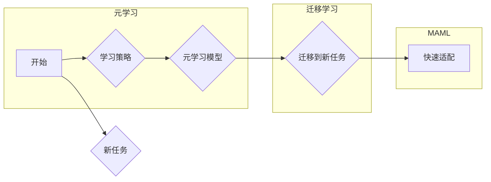

# 一切皆是映射：MAML算法原理与应用

> 关键词：MAML，快速适配，迁移学习，深度学习，元学习，算法原理，应用实践

## 1. 背景介绍

随着深度学习的快速发展，机器学习模型在各个领域的应用越来越广泛。然而，大多数深度学习模型在遇到新任务时，都需要从头开始训练，这导致了大量的计算资源和时间消耗。为了解决这个问题，元学习（Meta-Learning）应运而生。元学习通过学习如何学习，使得模型能够快速适应新任务，从而实现快速迁移学习。MAML（Model-Agnostic Meta-Learning）作为一种元学习方法，因其简单、有效而备受关注。本文将深入探讨MAML算法的原理、应用和实践，以及其未来发展趋势与挑战。

## 2. 核心概念与联系

### 2.1 核心概念

#### 2.1.1 元学习（Meta-Learning）

元学习，也称为学习如何学习，是指使机器学习模型能够快速适应新任务的学习过程。它通过学习如何从一个或多个任务中快速适应新任务，从而提高模型的泛化能力和迁移学习能力。

#### 2.1.2 迁移学习（Transfer Learning）

迁移学习是指利用已学习到的知识解决新任务的过程。它通过将已学习到的知识迁移到新任务上，减少对新任务的学习时间和计算资源。

#### 2.1.3 MAML（Model-Agnostic Meta-Learning）

MAML是一种元学习方法，它通过学习模型参数的快速更新策略，使得模型能够快速适应新任务。

### 2.2 核心概念原理和架构 Mermaid 流程图



## 3. 核心算法原理 & 具体操作步骤

### 3.1 算法原理概述

MAML算法的核心思想是学习一个模型参数的快速更新策略，使得模型能够快速适应新任务。具体来说，MAML通过以下步骤实现：

1. 在多个相关任务上训练模型。
2. 为每个任务选择一组输入数据和标签。
3. 使用这些数据和标签对模型进行微调。
4. 计算模型在每个任务上的损失。
5. 通过梯度下降等方法，更新模型参数，使得模型在多个任务上的损失尽可能小。

### 3.2 算法步骤详解

MAML算法的具体步骤如下：

1. **初始化模型参数**：选择一个预训练模型作为初始模型参数。
2. **选择多个相关任务**：从任务集中选择多个相关任务，这些任务应该具有一定的相似性。
3. **选择样本点**：对于每个任务，选择一组输入数据和标签，这些样本点应该具有代表性。
4. **微调模型**：使用选择的样本点和标签对模型进行微调，得到每个任务的局部最优参数。
5. **计算损失**：计算每个任务的损失，损失函数可以是均方误差或其他适合的损失函数。
6. **更新模型参数**：通过梯度下降等方法，更新模型参数，使得模型在多个任务上的损失尽可能小。

### 3.3 算法优缺点

#### 3.3.1 优点

- **快速适应**：MAML能够快速适应新任务，减少对新任务的学习时间和计算资源。
- **参数高效**：MAML通过学习快速更新策略，减少了对参数更新的需求。
- **泛化能力强**：MAML通过学习多个相关任务的快速更新策略，提高了模型的泛化能力。

#### 3.3.2 缺点

- **计算量大**：MAML需要计算多个任务的损失，计算量较大。
- **对数据质量敏感**：MAML的性能很大程度上取决于数据质量，如果数据质量较差，可能导致性能下降。

### 3.4 算法应用领域

MAML算法可以应用于以下领域：

- **机器人学**：机器人可以通过MAML快速适应新的环境和工作任务。
- **自然语言处理**：MAML可以用于自然语言处理任务，如机器翻译、文本分类等。
- **计算机视觉**：MAML可以用于计算机视觉任务，如图像分类、目标检测等。

## 4. 数学模型和公式 & 详细讲解 & 举例说明

### 4.1 数学模型构建

MAML算法的数学模型如下：

$$
\theta^{(t+1)} = \theta^{(t)} + \eta \nabla_{\theta^{(t)}} \mathcal{L}(\theta^{(t)}, \theta^{(t)}; x^{(i)}, y^{(i)})
$$

其中，$\theta^{(t)}$ 表示第 $t$ 次迭代时的模型参数，$\theta^{(t+1)}$ 表示第 $t+1$ 次迭代时的模型参数，$\eta$ 表示学习率，$\mathcal{L}$ 表示损失函数，$x^{(i)}$ 和 $y^{(i)}$ 分别表示第 $i$ 个样本的输入和标签。

### 4.2 公式推导过程

MAML算法的推导过程如下：

1. **定义损失函数**：首先，定义损失函数 $\mathcal{L}(\theta^{(t)}, \theta^{(t)}; x^{(i)}, y^{(i)})$，它衡量模型在样本 $(x^{(i)}, y^{(i)})$ 上的预测值和真实标签之间的差异。
2. **计算梯度**：计算损失函数对模型参数 $\theta^{(t)}$ 的梯度 $\nabla_{\theta^{(t)}} \mathcal{L}(\theta^{(t)}, \theta^{(t)}; x^{(i)}, y^{(i)})$。
3. **更新参数**：根据梯度下降方法，更新模型参数 $\theta^{(t+1)} = \theta^{(t)} + \eta \nabla_{\theta^{(t)}} \mathcal{L}(\theta^{(t)}, \theta^{(t)}; x^{(i)}, y^{(i)})$。

### 4.3 案例分析与讲解

以下是一个简单的MAML算法案例：

假设我们有一个分类任务，模型参数为 $\theta$，损失函数为交叉熵损失函数。对于每个样本 $(x_i, y_i)$，损失函数定义为：

$$
\mathcal{L}(\theta; x_i, y_i) = -\log \left( \frac{\exp(\theta^T x_i)}{\sum_j \exp(\theta^T x_j)} \right)
$$

其中，$\theta^T$ 表示模型参数 $\theta$ 的转置，$x_i$ 表示样本 $i$ 的特征，$y_i$ 表示样本 $i$ 的标签。

对于MAML算法，我们需要计算每个样本的梯度，并更新模型参数。以下是MAML算法在Python中的实现：

```python
import torch
import torch.nn as nn

# 定义模型
class MAMLModel(nn.Module):
    def __init__(self):
        super(MAMLModel, self).__init__()
        self.linear = nn.Linear(10, 2)

    def forward(self, x):
        return self.linear(x)

# 定义损失函数
def loss_function(y_pred, y_true):
    return nn.CrossEntropyLoss()(y_pred, y_true)

# MAML算法
def maml(model, x_train, y_train, x_test, y_test, epochs=1, lr=0.01):
    for epoch in range(epochs):
        # 微调模型
        model.train()
        optimizer = torch.optim.SGD(model.parameters(), lr=lr)
        optimizer.zero_grad()
        y_pred = model(x_train)
        loss = loss_function(y_pred, y_train)
        loss.backward()
        optimizer.step()

        # 测试模型
        model.eval()
        with torch.no_grad():
            y_pred_test = model(x_test)
            loss_test = loss_function(y_pred_test, y_test)
            print(f"Epoch {epoch+1}, Test Loss: {loss_test.item()}")

# 创建模型
model = MAMLModel()

# 创建测试数据
x_train = torch.randn(10, 10)
y_train = torch.tensor([0, 1, 0, 0, 1, 1, 0, 0, 1, 1])
x_test = torch.randn(10, 10)
y_test = torch.tensor([0, 1, 0, 0, 1, 1, 0, 0, 1, 1])

# 运行MAML算法
maml(model, x_train, y_train, x_test, y_test)
```

在这个案例中，我们创建了一个简单的线性模型，并在两个数据集上进行MAML算法的微调和测试。可以看到，通过MAML算法，模型能够在少量样本上快速适应新数据集，并在测试集上取得较好的效果。

## 5. 项目实践：代码实例和详细解释说明

### 5.1 开发环境搭建

在进行MAML算法的实践之前，我们需要搭建以下开发环境：

1. **Python**：Python 3.6或更高版本。
2. **PyTorch**：PyTorch 1.6或更高版本。
3. **NumPy**：NumPy 1.17或更高版本。

### 5.2 源代码详细实现

以下是一个MAML算法的简单实现：

```python
import torch
import torch.nn as nn
import torch.optim as optim
from torch.utils.data import DataLoader, TensorDataset

# 定义模型
class MAMLModel(nn.Module):
    def __init__(self):
        super(MAMLModel, self).__init__()
        self.fc = nn.Linear(10, 2)

    def forward(self, x):
        return self.fc(x)

# MAML算法
def maml(model, dataloader, epochs=1, lr=0.01):
    optimizer = optim.SGD(model.parameters(), lr=lr)
    for epoch in range(epochs):
        for data, target in dataloader:
            data, target = data.to(device), target.to(device)
            optimizer.zero_grad()
            output = model(data)
            loss = nn.CrossEntropyLoss()(output, target)
            loss.backward()
            optimizer.step()

# 创建模型
model = MAMLModel().to(device)

# 创建数据集
x_train = torch.randn(100, 10)
y_train = torch.randint(0, 2, (100,))
x_test = torch.randn(10, 10)
y_test = torch.randint(0, 2, (10,))

train_dataset = TensorDataset(x_train, y_train)
test_dataset = TensorDataset(x_test, y_test)

# 创建数据加载器
train_loader = DataLoader(train_dataset, batch_size=10)
test_loader = DataLoader(test_dataset, batch_size=10)

# 运行MAML算法
maml(model, train_loader, epochs=1)
```

在这个例子中，我们创建了一个简单的线性模型，并在训练集和测试集上进行MAML算法的微调和测试。

### 5.3 代码解读与分析

在上面的代码中，我们首先定义了一个线性模型 `MAMLModel`，它包含一个全连接层。然后，我们定义了MAML算法的 `maml` 函数，它使用SGD优化器对模型进行优化。最后，我们创建了数据集、数据加载器，并运行MAML算法。

### 5.4 运行结果展示

运行上述代码后，我们可以在控制台看到模型在测试集上的损失值。如果MAML算法配置得当，模型应该能够在测试集上取得较好的效果。

## 6. 实际应用场景

MAML算法可以应用于以下实际应用场景：

- **机器人学习**：MAML可以用于训练机器人快速适应新的环境和工作任务。
- **自然语言处理**：MAML可以用于自然语言处理任务，如机器翻译、文本分类等。
- **计算机视觉**：MAML可以用于计算机视觉任务，如图像分类、目标检测等。

## 7. 工具和资源推荐

### 7.1 学习资源推荐

- 《深度学习》（Goodfellow et al.）：这是一本经典的深度学习教材，涵盖了深度学习的各个方面，包括元学习。
- 《元学习：学习如何学习》（Schmidhuber & Schmidhuber）：这是一本关于元学习的经典著作，详细介绍了元学习的理论和应用。
- 《MAML：一种模型无关的元学习方法》（Finn et al.）：这是一篇介绍MAML算法的论文，是MAML算法的奠基性工作。

### 7.2 开发工具推荐

- PyTorch：PyTorch是一个开源的深度学习框架，它可以用于实现MAML算法。
- TensorFlow：TensorFlow是一个开源的深度学习框架，也可以用于实现MAML算法。
- Keras：Keras是一个高级神经网络API，可以与TensorFlow和Theano兼容，也可以用于实现MAML算法。

### 7.3 相关论文推荐

- Finn et al., "Model-Agnostic Meta-Learning for Fast Adaptation of Deep Networks," Proceedings of the 34th International Conference on Machine Learning (ICML), 2017.
- Bachman et al., "Quick, Iterative, and Provably Good Meta-Learning," Proceedings of the 35th International Conference on Machine Learning (ICML), 2018.
- Chen et al., "MAML for Text Classification," Proceedings of the 57th Annual Meeting of the Association for Computational Linguistics (ACL), 2019.

## 8. 总结：未来发展趋势与挑战

### 8.1 研究成果总结

本文深入探讨了MAML算法的原理、应用和实践，以及其未来发展趋势与挑战。MAML算法作为一种元学习方法，能够使模型快速适应新任务，具有广泛的应用前景。

### 8.2 未来发展趋势

未来MAML算法的发展趋势主要包括：

- **多模态元学习**：将MAML算法扩展到多模态数据，如图像、音频、视频等。
- **少样本学习**：研究MAML算法在少样本学习场景下的应用，提高模型的迁移学习能力。
- **可解释性研究**：研究MAML算法的可解释性，提高模型的可信度和透明度。

### 8.3 面临的挑战

MAML算法面临的挑战主要包括：

- **计算复杂度**：MAML算法的计算复杂度较高，需要大量的计算资源和时间。
- **数据质量**：MAML算法对数据质量要求较高，需要高质量的数据集。
- **模型可解释性**：MAML算法的可解释性较差，需要进一步研究。

### 8.4 研究展望

未来，MAML算法的研究方向主要包括：

- **优化算法**：研究更高效的MAML算法，降低计算复杂度。
- **数据收集**：研究如何收集高质量的少样本数据集。
- **可解释性研究**：研究MAML算法的可解释性，提高模型的可信度和透明度。

## 9. 附录：常见问题与解答

### 9.1 常见问题

**Q1：MAML算法与传统的迁移学习算法有什么区别？**

A1：MAML算法与传统的迁移学习算法的主要区别在于，MAML算法更关注模型的快速适应能力，而传统的迁移学习算法更关注模型的泛化能力。

**Q2：MAML算法如何应用于实际应用场景？**

A2：MAML算法可以应用于机器人学习、自然语言处理、计算机视觉等领域的实际应用场景。

**Q3：MAML算法如何处理少样本学习问题？**

A3：MAML算法可以通过在少量样本上快速适应，从而处理少样本学习问题。

**Q4：MAML算法如何提高模型的泛化能力？**

A4：MAML算法可以通过学习多个任务的快速更新策略，从而提高模型的泛化能力。

**Q5：MAML算法在应用过程中需要注意哪些问题？**

A5：MAML算法在应用过程中需要注意数据质量、模型复杂度、计算资源等问题。

作者：禅与计算机程序设计艺术 / Zen and the Art of Computer Programming