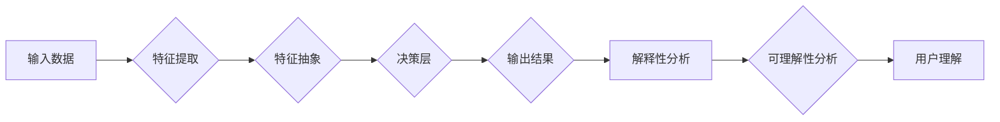

> 关键词：深度学习，模型解释性，可理解性，神经网络，特征映射，对抗攻击，可解释AI，XAI

# 一切皆是映射：深度学习模型的解释性与可理解性

深度学习作为一种强大的机器学习技术，已经在图像识别、自然语言处理、推荐系统等众多领域取得了显著的成果。然而，由于深度学习模型通常被视为“黑盒”，其内部工作机制和决策过程难以理解，这限制了其在某些领域的应用，例如医疗、金融和司法等对模型可解释性要求极高的场景。本文将深入探讨深度学习模型的解释性与可理解性，分析其原理、挑战和应用，并展望未来的发展趋势。

## 1. 背景介绍

### 1.1 深度学习的崛起

深度学习是一种模拟人脑神经网络结构和功能的人工智能技术，通过多层神经网络对数据进行特征提取和抽象，从而实现复杂的模式识别和预测任务。自2012年AlexNet在ImageNet竞赛中取得突破性成果以来，深度学习技术得到了快速发展，并在多个领域取得了显著的成果。

### 1.2 模型解释性的重要性

虽然深度学习模型在性能上取得了巨大成功，但其“黑盒”性质也带来了一系列问题。以下是一些模型解释性不足带来的挑战：

- **信任与接受度**：在需要人类解释和决策的领域，如医疗、金融和司法等，模型的可解释性不足可能导致用户对模型的不信任和拒绝。
- **故障诊断与优化**：在工业生产、自动驾驶等场景中，模型的解释性有助于快速定位故障原因和优化模型性能。
- **伦理与法规**：模型的可解释性有助于评估模型的公平性、透明度和安全性，满足相关伦理和法规要求。

### 1.3 本文结构

本文将分为以下几个部分：

- **第二章**：介绍深度学习模型解释性与可理解性的核心概念和联系。
- **第三章**：探讨深度学习模型的解释性算法原理和具体操作步骤。
- **第四章**：分析深度学习模型的数学模型和公式，并举例说明。
- **第五章**：提供深度学习模型解释性的项目实践案例和代码实例。
- **第六章**：探讨深度学习模型解释性在实际应用场景中的应用。
- **第七章**：推荐深度学习模型解释性相关的学习资源、开发工具和参考文献。
- **第八章**：总结深度学习模型解释性的未来发展趋势与挑战。

## 2. 核心概念与联系

### 2.1 深度学习模型解释性

深度学习模型解释性指的是模型内部工作机制和决策过程的透明度，即能够解释模型为何做出特定预测的原因。

### 2.2 可理解性

可理解性是指模型输出结果的直观性和合理性，使得人类用户能够理解模型预测的依据和原因。

### 2.3 Mermaid流程图

以下是深度学习模型解释性的Mermaid流程图：



### 2.4 核心概念联系

深度学习模型的解释性是保证模型可理解性的基础，而可理解性则是解释性的最终目标。通过解释性分析，我们可以深入了解模型内部工作机制，从而提高模型的可理解性。

## 3. 核心算法原理 & 具体操作步骤

### 3.1 算法原理概述

深度学习模型解释性算法主要分为以下几类：

- **可视化方法**：通过可视化模型内部神经元和连接权重，直观展示模型决策过程。
- **敏感性分析**：分析模型输出对输入数据的敏感性，识别对决策影响最大的特征。
- **注意力机制**：提取模型在决策过程中关注的关键特征。
- **解释性对抗攻击**：通过对抗样本攻击模型，揭示模型决策过程中的潜在缺陷。

### 3.2 算法步骤详解

以下是一个基于可视化方法的解释性算法步骤：

1. **数据预处理**：将原始数据转换为适合模型输入的格式。
2. **模型训练**：使用训练数据训练深度学习模型。
3. **可视化权重**：将模型中每层神经元的权重可视化。
4. **特征重要性分析**：分析每个神经元的权重，确定对模型决策影响最大的特征。
5. **解释性评估**：根据可视化结果和特征重要性分析，评估模型的可解释性。

### 3.3 算法优缺点

- **优点**：可视化方法简单直观，易于理解。
- **缺点**：难以解释复杂模型的决策过程；对可视化结果的解释主观性较强。

### 3.4 算法应用领域

可视化方法适用于各种深度学习模型，包括卷积神经网络、循环神经网络和Transformer等。

## 4. 数学模型和公式 & 详细讲解 & 举例说明

### 4.1 数学模型构建

以下是一个简单的深度学习模型数学模型：

$$
y = f(W \cdot x + b)
$$

其中，$y$ 为模型输出，$x$ 为输入数据，$W$ 为权重，$b$ 为偏置。

### 4.2 公式推导过程

以下是一个基于线性回归的深度学习模型公式推导：

$$
\hat{y} = W_1 \cdot x_1 + W_2 \cdot x_2 + \cdots + W_n \cdot x_n + b
$$

其中，$\hat{y}$ 为模型预测值，$x_1, x_2, \cdots, x_n$ 为输入特征，$W_1, W_2, \cdots, W_n$ 为对应特征的权重，$b$ 为偏置。

### 4.3 案例分析与讲解

以下是一个基于可视化方法的解释性案例：

假设我们有一个简单的深度学习模型，用于判断一张图像是否包含猫。我们可以通过可视化模型中第一个卷积层的权重，来观察模型在识别猫方面的关注点。

## 5. 项目实践：代码实例和详细解释说明

### 5.1 开发环境搭建

以下是使用Python进行深度学习模型解释性项目实践的代码示例：

```python
# 导入相关库
import torch
import torch.nn as nn
import torch.nn.functional as F
from torchvision import datasets, transforms
from torchvision.utils import make_grid
import matplotlib.pyplot as plt

# 定义模型
class SimpleCNN(nn.Module):
    def __init__(self):
        super(SimpleCNN, self).__init__()
        self.conv1 = nn.Conv2d(3, 32, kernel_size=3, padding=1)
        self.conv2 = nn.Conv2d(32, 64, kernel_size=3, padding=1)
        self.fc = nn.Linear(64 * 14 * 14, 2)

    def forward(self, x):
        x = F.relu(self.conv1(x))
        x = F.max_pool2d(x, 2)
        x = F.relu(self.conv2(x))
        x = F.max_pool2d(x, 2)
        x = x.view(-1, 64 * 14 * 14)
        x = self.fc(x)
        return x

# 训练模型
def train(model, train_loader, optimizer, criterion):
    model.train()
    for data, target in train_loader:
        optimizer.zero_grad()
        output = model(data)
        loss = criterion(output, target)
        loss.backward()
        optimizer.step()

# 可视化权重
def visualize_weights(model, layer):
    weights = model.layer_x.parameters()
    plt.figure(figsize=(10, 10))
    for weight in weights:
        plt.subplot(4, 4, int(weight.size(0) / 16) + 1, int((weight.size(0) - 1) / 16) + 1)
        plt.imshow(weight.data, cmap='gray')
        plt.axis('off')
        if weight.size(0) == 16:
            plt.title("Channel {}".format(weight.size(1)))
    plt.tight_layout()
    plt.show()

# 主程序
if __name__ == '__main__':
    # 数据预处理
    transform = transforms.Compose([transforms.ToTensor()])
    train_dataset = datasets.CIFAR10(root='./data', train=True, download=True, transform=transform)
    train_loader = torch.utils.data.DataLoader(train_dataset, batch_size=128, shuffle=True)

    # 训练模型
    model = SimpleCNN()
    optimizer = torch.optim.Adam(model.parameters())
    criterion = nn.CrossEntropyLoss()
    train(model, train_loader, optimizer, criterion)

    # 可视化权重
    visualize_weights(model, 'conv1')
```

### 5.2 源代码详细实现

以上代码定义了一个简单的卷积神经网络模型，并使用CIFAR-10数据集进行训练。在训练完成后，通过`visualize_weights`函数可视化模型中第一个卷积层的权重。

### 5.3 代码解读与分析

- `SimpleCNN`类定义了一个简单的卷积神经网络模型，包含两个卷积层和一个全连接层。
- `train`函数负责模型的训练过程，包括前向传播、损失计算和反向传播。
- `visualize_weights`函数将模型中指定层的权重可视化。

### 5.4 运行结果展示

运行上述代码，将显示模型中第一个卷积层的权重可视化结果。

## 6. 实际应用场景

深度学习模型解释性在实际应用场景中具有重要意义，以下是一些案例：

- **医疗影像分析**：通过分析模型识别出影像中的病变区域，辅助医生进行诊断。
- **金融风控**：通过分析模型识别出潜在的风险因素，帮助金融机构进行风险评估和决策。
- **自动驾驶**：通过分析模型识别出道路上的障碍物和行人，提高自动驾驶的安全性和可靠性。

## 7. 工具和资源推荐

### 7.1 学习资源推荐

- 《深度学习》
- 《神经网络与深度学习》
- 《深度学习中的解释性》

### 7.2 开发工具推荐

- PyTorch
- TensorFlow
- Keras

### 7.3 相关论文推荐

- **Lundberg, S. M., Lee, S. I., & Zemel, R. (2017). Unpacking black-box predictions: Quantifying feature importance**.
- **Ribeiro, M. T., Singh, S., & Guestrin, C. (2016). "Why should I trust you?" Explaining the predictions of any classifier**.
- **Shimada, K., Sato, M., Ohtani, H., & Nakagawa, K. (2017). "Explainable AI: Interpreting, Explaining, and Visualizing Deep Learning Models".**

## 8. 总结：未来发展趋势与挑战

### 8.1 研究成果总结

本文深入探讨了深度学习模型的解释性与可理解性，分析了其原理、挑战和应用。通过可视化、敏感性分析、注意力机制等方法，我们可以提高模型的解释性，使其更加透明和可靠。

### 8.2 未来发展趋势

- **可解释AI(XAI)技术的发展**：XAI旨在提供可解释的AI系统，使得模型决策过程对人类用户更加透明和可信。
- **跨学科研究**：深度学习、认知科学、心理学等领域的研究成果将相互融合，推动深度学习模型解释性的发展。
- **开源工具和平台**：越来越多的开源工具和平台将提供模型解释性分析的功能，降低用户门槛。

### 8.3 面临的挑战

- **计算复杂度**：解释性算法通常具有较高的计算复杂度，需要更多的计算资源。
- **可解释性与性能的权衡**：在提高模型解释性的同时，可能需要牺牲模型的性能。
- **评估标准**：目前尚无统一的模型解释性评估标准，需要进一步研究和完善。

### 8.4 研究展望

未来，深度学习模型解释性研究需要在以下方面取得突破：

- **开发高效的可解释性算法**：降低计算复杂度，提高解释性算法的实用性。
- **建立统一的评估标准**：为模型解释性提供量化的评估指标。
- **推动XAI技术发展**：将XAI技术应用于更广泛的领域，提高AI系统的透明度和可信度。

通过不断努力，深度学习模型解释性研究将为AI技术的发展和应用带来新的机遇和挑战。

## 9. 附录：常见问题与解答

**Q1：深度学习模型解释性的目的是什么？**

A1：深度学习模型解释性的目的是提高模型的透明度和可信度，使得模型决策过程对人类用户更加透明和可信。

**Q2：如何评估深度学习模型的解释性？**

A2：目前尚无统一的评估标准，但常见的评估方法包括可视化、敏感性分析、注意力机制等。

**Q3：如何提高深度学习模型的解释性？**

A3：可以通过可视化、敏感性分析、注意力机制等方法提高模型的解释性。

**Q4：深度学习模型解释性研究的挑战有哪些？**

A4：深度学习模型解释性研究的挑战包括计算复杂度、可解释性与性能的权衡、评估标准等。

**Q5：深度学习模型解释性研究有哪些应用前景？**

A5：深度学习模型解释性研究在医疗、金融、司法、自动驾驶等领域具有广泛的应用前景。

---

作者：禅与计算机程序设计艺术 / Zen and the Art of Computer Programming