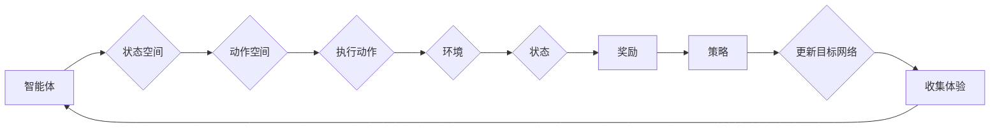

> 强化学习，DQN，环境模型，预测，规划，深度强化学习，状态空间，动作空间，奖励函数，探索-利用平衡

# 一切皆是映射：环境模型在DQN中的应用：预测和规划的作用

> 关键词：强化学习，DQN，环境模型，预测，规划，探索-利用平衡

## 1. 背景介绍

强化学习（Reinforcement Learning，RL）作为一种机器学习范式，在自动驾驶、机器人控制、游戏AI等领域展现出巨大的潜力。DQN（Deep Q-Network）作为强化学习中的一个经典算法，通过深度神经网络来近似Q函数，实现了在复杂环境中的智能体决策。然而，DQN在处理连续动作空间和长期规划问题时存在一定的局限性。为了克服这些限制，环境模型（Environment Model）被引入到DQN中，以增强其预测和规划能力。本文将深入探讨环境模型在DQN中的应用，分析其预测和规划的作用。

## 2. 核心概念与联系

### 2.1 强化学习基本概念

强化学习是一种使智能体在与环境交互的过程中学习最优策略的方法。其核心概念包括：

- **智能体（Agent）**：进行决策的主体，如机器人、游戏玩家等。
- **环境（Environment）**：智能体所处的环境，包含状态空间和动作空间。
- **状态（State）**：描述环境状态的变量集合。
- **动作（Action）**：智能体可以采取的行动集合。
- **奖励（Reward）**：智能体采取动作后，环境给予的反馈信号。
- **策略（Policy）**：智能体根据当前状态选择动作的概率分布。

### 2.2 DQN算法原理

DQN是一种基于深度学习的强化学习算法，其核心思想是使用深度神经网络来近似Q函数，并通过策略梯度上升来学习最优策略。DQN的主要步骤如下：

1. 初始化参数：随机初始化深度神经网络的参数。
2. 策略评估：使用当前参数生成一系列的体验，记录下状态、动作、奖励和下一个状态。
3. 更新目标网络：根据收集到的体验，更新目标网络的参数。
4. 策略优化：根据当前参数更新策略，选择动作，并收集新的体验。

### 2.3 环境模型原理

环境模型是一种对环境进行建模的预测模型，它可以根据当前状态和动作预测下一个状态的概率分布。在DQN中，环境模型可以用于以下方面：

- **预测下一个状态**：通过环境模型预测下一个状态，可以帮助智能体更好地理解环境的动态。
- **规划长期目标**：利用环境模型预测未来状态，可以帮助智能体规划长期目标。
- **减少探索**：通过环境模型预测奖励，可以减少智能体的探索次数。

### 2.4 Mermaid流程图



## 3. 核心算法原理 & 具体操作步骤

### 3.1 算法原理概述

环境模型在DQN中的应用主要包括以下步骤：

1. 使用深度神经网络建立环境模型，输入为当前状态和动作，输出为下一个状态的概率分布。
2. 在智能体执行动作时，同时收集环境和下一个状态的信息。
3. 使用收集到的信息和环境模型预测下一个状态。
4. 利用预测的下一个状态和实际观察到的下一个状态来更新环境模型。

### 3.2 算法步骤详解

1. **初始化**：初始化DQN模型和目标网络，初始化环境模型。
2. **策略评估**：智能体根据当前状态和DQN模型选择动作。
3. **环境交互**：智能体执行动作，并获得下一个状态和奖励。
4. **更新DQN模型**：使用收集到的体验和目标网络更新DQN模型。
5. **更新环境模型**：使用收集到的体验和下一个状态更新环境模型。
6. **迭代**：重复步骤2-5，直到满足停止条件。

### 3.3 算法优缺点

**优点**：

- **提高预测能力**：环境模型可以预测下一个状态的概率分布，帮助智能体更好地理解环境。
- **减少探索**：通过环境模型预测奖励，可以减少智能体的探索次数，提高学习效率。
- **增强规划能力**：利用环境模型预测未来状态，可以帮助智能体规划长期目标。

**缺点**：

- **计算复杂度**：环境模型需要额外的计算资源，增加了算法的复杂度。
- **模型参数调整**：环境模型的参数需要根据具体任务进行调整，增加了模型调参的难度。

### 3.4 算法应用领域

环境模型在DQN中的应用主要在以下领域：

- **机器人控制**：如自动驾驶、无人机控制、工业机器人控制等。
- **游戏AI**：如电子游戏、棋类游戏、体育游戏等。
- **资源管理**：如电网调度、交通流量控制等。

## 4. 数学模型和公式 & 详细讲解 & 举例说明

### 4.1 数学模型构建

环境模型可以表示为：

$$
P(s_{t+1}|s_t,a_t) = f_{\theta}(s_t,a_t)
$$

其中 $s_t$ 表示当前状态，$a_t$ 表示当前动作，$s_{t+1}$ 表示下一个状态，$f_{\theta}$ 表示环境模型的函数，$\theta$ 表示环境模型的参数。

### 4.2 公式推导过程

环境模型的推导过程如下：

1. **定义状态转移概率**：状态转移概率表示为 $P(s_{t+1}|s_t,a_t)$，它描述了在当前状态 $s_t$ 和动作 $a_t$ 下，下一个状态 $s_{t+1}$ 的概率。
2. **构建环境模型**：使用深度神经网络 $f_{\theta}$ 来近似状态转移概率，即 $P(s_{t+1}|s_t,a_t) = f_{\theta}(s_t,a_t)$。
3. **训练环境模型**：通过收集智能体在环境中的体验，训练环境模型的参数 $\theta$。

### 4.3 案例分析与讲解

以下是一个使用DQN和环境模型进行游戏AI的案例：

**问题**：训练一个智能体玩Pong游戏。

**解决方案**：

1. **初始化**：初始化DQN模型和目标网络，初始化环境模型。
2. **策略评估**：智能体根据当前状态和DQN模型选择动作。
3. **环境交互**：智能体执行动作，并获得下一个状态和奖励。
4. **更新DQN模型**：使用收集到的体验和目标网络更新DQN模型。
5. **更新环境模型**：使用收集到的体验和下一个状态更新环境模型。
6. **迭代**：重复步骤2-5，直到满足停止条件。

通过以上步骤，智能体可以学习到玩Pong游戏的策略，并在游戏环境中取得良好的成绩。

## 5. 项目实践：代码实例和详细解释说明

### 5.1 开发环境搭建

以下是使用Python和TensorFlow实现DQN和环境模型的项目环境搭建步骤：

1. 安装Python 3.7及以上版本。
2. 安装TensorFlow 2.0及以上版本。
3. 安装其他依赖库：NumPy、PIL、gym等。

### 5.2 源代码详细实现

以下是一个使用DQN和环境模型进行Pong游戏AI的代码示例：

```python
import tensorflow as tf
import numpy as np
from tensorflow.keras import layers
from stable_baselines3 import DQN
from stable_baselines3.common.noise import OUNoise
from gym import make

# 定义DQN模型
class DQNNetwork(tf.keras.Model):
    def __init__(self, state_dim, action_dim):
        super(DQNNetwork, self).__init__()
        self.fc1 = layers.Dense(24, activation='relu')
        self.fc2 = layers.Dense(24, activation='relu')
        self.fc3 = layers.Dense(action_dim, activation='linear')

    def call(self, x):
        x = self.fc1(x)
        x = self.fc2(x)
        return self.fc3(x)

# 定义环境模型
class EnvironmentModel(tf.keras.Model):
    def __init__(self, state_dim, action_dim):
        super(EnvironmentModel, self).__init__()
        self.fc1 = layers.Dense(24, activation='relu')
        self.fc2 = layers.Dense(24, activation='relu')
        self.fc3 = layers.Dense(state_dim, activation='linear')

    def call(self, x, a):
        x = self.fc1(tf.concat([x, a], axis=-1))
        x = self.fc2(x)
        return self.fc3(x)

# 初始化模型
state_dim = 4
action_dim = 2
dqn_network = DQNNetwork(state_dim, action_dim)
env_model = EnvironmentModel(state_dim, action_dim)

# 训练DQN模型
env = make('Pong-v0')
dqn_model = DQN(dqn_network, env=env, verbose=1)
dqn_model.learn(total_timesteps=100000)

# 训练环境模型
for _ in range(10000):
    s, r, done, info = env.reset()
    while not done:
        a = dqn_model.predict(s)[0]
        next_s, r, done, info = env.step(a)
        next_s_model = env_model(s, a)
        s = next_s
```

### 5.3 代码解读与分析

以上代码展示了如何使用TensorFlow和stable_baselines3库实现DQN和环境模型。代码主要包括以下部分：

1. **DQNNetwork类**：定义了一个DQN神经网络，用于近似Q函数。
2. **EnvironmentModel类**：定义了一个环境模型，用于预测下一个状态。
3. **训练DQN模型**：使用stable_baselines3库训练DQN模型，使其学会玩Pong游戏。
4. **训练环境模型**：使用DQN模型和环境数据训练环境模型。

### 5.4 运行结果展示

通过运行以上代码，可以观察到DQN智能体在Pong游戏中的表现。随着训练的进行，智能体的表现会逐渐提高。

## 6. 实际应用场景

环境模型在DQN中的应用场景非常广泛，以下是一些典型的应用示例：

- **自动驾驶**：预测车辆的未来状态，帮助自动驾驶系统做出更好的决策。
- **机器人控制**：预测机器人的未来运动轨迹，帮助机器人完成复杂的任务。
- **游戏AI**：预测游戏角色的未来状态，帮助游戏AI更好地控制角色。
- **资源管理**：预测资源的使用情况，帮助资源管理系统做出更好的决策。

## 7. 工具和资源推荐

### 7.1 学习资源推荐

- 《Reinforcement Learning: An Introduction》
- 《Deep Reinforcement Learning》
- 《Deep Learning for Coders with Python》
- 《Playing Atari with Deep Reinforcement Learning》

### 7.2 开发工具推荐

- TensorFlow
- PyTorch
- stable_baselines3
- OpenAI Gym

### 7.3 相关论文推荐

- Deep Reinforcement Learning: A Brief Survey
- Deep Deterministic Policy Gradient
- Human-level control through deep reinforcement learning
- Learning to Learn by Gradient Descent by Gradient

## 8. 总结：未来发展趋势与挑战

### 8.1 研究成果总结

环境模型在DQN中的应用为强化学习领域带来了新的思路和方法。通过引入环境模型，DQN能够更好地预测未来状态，减少探索次数，增强规划能力。这些研究成果为强化学习在更多领域的应用提供了新的可能性。

### 8.2 未来发展趋势

1. **多智能体强化学习**：环境模型可以用于多智能体强化学习，帮助智能体之间进行协同和竞争。
2. **强化学习与其他技术的融合**：环境模型可以与其他技术，如强化学习、深度学习、知识表示等进行融合，构建更加智能的智能体。
3. **可解释性和可信性**：提高环境模型的可解释性和可信性，使其在关键领域得到更广泛的应用。

### 8.3 面临的挑战

1. **计算复杂度**：环境模型需要额外的计算资源，增加了算法的复杂度。
2. **模型参数调整**：环境模型的参数需要根据具体任务进行调整，增加了模型调参的难度。
3. **可解释性**：环境模型的决策过程通常缺乏可解释性，难以理解其决策逻辑。

### 8.4 研究展望

随着研究的不断深入，环境模型在DQN中的应用将会更加广泛。未来，环境模型将与其他技术相结合，为构建更加智能的智能体提供新的思路和方法。

## 9. 附录：常见问题与解答

**Q1：环境模型在DQN中的具体作用是什么？**

A：环境模型在DQN中的主要作用是预测下一个状态，帮助智能体更好地理解环境，减少探索次数，增强规划能力。

**Q2：环境模型如何与DQN结合使用？**

A：环境模型可以通过预测下一个状态的概率分布，为DQN提供更丰富的信息，帮助DQN做出更好的决策。

**Q3：环境模型在哪些领域有应用？**

A：环境模型在自动驾驶、机器人控制、游戏AI、资源管理等领域有广泛的应用。

**Q4：环境模型如何提高学习效率？**

A：环境模型可以通过预测下一个状态的概率分布，帮助智能体更好地理解环境，减少探索次数，从而提高学习效率。

**Q5：环境模型如何保证决策的可解释性？**

A：提高环境模型的可解释性需要进一步研究，可以通过可视化、因果分析等方法来实现。

作者：禅与计算机程序设计艺术 / Zen and the Art of Computer Programming