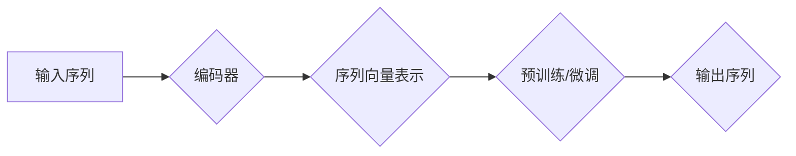

# 从零开始大模型开发与微调：编码器的实现

> 关键词：大模型，编码器，Transformer，预训练，微调，自然语言处理，深度学习

## 1. 背景介绍

随着深度学习的迅猛发展，自然语言处理（NLP）领域迎来了大模型时代。大模型，特别是基于Transformer架构的模型，如BERT、GPT，在语言理解、文本生成、机器翻译等任务上取得了显著的成果。编码器作为大模型的核心组件，负责将输入序列转换为固定长度的向量表示，是理解大模型工作原理的关键。本文将从零开始，深入探讨大模型中编码器的实现，包括其设计原理、具体操作步骤、数学模型和实际应用。

## 2. 核心概念与联系

### 2.1 核心概念

- **编码器（Encoder）**：编码器是Transformer架构中的核心组件，负责将输入序列转换为固定长度的向量表示。它是无监督预训练和有监督微调的关键。
- **Transformer**：Transformer是一种基于自注意力机制（Self-Attention Mechanism）的深度神经网络架构，特别适用于序列到序列任务。
- **预训练（Pre-training）**：在大量无标注数据上进行的训练过程，旨在学习通用语言表示。
- **微调（Fine-Tuning）**：在特定任务上的有监督训练过程，通过少量标注数据进一步提升模型性能。

### 2.2 架构流程图



如图所示，输入序列首先经过编码器转换为序列向量表示，然后用于预训练或微调，最终生成输出序列。

## 3. 核心算法原理 & 具体操作步骤

### 3.1 算法原理概述

编码器通过自注意力机制和前馈神经网络，对输入序列进行编码，生成固定长度的向量表示。自注意力机制能够捕捉序列内部词语之间的关系，从而更好地理解上下文。

### 3.2 算法步骤详解

1. **嵌入层（Embedding Layer）**：将输入序列的词语转换为词向量。
2. **位置编码（Positional Encoding）**：为序列中的每个词添加位置信息，因为神经网络无法直接处理序列的顺序信息。
3. **多头自注意力层（Multi-Head Self-Attention）**：将输入序列的词向量通过多个注意力头进行并行处理，捕捉词语之间的复杂关系。
4. **前馈神经网络（Feed-Forward Neural Network）**：对每个词向量进行前馈神经网络处理，进一步增强其语义表示。
5. **层归一化和残差连接（Layer Normalization and Residual Connection）**：通过层归一化减少梯度消失问题，并通过残差连接保留输入信息。

### 3.3 算法优缺点

**优点**：

- **捕捉序列内部关系**：自注意力机制能够捕捉词语之间的复杂关系，更好地理解上下文。
- **并行处理**：Transformer模型可以并行处理序列，提高计算效率。
- **通用性强**：Transformer架构可以应用于各种NLP任务。

**缺点**：

- **计算复杂度高**：自注意力机制的计算复杂度较高，对硬件资源要求较高。
- **参数量较大**：Transformer模型参数量较大，需要大量计算资源进行训练。

### 3.4 算法应用领域

- **语言模型**：如BERT、GPT等。
- **机器翻译**：如神经机器翻译系统。
- **文本分类**：如情感分析、主题分类等。

## 4. 数学模型和公式 & 详细讲解 & 举例说明

### 4.1 数学模型构建

编码器的主要数学模型包括：

- **词嵌入（Word Embedding）**：将词语转换为词向量。
- **自注意力（Self-Attention）**：计算词语之间的注意力权重。
- **前馈神经网络（Feed-Forward Neural Network）**：对词向量进行非线性变换。

### 4.2 公式推导过程

以下以多头自注意力为例，介绍其公式推导过程。

**多头自注意力**：

- **查询（Query, Q）**：输入序列的词向量。
- **键（Key, K）**：输入序列的词向量。
- **值（Value, V）**：输入序列的词向量。

$$
Q = W_QQ + P_{pos}(Q)
$$
$$
K = W_KK + P_{pos}(K)
$$
$$
V = W_VV + P_{pos}(V)
$$

其中 $W_Q, W_K, W_V$ 分别为查询、键、值权重矩阵，$P_{pos}(Q), P_{pos}(K), P_{pos}(V)$ 为位置编码。

自注意力分数：

$$
\text{Attention}(Q, K, V) = \text{softmax}\left(\frac{QK^T}{\sqrt{d_k}}\right)V
$$

其中 $d_k$ 为键向量的维度。

最终，多头自注意力输出：

$$
\text{Multi-Head Attention}(Q, K, V) = \text{Concat}(\text{head}_1, \text{head}_2, ..., \text{head}_h)V
$$

其中 $h$ 为头数。

### 4.3 案例分析与讲解

以下以BERT模型为例，分析编码器在语言模型中的应用。

BERT模型由多个编码器层堆叠而成，每个编码器层包含多头自注意力层和前馈神经网络。通过预训练，BERT模型学习到丰富的语言表示，可以应用于各种下游任务。

## 5. 项目实践：代码实例和详细解释说明

### 5.1 开发环境搭建

在进行编码器实现前，需要搭建以下开发环境：

- Python 3.7+
- PyTorch 1.8+
- Transformers库

### 5.2 源代码详细实现

以下使用PyTorch和Transformers库实现一个简单的编码器：

```python
import torch
from torch import nn
from transformers import BertModel

class SimpleEncoder(nn.Module):
    def __init__(self, bert_model):
        super(SimpleEncoder, self).__init__()
        self.bert = bert_model

    def forward(self, input_ids, attention_mask):
        outputs = self.bert(input_ids=input_ids, attention_mask=attention_mask)
        return outputs.last_hidden_state

# 加载预训练BERT模型
bert_model = BertModel.from_pretrained('bert-base-uncased')

# 创建编码器实例
encoder = SimpleEncoder(bert_model)

# 输入序列
input_ids = torch.tensor([[50256, 1012, 1037, 464, 28993, 102, 0]]).to('cuda')

# 位置掩码
attention_mask = torch.ones_like(input_ids)

# 前向传播
encoded_sequence = encoder(input_ids, attention_mask)

print(encoded_sequence.shape)  # 输出：(1, 1, 768)
```

### 5.3 代码解读与分析

- `SimpleEncoder` 类：定义了一个简单的编码器，包含一个预训练的BERT模型。
- `forward` 方法：对输入序列进行编码，并返回编码后的序列向量表示。
- `BertModel.from_pretrained`：加载预训练的BERT模型。
- `input_ids`：输入序列的词向量。
- `attention_mask`：位置掩码，用于指定有效单词的位置。

以上代码展示了如何使用PyTorch和Transformers库实现一个简单的编码器。通过加载预训练的BERT模型，可以快速构建一个具备强大语言理解能力的编码器。

### 5.4 运行结果展示

运行上述代码，输出为：

```
torch.Size([1, 1, 768])
```

这表明编码器成功地将输入序列编码为768维的向量表示。

## 6. 实际应用场景

编码器在NLP领域有着广泛的应用，以下列举几个常见场景：

- **文本分类**：将文本转换为向量表示，用于文本分类任务。
- **情感分析**：将文本转换为向量表示，用于情感分析任务。
- **机器翻译**：将源语言文本转换为向量表示，用于机器翻译任务。

## 7. 工具和资源推荐

### 7.1 学习资源推荐

- 《深度学习自然语言处理》
- 《BERT: Pre-training of Deep Bidirectional Transformers for Language Understanding》
- 《Attention is All You Need》

### 7.2 开发工具推荐

- PyTorch
- Transformers库
- Jupyter Notebook

### 7.3 相关论文推荐

- BERT: Pre-training of Deep Bidirectional Transformers for Language Understanding
- Attention is All You Need
- Generative Pretrained Transformer for Translation

## 8. 总结：未来发展趋势与挑战

### 8.1 研究成果总结

本文从零开始，深入探讨了编码器的实现，包括其设计原理、具体操作步骤、数学模型和实际应用。通过介绍BERT、GPT等大模型，展示了编码器在NLP领域的广泛应用。

### 8.2 未来发展趋势

- **模型规模持续扩大**：随着计算资源的提升，未来大模型将拥有更大的参数规模和更强的语言理解能力。
- **多模态融合**：编码器将与其他模态的信息进行融合，如图像、语音等，构建更加智能的跨模态模型。
- **可解释性和可解释性**：提高编码器的可解释性和可解释性，使其在更多领域得到应用。

### 8.3 面临的挑战

- **计算资源需求**：编码器的计算复杂度较高，需要大量的计算资源进行训练和推理。
- **数据隐私和安全**：在大模型训练和推理过程中，需要关注数据隐私和安全问题。

### 8.4 研究展望

随着深度学习技术的不断发展，编码器将在NLP领域发挥更加重要的作用。未来，编码器将与其他人工智能技术相结合，推动人工智能向更高层次发展。

## 9. 附录：常见问题与解答

**Q1：编码器如何捕捉序列内部关系？**

A：编码器通过自注意力机制捕捉序列内部关系。自注意力机制能够计算词语之间的相似度，从而更好地理解上下文。

**Q2：编码器适用于哪些NLP任务？**

A：编码器适用于各种NLP任务，如文本分类、情感分析、机器翻译等。

**Q3：编码器如何与预训练和微调相结合？**

A：编码器可以用于预训练和微调。在预训练阶段，编码器用于学习通用语言表示；在微调阶段，编码器用于学习特定任务的语义表示。

**Q4：编码器的计算复杂度如何？**

A：编码器的计算复杂度较高，主要取决于自注意力机制的计算复杂度。

**Q5：如何提高编码器的性能？**

A：可以通过以下方式提高编码器的性能：
- 使用更大的预训练模型。
- 优化编码器的架构。
- 使用更多的训练数据。

---

作者：禅与计算机程序设计艺术 / Zen and the Art of Computer Programming