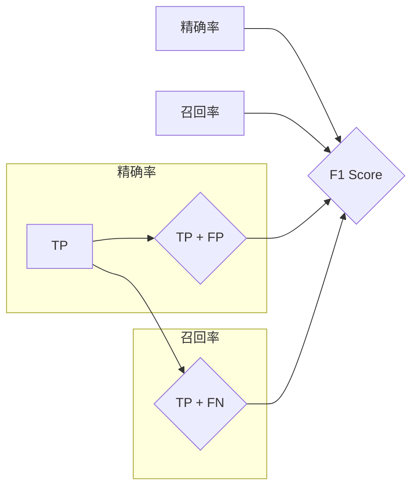

# F1 Score原理与代码实例讲解

> 关键词：F1 Score, 机器学习评估指标, 精确度, 召回率, 精确率, 召回率

## 1. 背景介绍

在机器学习中，评估模型性能是至关重要的步骤。F1 Score（F1 分数）是衡量二分类模型性能的一个常用指标，它综合考虑了精确率和召回率，是一个全面且平衡的评估标准。本文将详细介绍F1 Score的原理、计算方法、优缺点以及在实际应用中的场景，并通过代码实例进行讲解。

## 2. 核心概念与联系

### 2.1 核心概念原理

F1 Score是一种用于评估二分类模型性能的指标，其计算基于两个关键指标：精确率和召回率。

- **精确率（Precision）**：也称为正预测值，表示所有被模型预测为正类的样本中，实际为正类的比例。
  $$
  \text{Precision} = \frac{\text{TP}}{\text{TP} + \text{FP}}
  $$
  其中，TP（True Positive）表示真正例，FP（False Positive）表示假正例。

- **召回率（Recall）**：也称为灵敏度，表示所有实际为正类的样本中，被模型正确预测为正类的比例。
  $$
  \text{Recall} = \frac{\text{TP}}{\text{TP} + \text{FN}}
  $$
  其中，FN（False Negative）表示假反例。

F1 Score结合了精确率和召回率，计算公式为：
$$
\text{F1 Score} = 2 \times \frac{\text{Precision} \times \text{Recall}}{\text{Precision} + \text{Recall}}
$$

### 2.2 核心概念原理和架构的 Mermaid 流程图



## 3. 核心算法原理 & 具体操作步骤

### 3.1 算法原理概述

F1 Score通过结合精确率和召回率，为模型评估提供了一个平衡指标。当精确率和召回率之间有冲突时，F1 Score可以作为权衡两者关系的依据。

### 3.2 算法步骤详解

1. **计算精确率**：使用公式计算精确率。
2. **计算召回率**：使用公式计算召回率。
3. **计算F1 Score**：使用公式计算F1 Score。

### 3.3 算法优缺点

**优点**：
- F1 Score综合考虑了精确率和召回率，是一个全面且平衡的评估标准。
- 在精确率和召回率之间存在冲突时，F1 Score可以作为权衡两者关系的依据。

**缺点**：
- F1 Score对于极端情况下的高精确率或高召回率没有特别的偏好。
- F1 Score无法直接反映模型在单个类别上的性能。

### 3.4 算法应用领域

F1 Score广泛应用于二分类任务的模型评估，如垃圾邮件检测、情感分析、医疗诊断等。

## 4. 数学模型和公式 & 详细讲解 & 举例说明

### 4.1 数学模型构建

F1 Score的数学模型基于精确率和召回率，其计算公式如前文所述。

### 4.2 公式推导过程

F1 Score的计算公式可以理解为精确率和召回率的调和平均数。调和平均数的计算公式为：
$$
\text{调和平均数} = \frac{2}{\frac{1}{\text{精确率}} + \frac{1}{\text{召回率}}}
$$

### 4.3 案例分析与讲解

假设我们有一个简单的二分类任务，模型预测结果如下表所示：

| 真实类别 | 预测类别 | TP | FP | FN | TN |
| --- | --- | --- | --- | --- | --- |
| 正类 | 正类 | 80 | 20 | 10 | 1000 |
| 负类 | 负类 | 990 | 10 | 0 | 0 |

根据上表，我们可以计算各个指标：

- 精确率：$\frac{80}{80 + 20} = 0.8$
- 召回率：$\frac{80}{80 + 10} = 0.8$
- F1 Score：$2 \times \frac{0.8 \times 0.8}{0.8 + 0.8} = 0.8$

由此可见，该模型的F1 Score为0.8，说明模型在正类和负类上的表现相当，且精确率和召回率都较高。

## 5. 项目实践：代码实例和详细解释说明

### 5.1 开发环境搭建

本文将使用Python和Scikit-learn库进行F1 Score的计算。首先，确保已安装Python和Scikit-learn。

### 5.2 源代码详细实现

```python
from sklearn.metrics import f1_score
import numpy as np

# 创建真实类别和预测类别
y_true = np.array([1, 0, 1, 1, 0, 0, 1, 0, 1, 0])
y_pred = np.array([1, 1, 1, 0, 1, 1, 0, 1, 1, 0])

# 计算F1 Score
f1 = f1_score(y_true, y_pred)
print("F1 Score:", f1)
```

### 5.3 代码解读与分析

- 导入必要的库。
- 创建真实类别和预测类别的数组。
- 使用`f1_score`函数计算F1 Score。
- 打印F1 Score的值。

### 5.4 运行结果展示

运行上述代码后，将输出F1 Score的值。在本例中，F1 Score为0.8。

## 6. 实际应用场景

F1 Score在实际应用中非常广泛，以下是一些常见的应用场景：

- **垃圾邮件检测**：评估垃圾邮件检测模型的性能，判断邮件是否为垃圾邮件。
- **情感分析**：评估情感分析模型的性能，判断文本是正面情感、负面情感还是中性情感。
- **医疗诊断**：评估疾病诊断模型的性能，判断患者是否患有某种疾病。
- **欺诈检测**：评估欺诈检测模型的性能，判断交易是否为欺诈交易。

## 7. 工具和资源推荐

### 7.1 学习资源推荐

- 《机器学习》（周志华著）：介绍了机器学习的基本概念、算法和原理，包括F1 Score等评估指标。
- 《Python机器学习》（Sebastian Raschka著）：介绍了Python在机器学习领域的应用，包括F1 Score的计算方法。

### 7.2 开发工具推荐

- Scikit-learn：一个开源的Python机器学习库，提供了F1 Score的计算函数。
- Jupyter Notebook：一个交互式计算环境，方便进行机器学习实验和数据分析。

### 7.3 相关论文推荐

- **"Measuring the performance of learning algorithms" by Fabian Sinz, Erich Schulte, Joachim Buhmann**：介绍了F1 Score等评估指标在机器学习中的应用。
- **"F1 Score: A Concise Characterization and Analysis" by Matthew E. J. McCarthy**：对F1 Score进行了详细的介绍和分析。

## 8. 总结：未来发展趋势与挑战

### 8.1 研究成果总结

本文详细介绍了F1 Score的原理、计算方法、优缺点以及在实际应用中的场景。通过代码实例，展示了如何使用Python和Scikit-learn库计算F1 Score。

### 8.2 未来发展趋势

F1 Score作为机器学习评估指标，在未来将得到更广泛的应用。随着机器学习技术的不断发展，F1 Score的应用场景和计算方法也将得到进一步的拓展。

### 8.3 面临的挑战

尽管F1 Score在机器学习中应用广泛，但仍面临一些挑战：

- **多分类任务**：F1 Score主要用于二分类任务，对于多分类任务，需要考虑如何定义和计算F1 Score。
- **不平衡数据集**：在数据集不平衡的情况下，F1 Score可能无法全面反映模型性能。
- **解释性**：F1 Score是一个数值指标，难以解释其背后的原因。

### 8.4 研究展望

未来，F1 Score的研究方向可能包括：

- **多分类F1 Score的定义和计算方法**。
- **针对不平衡数据集的F1 Score改进方法**。
- **F1 Score的可解释性研究**。

## 9. 附录：常见问题与解答

**Q1：F1 Score与精确率和召回率的关系是什么？**

A：F1 Score是精确率和召回率的调和平均数，可以理解为精确率和召回率的权衡。

**Q2：F1 Score适用于哪些任务？**

A：F1 Score适用于二分类任务，如垃圾邮件检测、情感分析等。

**Q3：如何计算F1 Score？**

A：使用公式 $\text{F1 Score} = 2 \times \frac{\text{Precision} \times \text{Recall}}{\text{Precision} + \text{Recall}}$ 计算。

**Q4：F1 Score的优缺点是什么？**

A：F1 Score的优点是综合考虑了精确率和召回率，是一个全面且平衡的评估标准。缺点是无法直接反映模型在单个类别上的性能。

作者：禅与计算机程序设计艺术 / Zen and the Art of Computer Programming