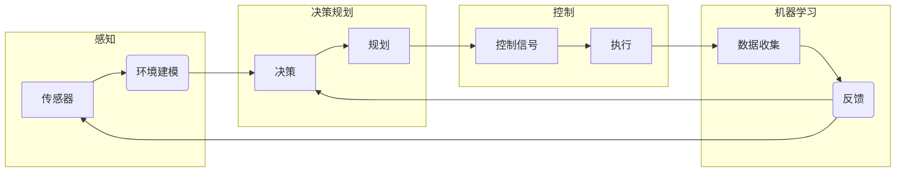

# IROS 2024中的自动驾驶相关论文精选解读

> 关键词：自动驾驶，IROS，论文解读，传感器融合，决策规划，感知，控制，机器学习，深度学习

## 1. 背景介绍

随着人工智能和机器人技术的飞速发展，自动驾驶技术已成为全球科技竞争的热点。IROS（IEEE International Conference on Intelligent Robots and Systems）作为机器人与自动化领域的顶级会议，每年都会吸引大量研究人员和工程师提交自动驾驶相关的研究成果。本文将针对IROS 2024中精选的自动驾驶相关论文进行解读，涵盖感知、决策规划、控制和机器学习等关键领域，旨在为读者提供一个关于自动驾驶技术最新进展的全面视角。

## 2. 核心概念与联系

### 2.1 核心概念

自动驾驶系统通常包括以下几个核心组件：

- **感知**：通过摄像头、雷达、激光雷达等传感器获取环境信息，构建周围环境的三维模型。
- **决策规划**：根据感知到的环境信息，制定行驶策略，包括路径规划、车辆控制等。
- **控制**：根据决策规划的结果，控制车辆的运动，如转向、加速、制动等。
- **机器学习/深度学习**：利用机器学习算法，尤其是深度学习，从大量数据中学习感知、决策和控制策略。

### 2.2 架构Mermaid流程图



## 3. 核心算法原理 & 具体操作步骤

### 3.1 算法原理概述

自动驾驶的核心算法主要包括：

- **感知算法**：如深度学习目标检测、点云处理、图像识别等。
- **决策规划算法**：如基于规则、基于学习、基于优化的路径规划、轨迹规划等。
- **控制算法**：如PID控制、模型预测控制、自适应控制等。

### 3.2 算法步骤详解

#### 感知算法

感知算法通常包括以下几个步骤：

1. 数据采集：通过摄像头、雷达、激光雷达等传感器获取环境数据。
2. 数据预处理：对采集到的数据进行滤波、去噪、标定等处理。
3. 特征提取：从预处理后的数据中提取关键特征，如目标检测、点云分割、图像识别等。
4. 目标跟踪：对检测到的目标进行跟踪，维护目标状态。

#### 决策规划算法

决策规划算法通常包括以下几个步骤：

1. 情景理解：根据感知到的环境信息，分析当前行驶场景。
2. 目标设定：根据场景和驾驶目标，设定行驶策略。
3. 路径规划：规划车辆的行驶路径。
4. 轨迹规划：规划车辆的行驶轨迹。

#### 控制算法

控制算法通常包括以下几个步骤：

1. 控制信号生成：根据决策规划的结果，生成转向、加速、制动等控制信号。
2. 执行：将控制信号传递给车辆执行机构。

### 3.3 算法优缺点

- **感知算法**：深度学习感知算法在准确性方面具有优势，但计算成本较高，且对传感器质量要求较高。
- **决策规划算法**：基于规则的算法简单易实现，但灵活性较差；基于学习的算法灵活性强，但需要大量标注数据；基于优化的算法精度高，但计算复杂度高。
- **控制算法**：PID控制简单易用，但对系统模型要求较高；模型预测控制精度高，但需要精确的系统模型；自适应控制适应性强，但实现难度较大。

### 3.4 算法应用领域

自动驾驶算法广泛应用于以下领域：

- **乘用车**：如特斯拉、蔚来等公司生产的自动驾驶汽车。
- **商用车**：如自动驾驶卡车、自动驾驶公交车等。
- **特殊车辆**：如自动驾驶拖拉机、自动驾驶挖掘机等。

## 4. 数学模型和公式 & 详细讲解 & 举例说明

### 4.1 数学模型构建

自动驾驶系统的数学模型主要包括：

- **传感器数据模型**：描述传感器数据与真实环境之间的关系。
- **动态模型**：描述车辆动力学和运动学特性。
- **控制模型**：描述控制信号与车辆运动状态之间的关系。

### 4.2 公式推导过程

以下是一个简单的传感器数据模型公式示例：

$$
z = h(x) + v + w
$$

其中，$z$ 为传感器观测到的数据，$x$ 为真实环境数据，$h(x)$ 为传感器数据模型，$v$ 为观测噪声，$w$ 为系统噪声。

### 4.3 案例分析与讲解

以自动驾驶中的路径规划为例，我们可以使用RRT算法进行路径规划。

1. 初始化RRT树，包括起点和终点。
2. 在随机生成的点中选择一个点，判断该点是否在可行区域内。
3. 如果可行，将选择点与最近树中点的中点作为新点，将其加入到RRT树中。
4. 重复步骤2和3，直到满足终止条件（如到达终点、达到最大迭代次数等）。
5. 输出RRT树中连接起点和终点的路径。

## 5. 项目实践：代码实例和详细解释说明

### 5.1 开发环境搭建

为了演示自动驾驶算法的实践，我们需要搭建以下开发环境：

- 操作系统：Linux
- 编程语言：Python
- 机器学习框架：PyTorch、TensorFlow
- 传感器数据处理库：PCL、OpenCV

### 5.2 源代码详细实现

以下是一个简单的自动驾驶路径规划算法实现示例：

```python
import numpy as np
import matplotlib.pyplot as plt

# 定义RRT算法
class RRT:
    def __init__(self, start, goal, max_iter=100):
        self.start = start
        self.goal = goal
        self.max_iter = max_iter
        self.tree = [start]
    
    def generate_random_point(self):
        # 生成随机点
        pass
    
    def is_valid(self, point):
        # 判断点是否在可行区域内
        pass
    
    def nearest_point(self, point):
        # 计算最近点
        pass
    
    def extend_tree(self):
        # 扩展RRT树
        pass
    
    def plan_path(self):
        # 计算路径
        for _ in range(self.max_iter):
            self.extend_tree()
            if self.is_valid(self.goal):
                break
        return self.tree

# 创建RRT实例
rrt = RRT(start=np.array([0, 0]), goal=np.array([10, 10]))

# 计算路径
path = rrt.plan_path()

# 绘制路径
plt.plot(*zip(*path), label='RRT Path')
plt.plot(*zip(*[self.start, self.goal]), label='Start-Goal')
plt.legend()
plt.show()
```

### 5.3 代码解读与分析

以上代码展示了如何使用RRT算法进行路径规划。首先，我们定义了RRT类，其中包含了生成随机点、判断点是否有效、计算最近点、扩展RRT树和计算路径等方法。在主函数中，我们创建了一个RRT实例，并计算了从起点到终点的路径。最后，我们使用matplotlib绘制了路径。

### 5.4 运行结果展示

运行上述代码后，我们将看到一条从起点到终点的RRT路径。

## 6. 实际应用场景

自动驾驶技术已广泛应用于以下实际应用场景：

- **公共交通**：自动驾驶公交车、出租车等。
- **物流运输**：自动驾驶卡车、无人机等。
- **农业**：自动驾驶拖拉机、收割机等。
- **特殊领域**：如地下管道巡检、消防等。

## 7. 工具和资源推荐

### 7.1 学习资源推荐

- 《机器人学导论》
- 《自动驾驶系统》
- 《深度学习》
- 《机器学习》

### 7.2 开发工具推荐

- PyTorch、TensorFlow
- OpenCV、PCL
- ROS（Robot Operating System）

### 7.3 相关论文推荐

- 《A Tutorial on Probabilistic Road Maps》
- 《Path Planning》
- 《Deep Reinforcement Learning for Autonomous Navigation》
- 《Learning to Drive》

## 8. 总结：未来发展趋势与挑战

### 8.1 研究成果总结

IROS 2024中的自动驾驶相关论文展示了自动驾驶技术在感知、决策规划、控制和机器学习等方面的最新进展。这些研究成果为自动驾驶技术的进一步发展奠定了坚实的基础。

### 8.2 未来发展趋势

- **感知**：更加高精度、低成本的传感器融合技术。
- **决策规划**：更加智能、安全的决策规划算法。
- **控制**：更加灵活、鲁棒的控制系统。
- **机器学习/深度学习**：更加高效、可解释的算法。

### 8.3 面临的挑战

- **数据收集**：收集大规模、高质量的自动驾驶数据。
- **安全性和可靠性**：确保自动驾驶系统的安全性和可靠性。
- **伦理和法规**：制定相应的伦理和法规标准。

### 8.4 研究展望

未来，自动驾驶技术将继续朝着更加智能化、高效化、安全化的方向发展。随着技术的不断进步，自动驾驶将逐渐走进人们的日常生活，为人类带来更加便捷、舒适的出行体验。

## 9. 附录：常见问题与解答

**Q1：自动驾驶技术的安全性如何保证？**

A：自动驾驶技术的安全性需要从多个方面进行考虑，包括传感器数据质量、算法设计、系统可靠性、测试验证等。通过严格的测试验证流程，可以确保自动驾驶系统的安全性和可靠性。

**Q2：自动驾驶技术有哪些应用场景？**

A：自动驾驶技术可以应用于公共交通、物流运输、农业、特殊领域等多个场景。

**Q3：如何保证自动驾驶系统的实时性？**

A：为了保证自动驾驶系统的实时性，需要采用高效的算法和硬件设备。此外，通过优化算法和系统架构，也可以降低计算复杂度，提高系统性能。

**Q4：自动驾驶技术有哪些伦理和法规挑战？**

A：自动驾驶技术涉及到伦理和法规方面的挑战，包括责任归属、隐私保护、数据安全等。需要制定相应的伦理和法规标准，以规范自动驾驶技术的发展和应用。

作者：禅与计算机程序设计艺术 / Zen and the Art of Computer Programming