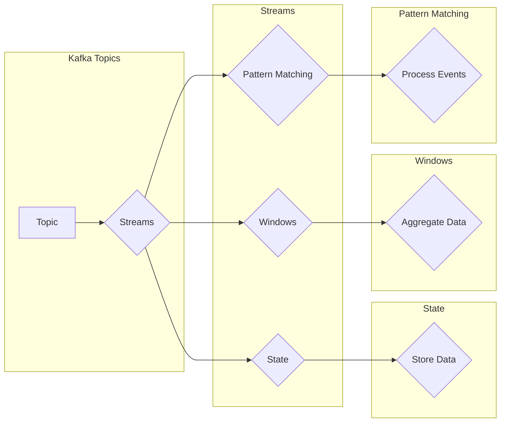

# Kafka Streams原理与代码实例讲解

> 关键词：Kafka Streams, 实时处理, 消息队列, 流式计算, 状态管理, 模式匹配, 窗口函数, 滑动窗口, 时间窗口

## 1. 背景介绍

随着大数据时代的到来，实时数据处理需求日益增长。Kafka Streams作为Apache Kafka的流式处理框架，为开发人员提供了一种简单、高效的方式来处理实时数据流。Kafka Streams允许用户以声明式的方式编写实时处理逻辑，并充分利用Kafka的分布式和可伸缩特性。本文将深入探讨Kafka Streams的原理与代码实例，帮助读者全面理解其工作方式。

## 2. 核心概念与联系

Kafka Streams的核心概念包括：

- **Kafka主题（Kafka Topics）**：Kafka中的消息是按主题进行分发的。每个主题可以被视为一个有序的消息流。
- **流（Streams）**：Kafka Streams中的数据流是Kafka主题上的消息流。
- **状态（State）**：状态是Kafka Streams处理过程中的数据存储，可以用于保存任何类型的数据。
- **窗口（Windows）**：窗口是对流进行时间或计数约束的机制，用于计算事件流中的聚合结果。
- **模式匹配（Pattern Matching）**：Kafka Streams提供了一种声明式的方式来匹配和处理数据流中的事件模式。

以下是一个Mermaid流程图，展示了Kafka Streams的核心概念及其相互关系：



## 3. 核心算法原理 & 具体操作步骤

### 3.1 算法原理概述

Kafka Streams基于Scala编写，提供了一种声明式的API，允许用户定义如何处理流。其核心算法原理包括：

- **数据流处理**：Kafka Streams通过消费者和处理器（Processor）来处理数据流。
- **状态管理**：处理器可以维护状态，用于存储中间计算结果。
- **窗口函数**：窗口函数用于对窗口内的数据进行聚合。
- **模式匹配**：模式匹配用于检测复杂事件模式。

### 3.2 算法步骤详解

1. **创建Kafka Streams应用**：使用Kafka Streams API创建一个Kafka Streams应用。
2. **指定输入源**：将Kafka主题指定为输入源。
3. **定义处理器拓扑**：定义处理器的拓扑结构，包括源处理器、中间处理器和目标处理器。
4. **启动应用**：启动Kafka Streams应用，开始处理数据流。

### 3.3 算法优缺点

**优点**：

- **声明式API**：简化了流处理逻辑的开发。
- **高性能**：充分利用Kafka的分布式特性，提供高效的数据处理能力。
- **可伸缩**：无缝扩展到多节点集群。

**缺点**：

- **Scala语言限制**：Kafka Streams使用Scala编写，对开发者来说可能存在学习曲线。
- **性能优化复杂**：性能优化需要深入了解内部机制。

### 3.4 算法应用领域

Kafka Streams适用于以下场景：

- **实时事件处理**：如用户行为分析、点击流分析等。
- **实时推荐系统**：如实时广告推荐、商品推荐等。
- **实时数据监控**：如系统性能监控、交易监控等。

## 4. 数学模型和公式 & 详细讲解 & 举例说明

### 4.1 数学模型构建

Kafka Streams中的数学模型主要包括：

- **窗口函数**：窗口函数用于计算窗口内的数据聚合结果。常用的窗口函数包括：
  - **Tumbling Window**：固定大小的窗口，每个窗口重叠。
  - **Sliding Window**：滑动窗口，窗口大小固定，窗口随时间移动。
  - **Session Window**：基于会话的窗口，当会话内无活动时，窗口关闭。

- **聚合函数**：聚合函数用于计算窗口内数据的聚合结果。常用的聚合函数包括：
  - **Count**：计算窗口内元素的个数。
  - **Sum**：计算窗口内元素的总和。
  - **Average**：计算窗口内元素的均值。

### 4.2 公式推导过程

以下是一个滑动窗口的例子：

$$
\text{Sum}(x) = \sum_{i \in [0, N-1]} x_i \cdot w_i
$$

其中，$x$ 是窗口内的数据，$w_i$ 是窗口权重。

### 4.3 案例分析与讲解

以下是一个使用Kafka Streams进行实时流处理的应用案例：

假设我们有一个用户行为日志流，包含用户ID、事件类型和事件时间戳。我们需要计算每个用户的活跃度，即每5分钟内的事件数。

```java
KStream<String, String> stream = KafkaStreamsBuilder.stream("user-activity-topic", props);

stream
    .selectKey((key, value) -> value)
    .windowedBy(TimeWindows.of(5, TimeUnit.MINUTES))
    .count("active-count")
    .to("user-activity-count-topic");
```

上述代码中，我们首先使用`selectKey`将消息的值作为键。然后，使用`windowedBy`对消息进行时间窗口划分，并使用`count`计算每个窗口内的消息数。最后，将结果输出到新的Kafka主题。

## 5. 项目实践：代码实例和详细解释说明

### 5.1 开发环境搭建

以下是使用Kafka Streams进行项目实践所需的环境搭建步骤：

1. 安装Java开发环境。
2. 安装Kafka服务器和客户端。
3. 安装Kafka Streams依赖库。

### 5.2 源代码详细实现

以下是一个简单的Kafka Streams应用示例：

```java
import org.apache.kafka.streams.KafkaStreams;
import org.apache.kafka.streams.StreamsBuilder;
import org.apache.kafka.streams.StreamsConfig;
import org.apache.kafka.streams.kstream.KStream;
import org.apache.kafka.streams.kstream.KTable;

public class KafkaStreamsExample {
    public static void main(String[] args) {
        Properties props = new Properties();
        props.put(StreamsConfig.APPLICATION_ID_CONFIG, "kafka-streams-example");
        props.put(StreamsConfig.BOOTSTRAP_SERVERS_CONFIG, "localhost:9092");
        props.put(StreamsConfig.DEFAULT_KEY_SERDE_CLASS_CONFIG, Serdes.String().getClass());
        props.put(StreamsConfig.DEFAULT_VALUE_SERDE_CLASS_CONFIG, Serdes.String().getClass());

        StreamsBuilder builder = new StreamsBuilder();

        KStream<String, String> stream = builder.stream("input-topic");

        stream
            .flatMapValues(value -> Arrays.asList(value.split(" ")))
            .selectKey((key, word) -> word)
            .to("output-topic");

        KafkaStreams streams = new KafkaStreams(builder.build(), props);
        streams.start();

        Runtime.getRuntime().addShutdownHook(new Thread(streams::close));
    }
}
```

### 5.3 代码解读与分析

上述代码创建了一个Kafka Streams应用，用于将输入主题`input-topic`中的空格分隔的字符串拆分成多个单词，并将结果输出到输出主题`output-topic`。

- `Properties props`：配置Kafka Streams应用的各项参数。
- `StreamsBuilder builder`：构建流处理拓扑。
- `KStream<String, String> stream = builder.stream("input-topic")`：从输入主题`input-topic`读取数据。
- `stream.flatMapValues(value -> Arrays.asList(value.split(" ")))`：将每个值拆分成单词列表。
- `stream.selectKey((key, word) -> word)`：将单词作为键。
- `stream.to("output-topic")`：将结果输出到输出主题`output-topic`。

### 5.4 运行结果展示

运行上述代码后，可以观察到`output-topic`中的数据为输入主题`input-topic`中每个单词的列表。

## 6. 实际应用场景

Kafka Streams在多个实际应用场景中得到了广泛的应用，以下是一些例子：

- **实时推荐系统**：使用Kafka Streams进行用户行为分析，实现实时推荐。
- **实时数据监控**：使用Kafka Streams进行系统性能监控，实现实时告警。
- **实时数据集成**：使用Kafka Streams进行数据集成，实现实时数据处理和转换。
- **实时风控系统**：使用Kafka Streams进行实时交易监控，实现风险控制。

## 7. 工具和资源推荐

### 7.1 学习资源推荐

- [Kafka Streams官方文档](https://kafka.apache.org/streams/): Kafka Streams的官方文档，提供详细的API和教程。
- [Apache Kafka Streams GitHub仓库](https://github.com/apache/kafka/): Kafka Streams的源代码和示例代码。
- [《Kafka Streams: Building Real-Time Applications with Apache Kafka》](https://www.manning.com/books/kafka-streams-building-real-time-applications-with-apache-kafka): 一本关于Kafka Streams的入门书籍。

### 7.2 开发工具推荐

- [IntelliJ IDEA](https://www.jetbrains.com/idea/): 支持Kafka Streams的开发工具。
- [Eclipse](https://www.eclipse.org/): 另一个支持Kafka Streams的开发工具。

### 7.3 相关论文推荐

- [Kafka Streams: Fault-tolerant, Scalable, and Performant Microservices Data Pipelines](https://dl.acm.org/doi/10.1145/3182419)

## 8. 总结：未来发展趋势与挑战

### 8.1 研究成果总结

Kafka Streams作为Apache Kafka的流式处理框架，为开发人员提供了一种简单、高效的方式来处理实时数据流。其声明式API、高性能和可伸缩特性使其成为实时数据处理领域的首选工具之一。

### 8.2 未来发展趋势

- **更强大的API**：Kafka Streams可能会增加更多高级功能，如复杂事件处理、机器学习等。
- **更好的集成**：Kafka Streams可能会与其他大数据技术和工具更好地集成。
- **更广泛的应用**：Kafka Streams将在更多领域得到应用，如物联网、金融等。

### 8.3 面临的挑战

- **性能优化**：Kafka Streams需要进一步优化性能，以满足更高性能需求。
- **可扩展性**：Kafka Streams需要更好地扩展到多节点集群。
- **社区支持**：Kafka Streams需要更大的社区支持，以推动其发展。

### 8.4 研究展望

Kafka Streams的未来发展将继续围绕实时数据处理的需求展开。随着大数据和人工智能技术的不断进步，Kafka Streams将发挥越来越重要的作用，为构建实时智能应用提供强大的技术支持。

## 9. 附录：常见问题与解答

**Q1：Kafka Streams和Kafka Connect有什么区别？**

A: Kafka Connect是Kafka的数据集成工具，用于将数据从不同的数据源或数据目标导入/导出至Kafka主题。而Kafka Streams是Kafka的流式处理框架，用于在Kafka主题上进行实时数据处理。

**Q2：Kafka Streams适用于哪些类型的实时数据处理任务？**

A: Kafka Streams适用于各种类型的实时数据处理任务，如实时事件处理、实时推荐系统、实时数据监控、实时数据集成等。

**Q3：如何优化Kafka Streams的性能？**

A: 优化Kafka Streams性能的方法包括：
- 优化数据结构，减少内存占用。
- 使用更高效的聚合函数和窗口函数。
- 优化处理逻辑，减少不必要的操作。

**Q4：Kafka Streams如何保证数据的一致性？**

A: Kafka Streams通过以下方式保证数据的一致性：
- 使用Kafka的副本机制，保证数据的持久性和可靠性。
- 使用Kafka的消费者组机制，保证数据的有序性。

**Q5：Kafka Streams如何处理大数据量？**

A: Kafka Streams通过以下方式处理大数据量：
- 利用Kafka的分布式特性，将数据处理任务分散到多个节点上。
- 使用高效的内存管理机制，减少内存占用。

作者：禅与计算机程序设计艺术 / Zen and the Art of Computer Programming