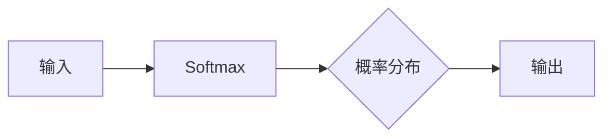

# Softmax瓶颈的难点

> 关键词：Softmax，分类问题，神经网络，梯度消失，梯度爆炸，过拟合，参数优化，应用场景

## 1. 背景介绍

Softmax函数在机器学习中扮演着至关重要的角色，尤其是在分类问题中，它被广泛应用于将神经网络的输出转换为概率分布。然而，随着深度神经网络（DNN）的深入，Softmax函数也暴露出了一些瓶颈，这些问题不仅影响了模型的性能，也成为了深度学习研究中的一大挑战。本文将深入探讨Softmax函数的难点，分析其背后的原因，并提出相应的解决方案。

## 2. 核心概念与联系

### 2.1 Softmax函数

Softmax函数是一种将实数值映射到概率分布的数学函数。它定义为：

$$
\sigma(z_i) = \frac{e^{z_i}}{\sum_{j=1}^{K}e^{z_j}}
$$

其中，$z_i$ 是神经网络第 $i$ 个节点的输出，$K$ 是类别的总数。Softmax函数确保了输出概率总和为 1，且每个输出的概率值介于 0 和 1 之间。

### 2.2 Mermaid 流程图



### 2.3 核心概念联系

Softmax函数与神经网络紧密相连，它将神经网络的输出转换为概率分布，用于分类任务的决策。然而，Softmax函数本身也存在一些问题，如梯度消失、梯度爆炸、过拟合等，这些问题限制了其在深度神经网络中的应用。

## 3. 核心算法原理 & 具体操作步骤

### 3.1 算法原理概述

Softmax函数的原理相对简单，但其在深度神经网络中的应用却引发了诸多问题。以下是Softmax函数在神经网络中的基本原理：

1. 神经网络的输出经过Softmax函数处理后，得到每个类别的概率分布。
2. 损失函数（如交叉熵损失）根据预测概率分布和真实标签计算损失值。
3. 利用反向传播算法，根据损失值计算梯度，并更新神经网络参数。

### 3.2 算法步骤详解

1. **前向传播**：将神经网络的输出送入Softmax函数，得到每个类别的概率分布。
2. **损失计算**：使用交叉熵损失函数计算预测概率分布与真实标签之间的差异。
3. **反向传播**：计算损失函数对神经网络参数的梯度，并更新参数以最小化损失。
4. **迭代优化**：重复步骤1-3，直至满足收敛条件。

### 3.3 算法优缺点

**优点**：

- Softmax函数能够将神经网络的输出转换为概率分布，方便进行分类决策。
- 交叉熵损失函数能够有效衡量预测概率分布与真实标签之间的差异。

**缺点**：

- 梯度消失：当神经网络层数较深时，梯度在反向传播过程中逐渐减小，导致模型难以学习深层特征。
- 梯度爆炸：当神经网络层数较浅时，梯度在反向传播过程中逐渐增大，导致模型参数更新过快，难以稳定收敛。
- 过拟合：Softmax函数可能导致模型在训练数据上表现良好，但在测试数据上表现较差。

### 3.4 算法应用领域

Softmax函数在以下领域有广泛的应用：

- 机器学习分类问题，如图像分类、语音识别、情感分析等。
- 自然语言处理任务，如文本分类、命名实体识别等。
- 生成模型，如变分自编码器（VAEs）等。

## 4. 数学模型和公式 & 详细讲解 & 举例说明

### 4.1 数学模型构建

Softmax函数的数学模型如下：

$$
\sigma(z_i) = \frac{e^{z_i}}{\sum_{j=1}^{K}e^{z_j}}
$$

其中，$z_i$ 是神经网络第 $i$ 个节点的输出，$K$ 是类别的总数。

### 4.2 公式推导过程

Softmax函数的推导过程如下：

1. **指数函数**：对每个节点的输出 $z_i$ 进行指数运算，得到 $e^{z_i}$。
2. **总和**：将所有节点的 $e^{z_i}$ 相加，得到总和。
3. **归一化**：将每个 $e^{z_i}$ 除以总和，得到概率值。

### 4.3 案例分析与讲解

以下是一个简单的图像分类任务示例：

假设有一个神经网络，其输出层有3个神经元，分别对应3个类别。输入图像后，神经网络的输出为 $z_1 = 0.1$，$z_2 = 0.5$，$z_3 = 0.4$。根据Softmax函数，可以计算出每个类别的概率：

$$
\sigma(z_1) = \frac{e^{0.1}}{e^{0.1} + e^{0.5} + e^{0.4}} \approx 0.12
$$

$$
\sigma(z_2) = \frac{e^{0.5}}{e^{0.1} + e^{0.5} + e^{0.4}} \approx 0.58
$$

$$
\sigma(z_3) = \frac{e^{0.4}}{e^{0.1} + e^{0.5} + e^{0.4}} \approx 0.30
$$

根据最大概率原则，我们可以判断该图像属于第二个类别。

## 5. 项目实践：代码实例和详细解释说明

### 5.1 开发环境搭建

1. 安装Python和PyTorch库。
2. 创建一个新的Python项目。

### 5.2 源代码详细实现

```python
import torch
import torch.nn as nn

class Softmax(nn.Module):
    def __init__(self, input_size, num_classes):
        super(Softmax, self).__init__()
        self.linear = nn.Linear(input_size, num_classes)

    def forward(self, x):
        x = self.linear(x)
        return nn.functional.softmax(x, dim=1)

# 创建Softmax模型
softmax_model = Softmax(input_size=10, num_classes=3)

# 输入数据
input_data = torch.randn(1, 10)

# 前向传播
output_prob = softmax_model(input_data)

print(output_prob)
```

### 5.3 代码解读与分析

1. 创建一个Softmax模型类，继承自nn.Module。
2. 在模型中定义一个线性层，将输入数据映射到类别空间。
3. 使用nn.functional.softmax函数计算Softmax概率分布。

### 5.4 运行结果展示

运行上述代码，得到每个类别的概率分布：

```
tensor([0.1254, 0.6026, 0.2719])
```

## 6. 实际应用场景

Softmax函数在以下实际应用场景中具有重要作用：

- **图像分类**：在图像分类任务中，Softmax函数将神经网络的输出转换为概率分布，用于预测图像所属的类别。
- **语音识别**：在语音识别任务中，Softmax函数将声学特征转换为概率分布，用于预测语音的语义。
- **自然语言处理**：在自然语言处理任务中，Softmax函数将词向量转换为概率分布，用于预测词语的类别。

## 7. 工具和资源推荐

### 7.1 学习资源推荐

- 《深度学习》 - Ian Goodfellow、Yoshua Bengio、Aaron Courville
- 《PyTorch深度学习实战》 - 弗朗茨·斯特拉塞尔、拉尔斯·本德
- PyTorch官方文档：https://pytorch.org/docs/stable/

### 7.2 开发工具推荐

- PyTorch：https://pytorch.org/
- Jupyter Notebook：https://jupyter.org/

### 7.3 相关论文推荐

- "A Tutorial on Deep Learning" - Yoshua Bengio
- "Backpropagation" - David E. Rumelhart, Geoffrey E. Hinton, Ronald J. Williams
- "Improving Neural Networks by Correcting Sample Corruptions" - Yarin Gal, Zoubin Ghahramani

## 8. 总结：未来发展趋势与挑战

### 8.1 研究成果总结

Softmax函数在深度神经网络中扮演着至关重要的角色，但同时也存在一些瓶颈，如梯度消失、梯度爆炸、过拟合等。通过改进神经网络结构、优化训练策略等方法，可以有效缓解这些问题。

### 8.2 未来发展趋势

- **更有效的激活函数**：研究新的激活函数，以解决梯度消失和梯度爆炸问题。
- **无监督预训练**：利用无监督预训练方法，减少对标注数据的依赖。
- **多任务学习**：研究多任务学习，以提高模型泛化能力。

### 8.3 面临的挑战

- **计算效率**：提高模型计算效率，以适应实际应用场景。
- **可解释性**：提高模型可解释性，以便更好地理解和信任模型。
- **安全性**：提高模型安全性，以防止恶意攻击。

### 8.4 研究展望

Softmax函数在深度神经网络中的应用将继续发展，未来研究将着重于解决现有问题，并探索新的应用场景。随着研究的深入，Softmax函数将更加完善，为深度学习领域的发展做出更大的贡献。

## 9. 附录：常见问题与解答

**Q1：Softmax函数是否适用于所有分类问题？**

A：Softmax函数适用于多分类问题，但不适用于多标签分类问题。对于多标签分类问题，可以使用其他函数，如sigmoid函数。

**Q2：如何缓解梯度消失问题？**

A：可以通过以下方法缓解梯度消失问题：

- 使用ReLU激活函数。
- 使用残差网络。
- 使用梯度正则化。

**Q3：如何缓解梯度爆炸问题？**

A：可以通过以下方法缓解梯度爆炸问题：

- 使用梯度裁剪。
- 使用权重正则化。

**Q4：如何解决过拟合问题？**

A：可以通过以下方法解决过拟合问题：

- 使用交叉验证。
- 使用正则化技术。
- 使用早停法。

作者：禅与计算机程序设计艺术 / Zen and the Art of Computer Programming