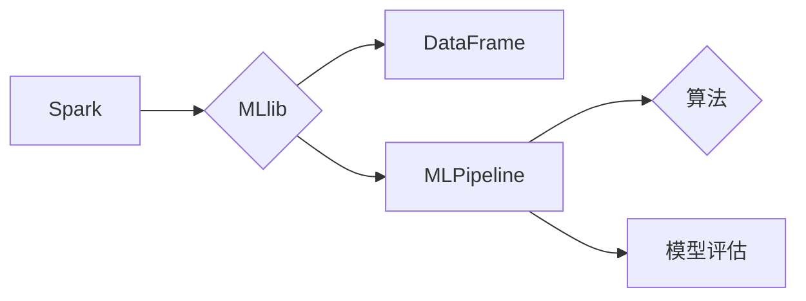

# Spark MLlib机器学习库原理与代码实例讲解

> 关键词：Spark MLlib，机器学习，分布式计算，数据流处理，算法库，Python API，R API，MLflow，模型评估

## 1. 背景介绍

随着大数据时代的到来，数据处理和分析的需求日益增长。Spark作为一款强大的分布式计算框架，在处理大规模数据集方面表现卓越。Spark MLlib是Spark生态系统中的一个模块，它提供了易于使用的机器学习API，允许用户在不牺牲可扩展性的情况下，对数据进行机器学习。

### 1.1 Spark MLlib的由来

Spark MLlib旨在解决传统机器学习框架在处理大规模数据集时遇到的瓶颈。它提供了一种简单、高效的方式来构建和部署机器学习应用，同时支持多种机器学习算法和高级功能。

### 1.2 Spark MLlib的研究现状

Spark MLlib支持多种算法，包括分类、回归、聚类、协同过滤等。它具有以下特点：

- **分布式计算**：能够有效地在大规模数据集上进行计算。
- **易于使用**：提供Python和R语言的API，方便数据科学家和工程师使用。
- **集成性**：与Spark的其他模块（如Spark SQL和Spark Streaming）无缝集成。
- **可扩展性**：支持分布式训练和模型评估。

### 1.3 Spark MLlib的研究意义

Spark MLlib使得机器学习变得更加容易和高效，特别是在处理大规模数据集时。它对于以下领域具有重要意义：

- **数据科学**：为数据科学家提供了一种强大的工具，以快速原型和部署机器学习模型。
- **业务智能**：帮助企业从数据中提取洞察，从而做出更明智的决策。
- **研究**：支持学术研究，特别是在分布式机器学习领域。

### 1.4 本文结构

本文将按照以下结构进行：

- **第2章**：介绍Spark MLlib的核心概念和流程图。
- **第3章**：讲解Spark MLlib的算法原理和操作步骤。
- **第4章**：探讨数学模型、公式和案例。
- **第5章**：提供代码实例和详细解释。
- **第6章**：分析实际应用场景和未来展望。
- **第7章**：推荐学习资源和开发工具。
- **第8章**：总结未来发展趋势和挑战。
- **第9章**：提供常见问题与解答。

## 2. 核心概念与联系

### 2.1 核心概念

- **Spark**：一个分布式计算系统，用于大规模数据处理。
- **MLlib**：Spark的一个模块，提供机器学习算法。
- **DataFrame**：Spark中的数据抽象，用于表示分布式数据集。
- **MLPipeline**：将数据预处理和机器学习算法集成到单个流程中。
- **模型评估**：使用统计指标来评估模型的性能。

### 2.2 Mermaid 流程图



## 3. 核心算法原理 & 具体操作步骤

### 3.1 算法原理概述

Spark MLlib提供了多种机器学习算法，包括：

- **分类**：如逻辑回归、决策树、随机森林、支持向量机等。
- **回归**：如线性回归、岭回归、Lasso回归等。
- **聚类**：如K-Means、层次聚类等。
- **协同过滤**：如基于用户的协同过滤、基于物品的协同过滤等。

### 3.2 算法步骤详解

1. **数据加载**：使用Spark DataFrame加载数据。
2. **数据预处理**：使用MLlib中的工具进行数据清洗、特征工程等。
3. **算法选择**：根据任务需求选择合适的算法。
4. **模型训练**：使用训练数据进行模型训练。
5. **模型评估**：使用测试数据评估模型性能。
6. **模型部署**：将模型部署到生产环境中。

### 3.3 算法优缺点

| 算法类型 | 优点 | 缺点 |
| --- | --- | --- |
| 分类 | 高准确性，可解释性强 | 训练时间较长，对异常值敏感 |
| 回归 | 可处理连续值输出 | 对非线性问题处理能力有限 |
| 聚类 | 无需标签，发现数据分布 | 确定合适的聚类数量困难 |
| 协同过滤 | 可处理大规模数据 | 冷启动问题，推荐结果多样性有限 |

### 3.4 算法应用领域

- **金融风控**：信用评分、欺诈检测等。
- **推荐系统**：电影、商品推荐等。
- **搜索引擎**：搜索结果排序等。
- **文本分析**：情感分析、主题建模等。

## 4. 数学模型和公式 & 详细讲解 & 举例说明

### 4.1 数学模型构建

以逻辑回归为例，其目标是最小化损失函数：

$$
J(\theta) = -\frac{1}{m} \sum_{i=1}^{m} [y^{(i)} \log(\hat{y}^{(i)}) + (1 - y^{(i)}) \log(1 - \hat{y}^{(i)})]
$$

其中，$y^{(i)}$ 是真实标签，$\hat{y}^{(i)}$ 是模型预测的概率。

### 4.2 公式推导过程

逻辑回归的推导过程涉及对数函数、指数函数和链式法则等数学知识。

### 4.3 案例分析与讲解

假设我们有一个包含两个特征（年龄和收入）的金融风控数据集，使用逻辑回归进行违约预测。

1. 加载数据集。
2. 进行数据预处理，包括特征编码和标准化。
3. 创建逻辑回归模型。
4. 训练模型。
5. 使用测试集评估模型性能。

## 5. 项目实践：代码实例和详细解释说明

### 5.1 开发环境搭建

1. 安装Java开发环境。
2. 安装Scala开发环境。
3. 安装Spark和MLlib。

### 5.2 源代码详细实现

```scala
// 加载数据集
val data = sc.textFile("hdfs://path/to/data.csv")

// 数据预处理
val parsedData = data.map { line =>
  val parts = line.split(",")
  (parts(0).toInt, parts(1).toDouble)
}

// 创建DataFrame
val df = parsedData.toDF("age", "income")

// 创建逻辑回归模型
val lr = new LogisticRegression()

// 训练模型
val model = lr.fit(df)

// 使用测试集评估模型性能
// ...
```

### 5.3 代码解读与分析

以上代码展示了使用Spark MLlib进行逻辑回归的完整流程。首先加载数据集，然后进行数据预处理，创建逻辑回归模型，训练模型，并使用测试集评估模型性能。

## 6. 实际应用场景

Spark MLlib在多个领域都有广泛的应用，以下是一些实际应用场景：

- **金融风控**：使用逻辑回归进行信用评分，预测客户违约风险。
- **推荐系统**：使用协同过滤推荐电影、商品等。
- **搜索引擎**：使用文本分析技术进行搜索结果排序。
- **文本分类**：使用文本分析技术进行垃圾邮件过滤、情感分析等。

### 6.4 未来应用展望

随着Spark MLlib的不断发展和完善，它将在更多领域发挥重要作用。以下是一些未来应用展望：

- **边缘计算**：将Spark MLlib应用于边缘设备，实现实时数据处理和分析。
- **深度学习**：将Spark MLlib与深度学习框架结合，实现端到端的机器学习流程。
- **个性化推荐**：使用Spark MLlib构建更加精准的个性化推荐系统。

## 7. 工具和资源推荐

### 7.1 学习资源推荐

- Spark官方文档：[https://spark.apache.org/docs/latest/](https://spark.apache.org/docs/latest/)
- Spark MLlib官方文档：[https://spark.apache.org/docs/latest/mllib-guide.html](https://spark.apache.org/docs/latest/mllib-guide.html)
- 《Spark MLlib机器学习库实战》

### 7.2 开发工具推荐

- IntelliJ IDEA
- PyCharm
- Spark Notebook

### 7.3 相关论文推荐

- [GraphX: Large-scale Graph Processing on Apache Spark](https://www.usenix.org/system/files/conference/nsdi14/nsdi14-paper-dasgupta.pdf)

## 8. 总结：未来发展趋势与挑战

### 8.1 研究成果总结

Spark MLlib作为一款强大的分布式机器学习库，在处理大规模数据集方面表现出色。它提供了一系列易于使用的机器学习算法和高级功能，为数据科学家和工程师提供了强大的工具。

### 8.2 未来发展趋势

- **易用性**：提供更加简洁、直观的API。
- **性能**：提高算法效率和模型评估速度。
- **可扩展性**：支持更多的算法和高级功能。

### 8.3 面临的挑战

- **算法复杂性**：一些算法的计算复杂度较高，需要优化。
- **模型可解释性**：提高模型的可解释性，使其更容易被理解和接受。

### 8.4 研究展望

Spark MLlib将继续发展，以应对数据科学领域的不断变化和挑战。未来，它将与其他人工智能技术（如深度学习、自然语言处理等）结合，为构建更加智能化的系统做出贡献。

## 9. 附录：常见问题与解答

**Q1：Spark MLlib与Scikit-learn相比有哪些优势？**

A1：Spark MLlib是专为分布式计算设计的，可以处理大规模数据集。相比之下，Scikit-learn更适合小规模数据集。

**Q2：Spark MLlib如何进行特征工程？**

A2：Spark MLlib提供了一系列特征工程工具，如特征选择、特征变换等。

**Q3：Spark MLlib如何进行模型评估？**

A3：Spark MLlib提供了一系列模型评估指标，如准确率、召回率、F1分数等。

**Q4：Spark MLlib如何进行模型部署？**

A4：Spark MLlib支持将模型保存到本地文件系统或分布式文件系统，以便后续使用。

**Q5：Spark MLlib如何与其他Spark模块集成？**

A5：Spark MLlib与Spark的其他模块（如Spark SQL、Spark Streaming等）无缝集成，可以方便地进行数据处理和分析。

---

作者：禅与计算机程序设计艺术 / Zen and the Art of Computer Programming