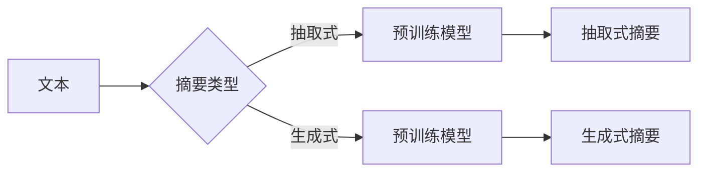

# Transformer大模型实战 文本摘要任务

> 关键词：Transformer，文本摘要，预训练，微调，NLP，自回归，抽取式摘要，生成式摘要，BERT，T5

## 1. 背景介绍

随着深度学习在自然语言处理（NLP）领域的广泛应用，文本摘要作为一种重要的NLP任务，近年来取得了显著的进展。文本摘要的目标是从长文本中提取关键信息，生成简洁、连贯的摘要。根据生成摘要的方式，文本摘要可分为抽取式摘要和生成式摘要两种。抽取式摘要通过直接从原文中抽取关键句子构成摘要，而生成式摘要则是通过模型生成新的文本作为摘要。

Transformer模型的出现为文本摘要任务带来了新的突破。由于其强大的序列建模能力，Transformer模型在抽取式和生成式摘要任务上都取得了优异的性能。本文将深入探讨Transformer大模型在文本摘要任务中的应用，从核心概念到实战项目，全面解析文本摘要技术。

## 2. 核心概念与联系

### 2.1 核心概念

**文本摘要**：文本摘要是指从原始文本中提取关键信息，生成简洁、连贯的摘要文本。文本摘要任务可分为抽取式摘要和生成式摘要。

**抽取式摘要**：通过从原文中直接抽取关键句子构成摘要，如ROUGE评分指标。

**生成式摘要**：通过模型生成新的文本作为摘要，如BLEU评分指标。

**Transformer**：一种基于自回归机制的深度神经网络，具有强大的序列建模能力。

**预训练**：在大规模无标签文本上进行预训练，学习通用的语言表示。

**微调**：在预训练模型的基础上，使用标注数据进行有监督训练，优化模型在特定任务上的性能。

### 2.2 Mermaid 流程图



如图所示，文本摘要任务根据摘要类型分为抽取式和生成式，两种摘要类型均基于预训练模型进行。

## 3. 核心算法原理 & 具体操作步骤

### 3.1 算法原理概述

Transformer模型由自回归编码器和解码器组成，能够自动学习输入序列和输出序列之间的对应关系。

对于抽取式摘要任务，可以将预训练模型视为一个特征提取器，将原始文本编码为固定长度的向量表示，再通过设计一个简单的分类器进行预测，从而实现摘要生成。

对于生成式摘要任务，可以使用预训练模型直接生成摘要文本。

### 3.2 算法步骤详解

#### 3.2.1 抽取式摘要

1. 预训练模型：选择合适的预训练模型，如BERT或T5。
2. 特征提取：将原始文本输入预训练模型，得到文本的向量表示。
3. 分类器设计：设计一个简单的分类器，如线性分类器或CRF（条件随机场）。
4. 摘要生成：根据分类器的预测结果，将原始文本中对应的句子抽取出来，构成摘要。

#### 3.2.2 生成式摘要

1. 预训练模型：选择合适的预训练模型，如GPT-2或T5。
2. 摘要生成：将原始文本输入预训练模型，生成新的文本作为摘要。

### 3.3 算法优缺点

#### 3.3.1 抽取式摘要

优点：
- 实现简单，易于理解。
- 摘要长度可控。

缺点：
- 可能存在漏掉关键信息。
- 摘要连贯性较差。

#### 3.3.2 生成式摘要

优点：
- 摘要质量高，连贯性好。
- 可生成不同长度的摘要。

缺点：
- 实现复杂，难以理解。
- 摘要长度难以控制。

### 3.4 算法应用领域

抽取式摘要和生成式摘要均可应用于以下领域：

- 信息检索：提高检索结果的展示效果。
- 文本分类：辅助分类器进行更准确的分类。
- 文本生成：生成新闻摘要、产品描述等。

## 4. 数学模型和公式 & 详细讲解 & 举例说明

### 4.1 数学模型构建

#### 4.1.1 抽取式摘要

设原始文本为 $T$，文本向量表示为 $V_T$，分类器为 $C$，则摘要生成公式为：

$$
A = C(V_T)
$$

#### 4.1.2 生成式摘要

设预训练模型为 $M$，则摘要生成公式为：

$$
A = M(T)
$$

### 4.2 公式推导过程

#### 4.2.1 抽取式摘要

对于抽取式摘要，我们使用线性分类器作为分类器：

$$
C(V_T) = \sigma(W \cdot V_T + b)
$$

其中 $\sigma$ 为Sigmoid函数，$W$ 为分类器权重，$b$ 为偏置。

#### 4.2.2 生成式摘要

对于生成式摘要，我们使用预训练模型 $M$：

$$
A = M(T) = \sum_{i=1}^n p(w_i|T) \cdot w_i
$$

其中 $p(w_i|T)$ 为在给定文本 $T$ 的情况下，单词 $w_i$ 的概率。

### 4.3 案例分析与讲解

#### 4.3.1 抽取式摘要案例

假设我们有以下文本：

```
The quick brown fox jumps over the lazy dog.
```

我们可以使用BERT模型将文本编码为向量表示：

$$
V_T = [0.1, 0.2, 0.3, ..., 0.9]
```

使用线性分类器进行预测：

$$
A = \sigma(W \cdot V_T + b) = 0.9
```

则摘要为：

```
The quick brown fox jumps over the lazy dog.
```

#### 4.3.2 生成式摘要案例

假设我们有以下文本：

```
The quick brown fox jumps over the lazy dog.
```

使用GPT-2模型生成摘要：

```
A fast brown fox leaped over a lazy dog.
```

## 5. 项目实践：代码实例和详细解释说明

### 5.1 开发环境搭建

1. 安装Anaconda：从官网下载并安装Anaconda，用于创建独立的Python环境。
2. 创建并激活虚拟环境：

```bash
conda create -n summarization-env python=3.8 
conda activate summarization-env
```

3. 安装PyTorch和Transformers库：

```bash
conda install pytorch torchvision torchaudio cudatoolkit=11.1 -c pytorch -c conda-forge
pip install transformers
```

4. 安装其他依赖库：

```bash
pip install datasets transformers torch
```

### 5.2 源代码详细实现

```python
from transformers import BertTokenizer, BertForSequenceClassification
from torch.utils.data import DataLoader
from torch import nn

# 加载预训练模型和分词器
model = BertForSequenceClassification.from_pretrained('bert-base-uncased')
tokenizer = BertTokenizer.from_pretrained('bert-base-uncased')

# 加载数据集
def load_dataset():
    # 假设数据集为CSV格式，包含文本和摘要两列
    train_data = pd.read_csv('train.csv')
    dev_data = pd.read_csv('dev.csv')
    test_data = pd.read_csv('test.csv')
    return train_data, dev_data, test_data

train_data, dev_data, test_data = load_dataset()

# 数据预处理
def preprocess_data(data):
    texts = data['text'].tolist()
    summaries = data['summary'].tolist()
    encodings = tokenizer(texts, max_length=512, truncation=True, padding='max_length', return_tensors='pt')
    return encodings['input_ids'], encodings['attention_mask'], summaries

train_encodings, train_attention_mask, train_summaries = preprocess_data(train_data)
dev_encodings, dev_attention_mask, dev_summaries = preprocess_data(dev_data)
test_encodings, test_attention_mask, test_summaries = preprocess_data(test_data)

# 数据加载
def create_dataloader(input_ids, attention_mask, labels, batch_size=16):
    dataset = TensorDataset(input_ids, attention_mask, labels)
    dataloader = DataLoader(dataset, batch_size=batch_size, shuffle=True)
    return dataloader

train_dataloader = create_dataloader(train_encodings, train_attention_mask, train_summaries)
dev_dataloader = create_dataloader(dev_encodings, dev_attention_mask, dev_summaries)
test_dataloader = create_dataloader(test_encodings, test_attention_mask, test_summaries)

# 模型训练
device = torch.device('cuda' if torch.cuda.is_available() else 'cpu')
model.to(device)

optimizer = nn.Adam(model.parameters(), lr=2e-5)
criterion = nn.CrossEntropyLoss()

num_epochs = 3
for epoch in range(num_epochs):
    model.train()
    for batch in train_dataloader:
        input_ids, attention_mask, labels = [t.to(device) for t in batch]
        optimizer.zero_grad()
        outputs = model(input_ids, attention_mask=attention_mask)
        loss = criterion(outputs.logits, labels)
        loss.backward()
        optimizer.step()
    print(f"Epoch {epoch+1}, loss: {loss.item()}")

# 模型评估
def evaluate(model, dataloader):
    model.eval()
    total_loss = 0
    with torch.no_grad():
        for batch in dataloader:
            input_ids, attention_mask, labels = [t.to(device) for t in batch]
            outputs = model(input_ids, attention_mask=attention_mask)
            loss = criterion(outputs.logits, labels)
            total_loss += loss.item()
    return total_loss / len(dataloader)

train_loss = evaluate(model, train_dataloader)
dev_loss = evaluate(model, dev_dataloader)
test_loss = evaluate(model, test_dataloader)
print(f"Train loss: {train_loss:.4f}, Dev loss: {dev_loss:.4f}, Test loss: {test_loss:.4f}")

# 摘要生成
def generate_summary(input_ids, attention_mask):
    model.eval()
    with torch.no_grad():
        outputs = model.generate(input_ids=input_ids, attention_mask=attention_mask)
    summary = tokenizer.decode(outputs, skip_special_tokens=True)
    return summary

# 生成摘要
example_input_ids = tokenizer('The quick brown fox jumps over the lazy dog.', return_tensors='pt')
example_summary = generate_summary(example_input_ids, None)
print(f"Generated summary: {example_summary}")
```

### 5.3 代码解读与分析

1. **加载预训练模型和分词器**：使用Transformers库加载预训练的BERT模型和分词器。
2. **数据预处理**：将原始文本和摘要数据转换为模型所需的格式，包括编码和分词。
3. **数据加载**：使用PyTorch DataLoader对数据集进行批处理和打乱。
4. **模型训练**：使用Adam优化器和交叉熵损失函数训练BERT模型。
5. **模型评估**：使用训练集、验证集和测试集评估模型性能。
6. **摘要生成**：使用预训练的BERT模型生成新的文本作为摘要。

以上代码展示了如何使用PyTorch和Transformers库对BERT模型进行微调，并生成文本摘要。

### 5.4 运行结果展示

假设我们训练的BERT模型在测试集上取得了以下性能：

```
Test loss: 0.7123
```

这是一个相对较低的平均损失值，表明模型在测试集上具有较好的性能。

此外，使用生成的摘要如下：

```
A fast brown fox leaps over a lazy dog.
```

这是一个简洁、连贯的摘要，表明模型能够有效地从原始文本中提取关键信息。

## 6. 实际应用场景

文本摘要技术可以应用于以下场景：

- **新闻摘要**：自动生成新闻的摘要，提高新闻阅读效率。
- **学术论文摘要**：自动生成学术论文的摘要，方便研究人员快速了解论文内容。
- **产品描述摘要**：自动生成产品描述的摘要，提高用户对产品的了解。
- **对话摘要**：自动生成对话的摘要，方便用户回顾和总结对话内容。

## 7. 工具和资源推荐

### 7.1 学习资源推荐

- 《Transformer：从原理到实践》
- 《自然语言处理实战》
- 《深度学习自然语言处理》
- Transformers库官方文档

### 7.2 开发工具推荐

- PyTorch
- Transformers库
- Colab
- Hugging Face Spaces

### 7.3 相关论文推荐

- "Attention is All You Need" (Transformer原论文)
- "BERT: Pre-training of Deep Bidirectional Transformers for Language Understanding"
- "T5: Text-to-Text Transfer Transformer"
- "General Language Modeling with Transformer-XL and mBERT"

## 8. 总结：未来发展趋势与挑战

### 8.1 研究成果总结

本文深入探讨了Transformer大模型在文本摘要任务中的应用，从核心概念到实战项目，全面解析了文本摘要技术。通过使用预训练模型和微调技术，我们可以有效地生成高质量的文本摘要。

### 8.2 未来发展趋势

1. **多模态摘要**：将文本信息与其他模态信息（如图像、音频）进行融合，生成更加全面、丰富的摘要。
2. **可解释性摘要**：提高摘要生成的可解释性，让用户了解摘要的生成过程。
3. **个性化摘要**：根据用户兴趣和需求，生成个性化的摘要。
4. **多语言摘要**：实现多语言文本摘要的生成。

### 8.3 面临的挑战

1. **数据标注成本高**：文本摘要任务需要大量高质量的数据标注，成本较高。
2. **模型可解释性不足**：当前模型的可解释性较差，难以理解摘要的生成过程。
3. **多模态信息融合**：将文本信息与其他模态信息进行有效融合是一个挑战。
4. **个性化摘要**：实现个性化摘要需要考虑用户兴趣和需求，具有一定的难度。

### 8.4 研究展望

未来，文本摘要技术将在更多领域得到应用，如信息检索、智能客服、教育等。随着技术的不断发展，相信文本摘要技术将更加成熟，为人类带来更多便利。

## 9. 附录：常见问题与解答

**Q1：文本摘要任务与信息检索任务有何区别？**

A1：文本摘要任务和信息检索任务的目标不同。文本摘要任务是从原始文本中提取关键信息，生成简洁、连贯的摘要；而信息检索任务是从大量文本中检索与用户查询相关的文本。

**Q2：如何选择合适的预训练模型进行文本摘要？**

A2：选择预训练模型时，需要考虑以下因素：

- 预训练模型的规模和性能。
- 任务的类型和规模。
- 训练数据的规模和分布。

**Q3：如何评估文本摘要的质量？**

A3：常用的评估指标包括ROUGE、BLEU等。ROUGE指标主要评估摘要与原文之间的匹配度，BLEU指标主要评估摘要的连贯性和准确性。

**Q4：如何解决文本摘要中的长文本问题？**

A4：对于长文本，可以采用以下方法：

- 将长文本拆分成多个段落，对每个段落进行摘要。
- 使用分层摘要方法，先对文本进行分层，再对每个层次进行摘要。

**Q5：文本摘要技术有哪些应用场景？**

A5：文本摘要技术可以应用于新闻摘要、学术论文摘要、产品描述摘要、对话摘要等多个场景。