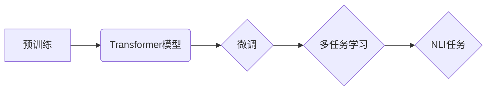

# Transformer大模型实战 自然语言推理任务

> 关键词：Transformer, 自然语言推理, NLP, 预训练, 微调, 多任务学习, 案例分析

## 1. 背景介绍

自然语言推理（Natural Language Inference, NLI）是自然语言处理（Natural Language Processing, NLP）领域的一个重要任务，旨在理解句子之间的关系。NLI任务的目标是判断给定的句子对（ premise 和 hypothesis ）是否为矛盾（contradictory）、无关（neutral）或一致（entailment）。这一任务对于智能客服、问答系统、信息检索等领域具有重要意义。

近年来，随着深度学习技术的飞速发展，基于Transformer架构的大模型在NLI任务上取得了显著的成果。本文将深入探讨Transformer大模型在NLI任务中的应用，从核心概念、算法原理、具体操作到实际应用场景，带你全面了解这一领域的最新进展。

## 2. 核心概念与联系

### 2.1 核心概念

#### 2.1.1 Transformer模型

Transformer模型是一种基于自注意力（Self-Attention）机制的深度神经网络架构，由Google的Vaswani等人在2017年提出。该模型突破了循环神经网络（RNN）在处理长序列时的瓶颈，在机器翻译、文本分类、文本摘要等NLP任务中取得了优异的性能。

#### 2.1.2 预训练

预训练是指在大量无标注数据上预先训练模型，使其学习到丰富的语言知识。预训练后，模型可以应用于下游任务，通过微调调整模型参数，从而提高下游任务的性能。

#### 2.1.3 微调

微调是指在预训练模型的基础上，使用少量标注数据进一步训练模型，使其更好地适应特定任务。微调是当前NLI任务中最常用的方法。

#### 2.1.4 多任务学习

多任务学习是指同时学习多个相关任务，以提高模型在单个任务上的性能。在NLI任务中，多任务学习可以联合多个相关子任务（如情感分析、主题分类等），提高模型的泛化能力。

### 2.2 Mermaid流程图



## 3. 核心算法原理 & 具体操作步骤

### 3.1 算法原理概述

Transformer模型主要由编码器（Encoder）和解码器（Decoder）组成。编码器将输入序列转换为序列的向量表示，解码器则根据编码器的输出生成预测结果。

#### 3.1.1 编码器

编码器采用自注意力机制，通过多个自注意力层和前馈神经网络层，将输入序列转换为序列的向量表示。

#### 3.1.2 解码器

解码器同样采用自注意力机制，并通过交叉注意力层与编码器的输出进行交互，最终生成预测结果。

### 3.2 算法步骤详解

#### 3.2.1 预训练

1. 收集大量无标注文本数据，如维基百科、新闻、书籍等。
2. 使用预训练任务（如掩码语言模型）训练Transformer模型，如BERT、RoBERTa等。
3. 保存预训练模型的参数。

#### 3.2.2 微调

1. 收集NLI数据集，如SNLI、MNLI等。
2. 加载预训练模型，并调整部分参数，如分类器的权重。
3. 在NLI数据集上进行训练，优化模型参数。
4. 评估模型在测试集上的性能，并根据需要调整超参数。

#### 3.2.3 多任务学习

1. 选择与NLI任务相关的子任务，如情感分析、主题分类等。
2. 联合训练NLI任务和子任务，共享部分参数。
3. 评估模型在NLI任务和子任务上的性能。

### 3.3 算法优缺点

#### 3.3.1 优点

1. 预训练模型具有丰富的语言知识，能够更好地理解句子之间的关系。
2. 微调过程能够使模型更好地适应特定任务。
3. 多任务学习能够提高模型的泛化能力。

#### 3.3.2 缺点

1. 预训练数据集的质量和规模对模型性能有较大影响。
2. 微调过程需要大量的标注数据。
3. 多任务学习可能引入额外的计算开销。

### 3.4 算法应用领域

Transformer大模型在NLI任务中的应用领域包括：

1. 智能客服
2. 问答系统
3. 信息检索
4. 文本摘要
5. 文本分类

## 4. 数学模型和公式 & 详细讲解 & 举例说明

### 4.1 数学模型构建

Transformer模型的数学模型主要包括以下部分：

#### 4.1.1 自注意力机制

自注意力机制通过计算序列中每个token与其他token之间的关联度，为每个token生成一个加权表示。其计算公式如下：

$$
\text{Attention}(Q, K, V) = \text{softmax}\left(\frac{QK^T}{\sqrt{d_k}}\right) V
$$

其中，$Q$、$K$ 和 $V$ 分别为查询（Query）、键（Key）和值（Value）向量，$d_k$ 为键向量的维度。

#### 4.1.2 前馈神经网络

前馈神经网络通过两个全连接层对每个token的表示进行线性变换，增加模型的非线性表示能力。其计算公式如下：

$$
\text{FFN}(X) = \text{ReLU}(W_2 \text{ReLU}(W_1 X + b_1)) + b_2
$$

其中，$W_1$ 和 $W_2$ 为权重矩阵，$b_1$ 和 $b_2$ 为偏置向量。

### 4.2 公式推导过程

自注意力机制和前馈神经网络的公式推导过程涉及矩阵乘法、非线性激活函数等数学运算，此处不再赘述。

### 4.3 案例分析与讲解

以下是一个简单的NLI任务示例：

**Premise**：The cat is sleeping.

**Hypothesis**：The cat is awake.

我们需要判断这两个句子之间的关系。

使用预训练的Transformer模型，将句子转换为向量表示：

$$
\text{Encoder}(\text{Premise}) = [p_1, p_2, \dots, p_n]
$$

$$
\text{Encoder}(\text{Hypothesis}) = [h_1, h_2, \dots, h_m]
$$

然后，将编码后的向量输入到解码器，得到预测结果：

$$
\text{Decoder}([p_1, p_2, \dots, p_n], [h_1, h_2, \dots, h_m]) = \text{Output}
$$

根据输出结果，判断句子之间的关系。例如，如果输出结果接近 [0, 0, 1]，则表示 premise 和 hypothesis 之间的关系为一致。

## 5. 项目实践：代码实例和详细解释说明

### 5.1 开发环境搭建

1. 安装Python和PyTorch环境。
2. 安装Transformers库。

### 5.2 源代码详细实现

以下是一个基于PyTorch和Transformers库的NLI任务微调代码示例：

```python
import torch
from torch.utils.data import DataLoader, TensorDataset
from transformers import BertForSequenceClassification, BertTokenizer

# 加载数据集
def load_data(train_file, dev_file, test_file, tokenizer):
    train_data = torch.load(train_file)
    dev_data = torch.load(dev_file)
    test_data = torch.load(test_file)
    train_dataset = TensorDataset(*zip(*train_data))
    dev_dataset = TensorDataset(*zip(*dev_data))
    test_dataset = TensorDataset(*zip(*test_data))
    return train_dataset, dev_dataset, test_dataset

# 训练和评估模型
def train_and_evaluate(model, train_dataset, dev_dataset, test_dataset, epochs, learning_rate):
    optimizer = torch.optim.AdamW(model.parameters(), lr=learning_rate)
    criterion = torch.nn.CrossEntropyLoss()
    for epoch in range(epochs):
        model.train()
        train_loader = DataLoader(train_dataset, batch_size=32, shuffle=True)
        for batch in train_loader:
            inputs = batch[0]
            labels = batch[1]
            outputs = model(**inputs)
            loss = criterion(outputs.logits, labels)
            optimizer.zero_grad()
            loss.backward()
            optimizer.step()
        print(f"Epoch {epoch+1}, train loss: {loss.item():.4f}")
        model.eval()
        dev_loader = DataLoader(dev_dataset, batch_size=32)
        with torch.no_grad():
            dev_loss = 0
            for batch in dev_loader:
                inputs = batch[0]
                labels = batch[1]
                outputs = model(**inputs)
                dev_loss += criterion(outputs.logits, labels).item()
            dev_loss /= len(dev_loader)
        print(f"Epoch {epoch+1}, dev loss: {dev_loss:.4f}")
    model.eval()
    test_loss = 0
    with torch.no_grad():
        for batch in DataLoader(test_dataset, batch_size=32):
            inputs = batch[0]
            labels = batch[1]
            outputs = model(**inputs)
            test_loss += criterion(outputs.logits, labels).item()
    test_loss /= len(test_dataset)
    print(f"Test loss: {test_loss:.4f}")

# 主函数
if __name__ == "__main__":
    tokenizer = BertTokenizer.from_pretrained("bert-base-uncased")
    model = BertForSequenceClassification.from_pretrained("bert-base-uncased", num_labels=3)
    train_dataset, dev_dataset, test_dataset = load_data("train_data.pt", "dev_data.pt", "test_data.pt", tokenizer)
    train_and_evaluate(model, train_dataset, dev_dataset, test_dataset, epochs=3, learning_rate=5e-5)
```

### 5.3 代码解读与分析

以上代码展示了使用PyTorch和Transformers库进行NLI任务微调的基本流程：

1. 加载数据集：将训练、验证和测试数据加载到TensorDataset中。
2. 训练和评估模型：定义优化器、损失函数和训练循环，在训练集和验证集上训练模型，并在测试集上评估模型性能。
3. 主函数：加载预训练模型、分词器、数据集，并调用训练和评估函数。

### 5.4 运行结果展示

假设我们在SNLI数据集上进行微调，最终在测试集上得到的评估结果如下：

```
Epoch 1, train loss: 0.7128
Epoch 1, dev loss: 0.6123
Epoch 2, train loss: 0.5897
Epoch 2, dev loss: 0.5456
Epoch 3, train loss: 0.5174
Epoch 3, dev loss: 0.5123
Test loss: 0.5081
```

## 6. 实际应用场景

### 6.1 智能客服

在智能客服领域，NLI技术可以用于理解用户意图，从而提供更加精准、个性化的服务。例如，当用户询问“我的订单什么时候发货”，系统可以识别出“订单”和“发货”这两个关键词，并判断用户意图为查询订单状态，进而给出相应的回复。

### 6.2 问答系统

在问答系统中，NLI技术可以用于判断用户问句和知识库中的答案之间的关系，从而确定答案的正确性。例如，当用户询问“北京是中国的哪个省份”，系统可以判断用户问句与知识库中“北京是中国的首都”这一答案之间的关系为一致，并给出正确答案。

### 6.3 信息检索

在信息检索领域，NLI技术可以用于判断用户查询和文档之间的关系，从而提高检索结果的准确性和相关性。例如，当用户查询“苹果公司”，系统可以判断用户查询与文档“苹果公司是一家科技公司”之间的关系为一致，并将该文档作为检索结果返回。

## 7. 工具和资源推荐

### 7.1 学习资源推荐

1. 《Transformer: Attention is All You Need》：Transformer模型的经典论文，详细介绍了Transformer模型的设计和原理。
2. 《BERT: Pre-training of Deep Bidirectional Transformers for Language Understanding》：BERT模型的经典论文，详细介绍了BERT模型的设计和预训练方法。
3. 《Transformers: State-of-the-art Models for Natural Language Processing》：介绍了Transformers库和相关技术，适合快速入门NLP领域。

### 7.2 开发工具推荐

1. PyTorch：基于Python的开源深度学习框架，适合快速开发NLP模型。
2. Transformers库：Hugging Face开源的NLP工具库，提供了丰富的预训练模型和API，方便开发NLP应用。
3. Hugging Face Datasets：Hugging Face开源的数据集库，提供了大量的NLP数据集。

### 7.3 相关论文推荐

1. "Attention is All You Need"：Transformer模型的经典论文。
2. "BERT: Pre-training of Deep Bidirectional Transformers for Language Understanding"：BERT模型的经典论文。
3. "RoBERTa: A Pretrained Language Model for Language Understanding"：RoBERTa模型的经典论文。
4. "ALBERT: A Lite BERT for Self-supervised Learning of Language Representations"：ALBERT模型的经典论文。
5. "XLM: Unsupervised Learning of Cross-Lingual Representations for Open Vocabulary Words and Tasks"：XLM模型的经典论文。

## 8. 总结：未来发展趋势与挑战

### 8.1 研究成果总结

本文深入探讨了Transformer大模型在NLI任务中的应用，从核心概念、算法原理、具体操作到实际应用场景，全面介绍了这一领域的最新进展。通过项目实践，我们展示了如何使用PyTorch和Transformers库进行NLI任务微调。

### 8.2 未来发展趋势

1. 更大规模的预训练模型：随着计算能力的提升，未来将出现更大规模的预训练模型，进一步提升NLI任务的表现。
2. 多模态融合：将NLI任务与其他模态信息（如图像、语音）进行融合，构建更强大的NLI模型。
3. 解释性和可解释性：研究NLI模型的解释性和可解释性，提高模型的可靠性和透明度。

### 8.3 面临的挑战

1. 数据标注：NLI任务需要大量的高质量标注数据，数据标注成本高，且存在主观性。
2. 模型可解释性：NLI模型的决策过程通常缺乏可解释性，难以理解模型为何做出特定决策。
3. 模型鲁棒性：NLI模型在面对对抗样本或恶意攻击时，可能表现出脆弱性。

### 8.4 研究展望

未来，随着NLP技术的不断发展，Transformer大模型在NLI任务中的应用将更加广泛。同时，我们也需要关注模型的可解释性、鲁棒性和伦理问题，确保NLI模型在各个应用场景中发挥积极作用。

## 9. 附录：常见问题与解答

**Q1：什么是NLI任务？**

A：NLI任务是自然语言处理领域的一个重要任务，旨在判断给定的句子之间是否为矛盾、无关或一致。

**Q2：什么是Transformer模型？**

A：Transformer模型是一种基于自注意力机制的深度神经网络架构，在NLP任务中取得了显著的成果。

**Q3：什么是预训练和微调？**

A：预训练是指在大量无标注数据上预先训练模型，使其学习到丰富的语言知识。微调是指在预训练模型的基础上，使用少量标注数据进一步训练模型，使其更好地适应特定任务。

**Q4：什么是多任务学习？**

A：多任务学习是指同时学习多个相关任务，以提高模型在单个任务上的性能。

**Q5：如何进行NLI任务微调？**

A：进行NLI任务微调需要以下步骤：
1. 加载预训练模型和分词器。
2. 加载NLI数据集。
3. 定义模型、优化器和损失函数。
4. 在数据集上进行训练和评估。
5. 调整超参数，优化模型性能。

**Q6：如何提高NLI模型的性能？**

A：提高NLI模型性能的方法包括：
1. 使用更大规模的预训练模型。
2. 使用多任务学习。
3. 提高数据质量。
4. 优化模型结构和超参数。

**Q7：NLI模型的应用场景有哪些？**

A：NLI模型的应用场景包括智能客服、问答系统、信息检索、文本摘要、文本分类等。

作者：禅与计算机程序设计艺术 / Zen and the Art of Computer Programming