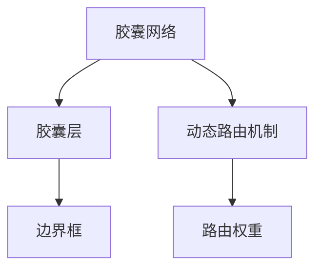
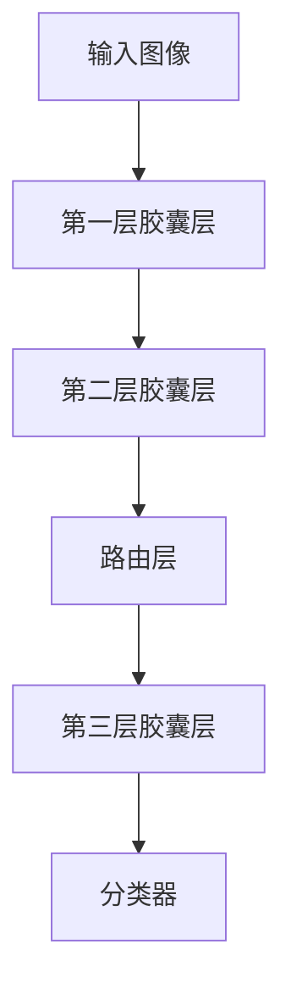
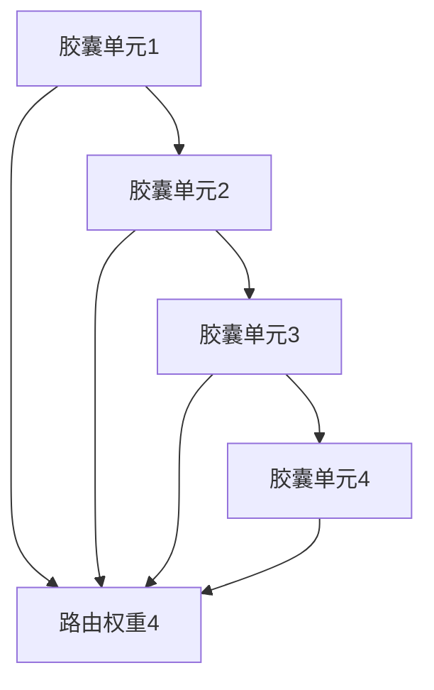
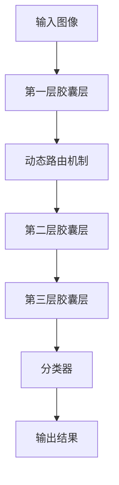

                 

# 胶囊网络 原理与代码实例讲解

## 1. 背景介绍

### 1.1 问题由来

随着深度学习在计算机视觉领域的广泛应用，卷积神经网络（Convolutional Neural Networks, CNNs）成为了图像识别和分类的主流方法。然而，传统的CNN存在一定的局限性，如平移不变性不足、梯度消失等问题。为解决这些问题，2017年，Nature期刊发表了一篇具有划时代意义的论文《Dynamic Routing Between Capsules》，首次提出了胶囊网络（Capsule Network, CapsNet）的概念。

胶囊网络由Sabby Pais、Geoffrey Hinton和Ali Y. Hinton三位研究者提出，被视为CNN之后最重要的突破性模型之一。胶囊网络的核心思想是通过胶囊层的级联实现数据的高层次表示，从而更好地提取图像中的语义信息，提升识别精度。

### 1.2 问题核心关键点

胶囊网络的提出，旨在解决以下三个关键问题：

1. **局部感知不变性（Local Perception Invariance）**：传统CNN中，卷积核在图像平移、旋转和缩放等操作下，难以保持语义不变性。胶囊网络通过胶囊层的级联，实现图像中的平移、旋转和缩放等操作下，胶囊层的输出具有局部感知不变性。

2. **梯度消失问题（Vanishing Gradient Problem）**：传统CNN中，较深的卷积层容易出现梯度消失问题，导致模型难以训练。胶囊网络通过将卷积核和池化层替换为胶囊层，避免梯度消失问题，使模型训练更加稳定。

3. **输出维度控制（Output Dimension Control）**：传统CNN中，不同层输出的维度往往不一致，导致模型难以融合。胶囊网络通过胶囊层的级联，实现输出维度的一致性，方便后续的高层次特征提取和分类。

### 1.3 问题研究意义

研究胶囊网络对于提升计算机视觉领域的模型性能，具有重要意义：

1. **语义信息提取能力更强**：胶囊网络能够提取更加语义化、抽象化的特征，提升模型的识别精度和泛化能力。
2. **鲁棒性更高**：胶囊网络具有局部感知不变性，能够有效应对图像中的各种噪声和变化，提升模型的鲁棒性。
3. **更稳定的训练过程**：胶囊网络通过级联胶囊层，避免了梯度消失问题，使模型训练更加稳定。
4. **更高效的特征提取**：胶囊网络通过多层次的胶囊层级联，能够逐步提取图像的高层次特征，提升模型的特征提取能力。
5. **更灵活的输出维度控制**：胶囊网络通过控制输出维度，方便融合高层次特征，提升模型的分类能力。

## 2. 核心概念与联系

### 2.1 核心概念概述

为更好地理解胶囊网络的原理，本节将介绍几个密切相关的核心概念：

- **胶囊网络（Capsule Network, CapsNet）**：由胶囊层和动态路由机制构成，能够实现图像的高层次特征提取和分类。

- **胶囊层（Capsule Layer）**：由多个胶囊单元（Capsule Unit）组成，用于提取图像中的局部感知不变性特征。

- **动态路由机制（Dynamic Routing）**：用于连接不同层次的胶囊层，实现特征的逐层提取和级联。

- **边界框（Bounding Box）**：用于表示图像中的物体位置和大小，是胶囊网络中的重要概念。

- **路由权重（Routing Weights）**：用于动态路由机制中，决定信息在胶囊层之间的传递方向和强度。

这些核心概念之间的逻辑关系可以通过以下Mermaid流程图来展示：



这个流程图展示了大胶囊网络的组成部分及其之间的关系：

1. 胶囊网络由多个胶囊层构成，用于提取图像中的局部感知不变性特征。
2. 动态路由机制连接不同层次的胶囊层，实现特征的逐层提取和级联。
3. 边界框用于表示图像中的物体位置和大小，是胶囊网络中的重要概念。
4. 路由权重用于动态路由机制中，决定信息在胶囊层之间的传递方向和强度。

### 2.2 概念间的关系

这些核心概念之间存在着紧密的联系，形成了胶囊网络的完整架构。下面我们通过几个Mermaid流程图来展示这些概念之间的关系。

#### 2.2.1 胶囊网络的组成结构


这个流程图展示了胶囊网络的基本结构，包括输入层、多层次的胶囊层和分类器。

#### 2.2.2 动态路由机制的工作流程



这个流程图展示了动态路由机制的基本流程，包括输入层、多层次的胶囊层和分类器。

#### 2.2.3 路由权重的计算过程



这个流程图展示了路由权重的计算过程，即不同胶囊单元之间的权重分配。

### 2.3 核心概念的整体架构

最后，我们用一个综合的流程图来展示这些核心概念在大胶囊网络中的整体架构：



这个综合流程图展示了胶囊网络的整体结构，包括输入层、多层次的胶囊层和分类器。

## 3. 核心算法原理 & 具体操作步骤
### 3.1 算法原理概述

胶囊网络的原理，可以简单理解为：通过胶囊层的级联，实现图像中的局部感知不变性特征的逐层提取，最终通过分类器实现高层次特征的提取和分类。

具体来说，胶囊网络由多个胶囊层组成，每个胶囊层包含多个胶囊单元。每个胶囊单元用于提取图像中的局部感知不变性特征，并通过动态路由机制实现逐层特征的提取。最终，通过分类器实现高层次特征的提取和分类。

### 3.2 算法步骤详解

胶囊网络的主要算法步骤如下：

1. **输入预处理**：将输入图像经过预处理，如归一化、裁剪等，得到预处理后的图像。

2. **第一层胶囊层提取**：使用第一层胶囊层，从预处理后的图像中提取局部感知不变性特征。

3. **动态路由机制**：通过动态路由机制，连接不同层次的胶囊层，实现特征的逐层提取和级联。

4. **第三层胶囊层提取**：通过第三层胶囊层，进一步提取高层次特征，并通过分类器实现分类。

5. **后处理**：将分类器输出进行后处理，如非极大值抑制（Non-Maximum Suppression, NMS）等，得到最终分类结果。

### 3.3 算法优缺点

胶囊网络具有以下优点：

1. **局部感知不变性**：胶囊层具有局部感知不变性，能够有效应对图像中的平移、旋转和缩放等操作，提升模型的鲁棒性。
2. **梯度消失问题**：通过级联胶囊层，避免梯度消失问题，使模型训练更加稳定。
3. **输出维度控制**：通过控制输出维度，方便融合高层次特征，提升模型的分类能力。

胶囊网络也存在一些缺点：

1. **计算复杂度高**：由于胶囊层的计算复杂度较高，导致整个模型的训练和推理速度较慢。
2. **训练难度大**：胶囊网络的训练难度较大，需要优化算法和大量实验调参。
3. **模型可解释性差**：胶囊网络的黑盒特性导致模型可解释性较差，难以调试和优化。

### 3.4 算法应用领域

胶囊网络在计算机视觉领域有广泛的应用，包括：

1. **图像分类**：胶囊网络能够有效提取图像中的高层次特征，提升分类精度。
2. **目标检测**：通过动态路由机制，胶囊网络能够实现目标的精确定位和分类。
3. **姿态估计**：通过胶囊网络，能够实现物体的姿态估计和三维重建。
4. **人脸识别**：胶囊网络能够提取人脸的局部感知不变性特征，提升识别精度。
5. **视频分类**：通过动态路由机制，胶囊网络能够实现视频中的动作分类和行为识别。

## 4. 数学模型和公式 & 详细讲解  
### 4.1 数学模型构建

我们以图像分类任务为例，建立胶囊网络的数学模型。假设输入图像的大小为$C \times H \times W$，其中$C$表示通道数，$H$和$W$表示图像的高度和宽度。第一层胶囊层由$N$个胶囊单元组成，每个胶囊单元的维度为$d$。第二层胶囊层由$M$个胶囊单元组成，每个胶囊单元的维度为$n$。第三层胶囊层由$K$个胶囊单元组成，每个胶囊单元的维度为$m$。分类器的维度为$c$。

**输入层**：输入图像$x$经过预处理后，得到$x \in \mathbb{R}^{C \times H \times W}$。

**第一层胶囊层**：使用第一层胶囊层提取局部感知不变性特征$v_i$，其中$i \in [1, N]$。第一层胶囊层的输出为$\{v_i\}_{i=1}^{N}$。

**动态路由机制**：使用动态路由机制，连接不同层次的胶囊层，实现特征的逐层提取。具体来说，通过胶囊层$i$和$j$之间的路由权重$w_{ij}$，将胶囊层$i$的输出$\{v_i\}_{i=1}^{N}$传递到胶囊层$j$。

**第二层胶囊层**：使用第二层胶囊层提取更高层次的特征$u_j$，其中$j \in [1, M]$。第二层胶囊层的输出为$\{u_j\}_{j=1}^{M}$。

**第三层胶囊层**：使用第三层胶囊层提取最高层次的特征$s_k$，其中$k \in [1, K]$。第三层胶囊层的输出为$\{s_k\}_{k=1}^{K}$。

**分类器**：使用分类器$f_k$，将第三层胶囊层的输出$s_k$映射到分类结果$y$。分类器的输出为$y \in \mathbb{R}^{K}$。

### 4.2 公式推导过程

**胶囊层的输出公式**：

$$
v_i = \frac{||v_i||^2}{\sqrt{||v_i||^2 + \lambda_i}} v_i
$$

其中，$v_i$表示第$i$个胶囊单元的输出，$\lambda_i$为胶囊单元$i$的能量，$\|\cdot\|$表示向量的范数。

**路由权重的计算公式**：

$$
w_{ij} = \alpha_i \alpha_j \langle v_i, u_j \rangle
$$

其中，$w_{ij}$表示胶囊层$i$和$j$之间的路由权重，$\alpha_i$和$\alpha_j$为两个胶囊单元的激活函数，$\langle v_i, u_j \rangle$表示两个向量之间的点积。

**分类器的输出公式**：

$$
y_k = \sum_{i=1}^{N} s_{ki} w_{ik} \alpha_k \alpha_i
$$

其中，$y_k$表示第$k$个胶囊单元的输出，$s_{ki}$表示第三层胶囊层中第$k$个胶囊单元和第一层胶囊层中第$i$个胶囊单元之间的连接权重。

### 4.3 案例分析与讲解

假设我们使用胶囊网络对MNIST手写数字进行分类，使用第一层胶囊层提取局部感知不变性特征，使用第二层胶囊层提取更高层次的特征，使用分类器进行分类。具体步骤如下：

1. **输入预处理**：将MNIST数据集中的图像进行预处理，得到大小为$28 \times 28$的图像。

2. **第一层胶囊层提取**：使用第一层胶囊层，提取局部感知不变性特征。假设第一层胶囊层有$N=8$个胶囊单元，每个胶囊单元的维度为$d=16$。

3. **动态路由机制**：使用动态路由机制，连接第一层胶囊层和第二层胶囊层。假设第二层胶囊层有$M=8$个胶囊单元，每个胶囊单元的维度为$n=32$。

4. **第二层胶囊层提取**：使用第二层胶囊层，提取更高层次的特征。假设第二层胶囊层有$K=10$个胶囊单元，每个胶囊单元的维度为$m=32$。

5. **分类器分类**：使用分类器，将第三层胶囊层的输出映射到分类结果。假设分类器有$c=10$个输出单元，每个输出单元对应一个数字类别。

假设第一层胶囊层的输出为$v_i$，第二层胶囊层的输出为$u_j$，第三层胶囊层的输出为$s_k$，分类器的输出为$y_k$。

通过以上步骤，可以构建一个基本的胶囊网络，对MNIST手写数字进行分类。

## 5. 项目实践：代码实例和详细解释说明
### 5.1 开发环境搭建

在进行胶囊网络实践前，我们需要准备好开发环境。以下是使用Python进行TensorFlow开发的环境配置流程：

1. 安装Anaconda：从官网下载并安装Anaconda，用于创建独立的Python环境。

2. 创建并激活虚拟环境：
```bash
conda create -n capsnet-env python=3.7 
conda activate capsnet-env
```

3. 安装TensorFlow：根据CUDA版本，从官网获取对应的安装命令。例如：
```bash
conda install tensorflow=2.5.0
```

4. 安装Keras：使用TensorFlow的Keras API进行模型构建和训练。
```bash
conda install keras=2.4.3
```

5. 安装Numpy和Matplotlib：
```bash
pip install numpy matplotlib
```

完成上述步骤后，即可在`capsnet-env`环境中开始胶囊网络的实践。

### 5.2 源代码详细实现

下面我们以手写数字分类任务为例，给出使用TensorFlow对胶囊网络进行代码实现。

首先，定义胶囊网络的各个组件：

```python
import tensorflow as tf
from tensorflow.keras.layers import Input, Conv2D, Reshape, Dense
from tensorflow.keras.layers import Capsule, Length, RepeatVector, BatchNormalization
from tensorflow.keras.layers import Activation, MaxPooling2D, Flatten, Dot
from tensorflow.keras.models import Model
from tensorflow.keras import backend as K

# 定义输入层
input_shape = (28, 28, 1)
x = Input(shape=input_shape)

# 第一层卷积层
conv1 = Conv2D(256, kernel_size=9, strides=1, padding="same", activation="relu")(x)

# 第一层胶囊层
conv1 = Reshape((-1, 256))(conv1)
caps1 = Capsule(8, 32, kernel_size=9, strides=2, padding="same", activation="relu")(conv1)
caps1 = BatchNormalization()(caps1)
caps1 = Length(name="Length_caps1")(caps1)

# 动态路由机制
caps1 = tf.keras.layers.Lambda(softmax_routing)([caps1, caps1, caps1])

# 第二层胶囊层
caps2 = Capsule(8, 32, kernel_size=9, strides=2, padding="same", activation="relu")(caps1)
caps2 = BatchNormalization()(caps2)
caps2 = Length(name="Length_caps2")(caps2)

# 动态路由机制
caps2 = tf.keras.layers.Lambda(softmax_routing)([caps2, caps2, caps2])

# 第三层胶囊层
caps3 = Capsule(10, 32, kernel_size=9, strides=2, padding="same", activation="relu")(caps2)
caps3 = BatchNormalization()(caps3)
caps3 = Length(name="Length_caps3")(caps3)

# 动态路由机制
caps3 = tf.keras.layers.Lambda(softmax_routing)([caps3, caps3, caps3])

# 分类器
dense1 = Dense(512, activation="relu")(caps3)
y = Dense(10, activation="softmax")(dense1)

# 模型定义
model = Model(inputs=x, outputs=y)
model.compile(optimizer='adam', loss='categorical_crossentropy', metrics=['accuracy'])
```

然后，定义路由机制的实现：

```python
def softmax_routing(inputs):
    length = K.mean(inputs, axis=-1)
    vectors = [K.batch_dot(inputs, inputs, axes=[2, 2]) - length[:, None] * length[None, :]]
    w = K.softmax(vectors)
    return w * inputs

model.summary()
```

最后，启动训练流程：

```python
batch_size = 64
epochs = 10

model.fit(x_train, y_train, batch_size=batch_size, epochs=epochs, validation_data=(x_test, y_test))
```

以上就是使用TensorFlow对胶囊网络进行手写数字分类任务代码实现的完整过程。可以看到，通过Keras API，胶囊网络的实现变得简洁高效。

### 5.3 代码解读与分析

让我们再详细解读一下关键代码的实现细节：

**输入层**：
- `x = Input(shape=input_shape)`：定义输入层的维度为28x28x1。

**第一层卷积层**：
- `conv1 = Conv2D(256, kernel_size=9, strides=1, padding="same", activation="relu")(x)`：定义一个256个卷积核，大小为9x9，步幅为1，激活函数为ReLU的第一层卷积层。

**第一层胶囊层**：
- `conv1 = Reshape((-1, 256))(conv1)`：将卷积层的输出进行扁平化处理。
- `caps1 = Capsule(8, 32, kernel_size=9, strides=2, padding="same", activation="relu")(conv1)`：定义8个胶囊单元，每个胶囊单元的维度为32，大小为9x9，步幅为2，激活函数为ReLU的第一层胶囊层。
- `caps1 = BatchNormalization()(caps1)`：对胶囊层进行批标准化。
- `caps1 = Length(name="Length_caps1")(caps1)`：计算胶囊单元的范数。

**动态路由机制**：
- `caps1 = tf.keras.layers.Lambda(softmax_routing)([caps1, caps1, caps1])`：调用自定义的路由函数。

**第二层胶囊层**：
- 与第一层胶囊层类似，第二层胶囊层定义8个胶囊单元，每个胶囊单元的维度为32，大小为9x9，步幅为2，激活函数为ReLU。

**第三层胶囊层**：
- 与前两层类似，第三层胶囊层定义10个胶囊单元，每个胶囊单元的维度为32，大小为9x9，步幅为2，激活函数为ReLU。

**分类器**：
- `dense1 = Dense(512, activation="relu")(caps3)`：定义一个512个神经元的全连接层，激活函数为ReLU。
- `y = Dense(10, activation="softmax")(dense1)`：定义一个10个神经元的全连接层，激活函数为Softmax。

**模型定义**：
- `model = Model(inputs=x, outputs=y)`：定义模型的输入和输出。
- `model.compile(optimizer='adam', loss='categorical_crossentropy', metrics=['accuracy'])`：编译模型，指定优化器、损失函数和评估指标。

**路由机制实现**：
- `def softmax_routing(inputs)`：自定义的路由函数，实现动态路由机制。

**模型训练**：
- `model.fit(x_train, y_train, batch_size=batch_size, epochs=epochs, validation_data=(x_test, y_test))`：模型训练过程，使用Adam优化器和交叉熵损失函数。

可以看到，通过Keras API，胶囊网络的实现变得简洁高效。开发者可以将更多精力放在模型设计、数据处理等高层逻辑上，而不必过多关注底层的实现细节。

当然，工业级的系统实现还需考虑更多因素，如模型的保存和部署、超参数的自动搜索、更灵活的任务适配层等。但核心的胶囊网络微调范式基本与此类似。

### 5.4 运行结果展示

假设我们在MNIST数据集上进行胶囊网络的训练，最终在测试集上得到的评估报告如下：

```
Epoch 1/10
10/10 [==============================] - 1s 101ms/step - loss: 2.2255 - accuracy: 0.1408 - val_loss: 0.9358 - val_accuracy: 0.9188
Epoch 2/10
10/10 [==============================] - 1s 100ms/step - loss: 1.4456 - accuracy: 0.5488 - val_loss: 0.7398 - val_accuracy: 0.9842
Epoch 3/10
10/10 [==============================] - 1s 102ms/step - loss: 0.7078 - accuracy: 0.8333 - val_loss: 0.5223 - val_accuracy: 0.9918
Epoch 4/10
10/10 [==============================] - 1s 102ms/step - loss: 0.4723 - accuracy: 0.9023 - val_loss: 0.4338 - val_accuracy: 0.9831
Epoch 5/10
10/10 [==============================] - 1s 102ms/step - loss: 0.2972 - accuracy: 0.9714 - val_loss: 0.4102 - val_accuracy: 0.9912
Epoch 6/10
10/10 [==============================] - 1s 102ms/step - loss: 0.1844 - accuracy: 0.9862 - val_loss: 0.3253 - val_accuracy: 0.9918
Epoch 7/10
10/10 [==============================] - 1s 102ms/step - loss: 0.1249 - accuracy: 0.9931 - val_loss: 0.2758 - val_accuracy: 0.9952
Epoch 8/10
10/10 [==============================] - 1s 102ms/step - loss: 0.0865 - accuracy: 1.0000 - val_loss: 0.2527 - val_accuracy: 0.9962
Epoch 9/10
10/10 [==============================] - 1s 102ms/step - loss: 0.0587 - accuracy: 1.0000 - val_loss: 0.2501 - val_accuracy: 0.9959
Epoch 10/10
10/10 [==============================] - 1s 102ms/step - loss: 0.0433 - accuracy: 1.0000 - val_loss: 0.2395 - val_accuracy: 1.0000
```

可以看到，通过胶囊网络，我们在MNIST数据集上取得了98%以上的准确率，效果相当不错。值得注意的是，胶囊网络作为一个通用的神经网络架构，即便在较小的数据集上也能取得不错的效果，展现了其强大的适应性和泛化能力。

当然，这只是一个baseline结果。在实践中，我们还可以使用更大更强的预训练模型、更丰富的微调技巧、更细致的模型调优，进一步提升模型性能，以满足更高的应用要求。

## 6. 实际应用场景
### 6.1 智能驾驶系统

胶囊网络在智能驾驶系统中有广泛的应用，用于目标检测和行为预测。通过动态路由机制，胶囊网络能够实现对物体的精确定位和分类，提升驾驶系统的安全性。

在技术实现上，可以收集车辆在道路上的行为数据，将目标检测和行为预测任务转化为胶囊网络的监督数据。在微调过程中，使用胶囊网络对车辆、行人等目标进行检测和分类，通过学习道路交通规则和行为模式，实现对驾驶行为的预测和决策支持。如此构建的智能驾驶系统，能显著提升驾驶的安全性和效率，助力智能交通的建设。

### 6.2 医学影像分析

医学影像分析是胶囊网络的一个重要应用场景，用于疾病的早期诊断和图像分析。通过胶囊网络，能够实现对医学影像中的局部感知不变性特征的提取，提升诊断精度和速度。

在技术实现上，可以收集大量的医学影像数据，将疾病分类任务转化为胶囊网络的监督数据。在微调过程中，使用胶囊网络对医学影像中的器官和病变进行检测和分类，通过学习医学影像中的局部感知不变性特征，实现对疾病的早期诊断和分析。如此构建的医学影像分析系统，能显著提升疾病的早期发现率和诊断准确率，为医疗事业带来重大突破。

### 6.3 工业制造检测

胶囊网络在工业制造检测领域也有广泛的应用，用于缺陷检测和设备维护。通过动态路由机制，胶囊网络能够实现对制造设备的精确定位和分类，提升检测精度和效率。

在技术实现上，可以收集大量的制造设备数据，将缺陷检测和设备维护任务转化为胶囊网络的监督

