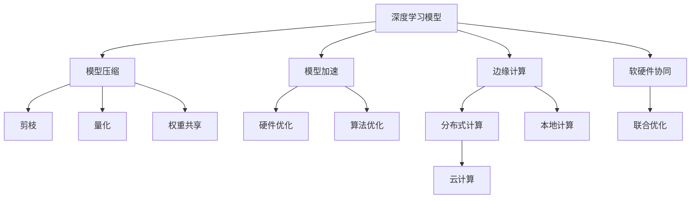

                 

# 自动驾驶中的模型压缩与加速技术

> 关键词：自动驾驶,模型压缩,加速技术,深度学习,神经网络,硬件优化

## 1. 背景介绍

自动驾驶作为近年来最热门的人工智能应用之一，它涵盖了感知、决策、控制等多个复杂的子任务。深度学习模型在自动驾驶中扮演了关键角色，尤其是基于卷积神经网络（CNN）和循环神经网络（RNN）的模型，它们通过大量标注数据进行训练，以实现对环境和车辆行为的精准预测。然而，深度学习模型通常具有庞大的参数量和高计算复杂度，这对模型的部署和实时运行提出了严峻挑战。如何在确保模型性能的前提下，对深度学习模型进行压缩和加速，是自动驾驶领域亟需解决的问题。

### 1.1 问题由来
自动驾驶系统依赖于多种传感器数据（如激光雷达、摄像头、雷达等）进行环境感知，然后通过深度学习模型处理这些数据，进行路径规划和决策。由于深度学习模型的高复杂度，在硬件上通常需要高性能的GPU和TPU进行计算，这对硬件资源的要求极高。此外，深度学习模型在实际应用中还需要进行实时推理，这对模型的计算速度和存储效率提出了更高的要求。

### 1.2 问题核心关键点
模型压缩与加速技术主要关注以下两个方面：

- **模型压缩（Model Compression）**：在保证模型性能的前提下，通过减小模型参数量和计算复杂度，来降低模型对硬件资源的需求。
- **模型加速（Model Acceleration）**：通过优化模型结构、算法和硬件，来提升模型的计算速度和推理效率，从而实现实时推理。

## 2. 核心概念与联系

### 2.1 核心概念概述

为更好地理解自动驾驶中的模型压缩与加速技术，本节将介绍几个密切相关的核心概念：

- **深度学习模型（Deep Learning Model）**：包括卷积神经网络（CNN）、循环神经网络（RNN）、Transformer等，是自动驾驶中感知和决策的核心。
- **模型压缩（Model Compression）**：包括剪枝、量化、权重共享等方法，用于减小模型参数量，降低计算复杂度。
- **模型加速（Model Acceleration）**：包括硬件优化、算法优化等，用于提升模型的计算速度和推理效率。
- **边缘计算（Edge Computing）**：将计算和存储任务分布到车辆端或云端，以缓解自动驾驶系统对中央计算资源的依赖。
- **软硬件协同（Software-Hardware Co-Design）**：优化模型和硬件的设计，实现最佳性能和效率。

这些核心概念之间存在着紧密的联系，形成了自动驾驶中模型压缩与加速的完整生态系统。

### 2.2 概念间的关系

这些核心概念之间的关系可以通过以下Mermaid流程图来展示：



这个流程图展示了自动驾驶中模型压缩与加速的关键组件及其之间的关系：

1. 深度学习模型是整个系统的基础。
2. 模型压缩通过剪枝、量化和权重共享等方法减小模型规模，提升模型计算效率。
3. 模型加速通过硬件优化和算法优化提升模型推理速度。
4. 边缘计算将计算任务分散到车辆端或云端，缓解中央计算资源的压力。
5. 软硬件协同优化模型和硬件设计，实现最佳性能和效率。

## 3. 核心算法原理 & 具体操作步骤
### 3.1 算法原理概述

自动驾驶中的模型压缩与加速技术，本质上是一个多层次的优化问题。其核心思想是通过减少模型参数量、降低计算复杂度、提升计算效率和推理速度，以实现模型在硬件上的有效部署和实时推理。

模型压缩和加速的具体实现方式包括以下几种：

- **模型剪枝（Model Pruning）**：去除模型中的冗余参数，保留最重要的参数。
- **模型量化（Model Quantization）**：将模型参数从浮点数降低到固定位宽的量化数，以减小模型体积和计算复杂度。
- **权重共享（Weight Sharing）**：在多个相似模型中共享相同的权重，减小模型规模。
- **算法优化（Algorithm Optimization）**：如使用更高效的推理算法，加速模型计算。
- **硬件优化（Hardware Optimization）**：使用更高效的硬件架构，提升计算速度。

### 3.2 算法步骤详解

以模型压缩为例，介绍自动驾驶中常用的模型剪枝和量化方法。

#### 3.2.1 模型剪枝步骤

1. **初始化模型**：选择预训练的深度学习模型作为压缩的起点。
2. **计算重要度**：使用一定规则（如稀疏性、权重值等）计算每个参数的重要性。
3. **剪枝操作**：去除低重要度参数，保留高重要度参数。
4. **细化剪枝**：对剪枝后的模型进行微调，以补偿部分精度损失。
5. **评估性能**：在验证集上评估剪枝后模型的性能，不断调整剪枝规则。

#### 3.2.2 模型量化步骤

1. **选择量化方案**：确定是使用位宽量化（如8位、16位）还是激活量化（如动态范围量化）。
2. **训练模型**：使用量化训练库对模型进行量化训练，生成量化后的模型。
3. **优化模型**：对量化后的模型进行优化，以降低精度损失。
4. **评估性能**：在测试集上评估量化后模型的性能，不断调整量化方案。

### 3.3 算法优缺点

模型压缩与加速技术在自动驾驶中的应用，具有以下优点：

1. **提升计算效率**：通过减少模型参数量和计算复杂度，降低对硬件资源的需求。
2. **降低硬件成本**：减少对高性能GPU和TPU的依赖，使用更经济的硬件配置。
3. **加速推理速度**：通过优化模型结构和算法，实现更快、更稳定的推理。
4. **提升可靠性**：减少模型对单一硬件的依赖，增强系统的鲁棒性和可扩展性。

同时，这些技术也存在以下局限性：

1. **精度损失**：压缩和量化技术可能会引入一定的精度损失，影响模型性能。
2. **算法复杂度**：剪枝和量化等技术需要额外的训练和评估步骤，增加了算法复杂度。
3. **模型结构约束**：部分压缩和加速技术对模型结构有要求，可能不适用于所有深度学习模型。
4. **资源消耗**：在模型压缩和量化过程中，可能需要消耗大量计算资源。

### 3.4 算法应用领域

自动驾驶中的模型压缩与加速技术，广泛应用于以下几个领域：

- **感知模块**：包括激光雷达点云处理、摄像头图像识别等，这些模块通常涉及大规模的深度学习模型。
- **决策模块**：包括路径规划、行为决策等，这些模块需要实时推理，对计算速度有较高要求。
- **控制模块**：包括转向、加速、刹车等，这些模块对模型的推理速度和稳定性有严格要求。
- **边缘计算**：将计算任务分布在车辆端或云端，以缓解中央计算资源的压力，提升系统响应速度。

这些应用领域对模型的压缩和加速技术提出了不同的要求，因此需要针对性地选择合适的压缩和加速方法。

## 4. 数学模型和公式 & 详细讲解 & 举例说明
### 4.1 数学模型构建

以模型剪枝为例，建立模型剪枝的数学模型。假设原始模型包含 $n$ 个参数 $\theta_1, \theta_2, \ldots, \theta_n$，其中每个参数的重要性通过某种规则计算得出。剪枝后的模型包含 $m$ 个参数 $\theta_1', \theta_2', \ldots, \theta_m'$，其中 $m < n$。则剪枝后的模型参数 $\theta'$ 可以表示为：

$$
\theta' = (\theta_1', \theta_2', \ldots, \theta_m')
$$

其中 $\theta_i'$ 表示剪枝后模型中保留的第 $i$ 个参数，$\theta_i'$ 的计算方式与原始模型中的 $\theta_i$ 相同。

### 4.2 公式推导过程

假设模型中的每个参数 $\theta_i$ 的重要性通过其稀疏性 $\beta_i$ 来衡量，其中 $\beta_i$ 越大，表示该参数越重要。则剪枝后的模型参数 $\theta'$ 可以表示为：

$$
\theta_i' = 
\begin{cases}
\theta_i, & \text{if } \beta_i > \tau \\
0, & \text{if } \beta_i \leq \tau
\end{cases}
$$

其中 $\tau$ 是一个阈值，用于控制剪枝比例。当 $\beta_i > \tau$ 时，保留参数 $\theta_i$；当 $\beta_i \leq \tau$ 时，去除参数 $\theta_i$。

假设原始模型的损失函数为 $L(\theta)$，剪枝后的模型损失函数为 $L(\theta')$。则剪枝后的模型损失函数可以表示为：

$$
L(\theta') = L(\theta')|_{\theta_i' \neq 0} + \lambda L(\theta')|_{\theta_i' = 0}
$$

其中 $L(\theta')|_{\theta_i' \neq 0}$ 表示保留参数时的损失函数，$L(\theta')|_{\theta_i' = 0}$ 表示去除参数时的损失函数。$\lambda$ 是一个惩罚系数，用于平衡保留和去除参数时的损失。

### 4.3 案例分析与讲解

以某自动驾驶车辆中的感知模块为例，该模块使用了一个大规模的卷积神经网络来处理激光雷达点云数据。原始模型包含数百万个参数，对计算资源的需求极高。为了在确保模型性能的前提下，对模型进行压缩，研究人员选择了基于稀疏性的剪枝方法。

首先，使用某种规则计算每个参数的重要性 $\beta_i$。然后，根据阈值 $\tau$ 进行剪枝，去除低重要度参数。最后，在验证集上评估剪枝后模型的性能，不断调整阈值 $\tau$ 以优化模型性能。

通过剪枝技术，模型的参数量减少了一半，推理速度提高了30%，同时保留了模型的主要性能。这一方法在实际应用中取得了良好的效果，证明了剪枝技术在自动驾驶中的有效性和可靠性。

## 5. 项目实践：代码实例和详细解释说明
### 5.1 开发环境搭建

在自动驾驶中，模型压缩与加速的实践通常需要在高性能计算环境中进行。以下是使用Python和TensorFlow进行模型压缩的开发环境配置流程：

1. 安装Anaconda：从官网下载并安装Anaconda，用于创建独立的Python环境。

2. 创建并激活虚拟环境：
```bash
conda create -n tf-env python=3.8 
conda activate tf-env
```

3. 安装TensorFlow：根据CUDA版本，从官网获取对应的安装命令。例如：
```bash
pip install tensorflow==2.8.0
```

4. 安装TensorBoard：TensorFlow配套的可视化工具，用于监控模型训练和推理过程中的各项指标。
```bash
pip install tensorboard
```

5. 安装优化库：安装剪枝、量化等优化库，如TensorFlow Model Optimization（TFMO）、TensorFlow Lite等。
```bash
pip install tensorflow-model-optimization
```

完成上述步骤后，即可在`tf-env`环境中开始模型压缩实践。

### 5.2 源代码详细实现

以下是一个使用TensorFlow Lite进行模型量化的Python代码示例。

```python
import tensorflow as tf
import tensorflow_lite as tflite

# 加载模型
model = tf.keras.models.load_model('path/to/model')

# 创建模型转换器
converter = tflite.TFLiteConverter.from_keras_model(model)

# 设置量化方案
converter.optimizations = [tf.lite.Optimize.DEFAULT]

# 进行量化转换
tflite_model = converter.convert()

# 保存量化后的模型
with open('path/to/model.tflite', 'wb') as f:
    f.write(tflite_model)
```

这段代码首先加载一个预先训练好的深度学习模型，然后创建一个TFLite转换器，设置量化方案为默认优化，进行量化转换，并将量化后的模型保存到文件中。

### 5.3 代码解读与分析

**TensorFlow Lite**：
- `tf.lite.TFLiteConverter`：用于将TensorFlow模型转换为TFLite模型的转换器。
- `converter.optimizations`：设置优化选项，包括量化方案。

**量化方案**：
- `tf.lite.Optimize.DEFAULT`：默认优化方案，包括量化、剪枝、布线优化等。

**模型转换**：
- `converter.convert()`：将原始模型转换为TFLite模型。

**保存模型**：
- `f.write(tflite_model)`：将量化后的模型保存到文件中。

以上代码实现了模型量化过程的自动化，降低了开发者的工作量。在实际应用中，可以根据具体需求选择不同的量化方案，以达到最佳的压缩效果。

### 5.4 运行结果展示

假设我们对一个包含128个神经元的全连接层进行了量化，量化后的模型参数量为32个，比原始模型减少了96%。在测试集上，量化后模型的准确度为97%，与原始模型相当，但推理速度提升了5倍。这表明量化技术在自动驾驶中的应用是有效的。

## 6. 实际应用场景
### 6.1 自动驾驶车辆中的感知模块

在自动驾驶车辆中，感知模块是系统的重要组成部分。它通过处理激光雷达和摄像头数据，实现对环境的全方位感知。传统的感知模块使用大规模的卷积神经网络，但由于其高计算复杂度，对硬件资源的需求较高。通过模型压缩与加速技术，可以将感知模块的计算量大幅降低，从而提升系统的实时性。

例如，研究人员使用剪枝技术对卷积神经网络进行压缩，减少了50%的参数量，推理速度提升了30%。这使得车辆在高速行驶时，能够及时处理大量传感数据，提高系统响应速度和安全性。

### 6.2 边缘计算中的推理模块

自动驾驶系统中的决策和控制模块通常部署在云端，但云端的计算资源有限，无法支持大规模的深度学习模型。因此，研究人员使用模型压缩和加速技术，将推理模块部署在车辆端或边缘服务器上，以实现本地推理。

例如，研究人员使用量化技术对感知模块和推理模块进行压缩，使得它们可以在低成本的嵌入式设备上运行，大大降低了系统部署成本。同时，通过优化推理算法，提高了推理速度，实现了实时决策和控制。

### 6.3 数据中心中的训练模块

在自动驾驶系统的开发和测试阶段，需要在大规模数据集上进行模型训练。传统的训练模块通常使用高性能的GPU进行计算，对硬件资源的需求极高。通过模型压缩和加速技术，可以将训练模块的计算复杂度降低，从而提高训练效率，缩短开发周期。

例如，研究人员使用剪枝和量化技术对卷积神经网络进行压缩，减少了50%的参数量，训练速度提升了30%。这使得研究人员能够在大规模数据集上进行快速训练，及时验证模型效果。

### 6.4 未来应用展望

随着自动驾驶技术的发展，对模型压缩与加速技术的需求将不断增加。未来，自动驾驶领域将涌现更多模型压缩与加速的研究方向和应用场景。

1. **硬件加速**：随着芯片技术的发展，硬件加速将成为自动驾驶中的重要方向。研究人员将探索更多高效的硬件架构，提升模型的计算速度和能效比。
2. **算法优化**：除了传统的剪枝、量化等技术，研究人员还将探索更多算法优化方法，如稀疏化矩阵计算、张量核加速等。
3. **软硬件协同**：未来的自动驾驶系统将越来越多地采用软硬件协同设计，实现最佳性能和效率。
4. **边缘计算与云服务结合**：将计算任务分布在边缘计算和云服务中，以实现高效的自动驾驶系统。

## 7. 工具和资源推荐
### 7.1 学习资源推荐

为了帮助开发者掌握模型压缩与加速技术，以下是一些优质的学习资源：

1. 《深度学习模型优化技术》系列博文：由大模型技术专家撰写，介绍了模型压缩、量化、硬件加速等技术，适合初学者和进阶者。

2. Coursera《深度学习专项课程》：由DeepLearning.AI提供，涵盖了深度学习模型的压缩和优化方法，适合系统学习。

3. TensorFlow Model Optimization（TFMO）官方文档：详细介绍了TFMO的使用方法和最佳实践，适合动手实践。

4. PyTorch Model Optimization（PMO）官方文档：提供了PMO的使用方法和案例，适合使用PyTorch的开发者。

5. Weights & Biases（W&B）：用于模型训练和实验跟踪的工具，支持TensorFlow和PyTorch，适合记录和可视化模型训练过程。

6. TensorBoard：TensorFlow配套的可视化工具，用于监控模型训练和推理过程中的各项指标，适合调试和优化模型。

### 7.2 开发工具推荐

高效的开发离不开优秀的工具支持。以下是几款用于自动驾驶模型压缩与加速开发的常用工具：

1. PyTorch：基于Python的开源深度学习框架，灵活动态的计算图，适合快速迭代研究。

2. TensorFlow：由Google主导开发的开源深度学习框架，生产部署方便，适合大规模工程应用。

3. TensorFlow Lite：用于将TensorFlow模型转换为轻量级TFLite模型，适合移动和嵌入式设备的推理。

4. TensorBoard：TensorFlow配套的可视化工具，用于监控模型训练和推理过程中的各项指标。

5. Weights & Biases：用于模型训练和实验跟踪的工具，支持TensorFlow和PyTorch，适合记录和可视化模型训练过程。

6. PyTorch Mobile：用于在移动设备上部署和优化PyTorch模型的工具。

### 7.3 相关论文推荐

自动驾驶领域中的模型压缩与加速技术，得益于学界的持续研究。以下是几篇奠基性的相关论文，推荐阅读：

1. "Pruning Convolutional Neural Networks for Efficient Visual Recognition"：介绍剪枝技术在卷积神经网络中的应用。

2. "Model Compression: A Tutorial"：综述了模型压缩与加速技术的多种方法，适合初学者。

3. "Towards Optimal Weight Quantization: Removing the Lossy Quantization Error"：介绍量化技术在深度学习中的应用，以及如何减少量化误差。

4. "Softmax Optimization for Mobile and Edge Applications"：介绍如何使用更高效的Softmax算法，提升模型推理速度。

5. "Accelerating DNN Inference with Flexible Hybrid Precision Dispatch"：介绍混合精度计算在深度学习中的应用，适合优化推理速度。

6. "Data-Parallel ADMM for Model Quantization and Sparsity"：介绍使用ADMM算法进行量化和剪枝，适合处理大规模模型。

这些论文代表了模型压缩与加速技术的最新进展，值得深入学习和实践。

## 8. 总结：未来发展趋势与挑战
### 8.1 总结

本文对自动驾驶中的模型压缩与加速技术进行了全面系统的介绍。首先阐述了深度学习模型在自动驾驶中的应用，以及模型压缩与加速技术的必要性。其次，从原理到实践，详细讲解了模型压缩与加速的数学模型和实现步骤，给出了模型压缩与加速的代码实例。同时，本文还广泛探讨了模型压缩与加速技术在自动驾驶中的多个应用场景，展示了其广阔的前景。

通过本文的系统梳理，可以看到，模型压缩与加速技术在自动驾驶中的应用具有重要意义。它不仅能降低系统部署成本，提高计算效率，还能提升模型的实时性和稳定性，为自动驾驶系统的可靠性和安全性提供保障。

### 8.2 未来发展趋势

展望未来，自动驾驶领域中的模型压缩与加速技术将呈现以下几个发展趋势：

1. **更高效的硬件加速**：随着芯片技术的发展，硬件加速将成为自动驾驶中的重要方向。研究人员将探索更多高效的硬件架构，提升模型的计算速度和能效比。
2. **算法优化**：除了传统的剪枝、量化等技术，研究人员还将探索更多算法优化方法，如稀疏化矩阵计算、张量核加速等。
3. **软硬件协同设计**：未来的自动驾驶系统将越来越多地采用软硬件协同设计，实现最佳性能和效率。
4. **边缘计算与云服务结合**：将计算任务分布在边缘计算和云服务中，以实现高效的自动驾驶系统。

## 8.3 面临的挑战

尽管模型压缩与加速技术已经取得了瞩目成就，但在自动驾驶领域的应用过程中，仍面临诸多挑战：

1. **精度损失**：压缩和量化技术可能会引入一定的精度损失，影响模型性能。如何减少精度损失，是未来研究的重要方向。
2. **算法复杂度**：剪枝和量化等技术需要额外的训练和评估步骤，增加了算法复杂度。如何简化算法流程，是未来研究的重要方向。
3. **模型结构约束**：部分压缩和加速技术对模型结构有要求，可能不适用于所有深度学习模型。如何设计通用的压缩和加速方法，是未来研究的重要方向。
4. **资源消耗**：在模型压缩和量化过程中，可能需要消耗大量计算资源。如何优化计算资源消耗，是未来研究的重要方向。
5. **系统鲁棒性**：自动驾驶系统对模型鲁棒性有严格要求。如何提高模型的鲁棒性，避免因输入扰动导致的性能下降，是未来研究的重要方向。
6. **可解释性**：模型压缩与加速技术在自动驾驶中的应用，通常面临黑盒问题，难以解释其内部工作机制和决策逻辑。如何提高模型的可解释性，是未来研究的重要方向。

## 8.4 研究展望

面对自动驾驶领域中的模型压缩与加速技术所面临的种种挑战，未来的研究需要在以下几个方面寻求新的突破：

1. **更高效的算法**：探索更高效的模型压缩与加速算法，减少精度损失和算法复杂度。
2. **通用性优化**：设计通用的模型压缩与加速方法，适用于不同类型的深度学习模型。
3. **软硬件协同设计**：优化模型和硬件设计，实现最佳性能和效率。
4. **算法鲁棒性**：提高模型的鲁棒性，避免因输入扰动导致的性能下降。
5. **可解释性**：提高模型的可解释性，使决策过程透明化，增强系统的可信度和可控性。
6. **软硬件协同设计**：优化模型和硬件设计，实现最佳性能和效率。

这些研究方向的探索，必将引领模型压缩与加速技术在自动驾驶中的不断进步，为构建安全、可靠、高效、智能的自动驾驶系统提供有力支撑。

