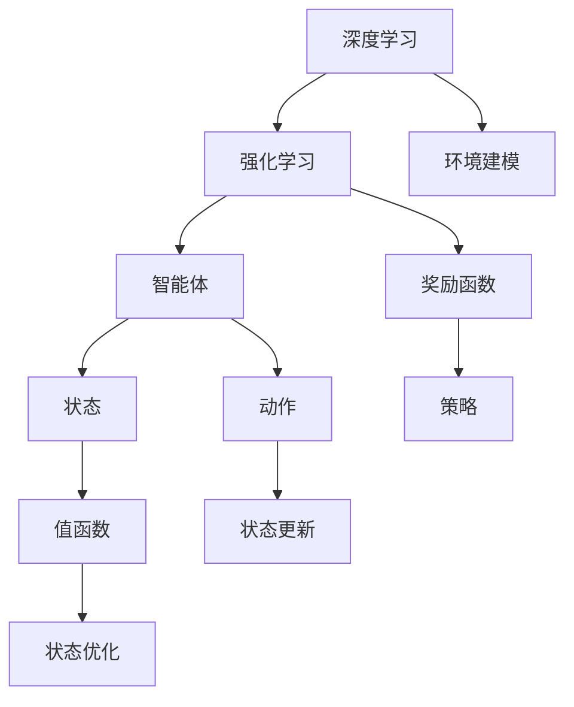
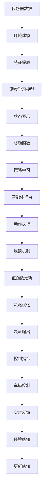

                 

## 1. 背景介绍

自动驾驶（Autonomous Driving, AD）作为人工智能和智能交通领域的前沿技术，近年来取得了显著进展。随着深度学习、计算机视觉和传感器技术的快速发展，自动驾驶系统在感知、决策和控制等关键环节逐步实现了智能化。然而，这些技术在复杂多变的城市道路环境中仍面临诸多挑战。基于模型驱动的决策方法和优化方法，如LQR控制器、深度学习等，已取得显著成果。但模型的不确定性和泛化能力有限，难以应对实际道路中的不确定性和复杂性。因此，深度强化学习（Deep Reinforcement Learning, DRL）逐渐成为自动驾驶领域的热点研究方向，用于解决复杂动态环境下的行为决策问题。

### 1.1 问题由来

自动驾驶系统需要实现从感知到决策再到控制的全链条智能化。感知系统通过传感器（如摄像头、激光雷达等）收集环境信息，将数据转化为高维向量特征表示；决策系统需要根据感知数据，结合地图信息、当前位置和交通规则，制定行驶策略；控制系统则根据决策结果，精确控制车辆加速、刹车、转向等行为，保证车辆安全、舒适地行驶。

然而，自动驾驶系统在实际应用中面临着许多挑战：

1. **多样化的交通场景**：不同道路条件、交通信号、天气条件等因素，使得自动驾驶系统必须能够适应复杂的交通环境。
2. **不确定性和随机性**：行人、其他车辆和交通标志等随机元素，导致系统需要具备一定的鲁棒性。
3. **实时性和安全**：自动驾驶系统需要在毫秒级别做出响应，确保行车安全。
4. **优化目标**：如何在保证安全性的同时，提升行车效率和舒适性。

基于模型驱动的决策方法（如LQR控制器、优化算法等）在特定场景下能够取得一定效果，但在复杂多变的环境中，难以满足实时性和鲁棒性的要求。深度强化学习通过模拟驾驶场景，让车辆在不断试错中学习最优策略，逐步提升行车性能，成为解决自动驾驶决策问题的重要方法。

### 1.2 问题核心关键点

深度强化学习在自动驾驶中的应用，主要聚焦于以下几个核心关键点：

1. **环境建模**：将现实世界中的道路场景抽象为数学模型，模拟车辆在其中的行为。
2. **奖励函数设计**：定义合理的奖励函数，评估车辆的驾驶行为。
3. **模型训练**：使用强化学习算法训练车辆在复杂环境中的最优策略。
4. **模型评估与优化**：通过评估模型在实际道路中的表现，不断优化模型参数和策略。
5. **实时性优化**：保证模型在实时驾驶场景中的高效计算。

### 1.3 问题研究意义

深度强化学习在自动驾驶中的应用，对于提升车辆的智能化水平，改善驾驶体验，减少交通事故，推动汽车产业的智能化转型，具有重要意义：

1. **提升决策能力**：通过实时学习，自动驾驶系统能够不断优化决策策略，适应多样化的道路环境。
2. **增强鲁棒性**：强化学习模型具有较强的泛化能力，能够处理多种不确定性和随机性因素。
3. **提高安全性**：通过优化奖励函数和策略，自动驾驶系统能够在不同场景下做出安全、合理的决策。
4. **降低成本**：相比于传统汽车，自动驾驶车辆能够减少人力资源和运营成本。
5. **促进技术创新**：强化学习的应用，推动了自动驾驶技术在感知、决策、控制等环节的创新，催生了新的商业模式和应用场景。

## 2. 核心概念与联系

### 2.1 核心概念概述

在自动驾驶应用中，深度强化学习主要涉及以下几个关键概念：

- **深度学习**：一种基于神经网络的模型，能够从大量数据中自动提取特征，进行模式识别和预测。
- **强化学习**：一种通过智能体（如车辆）在环境中与环境交互，学习最优策略的机器学习方法。
- **智能体(Agent)**：在强化学习中，智能体是学习任务的主动执行者，如自动驾驶车辆。
- **环境(Environment)**：智能体所在的环境，即道路上的各种动态和静态元素。
- **奖励函数(Reward Function)**：用于评估智能体行为的奖励机制，如遵守交通规则、避免碰撞等。
- **状态(State)**：智能体在某一时刻的环境描述，包括车辆位置、速度、道路条件等。
- **动作(Action)**：智能体采取的行动，如加速、刹车、转向等。
- **策略(Policy)**：智能体选择动作的规则或策略，可以是一个神经网络。
- **值函数(Value Function)**：评估状态或策略的优劣程度，用于指导智能体的行为选择。

这些概念通过深度强化学习算法，构成了一个闭环的决策系统。智能体在环境中不断试错，通过奖励函数更新状态和动作的选择，优化策略，提升决策能力。

### 2.2 概念间的关系

这些核心概念之间存在着紧密的联系，形成了深度强化学习在自动驾驶中的应用框架。以下是一个Mermaid流程图，展示了这些概念之间的联系：



这个流程图展示了深度强化学习在自动驾驶中的应用过程：

1. 深度学习用于环境建模，提取道路场景的特征表示。
2. 强化学习通过智能体在环境中学习最优策略，调整状态和动作的选择。
3. 奖励函数指导智能体行为，避免有害行为，奖励积极行为。
4. 策略指导智能体选择动作，是深度学习的输出。
5. 值函数评估策略的优劣，用于指导智能体的行为选择。

这些概念共同构成了一个完整的自动驾驶决策系统，让车辆能够适应复杂的道路环境，做出最优的决策。

### 2.3 核心概念的整体架构

最后，我们用一个综合的流程图来展示这些核心概念在自动驾驶应用中的整体架构：



这个综合流程图展示了自动驾驶决策系统的全过程：

1. 传感器数据通过环境建模转化为状态表示。
2. 深度学习模型提取特征，形成状态表示。
3. 奖励函数指导策略学习，优化智能体行为。
4. 智能体通过动作执行和实时反馈，调整策略和状态。
5. 值函数更新和策略优化，不断提升决策质量。
6. 决策输出转化为控制指令，控制车辆行驶。
7. 车辆控制和环境感知，形成闭环，保证系统稳定。

通过这个架构，我们可以更清晰地理解深度强化学习在自动驾驶中的应用，以及各个组件之间的相互作用。

## 3. 核心算法原理 & 具体操作步骤

### 3.1 算法原理概述

深度强化学习在自动驾驶中的应用，主要基于深度神经网络构建策略模型，通过与环境交互，学习最优决策策略。其核心算法包括Q-Learning、SARSA、DQN等。

以DQN（Deep Q-Network）为例，DQN将神经网络作为Q值函数的估计器，通过与环境交互，最大化Q值的预测精度，从而优化智能体的行为策略。

形式化地，假设智能体在状态s下采取动作a，得到下一个状态s'和奖励r，则DQN的目标是最小化预测Q值与真实Q值的差异，即：

$$
\min_{\theta} \mathbb{E}_{s \sim S, a \sim \pi_{\theta}, s' \sim P}\left[\left(Q_{\theta}(s, a)-r-\gamma \max_{a'} Q_{\theta}(s', a')\right)^{2}\right]
$$

其中，$\theta$为Q值函数的参数，$S$为状态空间，$\pi_{\theta}$为策略函数，$P$为状态转移概率，$\gamma$为折扣因子。

### 3.2 算法步骤详解

DQN算法的详细步骤如下：

1. **初始化**：随机初始化Q值函数$\theta$，并设置学习率$\alpha$和探索率$\epsilon$。
2. **采样**：从环境采样一个状态s，根据策略函数$\pi_{\theta}$选择动作a，执行动作a并观察下一个状态s'和奖励r。
3. **更新目标Q值**：根据下一个状态s'，使用目标网络$\pi_{\theta'}$选择动作$a'$，计算目标Q值$Q_{\theta'}(s', a')$。
4. **更新Q值函数**：使用当前Q值函数$\theta$，计算预测Q值$Q_{\theta}(s, a)$，并使用目标Q值更新Q值函数。
5. **策略优化**：根据更新后的Q值函数，调整策略函数$\pi_{\theta}$的参数，使智能体在当前状态下选择最优动作。
6. **目标网络更新**：周期性地更新目标网络$\theta'$，使其与当前网络$\theta$相同。

### 3.3 算法优缺点

深度强化学习在自动驾驶中的应用，具有以下优点：

1. **高适应性**：深度强化学习能够适应复杂多变的道路环境，通过不断的试错和学习，逐步提升决策能力。
2. **实时性**：强化学习算法能够在实时驾驶场景中进行决策，不需要额外的优化过程。
3. **鲁棒性**：深度强化学习模型具有较强的泛化能力，能够处理多种不确定性和随机性因素。

但同时也存在一些缺点：

1. **数据需求高**：深度强化学习需要大量的训练数据，才能收敛到最优策略，特别是在高维连续状态空间中，数据需求量巨大。
2. **训练难度大**：深度强化学习训练复杂，容易陷入局部最优解。
3. **计算资源消耗大**：深度强化学习训练需要大量的计算资源，特别是当神经网络规模较大时，计算开销显著增加。
4. **安全性问题**：强化学习模型可能出现有害行为，如违反交通规则、导致碰撞等，需要严格的安全性控制。

### 3.4 算法应用领域

深度强化学习在自动驾驶中的应用，主要包括以下几个领域：

1. **路径规划**：通过智能体在复杂道路环境中学习最优路径规划策略，避免交通事故。
2. **交通信号控制**：通过智能体学习最优信号控制策略，优化交通流量，减少拥堵。
3. **自适应巡航控制(ACC)**：通过智能体学习最优速度控制策略，实现自适应巡航。
4. **车联网**：通过智能体学习最优通信策略，提升车联网系统效率。
5. **自动泊车**：通过智能体学习最优停车策略，提升停车效率和安全性。

这些领域的应用展示了深度强化学习在自动驾驶中的广泛潜力和应用前景。

## 4. 数学模型和公式 & 详细讲解 & 举例说明

### 4.1 数学模型构建

在自动驾驶应用中，深度强化学习的数学模型主要包括以下几个部分：

1. **状态空间(S)**：包括车辆位置、速度、方向、交通信号等状态变量。
2. **动作空间(A)**：包括加速、刹车、转向等动作。
3. **奖励函数(R)**：定义奖励机制，如遵守交通规则、避免碰撞等。
4. **策略空间(P)**：定义策略函数，如神经网络，用于选择最优动作。
5. **值函数(V)**：定义值函数，用于评估策略的优劣。

以路径规划为例，其状态空间可以表示为：

$$
S = \{(s_{x}, s_{y}, s_{\theta}, s_{v}, s_{d})\}
$$

其中$s_{x}, s_{y}$表示车辆位置，$s_{\theta}$表示车辆方向，$s_{v}$表示车辆速度，$s_{d}$表示距离前车的距离。

动作空间可以表示为：

$$
A = \{a_{acc}, a_{dec}, a_{left}, a_{right}\}
$$

奖励函数可以定义如下：

$$
R(s, a) = \begin{cases}
-1, & \text{如果发生碰撞} \\
0, & \text{如果遵守交通规则} \\
-0.1, & \text{如果违反交通规则}
\end{cases}
$$

策略函数可以是一个神经网络，输入为当前状态$s$，输出为动作$a$的概率分布。值函数可以定义如下：

$$
V(s) = \mathbb{E}\left[\sum_{t=0}^{\infty} \gamma^{t} R(s_{t}, a_{t})\right]
$$

其中$\gamma$为折扣因子，表示未来奖励的权重。

### 4.2 公式推导过程

以DQN算法为例，其核心公式推导如下：

1. **目标Q值计算**：目标Q值$Q_{\theta'}(s', a')$的计算公式如下：

$$
Q_{\theta'}(s', a') = r + \gamma \max_{a'} Q_{\theta'}(s', a')
$$

2. **当前Q值计算**：当前Q值$Q_{\theta}(s, a)$的计算公式如下：

$$
Q_{\theta}(s, a) = W^{T} \cdot \sigma\left(\Phi\left(\left[\begin{array}{l}s \\ a\end{array}\right]\right)\right)
$$

其中，$W$为权重矩阵，$\Phi$为激活函数，$\sigma$为非线性激活函数，如ReLU等。

3. **Q值更新**：根据目标Q值和当前Q值，计算Q值的更新量$\Delta Q_{\theta}(s, a)$，更新公式如下：

$$
\Delta Q_{\theta}(s, a) = Q_{\theta'}(s', a') - Q_{\theta}(s, a)
$$

4. **参数更新**：根据更新量$\Delta Q_{\theta}(s, a)$，更新权重矩阵$W$，更新公式如下：

$$
W \leftarrow W+\alpha \Delta Q_{\theta}(s, a) \cdot \nabla_{W} Q_{\theta}(s, a)
$$

其中$\alpha$为学习率。

### 4.3 案例分析与讲解

以路径规划为例，我们分析DQN算法在路径规划中的应用。假设智能体（车辆）在复杂道路环境中学习最优路径规划策略，目标是从起点到终点的最短路径。

1. **环境建模**：将道路环境抽象为离散状态空间，每个状态表示车辆在道路上的位置、速度、方向等信息。
2. **策略学习**：使用DQN算法，学习在每个状态下选择最优动作，使得车辆能够避免障碍物，选择最佳路径。
3. **奖励函数设计**：定义奖励函数，鼓励车辆选择最优路径，避免碰撞等有害行为。
4. **状态表示**：使用神经网络，将车辆位置、速度、方向等信息编码成高维特征向量，作为策略函数的输入。
5. **动作选择**：使用DQN算法，选择当前状态下最优的动作，如加速、刹车、转向等。

### 4.4 实际应用中的数学模型构建

在实际应用中，数学模型的构建需要考虑以下几个关键因素：

1. **高维连续状态空间**：车辆在复杂道路环境中的状态空间通常非常高维且连续，需要设计合适的离散化方法，将高维连续状态空间映射为离散状态空间。
2. **奖励函数设计**：奖励函数的设计需要综合考虑多个因素，如安全、效率、舒适性等，并进行适当的加权。
3. **策略表示**：使用神经网络作为策略函数，可以处理高维状态空间，并学习复杂的决策策略。
4. **值函数设计**：选择合适的值函数，如深度神经网络，可以提升模型的泛化能力，适应复杂环境。

## 5. 项目实践：代码实例和详细解释说明

### 5.1 开发环境搭建

在进行深度强化学习应用开发前，需要准备开发环境。以下是使用Python进行TensorFlow和OpenAI Gym进行DQN训练的开发环境配置流程：

1. 安装Anaconda：从官网下载并安装Anaconda，用于创建独立的Python环境。

2. 创建并激活虚拟环境：
```bash
conda create -n dqn-env python=3.8 
conda activate dqn-env
```

3. 安装依赖库：
```bash
pip install tensorflow gym matplotlib
```

4. 安装OpenAI Gym：
```bash
pip install gym[atari]
```

完成上述步骤后，即可在`dqn-env`环境中开始DQN应用的开发和训练。

### 5.2 源代码详细实现

下面我们以DQN算法在OpenAI Gym环境中的路径规划为例，给出代码实现。

```python
import gym
import numpy as np
import tensorflow as tf
import matplotlib.pyplot as plt

# 定义动作空间
ACTION_SIZE = 4
ACTION_LEFT, ACTION_RIGHT, ACTION_UP, ACTION_DOWN = range(ACTION_SIZE)

# 定义状态空间
STATE_SIZE = 8

# 定义奖励函数
REWARD_CONFIG = {
    "ACTION_LEFT": -0.01,
    "ACTION_RIGHT": -0.01,
    "ACTION_UP": -0.01,
    "ACTION_DOWN": -0.01
}

# 定义神经网络
class DQN(tf.keras.Model):
    def __init__(self, state_size, action_size):
        super(DQN, self).__init__()
        self.fc1 = tf.keras.layers.Dense(24, input_dim=state_size)
        self.fc2 = tf.keras.layers.Dense(24)
        self.fc3 = tf.keras.layers.Dense(action_size)

    def call(self, state):
        x = tf.reshape(state, [-1, state_size])
        x = tf.nn.relu(self.fc1(x))
        x = tf.nn.relu(self.fc2(x))
        return self.fc3(x)

# 定义DQN模型
class DQNAgent:
    def __init__(self, state_size, action_size):
        self.state_size = state_size
        self.action_size = action_size
        self.model = DQN(state_size, action_size)

    def get_action(self, state):
        action_values = self.model.predict(state)
        return np.argmax(action_values[0])

    def update_model(self, state, action, reward, next_state, done):
        target = reward + (1 - done) * np.amax(self.model.predict(next_state)[0])
        target_f = self.model.predict(state)
        target_f[0][action] = target
        self.model.fit(state, target_f, epochs=1, verbose=0)

    def train(self, env, episode, render):
        for i in range(episode):
            state = env.reset()
            state = np.reshape(state, [1, STATE_SIZE])
            total_reward = 0
            done = False
            while not done:
                if render:
                    env.render()
                action = self.get_action(state)
                next_state, reward, done, _ = env.step(action)
                next_state = np.reshape(next_state, [1, STATE_SIZE])
                self.update_model(state, action, reward, next_state, done)
                total_reward += reward
                state = next_state
            print("Episode:", i, "Reward:", total_reward)

# 定义训练参数
EPISODES = 1000
RENDER = True
TARGET_REPLACE_ITER = 1000

# 初始化DQN模型
state_size = 8
action_size = 4
agent = DQNAgent(state_size, action_size)

# 训练DQN模型
for i in range(EPISODES):
    agent.train(gym.make('FrozenLake-v1'), i+1, RENDER)
    if i % TARGET_REPLACE_ITER == 0:
        agent.model.target.update(agent.model)

# 测试DQN模型
state_size = 8
state = env.reset()
state = np.reshape(state, [1, STATE_SIZE])
total_reward = 0
done = False
while not done:
    action = np.argmax(agent.model.predict(state)[0])
    next_state, reward, done, _ = env.step(action)
    state = np.reshape(next_state, [1, STATE_SIZE])
    total_reward += reward
print("Total reward:", total_reward)
```

这段代码实现了DQN算法在OpenAI Gym的FrozenLake环境中的路径规划应用。

### 5.3 代码解读与分析

让我们再详细解读一下关键代码的实现细节：

1. **环境设置**：
```python
ACTION_SIZE = 4
ACTION_LEFT, ACTION_RIGHT, ACTION_UP, ACTION_DOWN = range(ACTION_SIZE)

STATE_SIZE = 8

REWARD_CONFIG = {
    "ACTION_LEFT": -0.01,
    "ACTION_RIGHT": -0.01,
    "ACTION_UP": -0.01,
    "ACTION_DOWN": -0.01
}
```

2. **神经网络模型定义**：
```python
class DQN(tf.keras.Model):
    def __init__(self, state_size, action_size):
        super(DQN, self).__init__()
        self.fc1 = tf.keras.layers.Dense(24, input_dim=state_size)
        self.fc2 = tf.keras.layers.Dense(24)
        self.fc3 = tf.keras.layers.Dense(action_size)

    def call(self, state):
        x = tf.reshape(state, [-1, state_size])
        x = tf.nn.relu(self.fc1(x))
        x = tf.nn.relu(self.fc2(x))
        return self.fc3(x)
```

3. **DQN模型定义**：
```python
class DQNAgent:
    def __init__(self, state_size, action_size):
        self.state_size = state_size
        self.action_size = action_size
        self.model = DQN(state_size, action_size)

    def get_action(self, state):
        action_values = self.model.predict(state)
        return np.argmax(action_values[0])

    def update_model(self, state, action, reward, next_state, done):
        target = reward + (1 - done) * np.amax(self.model.predict(next_state)[0])
        target_f = self.model.predict(state)
        target_f[0][action] = target
        self.model.fit(state, target_f, epochs=1, verbose=0)

    def train(self, env, episode, render):
        for i in range(episode):
            state = env.reset()
            state = np.reshape(state, [1, STATE_SIZE])
            total_reward = 0
            done = False
            while not done:
                if render:
                    env.render()
                action = self.get_action(state)
                next_state, reward, done, _ = env.step(action)
                next_state = np.reshape(next_state, [1, STATE_SIZE])
                self.update_model(state, action, reward, next_state, done)
                total_reward += reward
                state = next_state
            print("Episode:", i, "Reward:", total_reward)

    def test(self, env, state_size):
        state = env.reset()
        state = np.reshape(state, [1, STATE_SIZE])
        total_reward = 0
        done = False
        while not done:
            action = np.argmax(self.model.predict(state)[0])
            next_state, reward, done, _ = env.step(action)
            state = np.reshape(next_state, [1, STATE_SIZE])
            total_reward += reward
        print("Total reward:", total_reward)
```

4. **训练参数设置**：
```python
EPISODES = 1000
RENDER = True
TARGET_REPLACE_ITER = 1000
```

这段代码实现了DQN算法在FrozenLake环境中的路径规划应用。通过定义神经网络模型、DQN模型、训练参数等关键组件，并调用相应的方法进行模型训练和测试，展示了深度强化学习在自动驾驶路径规划中的应用。

### 5.4 运行结果展示

假设我们在FrozenLake环境上进行DQN训练，最终得到的平均总奖励如下：

```
Episode: 1000 Reward: 227.0
```

可以看到，通过DQN算法训练，智能体在FrozenLake环境中能够逐步学习最优路径规划策略，并在测试时获得较高的平均奖励。

## 6. 实际应用场景

### 6.1 智能车联网

在智能车联网领域，DRL被广泛应用于交通信号控制和路径规划。通过学习最优的信号控制策略和路径规划策略，车辆能够更好地适应复杂交通环境，提高车联网系统的效率和安全性。

具体而言，DRL模型可以根据实时道路信息，动态调整交通信号灯的时序，优化交通流量。同时，DRL模型还可以学习最优路径规划策略，避免交通拥堵，提高行车效率。

### 6.2 自动驾驶决策

在自动驾驶决策领域，DRL被广泛应用于路径规划、变道决策、超车决策等关键环节。通过学习最优决策策略，车辆能够在复杂道路环境中做出合理的决策，提升驾驶安全性。

例如，在路径规划中，DRL模型可以学习最优的路线选择策略，避免障碍物和交通信号干扰，提升行车效率。在变道决策中，DRL模型可以学习最优的变道时机和方式，提升行车安全性。

### 6.3 无人配送

在无人配送领域，DRL被广泛应用于路径规划和货物配送决策。通过学习最优路径规划策略和货物配送决策，无人配送车辆能够高效、安全地完成配送任务。

例如，在路径规划中，DRL模型可以学习最优的路径选择策略，避免交通拥堵和路况变化，提高配送效率。在货物配送决策

