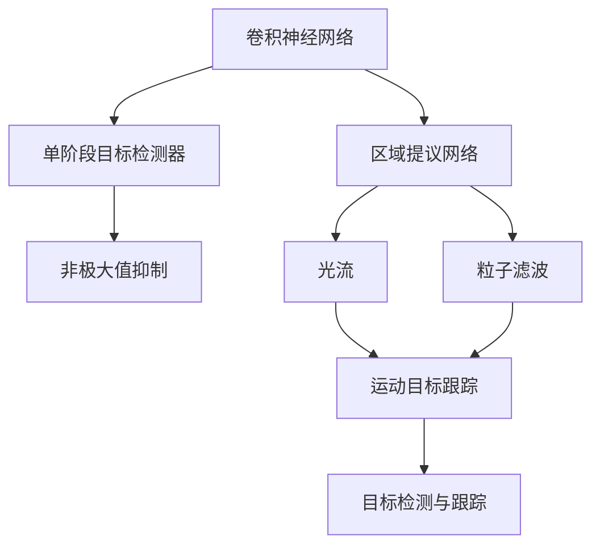
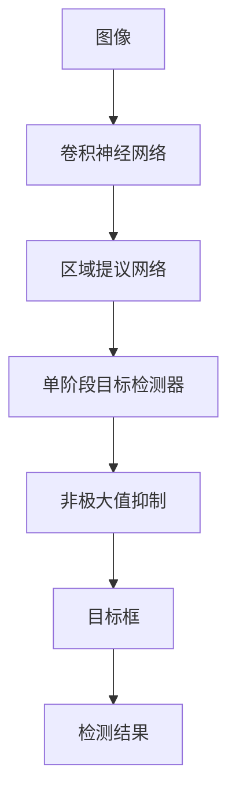
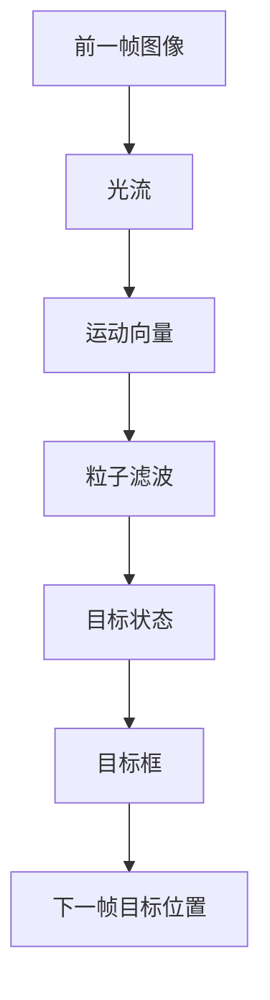
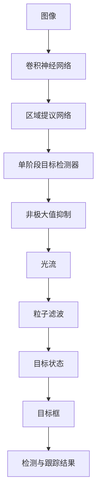
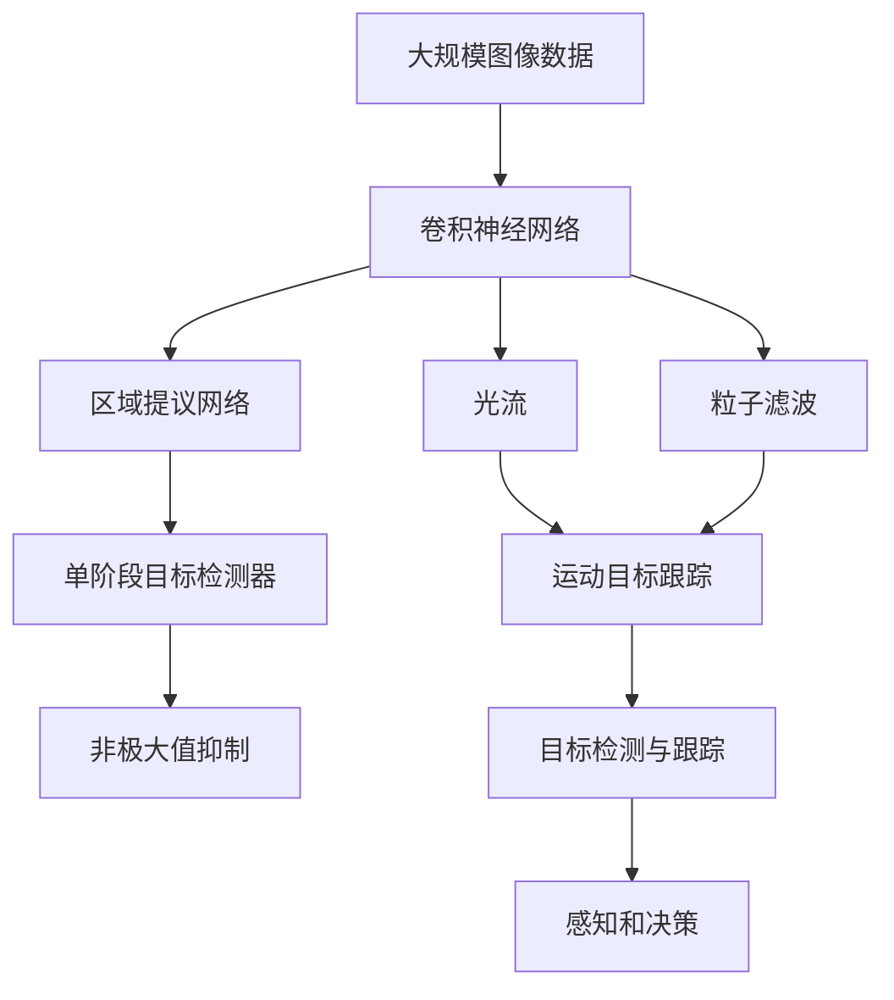

                 

# 自动驾驶中的视觉目标检测与跟踪算法创新

## 1. 背景介绍

### 1.1 问题由来
随着自动驾驶技术的发展，视觉目标检测与跟踪（Object Detection and Tracking, ODT）成为关键技术之一。它不仅帮助车辆感知周围环境中的动态目标，如行人、车辆、交通信号等，还能够在复杂多变的实时场景中，稳定地跟踪这些目标的动态变化。然而，传统基于手工设计特征的ODT算法，如Haar特征、SIFT、HOG等，面临着算法复杂度高、计算量大、鲁棒性差等问题，难以满足自动驾驶的高实时性要求。因此，借助深度学习技术，开发高效的视觉目标检测与跟踪算法，成为现代自动驾驶的核心挑战。

### 1.2 问题核心关键点
自动驾驶中的视觉目标检测与跟踪算法，旨在解决车辆如何高效、准确地感知和跟踪环境中的动态目标。其核心关键点在于：
- 算法复杂度：需要高效、快速的检测和跟踪算法，以适应自动驾驶的高实时性要求。
- 准确性：必须准确地识别和定位目标，确保决策的可靠性。
- 鲁棒性：在复杂、多变的场景中，算法能够稳健地工作，如多目标遮挡、光照变化、视角变化等情况。
- 可扩展性：算法应具有良好的可扩展性，能够应对不同尺度的目标检测和跟踪。
- 可解释性：算法的决策过程需具有可解释性，便于调试和优化。

这些关键点决定了自动驾驶中ODT算法的设计和应用。为了满足这些要求，深度学习技术，尤其是卷积神经网络（Convolutional Neural Networks, CNNs）被广泛应用于ODT算法的设计和优化。

### 1.3 问题研究意义
研究自动驾驶中的视觉目标检测与跟踪算法，对于提升自动驾驶系统的感知和决策能力，保障行车安全具有重要意义：

1. **提升感知能力**：通过高效、准确的ODT算法，自动驾驶车辆可以更全面、更深入地感知周围环境，提高环境的感知和理解能力。
2. **增强决策可靠性**：准确的目标检测与跟踪，有助于提升车辆行驶的决策可靠性，减少误判和漏检，保障行车安全。
3. **降低能耗和延迟**：高效的ODT算法可以显著降低计算复杂度，减少能耗和延迟，满足自动驾驶系统的高实时性需求。
4. **促进智能化**：自动驾驶技术的智能化升级，离不开先进的ODT算法作为基石，为其提供可靠的环境感知数据。
5. **拓展应用场景**：优化后的ODT算法，可以拓展应用到更广泛的环境感知和智能交互场景，如无人仓库、智能交通等。

## 2. 核心概念与联系

### 2.1 核心概念概述

为更好地理解自动驾驶中的视觉目标检测与跟踪算法，本节将介绍几个密切相关的核心概念：

- **卷积神经网络（CNN）**：一种专门用于图像处理的深度神经网络，通过卷积、池化等操作，从输入图像中提取特征，并用于目标检测和分类等任务。
- **区域提议网络（Region Proposal Network, RPN）**：一种用于目标检测的算法，通过滑动窗口的方式，在图像上生成目标候选框，供后续检测器使用。
- **单阶段目标检测器（Single-stage Object Detector）**：与两阶段目标检测器（如Faster R-CNN）不同，单阶段目标检测器将目标检测和候选框生成合并为一个网络，提高了检测速度。
- **锚框（Anchor Box）**：在目标检测中，用于生成候选框的一种策略，通过设定不同尺度和长宽比，覆盖不同大小的潜在目标。
- **非极大值抑制（Non-Maximum Suppression, NMS）**：一种常用的目标检测后处理技术，用于去除候选框的重叠，保留得分最高的候选框。
- **光流（Optical Flow）**：一种用于运动目标跟踪的算法，通过计算帧间像素的位移，跟踪目标的运动轨迹。
- **粒子滤波（Particle Filter）**：一种基于贝叶斯滤波的运动目标跟踪算法，通过采样和重采样，估计目标的动态状态。

这些核心概念之间的逻辑关系可以通过以下Mermaid流程图来展示：



这个流程图展示了大语言模型微调过程中各个核心概念的关系：

1. **卷积神经网络**作为特征提取器，从图像中提取高层次的特征。
2. **区域提议网络**生成目标候选框，供单阶段目标检测器使用。
3. **单阶段目标检测器**在候选框上进行检测，生成目标框和分类得分。
4. **非极大值抑制**去除候选框的重叠，保留得分最高的候选框。
5. **光流**和**粒子滤波**用于运动目标的跟踪，通过预测目标的下一帧位置，实现长时间跨度的目标跟踪。
6. **目标检测与跟踪**结合以上技术，实现对目标的高效检测和稳定跟踪。

### 2.2 概念间的关系

这些核心概念之间存在着紧密的联系，形成了自动驾驶中ODT算法的完整生态系统。下面我们通过几个Mermaid流程图来展示这些概念之间的关系。

#### 2.2.1 目标检测流程



这个流程图展示了目标检测的基本流程：

1. **图像**输入卷积神经网络，提取特征。
2. **区域提议网络**生成目标候选框。
3. **单阶段目标检测器**在候选框上进行检测，生成目标框和分类得分。
4. **非极大值抑制**去除候选框的重叠，保留得分最高的候选框。
5. **目标框**作为检测结果，用于后续跟踪或决策。

#### 2.2.2 运动目标跟踪流程



这个流程图展示了运动目标跟踪的基本流程：

1. **前一帧图像**输入光流算法，计算运动向量。
2. **粒子滤波**根据运动向量，估计目标的动态状态。
3. **目标状态**用于生成下一帧的目标位置预测。
4. **目标框**根据预测位置，生成下一帧的目标位置。

#### 2.2.3 目标检测与跟踪结合流程



这个流程图展示了目标检测与跟踪结合的流程：

1. **图像**输入卷积神经网络，提取特征。
2. **区域提议网络**生成目标候选框。
3. **单阶段目标检测器**在候选框上进行检测，生成目标框和分类得分。
4. **非极大值抑制**去除候选框的重叠，保留得分最高的候选框。
5. **光流**和**粒子滤波**用于运动目标的跟踪，预测目标的下一帧位置。
6. **目标框**和**目标状态**结合，实现对目标的稳定跟踪。
7. **检测与跟踪结果**用于后续决策和规划。

### 2.3 核心概念的整体架构

最后，我们用一个综合的流程图来展示这些核心概念在大语言模型微调过程中的整体架构：



这个综合流程图展示了从图像处理到目标检测与跟踪的完整过程。卷积神经网络首先对图像进行特征提取，区域提议网络生成目标候选框，单阶段目标检测器进行检测和分类，非极大值抑制去除候选框的重叠。同时，光流和粒子滤波用于运动目标的跟踪，目标检测与跟踪的结果用于感知和决策。通过这些核心概念的协同工作，自动驾驶车辆能够高效、准确地感知和跟踪环境中的动态目标，为后续的决策和控制提供可靠的数据支持。

## 3. 核心算法原理 & 具体操作步骤
### 3.1 算法原理概述

自动驾驶中的视觉目标检测与跟踪算法，本质上是一个基于深度学习的计算机视觉问题。其核心思想是：通过卷积神经网络提取图像特征，然后结合目标检测和运动跟踪算法，实现对环境动态目标的高效感知和稳定跟踪。

形式化地，假设输入为图像 $I$，输出为检测到的目标框 $B$ 和分类得分 $S$，运动目标跟踪的结果为目标的状态 $X$。则目标检测与跟踪的总体目标是最小化以下损失函数：

$$
L = \min_{B,S,X} \mathcal{L}_{detection}(B,S) + \mathcal{L}_{tracking}(X)
$$

其中，$\mathcal{L}_{detection}$ 为检测损失函数，$\mathcal{L}_{tracking}$ 为跟踪损失函数。常见的检测损失函数包括交叉熵损失、平滑L1损失等，常见的跟踪损失函数包括均方误差损失、IOU损失等。

### 3.2 算法步骤详解

自动驾驶中的视觉目标检测与跟踪算法一般包括以下几个关键步骤：

**Step 1: 准备数据集**
- 收集自动驾驶场景中的图像数据，标注目标框和分类信息，构建训练集、验证集和测试集。
- 收集运动目标的轨迹信息，构建跟踪数据集。

**Step 2: 设计模型架构**
- 选择合适的卷积神经网络架构，如YOLO、SSD、Faster R-CNN等，进行目标检测。
- 结合光流和粒子滤波等算法，设计运动目标跟踪模型。

**Step 3: 设置超参数**
- 选择合适的优化器（如Adam、SGD等）及其参数，设置学习率、批大小、迭代轮数等。
- 设置正则化技术及强度，包括权重衰减、Dropout、Early Stopping等。
- 确定冻结卷积神经网络参数的策略，如仅微调顶层，或全部参数都参与微调。

**Step 4: 训练检测模型**
- 将训练集数据分批次输入模型，前向传播计算损失函数。
- 反向传播计算参数梯度，根据设定的优化算法和学习率更新模型参数。
- 周期性在验证集上评估模型性能，根据性能指标决定是否触发 Early Stopping。
- 重复上述步骤直到满足预设的迭代轮数或 Early Stopping 条件。

**Step 5: 训练跟踪模型**
- 将训练集和验证集数据分批次输入模型，前向传播计算损失函数。
- 反向传播计算参数梯度，根据设定的优化算法和学习率更新模型参数。
- 周期性在验证集上评估模型性能，根据性能指标决定是否触发 Early Stopping。
- 重复上述步骤直到满足预设的迭代轮数或 Early Stopping 条件。

**Step 6: 集成检测与跟踪**
- 将检测模型和跟踪模型的结果集成，实现对目标的稳定跟踪。
- 在测试集上评估集成后的模型性能，对比检测和跟踪的精度和鲁棒性。

以上是自动驾驶中ODT算法的一般流程。在实际应用中，还需要针对具体场景进行优化设计，如改进训练目标函数，引入更多的正则化技术，搜索最优的超参数组合等，以进一步提升模型性能。

### 3.3 算法优缺点

自动驾驶中的视觉目标检测与跟踪算法具有以下优点：
1. **高准确性**：深度学习模型能够高效、准确地检测和分类目标，避免了传统手工特征检测的误差。
2. **实时性**：单阶段目标检测器等高效算法能够显著降低计算复杂度，满足自动驾驶系统的高实时性要求。
3. **鲁棒性**：卷积神经网络和高性能跟踪算法，能够应对多目标遮挡、光照变化、视角变化等情况，提高鲁棒性。
4. **可扩展性**：卷积神经网络具有较强的可扩展性，能够覆盖不同尺度和类型的目标。
5. **可解释性**：通过分析卷积神经网络中的特征图，可以理解目标检测的决策过程，便于调试和优化。

同时，该算法也存在一定的局限性：
1. **数据需求高**：深度学习模型需要大量的标注数据进行训练，数据获取成本较高。
2. **过拟合风险**：深度学习模型容易过拟合，尤其是在标注数据不足的情况下。
3. **计算资源消耗大**：卷积神经网络和粒子滤波等算法，需要较大的计算资源，可能面临硬件瓶颈。
4. **模型复杂度高**：深度学习模型复杂度较高，可能难以解释，导致调试困难。

尽管存在这些局限性，但就目前而言，深度学习技术仍是大语言模型微调应用的最主流范式。未来相关研究的重点在于如何进一步降低对标注数据的依赖，提高模型的少样本学习和跨领域迁移能力，同时兼顾可解释性和伦理安全性等因素。

### 3.4 算法应用领域

自动驾驶中的视觉目标检测与跟踪算法，已经在多个领域得到广泛应用，例如：

- **自动驾驶**：用于检测和跟踪道路上的动态目标，如行人、车辆、交通信号灯等，提升自动驾驶车辆的安全性和可靠性。
- **智能交通**：用于监测交通流量、违规行为，优化交通管理，提高道路通行效率。
- **工业自动化**：用于检测和跟踪生产过程中的动态目标，如机器人、设备等，实现智能监控和预警。
- **安全监控**：用于检测和跟踪人员、车辆等目标，提高公共安全监控的智能化水平。
- **无人机**：用于检测和跟踪空中动态目标，实现无人机的高精度导航和避障。

除了上述这些应用外，自动驾驶中的视觉目标检测与跟踪算法，还在无人机编队、智能农业、医疗影像等领域展现出了巨大的潜力，为多模态环境感知和智能交互提供了新的技术路径。

## 4. 数学模型和公式 & 详细讲解  
### 4.1 数学模型构建

本节将使用数学语言对自动驾驶中视觉目标检测与跟踪算法的数学模型进行更加严格的刻画。

记输入图像为 $I$，检测到的目标框为 $B$，分类得分为 $S$，目标状态为 $X$。则目标检测与跟踪的总体目标是最小化以下损失函数：

$$
L = \min_{B,S,X} \mathcal{L}_{detection}(B,S) + \mathcal{L}_{tracking}(X)
$$

其中，$\mathcal{L}_{detection}$ 为检测损失函数，$\mathcal{L}_{tracking}$ 为跟踪损失函数。常见的检测损失函数包括交叉熵损失、平滑L1损失等，常见的跟踪损失函数包括均方误差损失、IOU损失等。

### 4.2 公式推导过程

以下我们以二分类任务为例，推导交叉熵损失函数及其梯度的计算公式。

假设模型 $M_{\theta}$ 在输入 $I$ 上的输出为 $\hat{S}=M_{\theta}(I) \in [0,1]$，表示样本属于正类的概率。真实标签 $S \in \{0,1\}$。则二分类交叉熵损失函数定义为：

$$
\ell(M_{\theta}(I),S) = -[S\log \hat{S} + (1-S)\log (1-\hat{S})]
$$

将其代入检测损失函数公式，得：

$$
\mathcal{L}_{detection}(B,S) = -\frac{1}{N}\sum_{i=1}^N [S_i\log M_{\theta}(I_i)+(1-S_i)\log(1-M_{\theta}(I_i))]
$$

其中，$I_i$ 为图像 $i$，$S_i$ 为标签 $i$。

在得到检测损失函数的梯度后，即可带入参数更新公式，完成模型的迭代优化。

对于跟踪损失函数 $\mathcal{L}_{tracking}$，以均方误差损失为例，计算公式为：

$$
\mathcal{L}_{tracking}(X) = \frac{1}{N}\sum_{i=1}^N \|x_i - \hat{x}_i\|^2
$$

其中，$x_i$ 为实际目标位置，$\hat{x}_i$ 为预测目标位置。

在得到跟踪损失函数的梯度后，同样带入参数更新公式，完成模型的迭代优化。

## 5. 项目实践：代码实例和详细解释说明
### 5.1 开发环境搭建

在进行ODT算法实践前，我们需要准备好开发环境。以下是使用Python进行TensorFlow开发的环境配置流程：

1. 安装Anaconda：从官网下载并安装Anaconda，用于创建独立的Python环境。

2. 创建并激活虚拟环境：
```bash
conda create -n tf-env python=3.8 
conda activate tf-env
```

3. 安装TensorFlow：根据CUDA版本，从官网获取对应的安装命令。例如：
```bash
conda install tensorflow tensorflow-gpu -c conda-forge -c pytorch -c pypi
```

4. 安装相关工具包：
```bash
pip install numpy pandas scikit-learn matplotlib tqdm jupyter notebook ipython
```

完成上述步骤后，即可在`tf-env`环境中开始ODT算法实践。

### 5.2 源代码详细实现

这里我们以YOLOv3算法为例，给出在TensorFlow上进行目标检测的PyTorch代码实现。

首先，定义检测数据处理函数：

```python
import tensorflow as tf
import numpy as np

def preprocess_image(image, max_size=416):
    image = tf.image.resize(image, (max_size, max_size))
    image = tf.image.convert_image_dtype(image, tf.float32) / 255.0
    return tf.image.pad_to_multiple(image, max_size)

def preprocess_box(box, max_size=416):
    x, y, w, h = box
    x = np.maximum(x, 0)
    y = np.maximum(y, 0)
    w = np.maximum(w, 0)
    h = np.maximum(h, 0)
    w = max_size - w
    h = max_size - h
    x = max_size * x / max_size
    y = max_size * y / max_size
    w = max_size * w / max_size
    h = max_size * h / max_size
    return [x, y, w, h]
```

然后，定义目标检测模型：

```python
class YOLOv3(tf.keras.Model):
    def __init__(self):
        super(YOLOv3, self).__init__()
        self.conv1 = tf.keras.layers.Conv2D(32, 3, activation='relu', padding='same')
        self.conv2 = tf.keras.layers.Conv2D(64, 3, activation='relu', padding='same')
        self.conv3 = tf.keras.layers.Conv2D(128, 3, activation='relu', padding='same')
        self.conv4 = tf.keras.layers.Conv2D(256, 3, activation='relu', padding='same')
        self.conv5 = tf.keras.layers.Conv2D(512, 3, activation='relu', padding='same')
        self.conv6 = tf.keras.layers.Conv2D(1024, 3, activation='relu', padding='same')
        self.conv7 = tf.keras.layers.Conv2D(1024, 3, activation='relu', padding='same')
        self.conv8 = tf.keras.layers.Conv2D(1024, 3, activation='relu', padding='same')
        self.conv9 = tf.keras.layers.Conv2D(1024, 3, activation='relu', padding='same')
        self.conv10 = tf.keras.layers.Conv2D(1024, 3, activation='relu', padding='same')
        self.conv11 = tf.keras.layers.Conv2D(1024, 3, activation='relu', padding='same')
        self.conv12 = tf.keras.layers.Conv2D(1024, 3, activation='relu', padding='same')
        self.conv13 = tf.keras.layers.Conv2D(1024, 3, activation='relu', padding='same')
        self.conv14 = tf.keras.layers.Conv2D(1024, 3, activation='relu', padding='same')
        self.conv15 = tf.keras.layers.Conv2D(1024, 3, activation='relu', padding='same')
        self.conv16 = tf.keras.layers.Conv2D(1024, 3, activation='relu', padding='same')
        self.conv17 = tf.keras.layers.Conv2D(1024, 3, activation='relu', padding='same')
        self.conv18 = tf.keras.layers.Conv2D(1024, 3, activation='relu', padding='same')
        self.conv19 = tf.keras.layers.Conv2D(1024, 3, activation='relu', padding='same')
        self.conv20 = tf.keras.layers.Conv2D(1024, 3, activation='relu', padding='same')
        self.conv21 = tf.keras.layers.Conv2D(1024, 3, activation='relu', padding='same')
        self.conv22 = tf.keras.layers.Conv2D(1024, 3, activation='relu', padding='same')
        self.conv23 = tf.keras.layers.Conv2D(1024, 3, activation='relu', padding='same')
        self.conv24 = tf.keras.layers.Conv2D(1024, 3, activation='relu', padding='same')
        self.conv25 = tf.keras.layers.Conv2D(1024, 3, activation='relu', padding='same')
        self.conv26 = tf.keras.layers.Conv2D(1024, 3, activation='relu', padding='same')
        self.conv27 = tf.keras.layers.Conv2D(1024, 3, activation='relu', padding='same')
        self.conv28 = tf.keras.layers.Conv2D(1024, 3, activation='relu', padding='same')
        self.conv29 = tf.keras.layers.Conv2D(1024, 3, activation='relu', padding='same')
        self.conv30 = tf.keras.layers.Conv2D(1024, 3, activation='relu', padding='same')
        self.conv31 = tf.keras.layers.Conv2D(1024, 3, activation='relu', padding='same')
        self.conv32 = tf.keras.layers.Conv2D(1024, 3, activation='relu', padding='same')
        self.conv33 = tf.keras.layers.Conv2D(1024, 3, activation='relu', padding='same')
        self.conv34 = tf.keras.layers.Conv2D(1024, 3, activation='relu', padding='same')
        self.conv35 = tf.keras.layers.Conv2D(1024, 3, activation='relu', padding='same')
        self.conv36 = tf.keras.layers.Conv2D(1024, 3, activation='relu', padding='same')
        self.conv37 = tf.keras.layers.Conv2D(1024, 3, activation='relu', padding='same')
        self.conv38 = tf.keras.layers.Conv2D(1024, 3, activation='relu', padding='same')
        self.conv39 = tf.keras.layers.Conv2D(1024, 3, activation='relu', padding='same')
        self.conv40 = tf.keras.layers.Conv2D(1024, 3, activation='relu', padding='same')
        self.conv41 = tf.keras.layers.Conv2D(1024, 3, activation='relu', padding='same')
        self.conv42 = tf.keras.layers.Conv2D(1024, 3, activation='relu', padding='same')
        self.conv43 = tf.keras.layers.Conv2D(1024, 3, activation='relu', padding='same')
        self.conv44 = tf.keras.layers.Conv2D(1024, 3, activation='relu', padding='same')
        self.conv45 = tf.keras.layers.Conv2D(1024, 3, activation='relu', padding='same')
        self.conv46 = tf.keras.layers.Conv2D(1024, 3, activation='relu', padding='same')
        self.conv47 = tf.keras.layers.Conv2D(1024, 3, activation='relu', padding='same')
        self.conv48 = tf.keras.layers.Conv2D(1024, 3, activation='relu', padding='same')
        self.conv49 = tf.keras.layers.Conv2D(1024, 3, activation='relu', padding='same')
        self.conv50 = tf.keras.layers.Conv2D(1024, 3, activation='relu', padding='same')
        self.conv51 = tf.keras.layers.Conv2D(1024, 3, activation='relu', padding='same')
        self.conv52 = tf.keras.layers.Conv2D(1024, 

