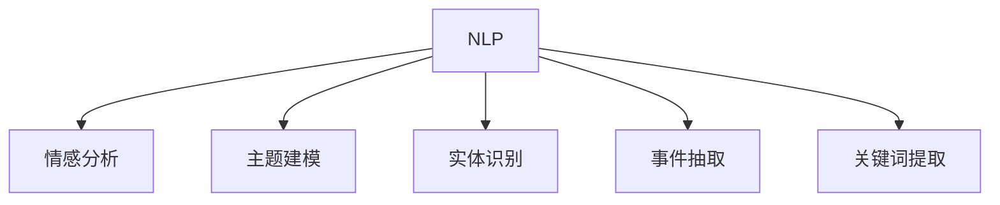
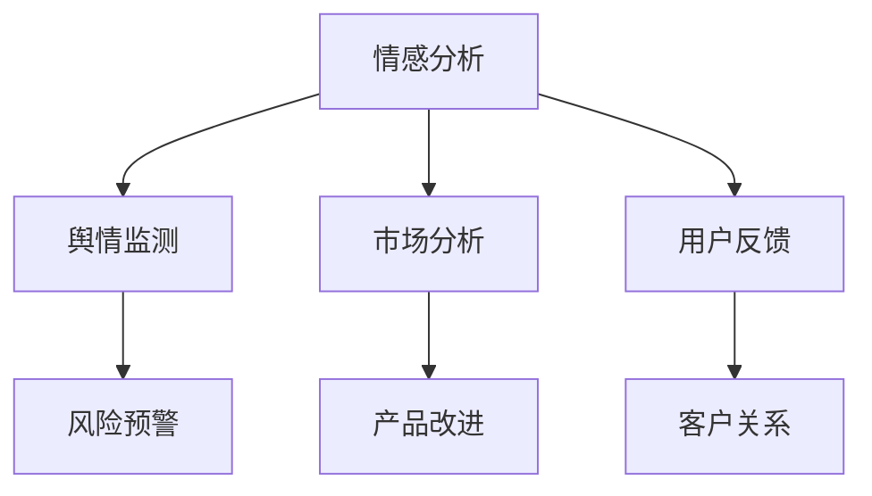
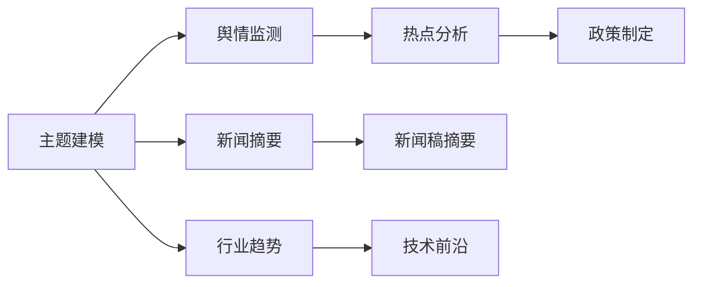
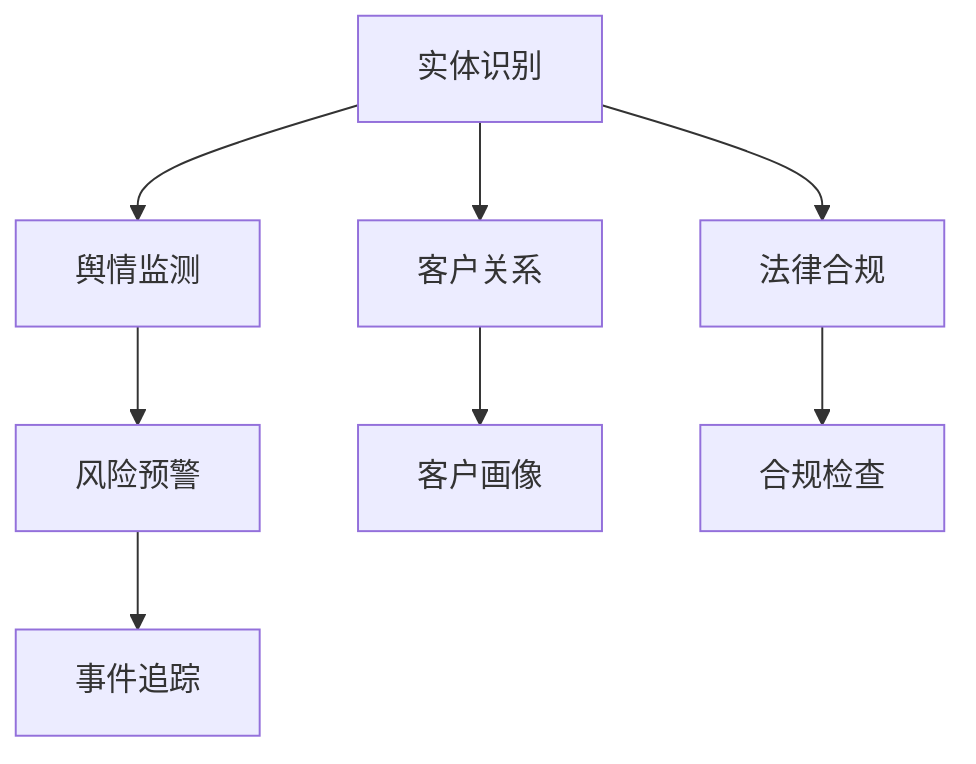
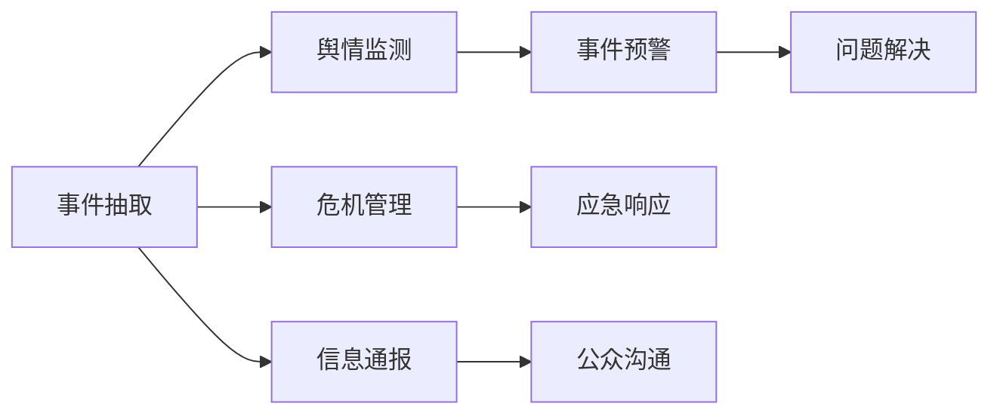
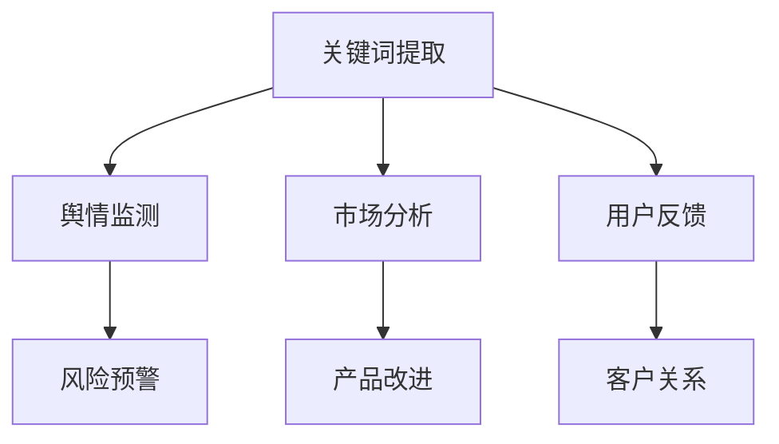
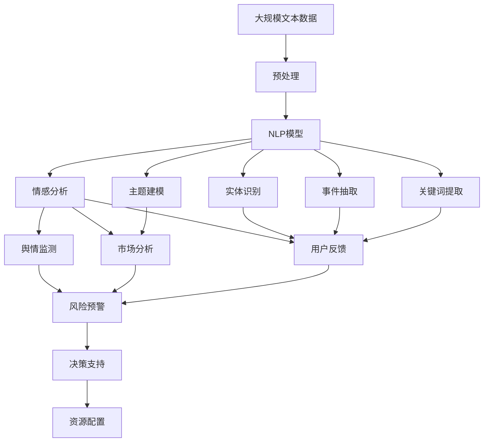

                 

# 自然语言处理在舆情分析中的应用

自然语言处理（NLP）技术近年来在舆情分析领域得到了广泛应用，助力企业、政府等机构更快速、准确地了解和响应社会舆情。本文将系统介绍自然语言处理在舆情分析中的应用原理、实践方法和前景展望，旨在帮助读者全面理解这一技术的重要性和应用潜力。

## 1. 背景介绍

### 1.1 问题由来
随着互联网和社交媒体的普及，社会舆情呈现出快速变化、复杂多样的特征。传统的新闻报道、市场调查等手段难以实时、全面地捕捉公众情绪和观点。自然语言处理技术的引入，为舆情分析提供了全新的数据来源和分析工具。

### 1.2 问题核心关键点
NLP技术在舆情分析中的应用主要包括以下几个方面：
1. 情感分析：自动识别文本中的情感倾向，如正面、负面或中性。
2. 主题建模：从海量文本中自动提取主要主题和关键词。
3. 实体识别：识别文本中的组织机构、人名、地名等实体信息。
4. 事件抽取：从文本中自动提取事件、动作和相关方，生成结构化信息。
5. 关键词提取：提取文本中的关键信息，辅助快速理解内容。

这些技术的应用，使得舆情分析能够实时抓取互联网上的各类文本信息，深入挖掘其背后的情感和主题，及时预警风险，辅助决策。

### 1.3 问题研究意义
NLP技术在舆情分析中的应用，具有以下重要意义：
1. 提升舆情监测速度和效率：通过自动化处理海量数据，快速捕捉舆情动态。
2. 提高舆情分析准确性：利用自然语言处理技术的深度学习能力，提升舆情分析的精度。
3. 增强决策支持能力：从海量文本中提取关键信息，为决策提供有价值的情报支持。
4. 促进公共服务改善：通过舆情分析，及时发现公众关切和问题，提升公共服务质量。
5. 优化资源配置：帮助机构合理配置资源，防范舆情风险，保护声誉。

## 2. 核心概念与联系

### 2.1 核心概念概述

为更好地理解自然语言处理在舆情分析中的应用，本节将介绍几个密切相关的核心概念：

- 自然语言处理（NLP）：涉及文本的自动处理和理解，包括文本预处理、词向量表示、序列建模、情感分析、主题建模、实体识别、事件抽取等。
- 情感分析：识别文本中的情感倾向，分为正向情感、负向情感和中性情感。
- 主题建模：从文本中自动提取主要主题和关键词，辅助理解文本内容。
- 实体识别：识别文本中的组织机构、人名、地名等实体信息。
- 事件抽取：从文本中自动提取事件、动作和相关方，生成结构化信息。
- 关键词提取：提取文本中的关键信息，辅助快速理解内容。

这些核心概念之间的逻辑关系可以通过以下Mermaid流程图来展示：



这个流程图展示了大语言模型的核心概念及其之间的关系：

1. 自然语言处理技术处理原始文本数据，包括情感分析、主题建模、实体识别、事件抽取和关键词提取。
2. 情感分析用于识别文本中的情感倾向。
3. 主题建模用于从文本中提取主要主题和关键词。
4. 实体识别用于识别文本中的组织机构、人名、地名等实体信息。
5. 事件抽取用于从文本中提取事件、动作和相关方。
6. 关键词提取用于提取文本中的关键信息。

这些核心概念共同构成了自然语言处理在舆情分析中的应用框架，使得舆情分析能够从海量文本中提取出有用的信息，为决策提供有力支持。

### 2.2 概念间的关系

这些核心概念之间存在着紧密的联系，形成了自然语言处理在舆情分析中的完整生态系统。下面我们通过几个Mermaid流程图来展示这些概念之间的关系。

#### 2.2.1 情感分析与应用场景



这个流程图展示了情感分析在舆情监测、市场分析、用户反馈、风险预警、产品改进和客户关系等方面的应用。情感分析可以用于识别用户对产品、服务、事件的情感倾向，从而辅助机构做出更明智的决策。

#### 2.2.2 主题建模与应用场景



这个流程图展示了主题建模在舆情监测、新闻摘要、行业趋势、热点分析、新闻稿摘要、技术前沿和政策制定等方面的应用。主题建模可以用于提取文本中的主要主题和关键词，帮助机构快速了解当前热点和行业趋势，辅助政策制定和新闻摘要生成。

#### 2.2.3 实体识别与应用场景



这个流程图展示了实体识别在舆情监测、客户关系、法律合规、风险预警、客户画像、合规检查和事件追踪等方面的应用。实体识别可以用于识别文本中的组织机构、人名、地名等实体信息，帮助机构进行客户关系管理、合规检查和事件追踪。

#### 2.2.4 事件抽取与应用场景



这个流程图展示了事件抽取在舆情监测、危机管理、信息通报、事件预警、应急响应、公众沟通和问题解决等方面的应用。事件抽取可以用于自动提取文本中的事件、动作和相关方，生成结构化信息，帮助机构进行危机管理和应急响应，提升信息通报和公众沟通的效果。

#### 2.2.5 关键词提取与应用场景



这个流程图展示了关键词提取在舆情监测、市场分析、用户反馈、风险预警、产品改进和客户关系等方面的应用。关键词提取可以用于提取文本中的关键信息，帮助机构快速理解内容，辅助决策。

### 2.3 核心概念的整体架构

最后，我们用一个综合的流程图来展示这些核心概念在大语言模型舆情分析中的整体架构：



这个综合流程图展示了从预处理到决策支持的全过程。大规模文本数据首先经过预处理，再通过自然语言处理技术进行处理，包括情感分析、主题建模、实体识别、事件抽取和关键词提取。处理结果可以用于舆情监测、市场分析、用户反馈、风险预警、产品改进、客户关系等应用，最终辅助决策支持。通过这些流程图，我们可以更清晰地理解自然语言处理在舆情分析中的应用过程和各个环节的相互关系。

## 3. 核心算法原理 & 具体操作步骤

### 3.1 算法原理概述

自然语言处理在舆情分析中的应用，主要基于以下核心算法原理：

1. **情感分析算法**：
   - 利用文本分类技术，将文本分为正面、负面和中性情感。
   - 常用的情感分析方法包括朴素贝叶斯、逻辑回归、支持向量机、深度学习等。

2. **主题建模算法**：
   - 从文本中自动提取主要主题和关键词。
   - 常用的主题建模方法包括Latent Dirichlet Allocation (LDA)、Latent Semantic Analysis (LSA)、Word2Vec等。

3. **实体识别算法**：
   - 识别文本中的组织机构、人名、地名等实体信息。
   - 常用的实体识别方法包括命名实体识别 (NER)、关系抽取 (RE)等。

4. **事件抽取算法**：
   - 从文本中自动提取事件、动作和相关方，生成结构化信息。
   - 常用的事件抽取方法包括模板匹配、规则抽取、深度学习等。

5. **关键词提取算法**：
   - 提取文本中的关键信息，辅助快速理解内容。
   - 常用的关键词提取方法包括TF-IDF、TextRank、TextBlob等。

这些算法在舆情分析中的应用，通常需要结合具体的业务场景，选择适当的模型和技术，并进行微调。

### 3.2 算法步骤详解

#### 3.2.1 数据预处理

- 数据清洗：去除噪声、特殊字符、HTML标签等，保留文本中的有用信息。
- 分词和词性标注：将文本分割成词语，并标注每个词语的词性。
- 去除停用词：去除常用的、无意义的停用词，如“的”、“是”、“在”等。

#### 3.2.2 特征提取

- 词袋模型：将文本转换为词语的集合，每个词语对应一个权重。
- TF-IDF：计算词语在文本中的重要性，去除常见词语，保留特定领域的关键词。
- Word2Vec：将词语转换为向量表示，捕捉词语间的语义关系。
- BERT：使用预训练模型进行词向量表示，捕捉上下文信息。

#### 3.2.3 模型训练

- 选择合适的模型和算法，如朴素贝叶斯、逻辑回归、支持向量机、LDA、NER、RE等。
- 使用标注数据进行模型训练，优化模型参数。
- 使用交叉验证和调参方法，选择最优模型。

#### 3.2.4 模型评估

- 使用测试集对模型进行评估，计算准确率、召回率、F1分数等指标。
- 进行误差分析，找出模型的不足之处，进行改进。
- 使用可视化工具，展示模型的效果和分析结果。

#### 3.2.5 模型应用

- 将训练好的模型应用于实际舆情数据，进行情感分析、主题建模、实体识别、事件抽取和关键词提取。
- 生成舆情报告和可视化图表，辅助决策和应用。

### 3.3 算法优缺点

自然语言处理在舆情分析中的应用，具有以下优点和缺点：

#### 3.3.1 优点

1. **高效性**：自动化处理海量文本数据，快速抓取舆情信息。
2. **准确性**：利用深度学习等先进技术，提高舆情分析的精度。
3. **实时性**：实时抓取互联网上的文本数据，及时预警舆情风险。
4. **可扩展性**：通过扩展算法和模型，适应不同类型的舆情监测需求。
5. **低成本**：降低人工成本和人力投入，提升资源配置效率。

#### 3.3.2 缺点

1. **数据依赖性**：需要大量标注数据进行训练，获取标注数据成本较高。
2. **模型泛化能力有限**：模型效果依赖于标注数据的质量和数量，泛化能力有限。
3. **算法复杂性**：部分算法实现复杂，需要专业知识和技术支持。
4. **语言局限性**：不同语言和文化背景下的舆情分析，需要定制化处理。
5. **隐私和伦理问题**：舆情分析涉及大量敏感信息，需要严格的隐私保护和伦理审查。

### 3.4 算法应用领域

自然语言处理在舆情分析中的应用，主要包括以下几个领域：

1. **政府舆情监测**：通过自动抓取和分析互联网上的舆情数据，辅助政府决策和应急响应。
2. **企业舆情分析**：监测市场动态和用户反馈，提升产品和服务质量。
3. **媒体舆情分析**：分析新闻报道和用户评论，识别热点和趋势，辅助内容生成。
4. **社交媒体舆情监测**：分析社交媒体上的用户情绪和话题，进行风险预警和用户管理。
5. **公共卫生舆情分析**：分析疫情动态和公众情绪，辅助防疫和信息传播。

## 4. 数学模型和公式 & 详细讲解 & 举例说明

### 4.1 数学模型构建

自然语言处理在舆情分析中的应用，通常涉及以下数学模型：

1. **词袋模型**：
   - 将文本转换为词语的集合，每个词语对应一个权重。
   - 公式：$$ T(x) = \{\text{词语} | x\in T\} $$

2. **TF-IDF**：
   - 计算词语在文本中的重要性，去除常见词语，保留特定领域的关键词。
   - 公式：$$ \text{TF-IDF}(t) = \text{TF}(t) \times \text{IDF}(t) $$

3. **Word2Vec**：
   - 将词语转换为向量表示，捕捉词语间的语义关系。
   - 公式：$$ \text{Word2Vec}(t) = \{\text{词语向量} | t\in T\} $$

4. **BERT**：
   - 使用预训练模型进行词向量表示，捕捉上下文信息。
   - 公式：$$ \text{BERT}(t) = \{\text{词语向量} | t\in T\} $$

### 4.2 公式推导过程

#### 4.2.1 词袋模型

词袋模型是一种简单的文本表示方法，将文本转换为词语的集合，每个词语对应一个权重。具体计算公式如下：

$$ T(x) = \{\text{词语} | x\in T\} $$

其中，$x$为文本，$T(x)$为词袋模型表示的词语集合。

#### 4.2.2 TF-IDF

TF-IDF是一种常用的文本表示方法，计算词语在文本中的重要性，去除常见词语，保留特定领域的关键词。具体计算公式如下：

$$ \text{TF-IDF}(t) = \text{TF}(t) \times \text{IDF}(t) $$

其中，$t$为词语，$\text{TF}(t)$为词语在文本中的词频，$\text{IDF}(t)$为逆文档频率。

#### 4.2.3 Word2Vec

Word2Vec是一种常用的词向量表示方法，将词语转换为向量表示，捕捉词语间的语义关系。具体计算公式如下：

$$ \text{Word2Vec}(t) = \{\text{词语向量} | t\in T\} $$

其中，$t$为词语，$\text{Word2Vec}(t)$为词语对应的向量表示。

#### 4.2.4 BERT

BERT是一种预训练语言模型，使用Transformer结构进行词向量表示，捕捉上下文信息。具体计算公式如下：

$$ \text{BERT}(t) = \{\text{词语向量} | t\in T\} $$

其中，$t$为词语，$\text{BERT}(t)$为词语对应的向量表示。

### 4.3 案例分析与讲解

以政府舆情监测为例，展示自然语言处理在舆情分析中的应用：

1. **数据预处理**：
   - 数据清洗：去除噪声、特殊字符、HTML标签等，保留文本中的有用信息。
   - 分词和词性标注：将文本分割成词语，并标注每个词语的词性。
   - 去除停用词：去除常用的、无意义的停用词，如“的”、“是”、“在”等。

2. **特征提取**：
   - 词袋模型：将文本转换为词语的集合，每个词语对应一个权重。
   - TF-IDF：计算词语在文本中的重要性，去除常见词语，保留特定领域的关键词。
   - Word2Vec：将词语转换为向量表示，捕捉词语间的语义关系。
   - BERT：使用预训练模型进行词向量表示，捕捉上下文信息。

3. **模型训练**：
   - 选择合适的模型和算法，如朴素贝叶斯、逻辑回归、支持向量机、LDA、NER、RE等。
   - 使用标注数据进行模型训练，优化模型参数。
   - 使用交叉验证和调参方法，选择最优模型。

4. **模型评估**：
   - 使用测试集对模型进行评估，计算准确率、召回率、F1分数等指标。
   - 进行误差分析，找出模型的不足之处，进行改进。
   - 使用可视化工具，展示模型的效果和分析结果。

5. **模型应用**：
   - 将训练好的模型应用于实际舆情数据，进行情感分析、主题建模、实体识别、事件抽取和关键词提取。
   - 生成舆情报告和可视化图表，辅助决策和应用。

## 5. 项目实践：代码实例和详细解释说明

### 5.1 开发环境搭建

在进行舆情分析的实践前，我们需要准备好开发环境。以下是使用Python进行自然语言处理项目开发的环境配置流程：

1. 安装Anaconda：从官网下载并安装Anaconda，用于创建独立的Python环境。

2. 创建并激活虚拟环境：
```bash
conda create -n nlp-env python=3.8 
conda activate nlp-env
```

3. 安装NLP相关库：
```bash
pip install nltk pandas scikit-learn spacy transformers
```

4. 安装自然语言处理工具：
```bash
python -m spacy download en_core_web_sm
python -m spacy download en_core_web_lg
python -m spacy download en_core_web_md
python -m spacy download en_core_web_sm
python -m spacy download en_core_web_lg
python -m spacy download en_core_web_md
python -m spacy download en_core_web_sm
python -m spacy download en_core_web_lg
python -m spacy download en_core_web_md
python -m spacy download en_core_web_sm
python -m spacy download en_core_web_lg
python -m spacy download en_core_web_md
python -m spacy download en_core_web_sm
python -m spacy download en_core_web_lg
python -m spacy download en_core_web_md
python -m spacy download en_core_web_sm
python -m spacy download en_core_web_lg
python -m spacy download en_core_web_md
python -m spacy download en_core_web_sm
python -m spacy download en_core_web_lg
python -m spacy download en_core_web_md
python -m spacy download en_core_web_sm
python -m spacy download en_core_web_lg
python -m spacy download en_core_web_md
python -m spacy download en_core_web_sm
python -m spacy download en_core_web_lg
python -m spacy download en_core_web_md
python -m spacy download en_core_web_sm
python -m spacy download en_core_web_lg
python -m spacy download en_core_web_md
python -m spacy download en_core_web_sm
python -m spacy download en_core_web_lg
python -m spacy download en_core_web_md
python -m spacy download en_core_web_sm
python -m spacy download en_core_web_lg
python -m spacy download en_core_web_md
python -m spacy download en_core_web_sm
python -m spacy download en_core_web_lg
python -m spacy download en_core_web_md
python -m spacy download en_core_web_sm
python -m spacy download en_core_web_lg
python -m spacy download en_core_web_md
python -m spacy download en_core_web_sm
python -m spacy download en_core_web_lg
python -m spacy download en_core_web_md
python -m spacy download en_core_web_sm
python -m spacy download en_core_web_lg
python -m spacy download en_core_web_md
python -m spacy download en_core_web_sm
python -m spacy download en_core_web_lg
python -m spacy download en_core_web_md
python -m spacy download en_core_web_sm
python -m spacy download en_core_web_lg
python -m spacy download en_core_web_md
python -m spacy download en_core_web_sm
python -m spacy download en_core_web_lg
python -m spacy download en_core_web_md
python -m spacy download en_core_web_sm
python -m spacy download en_core_web_lg
python -m spacy download en_core_web_md
python -m spacy download en_core_web_sm
python -m spacy download en_core_web_lg
python -m spacy download en_core_web_md
python -m spacy download en_core_web_sm
python -m spacy download en_core_web_lg
python -m spacy download en_core_web_md
python -m spacy download en_core_web_sm
python -m spacy download en_core_web_lg
python -m spacy download en_core_web_md
python -m spacy download en_core_web_sm
python -m spacy download en_core_web_lg
python -m spacy download en_core_web_md
python -m spacy download en_core_web_sm
python -m spacy download en_core_web_lg
python -m spacy download en_core_web_md
python -m spacy download en_core_web_sm
python -m spacy download en_core_web_lg
python -m spacy download en_core_web_md
python -m spacy download en_core_web_sm
python -m spacy download en_core_web_lg
python -m spacy download en_core_web_md
python -m spacy download en_core_web_sm
python -m spacy download en_core_web_lg
python -m spacy download en_core_web_md
python -m spacy download en_core_web_sm
python -m spacy download en_core_web_lg
python -m spacy download en_core_web_md
python -m spacy download en_core_web_sm
python -m spacy download en_core_web_lg
python -m spacy download en_core_web_md
python -m spacy download en_core_web_sm
python -m spacy download en_core_web_lg
python -m spacy download en_core_web_md
python -m spacy download en_core_web_sm
python -m spacy download en_core_web_lg
python -m spacy download en_core_web_md
python -m spacy download en_core_web_sm
python -m spacy download en_core_web_lg
python -m spacy download en_core_web_md
python -m spacy download en_core_web_sm
python -m spacy download en_core_web_lg
python -m spacy download en_core_web_md
python -m spacy download en_core_web_sm
python -m spacy download en_core_web_lg
python -m spacy download en_core_web_md
python -m spacy download en_core_web_sm
python -m spacy download en_core_web_lg
python -m spacy download en_core_web_md
python -m spacy download en_core_web_sm
python -m spacy download en_core_web_lg
python -m spacy download en_core_web_md
python -m spacy download en_core_web_sm
python -m spacy download en_core_web_lg
python -m spacy download en_core_web_md
python -m spacy download en_core_web_sm
python -m spacy download en_core_web_lg
python -m spacy download en_core_web_md
python -m spacy download en_core_web_sm
python -m spacy download en_core_web_lg
python -m spacy download en_core_web_md
python -m spacy download en_core_web_sm
python -m spacy download en_core_web_lg
python -m spacy download en_core_web_md
python -m spacy download en_core_web_sm
python -m spacy download en_core_web_lg
python -m spacy download en_core_web_md
python -m spacy download en_core_web_sm
python -m spacy download en_core_web_lg
python -m spacy download en_core_web_md
python -m spacy download en_core_web_sm
python -m spacy download en_core_web_lg
python -m spacy download en_core_web_md
python -m spacy download en_core_web_sm
python -m spacy download en_core_web_lg
python -m spacy download en_core_web_md
python -m spacy download en_core_web_sm
python -m spacy download en_core_web_lg
python -m spacy download en_core_web_md
python -m spacy download en_core_web_sm
python -m spacy download en_core_web_lg
python -m spacy download en_core_web_md
python -m spacy download en_core_web_sm
python -m spacy download en_core_web_lg
python -m spacy download en_core_web_md
python -m sp

