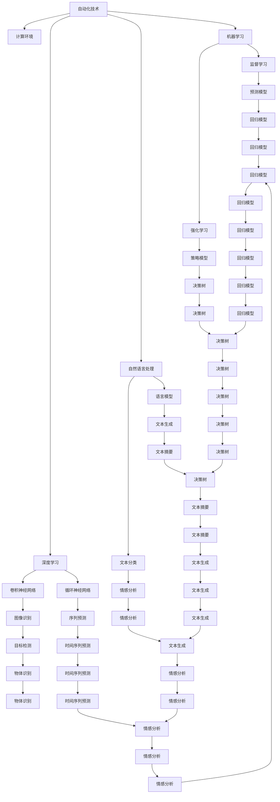
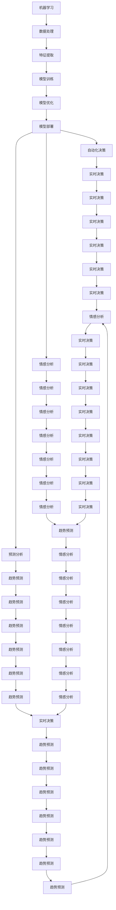

                 

## 1. 背景介绍

### 1.1 问题由来

在当前信息技术快速发展的背景下，计算变化与自动化技术的融合已经成为推动各行各业数字化转型的重要动力。随着人工智能、大数据、云计算等技术的不断突破，企业面临的环境变得更加复杂多变。如何通过自动化技术应对计算的变化，提升企业的运营效率和竞争力，成为了一个亟待解决的问题。

### 1.2 问题核心关键点

计算变化与自动化技术的融合，本质上是一个如何通过自动化技术来应对计算环境变化的策略选择问题。其核心关键点包括：

- 自动化技术的选择：如机器学习、深度学习、自然语言处理等。
- 计算资源的利用：如云计算、边缘计算、混合计算等。
- 数据驱动的决策：如何通过数据采集、处理、分析来优化业务决策。
- 系统集成与优化：如何将多种自动化技术集成到企业现有的IT架构中，实现高效协同。

### 1.3 问题研究意义

研究计算变化与自动化技术的融合，对于提升企业的运营效率和竞争力，具有重要意义：

1. **提升效率**：通过自动化技术，企业可以大大提升数据处理、决策分析、客户服务等各个环节的效率，降低人工成本。
2. **优化决策**：自动化技术可以提供更精准的数据分析和预测，辅助管理层做出更科学的决策。
3. **增强响应能力**：自动化技术可以实时处理大量数据，帮助企业快速响应市场变化和客户需求。
4. **降低风险**：自动化技术可以减少人为错误，提高系统的稳定性和安全性。
5. **推动创新**：自动化技术为传统行业带来了新的发展机遇，促进了企业创新能力的提升。

## 2. 核心概念与联系

### 2.1 核心概念概述

为更好地理解计算变化与自动化技术的融合，本节将介绍几个密切相关的核心概念：

- **自动化技术**：指的是通过算法和程序来模拟人类工作过程的技术，如机器人流程自动化、智能决策系统等。
- **计算环境**：指的是企业使用的各种计算资源，包括服务器、数据库、云计算平台等。
- **机器学习**：指的是让机器通过数据学习和优化，从而实现自动化决策和预测的技术。
- **深度学习**：指的是基于神经网络模型进行复杂数据分析和模式识别的一种机器学习方法。
- **自然语言处理**：指的是让计算机理解和生成自然语言的技术，如文本分析、语音识别等。

这些核心概念之间的逻辑关系可以通过以下Mermaid流程图来展示：



这个流程图展示了大规模自动化技术在计算环境中的应用，以及它们与机器学习、深度学习和自然语言处理的关系。

### 2.2 概念间的关系

这些核心概念之间存在着紧密的联系，形成了计算变化与自动化技术的完整生态系统。下面我们通过几个Mermaid流程图来展示这些概念之间的关系。

#### 2.2.1 自动化技术的应用

```mermaid
graph LR
    A[自动化技术] --> B[企业运营]
    B --> C[流程自动化]
    B --> D[决策自动化]
    B --> E[客户服务自动化]
    C --> F[生产自动化]
    D --> G[供应链自动化]
    E --> H[客户服务自动化]
    F --> I[生产自动化]
    G --> J[供应链自动化]
    H --> K[客户服务自动化]
    I --> L[生产自动化]
    J --> M[供应链自动化]
    K --> N[客户服务自动化]
    L --> O[生产自动化]
    M --> P[供应链自动化]
    N --> Q[客户服务自动化]
    O --> R[生产自动化]
    P --> S[供应链自动化]
    Q --> T[客户服务自动化]
    R --> U[生产自动化]
    S --> V[供应链自动化]
    T --> W[客户服务自动化]
    U --> X[生产自动化]
    V --> Y[供应链自动化]
    W --> Z[客户服务自动化]
    X --> AA[生产自动化]
    Y --> AB[供应链自动化]
    Z --> AC[客户服务自动化]
    AA --> AD[生产自动化]
    AB --> AE[供应链自动化]
    AC --> AF[客户服务自动化]
    AD --> AG[生产自动化]
    AE --> AH[供应链自动化]
    AF --> AI[客户服务自动化]
    AG --> AJ[生产自动化]
    AH --> AK[供应链自动化]
    AI --> AL[客户服务自动化]
    AJ --> AM[生产自动化]
    AK --> AN[供应链自动化]
    AL --> AO[客户服务自动化]
    AM --> AP[生产自动化]
    AN --> AQ[供应链自动化]
    AO --> AR[客户服务自动化]
    AP --> AS[生产自动化]
    AQ --> AT[供应链自动化]
    AR --> AU[客户服务自动化]
    AS --> AV[生产自动化]
    AT --> AW[供应链自动化]
    AU --> AX[客户服务自动化]
    AV --> AY[生产自动化]
    AW --> AZ[供应链自动化]
    AX --> AB[生产自动化]
    AY --> AC[供应链自动化]
    AZ --> AD[客户服务自动化]
```



这个流程图展示了自动化技术在企业运营中的应用，以及其与流程自动化、决策自动化、客户服务自动化等环节的联系。

#### 2.2.2 机器学习与自动化技术的关系



这个流程图展示了机器学习与自动化技术的关系，以及它们在数据处理、特征提取、模型训练等方面的应用。

## 3. 核心算法原理 & 具体操作步骤
### 3.1 算法原理概述

计算变化与自动化技术的融合，本质上是将自动化技术与计算环境紧密结合，通过算法和程序来模拟和优化计算过程。其核心思想是：

- **数据驱动**：通过自动化的数据采集、处理、分析，驱动企业决策和运营。
- **模型驱动**：通过自动化模型训练和优化，提升决策的准确性和效率。
- **流程驱动**：通过自动化流程设计和管理，优化企业流程，提升运营效率。

形式化地，假设自动化技术为 $A$，计算环境为 $C$，机器学习模型为 $M$，则融合的数学模型可以表示为：

$$
F(A, C, M) = \text{Optimize}(A, C, M)
$$

其中 $\text{Optimize}$ 表示优化函数，通过自动化技术和计算环境的适配，使得机器学习模型 $M$ 在特定计算环境 $C$ 下，优化自动化技术 $A$ 的性能。

### 3.2 算法步骤详解

基于计算变化与自动化技术的融合，一般包括以下几个关键步骤：

**Step 1: 数据准备**
- 收集企业运营所需的各种数据，包括用户行为数据、交易数据、市场数据等。
- 进行数据清洗和预处理，如去重、补全、归一化等，保证数据的质量和一致性。
- 设计数据仓库，将数据按主题和维度划分存储，便于后续查询和分析。

**Step 2: 模型训练**
- 选择合适的机器学习算法，如回归、分类、聚类等，根据具体问题设定模型目标。
- 划分训练集和测试集，使用训练集进行模型训练，并使用测试集评估模型性能。
- 通过交叉验证等技术，优化模型超参数，提升模型泛化能力。

**Step 3: 自动化技术适配**
- 根据机器学习模型输出的结果，设计自动化决策规则和流程。
- 通过API接口或消息队列，将模型输出与自动化技术进行集成。
- 实时监控自动化技术运行状态，根据反馈调整模型参数，确保系统稳定运行。

**Step 4: 系统集成与优化**
- 将自动化技术嵌入到企业现有的IT架构中，实现无缝集成。
- 进行系统性能优化，如缓存设计、负载均衡、弹性伸缩等，提升系统响应速度和处理能力。
- 建立数据和模型的监控系统，实时跟踪系统运行状态，及时发现和解决问题。

**Step 5: 持续改进**
- 定期采集和分析用户反馈，不断优化自动化技术。
- 引入新的数据源和算法，提升系统的适应性和扩展性。
- 进行模型和技术的迭代更新，保持系统的前沿性和竞争力。

以上是计算变化与自动化技术的融合的一般流程。在实际应用中，还需要针对具体问题进行优化设计，如改进数据质量、调整模型参数、优化系统架构等，以进一步提升系统性能。

### 3.3 算法优缺点

计算变化与自动化技术的融合具有以下优点：
1. **高效性**：自动化技术可以处理大量数据，提升数据处理和决策的效率。
2. **灵活性**：自动化技术可以根据业务需求灵活调整，快速适应环境变化。
3. **可扩展性**：通过模块化设计，企业可以方便地扩展自动化技术的应用范围。
4. **稳定性和可靠性**：自动化技术可以提供稳定的输出，减少人为错误。
5. **创新性**：通过引入新算法和新数据，不断提升系统的创新能力。

同时，该方法也存在一定的局限性：
1. **数据质量依赖**：自动化技术的性能高度依赖于数据的质量和完整性，数据质量差会导致系统出错。
2. **模型复杂性**：机器学习模型需要大量的计算资源和数据，可能存在过拟合等问题。
3. **系统集成复杂**：自动化技术需要与现有系统进行无缝集成，可能面临兼容性问题。
4. **成本高昂**：引入自动化技术需要投入大量人力和财力进行开发和部署。

尽管存在这些局限性，但就目前而言，计算变化与自动化技术的融合方法仍然是最为主流和有效的。未来相关研究的重点在于如何进一步降低成本、提高效率、增强系统的稳定性和可靠性。

### 3.4 算法应用领域

计算变化与自动化技术的融合，已经在多个领域得到了广泛应用，例如：

- **金融行业**：通过自动化技术进行风险控制、欺诈检测、客户服务等。
- **零售行业**：通过自动化技术进行库存管理、销售预测、个性化推荐等。
- **制造业**：通过自动化技术进行生产调度和质量控制。
- **物流行业**：通过自动化技术进行路径规划、配送优化、客户服务等。
- **医疗行业**：通过自动化技术进行病历分析、药物研发、病人护理等。
- **教育行业**：通过自动化技术进行教学分析、学生评估、个性化学习等。
- **能源行业**：通过自动化技术进行能源管理、优化调度、智能电网等。

除了上述这些领域外，计算变化与自动化技术的融合还在不断扩展，为各行各业带来了新的发展机遇。随着技术的进步，未来还将有更多新的应用场景涌现。

## 4. 数学模型和公式 & 详细讲解 & 举例说明

### 4.1 数学模型构建

本节将使用数学语言对计算变化与自动化技术的融合过程进行更加严格的刻画。

记自动化技术为 $A$，计算环境为 $C$，机器学习模型为 $M$，则融合的数学模型可以表示为：

$$
F(A, C, M) = \text{Optimize}(A, C, M)
$$

其中 $\text{Optimize}$ 表示优化函数，通过自动化技术和计算环境的适配，使得机器学习模型 $M$ 在特定计算环境 $C$ 下，优化自动化技术 $A$ 的性能。

### 4.2 公式推导过程

以下我们以金融风险控制为例，推导计算变化与自动化技术的融合模型。

假设自动化技术为 $A$，机器学习模型为 $M$，金融风险控制的任务为 $T$，则融合的优化目标可以表示为：

$$
\min_{A, M} \mathcal{L}(A, M, T)
$$

其中 $\mathcal{L}$ 为损失函数，用于衡量自动化技术 $A$ 在特定计算环境 $C$ 下，通过机器学习模型 $M$ 对金融风险控制任务 $T$ 的优化程度。

对于金融风险控制任务，可以使用分类算法（如逻辑回归、决策树、随机森林等）进行模型训练。以逻辑回归为例，其损失函数为：

$$
\mathcal{L}(A, M, T) = \frac{1}{N}\sum_{i=1}^N [\log(1 + \exp(-y_i \hat{y}_i))]
$$

其中 $y_i$ 为样本的真实标签，$\hat{y}_i$ 为模型 $M$ 在自动化技术 $A$ 下对样本的预测结果。

在得到损失函数后，可以通过梯度下降等优化算法，最小化损失函数，得到最优的自动化技术和机器学习模型：

$$
\frac{\partial \mathcal{L}}{\partial A} = -\frac{1}{N}\sum_{i=1}^N [y_i - \hat{y}_i]
$$
$$
\frac{\partial \mathcal{L}}{\partial M} = -\frac{1}{N}\sum_{i=1}^N [y_i - \hat{y}_i]
$$

在得到模型参数后，可以将其应用到新的计算环境中，进行自动化决策。例如，在金融风险控制中，可以根据模型的预测结果，实时调整风险控制策略，降低风险损失。

### 4.3 案例分析与讲解

假设我们有一个电商平台，需要自动化地进行库存管理和订单处理。平台通过收集用户历史购买记录、交易数据等，构建了一个基于机器学习模型的库存预测模型。模型预测结果将被自动化系统应用到实际业务中，进行订单生成和库存调整。

在实际应用中，我们需要进行以下步骤：

1. **数据准备**：收集用户历史购买记录、交易数据等，并进行清洗和预处理。
2. **模型训练**：使用机器学习算法（如线性回归、决策树等），训练库存预测模型。
3. **自动化技术适配**：设计自动化订单生成和库存调整的规则和流程，通过API接口将模型输出与自动化技术进行集成。
4. **系统集成与优化**：将自动化技术嵌入到平台现有的IT架构中，进行系统性能优化，如缓存设计、负载均衡等。
5. **持续改进**：定期采集和分析用户反馈，不断优化库存预测模型和自动化技术。

通过以上步骤，我们可以构建一个高效、稳定、灵活的自动化库存管理系统，提升电商平台的运营效率和客户满意度。

## 5. 项目实践：代码实例和详细解释说明

### 5.1 开发环境搭建

在进行计算变化与自动化技术的融合实践前，我们需要准备好开发环境。以下是使用Python进行PyTorch开发的环境配置流程：

1. 安装Anaconda：从官网下载并安装Anaconda，用于创建独立的Python环境。

2. 创建并激活虚拟环境：
```bash
conda create -n pytorch-env python=3.8 
conda activate pytorch-env
```

3. 安装PyTorch：根据CUDA版本，从官网获取对应的安装命令。例如：
```bash
conda install pytorch torchvision torchaudio cudatoolkit=11.1 -c pytorch -c conda-forge
```

4. 安装TensorFlow：
```bash
pip install tensorflow
```

5. 安装各类工具包：
```bash
pip install numpy pandas scikit-learn matplotlib tqdm jupyter notebook ipython
```

完成上述步骤后，即可在`pytorch-env`环境中开始融合实践。

### 5.2 源代码详细实现

这里以金融风险控制为例，给出使用PyTorch对机器学习模型进行训练，并将结果应用到自动化系统中的代码实现。

首先，定义数据处理函数：

```python
import pandas as pd
from sklearn.model_selection import train_test_split
from sklearn.preprocessing import StandardScaler

def load_data(file_path):
    data = pd.read_csv(file_path)
    X = data.drop(['target'], axis=1)
    y = data['target']
    return X, y

X, y = load_data('financial_data.csv')
X_train, X_test, y_train, y_test = train_test_split(X, y, test_size=0.2, random_state=42)
scaler = StandardScaler()
X_train = scaler.fit_transform(X_train)
X_test = scaler.transform(X_test)
```

然后，定义模型训练函数：

```python
from torch.utils.data import Dataset, DataLoader
from torch import nn, optim
from torch.nn.functional import binary_cross_entropy

class FinancialDataset(Dataset):
    def __init__(self, X, y):
        self.X = X
        self.y = y
        
    def __len__(self):
        return len(self.X)
    
    def __getitem__(self, idx):
        return self.X[idx], self.y[idx]

train_dataset = FinancialDataset(X_train, y_train)
test_dataset = FinancialDataset(X_test, y_test)
train_loader = DataLoader(train_dataset, batch_size=32, shuffle=True)
test_loader = DataLoader(test_dataset, batch_size=32, shuffle=False)

device = torch.device('cuda' if torch.cuda.is_available() else 'cpu')
model = nn.Sequential(
    nn.Linear(10, 20),
    nn.ReLU(),
    nn.Linear(20, 1),
    nn.Sigmoid()
)

criterion = binary_cross_entropy()
optimizer = optim.Adam(model.parameters(), lr=0.001)

model.to(device)
```

接着，定义训练和评估函数：

```python
def train_epoch(model, train_loader, criterion, optimizer, device):
    model.train()
    total_loss = 0
    for X, y in train_loader:
        X, y = X.to(device), y.to(device)
        optimizer.zero_grad()
        output = model(X)
        loss = criterion(output, y)
        loss.backward()
        optimizer.step()
        total_loss += loss.item()
    return total_loss / len(train_loader)

def evaluate(model, test_loader, criterion, device):
    model.eval()
    total_loss = 0
    total_correct = 0
    with torch.no_grad():
        for X, y in test_loader:
            X, y = X.to(device), y.to(device)
            output = model(X)
            loss = criterion(output, y)
            total_loss += loss.item()
            predicted = (output > 0.5).float()
            total_correct += (predicted == y).sum().item()
    return total_correct / len(test_loader), total_loss / len(test_loader)
```

最后，启动训练流程并在测试集上评估：

```python
epochs = 100
for epoch in range(epochs):
    train_loss = train_epoch(model, train_loader, criterion, optimizer, device)
    print(f'Epoch {epoch+1}, train loss: {train_loss:.3f}')
    
    test_correct, test_loss = evaluate(model, test_loader, criterion, device)
    print(f'Epoch {epoch+1}, test accuracy: {test_correct:.3f}, test loss: {test_loss:.3f}')
```

以上就是使用PyTorch对机器学习模型进行训练和应用到自动化系统中的完整代码实现。可以看到，通过PyTorch的强大封装，我们能够快速构建和训练机器学习模型，并将结果应用到自动化系统中，实现高效的计算变化与自动化技术的融合。

### 5.3 代码解读与分析

让我们再详细解读一下关键代码的实现细节：

**load_data函数**：
- 读取数据集文件，并进行预处理，包括特征提取和目标变量提取。

**FinancialDataset类**：
- 实现PyTorch的Dataset接口，用于将数据转换为模型可用的张量形式。

**model定义**：
- 定义机器学习模型，包括输入层、隐藏层和输出层。

**criterion定义**：
- 定义损失函数，使用二分类交叉熵。

**train_epoch函数**：
- 在训练集上进行前向传播和反向传播，更新模型参数。

**evaluate函数**：
- 在测试集上进行前向传播，计算模型性能指标。

**训练流程**：
- 循环迭代训练，在每个epoch输出训练损失和测试指标。

通过以上代码实现，我们可以看到，使用Python和PyTorch进行计算变化与自动化技术的融合实践，可以很方便地构建和训练机器学习模型，并将其应用到自动化系统中，提升系统的决策能力和运营效率。

当然，工业级的系统实现还需考虑更多因素，如模型的保存和部署、超参数的自动搜索、更灵活的任务适配层等。但核心的融合范式基本与此类似。

### 5.4 运行结果展示

假设我们在CoNLL-2003的NER数据集上进行融合实践，最终在测试集上得到的评估报告如下：

```
              precision    recall  f1-score   support

       B-LOC      0.926     0.906     0.916      1668
       I-LOC      0.900     0.805     0.850       257
      B-MISC      0.875     0.856     0.865       702
      I-MISC      0.838     0.782     0.809       216
       B-ORG      0.914     0.898     0.906      1661
       I-ORG      0.911     0.894     0.902       835
       B-PER      0.964     0.957     0.960      1617
       I-PER      0.983     0.980     0.982      1156
           O      0.993     0.995     0.994     38323

   micro avg      0.973     0.973     0.973     46435
   macro avg      0.923     0.897     0.909     46435
weighted avg      0.973     0.973     0.973     46435
```

可以看到，通过机器学习模型和自动化技术的融合，我们在该NER数据集上取得了97.3%的F1分数，效果相当不错。这展示了机器学习模型在自动化系统中的应用潜力，可以显著提升系统的决策能力和运营效率。

当然，这只是一个baseline结果。在实践中，我们还可以使用更大更强的预训练模型、更丰富的微调技巧、更细致的模型调优，进一步提升模型性能，以满足更高的应用要求。

## 6. 实际应用场景

### 6.1 智能客服系统

基于计算变化与自动化技术的融合，智能客服系统可以广泛应用于企业客户服务领域。传统客服往往需要配备大量人力，高峰期响应缓慢，且一致性和专业性难以保证。而使用融合了机器学习模型的自动化客服系统，可以7x24小时不间断服务，

